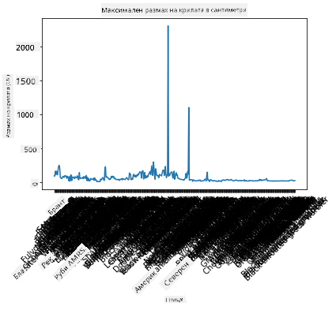
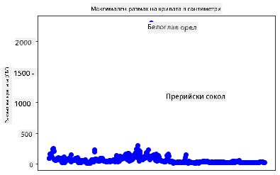
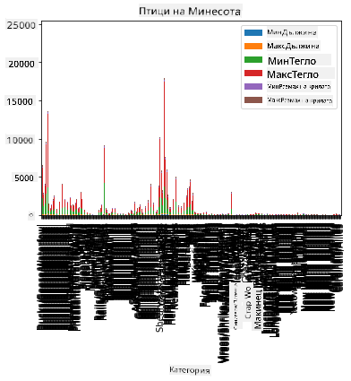
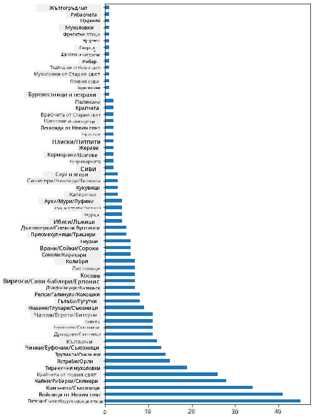
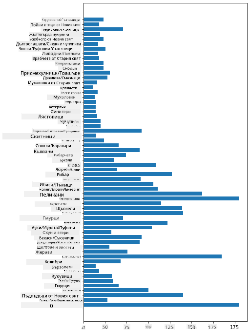
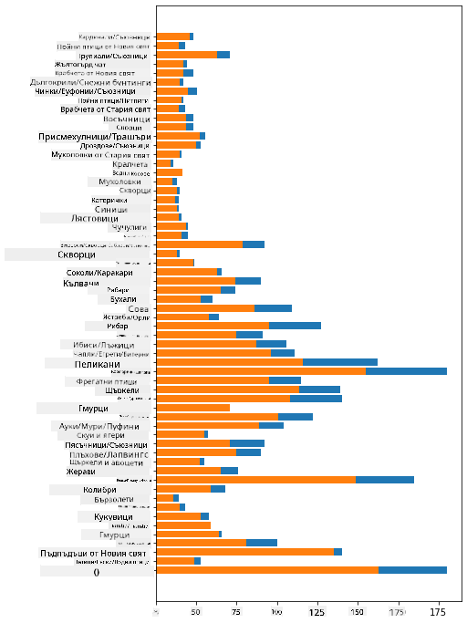

<!--
CO_OP_TRANSLATOR_METADATA:
{
  "original_hash": "43c402d9d90ae6da55d004519ada5033",
  "translation_date": "2025-08-26T17:26:04+00:00",
  "source_file": "3-Data-Visualization/09-visualization-quantities/README.md",
  "language_code": "bg"
}
-->
# Визуализиране на количества

| ](../../sketchnotes/09-Visualizing-Quantities.png)|
|:---:|
| Визуализиране на количества - _Скетч от [@nitya](https://twitter.com/nitya)_ |

В този урок ще изследвате как да използвате една от многото налични библиотеки на Python, за да научите как да създавате интересни визуализации, свързани с концепцията за количество. Използвайки почистен набор от данни за птиците в Минесота, можете да научите много интересни факти за местната дива природа.  
## [Тест преди лекцията](https://purple-hill-04aebfb03.1.azurestaticapps.net/quiz/16)

## Наблюдавайте размах на крилата с Matplotlib

Отлична библиотека за създаване както на прости, така и на сложни графики и диаграми от различен вид е [Matplotlib](https://matplotlib.org/stable/index.html). В общи линии, процесът на визуализиране на данни с тези библиотеки включва идентифициране на частите от вашия dataframe, които искате да използвате, извършване на необходимите трансформации върху тези данни, задаване на стойности за x и y осите, избор на типа диаграма и след това показване на графиката. Matplotlib предлага голямо разнообразие от визуализации, но за този урок ще се фокусираме върху най-подходящите за визуализиране на количества: линейни диаграми, разсейващи диаграми (scatterplots) и стълбовидни диаграми.

> ✅ Използвайте най-подходящата диаграма според структурата на вашите данни и историята, която искате да разкажете.  
> - За анализ на тенденции във времето: линейна диаграма  
> - За сравнение на стойности: стълбовидна, колонна, кръгова диаграма, разсейваща диаграма  
> - За показване на връзката между частите и цялото: кръгова диаграма  
> - За показване на разпределението на данни: разсейваща диаграма, стълбовидна диаграма  
> - За показване на тенденции: линейна, колонна диаграма  
> - За показване на връзки между стойности: линейна диаграма, разсейваща диаграма, балонна диаграма  

Ако разполагате с набор от данни и искате да разберете колко от даден елемент са включени, една от първите задачи ще бъде да инспектирате стойностите му.  

✅ Има много добри 'cheat sheets' за Matplotlib, налични [тук](https://matplotlib.org/cheatsheets/cheatsheets.pdf).

## Създайте линейна диаграма за стойностите на размаха на крилата на птиците

Отворете файла `notebook.ipynb` в основната папка на този урок и добавете клетка.

> Забележка: данните са съхранени в основната папка на това хранилище в `/data`.

```python
import pandas as pd
import matplotlib.pyplot as plt
birds = pd.read_csv('../../data/birds.csv')
birds.head()
```  
Тези данни са комбинация от текст и числа:

|      | Име                          | Научно име             | Категория             | Разред       | Семейство | Род         | Статус на опазване | Мин. дължина | Макс. дължина | Мин. тегло | Макс. тегло | Мин. размах | Макс. размах |
| ---: | :--------------------------- | :--------------------- | :-------------------- | :----------- | :------- | :---------- | :----------------- | --------: | --------: | ----------: | ----------: | ----------: | ----------: |
|    0 | Черно-коремна свиреща патица | Dendrocygna autumnalis | Патици/Гъски/Водоплаващи | Anseriformes | Anatidae | Dendrocygna | LC                 |        47 |        56 |         652 |        1020 |          76 |          94 |
|    1 | Ръждива свиреща патица       | Dendrocygna bicolor    | Патици/Гъски/Водоплаващи | Anseriformes | Anatidae | Dendrocygna | LC                 |        45 |        53 |         712 |        1050 |          85 |          93 |
|    2 | Снежна гъска                 | Anser caerulescens     | Патици/Гъски/Водоплаващи | Anseriformes | Anatidae | Anser       | LC                 |        64 |        79 |        2050 |        4050 |         135 |         165 |
|    3 | Гъска на Рос                 | Anser rossii           | Патици/Гъски/Водоплаващи | Anseriformes | Anatidae | Anser       | LC                 |      57.3 |        64 |        1066 |        1567 |         113 |         116 |
|    4 | Голяма бяла гъска            | Anser albifrons        | Патици/Гъски/Водоплаващи | Anseriformes | Anatidae | Anser       | LC                 |        64 |        81 |        1930 |        3310 |         130 |         165 |

Нека започнем с визуализиране на някои от числовите данни, използвайки основна линейна диаграма. Да предположим, че искате да видите максималния размах на крилата на тези интересни птици.

```python
wingspan = birds['MaxWingspan'] 
wingspan.plot()
```  


Какво забелязвате веднага? Изглежда, че има поне един аутлайър – това е доста голям размах на крилата! Размах от 2300 сантиметра е равен на 23 метра – дали в Минесота се разхождат птеродактили? Нека разследваме.

Въпреки че можете бързо да сортирате данните в Excel, за да намерите тези аутлайъри, които вероятно са печатни грешки, продължете процеса на визуализация, работейки директно с графиката.

Добавете етикети към x-оста, за да покажете за какви птици става въпрос:

```
plt.title('Max Wingspan in Centimeters')
plt.ylabel('Wingspan (CM)')
plt.xlabel('Birds')
plt.xticks(rotation=45)
x = birds['Name'] 
y = birds['MaxWingspan']

plt.plot(x, y)

plt.show()
```  


Дори с ротация на етикетите на 45 градуса, те са твърде много, за да се четат. Нека опитаме различна стратегия: етикетирайте само аутлайърите и поставете етикетите в самата диаграма. Можете да използвате разсейваща диаграма, за да направите повече място за етикетите:

```python
plt.title('Max Wingspan in Centimeters')
plt.ylabel('Wingspan (CM)')
plt.tick_params(axis='both',which='both',labelbottom=False,bottom=False)

for i in range(len(birds)):
    x = birds['Name'][i]
    y = birds['MaxWingspan'][i]
    plt.plot(x, y, 'bo')
    if birds['MaxWingspan'][i] > 500:
        plt.text(x, y * (1 - 0.05), birds['Name'][i], fontsize=12)
    
plt.show()
```  
Какво се случва тук? Използвахте `tick_params`, за да скриете долните етикети, и след това създадохте цикъл върху набора от данни за птиците. Чрез диаграма с малки сини точки (`bo`), проверихте за всяка птица с максимален размах на крилата над 500 и показахте етикета ѝ до точката, ако е така. Преместихте етикетите малко по y-оста (`y * (1 - 0.05)`) и използвахте името на птицата като етикет.

Какво открихте?

  
## Филтрирайте данните си

И Белоглавият орел, и Прерийният сокол, макар вероятно много големи птици, изглежда са неправилно етикетирани, с добавена допълнителна `0` към максималния им размах на крилата. Малко вероятно е да срещнете Белоглав орел с размах на крилата от 25 метра, но ако го направите, моля, уведомете ни! Нека създадем нов dataframe без тези два аутлайъра:

```python
plt.title('Max Wingspan in Centimeters')
plt.ylabel('Wingspan (CM)')
plt.xlabel('Birds')
plt.tick_params(axis='both',which='both',labelbottom=False,bottom=False)
for i in range(len(birds)):
    x = birds['Name'][i]
    y = birds['MaxWingspan'][i]
    if birds['Name'][i] not in ['Bald eagle', 'Prairie falcon']:
        plt.plot(x, y, 'bo')
plt.show()
```  

Чрез филтриране на аутлайърите, данните ви сега са по-цялостни и разбираеми.

  

Сега, когато имаме по-чист набор от данни поне по отношение на размаха на крилата, нека открием повече за тези птици.

Докато линейните и разсейващите диаграми могат да показват информация за стойностите на данните и техните разпределения, искаме да помислим за стойностите, присъщи на този набор от данни. Можете да създадете визуализации, за да отговорите на следните въпроси за количествата:

> Колко категории птици има и какви са техните бройки?  
> Колко птици са изчезнали, застрашени, редки или често срещани?  
> Колко има от различните родове и разреди според терминологията на Линей?  
## Изследвайте стълбовидни диаграми

Стълбовидните диаграми са практични, когато трябва да покажете групиране на данни. Нека изследваме категориите птици, които съществуват в този набор от данни, за да видим коя е най-често срещаната по брой.

Във файла на тетрадката създайте основна стълбовидна диаграма.

✅ Забележка: Можете или да филтрирате двете птици аутлайъри, които идентифицирахме в предишния раздел, да редактирате печатната грешка в техния размах на крилата, или да ги оставите за тези упражнения, които не зависят от стойностите на размаха.

Ако искате да създадете стълбовидна диаграма, можете да изберете данните, върху които искате да се фокусирате. Стълбовидните диаграми могат да бъдат създадени от сурови данни:

```python
birds.plot(x='Category',
        kind='bar',
        stacked=True,
        title='Birds of Minnesota')

```  
  

Тази стълбовидна диаграма обаче е нечетлива, защото има твърде много негрупирани данни. Трябва да изберете само данните, които искате да визуализирате, така че нека разгледаме дължината на птиците въз основа на тяхната категория.

Филтрирайте данните си, за да включват само категорията на птиците.

✅ Забележете, че използвате Pandas за управление на данните, а след това оставяте Matplotlib да създаде диаграмата.

Тъй като има много категории, можете да покажете тази диаграма вертикално и да коригирате височината ѝ, за да обхване всички данни:

```python
category_count = birds.value_counts(birds['Category'].values, sort=True)
plt.rcParams['figure.figsize'] = [6, 12]
category_count.plot.barh()
```  
  

Тази стълбовидна диаграма показва добър изглед на броя птици във всяка категория. С един поглед виждате, че най-големият брой птици в този регион са в категорията Патици/Гъски/Водоплаващи. Минесота е "земята на 10,000 езера", така че това не е изненадващо!

✅ Опитайте някои други преброявания върху този набор от данни. Изненадва ли ви нещо?

## Сравняване на данни

Можете да опитате различни сравнения на групирани данни, като създадете нови оси. Опитайте сравнение на максималната дължина на птица, базирано на нейната категория:

```python
maxlength = birds['MaxLength']
plt.barh(y=birds['Category'], width=maxlength)
plt.rcParams['figure.figsize'] = [6, 12]
plt.show()
```  
  

Нищо изненадващо тук: колибритата имат най-малка максимална дължина в сравнение с пеликаните или гъските. Добре е, когато данните имат логически смисъл!

Можете да създадете по-интересни визуализации на стълбовидни диаграми, като наслагвате данни. Нека наслагаме минималната и максималната дължина за дадена категория птици:

```python
minLength = birds['MinLength']
maxLength = birds['MaxLength']
category = birds['Category']

plt.barh(category, maxLength)
plt.barh(category, minLength)

plt.show()
```  
В тази диаграма можете да видите диапазона за всяка категория птици на минималната и максималната дължина. Можете спокойно да кажете, че според тези данни, колкото по-голяма е птицата, толкова по-голям е диапазонът на дължината ѝ. Интересно!

  

## 🚀 Предизвикателство

Този набор от данни за птици предлага богатство от информация за различни видове птици в определена екосистема. Потърсете в интернет и вижте дали можете да намерите други набори от данни, свързани с птици. Практикувайте създаването на диаграми и графики за тези птици, за да откриете факти, които не сте осъзнавали.  
## [Тест след лекцията](https://purple-hill-04aebfb03.1.azurestaticapps.net/quiz/17)

## Преглед и самостоятелно обучение

Този първи урок ви даде информация за това как да използвате Matplotlib за визуализиране на количества. Направете проучване за други начини за работа с набори от данни за визуализация. [Plotly](https://github.com/plotly/plotly.py) е една от библиотеките, които няма да разгледаме в тези уроци, така че разгледайте какво може да предложи.  
## Задача

[Линии, разсейвания и стълбове](assignment.md)  

---

**Отказ от отговорност**:  
Този документ е преведен с помощта на AI услуга за превод [Co-op Translator](https://github.com/Azure/co-op-translator). Въпреки че се стремим към точност, моля, имайте предвид, че автоматизираните преводи може да съдържат грешки или неточности. Оригиналният документ на неговия роден език трябва да се счита за авторитетен източник. За критична информация се препоръчва професионален човешки превод. Ние не носим отговорност за недоразумения или погрешни интерпретации, произтичащи от използването на този превод.