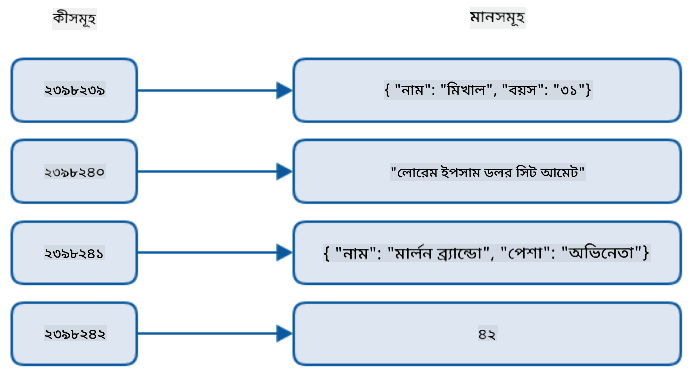
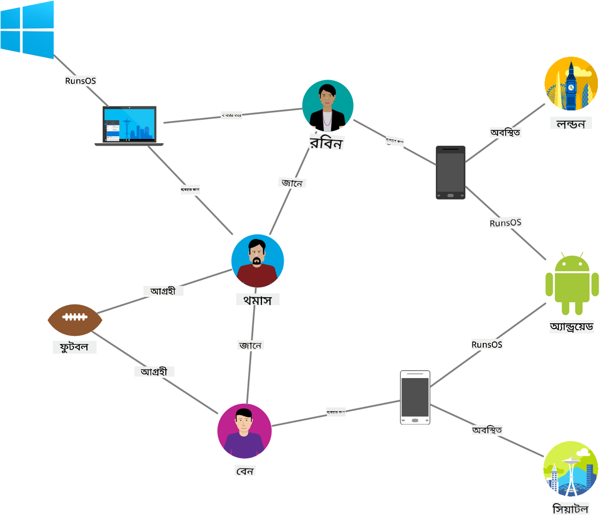
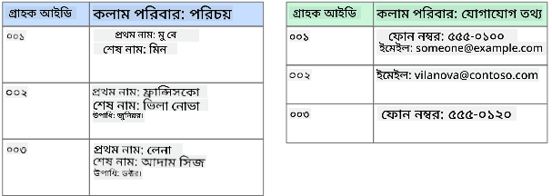

<!--
CO_OP_TRANSLATOR_METADATA:
{
  "original_hash": "32ddfef8121650f2ca2f3416fd283c37",
  "translation_date": "2025-08-27T08:40:30+00:00",
  "source_file": "2-Working-With-Data/06-non-relational/README.md",
  "language_code": "bn"
}
-->
# ডেটার সাথে কাজ করা: নন-রিলেশনাল ডেটা

| এর স্কেচনোট ](../../sketchnotes/06-NoSQL.png)|
|:---:|
|নোএসকিউএল ডেটার সাথে কাজ করা - _[@nitya](https://twitter.com/nitya) এর স্কেচনোট_ |

## [পূর্ব-লেকচার কুইজ](https://purple-hill-04aebfb03.1.azurestaticapps.net/quiz/10)

ডেটা শুধুমাত্র রিলেশনাল ডেটাবেসে সীমাবদ্ধ নয়। এই পাঠে নন-রিলেশনাল ডেটার উপর আলোকপাত করা হবে এবং স্প্রেডশিট ও নোএসকিউএলের মৌলিক বিষয়গুলো আলোচনা করা হবে।

## স্প্রেডশিট

স্প্রেডশিট ডেটা সংরক্ষণ এবং বিশ্লেষণের একটি জনপ্রিয় মাধ্যম, কারণ এটি সেটআপ এবং শুরু করার জন্য কম পরিশ্রমের প্রয়োজন হয়। এই পাঠে আপনি একটি স্প্রেডশিটের মৌলিক উপাদান, পাশাপাশি সূত্র এবং ফাংশন সম্পর্কে শিখবেন। উদাহরণগুলো মাইক্রোসফট এক্সেলের মাধ্যমে দেখানো হবে, তবে অন্যান্য স্প্রেডশিট সফটওয়্যারের সাথে নাম এবং ধাপগুলো তুলনামূলকভাবে একই রকম হবে। 


একটি স্প্রেডশিট একটি ফাইল এবং এটি একটি কম্পিউটার, ডিভাইস বা ক্লাউড-ভিত্তিক ফাইল সিস্টেমে অ্যাক্সেসযোগ্য। সফটওয়্যারটি ব্রাউজার-ভিত্তিক হতে পারে অথবা একটি অ্যাপ্লিকেশন যা কম্পিউটারে ইনস্টল করতে হবে বা অ্যাপ হিসেবে ডাউনলোড করতে হবে। এক্সেলে এই ফাইলগুলোকে **ওয়ার্কবুক** বলা হয় এবং এই পাঠে এই পরিভাষা ব্যবহার করা হবে।

একটি ওয়ার্কবুকে এক বা একাধিক **ওয়ার্কশিট** থাকে, যেখানে প্রতিটি ওয়ার্কশিট ট্যাব দ্বারা লেবেল করা থাকে। একটি ওয়ার্কশিটে আয়তক্ষেত্রাকার **সেল** থাকে, যা প্রকৃত ডেটা ধারণ করে। একটি সেল হল একটি সারি এবং কলামের ছেদ, যেখানে কলামগুলো বর্ণানুক্রমিক অক্ষর দ্বারা এবং সারিগুলো সংখ্যাসূচকভাবে লেবেল করা থাকে। কিছু স্প্রেডশিটে সেলের ডেটা বর্ণনা করার জন্য প্রথম কয়েকটি সারিতে হেডার থাকে।

একটি এক্সেল ওয়ার্কবুকের এই মৌলিক উপাদানগুলো দিয়ে, আমরা [মাইক্রোসফট টেমপ্লেট](https://templates.office.com/) থেকে একটি ইনভেন্টরি উদাহরণ ব্যবহার করে একটি স্প্রেডশিটের অতিরিক্ত অংশগুলো নিয়ে আলোচনা করব।

### ইনভেন্টরি পরিচালনা

"InventoryExample" নামে একটি স্প্রেডশিট ফাইল একটি ইনভেন্টরির আইটেমগুলোর ফরম্যাট করা স্প্রেডশিট, যেখানে তিনটি ওয়ার্কশিট রয়েছে, এবং ট্যাবগুলো "Inventory List", "Inventory Pick List" এবং "Bin Lookup" নামে লেবেল করা। ইনভেন্টরি লিস্ট ওয়ার্কশিটের ৪ নম্বর সারি হেডার, যা হেডার কলামে প্রতিটি সেলের মান বর্ণনা করে।


কিছু ক্ষেত্রে একটি সেলের মান অন্যান্য সেলের মানের উপর নির্ভর করে তৈরি হয়। ইনভেন্টরি লিস্ট স্প্রেডশিট ইনভেন্টরির প্রতিটি আইটেমের খরচ ট্র্যাক করে, তবে যদি আমাদের ইনভেন্টরির সবকিছুর মোট মূল্য জানতে হয়? [**সূত্র**](https://support.microsoft.com/en-us/office/overview-of-formulas-34519a4e-1e8d-4f4b-84d4-d642c4f63263) সেলের ডেটার উপর ক্রিয়া সম্পাদন করে এবং এই উদাহরণে ইনভেন্টরির খরচ গণনা করতে ব্যবহৃত হয়। এই স্প্রেডশিটে ইনভেন্টরি ভ্যালু কলামে একটি সূত্র ব্যবহার করা হয়েছে, যা QTY হেডারের অধীনে পরিমাণ এবং COST হেডারের অধীনে খরচ গুণ করে প্রতিটি আইটেমের মান গণনা করে। একটি সেল ডাবল ক্লিক বা হাইলাইট করলে সূত্রটি দেখা যাবে। আপনি লক্ষ্য করবেন যে সূত্রগুলো একটি সমান চিহ্ন দিয়ে শুরু হয়, তারপরে গণনা বা অপারেশন থাকে।


আমরা ইনভেন্টরি ভ্যালুর সমস্ত মান যোগ করে এর মোট মান পেতে আরেকটি সূত্র ব্যবহার করতে পারি। এটি প্রতিটি সেল যোগ করে গণনা করা যেতে পারে, তবে এটি একটি শ্রমসাধ্য কাজ হতে পারে। এক্সেলে [**ফাংশন**](https://support.microsoft.com/en-us/office/sum-function-043e1c7d-7726-4e80-8f32-07b23e057f89), বা পূর্বনির্ধারিত সূত্র রয়েছে যা সেলের মানের উপর গণনা সম্পাদন করে। ফাংশনগুলো আর্গুমেন্ট প্রয়োজন, যা এই গণনা সম্পাদনের জন্য প্রয়োজনীয় মান। যখন ফাংশনগুলো একাধিক আর্গুমেন্ট প্রয়োজন হয়, তখন সেগুলো একটি নির্দিষ্ট ক্রমে তালিকাভুক্ত করতে হবে, নাহলে ফাংশনটি সঠিক মান গণনা করতে পারবে না। এই উদাহরণে SUM ফাংশন ব্যবহার করা হয়েছে এবং ইনভেন্টরি ভ্যালুর মানগুলো আর্গুমেন্ট হিসেবে ব্যবহার করে মোট যোগফল তৈরি করা হয়েছে, যা সারি ৩, কলাম B (B3) এ তালিকাভুক্ত।

## নোএসকিউএল

নোএসকিউএল একটি ছাতার পরিভাষা যা নন-রিলেশনাল ডেটা সংরক্ষণের বিভিন্ন পদ্ধতিকে বোঝায় এবং এটি "নন-এসকিউএল", "নন-রিলেশনাল" বা "শুধুমাত্র এসকিউএল নয়" হিসেবে ব্যাখ্যা করা যেতে পারে। এই ধরনের ডেটাবেস সিস্টেমগুলোকে চারটি প্রকারে শ্রেণীবদ্ধ করা যায়।


> উৎস: [Michał Białecki Blog](https://www.michalbialecki.com/2018/03/18/azure-cosmos-db-key-value-database-cloud/)

[কী-মান](https://docs.microsoft.com/en-us/azure/architecture/data-guide/big-data/non-relational-data#keyvalue-data-stores) ডেটাবেসগুলো অনন্য কী এবং তার সাথে যুক্ত মানের জোড়া তৈরি করে। এই জোড়াগুলো একটি [হ্যাশ টেবিল](https://www.hackerearth.com/practice/data-structures/hash-tables/basics-of-hash-tables/tutorial/) ব্যবহার করে সংরক্ষণ করা হয়, যেখানে একটি উপযুক্ত হ্যাশিং ফাংশন ব্যবহৃত হয়।


> উৎস: [Microsoft](https://docs.microsoft.com/en-us/azure/cosmos-db/graph/graph-introduction#graph-database-by-example)

[গ্রাফ](https://docs.microsoft.com/en-us/azure/architecture/data-guide/big-data/non-relational-data#graph-data-stores) ডেটাবেসগুলো ডেটার সম্পর্ক বর্ণনা করে এবং নোড ও এজের একটি সংগ্রহ হিসেবে উপস্থাপিত হয়। একটি নোড একটি সত্তাকে উপস্থাপন করে, যেমন একজন ছাত্র বা ব্যাংক স্টেটমেন্ট। এজ দুটি সত্তার মধ্যে সম্পর্ক উপস্থাপন করে। প্রতিটি নোড এবং এজের বৈশিষ্ট্য থাকে, যা তাদের সম্পর্কে অতিরিক্ত তথ্য প্রদান করে।



[কলামার](https://docs.microsoft.com/en-us/azure/architecture/data-guide/big-data/non-relational-data#columnar-data-stores) ডেটা স্টোরগুলো ডেটাকে কলাম এবং সারিতে সংগঠিত করে, যা রিলেশনাল ডেটা কাঠামোর মতো, তবে প্রতিটি কলাম কলাম পরিবারের নামে গোষ্ঠীবদ্ধ থাকে, যেখানে একটি কলামের অধীনে সমস্ত ডেটা সম্পর্কিত এবং একক ইউনিট হিসেবে পুনরুদ্ধার ও পরিবর্তন করা যায়।

### অ্যাজুর কসমস ডিবি সহ ডকুমেন্ট ডেটা স্টোর

[ডকুমেন্ট](https://docs.microsoft.com/en-us/azure/architecture/data-guide/big-data/non-relational-data#document-data-stores) ডেটা স্টোরগুলো কী-মান ডেটা স্টোরের ধারণার উপর ভিত্তি করে তৈরি এবং এটি ক্ষেত্র ও অবজেক্টের একটি সিরিজ নিয়ে গঠিত। এই অংশে আমরা কসমস ডিবি এমুলেটর ব্যবহার করে ডকুমেন্ট ডেটাবেসগুলো অন্বেষণ করব।

কসমস ডিবি ডেটাবেস "শুধুমাত্র এসকিউএল নয়" সংজ্ঞার সাথে মিলে যায়, যেখানে কসমস ডিবির ডকুমেন্ট ডেটাবেস এসকিউএল ব্যবহার করে ডেটা অনুসন্ধান করে। [পূর্ববর্তী পাঠে](../05-relational-databases/README.md) এসকিউএলের মৌলিক বিষয়গুলো আলোচনা করা হয়েছে, এবং আমরা এখানে ডকুমেন্ট ডেটাবেসে একই ধরনের কিছু অনুসন্ধান প্রয়োগ করতে পারব। আমরা কসমস ডিবি এমুলেটর ব্যবহার করব, যা আমাদের একটি কম্পিউটারে স্থানীয়ভাবে একটি ডকুমেন্ট ডেটাবেস তৈরি এবং অন্বেষণ করতে দেয়। এমুলেটর সম্পর্কে আরও পড়ুন [এখানে](https://docs.microsoft.com/en-us/azure/cosmos-db/local-emulator?tabs=ssl-netstd21)।

একটি ডকুমেন্ট হল ক্ষেত্র এবং অবজেক্ট মানের একটি সংগ্রহ, যেখানে ক্ষেত্রগুলো অবজেক্ট মান কী উপস্থাপন করে তা বর্ণনা করে। নিচে একটি ডকুমেন্টের উদাহরণ দেওয়া হলো।

```json
{
    "firstname": "Eva",
    "age": 44,
    "id": "8c74a315-aebf-4a16-bb38-2430a9896ce5",
    "_rid": "bHwDAPQz8s0BAAAAAAAAAA==",
    "_self": "dbs/bHwDAA==/colls/bHwDAPQz8s0=/docs/bHwDAPQz8s0BAAAAAAAAAA==/",
    "_etag": "\"00000000-0000-0000-9f95-010a691e01d7\"",
    "_attachments": "attachments/",
    "_ts": 1630544034
}
```

এই ডকুমেন্টে আগ্রহের ক্ষেত্রগুলো হল: `firstname`, `id`, এবং `age`। বাকিগুলো কসমস ডিবি দ্বারা স্বয়ংক্রিয়ভাবে তৈরি করা হয়েছে।

#### কসমস ডিবি এমুলেটর দিয়ে ডেটা অন্বেষণ

আপনি [উইন্ডোজের জন্য এখানে](https://aka.ms/cosmosdb-emulator) এমুলেটর ডাউনলোড এবং ইনস্টল করতে পারেন। ম্যাকওএস এবং লিনাক্সে এমুলেটর চালানোর বিকল্পের জন্য এই [ডকুমেন্টেশন](https://docs.microsoft.com/en-us/azure/cosmos-db/local-emulator?tabs=ssl-netstd21#run-on-linux-macos) দেখুন।

এমুলেটর একটি ব্রাউজার উইন্ডো চালু করে, যেখানে এক্সপ্লোরার ভিউ আপনাকে ডকুমেন্টগুলো অন্বেষণ করতে দেয়।


যদি আপনি অনুসরণ করছেন, "Start with Sample" এ ক্লিক করুন একটি নমুনা ডেটাবেস তৈরি করতে, যার নাম SampleDB। SampleDB প্রসারিত করতে তীর চিহ্নে ক্লিক করুন, আপনি একটি কন্টেইনার পাবেন যার নাম `Persons`, একটি কন্টেইনারে আইটেমের একটি সংগ্রহ থাকে, যা কন্টেইনারের ডকুমেন্ট। আপনি `Items` এর অধীনে চারটি পৃথক ডকুমেন্ট অন্বেষণ করতে পারেন।


#### কসমস ডিবি এমুলেটর দিয়ে ডকুমেন্ট ডেটা অনুসন্ধান

আমরা নতুন SQL Query বোতামে ক্লিক করে (বাম থেকে দ্বিতীয় বোতাম) নমুনা ডেটা অনুসন্ধান করতে পারি।

`SELECT * FROM c` কন্টেইনারের সমস্ত ডকুমেন্ট ফেরত দেয়। চলুন একটি where ক্লজ যোগ করি এবং ৪০ বছরের কম বয়সী সবাইকে খুঁজে বের করি।

`SELECT * FROM c where c.age < 40`


অনুসন্ধানটি দুটি ডকুমেন্ট ফেরত দেয়, লক্ষ্য করুন প্রতিটি ডকুমেন্টের age মান ৪০ এর কম।

#### JSON এবং ডকুমেন্ট

যদি আপনি জাভাস্ক্রিপ্ট অবজেক্ট নোটেশন (JSON) এর সাথে পরিচিত হন, তবে আপনি লক্ষ্য করবেন যে ডকুমেন্টগুলো JSON এর মতো দেখায়। এই ডিরেক্টরিতে একটি `PersonsData.json` ফাইল রয়েছে, যাতে আরও ডেটা রয়েছে যা আপনি এমুলেটরে Persons কন্টেইনারে `Upload Item` বোতামের মাধ্যমে আপলোড করতে পারেন।

বেশিরভাগ ক্ষেত্রে, JSON ডেটা ফেরত দেয় এমন API সরাসরি ডকুমেন্ট ডেটাবেসে স্থানান্তর এবং সংরক্ষণ করা যায়। নিচে আরেকটি ডকুমেন্ট রয়েছে, এটি মাইক্রোসফট টুইটার অ্যাকাউন্ট থেকে টুইট উপস্থাপন করে, যা টুইটার API ব্যবহার করে পুনরুদ্ধার করা হয়েছিল এবং তারপর কসমস ডিবিতে সন্নিবেশ করা হয়েছিল।

```json
{
    "created_at": "2021-08-31T19:03:01.000Z",
    "id": "1432780985872142341",
    "text": "Blank slate. Like this tweet if you’ve ever painted in Microsoft Paint before. https://t.co/cFeEs8eOPK",
    "_rid": "dhAmAIUsA4oHAAAAAAAAAA==",
    "_self": "dbs/dhAmAA==/colls/dhAmAIUsA4o=/docs/dhAmAIUsA4oHAAAAAAAAAA==/",
    "_etag": "\"00000000-0000-0000-9f84-a0958ad901d7\"",
    "_attachments": "attachments/",
    "_ts": 1630537000
```

এই ডকুমেন্টে আগ্রহের ক্ষেত্রগুলো হল: `created_at`, `id`, এবং `text`।

## 🚀 চ্যালেঞ্জ

একটি `TwitterData.json` ফাইল রয়েছে যা আপনি SampleDB ডেটাবেসে আপলোড করতে পারেন। এটি একটি পৃথক কন্টেইনারে যোগ করার পরামর্শ দেওয়া হয়। এটি করতে:

1. উপরের ডানদিকে নতুন কন্টেইনার বোতামে ক্লিক করুন
1. বিদ্যমান ডেটাবেস (SampleDB) নির্বাচন করুন এবং কন্টেইনারের জন্য একটি আইডি তৈরি করুন
1. পার্টিশন কী `/id` সেট করুন
1. OK ক্লিক করুন (এই ভিউতে বাকি তথ্য উপেক্ষা করতে পারেন, কারণ এটি একটি ছোট ডেটাসেট যা আপনার মেশিনে স্থানীয়ভাবে চলছে)
1. আপনার নতুন কন্টেইনার খুলুন এবং `Upload Item` বোতামের মাধ্যমে টুইটার ডেটা ফাইল আপলোড করুন

`text` ফিল্ডে Microsoft থাকা ডকুমেন্টগুলো খুঁজে বের করতে কয়েকটি SELECT অনুসন্ধান চালানোর চেষ্টা করুন। টিপ: [LIKE কীওয়ার্ড](https://docs.microsoft.com/en-us/azure/cosmos-db/sql/sql-query-keywords#using-like-with-the--wildcard-character) ব্যবহার করার চেষ্টা করুন।

## [পোস্ট-লেকচার কুইজ](https://purple-hill-04aebfb03.1.azurestaticapps.net/quiz/11)

## পুনরায় দেখুন এবং স্ব-অধ্যয়ন

- এই স্প্রেডশিটে কিছু অতিরিক্ত ফরম্যাটিং এবং বৈশিষ্ট্য যোগ করা হয়েছে যা এই পাঠে আলোচনা করা হয়নি। এক্সেল সম্পর্কে আরও জানতে চাইলে মাইক্রোসফটের [বৃহৎ ডকুমেন্টেশন এবং ভিডিও লাইব্রেরি](https://support.microsoft.com/excel) দেখুন।

- নন-রিলেশনাল ডেটার বিভিন্ন প্রকারের বৈশিষ্ট্য সম্পর্কে এই আর্কিটেকচারাল ডকুমেন্টেশনটি বিস্তারিত জানায়: [নন-রিলেশনাল ডেটা এবং নোএসকিউএল](https://docs.microsoft.com/en-us/azure/architecture/data-guide/big-data/non-relational-data)

- কসমস ডিবি একটি ক্লাউড-ভিত্তিক নন-রিলেশনাল ডেটাবেস, যা এই পাঠে উল্লেখিত বিভিন্ন নোএসকিউএল প্রকার সংরক্ষণ করতে পারে। এই [কসমস ডিবি মাইক্রোসফট লার্ন মডিউল](https://docs.microsoft.com/en-us/learn/paths/work-with-nosql-data-in-azure-cosmos-db/) এ এই প্রকারগুলো সম্পর্কে আরও জানুন।

## অ্যাসাইনমেন্ট

[Soda Profits](assignment.md)

---

**অস্বীকৃতি**:  
এই নথিটি AI অনুবাদ পরিষেবা [Co-op Translator](https://github.com/Azure/co-op-translator) ব্যবহার করে অনুবাদ করা হয়েছে। আমরা যথাসম্ভব সঠিক অনুবাদের চেষ্টা করি, তবে অনুগ্রহ করে মনে রাখবেন যে স্বয়ংক্রিয় অনুবাদে ত্রুটি বা অসঙ্গতি থাকতে পারে। নথিটির মূল ভাষায় লেখা সংস্করণটিকেই প্রামাণিক উৎস হিসেবে বিবেচনা করা উচিত। গুরুত্বপূর্ণ তথ্যের জন্য, পেশাদার মানব অনুবাদ ব্যবহার করার পরামর্শ দেওয়া হচ্ছে। এই অনুবাদ ব্যবহারের ফলে সৃষ্ট কোনো ভুল বোঝাবুঝি বা ভুল ব্যাখ্যার জন্য আমরা দায়ী নই।