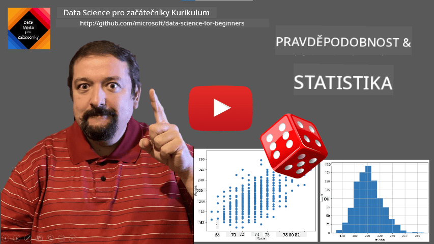
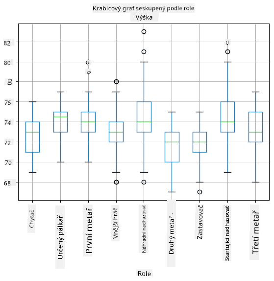
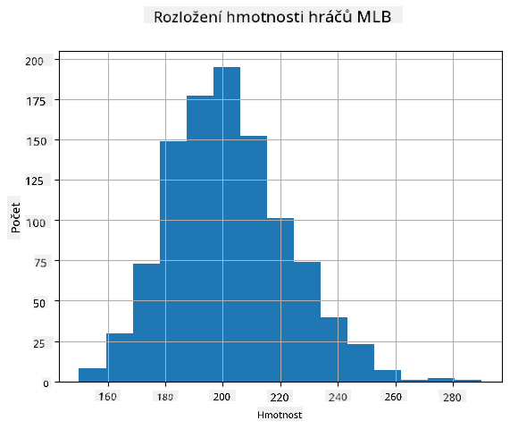
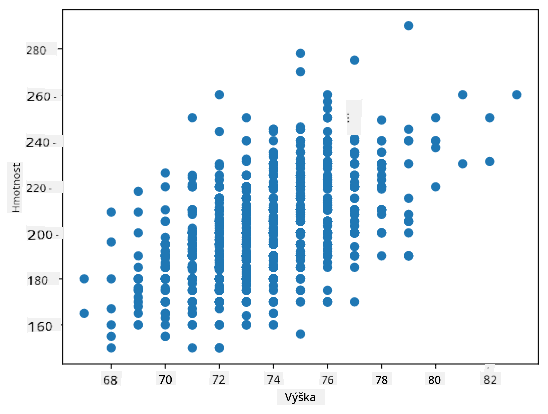

<!--
CO_OP_TRANSLATOR_METADATA:
{
  "original_hash": "b706a07cfa87ba091cbb91e0aa775600",
  "translation_date": "2025-08-26T15:35:37+00:00",
  "source_file": "1-Introduction/04-stats-and-probability/README.md",
  "language_code": "cs"
}
-->
# Stručný úvod do statistiky a pravděpodobnosti

| ](../../sketchnotes/04-Statistics-Probability.png)|
|:---:|
| Statistika a pravděpodobnost - _Sketchnote od [@nitya](https://twitter.com/nitya)_ |

Teorie statistiky a pravděpodobnosti jsou dvě úzce související oblasti matematiky, které mají velký význam pro datovou vědu. Je možné pracovat s daty bez hlubokých znalostí matematiky, ale je stále lepší znát alespoň základní koncepty. Zde vám představíme krátký úvod, který vám pomůže začít.

[](https://youtu.be/Z5Zy85g4Yjw)

## [Kvíz před přednáškou](https://purple-hill-04aebfb03.1.azurestaticapps.net/quiz/6)

## Pravděpodobnost a náhodné proměnné

**Pravděpodobnost** je číslo mezi 0 a 1, které vyjadřuje, jak pravděpodobné je, že nastane určitá **událost**. Je definována jako počet pozitivních výsledků (které vedou k události) dělený celkovým počtem výsledků, za předpokladu, že všechny výsledky jsou stejně pravděpodobné. Například při hodu kostkou je pravděpodobnost, že padne sudé číslo, 3/6 = 0,5.

Když mluvíme o událostech, používáme **náhodné proměnné**. Například náhodná proměnná, která představuje číslo získané při hodu kostkou, by měla hodnoty od 1 do 6. Množina čísel od 1 do 6 se nazývá **prostor vzorků**. Můžeme mluvit o pravděpodobnosti, že náhodná proměnná nabude určité hodnoty, například P(X=3)=1/6.

Náhodná proměnná v předchozím příkladu se nazývá **diskrétní**, protože má spočetný prostor vzorků, tj. existují oddělené hodnoty, které lze vyjmenovat. Existují případy, kdy prostor vzorků je rozsah reálných čísel nebo celá množina reálných čísel. Takové proměnné se nazývají **spojité**. Dobrým příkladem je čas, kdy přijede autobus.

## Pravděpodobnostní rozdělení

V případě diskrétních náhodných proměnných je snadné popsat pravděpodobnost každé události pomocí funkce P(X). Pro každou hodnotu *s* z prostoru vzorků *S* poskytne číslo od 0 do 1, takové, že součet všech hodnot P(X=s) pro všechny události bude 1.

Nejznámější diskrétní rozdělení je **rovnoměrné rozdělení**, ve kterém je prostor vzorků tvořen N prvky, s rovnoměrnou pravděpodobností 1/N pro každý z nich.

Popis pravděpodobnostního rozdělení spojité proměnné, jejíž hodnoty jsou čerpány z nějakého intervalu [a,b] nebo celé množiny reálných čísel ℝ, je složitější. Zvažte případ času příjezdu autobusu. Ve skutečnosti je pravděpodobnost, že autobus přijede přesně v určitém čase *t*, rovna 0!

> Teď už víte, že události s nulovou pravděpodobností se dějí, a to velmi často! Minimálně pokaždé, když přijede autobus!

Můžeme mluvit pouze o pravděpodobnosti, že proměnná spadne do určitého intervalu hodnot, např. P(t<sub>1</sub>≤X<t<sub>2</sub>). V tomto případě je pravděpodobnostní rozdělení popsáno pomocí **funkce hustoty pravděpodobnosti** p(x), takové, že


Spojitý analog rovnoměrného rozdělení se nazývá **spojité rovnoměrné rozdělení**, které je definováno na konečném intervalu. Pravděpodobnost, že hodnota X spadne do intervalu délky l, je úměrná l a stoupá až k 1.

Další důležité rozdělení je **normální rozdělení**, o kterém si povíme podrobněji níže.

## Průměr, rozptyl a směrodatná odchylka

Předpokládejme, že vezmeme sekvenci n vzorků náhodné proměnné X: x<sub>1</sub>, x<sub>2</sub>, ..., x<sub>n</sub>. Můžeme definovat **průměrnou** (nebo **aritmetickou průměrnou**) hodnotu sekvence tradičním způsobem jako (x<sub>1</sub>+x<sub>2</sub>+x<sub>n</sub>)/n. Jak zvětšujeme velikost vzorku (tj. bereme limit s n→∞), získáme průměr (také nazývaný **očekávání**) rozdělení. Očekávání budeme označovat jako **E**(x).

> Lze ukázat, že pro jakékoli diskrétní rozdělení s hodnotami {x<sub>1</sub>, x<sub>2</sub>, ..., x<sub>N</sub>} a odpovídajícími pravděpodobnostmi p<sub>1</sub>, p<sub>2</sub>, ..., p<sub>N</sub>, očekávání bude rovno E(X)=x<sub>1</sub>p<sub>1</sub>+x<sub>2</sub>p<sub>2</sub>+...+x<sub>N</sub>p<sub>N</sub>.

Pro určení, jak daleko jsou hodnoty rozptýlené, můžeme vypočítat rozptyl σ<sup>2</sup> = ∑(x<sub>i</sub> - μ)<sup>2</sup>/n, kde μ je průměr sekvence. Hodnota σ se nazývá **směrodatná odchylka** a σ<sup>2</sup> se nazývá **rozptyl**.

## Mód, medián a kvartily

Někdy průměr neodpovídá dostatečně "typické" hodnotě dat. Například když existuje několik extrémních hodnot, které jsou zcela mimo rozsah, mohou ovlivnit průměr. Dalším dobrým ukazatelem je **medián**, hodnota, taková že polovina datových bodů je nižší než ona a druhá polovina vyšší.

Pro lepší pochopení rozdělení dat je užitečné mluvit o **kvartilech**:

* První kvartil, nebo Q1, je hodnota, taková že 25 % dat je pod ní
* Třetí kvartil, nebo Q3, je hodnota, taková že 75 % dat je pod ní

Graficky můžeme vztah mezi mediánem a kvartily znázornit v diagramu nazývaném **box plot**:


Zde také vypočítáme **mezikvartilové rozpětí** IQR=Q3-Q1 a tzv. **odlehlé hodnoty** - hodnoty, které leží mimo hranice [Q1-1.5*IQR,Q3+1.5*IQR].

Pro konečné rozdělení, které obsahuje malý počet možných hodnot, je dobrá "typická" hodnota ta, která se objevuje nejčastěji, což se nazývá **mód**. Často se používá u kategoriálních dat, jako jsou barvy. Zvažte situaci, kdy máme dvě skupiny lidí - některé, které silně preferují červenou, a jiné, které preferují modrou. Pokud kódujeme barvy čísly, průměrná hodnota oblíbené barvy by byla někde ve spektru oranžovo-zelené, což neodpovídá skutečné preferenci ani jedné skupiny. Mód by však byl buď jedna z barev, nebo obě barvy, pokud je počet lidí hlasujících pro ně stejný (v tomto případě nazýváme vzorek **multimodální**).

## Data z reálného světa

Když analyzujeme data z reálného života, často nejsou náhodnými proměnnými v tom smyslu, že neprovádíme experimenty s neznámým výsledkem. Například zvažte tým baseballových hráčů a jejich tělesné údaje, jako je výška, váha a věk. Tyto hodnoty nejsou přesně náhodné, ale stále můžeme aplikovat stejné matematické koncepty. Například sekvenci váhy lidí můžeme považovat za sekvenci hodnot čerpaných z nějaké náhodné proměnné. Níže je sekvence váhy skutečných baseballových hráčů z [Major League Baseball](http://mlb.mlb.com/index.jsp), převzatá z [tohoto datasetu](http://wiki.stat.ucla.edu/socr/index.php/SOCR_Data_MLB_HeightsWeights) (pro vaše pohodlí je zobrazeno pouze prvních 20 hodnot):

```
[180.0, 215.0, 210.0, 210.0, 188.0, 176.0, 209.0, 200.0, 231.0, 180.0, 188.0, 180.0, 185.0, 160.0, 180.0, 185.0, 197.0, 189.0, 185.0, 219.0]
```

> **Poznámka**: Pro příklad práce s tímto datasetem se podívejte na [doprovodný notebook](notebook.ipynb). V této lekci je také řada výzev, které můžete splnit přidáním kódu do tohoto notebooku. Pokud si nejste jisti, jak pracovat s daty, nebojte se - k práci s daty pomocí Pythonu se vrátíme později. Pokud nevíte, jak spustit kód v Jupyter Notebooku, podívejte se na [tento článek](https://soshnikov.com/education/how-to-execute-notebooks-from-github/).

Zde je box plot zobrazující průměr, medián a kvartily pro naše data:


Protože naše data obsahují informace o různých hráčských **rolích**, můžeme také vytvořit box plot podle role - umožní nám získat představu o tom, jak se hodnoty parametrů liší mezi rolemi. Tentokrát budeme zvažovat výšku:



Tento diagram naznačuje, že průměrná výška hráčů na první metě je vyšší než výška hráčů na druhé metě. Později v této lekci se naučíme, jak tuto hypotézu formálněji otestovat a jak ukázat, že naše data jsou statisticky významná.

> Při práci s daty z reálného světa předpokládáme, že všechny datové body jsou vzorky čerpané z nějakého pravděpodobnostního rozdělení. Tento předpoklad nám umožňuje aplikovat techniky strojového učení a vytvářet funkční prediktivní modely.

Abychom viděli, jaké je rozdělení našich dat, můžeme vytvořit graf nazývaný **histogram**. Osa X bude obsahovat počet různých intervalů váhy (tzv. **binů**) a vertikální osa bude ukazovat počet případů, kdy náš vzorek náhodné proměnné spadal do daného intervalu.



Z tohoto histogramu můžete vidět, že všechny hodnoty jsou soustředěny kolem určité průměrné váhy, a čím dále se od této váhy dostaneme, tím méně váhových hodnot se vyskytuje. Jinými slovy, je velmi nepravděpodobné, že váha baseballového hráče bude výrazně odlišná od průměrné váhy. Rozptyl váhy ukazuje míru, do jaké se váhy pravděpodobně liší od průměru.

> Pokud vezmeme váhy jiných lidí, ne z baseballové ligy, rozdělení bude pravděpodobně jiné. Nicméně tvar rozdělení bude stejný, ale průměr a rozptyl se změní. Pokud tedy trénujeme náš model na baseballových hráčích, je pravděpodobné, že poskytne nesprávné výsledky, když bude aplikován na studenty univerzity, protože základní rozdělení je jiné.

## Normální rozdělení

Rozdělení váhy, které jsme viděli výše, je velmi typické a mnoho měření z reálného světa následuje stejný typ rozdělení, ale s různým průměrem a rozptylem. Toto rozdělení se nazývá **normální rozdělení** a hraje velmi důležitou roli ve statistice.

Použití normálního rozdělení je správný způsob, jak generovat náhodné váhy potenciálních baseballových hráčů. Jakmile známe průměrnou váhu `mean` a směrodatnou odchylku `std`, můžeme vygenerovat 1000 vzorků váhy následujícím způsobem:
```python
samples = np.random.normal(mean,std,1000)
``` 

Pokud vykreslíme histogram vygenerovaných vzorků, uvidíme obrázek velmi podobný tomu, který je uveden výše. A pokud zvýšíme počet vzorků a počet binů, můžeme vytvořit obrázek normálního rozdělení, který se více blíží ideálu:


*Normální rozdělení s mean=0 a std.dev=1*

## Intervaly spolehlivosti

Když mluvíme o váhách baseballových hráčů, předpokládáme, že existuje určitá **náhodná proměnná W**, která odpovídá ideálnímu pravděpodobnostnímu rozdělení váhy všech baseballových hráčů (tzv. **populace**). Naše sekvence váhy odpovídá podmnožině všech baseballových hráčů, kterou nazýváme **vzorek**. Zajímavou otázkou je, zda můžeme znát parametry rozdělení W, tj. průměr a rozptyl populace.

Nejjednodušší odpovědí by bylo vypočítat průměr a rozptyl našeho vzorku. Může se však stát, že náš náhodný vzorek přesně neodráží celou populaci. Proto má smysl mluvit o **intervalu spolehlivosti**.
> **Interval spolehlivosti** je odhad skutečného průměru populace na základě našeho vzorku, který je přesný s určitou pravděpodobností (nebo **úrovní spolehlivosti**).
Předpokládejme, že máme vzorek X<sub>1</sub>, ..., X<sub>n</sub> z našeho rozdělení. Pokaždé, když odebereme vzorek z našeho rozdělení, skončíme s jinou střední hodnotou μ. Proto může být μ považováno za náhodnou proměnnou. **Interval spolehlivosti** s pravděpodobností p je dvojice hodnot (L<sub>p</sub>,R<sub>p</sub>), taková, že **P**(L<sub>p</sub>≤μ≤R<sub>p</sub>) = p, tj. pravděpodobnost, že naměřená střední hodnota spadne do intervalu, se rovná p.

Podrobný výpočet těchto intervalů spolehlivosti přesahuje rámec našeho krátkého úvodu. Další podrobnosti lze najít [na Wikipedii](https://en.wikipedia.org/wiki/Confidence_interval). Stručně řečeno, definujeme rozdělení vypočítané střední hodnoty vzorku vzhledem ke skutečné střední hodnotě populace, což se nazývá **studentovo rozdělení**.

> **Zajímavý fakt**: Studentovo rozdělení je pojmenováno po matematikovi Williamu Sealy Gossetovi, který publikoval svůj článek pod pseudonymem "Student". Pracoval v pivovaru Guinness a podle jedné z verzí jeho zaměstnavatel nechtěl, aby veřejnost věděla, že používají statistické testy k určení kvality surovin.

Pokud chceme odhadnout střední hodnotu μ naší populace s pravděpodobností p, musíme vzít *(1-p)/2-tý percentil* studentova rozdělení A, který lze buď získat z tabulek, nebo vypočítat pomocí vestavěných funkcí statistického softwaru (např. Python, R atd.). Poté by interval pro μ byl dán X±A*D/√n, kde X je získaná střední hodnota vzorku, D je směrodatná odchylka.

> **Poznámka**: Vynecháváme také diskusi o důležitém konceptu [stupňů volnosti](https://en.wikipedia.org/wiki/Degrees_of_freedom_(statistics)), který je důležitý ve vztahu ke studentovu rozdělení. Pro hlubší pochopení tohoto konceptu můžete nahlédnout do kompletnějších knih o statistice.

Příklad výpočtu intervalu spolehlivosti pro hmotnosti a výšky je uveden v [doprovodných poznámkových blocích](notebook.ipynb).

| p | Průměrná hmotnost |
|-----|-----------------|
| 0.85 | 201.73±0.94 |
| 0.90 | 201.73±1.08 |
| 0.95 | 201.73±1.28 |

Všimněte si, že čím vyšší je pravděpodobnost spolehlivosti, tím širší je interval spolehlivosti.

## Testování hypotéz

V našem datasetu baseballových hráčů existují různé role hráčů, které lze shrnout níže (podívejte se na [doprovodný poznámkový blok](notebook.ipynb), abyste viděli, jak lze tuto tabulku vypočítat):

| Role | Výška | Hmotnost | Počet |
|------|-------|----------|-------|
| Catcher | 72.723684 | 204.328947 | 76 |
| Designated_Hitter | 74.222222 | 220.888889 | 18 |
| First_Baseman | 74.000000 | 213.109091 | 55 |
| Outfielder | 73.010309 | 199.113402 | 194 |
| Relief_Pitcher | 74.374603 | 203.517460 | 315 |
| Second_Baseman | 71.362069 | 184.344828 | 58 |
| Shortstop | 71.903846 | 182.923077 | 52 |
| Starting_Pitcher | 74.719457 | 205.163636 | 221 |
| Third_Baseman | 73.044444 | 200.955556 | 45 |

Můžeme si všimnout, že průměrná výška hráčů na první metě je vyšší než hráčů na druhé metě. Mohli bychom tedy dojít k závěru, že **hráči na první metě jsou vyšší než hráči na druhé metě**.

> Toto tvrzení se nazývá **hypotéza**, protože nevíme, zda je tento fakt skutečně pravdivý.

Nicméně není vždy zřejmé, zda můžeme tento závěr učinit. Z výše uvedené diskuse víme, že každá střední hodnota má přidružený interval spolehlivosti, a proto může být tento rozdíl pouze statistickou chybou. Potřebujeme formálnější způsob, jak testovat naši hypotézu.

Vypočítejme intervaly spolehlivosti zvlášť pro výšky hráčů na první a druhé metě:

| Spolehlivost | První meta | Druhá meta |
|--------------|------------|------------|
| 0.85 | 73.62..74.38 | 71.04..71.69 |
| 0.90 | 73.56..74.44 | 70.99..71.73 |
| 0.95 | 73.47..74.53 | 70.92..71.81 |

Vidíme, že za žádné spolehlivosti se intervaly nepřekrývají. To potvrzuje naši hypotézu, že hráči na první metě jsou vyšší než hráči na druhé metě.

Formálněji řečeno, problém, který řešíme, je zjistit, zda **dvě pravděpodobnostní rozdělení jsou stejná**, nebo alespoň mají stejné parametry. V závislosti na rozdělení musíme použít různé testy. Pokud víme, že naše rozdělení jsou normální, můžeme použít **[Studentův t-test](https://en.wikipedia.org/wiki/Student%27s_t-test)**.

V Studentově t-testu vypočítáme tzv. **t-hodnotu**, která indikuje rozdíl mezi středními hodnotami, přičemž bere v úvahu rozptyl. Bylo prokázáno, že t-hodnota následuje **studentovo rozdělení**, což nám umožňuje získat prahovou hodnotu pro danou úroveň spolehlivosti **p** (to lze vypočítat nebo najít v numerických tabulkách). Poté porovnáme t-hodnotu s touto prahovou hodnotou, abychom hypotézu schválili nebo zamítli.

V Pythonu můžeme použít balíček **SciPy**, který zahrnuje funkci `ttest_ind` (kromě mnoha dalších užitečných statistických funkcí!). Tato funkce pro nás vypočítá t-hodnotu a také provede zpětné vyhledání p-hodnoty spolehlivosti, takže můžeme jednoduše zkontrolovat spolehlivost a učinit závěr.

Například naše porovnání výšek hráčů na první a druhé metě nám dává následující výsledky: 
```python
from scipy.stats import ttest_ind

tval, pval = ttest_ind(df.loc[df['Role']=='First_Baseman',['Height']], df.loc[df['Role']=='Designated_Hitter',['Height']],equal_var=False)
print(f"T-value = {tval[0]:.2f}\nP-value: {pval[0]}")
```
```
T-value = 7.65
P-value: 9.137321189738925e-12
```
V našem případě je p-hodnota velmi nízká, což znamená, že existují silné důkazy podporující, že hráči na první metě jsou vyšší.

Existují také různé jiné typy hypotéz, které bychom mohli chtít testovat, například:
* Dokázat, že daný vzorek odpovídá nějakému rozdělení. V našem případě jsme předpokládali, že výšky jsou normálně rozdělené, ale to vyžaduje formální statistické ověření.
* Dokázat, že střední hodnota vzorku odpovídá nějaké předem definované hodnotě.
* Porovnat střední hodnoty několika vzorků (např. jaký je rozdíl v úrovních štěstí mezi různými věkovými skupinami).

## Zákon velkých čísel a centrální limitní věta

Jedním z důvodů, proč je normální rozdělení tak důležité, je tzv. **centrální limitní věta**. Předpokládejme, že máme velký vzorek nezávislých hodnot N X<sub>1</sub>, ..., X<sub>N</sub>, odebraných z libovolného rozdělení se střední hodnotou μ a rozptylem σ<sup>2</sup>. Poté, pro dostatečně velké N (jinými slovy, když N→∞), bude střední hodnota Σ<sub>i</sub>X<sub>i</sub> normálně rozdělená, se střední hodnotou μ a rozptylem σ<sup>2</sup>/N.

> Další způsob, jak interpretovat centrální limitní větu, je říci, že bez ohledu na rozdělení, když vypočítáte střední hodnotu součtu libovolných hodnot náhodné proměnné, skončíte s normálním rozdělením.

Z centrální limitní věty také vyplývá, že když N→∞, pravděpodobnost, že střední hodnota vzorku bude rovna μ, se stává 1. To je známé jako **zákon velkých čísel**.

## Kovariance a korelace

Jednou z věcí, které Data Science dělá, je hledání vztahů mezi daty. Říkáme, že dvě sekvence **korelují**, když vykazují podobné chování ve stejnou dobu, tj. buď současně rostou/klesají, nebo jedna sekvence roste, když druhá klesá, a naopak. Jinými slovy, zdá se, že mezi dvěma sekvencemi existuje nějaký vztah.

> Korelace nutně neznamená kauzální vztah mezi dvěma sekvencemi; někdy mohou obě proměnné záviset na nějaké externí příčině, nebo může být korelace čistě náhodná. Nicméně silná matematická korelace je dobrým indikátorem, že dvě proměnné jsou nějakým způsobem propojené.

Matematicky hlavní koncept, který ukazuje vztah mezi dvěma náhodnými proměnnými, je **kovariance**, která se počítá takto: Cov(X,Y) = **E**\[(X-**E**(X))(Y-**E**(Y))\]. Počítáme odchylku obou proměnných od jejich středních hodnot a poté součin těchto odchylek. Pokud se obě proměnné odchylují společně, součin bude vždy kladná hodnota, která se sečte na kladnou kovarianci. Pokud se obě proměnné odchylují nesynchronizovaně (tj. jedna klesá pod průměr, když druhá stoupá nad průměr), vždy dostaneme záporné hodnoty, které se sečtou na zápornou kovarianci. Pokud odchylky nejsou závislé, sečtou se přibližně na nulu.

Absolutní hodnota kovariance nám neříká mnoho o tom, jak velká je korelace, protože závisí na velikosti skutečných hodnot. Abychom ji normalizovali, můžeme kovarianci vydělit směrodatnou odchylkou obou proměnných, čímž získáme **korelaci**. Dobré je, že korelace je vždy v rozmezí [-1,1], kde 1 označuje silnou kladnou korelaci mezi hodnotami, -1 - silnou zápornou korelaci a 0 - žádnou korelaci (proměnné jsou nezávislé).

**Příklad**: Můžeme vypočítat korelaci mezi hmotnostmi a výškami baseballových hráčů z výše zmíněného datasetu:
```python
print(np.corrcoef(weights,heights))
```
Výsledkem získáme **korelační matici** jako tuto:
```
array([[1.        , 0.52959196],
       [0.52959196, 1.        ]])
```

> Korelační matici C lze vypočítat pro libovolný počet vstupních sekvencí S<sub>1</sub>, ..., S<sub>n</sub>. Hodnota C<sub>ij</sub> je korelace mezi S<sub>i</sub> a S<sub>j</sub>, a diagonální prvky jsou vždy 1 (což je také vlastní korelace S<sub>i</sub>).

V našem případě hodnota 0.53 naznačuje, že existuje určitá korelace mezi hmotností a výškou osoby. Můžeme také vytvořit scatter plot jedné hodnoty proti druhé, abychom viděli vztah vizuálně:



> Další příklady korelace a kovariance lze najít v [doprovodném poznámkovém bloku](notebook.ipynb).

## Závěr

V této sekci jsme se naučili:

* základní statistické vlastnosti dat, jako je průměr, rozptyl, modus a kvartily
* různá rozdělení náhodných proměnných, včetně normálního rozdělení
* jak najít korelaci mezi různými vlastnostmi
* jak použít matematický a statistický aparát k ověření hypotéz
* jak vypočítat intervaly spolehlivosti pro náhodnou proměnnou na základě vzorku dat

I když to rozhodně není vyčerpávající seznam témat, která existují v oblasti pravděpodobnosti a statistiky, mělo by to být dostatečné pro dobrý začátek tohoto kurzu.

## 🚀 Výzva

Použijte ukázkový kód v poznámkovém bloku k testování dalších hypotéz:
1. Hráči na první metě jsou starší než hráči na druhé metě.
2. Hráči na první metě jsou vyšší než hráči na třetí metě.
3. Shortstopové jsou vyšší než hráči na druhé metě.

## [Kvíz po přednášce](https://purple-hill-04aebfb03.1.azurestaticapps.net/quiz/7)

## Přehled a samostudium

Pravděpodobnost a statistika je tak široké téma, že si zaslouží vlastní kurz. Pokud máte zájem jít hlouběji do teorie, můžete pokračovat ve čtení některých z následujících knih:

1. [Carlos Fernandez-Granda](https://cims.nyu.edu/~cfgranda/) z New York University má skvělé poznámky z přednášek [Pravděpodobnost a statistika pro Data Science](https://cims.nyu.edu/~cfgranda/pages/stuff/probability_stats_for_DS.pdf) (dostupné online).
1. [Peter a Andrew Bruce. Practical Statistics for Data Scientists.](https://www.oreilly.com/library/view/practical-statistics-for/9781491952955/) [[ukázkový kód v R](https://github.com/andrewgbruce/statistics-for-data-scientists)].
1. [James D. Miller. Statistics for Data Science](https://www.packtpub.com/product/statistics-for-data-science/9781788290678) [[ukázkový kód v R](https://github.com/PacktPublishing/Statistics-for-Data-Science)].

## Zadání

[Malá studie o diabetu](assignment.md)

## Poděkování

Tuto lekci vytvořil s ♥️ [Dmitry Soshnikov](http://soshnikov.com).

---

**Prohlášení**:  
Tento dokument byl přeložen pomocí služby pro automatický překlad [Co-op Translator](https://github.com/Azure/co-op-translator). I když se snažíme o co největší přesnost, mějte prosím na paměti, že automatické překlady mohou obsahovat chyby nebo nepřesnosti. Původní dokument v jeho původním jazyce by měl být považován za závazný zdroj. Pro důležité informace doporučujeme profesionální lidský překlad. Neodpovídáme za žádná nedorozumění nebo nesprávné výklady vyplývající z použití tohoto překladu.