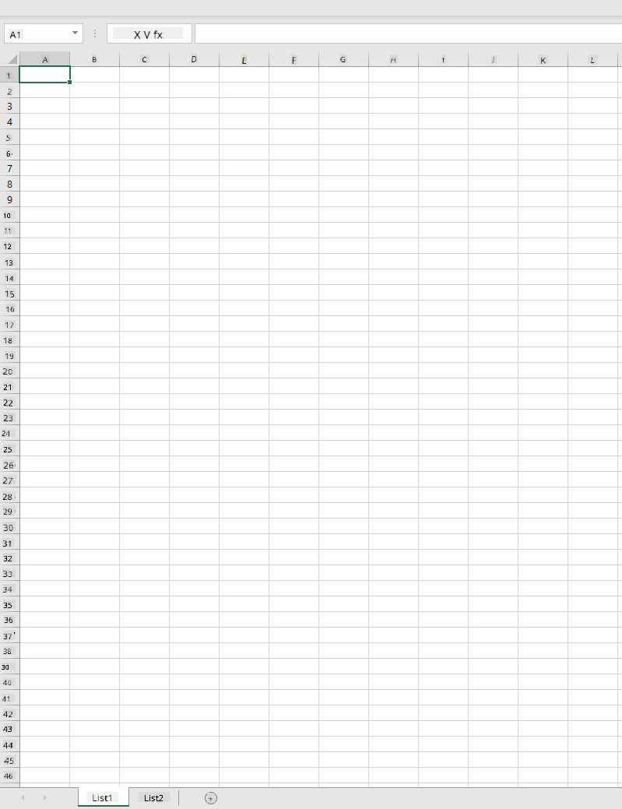
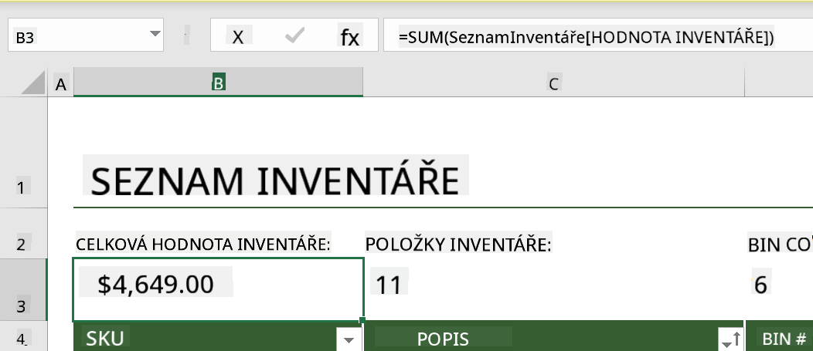
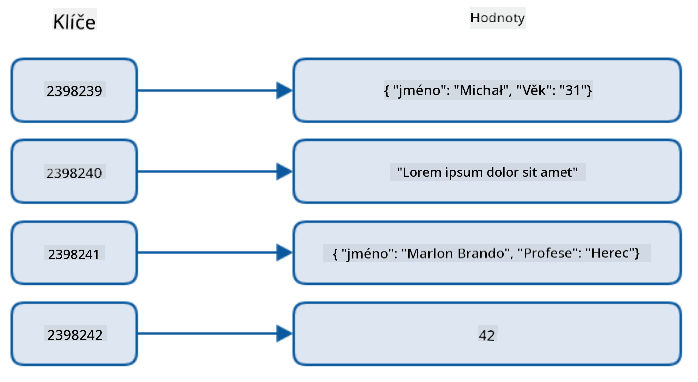
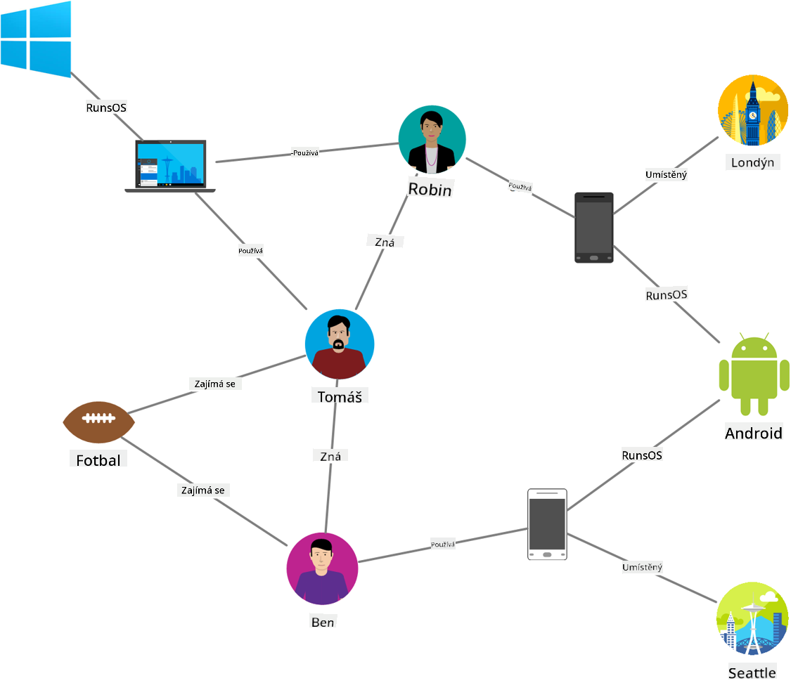
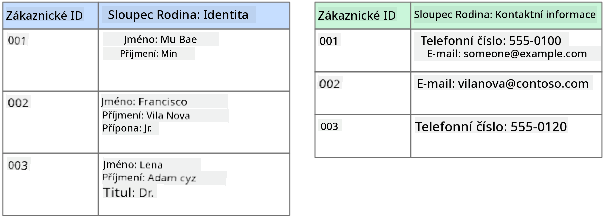
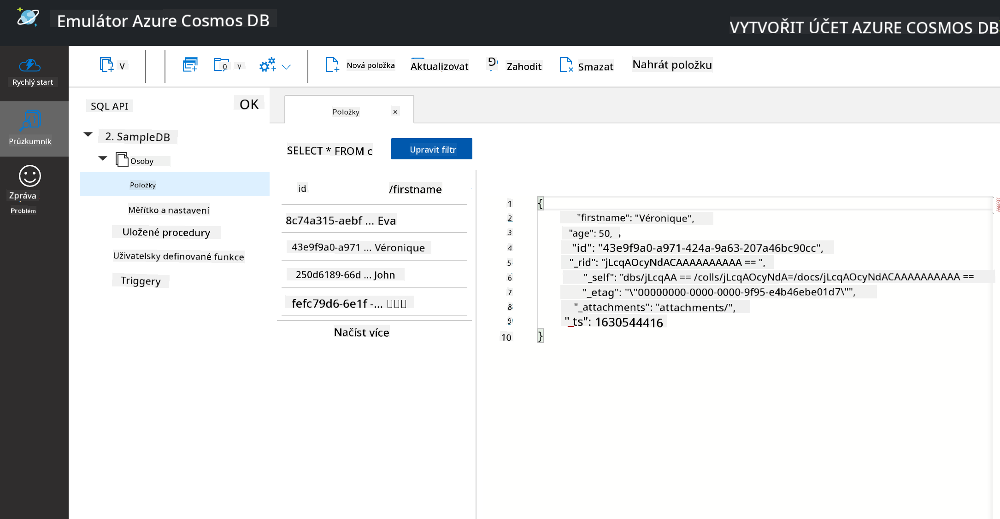
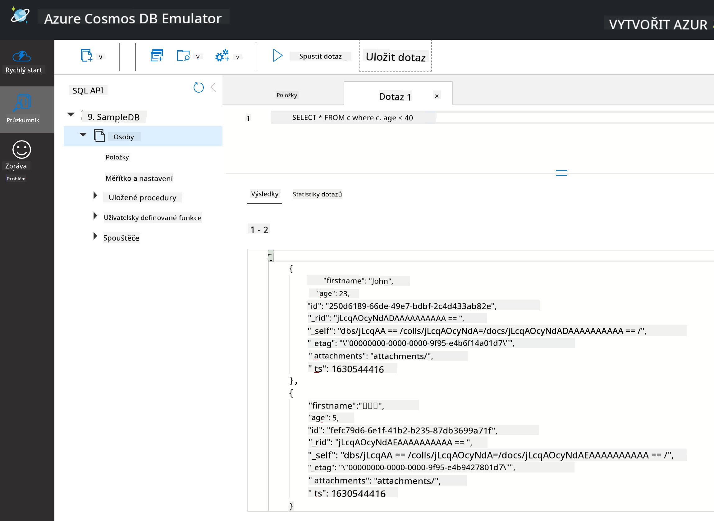

<!--
CO_OP_TRANSLATOR_METADATA:
{
  "original_hash": "32ddfef8121650f2ca2f3416fd283c37",
  "translation_date": "2025-08-26T14:54:00+00:00",
  "source_file": "2-Working-With-Data/06-non-relational/README.md",
  "language_code": "cs"
}
-->
# Práce s daty: Nerelační data

| ](../../sketchnotes/06-NoSQL.png)|
|:---:|
|Práce s NoSQL daty - _Sketchnote od [@nitya](https://twitter.com/nitya)_ |

## [Kvíz před lekcí](https://purple-hill-04aebfb03.1.azurestaticapps.net/quiz/10)

Data nejsou omezena pouze na relační databáze. Tato lekce se zaměřuje na nerelační data a pokryje základy tabulek a NoSQL.

## Tabulky

Tabulky jsou oblíbeným způsobem ukládání a zkoumání dat, protože jejich nastavení a používání vyžaduje méně práce. V této lekci se naučíte základní komponenty tabulky, stejně jako vzorce a funkce. Příklady budou ilustrovány pomocí Microsoft Excel, ale většina částí a témat bude mít podobné názvy a kroky ve srovnání s jiným softwarem pro tabulky.



Tabulka je soubor, který bude přístupný v souborovém systému počítače, zařízení nebo cloudovém úložišti. Samotný software může být založen na prohlížeči nebo aplikaci, kterou je třeba nainstalovat na počítač nebo stáhnout jako aplikaci. V Excelu jsou tyto soubory také definovány jako **pracovní sešity** a tento termín bude používán po zbytek této lekce.

Pracovní sešit obsahuje jeden nebo více **listů**, kde každý list je označen záložkami. Na listu se nacházejí obdélníky nazývané **buňky**, které obsahují skutečná data. Buňka je průsečík řádku a sloupce, kde sloupce jsou označeny abecedními znaky a řádky číselně. Některé tabulky obsahují záhlaví v prvních několika řádcích, která popisují data v buňce.

S těmito základními prvky pracovního sešitu Excelu použijeme příklad z [Microsoft Templates](https://templates.office.com/) zaměřený na inventář, abychom prošli další části tabulky.

### Správa inventáře

Soubor tabulky nazvaný "InventoryExample" je formátovaná tabulka položek v inventáři, která obsahuje tři listy, kde záložky jsou označeny jako "Inventory List", "Inventory Pick List" a "Bin Lookup". Řádek 4 na listu Inventory List je záhlaví, které popisuje hodnotu každé buňky ve sloupci záhlaví.


Existují případy, kdy je hodnota buňky závislá na hodnotách jiných buněk, aby se její hodnota vygenerovala. Tabulka Inventory List sleduje náklady na každou položku v inventáři, ale co když potřebujeme znát hodnotu celého inventáře? [**Vzorce**](https://support.microsoft.com/en-us/office/overview-of-formulas-34519a4e-1e8d-4f4b-84d4-d642c4f63263) provádějí operace na datech v buňkách a používají se k výpočtu hodnoty inventáře v tomto příkladu. Tato tabulka použila vzorec ve sloupci Inventory Value k výpočtu hodnoty každé položky vynásobením množství pod záhlavím QTY a jeho nákladů buňkami pod záhlavím COST. Dvojité kliknutí nebo zvýraznění buňky zobrazí vzorec. Všimnete si, že vzorce začínají znakem rovná se, za kterým následuje výpočet nebo operace.



Můžeme použít další vzorec k sečtení všech hodnot ve sloupci Inventory Value, abychom získali jeho celkovou hodnotu. To by mohlo být vypočítáno přidáním každé buňky, ale to může být zdlouhavý úkol. Excel má [**funkce**](https://support.microsoft.com/en-us/office/sum-function-043e1c7d-7726-4e80-8f32-07b23e057f89), nebo předdefinované vzorce pro provádění výpočtů na hodnotách buněk. Funkce vyžadují argumenty, což jsou požadované hodnoty používané k provádění těchto výpočtů. Když funkce vyžadují více než jeden argument, musí být uvedeny v určitém pořadí, jinak funkce nemusí vypočítat správnou hodnotu. Tento příklad používá funkci SUM a používá hodnoty ve sloupci Inventory Value jako argument k sečtení celkové hodnoty uvedené pod řádkem 3, sloupec B (také označovaný jako B3).

## NoSQL

NoSQL je zastřešující termín pro různé způsoby ukládání nerelačních dat a může být interpretován jako "non-SQL", "nerelační" nebo "nejen SQL". Tyto typy databázových systémů lze rozdělit do 4 kategorií.


> Zdroj z [Michał Białecki Blog](https://www.michalbialecki.com/2018/03/18/azure-cosmos-db-key-value-database-cloud/)

[Databáze klíč-hodnota](https://docs.microsoft.com/en-us/azure/architecture/data-guide/big-data/non-relational-data#keyvalue-data-stores) spojují unikátní klíče, což je unikátní identifikátor spojený s hodnotou. Tyto páry jsou ukládány pomocí [hash tabulky](https://www.hackerearth.com/practice/data-structures/hash-tables/basics-of-hash-tables/tutorial/) s vhodnou hashovací funkcí.


> Zdroj z [Microsoft](https://docs.microsoft.com/en-us/azure/cosmos-db/graph/graph-introduction#graph-database-by-example)

[Grafové databáze](https://docs.microsoft.com/en-us/azure/architecture/data-guide/big-data/non-relational-data#graph-data-stores) popisují vztahy v datech a jsou reprezentovány jako kolekce uzlů a hran. Uzly představují entity, něco, co existuje v reálném světě, jako je student nebo bankovní výpis. Hrany představují vztah mezi dvěma entitami. Každý uzel a hrana mají vlastnosti, které poskytují další informace o každém uzlu a hraně.



[Sloupcová úložiště dat](https://docs.microsoft.com/en-us/azure/architecture/data-guide/big-data/non-relational-data#columnar-data-stores) organizují data do sloupců a řádků podobně jako relační datová struktura, ale každý sloupec je rozdělen do skupin nazývaných rodina sloupců, kde všechna data pod jedním sloupcem jsou příbuzná a mohou být získána nebo změněna jako jedna jednotka.

### Úložiště dokumentů s Azure Cosmos DB

[Úložiště dokumentů](https://docs.microsoft.com/en-us/azure/architecture/data-guide/big-data/non-relational-data#document-data-stores) staví na konceptu úložiště dat typu klíč-hodnota a skládá se ze série polí a objektů. Tato sekce prozkoumá databáze dokumentů pomocí emulátoru Cosmos DB.

Databáze Cosmos DB odpovídá definici "nejen SQL", kde dokumentová databáze Cosmos DB spoléhá na SQL pro dotazování dat. [Předchozí lekce](../05-relational-databases/README.md) o SQL pokrývá základy jazyka a některé z těchto dotazů budeme moci použít i na dokumentovou databázi zde. Budeme používat emulátor Cosmos DB, který nám umožní vytvořit a prozkoumat dokumentovou databázi lokálně na počítači. Více o emulátoru si přečtěte [zde](https://docs.microsoft.com/en-us/azure/cosmos-db/local-emulator?tabs=ssl-netstd21).

Dokument je kolekce polí a hodnot objektů, kde pole popisují, co hodnota objektu představuje. Níže je příklad dokumentu.

```json
{
    "firstname": "Eva",
    "age": 44,
    "id": "8c74a315-aebf-4a16-bb38-2430a9896ce5",
    "_rid": "bHwDAPQz8s0BAAAAAAAAAA==",
    "_self": "dbs/bHwDAA==/colls/bHwDAPQz8s0=/docs/bHwDAPQz8s0BAAAAAAAAAA==/",
    "_etag": "\"00000000-0000-0000-9f95-010a691e01d7\"",
    "_attachments": "attachments/",
    "_ts": 1630544034
}
```

Pole, která nás v tomto dokumentu zajímají, jsou: `firstname`, `id` a `age`. Zbytek polí s podtržítky byl vygenerován Cosmos DB.

#### Prozkoumávání dat pomocí emulátoru Cosmos DB

Emulátor si můžete stáhnout a nainstalovat [pro Windows zde](https://aka.ms/cosmosdb-emulator). Podívejte se na tuto [dokumentaci](https://docs.microsoft.com/en-us/azure/cosmos-db/local-emulator?tabs=ssl-netstd21#run-on-linux-macos) pro možnosti, jak spustit emulátor na macOS a Linuxu.

Emulátor spustí okno prohlížeče, kde pohled Explorer umožňuje prozkoumávat dokumenty.


Pokud postupujete podle návodu, klikněte na "Start with Sample", abyste vygenerovali ukázkovou databázi nazvanou SampleDB. Pokud rozbalíte SampleDB kliknutím na šipku, najdete kontejner nazvaný `Persons`. Kontejner obsahuje kolekci položek, což jsou dokumenty uvnitř kontejneru. Můžete prozkoumat čtyři jednotlivé dokumenty pod `Items`.



#### Dotazování na dokumentová data pomocí emulátoru Cosmos DB

Můžeme také dotazovat na ukázková data kliknutím na tlačítko New SQL Query (druhé tlačítko zleva).

`SELECT * FROM c` vrátí všechny dokumenty v kontejneru. Přidejme klauzuli WHERE a najděme všechny osoby mladší 40 let.

`SELECT * FROM c where c.age < 40`



Dotaz vrátí dva dokumenty, všimněte si, že hodnota age u každého dokumentu je menší než 40.

#### JSON a dokumenty

Pokud jste obeznámeni s JavaScript Object Notation (JSON), všimnete si, že dokumenty vypadají podobně jako JSON. V tomto adresáři je soubor `PersonsData.json` s více daty, která můžete nahrát do kontejneru Persons v emulátoru pomocí tlačítka `Upload Item`.

Ve většině případů mohou být data vrácená API, která vrací JSON, přímo přenesena a uložena v dokumentových databázích. Níže je další dokument, který představuje tweety z účtu Microsoft na Twitteru, získané pomocí Twitter API a následně vložené do Cosmos DB.

```json
{
    "created_at": "2021-08-31T19:03:01.000Z",
    "id": "1432780985872142341",
    "text": "Blank slate. Like this tweet if you’ve ever painted in Microsoft Paint before. https://t.co/cFeEs8eOPK",
    "_rid": "dhAmAIUsA4oHAAAAAAAAAA==",
    "_self": "dbs/dhAmAA==/colls/dhAmAIUsA4o=/docs/dhAmAIUsA4oHAAAAAAAAAA==/",
    "_etag": "\"00000000-0000-0000-9f84-a0958ad901d7\"",
    "_attachments": "attachments/",
    "_ts": 1630537000
```

Pole, která nás v tomto dokumentu zajímají, jsou: `created_at`, `id` a `text`.

## 🚀 Výzva

V adresáři je soubor `TwitterData.json`, který můžete nahrát do databáze SampleDB. Doporučuje se, abyste jej přidali do samostatného kontejneru. To lze provést následujícím způsobem:

1. Klikněte na tlačítko New Container v pravém horním rohu
1. Vyberte existující databázi (SampleDB), vytvořte ID kontejneru
1. Nastavte klíč oddílu na `/id`
1. Klikněte na OK (ostatní informace v tomto pohledu můžete ignorovat, protože se jedná o malou datovou sadu běžící lokálně na vašem počítači)
1. Otevřete nový kontejner a nahrajte soubor Twitter Data pomocí tlačítka `Upload Item`

Zkuste spustit několik dotazů SELECT, abyste našli dokumenty, které mají Microsoft v poli text. Tip: zkuste použít [klíčové slovo LIKE](https://docs.microsoft.com/en-us/azure/cosmos-db/sql/sql-query-keywords#using-like-with-the--wildcard-character).

## [Kvíz po lekci](https://purple-hill-04aebfb03.1.azurestaticapps.net/quiz/11)

## Přehled a samostudium

- Existují další formátování a funkce přidané do této tabulky, které tato lekce nepokrývá. Microsoft má [rozsáhlou knihovnu dokumentace a videí](https://support.microsoft.com/excel) o Excelu, pokud máte zájem se dozvědět více.

- Tato architektonická dokumentace podrobně popisuje charakteristiky různých typů nerelačních dat: [Nerelační data a NoSQL](https://docs.microsoft.com/en-us/azure/architecture/data-guide/big-data/non-relational-data)

- Cosmos DB je cloudová nerelační databáze, která může také ukládat různé typy NoSQL zmíněné v této lekci. Více o těchto typech se dozvíte v tomto [modulu Microsoft Learn o Cosmos DB](https://docs.microsoft.com/en-us/learn/paths/work-with-nosql-data-in-azure-cosmos-db/).

## Úkol

[Soda Profits](assignment.md)

---

**Prohlášení**:  
Tento dokument byl přeložen pomocí služby pro automatický překlad [Co-op Translator](https://github.com/Azure/co-op-translator). Přestože se snažíme o přesnost, mějte na paměti, že automatické překlady mohou obsahovat chyby nebo nepřesnosti. Původní dokument v jeho původním jazyce by měl být považován za autoritativní zdroj. Pro důležité informace doporučujeme profesionální lidský překlad. Neodpovídáme za žádná nedorozumění nebo nesprávné interpretace vyplývající z použití tohoto překladu.