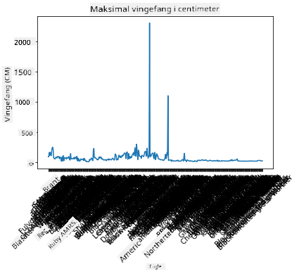
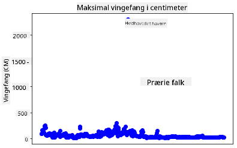
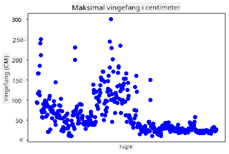
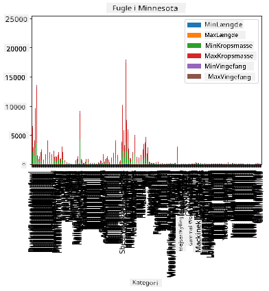
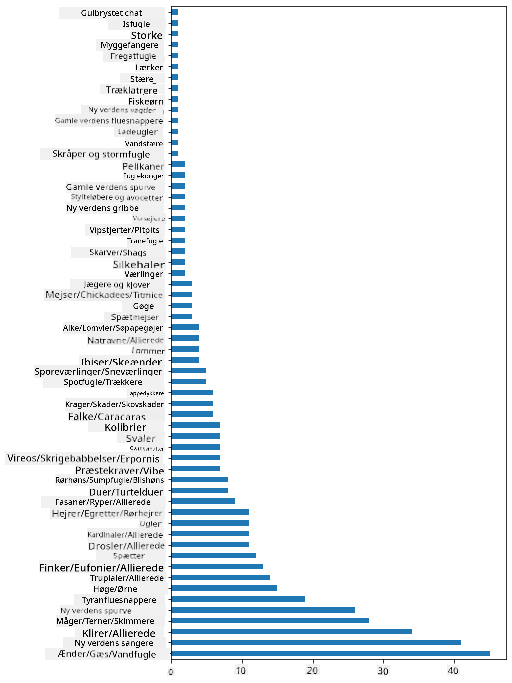
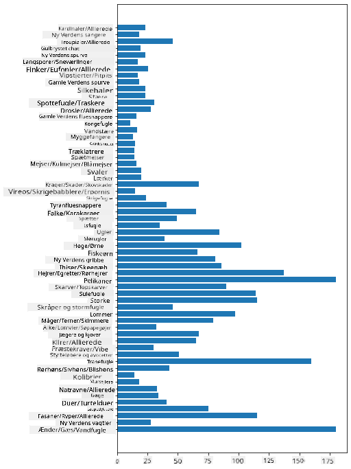

<!--
CO_OP_TRANSLATOR_METADATA:
{
  "original_hash": "43c402d9d90ae6da55d004519ada5033",
  "translation_date": "2025-08-26T23:17:45+00:00",
  "source_file": "3-Data-Visualization/09-visualization-quantities/README.md",
  "language_code": "da"
}
-->
# Visualisering af mængder

| ](../../sketchnotes/09-Visualizing-Quantities.png)|
|:---:|
| Visualisering af mængder - _Sketchnote af [@nitya](https://twitter.com/nitya)_ |

I denne lektion vil du udforske, hvordan du kan bruge en af de mange tilgængelige Python-biblioteker til at lære at skabe interessante visualiseringer omkring begrebet mængde. Ved at bruge et renset datasæt om fuglene i Minnesota kan du lære mange interessante fakta om det lokale dyreliv.  
## [Quiz før lektionen](https://purple-hill-04aebfb03.1.azurestaticapps.net/quiz/16)

## Observer vingefang med Matplotlib

Et fremragende bibliotek til at skabe både simple og avancerede grafer og diagrammer af forskellige slags er [Matplotlib](https://matplotlib.org/stable/index.html). Generelt indebærer processen med at plotte data ved hjælp af disse biblioteker at identificere de dele af din dataframe, du vil fokusere på, udføre nødvendige transformationer på dataene, tildele værdier til x- og y-aksen, beslutte hvilken type diagram der skal vises, og derefter vise diagrammet. Matplotlib tilbyder et stort udvalg af visualiseringer, men for denne lektion vil vi fokusere på dem, der er mest passende til at visualisere mængder: linjediagrammer, scatterplots og søjlediagrammer.

> ✅ Brug det bedste diagram til at passe til din datas struktur og den historie, du vil fortælle.  
> - For at analysere trends over tid: linje  
> - For at sammenligne værdier: søjle, kolonne, cirkel, scatterplot  
> - For at vise, hvordan dele relaterer sig til helheden: cirkel  
> - For at vise datafordeling: scatterplot, søjle  
> - For at vise trends: linje, kolonne  
> - For at vise relationer mellem værdier: linje, scatterplot, boble  

Hvis du har et datasæt og skal finde ud af, hvor meget der er af en given genstand, vil en af de første opgaver være at inspicere dens værdier.  

✅ Der findes meget gode 'cheat sheets' til Matplotlib [her](https://matplotlib.org/cheatsheets/cheatsheets.pdf).

## Byg et linjediagram over fuglenes vingefangsværdier

Åbn filen `notebook.ipynb` i roden af denne lektionsmappe og tilføj en celle.

> Bemærk: dataene er gemt i roden af dette repo i mappen `/data`.

```python
import pandas as pd
import matplotlib.pyplot as plt
birds = pd.read_csv('../../data/birds.csv')
birds.head()
```  
Disse data er en blanding af tekst og tal:

|      | Navn                         | VidenskabeligtNavn     | Kategori              | Orden        | Familie  | Slægt       | Bevaringsstatus     | MinLængde | MaxLængde | MinKropsmasse | MaxKropsmasse | MinVingefang | MaxVingefang |
| ---: | :--------------------------- | :--------------------- | :-------------------- | :----------- | :------- | :---------- | :----------------- | --------: | --------: | ----------: | ----------: | ----------: | ----------: |
|    0 | Sortbuget fløjlsand          | Dendrocygna autumnalis | Ænder/Gæs/Vandfugle   | Anseriformes | Anatidae | Dendrocygna | LC                 |        47 |        56 |         652 |        1020 |          76 |          94 |
|    1 | Rødbrun fløjlsand            | Dendrocygna bicolor    | Ænder/Gæs/Vandfugle   | Anseriformes | Anatidae | Dendrocygna | LC                 |        45 |        53 |         712 |        1050 |          85 |          93 |
|    2 | Snegås                       | Anser caerulescens     | Ænder/Gæs/Vandfugle   | Anseriformes | Anatidae | Anser       | LC                 |        64 |        79 |        2050 |        4050 |         135 |         165 |
|    3 | Ross' gås                    | Anser rossii           | Ænder/Gæs/Vandfugle   | Anseriformes | Anatidae | Anser       | LC                 |      57.3 |        64 |        1066 |        1567 |         113 |         116 |
|    4 | Stor hvidkindet gås          | Anser albifrons        | Ænder/Gæs/Vandfugle   | Anseriformes | Anatidae | Anser       | LC                 |        64 |        81 |        1930 |        3310 |         130 |         165 |

Lad os starte med at plotte nogle af de numeriske data ved hjælp af et grundlæggende linjediagram. Antag, at du vil have et overblik over det maksimale vingefang for disse interessante fugle.

```python
wingspan = birds['MaxWingspan'] 
wingspan.plot()
```  


Hvad bemærker du med det samme? Der ser ud til at være mindst én outlier - det er et ret imponerende vingefang! Et vingefang på 2300 centimeter svarer til 23 meter - er der Pterodactyler, der flyver rundt i Minnesota? Lad os undersøge det.

Selvom du hurtigt kunne sortere i Excel for at finde disse outliers, som sandsynligvis er tastefejl, fortsæt visualiseringsprocessen ved at arbejde direkte fra diagrammet.

Tilføj labels til x-aksen for at vise, hvilke fugle der er tale om:

```
plt.title('Max Wingspan in Centimeters')
plt.ylabel('Wingspan (CM)')
plt.xlabel('Birds')
plt.xticks(rotation=45)
x = birds['Name'] 
y = birds['MaxWingspan']

plt.plot(x, y)

plt.show()
```  


Selv med rotation af labels sat til 45 grader er der for mange til at læse. Lad os prøve en anden strategi: label kun outliers og sæt labels inden for diagrammet. Du kan bruge et scatterplot for at skabe mere plads til labeling:

```python
plt.title('Max Wingspan in Centimeters')
plt.ylabel('Wingspan (CM)')
plt.tick_params(axis='both',which='both',labelbottom=False,bottom=False)

for i in range(len(birds)):
    x = birds['Name'][i]
    y = birds['MaxWingspan'][i]
    plt.plot(x, y, 'bo')
    if birds['MaxWingspan'][i] > 500:
        plt.text(x, y * (1 - 0.05), birds['Name'][i], fontsize=12)
    
plt.show()
```  
Hvad sker der her? Du brugte `tick_params` til at skjule de nederste labels og derefter oprettede en loop over dit fugledatasæt. Ved at plotte diagrammet med små runde blå prikker ved hjælp af `bo`, tjekkede du for enhver fugl med et maksimalt vingefang over 500 og viste deres label ved siden af prikken, hvis det var tilfældet. Du forskød labels lidt på y-aksen (`y * (1 - 0.05)`) og brugte fuglens navn som label.

Hvad opdagede du?

  
## Filtrer dine data

Både Hvidhovedet Ørn og Præriefalken, selvom de sandsynligvis er meget store fugle, ser ud til at være fejlagtigt mærket med et ekstra `0` tilføjet til deres maksimale vingefang. Det er usandsynligt, at du vil møde en Hvidhovedet Ørn med et vingefang på 25 meter, men hvis det sker, så lad os det vide! Lad os oprette en ny dataframe uden disse to outliers:

```python
plt.title('Max Wingspan in Centimeters')
plt.ylabel('Wingspan (CM)')
plt.xlabel('Birds')
plt.tick_params(axis='both',which='both',labelbottom=False,bottom=False)
for i in range(len(birds)):
    x = birds['Name'][i]
    y = birds['MaxWingspan'][i]
    if birds['Name'][i] not in ['Bald eagle', 'Prairie falcon']:
        plt.plot(x, y, 'bo')
plt.show()
```  

Ved at filtrere outliers ud er dine data nu mere sammenhængende og forståelige.



Nu hvor vi har et renere datasæt, i det mindste hvad angår vingefang, lad os opdage mere om disse fugle.

Mens linje- og scatterplots kan vise information om dataværdier og deres fordeling, vil vi tænke over de værdier, der er iboende i dette datasæt. Du kunne skabe visualiseringer for at besvare følgende spørgsmål om mængder:

> Hvor mange kategorier af fugle er der, og hvad er deres antal?  
> Hvor mange fugle er uddøde, truede, sjældne eller almindelige?  
> Hvor mange er der af de forskellige slægter og ordener i Linnés terminologi?  
## Udforsk søjlediagrammer

Søjlediagrammer er praktiske, når du skal vise grupperinger af data. Lad os udforske kategorierne af fugle, der findes i dette datasæt, for at se, hvilken der er mest almindelig i antal.

I notebook-filen skal du oprette et grundlæggende søjlediagram.

✅ Bemærk, du kan enten filtrere de to outlier-fugle, vi identificerede i det foregående afsnit, rette tastefejlen i deres vingefang eller lade dem være med i disse øvelser, som ikke afhænger af vingefangsværdier.

Hvis du vil oprette et søjlediagram, kan du vælge de data, du vil fokusere på. Søjlediagrammer kan oprettes fra rå data:

```python
birds.plot(x='Category',
        kind='bar',
        stacked=True,
        title='Birds of Minnesota')

```  


Dette søjlediagram er dog ulæseligt, fordi der er for meget ikke-grupperet data. Du skal vælge kun de data, du vil plotte, så lad os se på længden af fugle baseret på deres kategori.

Filtrer dine data til kun at inkludere fuglens kategori.

✅ Bemærk, at du bruger Pandas til at administrere dataene og derefter lader Matplotlib stå for diagrammeringen.

Da der er mange kategorier, kan du vise dette diagram lodret og justere dets højde for at tage højde for alle dataene:

```python
category_count = birds.value_counts(birds['Category'].values, sort=True)
plt.rcParams['figure.figsize'] = [6, 12]
category_count.plot.barh()
```  


Dette søjlediagram giver et godt overblik over antallet af fugle i hver kategori. Med et øjebliks blik ser du, at det største antal fugle i denne region er i kategorien Ænder/Gæs/Vandfugle. Minnesota er 'landet med 10.000 søer', så det er ikke overraskende!

✅ Prøv nogle andre optællinger på dette datasæt. Er der noget, der overrasker dig?

## Sammenligning af data

Du kan prøve forskellige sammenligninger af grupperede data ved at oprette nye akser. Prøv en sammenligning af MaxLængde for en fugl baseret på dens kategori:

```python
maxlength = birds['MaxLength']
plt.barh(y=birds['Category'], width=maxlength)
plt.rcParams['figure.figsize'] = [6, 12]
plt.show()
```  


Intet er overraskende her: kolibrier har den mindste MaxLængde sammenlignet med pelikaner eller gæs. Det er godt, når data giver logisk mening!

Du kan skabe mere interessante visualiseringer af søjlediagrammer ved at overlejre data. Lad os overlejre Minimum og Maksimum Længde på en given fuglekategori:

```python
minLength = birds['MinLength']
maxLength = birds['MaxLength']
category = birds['Category']

plt.barh(category, maxLength)
plt.barh(category, minLength)

plt.show()
```  
I dette diagram kan du se spændet pr. fuglekategori af Minimum Længde og Maksimum Længde. Du kan trygt sige, at jo større fuglen er, jo større er dens længdespænd. Fascinerende!


## 🚀 Udfordring

Dette fugledatasæt tilbyder en rigdom af information om forskellige typer fugle inden for et bestemt økosystem. Søg rundt på internettet og se, om du kan finde andre fugleorienterede datasæt. Øv dig i at bygge diagrammer og grafer omkring disse fugle for at opdage fakta, du ikke vidste.  
## [Quiz efter lektionen](https://purple-hill-04aebfb03.1.azurestaticapps.net/quiz/17)

## Gennemgang & Selvstudie

Denne første lektion har givet dig noget information om, hvordan du bruger Matplotlib til at visualisere mængder. Undersøg andre måder at arbejde med datasæt til visualisering. [Plotly](https://github.com/plotly/plotly.py) er et, vi ikke vil dække i disse lektioner, så tag et kig på, hvad det kan tilbyde.  
## Opgave

[Linjer, Scatterplots og Søjler](assignment.md)  

---

**Ansvarsfraskrivelse**:  
Dette dokument er blevet oversat ved hjælp af AI-oversættelsestjenesten [Co-op Translator](https://github.com/Azure/co-op-translator). Selvom vi bestræber os på nøjagtighed, skal du være opmærksom på, at automatiserede oversættelser kan indeholde fejl eller unøjagtigheder. Det originale dokument på dets oprindelige sprog bør betragtes som den autoritative kilde. For kritisk information anbefales professionel menneskelig oversættelse. Vi er ikke ansvarlige for eventuelle misforståelser eller fejltolkninger, der måtte opstå som følge af brugen af denne oversættelse.