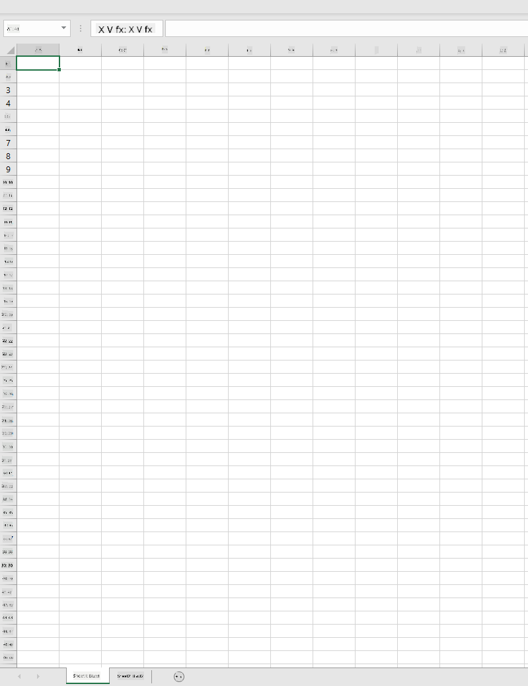
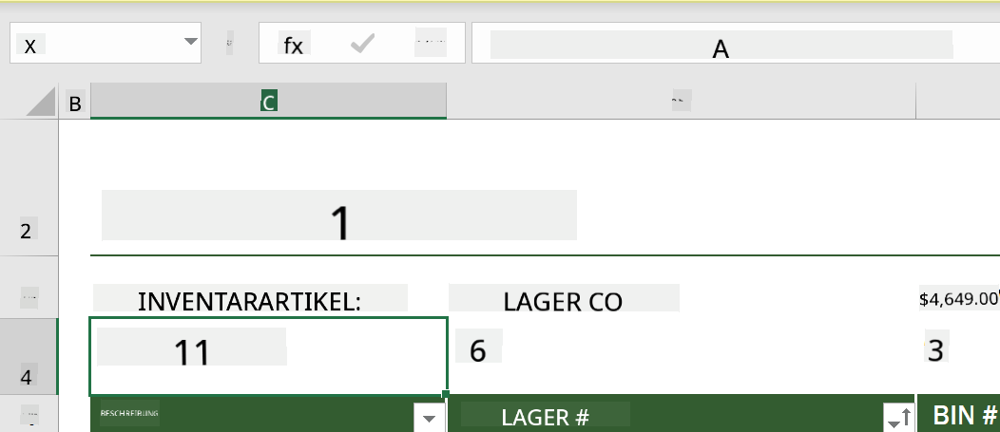
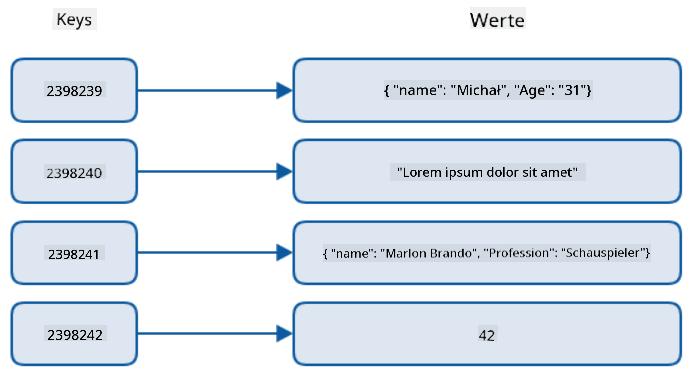
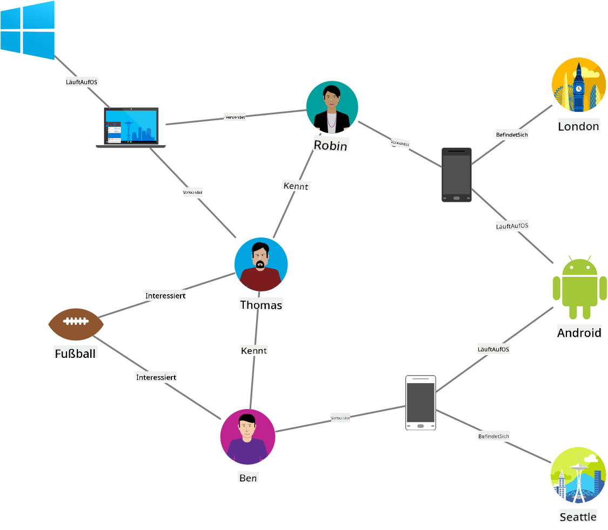
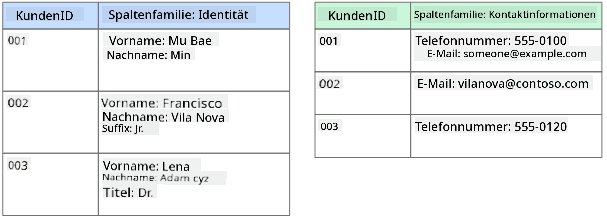
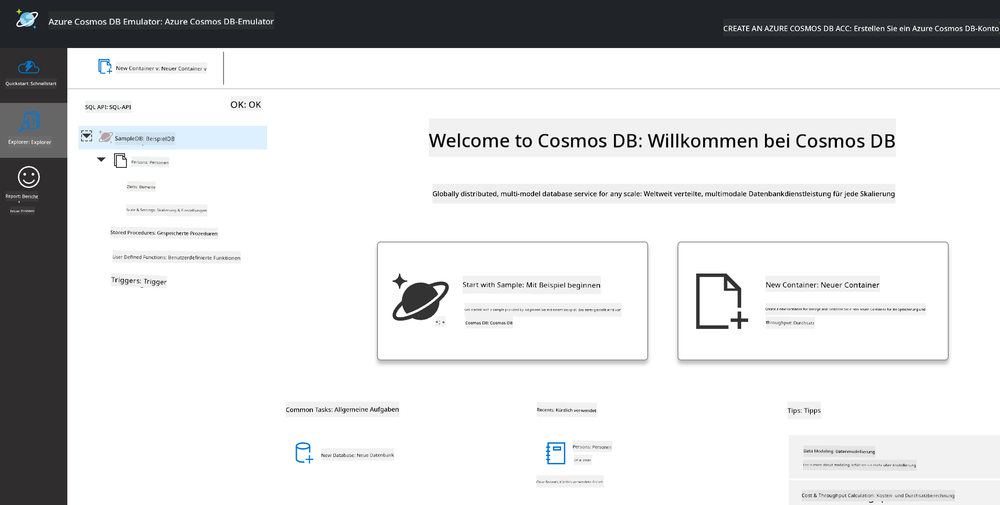
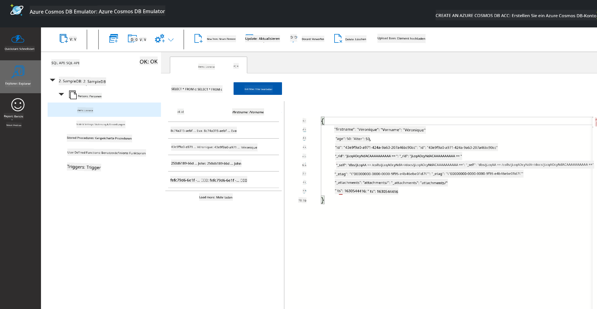
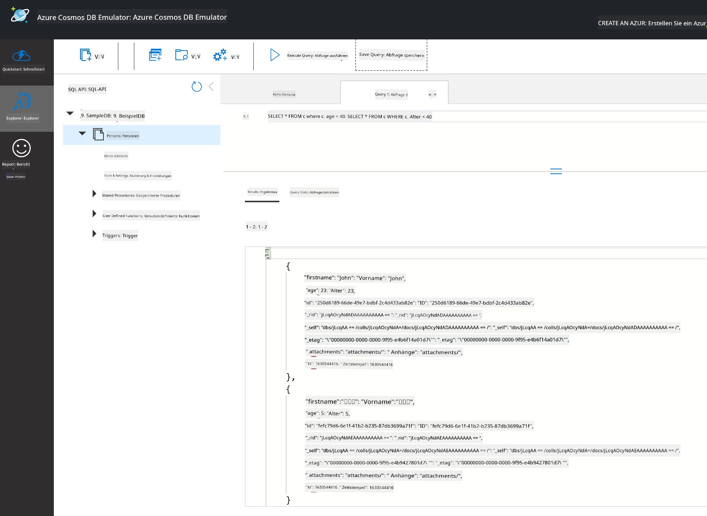

<!--
CO_OP_TRANSLATOR_METADATA:
{
  "original_hash": "32ddfef8121650f2ca2f3416fd283c37",
  "translation_date": "2025-08-24T21:10:58+00:00",
  "source_file": "2-Working-With-Data/06-non-relational/README.md",
  "language_code": "de"
}
-->
# Arbeiten mit Daten: Nicht-relationale Daten

| ](../../sketchnotes/06-NoSQL.png)|
|:---:|
|Arbeiten mit NoSQL-Daten - _Sketchnote von [@nitya](https://twitter.com/nitya)_ |

## [Quiz vor der Vorlesung](https://purple-hill-04aebfb03.1.azurestaticapps.net/quiz/10)

Daten sind nicht nur auf relationale Datenbanken beschränkt. Diese Lektion konzentriert sich auf nicht-relationale Daten und behandelt die Grundlagen von Tabellenkalkulationen und NoSQL.

## Tabellenkalkulationen

Tabellenkalkulationen sind eine beliebte Methode, um Daten zu speichern und zu analysieren, da sie weniger Aufwand für die Einrichtung und den Start erfordern. In dieser Lektion lernst du die grundlegenden Bestandteile einer Tabellenkalkulation sowie Formeln und Funktionen kennen. Die Beispiele werden mit Microsoft Excel illustriert, aber die meisten Begriffe und Schritte sind vergleichbar mit anderen Tabellenkalkulationsprogrammen.



Eine Tabellenkalkulation ist eine Datei und wird im Dateisystem eines Computers, Geräts oder cloudbasierten Dateisystems gespeichert. Die Software selbst kann browserbasiert oder eine Anwendung sein, die auf einem Computer installiert oder als App heruntergeladen werden muss. In Excel werden diese Dateien auch als **Arbeitsmappen** bezeichnet, und diese Terminologie wird in der restlichen Lektion verwendet.

Eine Arbeitsmappe enthält ein oder mehrere **Arbeitsblätter**, die durch Tabs gekennzeichnet sind. Innerhalb eines Arbeitsblatts befinden sich Rechtecke, die als **Zellen** bezeichnet werden und die eigentlichen Daten enthalten. Eine Zelle ist der Schnittpunkt einer Zeile und einer Spalte, wobei die Spalten mit Buchstaben und die Zeilen numerisch gekennzeichnet sind. Einige Tabellenkalkulationen enthalten in den ersten Zeilen Kopfzeilen, die die Daten in einer Zelle beschreiben.

Mit diesen grundlegenden Elementen einer Excel-Arbeitsmappe verwenden wir ein Beispiel aus den [Microsoft-Vorlagen](https://templates.office.com/), das sich auf ein Inventar konzentriert, um weitere Bestandteile einer Tabellenkalkulation zu erläutern.

### Verwaltung eines Inventars

Die Tabellenkalkulationsdatei mit dem Namen "InventoryExample" ist eine formatierte Tabelle mit Artikeln in einem Inventar, die drei Arbeitsblätter enthält. Die Tabs sind mit "Inventory List", "Inventory Pick List" und "Bin Lookup" beschriftet. Zeile 4 des Arbeitsblatts "Inventory List" ist die Kopfzeile, die den Wert jeder Zelle in der Kopfspalte beschreibt.


Es gibt Fälle, in denen der Wert einer Zelle von den Werten anderer Zellen abhängt. Die Tabelle "Inventory List" verfolgt die Kosten jedes Artikels im Inventar, aber was ist, wenn wir den Gesamtwert des Inventars wissen möchten? [**Formeln**](https://support.microsoft.com/de-de/office/overview-of-formulas-34519a4e-1e8d-4f4b-84d4-d642c4f63263) führen Aktionen mit Zellenwerten aus und werden in diesem Beispiel verwendet, um die Kosten des Inventars zu berechnen. Diese Tabelle verwendet eine Formel in der Spalte "Inventory Value", um den Wert jedes Artikels zu berechnen, indem die Menge unter der Kopfzeile "QTY" mit den Kosten unter der Kopfzeile "COST" multipliziert wird. Durch Doppelklicken oder Markieren einer Zelle wird die Formel angezeigt. Formeln beginnen immer mit einem Gleichheitszeichen, gefolgt von der Berechnung oder Operation.



Wir können eine weitere Formel verwenden, um alle Werte der Spalte "Inventory Value" zusammenzuzählen und den Gesamtwert zu erhalten. Dies könnte durch das manuelle Addieren jeder Zelle erfolgen, was jedoch mühsam wäre. Excel bietet [**Funktionen**](https://support.microsoft.com/de-de/office/sum-function-043e1c7d-7726-4e80-8f32-07b23e057f89), vordefinierte Formeln, die Berechnungen mit Zellenwerten durchführen. Funktionen benötigen Argumente, also die erforderlichen Werte für die Berechnung. Wenn Funktionen mehr als ein Argument benötigen, müssen diese in einer bestimmten Reihenfolge angegeben werden, damit die Funktion korrekt berechnet. In diesem Beispiel wird die SUM-Funktion verwendet, die die Werte der Spalte "Inventory Value" als Argument nimmt, um die Gesamtsumme in Zeile 3, Spalte B (auch als B3 bezeichnet) zu berechnen.

## NoSQL

NoSQL ist ein Sammelbegriff für verschiedene Methoden zur Speicherung nicht-relationaler Daten und kann als "non-SQL", "nicht-relational" oder "nicht nur SQL" interpretiert werden. Diese Art von Datenbanksystemen lässt sich in vier Typen unterteilen.


> Quelle: [Michał Białecki Blog](https://www.michalbialecki.com/2018/03/18/azure-cosmos-db-key-value-database-cloud/)

[Key-Value](https://docs.microsoft.com/de-de/azure/architecture/data-guide/big-data/non-relational-data#keyvalue-data-stores)-Datenbanken speichern eindeutige Schlüssel, die als eindeutige Kennung mit einem Wert verknüpft sind. Diese Paare werden mithilfe einer [Hashtabelle](https://www.hackerearth.com/practice/data-structures/hash-tables/basics-of-hash-tables/tutorial/) und einer geeigneten Hash-Funktion gespeichert.


> Quelle: [Microsoft](https://docs.microsoft.com/de-de/azure/cosmos-db/graph/graph-introduction#graph-database-by-example)

[Graph](https://docs.microsoft.com/de-de/azure/architecture/data-guide/big-data/non-relational-data#graph-data-stores)-Datenbanken beschreiben Beziehungen in Daten und werden als Sammlung von Knoten und Kanten dargestellt. Ein Knoten repräsentiert eine Entität, etwas, das in der realen Welt existiert, wie ein Student oder ein Kontoauszug. Kanten repräsentieren die Beziehung zwischen zwei Entitäten. Jeder Knoten und jede Kante hat Eigenschaften, die zusätzliche Informationen bereitstellen.



[Spaltenbasierte](https://docs.microsoft.com/de-de/azure/architecture/data-guide/big-data/non-relational-data#columnar-data-stores) Datenspeicher organisieren Daten in Spalten und Zeilen wie eine relationale Datenstruktur, aber jede Spalte wird in Gruppen namens Spaltenfamilien unterteilt, wobei alle Daten unter einer Spalte zusammengehören und als Einheit abgerufen oder geändert werden können.

### Dokumenten-Datenspeicher mit Azure Cosmos DB

[Dokumenten](https://docs.microsoft.com/de-de/azure/architecture/data-guide/big-data/non-relational-data#document-data-stores)-Datenspeicher basieren auf dem Konzept eines Key-Value-Datenspeichers und bestehen aus einer Reihe von Feldern und Objekten. In diesem Abschnitt werden Dokumentendatenbanken mit dem Cosmos DB Emulator untersucht.

Eine Cosmos DB-Datenbank entspricht der Definition von "Nicht nur SQL", da die Dokumentendatenbank von Cosmos DB auf SQL basiert, um die Daten abzufragen. Die [vorherige Lektion](../05-relational-databases/README.md) zu SQL behandelt die Grundlagen der Sprache, und wir können einige der gleichen Abfragen hier auf eine Dokumentendatenbank anwenden. Wir verwenden den Cosmos DB Emulator, der es uns ermöglicht, eine Dokumentendatenbank lokal auf einem Computer zu erstellen und zu erkunden. Weitere Informationen zum Emulator findest du [hier](https://docs.microsoft.com/de-de/azure/cosmos-db/local-emulator?tabs=ssl-netstd21).

Ein Dokument ist eine Sammlung von Feldern und Objektwerten, wobei die Felder beschreiben, was der Objektwert darstellt. Unten ist ein Beispiel für ein Dokument.

```json
{
    "firstname": "Eva",
    "age": 44,
    "id": "8c74a315-aebf-4a16-bb38-2430a9896ce5",
    "_rid": "bHwDAPQz8s0BAAAAAAAAAA==",
    "_self": "dbs/bHwDAA==/colls/bHwDAPQz8s0=/docs/bHwDAPQz8s0BAAAAAAAAAA==/",
    "_etag": "\"00000000-0000-0000-9f95-010a691e01d7\"",
    "_attachments": "attachments/",
    "_ts": 1630544034
}
```

Die interessanten Felder in diesem Dokument sind: `firstname`, `id` und `age`. Die restlichen Felder mit den Unterstrichen wurden von Cosmos DB generiert.

#### Daten mit dem Cosmos DB Emulator erkunden

Du kannst den Emulator [für Windows hier herunterladen und installieren](https://aka.ms/cosmosdb-emulator). Informationen zur Ausführung des Emulators unter macOS und Linux findest du in dieser [Dokumentation](https://docs.microsoft.com/de-de/azure/cosmos-db/local-emulator?tabs=ssl-netstd21#run-on-linux-macos).

Der Emulator öffnet ein Browserfenster, in dem die Explorer-Ansicht es ermöglicht, Dokumente zu erkunden.



Wenn du mitmachst, klicke auf "Start with Sample", um eine Beispieldatenbank namens SampleDB zu erstellen. Wenn du SampleDB durch Klicken auf den Pfeil erweiterst, findest du einen Container namens `Persons`. Ein Container enthält eine Sammlung von Elementen, die die Dokumente im Container sind. Du kannst die vier einzelnen Dokumente unter `Items` erkunden.



#### Dokumentendaten mit dem Cosmos DB Emulator abfragen

Wir können die Beispieldaten auch abfragen, indem wir auf die Schaltfläche "New SQL Query" (zweite Schaltfläche von links) klicken.

`SELECT * FROM c` gibt alle Dokumente im Container zurück. Fügen wir eine WHERE-Klausel hinzu, um alle Personen unter 40 zu finden.

`SELECT * FROM c where c.age < 40`



Die Abfrage gibt zwei Dokumente zurück. Beachte, dass der Alterswert für jedes Dokument kleiner als 40 ist.

#### JSON und Dokumente

Wenn du mit JavaScript Object Notation (JSON) vertraut bist, wirst du feststellen, dass Dokumente JSON ähneln. In diesem Verzeichnis gibt es eine Datei namens `PersonsData.json` mit weiteren Daten, die du über die Schaltfläche `Upload Item` in den Container `Persons` im Emulator hochladen kannst.

In den meisten Fällen können APIs, die JSON-Daten zurückgeben, direkt in Dokumentendatenbanken übertragen und gespeichert werden. Unten ist ein weiteres Dokument, das Tweets vom Microsoft-Twitter-Konto darstellt, die über die Twitter-API abgerufen und dann in Cosmos DB eingefügt wurden.

```json
{
    "created_at": "2021-08-31T19:03:01.000Z",
    "id": "1432780985872142341",
    "text": "Blank slate. Like this tweet if you’ve ever painted in Microsoft Paint before. https://t.co/cFeEs8eOPK",
    "_rid": "dhAmAIUsA4oHAAAAAAAAAA==",
    "_self": "dbs/dhAmAA==/colls/dhAmAIUsA4o=/docs/dhAmAIUsA4oHAAAAAAAAAA==/",
    "_etag": "\"00000000-0000-0000-9f84-a0958ad901d7\"",
    "_attachments": "attachments/",
    "_ts": 1630537000
```

Die interessanten Felder in diesem Dokument sind: `created_at`, `id` und `text`.

## 🚀 Herausforderung

Es gibt eine Datei namens `TwitterData.json`, die du in die SampleDB-Datenbank hochladen kannst. Es wird empfohlen, sie in einem separaten Container hinzuzufügen. Dies kann wie folgt erfolgen:

1. Klicke auf die Schaltfläche "New Container" oben rechts.
1. Wähle die bestehende Datenbank (SampleDB) aus, erstelle eine Container-ID für den Container.
1. Setze den Partitionsschlüssel auf `/id`.
1. Klicke auf OK (du kannst den Rest der Informationen in dieser Ansicht ignorieren, da es sich um einen kleinen Datensatz handelt, der lokal auf deinem Computer läuft).
1. Öffne deinen neuen Container und lade die Twitter-Daten-Datei über die Schaltfläche `Upload Item` hoch.

Versuche, einige SELECT-Abfragen auszuführen, um die Dokumente zu finden, die "Microsoft" im Textfeld enthalten. Tipp: Verwende das [LIKE-Schlüsselwort](https://docs.microsoft.com/de-de/azure/cosmos-db/sql/sql-query-keywords#using-like-with-the--wildcard-character).

## [Quiz nach der Vorlesung](https://purple-hill-04aebfb03.1.azurestaticapps.net/quiz/11)

## Wiederholung & Selbststudium

- Es gibt zusätzliche Formatierungen und Funktionen in dieser Tabellenkalkulation, die in dieser Lektion nicht behandelt werden. Microsoft bietet eine [umfangreiche Bibliothek mit Dokumentationen und Videos](https://support.microsoft.com/excel) zu Excel, falls du mehr lernen möchtest.

- Diese Architektur-Dokumentation beschreibt die Eigenschaften der verschiedenen Arten von nicht-relationalen Daten: [Nicht-relationale Daten und NoSQL](https://docs.microsoft.com/de-de/azure/architecture/data-guide/big-data/non-relational-data).

- Cosmos DB ist eine cloudbasierte nicht-relationale Datenbank, die auch die in dieser Lektion erwähnten verschiedenen NoSQL-Typen speichern kann. Erfahre mehr über diese Typen in diesem [Cosmos DB Microsoft Learn Modul](https://docs.microsoft.com/de-de/learn/paths/work-with-nosql-data-in-azure-cosmos-db/).

## Aufgabe

[Soda Profits](assignment.md)

**Haftungsausschluss**:  
Dieses Dokument wurde mit dem KI-Übersetzungsdienst [Co-op Translator](https://github.com/Azure/co-op-translator) übersetzt. Obwohl wir uns um Genauigkeit bemühen, weisen wir darauf hin, dass automatisierte Übersetzungen Fehler oder Ungenauigkeiten enthalten können. Das Originaldokument in seiner ursprünglichen Sprache sollte als maßgebliche Quelle betrachtet werden. Für kritische Informationen wird eine professionelle menschliche Übersetzung empfohlen. Wir übernehmen keine Haftung für Missverständnisse oder Fehlinterpretationen, die sich aus der Nutzung dieser Übersetzung ergeben.