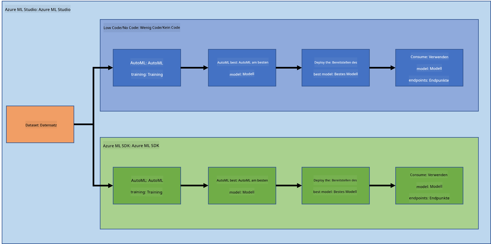
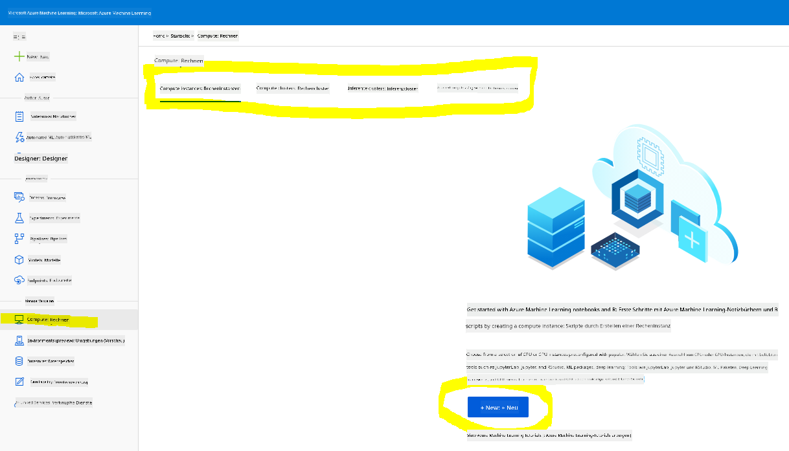
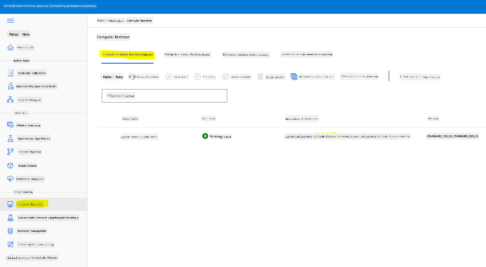

<!--
CO_OP_TRANSLATOR_METADATA:
{
  "original_hash": "73dead89dc2ddda4d6ec0232814a191e",
  "translation_date": "2025-08-24T22:07:41+00:00",
  "source_file": "5-Data-Science-In-Cloud/19-Azure/README.md",
  "language_code": "de"
}
-->
# Datenwissenschaft in der Cloud: Der "Azure ML SDK"-Ansatz

| ](../../sketchnotes/19-DataScience-Cloud.png)|
|:---:|
| Datenwissenschaft in der Cloud: Azure ML SDK - _Sketchnote von [@nitya](https://twitter.com/nitya)_ |

Inhaltsverzeichnis:

- [Datenwissenschaft in der Cloud: Der "Azure ML SDK"-Ansatz](../../../../5-Data-Science-In-Cloud/19-Azure)
  - [Quiz vor der Vorlesung](../../../../5-Data-Science-In-Cloud/19-Azure)
  - [1. Einführung](../../../../5-Data-Science-In-Cloud/19-Azure)
    - [1.1 Was ist das Azure ML SDK?](../../../../5-Data-Science-In-Cloud/19-Azure)
    - [1.2 Einführung in das Projekt und den Datensatz zur Vorhersage von Herzinsuffizienz](../../../../5-Data-Science-In-Cloud/19-Azure)
  - [2. Training eines Modells mit dem Azure ML SDK](../../../../5-Data-Science-In-Cloud/19-Azure)
    - [2.1 Erstellen eines Azure ML-Arbeitsbereichs](../../../../5-Data-Science-In-Cloud/19-Azure)
    - [2.2 Erstellen einer Compute-Instanz](../../../../5-Data-Science-In-Cloud/19-Azure)
    - [2.3 Laden des Datensatzes](../../../../5-Data-Science-In-Cloud/19-Azure)
    - [2.4 Erstellen von Notebooks](../../../../5-Data-Science-In-Cloud/19-Azure)
    - [2.5 Training eines Modells](../../../../5-Data-Science-In-Cloud/19-Azure)
      - [2.5.1 Einrichten von Arbeitsbereich, Experiment, Compute-Cluster und Datensatz](../../../../5-Data-Science-In-Cloud/19-Azure)
      - [2.5.2 AutoML-Konfiguration und Training](../../../../5-Data-Science-In-Cloud/19-Azure)
  - [3. Modellbereitstellung und Nutzung des Endpunkts mit dem Azure ML SDK](../../../../5-Data-Science-In-Cloud/19-Azure)
    - [3.1 Speichern des besten Modells](../../../../5-Data-Science-In-Cloud/19-Azure)
    - [3.2 Modellbereitstellung](../../../../5-Data-Science-In-Cloud/19-Azure)
    - [3.3 Nutzung des Endpunkts](../../../../5-Data-Science-In-Cloud/19-Azure)
  - [🚀 Herausforderung](../../../../5-Data-Science-In-Cloud/19-Azure)
  - [Quiz nach der Vorlesung](../../../../5-Data-Science-In-Cloud/19-Azure)
  - [Überblick & Selbststudium](../../../../5-Data-Science-In-Cloud/19-Azure)
  - [Aufgabe](../../../../5-Data-Science-In-Cloud/19-Azure)

## [Quiz vor der Vorlesung](https://purple-hill-04aebfb03.1.azurestaticapps.net/quiz/36)

## 1. Einführung

### 1.1 Was ist das Azure ML SDK?

Datenwissenschaftler und KI-Entwickler nutzen das Azure Machine Learning SDK, um Workflows für maschinelles Lernen mit dem Azure Machine Learning-Dienst zu erstellen und auszuführen. Sie können in jeder Python-Umgebung mit dem Dienst interagieren, einschließlich Jupyter Notebooks, Visual Studio Code oder Ihrer bevorzugten Python-IDE.

Wichtige Bereiche des SDK umfassen:

- Erkunden, Vorbereiten und Verwalten des Lebenszyklus Ihrer Datensätze, die in Experimenten des maschinellen Lernens verwendet werden.
- Verwalten von Cloud-Ressourcen für Überwachung, Protokollierung und Organisation Ihrer Experimente.
- Trainieren von Modellen lokal oder mit Cloud-Ressourcen, einschließlich GPU-beschleunigtem Modelltraining.
- Nutzen von automatisiertem maschinellen Lernen, das Konfigurationsparameter und Trainingsdaten akzeptiert. Es iteriert automatisch durch Algorithmen und Hyperparameter-Einstellungen, um das beste Modell für Vorhersagen zu finden.
- Bereitstellen von Webdiensten, um Ihre trainierten Modelle in RESTful-Dienste umzuwandeln, die in jeder Anwendung genutzt werden können.

[Erfahren Sie mehr über das Azure Machine Learning SDK](https://docs.microsoft.com/python/api/overview/azure/ml?WT.mc_id=academic-77958-bethanycheum&ocid=AID3041109)

In der [vorherigen Lektion](../18-Low-Code/README.md) haben wir gesehen, wie man ein Modell auf Low-Code/No-Code-Weise trainiert, bereitstellt und nutzt. Wir haben den Herzinsuffizienz-Datensatz verwendet, um ein Vorhersagemodell zu erstellen. In dieser Lektion werden wir genau dasselbe tun, jedoch mit dem Azure Machine Learning SDK.



### 1.2 Einführung in das Projekt und den Datensatz zur Vorhersage von Herzinsuffizienz

Sehen Sie sich [hier](../18-Low-Code/README.md) die Einführung in das Projekt und den Datensatz zur Vorhersage von Herzinsuffizienz an.

## 2. Training eines Modells mit dem Azure ML SDK
### 2.1 Erstellen eines Azure ML-Arbeitsbereichs

Der Einfachheit halber arbeiten wir in einem Jupyter Notebook. Das bedeutet, dass Sie bereits einen Arbeitsbereich und eine Compute-Instanz haben. Wenn Sie bereits einen Arbeitsbereich haben, können Sie direkt zum Abschnitt 2.3 Notebook-Erstellung springen.

Falls nicht, folgen Sie bitte den Anweisungen im Abschnitt **2.1 Erstellen eines Azure ML-Arbeitsbereichs** in der [vorherigen Lektion](../18-Low-Code/README.md), um einen Arbeitsbereich zu erstellen.

### 2.2 Erstellen einer Compute-Instanz

Gehen Sie im [Azure ML-Arbeitsbereich](https://ml.azure.com/), den wir zuvor erstellt haben, zum Menü "Compute", und Sie sehen die verschiedenen verfügbaren Compute-Ressourcen.



Erstellen wir eine Compute-Instanz, um ein Jupyter Notebook bereitzustellen. 
1. Klicken Sie auf die Schaltfläche + Neu. 
2. Geben Sie Ihrer Compute-Instanz einen Namen.
3. Wählen Sie Ihre Optionen: CPU oder GPU, VM-Größe und Anzahl der Kerne.
4. Klicken Sie auf die Schaltfläche Erstellen.

Herzlichen Glückwunsch, Sie haben gerade eine Compute-Instanz erstellt! Wir werden diese Compute-Instanz verwenden, um ein Notebook im Abschnitt [Erstellen von Notebooks](../../../../5-Data-Science-In-Cloud/19-Azure) zu erstellen.

### 2.3 Laden des Datensatzes
Falls Sie den Datensatz noch nicht hochgeladen haben, sehen Sie sich den Abschnitt **2.3 Laden des Datensatzes** in der [vorherigen Lektion](../18-Low-Code/README.md) an.

### 2.4 Erstellen von Notebooks

> **_HINWEIS:_** Für den nächsten Schritt können Sie entweder ein neues Notebook von Grund auf neu erstellen oder das [Notebook, das wir erstellt haben](../../../../5-Data-Science-In-Cloud/19-Azure/notebook.ipynb), in Ihrem Azure ML Studio hochladen. Um es hochzuladen, klicken Sie einfach auf das Menü "Notebook" und laden Sie das Notebook hoch.

Notebooks sind ein wirklich wichtiger Bestandteil des Datenwissenschaftsprozesses. Sie können verwendet werden, um explorative Datenanalysen (EDA) durchzuführen, einen Computer-Cluster aufzurufen, um ein Modell zu trainieren, oder einen Inferenz-Cluster aufzurufen, um einen Endpunkt bereitzustellen.

Um ein Notebook zu erstellen, benötigen wir einen Compute-Knoten, der die Jupyter Notebook-Instanz bereitstellt. Gehen Sie zurück zum [Azure ML-Arbeitsbereich](https://ml.azure.com/) und klicken Sie auf Compute-Instanzen. In der Liste der Compute-Instanzen sollten Sie die [Compute-Instanz sehen, die wir zuvor erstellt haben](../../../../5-Data-Science-In-Cloud/19-Azure). 

1. Klicken Sie im Abschnitt Anwendungen auf die Option Jupyter. 
2. Aktivieren Sie das Kästchen "Ja, ich verstehe" und klicken Sie auf die Schaltfläche Weiter.

3. Dies sollte eine neue Browser-Registerkarte mit Ihrer Jupyter Notebook-Instanz öffnen. Klicken Sie auf die Schaltfläche "Neu", um ein Notebook zu erstellen.


Jetzt, da wir ein Notebook haben, können wir mit dem Training des Modells mit dem Azure ML SDK beginnen.

### 2.5 Training eines Modells

Falls Sie jemals Zweifel haben, sehen Sie sich die [Azure ML SDK-Dokumentation](https://docs.microsoft.com/python/api/overview/azure/ml?WT.mc_id=academic-77958-bethanycheum&ocid=AID3041109) an. Sie enthält alle notwendigen Informationen, um die Module zu verstehen, die wir in dieser Lektion behandeln werden.

#### 2.5.1 Einrichten von Arbeitsbereich, Experiment, Compute-Cluster und Datensatz

Sie müssen den `workspace` aus der Konfigurationsdatei mit folgendem Code laden:

```python
from azureml.core import Workspace
ws = Workspace.from_config()
```

Dies gibt ein Objekt vom Typ `Workspace` zurück, das den Arbeitsbereich darstellt. Anschließend müssen Sie ein `experiment` erstellen, indem Sie den folgenden Code verwenden:

```python
from azureml.core import Experiment
experiment_name = 'aml-experiment'
experiment = Experiment(ws, experiment_name)
```
Um ein Experiment aus einem Arbeitsbereich zu erhalten oder zu erstellen, fordern Sie das Experiment mit dem Experimentnamen an. Der Experimentname muss 3-36 Zeichen lang sein, mit einem Buchstaben oder einer Zahl beginnen und darf nur Buchstaben, Zahlen, Unterstriche und Bindestriche enthalten. Wenn das Experiment im Arbeitsbereich nicht gefunden wird, wird ein neues Experiment erstellt.

Nun müssen Sie einen Compute-Cluster für das Training erstellen, indem Sie den folgenden Code verwenden. Beachten Sie, dass dieser Schritt einige Minuten dauern kann. 

```python
from azureml.core.compute import AmlCompute

aml_name = "heart-f-cluster"
try:
    aml_compute = AmlCompute(ws, aml_name)
    print('Found existing AML compute context.')
except:
    print('Creating new AML compute context.')
    aml_config = AmlCompute.provisioning_configuration(vm_size = "Standard_D2_v2", min_nodes=1, max_nodes=3)
    aml_compute = AmlCompute.create(ws, name = aml_name, provisioning_configuration = aml_config)
    aml_compute.wait_for_completion(show_output = True)

cts = ws.compute_targets
compute_target = cts[aml_name]
```

Sie können den Datensatz aus dem Arbeitsbereich mit dem Datensatznamen wie folgt abrufen:

```python
dataset = ws.datasets['heart-failure-records']
df = dataset.to_pandas_dataframe()
df.describe()
```
#### 2.5.2 AutoML-Konfiguration und Training

Um die AutoML-Konfiguration festzulegen, verwenden Sie die [AutoMLConfig-Klasse](https://docs.microsoft.com/python/api/azureml-train-automl-client/azureml.train.automl.automlconfig(class)?WT.mc_id=academic-77958-bethanycheum&ocid=AID3041109).

Wie in der Dokumentation beschrieben, gibt es viele Parameter, mit denen Sie experimentieren können. Für dieses Projekt verwenden wir die folgenden Parameter:

- `experiment_timeout_minutes`: Die maximale Zeit (in Minuten), die das Experiment laufen darf, bevor es automatisch gestoppt wird und die Ergebnisse verfügbar gemacht werden.
- `max_concurrent_iterations`: Die maximale Anzahl gleichzeitiger Trainingsiterationen, die für das Experiment erlaubt sind.
- `primary_metric`: Die Hauptmetrik, die verwendet wird, um den Status des Experiments zu bestimmen.
- `compute_target`: Das Azure Machine Learning-Compute-Ziel, auf dem das automatisierte maschinelle Lernen-Experiment ausgeführt wird.
- `task`: Der Typ der Aufgabe, die ausgeführt werden soll. Werte können 'classification', 'regression' oder 'forecasting' sein, je nach Art des zu lösenden automatisierten ML-Problems.
- `training_data`: Die Trainingsdaten, die im Experiment verwendet werden sollen. Sie sollten sowohl Trainingsmerkmale als auch eine Label-Spalte (optional eine Spalte mit Gewichtungen) enthalten.
- `label_column_name`: Der Name der Label-Spalte.
- `path`: Der vollständige Pfad zum Azure Machine Learning-Projektordner.
- `enable_early_stopping`: Ob eine vorzeitige Beendigung aktiviert werden soll, wenn sich die Punktzahl kurzfristig nicht verbessert.
- `featurization`: Indikator dafür, ob der Featurization-Schritt automatisch durchgeführt werden soll oder nicht, oder ob eine angepasste Featurization verwendet werden soll.
- `debug_log`: Die Protokolldatei, in die Debug-Informationen geschrieben werden sollen.

```python
from azureml.train.automl import AutoMLConfig

project_folder = './aml-project'

automl_settings = {
    "experiment_timeout_minutes": 20,
    "max_concurrent_iterations": 3,
    "primary_metric" : 'AUC_weighted'
}

automl_config = AutoMLConfig(compute_target=compute_target,
                             task = "classification",
                             training_data=dataset,
                             label_column_name="DEATH_EVENT",
                             path = project_folder,  
                             enable_early_stopping= True,
                             featurization= 'auto',
                             debug_log = "automl_errors.log",
                             **automl_settings
                            )
```
Jetzt, da Ihre Konfiguration festgelegt ist, können Sie das Modell mit folgendem Code trainieren. Dieser Schritt kann je nach Clustergröße bis zu einer Stunde dauern.

```python
remote_run = experiment.submit(automl_config)
```
Sie können das RunDetails-Widget ausführen, um die verschiedenen Experimente anzuzeigen.
```python
from azureml.widgets import RunDetails
RunDetails(remote_run).show()
```
## 3. Modellbereitstellung und Nutzung des Endpunkts mit dem Azure ML SDK

### 3.1 Speichern des besten Modells

Das `remote_run` ist ein Objekt vom Typ [AutoMLRun](https://docs.microsoft.com/python/api/azureml-train-automl-client/azureml.train.automl.run.automlrun?WT.mc_id=academic-77958-bethanycheum&ocid=AID3041109). Dieses Objekt enthält die Methode `get_output()`, die den besten Lauf und das entsprechende trainierte Modell zurückgibt.

```python
best_run, fitted_model = remote_run.get_output()
```
Sie können die Parameter des besten Modells anzeigen, indem Sie einfach das `fitted_model` ausgeben, und die Eigenschaften des besten Modells mit der Methode [get_properties()](https://docs.microsoft.com/python/api/azureml-core/azureml.core.run(class)?view=azure-ml-py#azureml_core_Run_get_properties?WT.mc_id=academic-77958-bethanycheum&ocid=AID3041109) einsehen.

```python
best_run.get_properties()
```

Registrieren Sie nun das Modell mit der Methode [register_model](https://docs.microsoft.com/python/api/azureml-train-automl-client/azureml.train.automl.run.automlrun?view=azure-ml-py#register-model-model-name-none--description-none--tags-none--iteration-none--metric-none-?WT.mc_id=academic-77958-bethanycheum&ocid=AID3041109).
```python
model_name = best_run.properties['model_name']
script_file_name = 'inference/score.py'
best_run.download_file('outputs/scoring_file_v_1_0_0.py', 'inference/score.py')
description = "aml heart failure project sdk"
model = best_run.register_model(model_name = model_name,
                                model_path = './outputs/',
                                description = description,
                                tags = None)
```
### 3.2 Modellbereitstellung

Sobald das beste Modell gespeichert ist, können wir es mit der Klasse [InferenceConfig](https://docs.microsoft.com/python/api/azureml-core/azureml.core.model.inferenceconfig?view=azure-ml-py?ocid=AID3041109) bereitstellen. InferenceConfig repräsentiert die Konfigurationseinstellungen für eine benutzerdefinierte Umgebung, die für die Bereitstellung verwendet wird. Die Klasse [AciWebservice](https://docs.microsoft.com/python/api/azureml-core/azureml.core.webservice.aciwebservice?view=azure-ml-py) repräsentiert ein maschinelles Lernmodell, das als Webdienst-Endpunkt auf Azure Container Instances bereitgestellt wird. Ein bereitgestellter Dienst wird aus einem Modell, einem Skript und zugehörigen Dateien erstellt. Der resultierende Webdienst ist ein lastenausgeglichener HTTP-Endpunkt mit einer REST-API. Sie können Daten an diese API senden und die vom Modell zurückgegebene Vorhersage erhalten.

Das Modell wird mit der Methode [deploy](https://docs.microsoft.com/python/api/azureml-core/azureml.core.model(class)?view=azure-ml-py#deploy-workspace--name--models--inference-config-none--deployment-config-none--deployment-target-none--overwrite-false--show-output-false-?WT.mc_id=academic-77958-bethanycheum&ocid=AID3041109) bereitgestellt.

```python
from azureml.core.model import InferenceConfig, Model
from azureml.core.webservice import AciWebservice

inference_config = InferenceConfig(entry_script=script_file_name, environment=best_run.get_environment())

aciconfig = AciWebservice.deploy_configuration(cpu_cores = 1,
                                               memory_gb = 1,
                                               tags = {'type': "automl-heart-failure-prediction"},
                                               description = 'Sample service for AutoML Heart Failure Prediction')

aci_service_name = 'automl-hf-sdk'
aci_service = Model.deploy(ws, aci_service_name, [model], inference_config, aciconfig)
aci_service.wait_for_deployment(True)
print(aci_service.state)
```
Dieser Schritt sollte einige Minuten dauern.

### 3.3 Nutzung des Endpunkts

Sie nutzen Ihren Endpunkt, indem Sie eine Beispiel-Eingabe erstellen:

```python
data = {
    "data":
    [
        {
            'age': "60",
            'anaemia': "false",
            'creatinine_phosphokinase': "500",
            'diabetes': "false",
            'ejection_fraction': "38",
            'high_blood_pressure': "false",
            'platelets': "260000",
            'serum_creatinine': "1.40",
            'serum_sodium': "137",
            'sex': "false",
            'smoking': "false",
            'time': "130",
        },
    ],
}

test_sample = str.encode(json.dumps(data))
```
Und dann können Sie diese Eingabe an Ihr Modell senden, um eine Vorhersage zu erhalten:
```python
response = aci_service.run(input_data=test_sample)
response
```
Dies sollte `'{"result": [false]}'` ausgeben. Das bedeutet, dass die Patienteneingabe, die wir an den Endpunkt gesendet haben, die Vorhersage `false` erzeugt hat, was bedeutet, dass diese Person wahrscheinlich keinen Herzinfarkt erleiden wird.

Herzlichen Glückwunsch! Sie haben gerade das Modell konsumiert, das mit dem Azure ML SDK auf Azure ML bereitgestellt und trainiert wurde!


> **_HINWEIS:_** Sobald Sie mit dem Projekt fertig sind, vergessen Sie nicht, alle Ressourcen zu löschen.

## 🚀 Herausforderung

Es gibt viele andere Dinge, die Sie mit dem SDK tun können, leider können wir nicht alles in dieser Lektion behandeln. Aber gute Nachrichten: Wenn Sie lernen, wie Sie die SDK-Dokumentation durchforsten, können Sie auf eigene Faust viel erreichen. Werfen Sie einen Blick in die Azure ML SDK-Dokumentation und suchen Sie die `Pipeline`-Klasse, die es Ihnen ermöglicht, Pipelines zu erstellen. Eine Pipeline ist eine Sammlung von Schritten, die als Workflow ausgeführt werden können.

**TIPP:** Gehen Sie zur [SDK-Dokumentation](https://docs.microsoft.com/python/api/overview/azure/ml/?view=azure-ml-py?WT.mc_id=academic-77958-bethanycheum&ocid=AID3041109) und geben Sie Schlüsselwörter wie "Pipeline" in die Suchleiste ein. Sie sollten die Klasse `azureml.pipeline.core.Pipeline` in den Suchergebnissen finden.

## [Quiz nach der Vorlesung](https://purple-hill-04aebfb03.1.azurestaticapps.net/quiz/37)

## Rückblick & Selbststudium

In dieser Lektion haben Sie gelernt, wie Sie ein Modell trainieren, bereitstellen und konsumieren, um das Risiko eines Herzinfarkts mit dem Azure ML SDK in der Cloud vorherzusagen. Sehen Sie sich diese [Dokumentation](https://docs.microsoft.com/python/api/overview/azure/ml/?view=azure-ml-py?WT.mc_id=academic-77958-bethanycheum&ocid=AID3041109) für weitere Informationen über das Azure ML SDK an. Versuchen Sie, Ihr eigenes Modell mit dem Azure ML SDK zu erstellen.

## Aufgabe

[Data-Science-Projekt mit Azure ML SDK](assignment.md)

**Haftungsausschluss**:  
Dieses Dokument wurde mit dem KI-Übersetzungsdienst [Co-op Translator](https://github.com/Azure/co-op-translator) übersetzt. Obwohl wir uns um Genauigkeit bemühen, beachten Sie bitte, dass automatisierte Übersetzungen Fehler oder Ungenauigkeiten enthalten können. Das Originaldokument in seiner ursprünglichen Sprache sollte als maßgebliche Quelle betrachtet werden. Für kritische Informationen wird eine professionelle menschliche Übersetzung empfohlen. Wir übernehmen keine Haftung für Missverständnisse oder Fehlinterpretationen, die sich aus der Nutzung dieser Übersetzung ergeben.