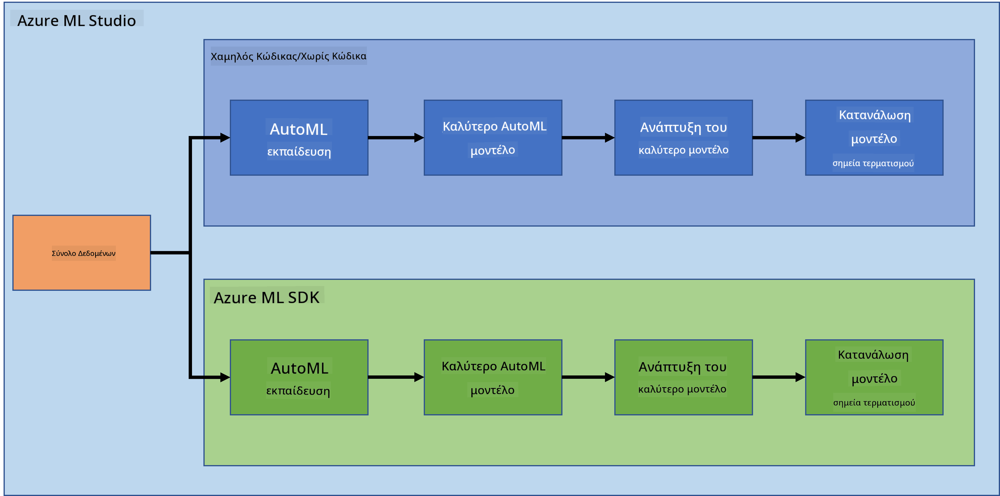
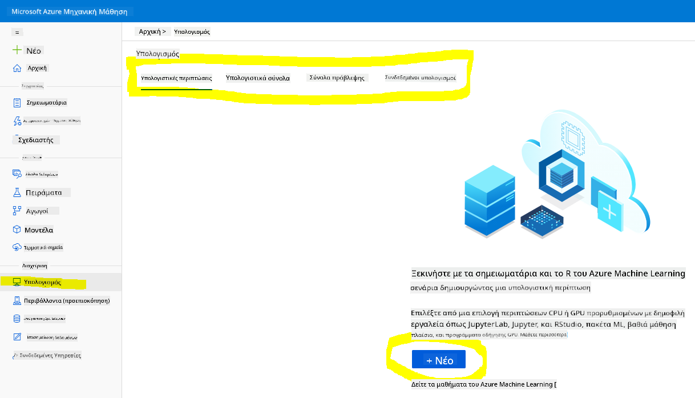
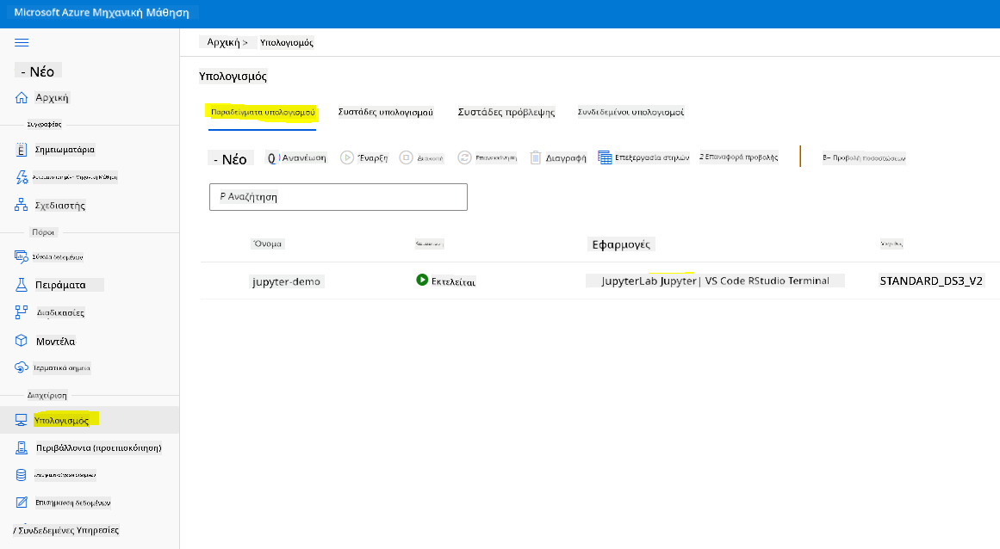

<!--
CO_OP_TRANSLATOR_METADATA:
{
  "original_hash": "73dead89dc2ddda4d6ec0232814a191e",
  "translation_date": "2025-08-26T22:12:21+00:00",
  "source_file": "5-Data-Science-In-Cloud/19-Azure/README.md",
  "language_code": "el"
}
-->
# Επιστήμη Δεδομένων στο Cloud: Η προσέγγιση "Azure ML SDK"

| ](../../sketchnotes/19-DataScience-Cloud.png)|
|:---:|
| Επιστήμη Δεδομένων στο Cloud: Azure ML SDK - _Σκίτσο από [@nitya](https://twitter.com/nitya)_ |

Πίνακας περιεχομένων:

- [Επιστήμη Δεδομένων στο Cloud: Η προσέγγιση "Azure ML SDK"](../../../../5-Data-Science-In-Cloud/19-Azure)
  - [Προ-Διάλεξης Κουίζ](../../../../5-Data-Science-In-Cloud/19-Azure)
  - [1. Εισαγωγή](../../../../5-Data-Science-In-Cloud/19-Azure)
    - [1.1 Τι είναι το Azure ML SDK;](../../../../5-Data-Science-In-Cloud/19-Azure)
    - [1.2 Εισαγωγή στο έργο πρόβλεψης καρδιακής ανεπάρκειας και το σύνολο δεδομένων](../../../../5-Data-Science-In-Cloud/19-Azure)
  - [2. Εκπαίδευση μοντέλου με το Azure ML SDK](../../../../5-Data-Science-In-Cloud/19-Azure)
    - [2.1 Δημιουργία ενός Azure ML workspace](../../../../5-Data-Science-In-Cloud/19-Azure)
    - [2.2 Δημιουργία υπολογιστικής μονάδας](../../../../5-Data-Science-In-Cloud/19-Azure)
    - [2.3 Φόρτωση του συνόλου δεδομένων](../../../../5-Data-Science-In-Cloud/19-Azure)
    - [2.4 Δημιουργία Σημειωματάριων](../../../../5-Data-Science-In-Cloud/19-Azure)
    - [2.5 Εκπαίδευση μοντέλου](../../../../5-Data-Science-In-Cloud/19-Azure)
      - [2.5.1 Ρύθμιση Workspace, πειράματος, υπολογιστικού cluster και συνόλου δεδομένων](../../../../5-Data-Science-In-Cloud/19-Azure)
      - [2.5.2 Ρύθμιση AutoML και εκπαίδευση](../../../../5-Data-Science-In-Cloud/19-Azure)
  - [3. Ανάπτυξη μοντέλου και κατανάλωση endpoint με το Azure ML SDK](../../../../5-Data-Science-In-Cloud/19-Azure)
    - [3.1 Αποθήκευση του καλύτερου μοντέλου](../../../../5-Data-Science-In-Cloud/19-Azure)
    - [3.2 Ανάπτυξη μοντέλου](../../../../5-Data-Science-In-Cloud/19-Azure)
    - [3.3 Κατανάλωση endpoint](../../../../5-Data-Science-In-Cloud/19-Azure)
  - [🚀 Πρόκληση](../../../../5-Data-Science-In-Cloud/19-Azure)
  - [Μετα-Διάλεξης Κουίζ](../../../../5-Data-Science-In-Cloud/19-Azure)
  - [Ανασκόπηση & Αυτομελέτη](../../../../5-Data-Science-In-Cloud/19-Azure)
  - [Εργασία](../../../../5-Data-Science-In-Cloud/19-Azure)

## [Προ-Διάλεξης Κουίζ](https://purple-hill-04aebfb03.1.azurestaticapps.net/quiz/36)

## 1. Εισαγωγή

### 1.1 Τι είναι το Azure ML SDK;

Οι επιστήμονες δεδομένων και οι προγραμματιστές AI χρησιμοποιούν το Azure Machine Learning SDK για να δημιουργήσουν και να εκτελέσουν ροές εργασίας μηχανικής μάθησης με την υπηρεσία Azure Machine Learning. Μπορείτε να αλληλεπιδράσετε με την υπηρεσία σε οποιοδήποτε περιβάλλον Python, όπως Jupyter Notebooks, Visual Studio Code ή το αγαπημένο σας IDE Python.

Κύριοι τομείς του SDK περιλαμβάνουν:

- Εξερεύνηση, προετοιμασία και διαχείριση του κύκλου ζωής των συνόλων δεδομένων που χρησιμοποιούνται σε πειράματα μηχανικής μάθησης.
- Διαχείριση πόρων cloud για παρακολούθηση, καταγραφή και οργάνωση των πειραμάτων μηχανικής μάθησης.
- Εκπαίδευση μοντέλων είτε τοπικά είτε χρησιμοποιώντας πόρους cloud, συμπεριλαμβανομένης της εκπαίδευσης μοντέλων με επιτάχυνση GPU.
- Χρήση αυτοματοποιημένης μηχανικής μάθησης, η οποία δέχεται παραμέτρους ρύθμισης και δεδομένα εκπαίδευσης. Επαναλαμβάνει αυτόματα αλγόριθμους και ρυθμίσεις υπερπαραμέτρων για να βρει το καλύτερο μοντέλο για προβλέψεις.
- Ανάπτυξη web services για τη μετατροπή των εκπαιδευμένων μοντέλων σας σε RESTful υπηρεσίες που μπορούν να καταναλωθούν σε οποιαδήποτε εφαρμογή.

[Μάθετε περισσότερα για το Azure Machine Learning SDK](https://docs.microsoft.com/python/api/overview/azure/ml?WT.mc_id=academic-77958-bethanycheum&ocid=AID3041109)

Στο [προηγούμενο μάθημα](../18-Low-Code/README.md), είδαμε πώς να εκπαιδεύσουμε, να αναπτύξουμε και να καταναλώσουμε ένα μοντέλο με τρόπο Low code/No code. Χρησιμοποιήσαμε το σύνολο δεδομένων καρδιακής ανεπάρκειας για να δημιουργήσουμε ένα μοντέλο πρόβλεψης καρδιακής ανεπάρκειας. Σε αυτό το μάθημα, θα κάνουμε ακριβώς το ίδιο πράγμα αλλά χρησιμοποιώντας το Azure Machine Learning SDK.



### 1.2 Εισαγωγή στο έργο πρόβλεψης καρδιακής ανεπάρκειας και το σύνολο δεδομένων

Δείτε [εδώ](../18-Low-Code/README.md) την εισαγωγή στο έργο πρόβλεψης καρδιακής ανεπάρκειας και το σύνολο δεδομένων.

## 2. Εκπαίδευση μοντέλου με το Azure ML SDK
### 2.1 Δημιουργία ενός Azure ML workspace

Για απλότητα, θα εργαστούμε σε ένα jupyter notebook. Αυτό σημαίνει ότι έχετε ήδη ένα Workspace και μια υπολογιστική μονάδα. Εάν έχετε ήδη Workspace, μπορείτε να μεταβείτε απευθείας στην ενότητα 2.3 Δημιουργία Σημειωματάριων.

Εάν όχι, ακολουθήστε τις οδηγίες στην ενότητα **2.1 Δημιουργία ενός Azure ML workspace** στο [προηγούμενο μάθημα](../18-Low-Code/README.md) για να δημιουργήσετε ένα workspace.

### 2.2 Δημιουργία υπολογιστικής μονάδας

Στο [Azure ML workspace](https://ml.azure.com/) που δημιουργήσαμε νωρίτερα, μεταβείτε στο μενού υπολογισμού και θα δείτε τους διάφορους διαθέσιμους πόρους υπολογισμού.



Ας δημιουργήσουμε μια υπολογιστική μονάδα για να προμηθεύσουμε ένα jupyter notebook. 
1. Κάντε κλικ στο κουμπί + Νέο. 
2. Δώστε ένα όνομα στην υπολογιστική σας μονάδα.
3. Επιλέξτε τις επιλογές σας: CPU ή GPU, μέγεθος VM και αριθμό πυρήνων.
4. Κάντε κλικ στο κουμπί Δημιουργία.

Συγχαρητήρια, μόλις δημιουργήσατε μια υπολογιστική μονάδα! Θα χρησιμοποιήσουμε αυτήν την υπολογιστική μονάδα για να δημιουργήσουμε ένα Σημειωματάριο στην ενότητα [Δημιουργία Σημειωματάριων](../../../../5-Data-Science-In-Cloud/19-Azure).

### 2.3 Φόρτωση του συνόλου δεδομένων
Ανατρέξτε στο [προηγούμενο μάθημα](../18-Low-Code/README.md) στην ενότητα **2.3 Φόρτωση του συνόλου δεδομένων** εάν δεν έχετε ανεβάσει ακόμα το σύνολο δεδομένων.

### 2.4 Δημιουργία Σημειωματάριων

> **_ΣΗΜΕΙΩΣΗ:_** Για το επόμενο βήμα μπορείτε είτε να δημιουργήσετε ένα νέο σημειωματάριο από την αρχή, είτε να ανεβάσετε το [σημειωματάριο που δημιουργήσαμε](notebook.ipynb) στο Azure ML Studio σας. Για να το ανεβάσετε, απλώς κάντε κλικ στο μενού "Notebook" και ανεβάστε το σημειωματάριο.

Τα σημειωματάρια είναι ένα πολύ σημαντικό μέρος της διαδικασίας επιστήμης δεδομένων. Μπορούν να χρησιμοποιηθούν για την Εξερευνητική Ανάλυση Δεδομένων (EDA), την εκπαίδευση ενός μοντέλου σε υπολογιστικό cluster, ή την ανάπτυξη ενός endpoint σε cluster πρόβλεψης.

Για να δημιουργήσετε ένα Σημειωματάριο, χρειαζόμαστε έναν υπολογιστικό κόμβο που εξυπηρετεί την παρουσία του jupyter notebook. Επιστρέψτε στο [Azure ML workspace](https://ml.azure.com/) και κάντε κλικ στις Υπολογιστικές Μονάδες. Στη λίστα των υπολογιστικών μονάδων θα πρέπει να δείτε την [υπολογιστική μονάδα που δημιουργήσαμε νωρίτερα](../../../../5-Data-Science-In-Cloud/19-Azure). 

1. Στην ενότητα Εφαρμογές, κάντε κλικ στην επιλογή Jupyter. 
2. Τσεκάρετε το κουτί "Ναι, καταλαβαίνω" και κάντε κλικ στο κουμπί Συνέχεια.

3. Αυτό θα ανοίξει μια νέα καρτέλα του προγράμματος περιήγησης με την παρουσία του jupyter notebook σας όπως φαίνεται παρακάτω. Κάντε κλικ στο κουμπί "Νέο" για να δημιουργήσετε ένα σημειωματάριο.


Τώρα που έχουμε ένα Σημειωματάριο, μπορούμε να ξεκινήσουμε την εκπαίδευση του μοντέλου με το Azure ML SDK.

### 2.5 Εκπαίδευση μοντέλου

Πρώτα απ' όλα, αν έχετε οποιαδήποτε αμφιβολία, ανατρέξτε στην [τεκμηρίωση του Azure ML SDK](https://docs.microsoft.com/python/api/overview/azure/ml?WT.mc_id=academic-77958-bethanycheum&ocid=AID3041109). Περιέχει όλες τις απαραίτητες πληροφορίες για να κατανοήσετε τις ενότητες που θα δούμε σε αυτό το μάθημα.

#### 2.5.1 Ρύθμιση Workspace, πειράματος, υπολογιστικού cluster και συνόλου δεδομένων

Πρέπει να φορτώσετε το `workspace` από το αρχείο ρύθμισης χρησιμοποιώντας τον παρακάτω κώδικα:

```python
from azureml.core import Workspace
ws = Workspace.from_config()
```

Αυτό επιστρέφει ένα αντικείμενο τύπου `Workspace` που αντιπροσωπεύει το workspace. Στη συνέχεια, πρέπει να δημιουργήσετε ένα `experiment` χρησιμοποιώντας τον παρακάτω κώδικα:

```python
from azureml.core import Experiment
experiment_name = 'aml-experiment'
experiment = Experiment(ws, experiment_name)
```
Για να λάβετε ή να δημιουργήσετε ένα πείραμα από ένα workspace, ζητάτε το πείραμα χρησιμοποιώντας το όνομα του πειράματος. Το όνομα του πειράματος πρέπει να είναι 3-36 χαρακτήρες, να ξεκινά με γράμμα ή αριθμό και να περιέχει μόνο γράμματα, αριθμούς, υπογραμμίσεις και παύλες. Εάν το πείραμα δεν βρεθεί στο workspace, δημιουργείται ένα νέο πείραμα.

Τώρα πρέπει να δημιουργήσετε ένα υπολογιστικό cluster για την εκπαίδευση χρησιμοποιώντας τον παρακάτω κώδικα. Σημειώστε ότι αυτό το βήμα μπορεί να διαρκέσει μερικά λεπτά. 

```python
from azureml.core.compute import AmlCompute

aml_name = "heart-f-cluster"
try:
    aml_compute = AmlCompute(ws, aml_name)
    print('Found existing AML compute context.')
except:
    print('Creating new AML compute context.')
    aml_config = AmlCompute.provisioning_configuration(vm_size = "Standard_D2_v2", min_nodes=1, max_nodes=3)
    aml_compute = AmlCompute.create(ws, name = aml_name, provisioning_configuration = aml_config)
    aml_compute.wait_for_completion(show_output = True)

cts = ws.compute_targets
compute_target = cts[aml_name]
```

Μπορείτε να λάβετε το σύνολο δεδομένων από το workspace χρησιμοποιώντας το όνομα του συνόλου δεδομένων με τον εξής τρόπο:

```python
dataset = ws.datasets['heart-failure-records']
df = dataset.to_pandas_dataframe()
df.describe()
```
#### 2.5.2 Ρύθμιση AutoML και εκπαίδευση

Για να ρυθμίσετε τη διαμόρφωση AutoML, χρησιμοποιήστε την [κλάση AutoMLConfig](https://docs.microsoft.com/python/api/azureml-train-automl-client/azureml.train.automl.automlconfig(class)?WT.mc_id=academic-77958-bethanycheum&ocid=AID3041109).

Όπως περιγράφεται στην τεκμηρίωση, υπάρχουν πολλές παράμετροι με τις οποίες μπορείτε να πειραματιστείτε. Για αυτό το έργο, θα χρησιμοποιήσουμε τις εξής παραμέτρους:

- `experiment_timeout_minutes`: Ο μέγιστος χρόνος (σε λεπτά) που επιτρέπεται να εκτελεστεί το πείραμα πριν σταματήσει αυτόματα και γίνουν διαθέσιμα τα αποτελέσματα.
- `max_concurrent_iterations`: Ο μέγιστος αριθμός ταυτόχρονων επαναλήψεων εκπαίδευσης που επιτρέπονται για το πείραμα.
- `primary_metric`: Η κύρια μέτρηση που χρησιμοποιείται για τον καθορισμό της κατάστασης του πειράματος.
- `compute_target`: Ο υπολογιστικός στόχος του Azure Machine Learning για την εκτέλεση του πειράματος AutoML.
- `task`: Ο τύπος της εργασίας που θα εκτελεστεί. Οι τιμές μπορεί να είναι 'classification', 'regression' ή 'forecasting' ανάλογα με τον τύπο του προβλήματος AutoML που θα λυθεί.
- `training_data`: Τα δεδομένα εκπαίδευσης που θα χρησιμοποιηθούν στο πείραμα. Πρέπει να περιέχουν χαρακτηριστικά εκπαίδευσης και μια στήλη ετικετών (προαιρετικά μια στήλη βαρών δειγμάτων).
- `label_column_name`: Το όνομα της στήλης ετικετών.
- `path`: Η πλήρης διαδρομή προς τον φάκελο έργου του Azure Machine Learning.
- `enable_early_stopping`: Εάν θα ενεργοποιηθεί η πρόωρη διακοπή εάν η βαθμολογία δεν βελτιώνεται βραχυπρόθεσμα.
- `featurization`: Δείκτης για το αν το βήμα χαρακτηριστικοποίησης πρέπει να γίνει αυτόματα ή όχι, ή αν πρέπει να χρησιμοποιηθεί προσαρμοσμένη χαρακτηριστικοποίηση.
- `debug_log`: Το αρχείο καταγραφής για την εγγραφή πληροφοριών αποσφαλμάτωσης.

```python
from azureml.train.automl import AutoMLConfig

project_folder = './aml-project'

automl_settings = {
    "experiment_timeout_minutes": 20,
    "max_concurrent_iterations": 3,
    "primary_metric" : 'AUC_weighted'
}

automl_config = AutoMLConfig(compute_target=compute_target,
                             task = "classification",
                             training_data=dataset,
                             label_column_name="DEATH_EVENT",
                             path = project_folder,  
                             enable_early_stopping= True,
                             featurization= 'auto',
                             debug_log = "automl_errors.log",
                             **automl_settings
                            )
```
Τώρα που έχετε ρυθμίσει τη διαμόρφωση σας, μπορείτε να εκπαιδεύσετε το μοντέλο χρησιμοποιώντας τον παρακάτω κώδικα. Αυτό το βήμα μπορεί να διαρκέσει έως και μία ώρα ανάλογα με το μέγεθος του cluster σας.

```python
remote_run = experiment.submit(automl_config)
```
Μπορείτε να εκτελέσετε το widget RunDetails για να δείτε τα διάφορα πειράματα.
```python
from azureml.widgets import RunDetails
RunDetails(remote_run).show()
```
## 3. Ανάπτυξη μοντέλου και κατανάλωση endpoint με το Azure ML SDK

### 3.1 Αποθήκευση του καλύτερου μοντέλου

Το `remote_run` είναι ένα αντικείμενο τύπου [AutoMLRun](https://docs.microsoft.com/python/api/azureml-train-automl-client/azureml.train.automl.run.automlrun?WT.mc_id=academic-77958-bethanycheum&ocid=AID3041109). Αυτό το αντικείμενο περιέχει τη μέθοδο `get_output()` που επιστρέφει την καλύτερη εκτέλεση και το αντίστοιχο εκπαιδευμένο μοντέλο.

```python
best_run, fitted_model = remote_run.get_output()
```
Μπορείτε να δείτε τις παραμέτρους που χρησιμοποιήθηκαν για το καλύτερο μοντέλο απλώς εκτυπώνοντας το fitted_model και να δείτε τις ιδιότητες του καλύτερου μοντέλου χρησιμοποιώντας τη μέθοδο [get_properties()](https://docs.microsoft.com/python/api/azureml-core/azureml.core.run(class)?view=azure-ml-py#azureml_core_Run_get_properties?WT.mc_id=academic-77958-bethanycheum&ocid=AID3041109).

```python
best_run.get_properties()
```

Τώρα καταχωρίστε το μοντέλο με τη μέθοδο [register_model](https://docs.microsoft.com/python/api/azureml-train-automl-client/azureml.train.automl.run.automlrun?view=azure-ml-py#register-model-model-name-none--description-none--tags-none--iteration-none--metric-none-?WT.mc_id=academic-77958-bethanycheum&ocid=AID3041109).
```python
model_name = best_run.properties['model_name']
script_file_name = 'inference/score.py'
best_run.download_file('outputs/scoring_file_v_1_0_0.py', 'inference/score.py')
description = "aml heart failure project sdk"
model = best_run.register_model(model_name = model_name,
                                model_path = './outputs/',
                                description = description,
                                tags = None)
```
### 3.2 Ανάπτυξη μοντέλου

Αφού αποθηκευτεί το καλύτερο μοντέλο, μπορούμε να το αναπτύξουμε με την κλάση [InferenceConfig](https://docs.microsoft.com/python/api/azureml-core/azureml.core.model.inferenceconfig?view=azure-ml-py?ocid=AID3041109). Το InferenceConfig αντιπροσωπεύει τις ρυθμίσεις διαμόρφωσης για ένα προσαρμοσμένο περιβάλλον που χρησιμοποιείται για την ανάπτυξη. Η κλάση [AciWebservice](https://docs.microsoft.com/python/api/azureml-core/azureml.core.webservice.aciwebservice?view=azure-ml-py) αντιπροσωπεύει ένα μοντέλο μηχανικής μάθησης που έχει αναπτυχθεί ως endpoint υπηρεσίας web σε Azure Container Instances. Μια αναπτυγμένη υπηρεσία δημιουργείται από ένα μοντέλο, ένα script και σχετικά αρχεία. Η προκύπτουσα υπηρεσία web είναι ένα ισορροπημένο HTTP endpoint με
```python
response = aci_service.run(input_data=test_sample)
response
```
Αυτό θα πρέπει να επιστρέψει `'{"result": [false]}'`. Αυτό σημαίνει ότι τα δεδομένα ασθενούς που στείλαμε στο endpoint δημιούργησαν την πρόβλεψη `false`, που σημαίνει ότι αυτό το άτομο δεν είναι πιθανό να υποστεί καρδιακή προσβολή.

Συγχαρητήρια! Μόλις καταναλώσατε το μοντέλο που αναπτύχθηκε και εκπαιδεύτηκε στο Azure ML με το Azure ML SDK!

> **_ΣΗΜΕΙΩΣΗ:_** Όταν ολοκληρώσετε το έργο, μην ξεχάσετε να διαγράψετε όλους τους πόρους.

## 🚀 Πρόκληση

Υπάρχουν πολλά άλλα πράγματα που μπορείτε να κάνετε μέσω του SDK, δυστυχώς, δεν μπορούμε να τα καλύψουμε όλα σε αυτό το μάθημα. Αλλά καλά νέα, η εκμάθηση του πώς να περιηγείστε στη τεκμηρίωση του SDK μπορεί να σας πάει πολύ μακριά μόνοι σας. Ρίξτε μια ματιά στην τεκμηρίωση του Azure ML SDK και βρείτε την κλάση `Pipeline` που σας επιτρέπει να δημιουργείτε pipelines. Ένα Pipeline είναι μια συλλογή βημάτων που μπορούν να εκτελεστούν ως μια ροή εργασίας.

**ΥΠΟΔΕΙΞΗ:** Μεταβείτε στην [τεκμηρίωση του SDK](https://docs.microsoft.com/python/api/overview/azure/ml/?view=azure-ml-py?WT.mc_id=academic-77958-bethanycheum&ocid=AID3041109) και πληκτρολογήστε λέξεις-κλειδιά στη γραμμή αναζήτησης όπως "Pipeline". Θα πρέπει να δείτε την κλάση `azureml.pipeline.core.Pipeline` στα αποτελέσματα αναζήτησης.

## [Κουίζ μετά το μάθημα](https://purple-hill-04aebfb03.1.azurestaticapps.net/quiz/37)

## Ανασκόπηση & Αυτομελέτη

Σε αυτό το μάθημα, μάθατε πώς να εκπαιδεύετε, να αναπτύσσετε και να καταναλώνετε ένα μοντέλο για την πρόβλεψη του κινδύνου καρδιακής ανεπάρκειας με το Azure ML SDK στο cloud. Ελέγξτε αυτήν την [τεκμηρίωση](https://docs.microsoft.com/python/api/overview/azure/ml/?view=azure-ml-py?WT.mc_id=academic-77958-bethanycheum&ocid=AID3041109) για περισσότερες πληροφορίες σχετικά με το Azure ML SDK. Δοκιμάστε να δημιουργήσετε το δικό σας μοντέλο με το Azure ML SDK.

## Εργασία

[Έργο Επιστήμης Δεδομένων χρησιμοποιώντας το Azure ML SDK](assignment.md)

---

**Αποποίηση ευθύνης**:  
Αυτό το έγγραφο έχει μεταφραστεί χρησιμοποιώντας την υπηρεσία αυτόματης μετάφρασης [Co-op Translator](https://github.com/Azure/co-op-translator). Παρόλο που καταβάλλουμε προσπάθειες για ακρίβεια, παρακαλούμε να έχετε υπόψη ότι οι αυτοματοποιημένες μεταφράσεις ενδέχεται να περιέχουν λάθη ή ανακρίβειες. Το πρωτότυπο έγγραφο στη μητρική του γλώσσα θα πρέπει να θεωρείται η αυθεντική πηγή. Για κρίσιμες πληροφορίες, συνιστάται επαγγελματική ανθρώπινη μετάφραση. Δεν φέρουμε ευθύνη για τυχόν παρεξηγήσεις ή εσφαλμένες ερμηνείες που προκύπτουν από τη χρήση αυτής της μετάφρασης.