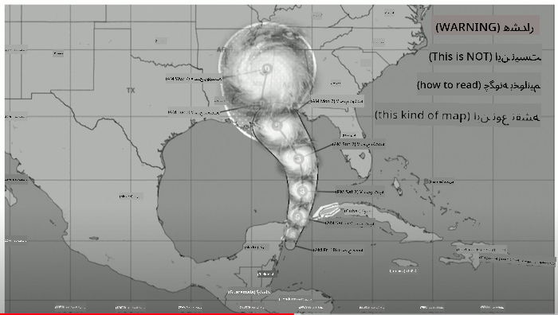
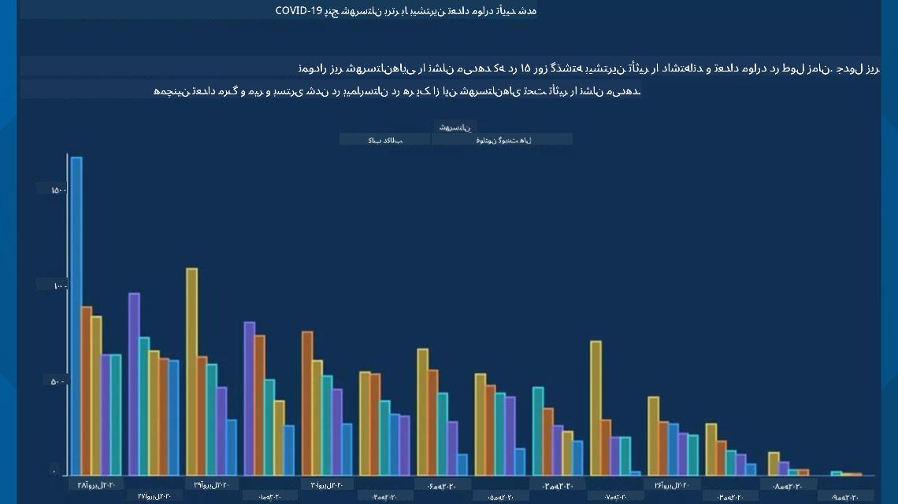
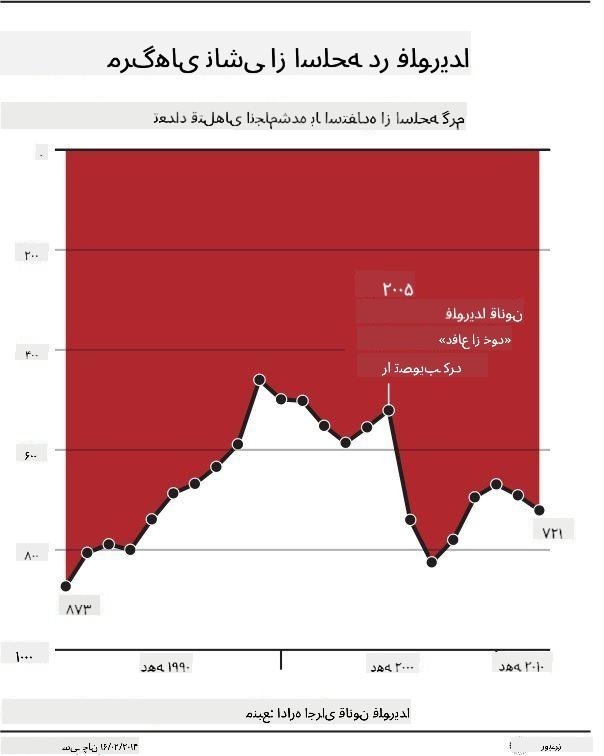
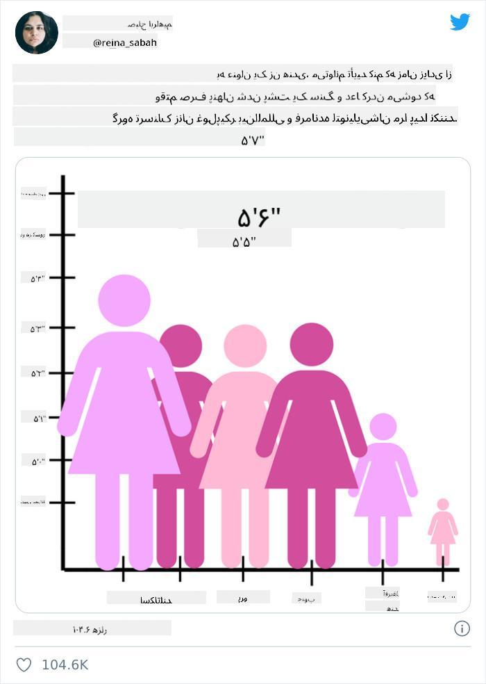
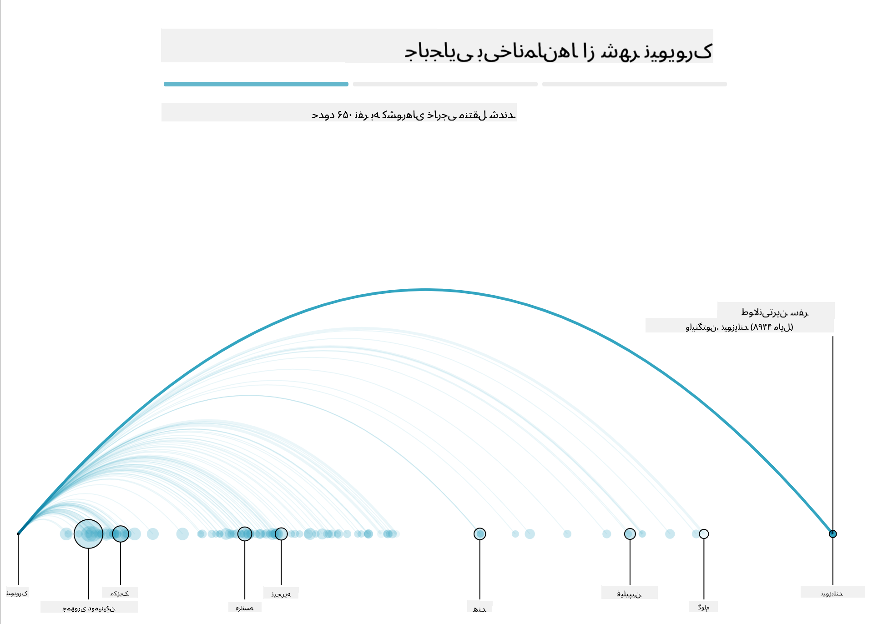
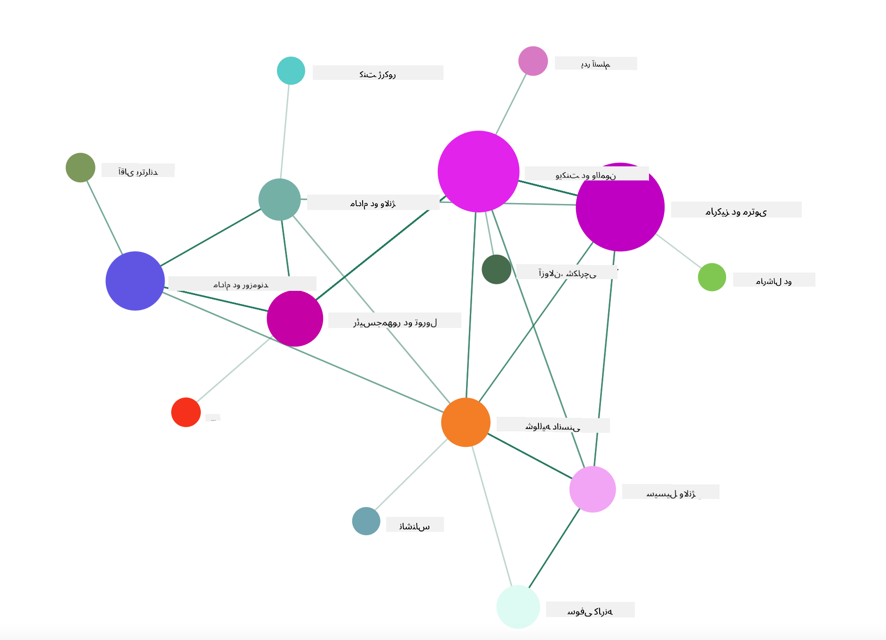

<!--
CO_OP_TRANSLATOR_METADATA:
{
  "original_hash": "4ec4747a9f4f7d194248ea29903ae165",
  "translation_date": "2025-08-24T22:31:34+00:00",
  "source_file": "3-Data-Visualization/13-meaningful-visualizations/README.md",
  "language_code": "fa"
}
-->
# ایجاد مصورسازی‌های معنادار

|](../../sketchnotes/13-MeaningfulViz.png)|
|:---:|
| مصورسازی‌های معنادار - _طرح دستی توسط [@nitya](https://twitter.com/nitya)_ |

> "اگر داده‌ها را به اندازه کافی شکنجه کنید، به هر چیزی اعتراف خواهند کرد" -- [رونالد کوز](https://en.wikiquote.org/wiki/Ronald_Coase)

یکی از مهارت‌های اساسی یک دانشمند داده، توانایی ایجاد مصورسازی داده‌ای معنادار است که به پاسخ دادن به سؤالات کمک کند. پیش از مصورسازی داده‌ها، باید اطمینان حاصل کنید که داده‌ها تمیز و آماده شده‌اند، همان‌طور که در درس‌های قبلی انجام دادید. پس از آن، می‌توانید تصمیم بگیرید که بهترین روش برای ارائه داده‌ها چیست.

در این درس، شما بررسی خواهید کرد:

1. چگونه نوع نمودار مناسب را انتخاب کنید  
2. چگونه از نمودارهای گمراه‌کننده اجتناب کنید  
3. چگونه با رنگ کار کنید  
4. چگونه نمودارهای خود را برای خوانایی بهتر طراحی کنید  
5. چگونه راه‌حل‌های نمودارهای متحرک یا سه‌بعدی بسازید  
6. چگونه یک مصورسازی خلاقانه ایجاد کنید  

## [آزمون پیش از درس](https://purple-hill-04aebfb03.1.azurestaticapps.net/quiz/24)

## انتخاب نوع نمودار مناسب

در درس‌های قبلی، شما با استفاده از Matplotlib و Seaborn انواع مختلفی از مصورسازی‌های داده‌ای جالب را ایجاد کردید. به طور کلی، می‌توانید با استفاده از این جدول، [نوع مناسب نمودار](https://chartio.com/learn/charts/how-to-select-a-data-vizualization/) را برای سؤالی که می‌پرسید انتخاب کنید:

| نیاز دارید:                | باید استفاده کنید:             |
| -------------------------- | ------------------------------- |
| نمایش روند داده‌ها در طول زمان | خطی                            |
| مقایسه دسته‌ها              | میله‌ای، دایره‌ای               |
| مقایسه کل‌ها               | دایره‌ای، میله‌ای انباشته       |
| نمایش روابط               | پراکندگی، خطی، Facet، خطی دوگانه |
| نمایش توزیع‌ها             | پراکندگی، هیستوگرام، جعبه‌ای    |
| نمایش نسبت‌ها              | دایره‌ای، دونات، وافل           |

> ✅ بسته به ساختار داده‌های شما، ممکن است نیاز باشد داده‌ها را از متن به عددی تبدیل کنید تا نمودار مورد نظر از آن پشتیبانی کند.

## اجتناب از گمراهی

حتی اگر یک دانشمند داده در انتخاب نمودار مناسب برای داده‌ها دقت کند، روش‌های زیادی وجود دارد که داده‌ها می‌توانند به گونه‌ای نمایش داده شوند که یک نکته خاص را اثبات کنند، اغلب به قیمت تضعیف خود داده‌ها. نمونه‌های زیادی از نمودارها و اینفوگرافیک‌های گمراه‌کننده وجود دارد!

[](https://www.youtube.com/watch?v=oX74Nge8Wkw "چگونه نمودارها دروغ می‌گویند")

> 🎥 روی تصویر بالا کلیک کنید تا یک سخنرانی درباره نمودارهای گمراه‌کننده ببینید.

این نمودار محور X را معکوس می‌کند تا بر اساس تاریخ، خلاف واقعیت را نشان دهد:


[این نمودار](https://media.firstcoastnews.com/assets/WTLV/images/170ae16f-4643-438f-b689-50d66ca6a8d8/170ae16f-4643-438f-b689-50d66ca6a8d8_1140x641.jpg) حتی گمراه‌کننده‌تر است، زیرا چشم به سمت راست کشیده می‌شود تا نتیجه بگیرد که با گذشت زمان، موارد COVID در شهرستان‌های مختلف کاهش یافته است. در واقع، اگر به تاریخ‌ها دقت کنید، متوجه می‌شوید که آن‌ها به گونه‌ای بازچینش شده‌اند که این روند نزولی گمراه‌کننده را نشان دهند.



این مثال معروف از رنگ و همچنین محور Y معکوس برای گمراه کردن استفاده می‌کند: به جای نتیجه‌گیری اینکه مرگ‌های ناشی از اسلحه پس از تصویب قوانین دوستدار اسلحه افزایش یافته است، در واقع چشم فریب می‌خورد تا فکر کند که عکس این موضوع درست است:



این نمودار عجیب نشان می‌دهد که چگونه نسبت‌ها می‌توانند به شکلی خنده‌دار دستکاری شوند:



مقایسه چیزهای غیرقابل مقایسه یکی دیگر از ترفندهای مشکوک است. یک [وب‌سایت فوق‌العاده](https://tylervigen.com/spurious-correlations) وجود دارد که به 'همبستگی‌های جعلی' اختصاص دارد و 'حقایقی' را نشان می‌دهد که چیزهایی مانند نرخ طلاق در مین و مصرف مارگارین را همبسته می‌کند. یک گروه در Reddit نیز [استفاده‌های زشت](https://www.reddit.com/r/dataisugly/top/?t=all) از داده‌ها را جمع‌آوری می‌کند.

مهم است که بفهمید چگونه چشم به راحتی می‌تواند توسط نمودارهای گمراه‌کننده فریب بخورد. حتی اگر نیت دانشمند داده خوب باشد، انتخاب نوع بدی از نمودار، مانند نمودار دایره‌ای با تعداد زیادی دسته، می‌تواند گمراه‌کننده باشد.

## رنگ

شما در نمودار 'خشونت اسلحه در فلوریدا' بالا دیدید که چگونه رنگ می‌تواند لایه‌ای اضافی از معنا به نمودارها اضافه کند، به خصوص آن‌هایی که با استفاده از کتابخانه‌هایی مانند Matplotlib و Seaborn طراحی نشده‌اند که دارای کتابخانه‌ها و پالت‌های رنگی معتبر هستند. اگر در حال ساخت نموداری به صورت دستی هستید، کمی درباره [نظریه رنگ](https://colormatters.com/color-and-design/basic-color-theory) مطالعه کنید.

> ✅ هنگام طراحی نمودارها، آگاه باشید که دسترسی‌پذیری جنبه مهمی از مصورسازی است. برخی از کاربران شما ممکن است کوررنگ باشند - آیا نمودار شما برای کاربران با اختلالات بینایی به خوبی نمایش داده می‌شود؟

هنگام انتخاب رنگ‌ها برای نمودار خود دقت کنید، زیرا رنگ می‌تواند معنایی را منتقل کند که ممکن است قصد نداشته باشید. 'خانم‌های صورتی' در نمودار 'قد' بالا معنای مشخصاً 'زنانه‌ای' را منتقل می‌کنند که به عجیب بودن خود نمودار اضافه می‌کند.

در حالی که [معنای رنگ](https://colormatters.com/color-symbolism/the-meanings-of-colors) ممکن است در بخش‌های مختلف جهان متفاوت باشد و تمایل دارد بر اساس سایه آن تغییر کند، به طور کلی معانی رنگ‌ها شامل موارد زیر است:

| رنگ    | معنا                 |
| ------ | ------------------- |
| قرمز   | قدرت                |
| آبی    | اعتماد، وفاداری     |
| زرد    | شادی، احتیاط        |
| سبز    | محیط زیست، شانس، حسادت |
| بنفش   | شادی                |
| نارنجی | سرزندگی             |

اگر وظیفه دارید نموداری با رنگ‌های سفارشی بسازید، اطمینان حاصل کنید که نمودارهای شما هم دسترسی‌پذیر هستند و هم رنگی که انتخاب می‌کنید با معنایی که می‌خواهید منتقل کنید همخوانی دارد.

## طراحی نمودارها برای خوانایی

نمودارها زمانی معنادار هستند که خوانا باشند! لحظه‌ای وقت بگذارید تا عرض و ارتفاع نمودار خود را برای تناسب بهتر با داده‌ها تنظیم کنید. اگر یک متغیر (مانند تمام 50 ایالت) باید نمایش داده شود، آن‌ها را در محور Y به صورت عمودی نمایش دهید تا از نمودارهای افقی قابل اسکرول اجتناب کنید.

محورهای خود را برچسب‌گذاری کنید، در صورت لزوم یک راهنما ارائه دهید و برای درک بهتر داده‌ها ابزارهای کمکی (tooltip) ارائه دهید.

اگر داده‌های شما متنی و طولانی در محور X است، می‌توانید متن را برای خوانایی بهتر زاویه دهید. [Matplotlib](https://matplotlib.org/stable/tutorials/toolkits/mplot3d.html) امکان رسم سه‌بعدی را ارائه می‌دهد، اگر داده‌های شما از آن پشتیبانی کند. مصورسازی‌های پیشرفته داده‌ها را می‌توان با استفاده از `mpl_toolkits.mplot3d` تولید کرد.


## نمایش متحرک و سه‌بعدی نمودارها

برخی از بهترین مصورسازی‌های داده‌ای امروز متحرک هستند. شرلی وو نمونه‌های شگفت‌انگیزی با D3 ساخته است، مانند '[گل‌های فیلم](http://bl.ocks.org/sxywu/raw/d612c6c653fb8b4d7ff3d422be164a5d/)'، جایی که هر گل مصورسازی یک فیلم است. نمونه دیگری برای گاردین 'باس‌اوت' است، یک تجربه تعاملی که مصورسازی‌ها را با Greensock و D3 به همراه یک مقاله اسکرول‌محور ترکیب می‌کند تا نشان دهد چگونه نیویورک با مشکل بی‌خانمان‌ها برخورد می‌کند.



> "باس‌اوت: چگونه آمریکا بی‌خانمان‌های خود را جابه‌جا می‌کند" از [گاردین](https://www.theguardian.com/us-news/ng-interactive/2017/dec/20/bussed-out-america-moves-homeless-people-country-study). مصورسازی‌ها توسط نادیه برمر و شرلی وو

در حالی که این درس برای آموزش عمیق این کتابخانه‌های قدرتمند مصورسازی کافی نیست، می‌توانید با استفاده از D3 در یک اپلیکیشن Vue.js و یک کتابخانه برای نمایش مصورسازی کتاب "روابط خطرناک" به عنوان یک شبکه اجتماعی متحرک، دست به کار شوید.

> "روابط خطرناک" یک رمان نامه‌نگارانه است، یا رمانی که به صورت مجموعه‌ای از نامه‌ها ارائه می‌شود. این رمان که در سال 1782 توسط شودرلو دو لاکلو نوشته شده است، داستان مانورهای اجتماعی بی‌رحمانه و اخلاقاً ورشکسته دو شخصیت اصلی اشراف‌زادگان فرانسوی در اواخر قرن 18، ویکنت دو والمون و مارکیز دو مرتوی را روایت می‌کند. هر دو در نهایت نابود می‌شوند اما نه بدون وارد کردن آسیب اجتماعی زیاد. این رمان به صورت مجموعه‌ای از نامه‌ها نوشته شده به افراد مختلف در دایره‌های آن‌ها، برای انتقام یا صرفاً ایجاد مشکل، گسترش می‌یابد. یک مصورسازی از این نامه‌ها ایجاد کنید تا پادشاهان اصلی روایت را به صورت بصری کشف کنید.

شما یک اپلیکیشن وب کامل خواهید کرد که نمای متحرکی از این شبکه اجتماعی را نمایش می‌دهد. این اپلیکیشن از یک کتابخانه استفاده می‌کند که برای ایجاد [نمایی از یک شبکه](https://github.com/emiliorizzo/vue-d3-network) با استفاده از Vue.js و D3 ساخته شده است. هنگامی که اپلیکیشن در حال اجرا است، می‌توانید گره‌ها را روی صفحه بکشید تا داده‌ها را جابه‌جا کنید.



## پروژه: ساخت یک نمودار برای نمایش یک شبکه با استفاده از D3.js

> این پوشه درس شامل یک پوشه `solution` است که می‌توانید پروژه کامل شده را برای مرجع خود پیدا کنید.

1. دستورالعمل‌های موجود در فایل README.md در ریشه پوشه استارتر را دنبال کنید. مطمئن شوید که NPM و Node.js روی دستگاه شما اجرا می‌شوند قبل از نصب وابستگی‌های پروژه.

2. پوشه `starter/src` را باز کنید. یک پوشه `assets` پیدا خواهید کرد که شامل یک فایل .json با تمام نامه‌های رمان، شماره‌گذاری شده، با توضیحات 'to' و 'from' است.

3. کد موجود در `components/Nodes.vue` را کامل کنید تا مصورسازی فعال شود. به دنبال متدی به نام `createLinks()` بگردید و حلقه تو در تو زیر را اضافه کنید.

حلقه‌ای در شیء .json ایجاد کنید تا داده‌های 'to' و 'from' نامه‌ها را بگیرید و شیء `links` را بسازید تا کتابخانه مصورسازی بتواند از آن استفاده کند:

```javascript
//loop through letters
      let f = 0;
      let t = 0;
      for (var i = 0; i < letters.length; i++) {
          for (var j = 0; j < characters.length; j++) {
              
            if (characters[j] == letters[i].from) {
              f = j;
            }
            if (characters[j] == letters[i].to) {
              t = j;
            }
        }
        this.links.push({ sid: f, tid: t });
      }
  ```

اپلیکیشن خود را از ترمینال اجرا کنید (npm run serve) و از مصورسازی لذت ببرید!

## 🚀 چالش

گشتی در اینترنت بزنید تا مصورسازی‌های گمراه‌کننده را کشف کنید. نویسنده چگونه کاربر را فریب می‌دهد و آیا این کار عمدی است؟ سعی کنید مصورسازی‌ها را اصلاح کنید تا نشان دهید که چگونه باید به نظر برسند.

## [آزمون پس از درس](https://purple-hill-04aebfb03.1.azurestaticapps.net/quiz/25)

## مرور و مطالعه شخصی

در اینجا چند مقاله برای مطالعه درباره مصورسازی داده‌های گمراه‌کننده آورده شده است:

https://gizmodo.com/how-to-lie-with-data-visualization-1563576606

http://ixd.prattsi.org/2017/12/visual-lies-usability-in-deceptive-data-visualizations/

این مصورسازی‌های جالب برای دارایی‌ها و مصنوعات تاریخی را بررسی کنید:

https://handbook.pubpub.org/

این مقاله را درباره اینکه چگونه انیمیشن می‌تواند مصورسازی‌های شما را بهبود بخشد، مرور کنید:

https://medium.com/@EvanSinar/use-animation-to-supercharge-data-visualization-cd905a882ad4

## تکلیف

[مصورسازی سفارشی خود را بسازید](assignment.md)

**سلب مسئولیت**:  
این سند با استفاده از سرویس ترجمه هوش مصنوعی [Co-op Translator](https://github.com/Azure/co-op-translator) ترجمه شده است. در حالی که ما تلاش می‌کنیم دقت را حفظ کنیم، لطفاً توجه داشته باشید که ترجمه‌های خودکار ممکن است شامل خطاها یا نادرستی‌ها باشند. سند اصلی به زبان اصلی آن باید به عنوان منبع معتبر در نظر گرفته شود. برای اطلاعات حساس، ترجمه حرفه‌ای انسانی توصیه می‌شود. ما هیچ مسئولیتی در قبال سوء تفاهم‌ها یا تفسیرهای نادرست ناشی از استفاده از این ترجمه نداریم.