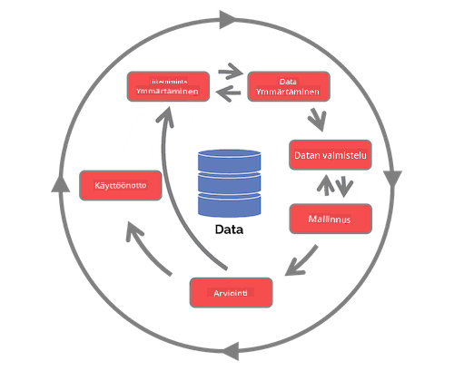

<!--
CO_OP_TRANSLATOR_METADATA:
{
  "original_hash": "c368f8f2506fe56bca0f7be05c4eb71d",
  "translation_date": "2025-08-26T22:27:07+00:00",
  "source_file": "4-Data-Science-Lifecycle/14-Introduction/README.md",
  "language_code": "fi"
}
-->
# Johdanto datatieteen elinkaareen

| ](../../sketchnotes/14-DataScience-Lifecycle.png)|
|:---:|
| Johdanto datatieteen elinkaareen - _Sketchnote by [@nitya](https://twitter.com/nitya)_ |

## [Esiluentavisa](https://red-water-0103e7a0f.azurestaticapps.net/quiz/26)

Olet todennäköisesti tähän mennessä huomannut, että datatiede on prosessi. Tämä prosessi voidaan jakaa viiteen vaiheeseen:

- Tiedon kerääminen
- Käsittely
- Analyysi
- Viestintä
- Ylläpito

Tämä oppitunti keskittyy elinkaaren kolmeen osaan: tiedon keräämiseen, käsittelyyn ja ylläpitoon.

  
> Kuva: [Berkeley School of Information](https://ischoolonline.berkeley.edu/data-science/what-is-data-science/)

## Tiedon kerääminen

Elinkaaren ensimmäinen vaihe on erittäin tärkeä, sillä seuraavat vaiheet ovat siitä riippuvaisia. Se on käytännössä kaksi vaihetta yhdistettynä: tiedon hankinta ja projektin tarkoituksen sekä ratkaistavien ongelmien määrittely.  
Projektin tavoitteiden määrittely vaatii syvempää ymmärrystä ongelmasta tai kysymyksestä. Ensimmäiseksi meidän on tunnistettava ja hankittava ne, joiden ongelma tarvitsee ratkaisua. Nämä voivat olla yrityksen sidosryhmiä tai projektin sponsoreita, jotka voivat auttaa tunnistamaan, kuka tai mikä hyötyy projektista, sekä mitä ja miksi he sitä tarvitsevat. Hyvin määritelty tavoite on mitattavissa ja kvantifioitavissa, jotta hyväksyttävä tulos voidaan määritellä.

Kysymyksiä, joita datatieteilijä voi esittää:
- Onko tätä ongelmaa lähestytty aiemmin? Mitä havaittiin?
- Ymmärtävätkö kaikki osapuolet tarkoituksen ja tavoitteen?
- Onko epäselvyyksiä, ja miten niitä voidaan vähentää?
- Mitkä ovat rajoitteet?
- Miltä lopputulos mahdollisesti näyttää?
- Kuinka paljon resursseja (aikaa, ihmisiä, laskentatehoa) on käytettävissä?

Seuraavaksi tunnistetaan, kerätään ja lopulta tutkitaan tarvittavat tiedot näiden tavoitteiden saavuttamiseksi. Tiedon hankintavaiheessa datatieteilijöiden on myös arvioitava tiedon määrä ja laatu. Tämä vaatii jonkin verran tiedon tutkimista, jotta voidaan varmistaa, että hankittu tieto tukee halutun tuloksen saavuttamista.

Kysymyksiä, joita datatieteilijä voi esittää tiedosta:
- Mitä tietoa minulla on jo saatavilla?
- Kuka omistaa tämän tiedon?
- Mitä yksityisyysongelmia on olemassa?
- Onko minulla tarpeeksi tietoa tämän ongelman ratkaisemiseksi?
- Onko tieto riittävän laadukasta tähän ongelmaan?
- Jos löydän lisätietoa tämän tiedon kautta, pitäisikö meidän harkita tavoitteiden muuttamista tai uudelleenmäärittelyä?

## Käsittely

Elinkaaren käsittelyvaihe keskittyy tiedon kaavojen löytämiseen sekä mallintamiseen. Joitakin käsittelyvaiheessa käytettyjä tekniikoita ovat tilastolliset menetelmät, joilla kaavoja voidaan paljastaa. Tämä olisi työlästä ihmiselle suurten tietomäärien kanssa, joten tietokoneet tekevät raskaan työn prosessin nopeuttamiseksi. Tämä vaihe on myös kohta, jossa datatiede ja koneoppiminen kohtaavat. Kuten opit ensimmäisessä oppitunnissa, koneoppiminen on prosessi, jossa rakennetaan malleja tiedon ymmärtämiseksi. Mallit ovat esityksiä muuttujien välisistä suhteista tiedossa, jotka auttavat ennustamaan tuloksia.

Tässä vaiheessa käytettyjä yleisiä tekniikoita käsitellään ML for Beginners -opetussuunnitelmassa. Seuraa linkkejä oppiaksesi lisää:

- [Luokittelu (Classification)](https://github.com/microsoft/ML-For-Beginners/tree/main/4-Classification): Tiedon järjestäminen kategorioihin tehokkaampaa käyttöä varten.
- [Klusterointi (Clustering)](https://github.com/microsoft/ML-For-Beginners/tree/main/5-Clustering): Tiedon ryhmittely samankaltaisiin ryhmiin.
- [Regressio (Regression)](https://github.com/microsoft/ML-For-Beginners/tree/main/2-Regression): Muuttujien välisten suhteiden määrittäminen arvojen ennustamiseksi tai arvioimiseksi.

## Ylläpito

Elinkaaren kaaviossa saatat huomata, että ylläpito sijoittuu tiedon keräämisen ja käsittelyn väliin. Ylläpito on jatkuva prosessi, jossa hallitaan, tallennetaan ja suojataan tietoa projektin aikana, ja se tulisi ottaa huomioon koko projektin ajan.

### Tiedon tallentaminen

Päätökset siitä, miten ja missä tietoa tallennetaan, voivat vaikuttaa tallennuskustannuksiin sekä siihen, kuinka nopeasti tietoa voidaan käyttää. Tällaisia päätöksiä ei todennäköisesti tee yksin datatieteilijä, mutta he voivat joutua tekemään valintoja sen suhteen, miten tietoa käsitellään sen tallennustavan perusteella.

Tässä on joitakin nykyaikaisten tietojen tallennusjärjestelmien ominaisuuksia, jotka voivat vaikuttaa näihin valintoihin:

**Paikallinen vs ulkoinen vs julkinen tai yksityinen pilvi**

Paikallinen tallennus tarkoittaa tiedon hallintaa omalla laitteistolla, kuten palvelimella, jossa on kiintolevyjä tiedon tallentamiseen. Ulkoinen tallennus taas perustuu laitteistoon, jota et omista, kuten datakeskukseen. Julkinen pilvi on suosittu vaihtoehto tiedon tallentamiseen, joka ei vaadi tietoa siitä, miten tai missä tieto tarkalleen ottaen tallennetaan. Julkinen viittaa yhtenäiseen infrastruktuuriin, jota kaikki pilven käyttäjät jakavat. Joillakin organisaatioilla on tiukat turvallisuuspolitiikat, jotka edellyttävät täydellistä pääsyä laitteistoon, jossa tieto on tallennettu, ja he käyttävät yksityistä pilveä, joka tarjoaa omat pilvipalvelut. Opit lisää pilvipalveluista [myöhemmissä oppitunneissa](https://github.com/microsoft/Data-Science-For-Beginners/tree/main/5-Data-Science-In-Cloud).

**Kylmä vs kuuma data**

Kun koulutat mallejasi, saatat tarvita enemmän koulutusdataa. Jos olet tyytyväinen mallisi toimintaan, lisää dataa saapuu mallin käyttötarkoitusta varten. Joka tapauksessa tiedon tallennus- ja käyttöönottokustannukset kasvavat, kun dataa kertyy enemmän. Harvoin käytetyn datan, eli kylmän datan, erottaminen usein käytetystä kuumasta datasta voi olla edullisempi tallennusvaihtoehto laitteiston tai ohjelmistopalveluiden avulla. Jos kylmää dataa tarvitsee käyttää, sen hakeminen voi kestää hieman kauemmin verrattuna kuumaan dataan.

### Tiedon hallinta

Kun työskentelet tiedon kanssa, saatat huomata, että osa tiedosta täytyy puhdistaa käyttämällä joitakin [tiedon valmisteluun](https://github.com/microsoft/Data-Science-For-Beginners/tree/main/2-Working-With-Data/08-data-preparation) liittyviä tekniikoita tarkkojen mallien rakentamiseksi. Kun uutta tietoa saapuu, se tarvitsee samoja sovelluksia laadun ylläpitämiseksi. Joissakin projekteissa käytetään automatisoitua työkalua tiedon puhdistamiseen, yhdistämiseen ja pakkaamiseen ennen kuin tieto siirretään lopulliseen sijaintiinsa. Azure Data Factory on esimerkki tällaisesta työkalusta.

### Tiedon suojaaminen

Yksi tiedon suojaamisen päätavoitteista on varmistaa, että tiedon kanssa työskentelevät hallitsevat, mitä kerätään ja missä kontekstissa sitä käytetään. Tiedon suojaaminen sisältää pääsyn rajoittamisen vain niille, jotka sitä tarvitsevat, paikallisten lakien ja säädösten noudattamisen sekä eettisten standardien ylläpitämisen, kuten [etiikkaa käsittelevässä oppitunnissa](https://github.com/microsoft/Data-Science-For-Beginners/tree/main/1-Introduction/02-ethics) käsiteltiin.

Tässä on joitakin asioita, joita tiimi voi tehdä turvallisuuden huomioimiseksi:
- Varmistaa, että kaikki tieto on salattu
- Tarjota asiakkaille tietoa siitä, miten heidän tietojaan käytetään
- Poistaa tiedon käyttöoikeudet projektista poistuneilta henkilöiltä
- Sallia vain tiettyjen projektin jäsenten muokata tietoa

## 🚀 Haaste

Datatieteen elinkaaresta on monia versioita, joissa jokaisella vaiheella voi olla eri nimiä ja eri määrä vaiheita, mutta ne sisältävät samat prosessit, jotka mainittiin tässä oppitunnissa.

Tutki [Team Data Science Process -elinkaarta](https://docs.microsoft.com/en-us/azure/architecture/data-science-process/lifecycle) ja [Cross-industry standard process for data mining -elinkaarta](https://www.datascience-pm.com/crisp-dm-2/). Nimeä 3 samankaltaisuutta ja eroa näiden kahden välillä.

|Team Data Science Process (TDSP)|Cross-industry standard process for data mining (CRISP-DM)|
|--|--|
| |  |
| Kuva: [Microsoft](https://docs.microsoft.comazure/architecture/data-science-process/lifecycle) | Kuva: [Data Science Process Alliance](https://www.datascience-pm.com/crisp-dm-2/) |

## [Jälkiluentavisa](https://red-water-0103e7a0f.azurestaticapps.net/quiz/27)

## Kertaus ja itseopiskelu

Datatieteen elinkaaren soveltaminen sisältää useita rooleja ja tehtäviä, joissa jotkut keskittyvät tiettyihin osiin jokaisessa vaiheessa. Team Data Science Process tarjoaa muutamia resursseja, jotka selittävät projektin rooleja ja tehtäviä.

* [Team Data Science Process -roolit ja tehtävät](https://docs.microsoft.com/en-us/azure/architecture/data-science-process/roles-tasks)  
* [Datatieteen tehtävien suorittaminen: tutkimus, mallinnus ja käyttöönotto](https://docs.microsoft.com/en-us/azure/architecture/data-science-process/execute-data-science-tasks)

## Tehtävä

[Datasetin arviointi](assignment.md)

---

**Vastuuvapauslauseke**:  
Tämä asiakirja on käännetty käyttämällä tekoälypohjaista käännöspalvelua [Co-op Translator](https://github.com/Azure/co-op-translator). Vaikka pyrimme tarkkuuteen, huomioithan, että automaattiset käännökset voivat sisältää virheitä tai epätarkkuuksia. Alkuperäistä asiakirjaa sen alkuperäisellä kielellä tulisi pitää ensisijaisena lähteenä. Kriittisen tiedon osalta suositellaan ammattimaista ihmiskäännöstä. Emme ole vastuussa väärinkäsityksistä tai virhetulkinnoista, jotka johtuvat tämän käännöksen käytöstä.