<!--
CO_OP_TRANSLATOR_METADATA:
{
  "original_hash": "14b2a7f1c63202920bd98eeb913f5614",
  "translation_date": "2025-08-26T22:04:28+00:00",
  "source_file": "5-Data-Science-In-Cloud/18-Low-Code/README.md",
  "language_code": "fi"
}
-->
# Data Science pilvessä: "Low code/No code" -lähestymistapa

| ](../../sketchnotes/18-DataScience-Cloud.png)|
|:---:|
| Data Science pilvessä: Low Code - _Sketchnote by [@nitya](https://twitter.com/nitya)_ |

Sisällysluettelo:

- [Data Science pilvessä: "Low code/No code" -lähestymistapa](../../../../5-Data-Science-In-Cloud/18-Low-Code)
  - [Ennakkokysely](../../../../5-Data-Science-In-Cloud/18-Low-Code)
  - [1. Johdanto](../../../../5-Data-Science-In-Cloud/18-Low-Code)
    - [1.1 Mikä on Azure Machine Learning?](../../../../5-Data-Science-In-Cloud/18-Low-Code)
    - [1.2 Sydämen vajaatoiminnan ennustusprojekti:](../../../../5-Data-Science-In-Cloud/18-Low-Code)
    - [1.3 Sydämen vajaatoiminnan datasetti:](../../../../5-Data-Science-In-Cloud/18-Low-Code)
  - [2. Mallin Low code/No code -koulutus Azure ML Studiossa](../../../../5-Data-Science-In-Cloud/18-Low-Code)
    - [2.1 Luo Azure ML -työtila](../../../../5-Data-Science-In-Cloud/18-Low-Code)
    - [2.2 Laskentaresurssit](../../../../5-Data-Science-In-Cloud/18-Low-Code)
      - [2.2.1 Oikeiden laskentaresurssien valinta](../../../../5-Data-Science-In-Cloud/18-Low-Code)
      - [2.2.2 Laskentaklusterin luominen](../../../../5-Data-Science-In-Cloud/18-Low-Code)
    - [2.3 Datasetin lataaminen](../../../../5-Data-Science-In-Cloud/18-Low-Code)
    - [2.4 Low code/No code -koulutus AutoML:llä](../../../../5-Data-Science-In-Cloud/18-Low-Code)
  - [3. Mallin Low code/No code -julkaisu ja päätepisteen käyttö](../../../../5-Data-Science-In-Cloud/18-Low-Code)
    - [3.1 Mallin julkaisu](../../../../5-Data-Science-In-Cloud/18-Low-Code)
    - [3.2 Päätepisteen käyttö](../../../../5-Data-Science-In-Cloud/18-Low-Code)
  - [🚀 Haaste](../../../../5-Data-Science-In-Cloud/18-Low-Code)
  - [Luentojälkeinen kysely](../../../../5-Data-Science-In-Cloud/18-Low-Code)
  - [Kertaus ja itseopiskelu](../../../../5-Data-Science-In-Cloud/18-Low-Code)
  - [Tehtävä](../../../../5-Data-Science-In-Cloud/18-Low-Code)
  
## [Ennakkokysely](https://purple-hill-04aebfb03.1.azurestaticapps.net/quiz/34)
## 1. Johdanto
### 1.1 Mikä on Azure Machine Learning?

Azure-pilvialusta sisältää yli 200 tuotetta ja pilvipalvelua, jotka on suunniteltu auttamaan uusien ratkaisujen kehittämisessä. 
Data-analyytikot käyttävät paljon aikaa datan tutkimiseen ja esikäsittelyyn sekä erilaisten mallin koulutusalgoritmien kokeilemiseen tarkkojen mallien tuottamiseksi. Nämä tehtävät vievät aikaa ja voivat olla tehottomia kalliiden laskentaresurssien käytössä.

[Azure ML](https://docs.microsoft.com/azure/machine-learning/overview-what-is-azure-machine-learning?WT.mc_id=academic-77958-bethanycheum&ocid=AID3041109) on pilvipohjainen alusta koneoppimisratkaisujen rakentamiseen ja operointiin Azure-ympäristössä. Se sisältää laajan valikoiman ominaisuuksia ja työkaluja, jotka auttavat data-analyytikkoja valmistamaan dataa, kouluttamaan malleja, julkaisemaan ennustepalveluita ja seuraamaan niiden käyttöä. Tärkeimpänä se parantaa tehokkuutta automatisoimalla monia aikaa vieviä mallin koulutukseen liittyviä tehtäviä ja mahdollistaa pilvipohjaisten laskentaresurssien käytön, jotka skaalautuvat tehokkaasti suurten datamäärien käsittelyyn ja aiheuttavat kustannuksia vain käytön aikana.

Azure ML tarjoaa kaikki työkalut, joita kehittäjät ja data-analyytikot tarvitsevat koneoppimisen työnkulkuihin. Näihin kuuluvat:

- **Azure Machine Learning Studio**: verkkopohjainen portaali Azure Machine Learningissä, joka tarjoaa Low code- ja No code -vaihtoehtoja mallin koulutukseen, julkaisuun, automatisointiin, seurantaan ja resurssien hallintaan. Studio integroituu Azure Machine Learning SDK:han saumattoman käyttökokemuksen takaamiseksi.
- **Jupyter Notebooks**: nopea prototyyppien ja ML-mallien testaus.
- **Azure Machine Learning Designer**: mahdollistaa moduulien vetämisen ja pudottamisen kokeiden rakentamiseksi ja putkistojen julkaisemiseksi Low code -ympäristössä.
- **Automated machine learning UI (AutoML)**: automatisoi koneoppimismallien kehittämisen iteratiiviset tehtävät, mahdollistaen mallien rakentamisen suurella skaalalla, tehokkuudella ja tuottavuudella, samalla säilyttäen mallin laadun.
- **Data Labelling**: avustettu ML-työkalu datan automaattiseen merkintään.
- **Machine learning extension for Visual Studio Code**: tarjoaa täysimittaisen kehitysympäristön ML-projektien rakentamiseen ja hallintaan.
- **Machine learning CLI**: tarjoaa komentoja Azure ML -resurssien hallintaan komentoriviltä.
- **Integraatio avoimen lähdekoodin kehysten kanssa** kuten PyTorch, TensorFlow, Scikit-learn ja monet muut, jotka tukevat koneoppimisen prosessien koulutusta, julkaisemista ja hallintaa.
- **MLflow**: avoimen lähdekoodin kirjasto koneoppimiskokeiden elinkaaren hallintaan. **MLFlow Tracking** on MLflow:n komponentti, joka kirjaa ja seuraa koulutuskokeiden metriikoita ja mallin artefakteja riippumatta kokeen ympäristöstä.

### 1.2 Sydämen vajaatoiminnan ennustusprojekti:

Projektien tekeminen ja rakentaminen on epäilemättä paras tapa testata taitoja ja tietämystä. Tässä oppitunnissa tutkimme kahta erilaista tapaa rakentaa data-analytiikkaprojekti sydämen vajaatoiminnan ennustamiseksi Azure ML Studiossa: Low code/No code -menetelmällä ja Azure ML SDK:lla, kuten seuraavassa kaaviossa esitetään:

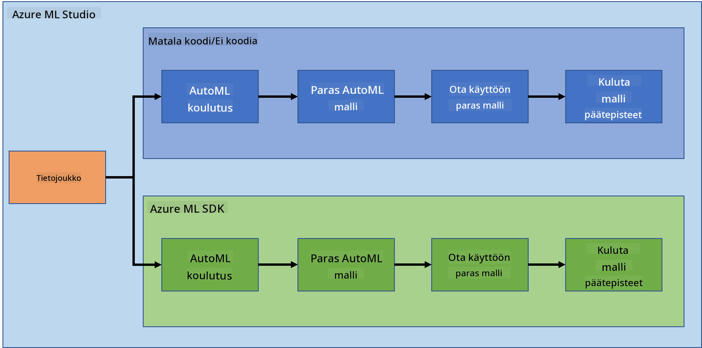

Kummallakin menetelmällä on omat hyvät ja huonot puolensa. Low code/No code -menetelmä on helpompi aloittaa, koska se sisältää graafisen käyttöliittymän (GUI) käytön eikä vaadi aiempaa koodausosaamista. Tämä menetelmä mahdollistaa projektin toteutettavuuden nopean testauksen ja POC:n (Proof Of Concept) luomisen. Kuitenkin projektin kasvaessa ja tuotantovalmiuden vaatiessa GUI:n kautta resurssien luominen ei ole enää käytännöllistä. Tällöin resurssien luomisen, mallin koulutuksen ja julkaisemisen automatisointi ohjelmallisesti Azure ML SDK:n avulla tulee välttämättömäksi.

|                   | Low code/No code | Azure ML SDK              |
|-------------------|------------------|---------------------------|
| Koodiosaaminen    | Ei vaadita       | Vaaditaan                 |
| Kehitysaika       | Nopea ja helppo  | Riippuu koodausosaamisesta |
| Tuotantovalmius   | Ei               | Kyllä                     |

### 1.3 Sydämen vajaatoiminnan datasetti: 

Sydän- ja verisuonitaudit (CVD:t) ovat maailmanlaajuisesti yleisin kuolinsyy, vastaten 31 % kaikista kuolemista. Ympäristö- ja käyttäytymistekijät, kuten tupakointi, epäterveellinen ruokavalio ja lihavuus, fyysinen passiivisuus ja alkoholin haitallinen käyttö, voivat toimia piirteinä ennustemalleissa. Mahdollisuus arvioida CVD:n kehittymisen todennäköisyyttä voisi olla erittäin hyödyllistä korkean riskin henkilöiden hyökkäysten ehkäisemiseksi.

Kaggle on tehnyt [Heart Failure -datasetin](https://www.kaggle.com/andrewmvd/heart-failure-clinical-data) julkisesti saataville, ja käytämme sitä tässä projektissa. Voit ladata datasetin nyt. Datasetti on taulukkomuotoinen ja sisältää 13 saraketta (12 ominaisuutta ja 1 kohdemuuttuja) sekä 299 riviä.

|    | Muuttujan nimi            | Tyyppi           | Kuvaus                                                    | Esimerkki         |
|----|---------------------------|------------------|----------------------------------------------------------|-------------------|
| 1  | age                       | numeerinen       | Potilaan ikä                                             | 25                |
| 2  | anaemia                   | totuusarvo       | Punasolujen tai hemoglobiinin väheneminen               | 0 tai 1           |
| 3  | creatinine_phosphokinase  | numeerinen       | CPK-entsyymin taso veressä                               | 542               |
| 4  | diabetes                  | totuusarvo       | Onko potilaalla diabetes                                | 0 tai 1           |
| 5  | ejection_fraction         | numeerinen       | Sydämestä lähtevän veren prosenttiosuus jokaisella supistuksella | 45                |
| 6  | high_blood_pressure       | totuusarvo       | Onko potilaalla verenpainetauti                         | 0 tai 1           |
| 7  | platelets                 | numeerinen       | Verihiutaleiden määrä veressä                           | 149000            |
| 8  | serum_creatinine          | numeerinen       | Seerumin kreatiniinin taso veressä                      | 0.5               |
| 9  | serum_sodium              | numeerinen       | Seerumin natriumin taso veressä                         | jun               |
| 10 | sex                       | totuusarvo       | Nainen tai mies                                         | 0 tai 1           |
| 11 | smoking                   | totuusarvo       | Tupakoiko potilas                                       | 0 tai 1           |
| 12 | time                      | numeerinen       | Seurantajakso (päivää)                                  | 4                 |
|----|---------------------------|------------------|----------------------------------------------------------|-------------------|
| 21 | DEATH_EVENT [Kohde]       | totuusarvo       | Kuoleeko potilas seurantajakson aikana                  | 0 tai 1           |

Kun datasetti on ladattu, voimme aloittaa projektin Azure-ympäristössä.

## 2. Mallin Low code/No code -koulutus Azure ML Studiossa
### 2.1 Luo Azure ML -työtila
Jotta voit kouluttaa mallin Azure ML:ssä, sinun on ensin luotava Azure ML -työtila. Työtila on Azure Machine Learningin ylin resurssi, joka tarjoaa keskitetyn paikan kaikille artefakteille, jotka luot Azure Machine Learningin käytön aikana. Työtila pitää kirjaa kaikista koulutuskokeista, mukaan lukien lokit, metriikat, tulokset ja skriptien tilannekuvat. Näitä tietoja käytetään sen määrittämiseen, mikä koulutuskoke tuottaa parhaan mallin. [Lisätietoja](https://docs.microsoft.com/azure/machine-learning/concept-workspace?WT.mc_id=academic-77958-bethanycheum&ocid=AID3041109)

Suosittelemme käyttämään käyttöjärjestelmääsi parhaiten sopivaa ja ajantasaisinta selainta. Seuraavat selaimet ovat tuettuja:

- Microsoft Edge (Uusi Microsoft Edge, uusin versio. Ei Microsoft Edge legacy)
- Safari (uusin versio, vain Mac)
- Chrome (uusin versio)
- Firefox (uusin versio)

Azure Machine Learningin käyttöä varten luo työtila Azure-tilauksessasi. Voit sitten käyttää tätä työtilaa datan, laskentaresurssien, koodin, mallien ja muiden koneoppimiseen liittyvien artefaktien hallintaan.

> **_HUOM:_** Azure-tilauksesi veloitetaan pienestä datan tallennusmaksusta niin kauan kuin Azure Machine Learning -työtila on olemassa tilauksessasi, joten suosittelemme poistamaan työtilan, kun et enää käytä sitä.

1. Kirjaudu sisään [Azure-portaaliin](https://ms.portal.azure.com/) Microsoft-tunnuksilla, jotka liittyvät Azure-tilaukseesi.
2. Valitse **＋Luo resurssi**
   
   

   Etsi Machine Learning ja valitse Machine Learning -laatta

   

   Klikkaa luo-painiketta

   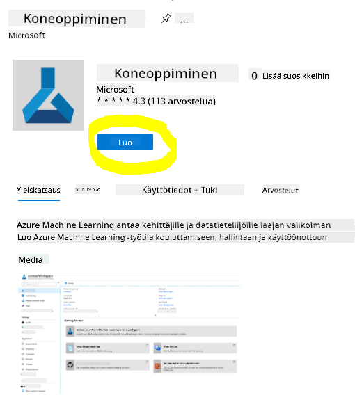

   Täytä asetukset seuraavasti:
   - Tilaus: Azure-tilauksesi
   - Resurssiryhmä: Luo tai valitse resurssiryhmä
   - Työtilan nimi: Anna työtilallesi yksilöllinen nimi
   - Alue: Valitse maantieteellinen alue, joka on lähimpänä sinua
   - Tallennustili: Huomioi oletusarvoinen uusi tallennustili, joka luodaan työtilallesi
   - Avainten hallinta: Huomioi oletusarvoinen uusi avainten hallinta, joka luodaan työtilallesi
   - Sovelluksen näkemykset: Huomioi oletusarvoinen uusi sovelluksen näkemykset -resurssi, joka luodaan työtilallesi
   - Säilörekisteri: Ei mitään (yksi luodaan automaattisesti ensimmäisellä kerralla, kun julkaiset mallin säilöön)

    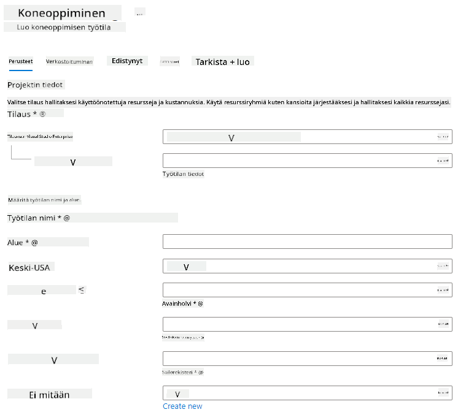

   - Klikkaa luo + tarkista ja sitten luo-painiketta
3. Odota, että työtilasi luodaan (tämä voi kestää muutaman minuutin). Siirry sitten siihen portaalissa. Löydät sen Machine Learning Azure -palvelun kautta.
4. Työtilasi yleiskatsaus-sivulla käynnistä Azure Machine Learning Studio (tai avaa uusi selainvälilehti ja siirry osoitteeseen https://ml.azure.com), ja kirjaudu sisään Azure Machine Learning Studioon Microsoft-tililläsi. Jos sinua pyydetään, valitse Azure-hakemisto ja -tilaus sekä Azure Machine Learning -työtilasi.
   
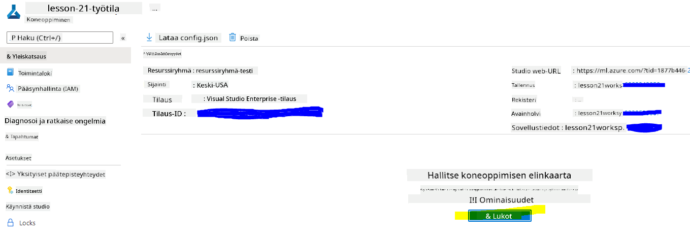

5. Azure Machine Learning Studiossa, vaihda ☰-ikonia vasemmassa yläkulmassa nähdäksesi käyttöliittymän eri sivut. Voit käyttää näitä sivuja työtilasi resurssien hallintaan.

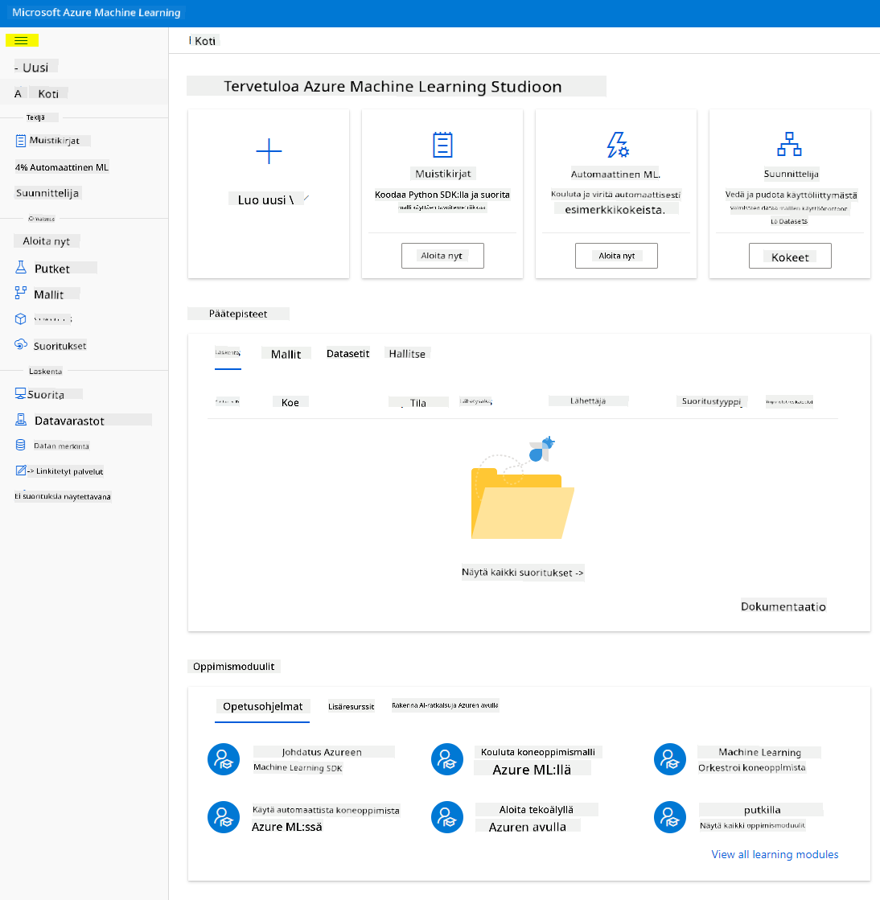

Voit hallita työtilaa Azure-portaalin kautta, mutta data-analyytikoille ja koneoppimisen operaatioinsinööreille Azure Machine Learning Studio tarjoaa keskittyneemmän käyttöliittymän työtilan resurssien hallintaan.

### 2.2 Laskentaresurssit

Laskentaresurssit ovat pilvipohjaisia resursseja, joilla voit suorittaa mallin koulutus- ja datan tutkimusprosesseja. Voit luoda neljä erilaista laskentaresurssia:

- **Laskentainstanssit**: Kehitystyöasemia, joita data-analyytikot voivat käyttää datan ja mallien kanssa työskentelyyn. Tämä sisältää virtuaalikoneen (VM) luomisen ja notebook-instanssin käynnistämisen. Voit sitten kouluttaa mallin kutsumalla laskentaklusterin notebookista.
- **Laskentaklusterit**: Skaalautuvia virtuaalikoneklustereita kokeiden koodin tarpeen mukaan tapahtuvaan käsittelyyn. Tarvitset niitä mallin koulutuksessa. Laskentaklusterit voivat myös käyttää erikoistuneita GPU- tai CPU-resursseja.
- **Inferenssiklusterit**: Julkaisukohteita ennustepalveluille, jotka käyttävät koulutettuja mallejasi.
- **Liitetty laskenta**: Linkit olemassa oleviin Azure-laskentaresursseihin, kuten virtuaalikoneisiin tai Azure Databricks -klustereihin.

#### 2.2.1 Oikeiden vaihtoehtojen valitseminen laskentaresursseillesi

On tärkeää ottaa huomioon muutamia keskeisiä tekijöitä luodessasi laskentaresurssia, sillä nämä valinnat voivat olla kriittisiä päätöksiä.

**Tarvitsetko CPU:n vai GPU:n?**

CPU (keskusyksikkö) on elektroninen piiri, joka suorittaa tietokoneohjelman sisältämiä ohjeita. GPU (grafiikkasuoritin) on erikoistunut elektroninen piiri, joka voi suorittaa grafiikkaan liittyvää koodia erittäin suurella nopeudella.

Pääasiallinen ero CPU:n ja GPU:n arkkitehtuurin välillä on, että CPU on suunniteltu käsittelemään laajaa tehtävävalikoimaa nopeasti (mitattuna CPU:n kellotaajuudella), mutta sen samanaikaisesti suoritettavien tehtävien määrä on rajallinen. GPU:t on suunniteltu rinnakkaislaskentaan, ja siksi ne soveltuvat paljon paremmin syväoppimistehtäviin.

| CPU                                     | GPU                         |
|-----------------------------------------|-----------------------------|
| Vähemmän kallis                         | Kalliimpi                  |
| Alhaisempi samanaikaisuuden taso        | Korkeampi samanaikaisuuden taso |
| Hitaampi syväoppimismallien koulutuksessa | Optimaalinen syväoppimiseen |

**Klusterin koko**

Suuremmat klusterit ovat kalliimpia, mutta ne tarjoavat paremman reagointikyvyn. Jos sinulla on aikaa mutta ei tarpeeksi rahaa, kannattaa aloittaa pienellä klusterilla. Jos taas sinulla on rahaa mutta ei paljon aikaa, kannattaa aloittaa suuremmalla klusterilla.

**VM:n koko**

Ajan ja budjetin rajoitusten mukaan voit vaihdella RAM-muistin, levyn, ytimien määrän ja kellotaajuuden kokoa. Näiden parametrien kasvattaminen on kalliimpaa, mutta parantaa suorituskykyä.

**Dedikoidut vai matalan prioriteetin instanssit?**

Matalan prioriteetin instanssi tarkoittaa, että se on keskeytettävissä: Microsoft Azure voi ottaa nämä resurssit ja osoittaa ne toiseen tehtävään, keskeyttäen työn. Dedikoitu instanssi, eli ei-keskeytettävä, tarkoittaa, että työ ei koskaan keskeydy ilman lupaasi. Tämä on jälleen yksi aika vs. raha -pohdinta, sillä keskeytettävät instanssit ovat edullisempia kuin dedikoidut.

#### 2.2.2 Laskentaklusterin luominen

[Azure ML -työtilassa](https://ml.azure.com/), jonka loimme aiemmin, siirry laskentaan, ja näet juuri keskustellut eri laskentaresurssit (esim. laskentainstanssit, laskentaklusterit, inferenssiklusterit ja liitetty laskenta). Tässä projektissa tarvitsemme laskentaklusterin mallin koulutusta varten. Studiossa, napsauta "Compute"-valikkoa, sitten "Compute cluster" -välilehteä ja napsauta "+ New" -painiketta luodaksesi laskentaklusterin.

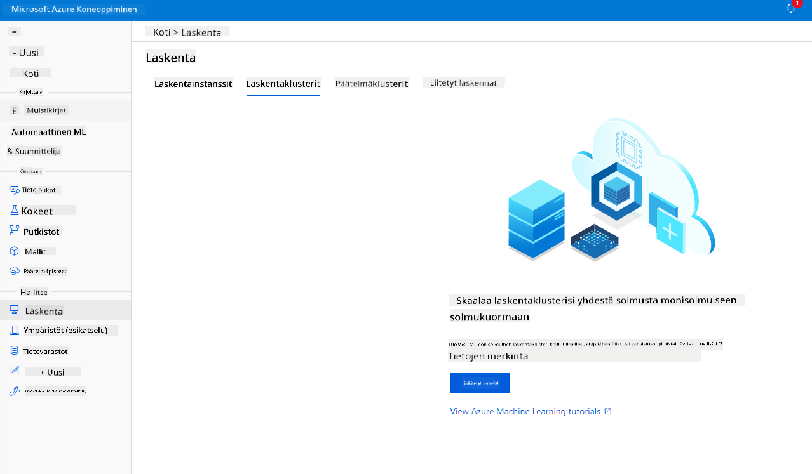

1. Valitse vaihtoehdot: Dedikoitu vs. matalan prioriteetin, CPU tai GPU, VM:n koko ja ytimien määrä (voit pitää oletusasetukset tässä projektissa).
2. Napsauta Seuraava-painiketta.

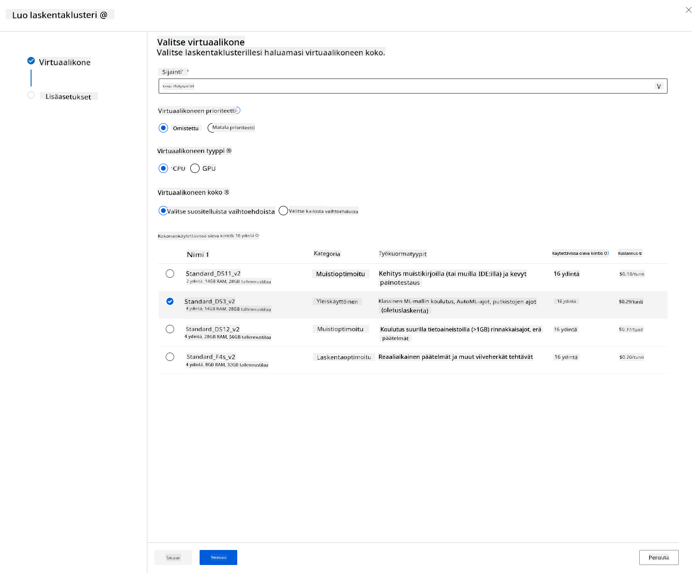

3. Anna klusterille laskennan nimi.
4. Valitse vaihtoehdot: Minimi/maksimi solmujen määrä, tyhjäkäyntisekunnit ennen alasajoa, SSH-yhteys. Huomaa, että jos solmujen minimimäärä on 0, säästät rahaa, kun klusteri on tyhjäkäynnillä. Huomaa, että mitä suurempi solmujen maksimimäärä, sitä lyhyempi koulutusaika. Suositeltu maksimimäärä solmuja on 3.  
5. Napsauta "Create"-painiketta. Tämä vaihe voi kestää muutaman minuutin.

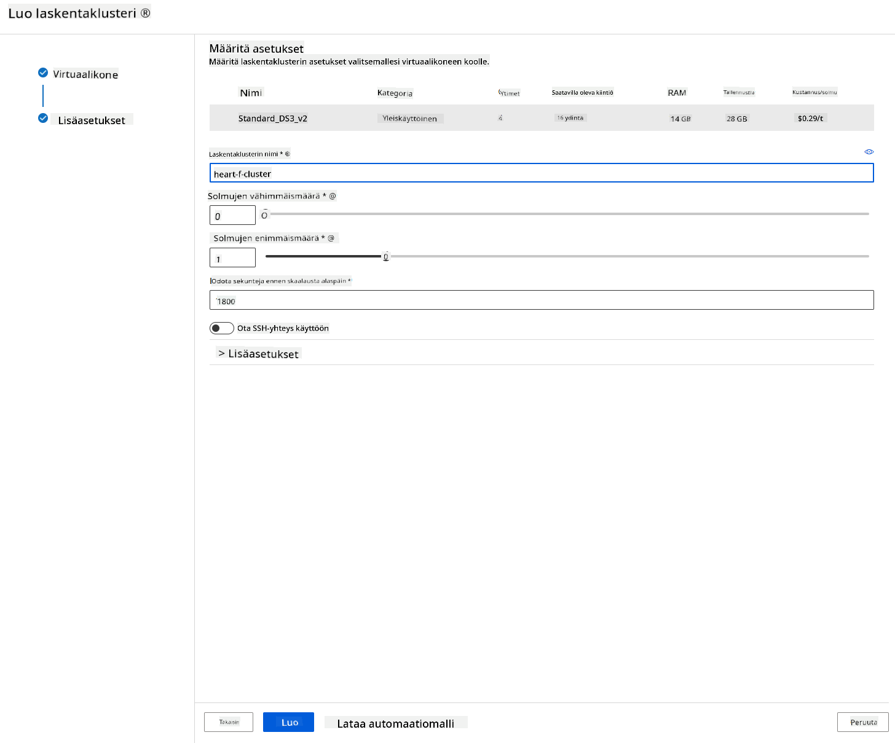

Mahtavaa! Nyt kun meillä on laskentaklusteri, meidän täytyy ladata data Azure ML Studioon.

### 2.3 Datan lataaminen

1. [Azure ML -työtilassa](https://ml.azure.com/), jonka loimme aiemmin, napsauta "Datasets" vasemmassa valikossa ja napsauta "+ Create dataset" -painiketta luodaksesi datasetin. Valitse "From local files" -vaihtoehto ja valitse aiemmin ladattu Kaggle-datasetti.
   
   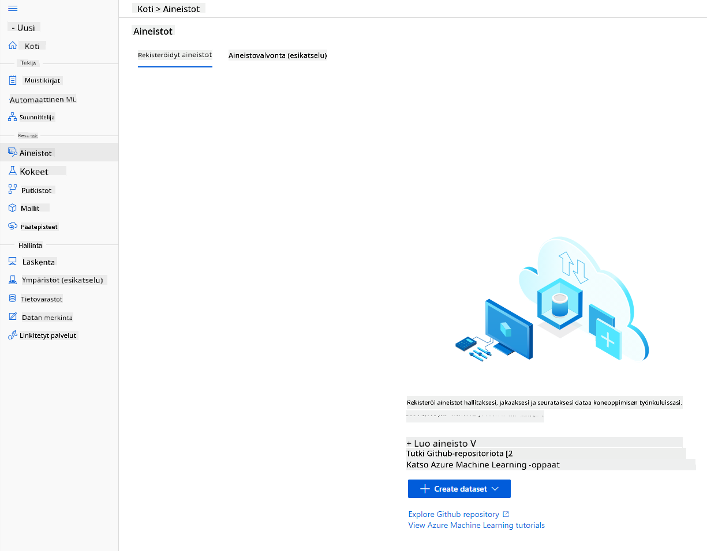

2. Anna datasetille nimi, tyyppi ja kuvaus. Napsauta Seuraava. Lataa data tiedostoista. Napsauta Seuraava.
   
   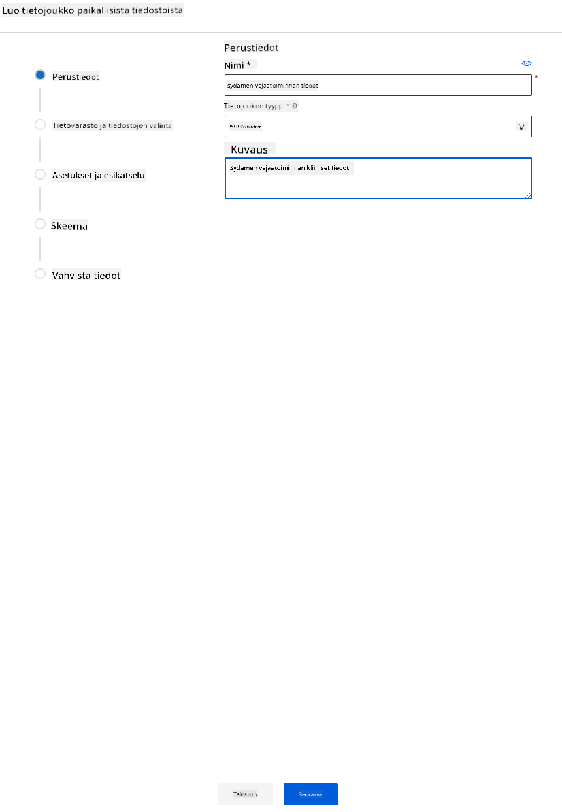

3. Skeemassa muuta datatyyppi Booleaniksi seuraaville ominaisuuksille: anaemia, diabetes, korkea verenpaine, sukupuoli, tupakointi ja DEATH_EVENT. Napsauta Seuraava ja napsauta Create.
   
   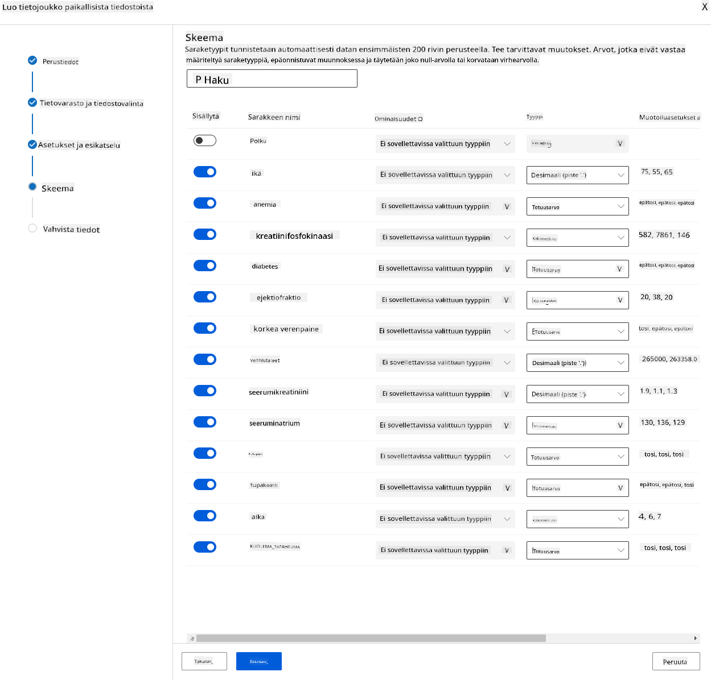

Hienoa! Nyt kun datasetti on paikallaan ja laskentaklusteri on luotu, voimme aloittaa mallin koulutuksen!

### 2.4 Vähäkoodinen/kooditon koulutus AutoML:n avulla

Perinteinen koneoppimismallien kehitys on resurssi-intensiivistä, vaatii merkittävää alakohtaista tietämystä ja aikaa kymmenien mallien tuottamiseen ja vertailuun. Automatisoitu koneoppiminen (AutoML) on prosessi, joka automatisoi koneoppimismallien kehityksen aikaa vievät, iteratiiviset tehtävät. Se mahdollistaa datatieteilijöiden, analyytikoiden ja kehittäjien rakentaa ML-malleja suurella skaalalla, tehokkuudella ja tuottavuudella, samalla säilyttäen mallien laadun. Se vähentää aikaa, joka tarvitaan tuotantovalmiiden ML-mallien saamiseen, helposti ja tehokkaasti. [Lisätietoja](https://docs.microsoft.com/azure/machine-learning/concept-automated-ml?WT.mc_id=academic-77958-bethanycheum&ocid=AID3041109)

1. [Azure ML -työtilassa](https://ml.azure.com/), jonka loimme aiemmin, napsauta "Automated ML" vasemmassa valikossa ja valitse juuri ladattu datasetti. Napsauta Seuraava.

   

2. Anna uusi kokeilun nimi, kohdesarake (DEATH_EVENT) ja luotu laskentaklusteri. Napsauta Seuraava.
   
   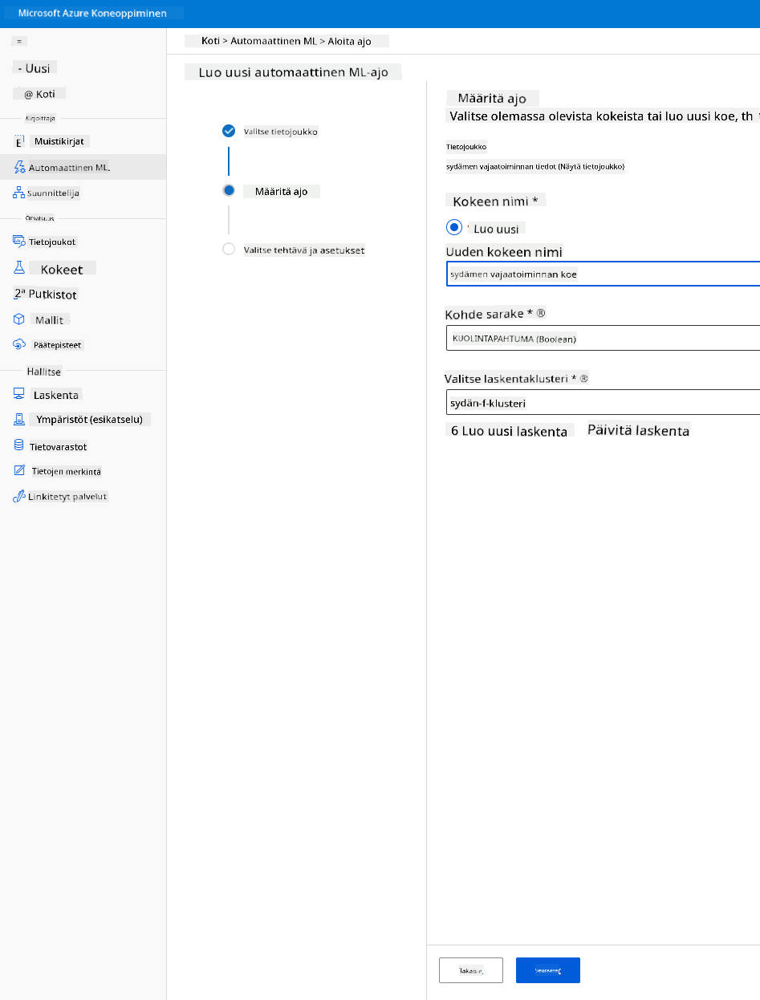

3. Valitse "Classification" ja napsauta Finish. Tämä vaihe voi kestää 30 minuutista 1 tuntiin riippuen laskentaklusterin koosta.
    
    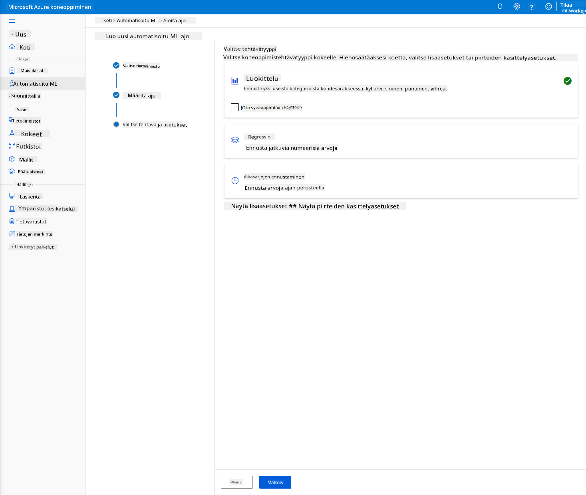

4. Kun ajo on valmis, napsauta "Automated ML" -välilehteä, napsauta ajoasi ja napsauta algoritmia "Best model summary" -kortissa.
    
    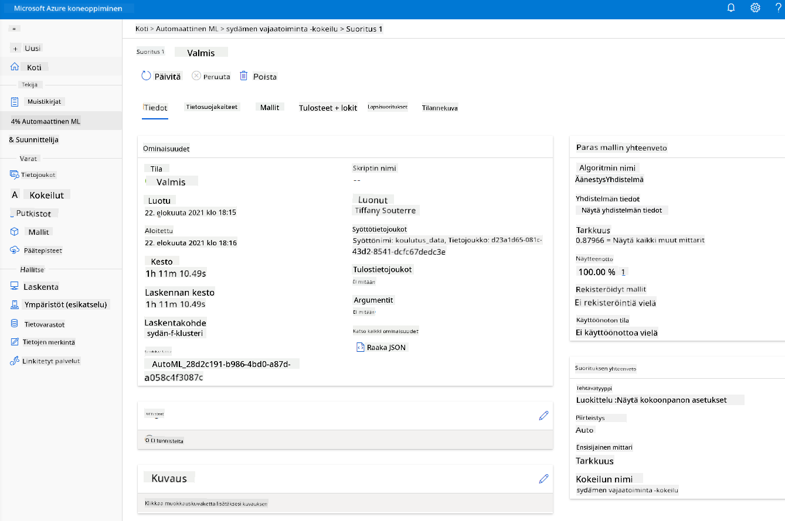

Täällä voit nähdä yksityiskohtaisen kuvauksen parhaasta mallista, jonka AutoML tuotti. Voit myös tutkia muita malleja Models-välilehdessä. Käytä muutama minuutti mallien tutkimiseen Explanations (preview) -painikkeessa. Kun olet valinnut mallin, jota haluat käyttää (tässä valitsemme AutoML:n valitseman parhaan mallin), näemme, kuinka voimme ottaa sen käyttöön.

## 3. Vähäkoodinen/kooditon mallin käyttöönotto ja päätepisteen kulutus
### 3.1 Mallin käyttöönotto

Automatisoitu koneoppimisen käyttöliittymä mahdollistaa parhaan mallin käyttöönoton verkkopalveluna muutamassa vaiheessa. Käyttöönotto tarkoittaa mallin integrointia siten, että se voi tehdä ennusteita uuden datan perusteella ja tunnistaa mahdollisia kehitysalueita. Tässä projektissa verkkopalveluun käyttöönotto tarkoittaa, että lääketieteelliset sovellukset voivat käyttää mallia tehdäkseen reaaliaikaisia ennusteita potilaidensa sydänkohtauksen riskistä.

Parhaan mallin kuvauksessa napsauta "Deploy"-painiketta.
    
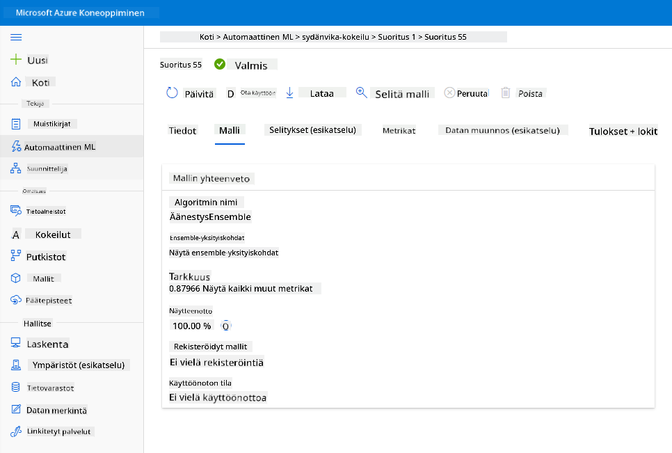

15. Anna nimi, kuvaus, laskentatyyppi (Azure Container Instance), ota käyttöön autentikointi ja napsauta Deploy. Tämä vaihe voi kestää noin 20 minuuttia. Käyttöönotto sisältää useita vaiheita, kuten mallin rekisteröinnin, resurssien luomisen ja niiden konfiguroinnin verkkopalvelua varten. Tilaviesti näkyy Deploy status -kohdassa. Valitse Refresh säännöllisesti tarkistaaksesi käyttöönoton tilan. Se on otettu käyttöön ja käynnissä, kun tila on "Healthy".

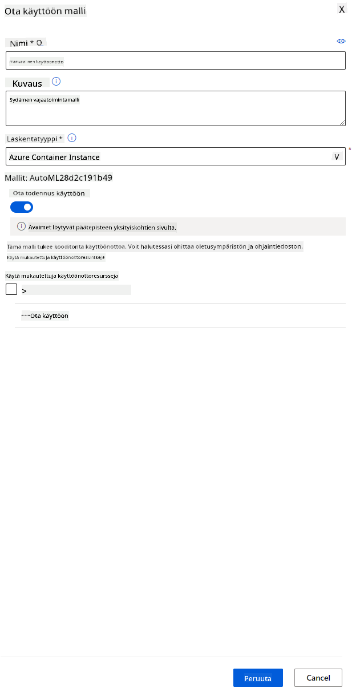

16. Kun se on otettu käyttöön, napsauta Endpoint-välilehteä ja napsauta juuri käyttöönotettua päätepistettä. Täältä löydät kaikki tiedot, jotka sinun tarvitsee tietää päätepisteestä. 

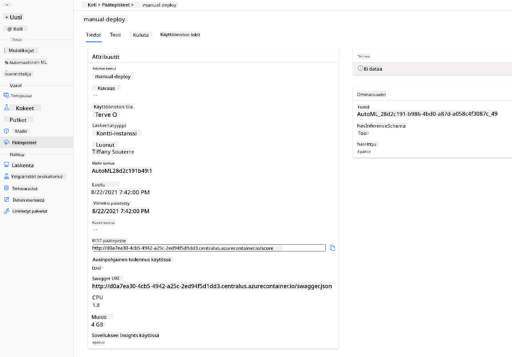

Mahtavaa! Nyt kun meillä on malli otettu käyttöön, voimme aloittaa päätepisteen kulutuksen.

### 3.2 Päätepisteen kulutus

Napsauta "Consume"-välilehteä. Täältä löydät REST-päätepisteen ja Python-skriptin kulutusvaihtoehdossa. Käytä hetki Python-koodin lukemiseen.

Tämä skripti voidaan suorittaa suoraan paikalliselta koneeltasi ja se kuluttaa päätepisteesi.

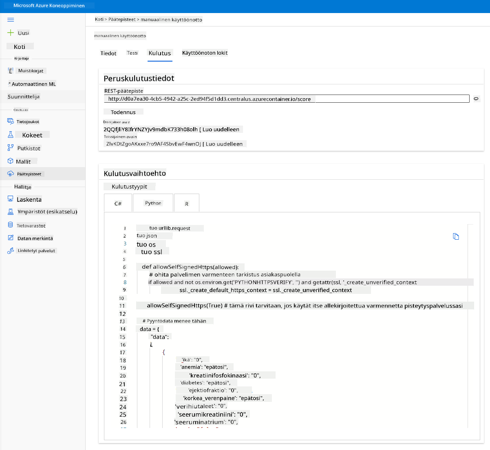

Käytä hetki näiden kahden koodirivin tarkasteluun:

```python
url = 'http://98e3715f-xxxx-xxxx-xxxx-9ec22d57b796.centralus.azurecontainer.io/score'
api_key = '' # Replace this with the API key for the web service
```
`url`-muuttuja on REST-päätepiste, joka löytyy kulutusvälilehdestä, ja `api_key`-muuttuja on ensisijainen avain, joka löytyy myös kulutusvälilehdestä (vain jos olet ottanut autentikoinnin käyttöön). Näin skripti voi kuluttaa päätepisteen.

18. Skriptiä suoritettaessa sinun pitäisi nähdä seuraava tulos:
    ```python
    b'"{\\"result\\": [true]}"'
    ```
Tämä tarkoittaa, että sydämen vajaatoiminnan ennuste annettujen tietojen perusteella on tosi. Tämä on järkevää, koska jos tarkastelet tarkemmin skriptissä automaattisesti luotuja tietoja, kaikki on oletuksena 0 ja epätosi. Voit muuttaa tietoja seuraavalla syöttöesimerkillä:

```python
data = {
    "data":
    [
        {
            'age': "0",
            'anaemia': "false",
            'creatinine_phosphokinase': "0",
            'diabetes': "false",
            'ejection_fraction': "0",
            'high_blood_pressure': "false",
            'platelets': "0",
            'serum_creatinine': "0",
            'serum_sodium': "0",
            'sex': "false",
            'smoking': "false",
            'time': "0",
        },
        {
            'age': "60",
            'anaemia': "false",
            'creatinine_phosphokinase': "500",
            'diabetes': "false",
            'ejection_fraction': "38",
            'high_blood_pressure': "false",
            'platelets': "260000",
            'serum_creatinine': "1.40",
            'serum_sodium': "137",
            'sex': "false",
            'smoking': "false",
            'time': "130",
        },
    ],
}
```
Skripti pitäisi palauttaa:
    ```python
    b'"{\\"result\\": [true, false]}"'
    ```

Onnittelut! Kulutit juuri käyttöönotetun mallin ja koulutit sen Azure ML:ssä!

> **_HUOM:_** Kun olet valmis projektin kanssa, muista poistaa kaikki resurssit.
## 🚀 Haaste

Tutki tarkasti AutoML:n tuottamia malliselityksiä ja yksityiskohtia parhaista malleista. Yritä ymmärtää, miksi paras malli on parempi kuin muut. Mitä algoritmeja verrattiin? Mitkä ovat niiden erot? Miksi paras malli toimii paremmin tässä tapauksessa?

## [Luennon jälkeinen kysely](https://purple-hill-04aebfb03.1.azurestaticapps.net/quiz/35)

## Kertaus ja itseopiskelu

Tässä oppitunnissa opit kouluttamaan, ottamaan käyttöön ja kuluttamaan mallin sydämen vajaatoiminnan riskin ennustamiseksi vähäkoodisella/koodittomalla tavalla pilvessä. Jos et ole vielä tehnyt sitä, tutustu syvällisemmin AutoML:n tuottamiin malliselityksiin ja yritä ymmärtää, miksi paras malli on parempi kuin muut.

Voit syventyä lisää vähäkoodiseen/koodittomaan AutoML:ään lukemalla tämän [dokumentaation](https://docs.microsoft.com/azure/machine-learning/tutorial-first-experiment-automated-ml?WT.mc_id=academic-77958-bethanycheum&ocid=AID3041109).

## Tehtävä

[Vähäkoodinen/kooditon datatiedeprojekti Azure ML:ssä](assignment.md)

---

**Vastuuvapauslauseke**:  
Tämä asiakirja on käännetty käyttämällä tekoälypohjaista käännöspalvelua [Co-op Translator](https://github.com/Azure/co-op-translator). Vaikka pyrimme tarkkuuteen, huomioithan, että automaattiset käännökset voivat sisältää virheitä tai epätarkkuuksia. Alkuperäinen asiakirja sen alkuperäisellä kielellä tulisi pitää ensisijaisena lähteenä. Kriittisen tiedon osalta suositellaan ammattimaista ihmiskäännöstä. Emme ole vastuussa väärinkäsityksistä tai virhetulkinnoista, jotka johtuvat tämän käännöksen käytöstä.