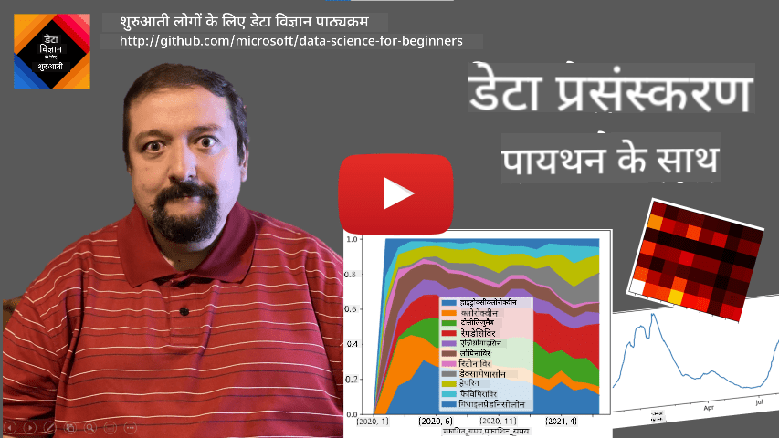
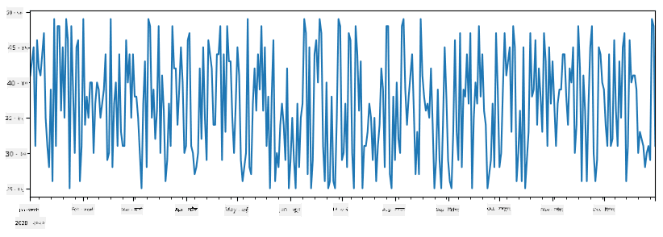
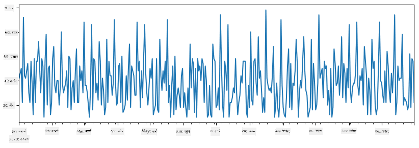
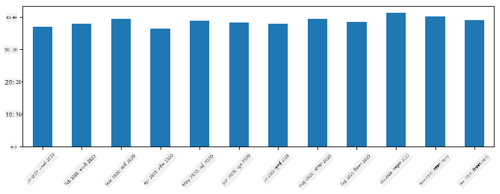
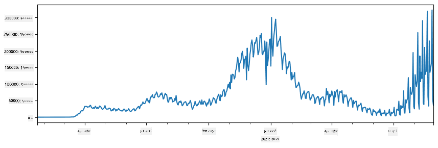
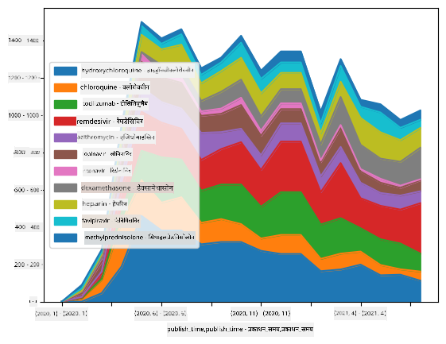

<!--
CO_OP_TRANSLATOR_METADATA:
{
  "original_hash": "116c5d361fbe812e59a73f37ce721d36",
  "translation_date": "2025-08-24T21:07:32+00:00",
  "source_file": "2-Working-With-Data/07-python/README.md",
  "language_code": "hi"
}
-->
# डेटा के साथ काम करना: Python और Pandas लाइब्रेरी

|  ](../../sketchnotes/07-WorkWithPython.png) |
| :-------------------------------------------------------------------------------------------------------: |
|                 Python के साथ काम करना - _Sketchnote by [@nitya](https://twitter.com/nitya)_                 |

[](https://youtu.be/dZjWOGbsN4Y)

हालांकि डेटाबेस डेटा को स्टोर करने और क्वेरी करने के लिए बहुत प्रभावी तरीके प्रदान करते हैं, डेटा प्रोसेसिंग का सबसे लचीला तरीका अपना प्रोग्राम लिखना है। कई मामलों में, डेटाबेस क्वेरी करना अधिक प्रभावी हो सकता है। लेकिन कुछ मामलों में, जब अधिक जटिल डेटा प्रोसेसिंग की आवश्यकता होती है, तो इसे SQL के माध्यम से आसानी से नहीं किया जा सकता।  
डेटा प्रोसेसिंग किसी भी प्रोग्रामिंग भाषा में की जा सकती है, लेकिन कुछ भाषाएँ डेटा के साथ काम करने के लिए उच्च स्तर की होती हैं। डेटा वैज्ञानिक आमतौर पर निम्नलिखित भाषाओं में से एक को प्राथमिकता देते हैं:

* **[Python](https://www.python.org/)**, एक सामान्य-उद्देश्य प्रोग्रामिंग भाषा, जिसे इसकी सरलता के कारण शुरुआती लोगों के लिए सबसे अच्छा विकल्प माना जाता है। Python में कई अतिरिक्त लाइब्रेरी हैं जो आपको व्यावहारिक समस्याओं को हल करने में मदद कर सकती हैं, जैसे ZIP आर्काइव से डेटा निकालना या तस्वीर को ग्रेस्केल में बदलना। डेटा साइंस के अलावा, Python का उपयोग अक्सर वेब विकास के लिए भी किया जाता है।  
* **[R](https://www.r-project.org/)** एक पारंपरिक टूलबॉक्स है जिसे सांख्यिकीय डेटा प्रोसेसिंग के लिए विकसित किया गया है। इसमें बड़ी संख्या में लाइब्रेरी (CRAN) हैं, जो इसे डेटा प्रोसेसिंग के लिए एक अच्छा विकल्प बनाती हैं। हालांकि, R एक सामान्य-उद्देश्य प्रोग्रामिंग भाषा नहीं है और इसे डेटा साइंस के क्षेत्र के बाहर शायद ही कभी उपयोग किया जाता है।  
* **[Julia](https://julialang.org/)** एक और भाषा है जो विशेष रूप से डेटा साइंस के लिए विकसित की गई है। इसे Python की तुलना में बेहतर प्रदर्शन देने के लिए डिज़ाइन किया गया है, जिससे यह वैज्ञानिक प्रयोगों के लिए एक बेहतरीन उपकरण बनती है।  

इस पाठ में, हम सरल डेटा प्रोसेसिंग के लिए Python का उपयोग करने पर ध्यान केंद्रित करेंगे। हम यह मानेंगे कि आपको इस भाषा की बुनियादी जानकारी है। यदि आप Python का गहराई से अध्ययन करना चाहते हैं, तो आप निम्नलिखित संसाधनों का उपयोग कर सकते हैं:

* [Learn Python in a Fun Way with Turtle Graphics and Fractals](https://github.com/shwars/pycourse) - Python प्रोग्रामिंग का एक GitHub-आधारित त्वरित परिचय पाठ्यक्रम  
* [Take your First Steps with Python](https://docs.microsoft.com/en-us/learn/paths/python-first-steps/?WT.mc_id=academic-77958-bethanycheum) - [Microsoft Learn](http://learn.microsoft.com/?WT.mc_id=academic-77958-bethanycheum) पर एक लर्निंग पाथ  

डेटा कई रूपों में आ सकता है। इस पाठ में, हम तीन प्रकार के डेटा पर विचार करेंगे - **तालिकीय डेटा**, **पाठ** और **छवियाँ**।  

हम आपको संबंधित सभी लाइब्रेरी का पूरा अवलोकन देने के बजाय डेटा प्रोसेसिंग के कुछ उदाहरणों पर ध्यान केंद्रित करेंगे। यह आपको यह समझने में मदद करेगा कि क्या संभव है और जब आपको आवश्यकता हो तो अपनी समस्याओं के समाधान कहां से खोजें।  

> **सबसे उपयोगी सलाह**: जब आपको डेटा पर कोई विशेष ऑपरेशन करना हो और आपको यह न पता हो कि इसे कैसे करना है, तो इसे इंटरनेट पर खोजने का प्रयास करें। [Stackoverflow](https://stackoverflow.com/) पर अक्सर Python में कई सामान्य कार्यों के लिए उपयोगी कोड नमूने मिलते हैं।  

## [पाठ से पहले का क्विज़](https://purple-hill-04aebfb03.1.azurestaticapps.net/quiz/12)

## तालिकीय डेटा और डेटा फ्रेम्स

आप पहले ही तालिकीय डेटा से परिचित हो चुके हैं जब हमने रिलेशनल डेटाबेस के बारे में बात की थी। जब आपके पास बहुत सारा डेटा होता है और यह कई अलग-अलग लिंक्ड टेबल्स में होता है, तो SQL का उपयोग करना निश्चित रूप से समझदारी है। हालांकि, कई बार ऐसा होता है जब हमारे पास डेटा की एक तालिका होती है और हमें इस डेटा के बारे में कुछ **समझ** या **अवलोकन** प्राप्त करने की आवश्यकता होती है, जैसे वितरण, मानों के बीच सहसंबंध आदि। डेटा साइंस में, कई बार हमें मूल डेटा में कुछ रूपांतरण करने की आवश्यकता होती है, जिसके बाद विज़ुअलाइज़ेशन किया जाता है। ये दोनों चरण Python का उपयोग करके आसानी से किए जा सकते हैं।  

Python में दो सबसे उपयोगी लाइब्रेरी हैं जो आपको तालिकीय डेटा के साथ काम करने में मदद कर सकती हैं:
* **[Pandas](https://pandas.pydata.org/)** आपको **डेटा फ्रेम्स** के साथ काम करने की अनुमति देता है, जो रिलेशनल टेबल्स के समान होते हैं। आप नामित कॉलम रख सकते हैं और पंक्तियों, कॉलमों और डेटा फ्रेम्स पर विभिन्न ऑपरेशन कर सकते हैं।  
* **[Numpy](https://numpy.org/)** **टेंसर्स**, यानी बहु-आयामी **एरेज़** के साथ काम करने के लिए एक लाइब्रेरी है। एरे में समान प्रकार के मान होते हैं और यह डेटा फ्रेम की तुलना में सरल होता है, लेकिन यह अधिक गणितीय ऑपरेशन प्रदान करता है और कम ओवरहेड बनाता है।  

इसके अलावा, कुछ अन्य लाइब्रेरी भी हैं जिनके बारे में आपको पता होना चाहिए:
* **[Matplotlib](https://matplotlib.org/)** डेटा विज़ुअलाइज़ेशन और ग्राफ़ प्लॉटिंग के लिए उपयोग की जाने वाली एक लाइब्रेरी है।  
* **[SciPy](https://www.scipy.org/)** कुछ अतिरिक्त वैज्ञानिक कार्यों वाली एक लाइब्रेरी है। हमने पहले ही इस लाइब्रेरी का उल्लेख संभावना और सांख्यिकी के संदर्भ में किया है।  

यहां एक कोड का टुकड़ा है जिसे आप आमतौर पर अपने Python प्रोग्राम की शुरुआत में इन लाइब्रेरी को आयात करने के लिए उपयोग करेंगे:
```python
import numpy as np
import pandas as pd
import matplotlib.pyplot as plt
from scipy import ... # you need to specify exact sub-packages that you need
```  

Pandas कुछ बुनियादी अवधारणाओं के इर्द-गिर्द केंद्रित है।  

### सीरीज़

**सीरीज़** मानों का एक अनुक्रम है, जो सूची या numpy एरे के समान है। मुख्य अंतर यह है कि सीरीज़ में एक **इंडेक्स** भी होता है, और जब हम सीरीज़ पर ऑपरेशन करते हैं (जैसे, उन्हें जोड़ते हैं), तो इंडेक्स को ध्यान में रखा जाता है। इंडेक्स उतना ही सरल हो सकता है जितना कि पूर्णांक पंक्ति संख्या (जब सूची या एरे से सीरीज़ बनाई जाती है तो यह डिफ़ॉल्ट रूप से उपयोग किया जाने वाला इंडेक्स है), या इसमें जटिल संरचना हो सकती है, जैसे कि दिनांक अंतराल।  

> **नोट**: [`notebook.ipynb`](../../../../2-Working-With-Data/07-python/notebook.ipynb) में Pandas का कुछ परिचयात्मक कोड है। हम यहां केवल कुछ उदाहरणों की रूपरेखा प्रस्तुत करते हैं, और आप निश्चित रूप से पूरे नोटबुक को देख सकते हैं।  

एक उदाहरण पर विचार करें: हम अपनी आइसक्रीम की बिक्री का विश्लेषण करना चाहते हैं। आइए कुछ समय अवधि के लिए बिक्री संख्या (प्रत्येक दिन बेची गई वस्तुओं की संख्या) की एक सीरीज़ उत्पन्न करें:  

```python
start_date = "Jan 1, 2020"
end_date = "Mar 31, 2020"
idx = pd.date_range(start_date,end_date)
print(f"Length of index is {len(idx)}")
items_sold = pd.Series(np.random.randint(25,50,size=len(idx)),index=idx)
items_sold.plot()
```  
  

अब मान लीजिए कि हर हफ्ते हम दोस्तों के लिए एक पार्टी आयोजित करते हैं और पार्टी के लिए 10 अतिरिक्त आइसक्रीम पैक लेते हैं। हम इसे दिखाने के लिए एक और सीरीज़ बना सकते हैं, जो सप्ताह के अनुसार इंडेक्स की गई हो:  
```python
additional_items = pd.Series(10,index=pd.date_range(start_date,end_date,freq="W"))
```  
जब हम दो सीरीज़ को जोड़ते हैं, तो हमें कुल संख्या मिलती है:  
```python
total_items = items_sold.add(additional_items,fill_value=0)
total_items.plot()
```  
  

> **नोट** कि हम साधारण सिंटैक्स `total_items+additional_items` का उपयोग नहीं कर रहे हैं। यदि हम ऐसा करते, तो हमें परिणामी सीरीज़ में कई `NaN` (*Not a Number*) मान मिलते। ऐसा इसलिए है क्योंकि `additional_items` सीरीज़ में कुछ इंडेक्स पॉइंट्स के लिए मान गायब हैं, और `NaN` को किसी भी चीज़ में जोड़ने से `NaN` मिलता है। इसलिए हमें जोड़ने के दौरान `fill_value` पैरामीटर निर्दिष्ट करने की आवश्यकता होती है।  

टाइम सीरीज़ के साथ, हम विभिन्न समय अंतरालों के साथ सीरीज़ को **पुनः नमूना** भी कर सकते हैं। उदाहरण के लिए, मान लीजिए कि हम मासिक औसत बिक्री मात्रा की गणना करना चाहते हैं। हम निम्नलिखित कोड का उपयोग कर सकते हैं:  
```python
monthly = total_items.resample("1M").mean()
ax = monthly.plot(kind='bar')
```  
  

### डेटा फ्रेम

डेटा फ्रेम मूल रूप से समान इंडेक्स वाली कई सीरीज़ का संग्रह है। हम कई सीरीज़ को एक साथ डेटा फ्रेम में जोड़ सकते हैं:  
```python
a = pd.Series(range(1,10))
b = pd.Series(["I","like","to","play","games","and","will","not","change"],index=range(0,9))
df = pd.DataFrame([a,b])
```  
यह इस तरह की एक क्षैतिज तालिका बनाएगा:  
|     | 0   | 1    | 2   | 3   | 4      | 5   | 6      | 7    | 8    |
| --- | --- | ---- | --- | --- | ------ | --- | ------ | ---- | ---- |
| 0   | 1   | 2    | 3   | 4   | 5      | 6   | 7      | 8    | 9    |
| 1   | I   | like | to  | use | Python | and | Pandas | very | much |

हम सीरीज़ को कॉलम के रूप में भी उपयोग कर सकते हैं और डिक्शनरी का उपयोग करके कॉलम नाम निर्दिष्ट कर सकते हैं:  
```python
df = pd.DataFrame({ 'A' : a, 'B' : b })
```  
यह हमें इस तरह की एक तालिका देगा:  

|     | A   | B      |
| --- | --- | ------ |
| 0   | 1   | I      |
| 1   | 2   | like   |
| 2   | 3   | to     |
| 3   | 4   | use    |
| 4   | 5   | Python |
| 5   | 6   | and    |
| 6   | 7   | Pandas |
| 7   | 8   | very   |
| 8   | 9   | much   |

**नोट** कि हम पिछले तालिका को ट्रांसपोज़ करके भी इस लेआउट को प्राप्त कर सकते हैं, जैसे कि  
```python
df = pd.DataFrame([a,b]).T..rename(columns={ 0 : 'A', 1 : 'B' })
```  
यहां `.T` डेटा फ्रेम को ट्रांसपोज़ करने का ऑपरेशन है, यानी पंक्तियों और कॉलमों को बदलना, और `rename` ऑपरेशन हमें कॉलमों का नाम बदलने की अनुमति देता है ताकि यह पिछले उदाहरण से मेल खाए।  

डेटा फ्रेम्स पर हम जो सबसे महत्वपूर्ण ऑपरेशन कर सकते हैं, वे हैं:  

**कॉलम चयन**। हम `df['A']` लिखकर व्यक्तिगत कॉलम का चयन कर सकते हैं - यह ऑपरेशन एक सीरीज़ लौटाता है। हम `df[['B','A']]` लिखकर कॉलमों के एक उपसमुच्चय को दूसरे डेटा फ्रेम में भी चुन सकते हैं - यह एक और डेटा फ्रेम लौटाता है।  

**केवल कुछ पंक्तियों को फ़िल्टर करना**। उदाहरण के लिए, केवल उन पंक्तियों को छोड़ने के लिए जिनमें कॉलम `A` का मान 5 से अधिक है, हम लिख सकते हैं `df[df['A']>5]`।  

> **नोट**: फ़िल्टरिंग इस प्रकार काम करता है। अभिव्यक्ति `df['A']<5` एक बूलियन सीरीज़ लौटाती है, जो यह इंगित करती है कि मूल सीरीज़ `df['A']` के प्रत्येक तत्व के लिए अभिव्यक्ति `True` या `False` है। जब बूलियन सीरीज़ को इंडेक्स के रूप में उपयोग किया जाता है, तो यह डेटा फ्रेम में पंक्तियों के उपसमुच्चय को लौटाता है। इसलिए, किसी भी सामान्य Python बूलियन अभिव्यक्ति का उपयोग करना संभव नहीं है, उदाहरण के लिए, `df[df['A']>5 and df['A']<7]` लिखना गलत होगा। इसके बजाय, आपको बूलियन सीरीज़ पर विशेष `&` ऑपरेशन का उपयोग करना चाहिए, जैसे `df[(df['A']>5) & (df['A']<7)]` (*ब्रैकेट्स यहां महत्वपूर्ण हैं*)।  

**नए गणनीय कॉलम बनाना**। हम अपने डेटा फ्रेम के लिए आसानी से नए गणनीय कॉलम बना सकते हैं, जैसे:  
```python
df['DivA'] = df['A']-df['A'].mean() 
```  
यह उदाहरण `A` के औसत मान से उसके विचलन की गणना करता है। यहां वास्तव में होता यह है कि हम एक सीरीज़ की गणना कर रहे हैं और फिर इस सीरीज़ को बाईं ओर असाइन कर रहे हैं, जिससे एक और कॉलम बनता है। इसलिए, हम किसी भी ऐसे ऑपरेशन का उपयोग नहीं कर सकते जो सीरीज़ के साथ संगत न हो, उदाहरण के लिए, नीचे दिया गया कोड गलत है:  
```python
# Wrong code -> df['ADescr'] = "Low" if df['A'] < 5 else "Hi"
df['LenB'] = len(df['B']) # <- Wrong result
```  
हालांकि यह उदाहरण सिंटैक्टिक रूप से सही है, यह हमें गलत परिणाम देता है, क्योंकि यह कॉलम में सभी मानों को सीरीज़ `B` की लंबाई असाइन करता है, न कि व्यक्तिगत तत्वों की लंबाई जैसा कि हमने इरादा किया था।  

यदि हमें इस तरह के जटिल अभिव्यक्तियों की गणना करने की आवश्यकता है, तो हम `apply` फ़ंक्शन का उपयोग कर सकते हैं। अंतिम उदाहरण को इस प्रकार लिखा जा सकता है:  
```python
df['LenB'] = df['B'].apply(lambda x : len(x))
# or 
df['LenB'] = df['B'].apply(len)
```  

उपरोक्त ऑपरेशनों के बाद, हमारे पास निम्नलिखित डेटा फ्रेम होगा:  

|     | A   | B      | DivA | LenB |
| --- | --- | ------ | ---- | ---- |
| 0   | 1   | I      | -4.0 | 1    |
| 1   | 2   | like   | -3.0 | 4    |
| 2   | 3   | to     | -2.0 | 2    |
| 3   | 4   | use    | -1.0 | 3    |
| 4   | 5   | Python | 0.0  | 6    |
| 5   | 6   | and    | 1.0  | 3    |
| 6   | 7   | Pandas | 2.0  | 6    |
| 7   | 8   | very   | 3.0  | 4    |
| 8   | 9   | much   | 4.0  | 4    |

**संख्या के आधार पर पंक्तियों का चयन** `iloc` का उपयोग करके किया जा सकता है। उदाहरण के लिए, डेटा फ्रेम से पहली 5 पंक्तियों का चयन करने के लिए:  
```python
df.iloc[:5]
```  

**ग्रुपिंग** का उपयोग अक्सर *पिवट टेबल्स* जैसे परिणाम प्राप्त करने के लिए किया जाता है। मान लीजिए कि हम `LenB` के प्रत्येक दिए गए मान के लिए कॉलम `A` का औसत मान गणना करना चाहते हैं। फिर हम अपने डेटा फ्रेम को `LenB` द्वारा ग्रुप कर सकते हैं और `mean` को कॉल कर सकते हैं:  
```python
df.groupby(by='LenB').mean()
```  
यदि हमें समूह में औसत और तत्वों की संख्या दोनों की गणना करनी है, तो हम अधिक जटिल `aggregate` फ़ंक्शन का उपयोग कर सकते हैं:  
```python
df.groupby(by='LenB') \
 .aggregate({ 'DivA' : len, 'A' : lambda x: x.mean() }) \
 .rename(columns={ 'DivA' : 'Count', 'A' : 'Mean'})
```  
यह हमें निम्नलिखित तालिका देता है:  

| LenB | Count | Mean     |
| ---- | ----- | -------- |
| 1    | 1     | 1.000000 |
| 2    | 1     | 3.000000 |
| 3    | 2     | 5.000000 |
| 4    | 3     | 6.333333 |
| 6    | 2     | 6.000000 |

### डेटा प्राप्त करना  
हमने देखा कि Python ऑब्जेक्ट्स से Series और DataFrames बनाना कितना आसान है। हालांकि, डेटा आमतौर पर टेक्स्ट फाइल या Excel टेबल के रूप में आता है। सौभाग्य से, Pandas हमें डिस्क से डेटा लोड करने का एक सरल तरीका प्रदान करता है। उदाहरण के लिए, CSV फाइल पढ़ना इतना आसान है:
```python
df = pd.read_csv('file.csv')
```
हम "चैलेंज" सेक्शन में डेटा लोड करने के और भी उदाहरण देखेंगे, जिसमें इसे बाहरी वेबसाइट्स से प्राप्त करना भी शामिल है।  

### प्रिंटिंग और प्लॉटिंग

एक डेटा साइंटिस्ट को अक्सर डेटा का विश्लेषण करना पड़ता है, इसलिए इसे विज़ुअलाइज़ करने में सक्षम होना महत्वपूर्ण है। जब DataFrame बड़ा होता है, तो कई बार हम केवल यह सुनिश्चित करना चाहते हैं कि हम सब कुछ सही कर रहे हैं, इसके लिए पहले कुछ पंक्तियों को प्रिंट करना उपयोगी होता है। यह `df.head()` कॉल करके किया जा सकता है। यदि आप इसे Jupyter Notebook से चला रहे हैं, तो यह DataFrame को एक सुंदर टेबल के रूप में प्रिंट करेगा।  

हमने `plot` फ़ंक्शन का उपयोग करके कुछ कॉलम को विज़ुअलाइज़ करने का तरीका भी देखा है। जबकि `plot` कई कार्यों के लिए बहुत उपयोगी है और `kind=` पैरामीटर के माध्यम से कई अलग-अलग ग्राफ़ प्रकारों का समर्थन करता है, आप हमेशा कुछ अधिक जटिल प्लॉट करने के लिए कच्चे `matplotlib` लाइब्रेरी का उपयोग कर सकते हैं। हम डेटा विज़ुअलाइज़ेशन को अलग पाठ में विस्तार से कवर करेंगे।  

यह अवलोकन Pandas के सबसे महत्वपूर्ण अवधारणाओं को कवर करता है, हालांकि, यह लाइब्रेरी बहुत समृद्ध है, और आप इसके साथ क्या कर सकते हैं इसकी कोई सीमा नहीं है! अब चलिए इस ज्ञान का उपयोग करके एक विशिष्ट समस्या को हल करते हैं।  

## 🚀 चैलेंज 1: COVID के प्रसार का विश्लेषण

पहली समस्या जिस पर हम ध्यान केंद्रित करेंगे, वह है COVID-19 के महामारी प्रसार का मॉडलिंग। ऐसा करने के लिए, हम विभिन्न देशों में संक्रमित व्यक्तियों की संख्या पर डेटा का उपयोग करेंगे, जो [Center for Systems Science and Engineering](https://systems.jhu.edu/) (CSSE) द्वारा [Johns Hopkins University](https://jhu.edu/) में प्रदान किया गया है। यह डेटा [इस GitHub Repository](https://github.com/CSSEGISandData/COVID-19) में उपलब्ध है।  

चूंकि हम यह प्रदर्शित करना चाहते हैं कि डेटा के साथ कैसे काम किया जाए, हम आपको [`notebook-covidspread.ipynb`](../../../../2-Working-With-Data/07-python/notebook-covidspread.ipynb) खोलने और इसे ऊपर से नीचे तक पढ़ने के लिए आमंत्रित करते हैं। आप सेल्स को निष्पादित कर सकते हैं और अंत में छोड़ी गई कुछ चुनौतियों को हल कर सकते हैं।  



> यदि आप नहीं जानते कि Jupyter Notebook में कोड कैसे चलाना है, तो [इस लेख](https://soshnikov.com/education/how-to-execute-notebooks-from-github/) को देखें।  

## असंरचित डेटा के साथ काम करना

हालांकि डेटा अक्सर टेबलर फॉर्म में आता है, कुछ मामलों में हमें कम संरचित डेटा, जैसे टेक्स्ट या इमेज के साथ काम करना पड़ता है। इस स्थिति में, ऊपर देखी गई डेटा प्रोसेसिंग तकनीकों को लागू करने के लिए, हमें किसी तरह से संरचित डेटा **निकालना** होगा। यहां कुछ उदाहरण दिए गए हैं:  

* टेक्स्ट से कीवर्ड निकालना और यह देखना कि वे कितनी बार प्रकट होते हैं  
* तस्वीर में वस्तुओं के बारे में जानकारी निकालने के लिए न्यूरल नेटवर्क का उपयोग करना  
* वीडियो कैमरा फीड पर लोगों की भावनाओं की जानकारी प्राप्त करना  

## 🚀 चैलेंज 2: COVID पेपर्स का विश्लेषण

इस चुनौती में, हम COVID महामारी के विषय को जारी रखेंगे और इस पर वैज्ञानिक पेपर्स को प्रोसेस करने पर ध्यान केंद्रित करेंगे। [CORD-19 Dataset](https://www.kaggle.com/allen-institute-for-ai/CORD-19-research-challenge) में COVID पर 7000 से अधिक (लेखन के समय) पेपर्स उपलब्ध हैं, जिनमें मेटाडेटा और सारांश शामिल हैं (और लगभग आधे के लिए पूर्ण पाठ भी उपलब्ध है)।  

इस डेटासेट का विश्लेषण करने का एक पूरा उदाहरण [Text Analytics for Health](https://docs.microsoft.com/azure/cognitive-services/text-analytics/how-tos/text-analytics-for-health/?WT.mc_id=academic-77958-bethanycheum) कॉग्निटिव सर्विस का उपयोग करके [इस ब्लॉग पोस्ट](https://soshnikov.com/science/analyzing-medical-papers-with-azure-and-text-analytics-for-health/) में वर्णित है। हम इस विश्लेषण के सरलीकृत संस्करण पर चर्चा करेंगे।  

> **NOTE**: हम इस रिपॉजिटरी के हिस्से के रूप में डेटासेट की एक प्रति प्रदान नहीं करते हैं। आपको पहले [इस डेटासेट](https://www.kaggle.com/allen-institute-for-ai/CORD-19-research-challenge?select=metadata.csv) से [`metadata.csv`](https://www.kaggle.com/allen-institute-for-ai/CORD-19-research-challenge?select=metadata.csv) फाइल डाउनलोड करने की आवश्यकता हो सकती है। इसके लिए Kaggle पर पंजीकरण आवश्यक हो सकता है। आप बिना पंजीकरण के [यहां से](https://ai2-semanticscholar-cord-19.s3-us-west-2.amazonaws.com/historical_releases.html) भी डेटासेट डाउनलोड कर सकते हैं, लेकिन इसमें मेटाडेटा फाइल के अलावा सभी पूर्ण पाठ शामिल होंगे।  

[`notebook-papers.ipynb`](../../../../2-Working-With-Data/07-python/notebook-papers.ipynb) खोलें और इसे ऊपर से नीचे तक पढ़ें। आप सेल्स को निष्पादित कर सकते हैं और अंत में छोड़ी गई कुछ चुनौतियों को हल कर सकते हैं।  



## इमेज डेटा प्रोसेसिंग

हाल ही में, बहुत शक्तिशाली AI मॉडल विकसित किए गए हैं जो हमें इमेज को समझने की अनुमति देते हैं। कई कार्य हैं जिन्हें प्री-ट्रेंड न्यूरल नेटवर्क या क्लाउड सेवाओं का उपयोग करके हल किया जा सकता है। कुछ उदाहरण शामिल हैं:  

* **इमेज क्लासिफिकेशन**, जो आपको इमेज को पूर्व-परिभाषित श्रेणियों में वर्गीकृत करने में मदद कर सकता है। आप [Custom Vision](https://azure.microsoft.com/services/cognitive-services/custom-vision-service/?WT.mc_id=academic-77958-bethanycheum) जैसी सेवाओं का उपयोग करके आसानी से अपने स्वयं के इमेज क्लासिफायर प्रशिक्षित कर सकते हैं।  
* **ऑब्जेक्ट डिटेक्शन** इमेज में विभिन्न वस्तुओं का पता लगाने के लिए। [Computer Vision](https://azure.microsoft.com/services/cognitive-services/computer-vision/?WT.mc_id=academic-77958-bethanycheum) जैसी सेवाएं कई सामान्य वस्तुओं का पता लगा सकती हैं, और आप [Custom Vision](https://azure.microsoft.com/services/cognitive-services/custom-vision-service/?WT.mc_id=academic-77958-bethanycheum) मॉडल को कुछ विशिष्ट वस्तुओं का पता लगाने के लिए प्रशिक्षित कर सकते हैं।  
* **फेस डिटेक्शन**, जिसमें आयु, लिंग और भावना का पता लगाना शामिल है। यह [Face API](https://azure.microsoft.com/services/cognitive-services/face/?WT.mc_id=academic-77958-bethanycheum) के माध्यम से किया जा सकता है।  

इन सभी क्लाउड सेवाओं को [Python SDKs](https://docs.microsoft.com/samples/azure-samples/cognitive-services-python-sdk-samples/cognitive-services-python-sdk-samples/?WT.mc_id=academic-77958-bethanycheum) का उपयोग करके कॉल किया जा सकता है, और इस प्रकार इन्हें आसानी से आपके डेटा एक्सप्लोरेशन वर्कफ़्लो में शामिल किया जा सकता है।  

यहां इमेज डेटा स्रोतों से डेटा का पता लगाने के कुछ उदाहरण दिए गए हैं:  
* ब्लॉग पोस्ट [How to Learn Data Science without Coding](https://soshnikov.com/azure/how-to-learn-data-science-without-coding/) में, हम Instagram फ़ोटो का विश्लेषण करते हैं, यह समझने की कोशिश करते हैं कि कौन सी चीज़ें लोगों को किसी फ़ोटो को अधिक लाइक करने के लिए प्रेरित करती हैं। हम पहले [Computer Vision](https://azure.microsoft.com/services/cognitive-services/computer-vision/?WT.mc_id=academic-77958-bethanycheum) का उपयोग करके तस्वीरों से अधिकतम जानकारी निकालते हैं, और फिर [Azure Machine Learning AutoML](https://docs.microsoft.com/azure/machine-learning/concept-automated-ml/?WT.mc_id=academic-77958-bethanycheum) का उपयोग करके एक व्याख्यात्मक मॉडल बनाते हैं।  
* [Facial Studies Workshop](https://github.com/CloudAdvocacy/FaceStudies) में, हम [Face API](https://azure.microsoft.com/services/cognitive-services/face/?WT.mc_id=academic-77958-bethanycheum) का उपयोग करके इवेंट्स की तस्वीरों में लोगों की भावनाओं को निकालते हैं, यह समझने की कोशिश करते हैं कि कौन सी चीज़ें लोगों को खुश करती हैं।  

## निष्कर्ष

चाहे आपके पास पहले से संरचित डेटा हो या असंरचित डेटा, Python का उपयोग करके आप डेटा प्रोसेसिंग और समझ से संबंधित सभी चरणों को कर सकते हैं। यह डेटा प्रोसेसिंग का शायद सबसे लचीला तरीका है, और यही कारण है कि अधिकांश डेटा वैज्ञानिक Python को अपने प्राथमिक उपकरण के रूप में उपयोग करते हैं। यदि आप अपने डेटा साइंस के सफर को गंभीरता से लेना चाहते हैं, तो Python को गहराई से सीखना एक अच्छा विचार हो सकता है।  

## [पोस्ट-लेक्चर क्विज़](https://purple-hill-04aebfb03.1.azurestaticapps.net/quiz/13)

## समीक्षा और स्व-अध्ययन

**पुस्तकें**  
* [Wes McKinney. Python for Data Analysis: Data Wrangling with Pandas, NumPy, and IPython](https://www.amazon.com/gp/product/1491957662)  

**ऑनलाइन संसाधन**  
* आधिकारिक [10 मिनट में Pandas](https://pandas.pydata.org/pandas-docs/stable/user_guide/10min.html) ट्यूटोरियल  
* [Pandas विज़ुअलाइज़ेशन पर दस्तावेज़ीकरण](https://pandas.pydata.org/pandas-docs/stable/user_guide/visualization.html)  

**Python सीखना**  
* [Turtle Graphics और Fractals के साथ Python को मज़ेदार तरीके से सीखें](https://github.com/shwars/pycourse)  
* [Python के साथ अपने पहले कदम उठाएं](https://docs.microsoft.com/learn/paths/python-first-steps/?WT.mc_id=academic-77958-bethanycheum) [Microsoft Learn](http://learn.microsoft.com/?WT.mc_id=academic-77958-bethanycheum) पर लर्निंग पाथ  

## असाइनमेंट

[ऊपर दी गई चुनौतियों के लिए अधिक विस्तृत डेटा अध्ययन करें](assignment.md)  

## क्रेडिट्स

यह पाठ [Dmitry Soshnikov](http://soshnikov.com) द्वारा ♥️ के साथ लिखा गया है।  

**अस्वीकरण**:  
यह दस्तावेज़ AI अनुवाद सेवा [Co-op Translator](https://github.com/Azure/co-op-translator) का उपयोग करके अनुवादित किया गया है। जबकि हम सटीकता के लिए प्रयासरत हैं, कृपया ध्यान दें कि स्वचालित अनुवाद में त्रुटियां या अशुद्धियां हो सकती हैं। मूल भाषा में उपलब्ध मूल दस्तावेज़ को प्रामाणिक स्रोत माना जाना चाहिए। महत्वपूर्ण जानकारी के लिए, पेशेवर मानव अनुवाद की सिफारिश की जाती है। इस अनुवाद के उपयोग से उत्पन्न किसी भी गलतफहमी या गलत व्याख्या के लिए हम उत्तरदायी नहीं हैं।