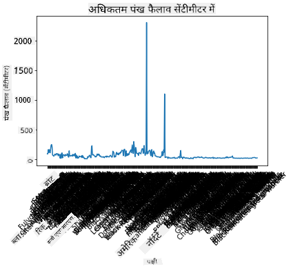
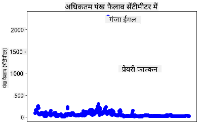
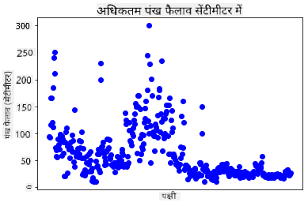
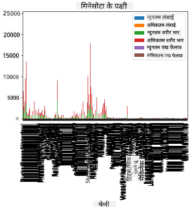
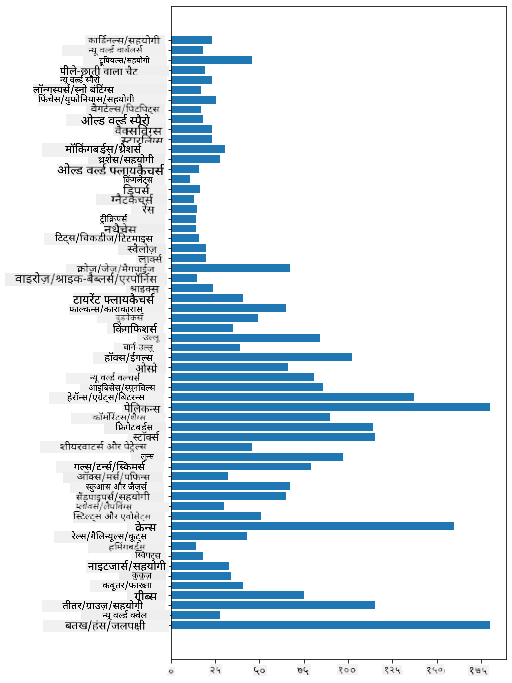
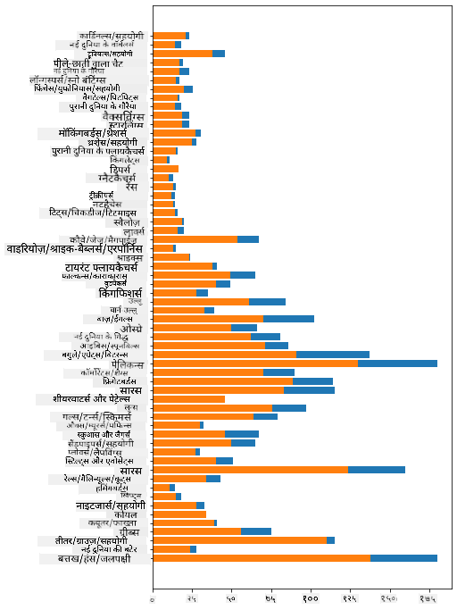

<!--
CO_OP_TRANSLATOR_METADATA:
{
  "original_hash": "43c402d9d90ae6da55d004519ada5033",
  "translation_date": "2025-08-24T23:03:03+00:00",
  "source_file": "3-Data-Visualization/09-visualization-quantities/README.md",
  "language_code": "hi"
}
-->
# मात्राओं का विज़ुअलाइज़ेशन

| द्वारा ](../../sketchnotes/09-Visualizing-Quantities.png)|
|:---:|
| मात्राओं का विज़ुअलाइज़ेशन - _[@nitya](https://twitter.com/nitya) द्वारा स्केच नोट_ |

इस पाठ में आप यह जानेंगे कि कैसे उपलब्ध कई Python लाइब्रेरीज़ में से एक का उपयोग करके मात्रा की अवधारणा के चारों ओर दिलचस्प विज़ुअलाइज़ेशन बनाना सीखा जा सकता है। मिनेसोटा के पक्षियों के बारे में एक साफ किए गए डेटा सेट का उपयोग करके, आप स्थानीय वन्यजीवों के बारे में कई दिलचस्प तथ्य जान सकते हैं।  
## [पाठ-पूर्व क्विज़](https://purple-hill-04aebfb03.1.azurestaticapps.net/quiz/16)

## Matplotlib के साथ पंखों की चौड़ाई का निरीक्षण करें

सरल और जटिल दोनों प्रकार के प्लॉट और चार्ट बनाने के लिए एक उत्कृष्ट लाइब्रेरी [Matplotlib](https://matplotlib.org/stable/index.html) है। सामान्य रूप से, इन लाइब्रेरीज़ का उपयोग करके डेटा को प्लॉट करने की प्रक्रिया में आपके डेटा फ्रेम के उन हिस्सों की पहचान करना शामिल है जिन्हें आप लक्षित करना चाहते हैं, उस डेटा पर आवश्यक कोई भी परिवर्तन करना, इसके x और y अक्ष मान असाइन करना, दिखाने के लिए किस प्रकार का प्लॉट चुनना है, और फिर प्लॉट दिखाना। Matplotlib कई प्रकार के विज़ुअलाइज़ेशन प्रदान करता है, लेकिन इस पाठ के लिए, आइए उन विज़ुअलाइज़ेशन पर ध्यान केंद्रित करें जो मात्रा को विज़ुअलाइज़ करने के लिए सबसे उपयुक्त हैं: लाइन चार्ट, स्कैटरप्लॉट्स, और बार प्लॉट्स।

> ✅ अपने डेटा की संरचना और आप जो कहानी बताना चाहते हैं, उसके लिए सबसे अच्छा चार्ट चुनें।  
> - समय के साथ रुझानों का विश्लेषण करने के लिए: लाइन  
> - मानों की तुलना करने के लिए: बार, कॉलम, पाई, स्कैटरप्लॉट  
> - यह दिखाने के लिए कि भाग पूरे से कैसे संबंधित हैं: पाई  
> - डेटा के वितरण को दिखाने के लिए: स्कैटरप्लॉट, बार  
> - रुझानों को दिखाने के लिए: लाइन, कॉलम  
> - मानों के बीच संबंध दिखाने के लिए: लाइन, स्कैटरप्लॉट, बबल  

यदि आपके पास एक डेटा सेट है और आपको यह पता लगाना है कि किसी दिए गए आइटम की कितनी मात्रा शामिल है, तो आपके पास सबसे पहला कार्य इसके मानों का निरीक्षण करना होगा।  

✅ Matplotlib के लिए बहुत अच्छे 'चीट शीट्स' [यहां](https://matplotlib.org/cheatsheets/cheatsheets.pdf) उपलब्ध हैं।

## पक्षियों की पंखों की अधिकतम चौड़ाई पर एक लाइन प्लॉट बनाएं

इस पाठ फ़ोल्डर की जड़ में `notebook.ipynb` फ़ाइल खोलें और एक सेल जोड़ें।  

> नोट: डेटा इस रिपॉजिटरी की जड़ में `/data` फ़ोल्डर में संग्रहीत है।  

```python
import pandas as pd
import matplotlib.pyplot as plt
birds = pd.read_csv('../../data/birds.csv')
birds.head()
```  
यह डेटा टेक्स्ट और नंबरों का मिश्रण है:

|      | नाम                          | वैज्ञानिक नाम          | श्रेणी                | क्रम         | परिवार   | वंश         | संरक्षण स्थिति      | न्यूनतम लंबाई | अधिकतम लंबाई | न्यूनतम शरीर भार | अधिकतम शरीर भार | न्यूनतम पंख चौड़ाई | अधिकतम पंख चौड़ाई |
| ---: | :--------------------------- | :--------------------- | :-------------------- | :----------- | :------- | :---------- | :----------------- | --------: | --------: | ----------: | ----------: | ----------: | ----------: |
|    0 | ब्लैक-बेलिड व्हिसलिंग-डक     | Dendrocygna autumnalis | बत्तख/हंस/जलपक्षी     | Anseriformes | Anatidae | Dendrocygna | LC                 |        47 |        56 |         652 |        1020 |          76 |          94 |
|    1 | फुल्वस व्हिसलिंग-डक          | Dendrocygna bicolor    | बत्तख/हंस/जलपक्षी     | Anseriformes | Anatidae | Dendrocygna | LC                 |        45 |        53 |         712 |        1050 |          85 |          93 |
|    2 | स्नो गूज़                     | Anser caerulescens     | बत्तख/हंस/जलपक्षी     | Anseriformes | Anatidae | Anser       | LC                 |        64 |        79 |        2050 |        4050 |         135 |         165 |
|    3 | रॉस का गूज़                  | Anser rossii           | बत्तख/हंस/जलपक्षी     | Anseriformes | Anatidae | Anser       | LC                 |      57.3 |        64 |        1066 |        1567 |         113 |         116 |
|    4 | ग्रेटर व्हाइट-फ्रंटेड गूज़   | Anser albifrons        | बत्तख/हंस/जलपक्षी     | Anseriformes | Anatidae | Anser       | LC                 |        64 |        81 |        1930 |        3310 |         130 |         165 |

आइए कुछ संख्यात्मक डेटा को एक बुनियादी लाइन प्लॉट का उपयोग करके प्लॉट करें। मान लीजिए कि आप इन दिलचस्प पक्षियों के लिए अधिकतम पंख चौड़ाई का दृश्य चाहते हैं।  

```python
wingspan = birds['MaxWingspan'] 
wingspan.plot()
```  


आप तुरंत क्या नोटिस करते हैं? ऐसा लगता है कि कम से कम एक आउटलायर है - यह पंखों की चौड़ाई काफी बड़ी है! 2300 सेंटीमीटर पंख चौड़ाई 23 मीटर के बराबर है - क्या मिनेसोटा में पेटरोडैक्टाइल घूम रहे हैं? आइए जांच करें।  

हालांकि आप Excel में एक त्वरित सॉर्ट कर सकते हैं ताकि उन आउटलायरों को ढूंढा जा सके, जो शायद टाइपो हैं, प्लॉट के भीतर से विज़ुअलाइज़ेशन प्रक्रिया जारी रखें।  

x-अक्ष पर लेबल जोड़ें ताकि यह दिखाया जा सके कि किस प्रकार के पक्षी प्रश्न में हैं:  

```
plt.title('Max Wingspan in Centimeters')
plt.ylabel('Wingspan (CM)')
plt.xlabel('Birds')
plt.xticks(rotation=45)
x = birds['Name'] 
y = birds['MaxWingspan']

plt.plot(x, y)

plt.show()
```  


लेबल्स को 45 डिग्री पर घुमाने के बावजूद, उन्हें पढ़ने के लिए बहुत अधिक हैं। आइए एक अलग रणनीति आजमाएं: केवल उन आउटलायरों को लेबल करें और चार्ट के भीतर लेबल सेट करें। आप लेबलिंग के लिए अधिक जगह बनाने के लिए एक स्कैटर चार्ट का उपयोग कर सकते हैं:  

```python
plt.title('Max Wingspan in Centimeters')
plt.ylabel('Wingspan (CM)')
plt.tick_params(axis='both',which='both',labelbottom=False,bottom=False)

for i in range(len(birds)):
    x = birds['Name'][i]
    y = birds['MaxWingspan'][i]
    plt.plot(x, y, 'bo')
    if birds['MaxWingspan'][i] > 500:
        plt.text(x, y * (1 - 0.05), birds['Name'][i], fontsize=12)
    
plt.show()
```  
यहां क्या हो रहा है? आपने `tick_params` का उपयोग करके नीचे के लेबल्स को छिपा दिया और फिर अपने पक्षियों के डेटा सेट पर एक लूप बनाया। छोटे गोल नीले बिंदुओं का उपयोग करके चार्ट को प्लॉट करते हुए (`bo`), आपने किसी भी पक्षी की जांच की जिसकी अधिकतम पंख चौड़ाई 500 से अधिक थी और यदि ऐसा हो तो बिंदु के बगल में उनका लेबल प्रदर्शित किया। आपने y अक्ष पर लेबल्स को थोड़ा ऑफसेट किया (`y * (1 - 0.05)`) और पक्षी का नाम लेबल के रूप में उपयोग किया।  

आपने क्या खोजा?  

  
## अपने डेटा को फ़िल्टर करें  

बाल्ड ईगल और प्रेयरी फाल्कन, हालांकि शायद बहुत बड़े पक्षी हैं, गलत लेबल किए गए प्रतीत होते हैं, उनकी अधिकतम पंख चौड़ाई में एक अतिरिक्त `0` जोड़ा गया है। यह संभावना नहीं है कि आप 25 मीटर पंख चौड़ाई वाले बाल्ड ईगल से मिलेंगे, लेकिन अगर ऐसा हो, तो कृपया हमें बताएं! आइए इन दो आउटलायरों के बिना एक नया डेटा फ्रेम बनाएं:  

```python
plt.title('Max Wingspan in Centimeters')
plt.ylabel('Wingspan (CM)')
plt.xlabel('Birds')
plt.tick_params(axis='both',which='both',labelbottom=False,bottom=False)
for i in range(len(birds)):
    x = birds['Name'][i]
    y = birds['MaxWingspan'][i]
    if birds['Name'][i] not in ['Bald eagle', 'Prairie falcon']:
        plt.plot(x, y, 'bo')
plt.show()
```  

आउटलायरों को फ़िल्टर करके, आपका डेटा अब अधिक सुसंगत और समझने योग्य है।  

  

अब जब हमारे पास कम से कम पंख चौड़ाई के मामले में एक साफ डेटा सेट है, तो आइए इन पक्षियों के बारे में और अधिक खोज करें।  

हालांकि लाइन और स्कैटर प्लॉट डेटा मानों और उनके वितरण के बारे में जानकारी प्रदर्शित कर सकते हैं, हम इस डेटा सेट में अंतर्निहित मानों के बारे में सोचना चाहते हैं। आप मात्रा के बारे में निम्नलिखित प्रश्नों का उत्तर देने के लिए विज़ुअलाइज़ेशन बना सकते हैं:  

> पक्षियों की कितनी श्रेणियां हैं, और उनकी संख्या क्या है?  
> कितने पक्षी विलुप्त, संकटग्रस्त, दुर्लभ, या सामान्य हैं?  
> लिनियस की शब्दावली में विभिन्न वंश और क्रम के कितने हैं?  
## बार चार्ट्स का अन्वेषण करें  

जब आपको डेटा के समूहों को दिखाने की आवश्यकता होती है, तो बार चार्ट व्यावहारिक होते हैं। आइए इस डेटा सेट में मौजूद पक्षियों की श्रेणियों का अन्वेषण करें ताकि यह देखा जा सके कि संख्या के हिसाब से कौन सा सबसे सामान्य है।  

नोटबुक फ़ाइल में, एक बुनियादी बार चार्ट बनाएं।  

✅ ध्यान दें, आप या तो पिछले अनुभाग में पहचाने गए दो आउटलायर पक्षियों को फ़िल्टर कर सकते हैं, उनकी पंख चौड़ाई में टाइपो को संपादित कर सकते हैं, या उन्हें इन अभ्यासों के लिए छोड़ सकते हैं जो पंख चौड़ाई मानों पर निर्भर नहीं करते।  

यदि आप एक बार चार्ट बनाना चाहते हैं, तो आप उस डेटा का चयन कर सकते हैं जिस पर आप ध्यान केंद्रित करना चाहते हैं। बार चार्ट कच्चे डेटा से बनाए जा सकते हैं:  

```python
birds.plot(x='Category',
        kind='bar',
        stacked=True,
        title='Birds of Minnesota')

```  
  

हालांकि, यह बार चार्ट पढ़ने योग्य नहीं है क्योंकि इसमें बहुत अधिक गैर-समूहित डेटा है। आपको केवल उस डेटा का चयन करना होगा जिसे आप प्लॉट करना चाहते हैं, तो आइए पक्षियों की श्रेणी के आधार पर उनकी लंबाई देखें।  

अपने डेटा को केवल पक्षियों की श्रेणी शामिल करने के लिए फ़िल्टर करें।  

✅ ध्यान दें कि आप डेटा को प्रबंधित करने के लिए Pandas का उपयोग करते हैं, और फिर Matplotlib को चार्टिंग करने देते हैं।  

चूंकि कई श्रेणियां हैं, आप इस चार्ट को लंबवत प्रदर्शित कर सकते हैं और सभी डेटा को समायोजित करने के लिए इसकी ऊंचाई को समायोजित कर सकते हैं:  

```python
category_count = birds.value_counts(birds['Category'].values, sort=True)
plt.rcParams['figure.figsize'] = [6, 12]
category_count.plot.barh()
```  
  

यह बार चार्ट पक्षियों की प्रत्येक श्रेणी में पक्षियों की संख्या का एक अच्छा दृश्य दिखाता है। एक झलक में, आप देख सकते हैं कि इस क्षेत्र में सबसे बड़ी संख्या में पक्षी बत्तख/हंस/जलपक्षी श्रेणी में हैं। मिनेसोटा '10,000 झीलों की भूमि' है, इसलिए यह आश्चर्यजनक नहीं है!  

✅ इस डेटा सेट पर कुछ अन्य गणनाएं आज़माएं। क्या कुछ आपको आश्चर्यचकित करता है?  

## डेटा की तुलना करना  

आप नए अक्ष बनाकर समूहित डेटा की विभिन्न तुलनाएं आज़मा सकते हैं। पक्षियों की श्रेणी के आधार पर पक्षियों की अधिकतम लंबाई की तुलना आज़माएं:  

```python
maxlength = birds['MaxLength']
plt.barh(y=birds['Category'], width=maxlength)
plt.rcParams['figure.figsize'] = [6, 12]
plt.show()
```  
  

यहां कुछ भी आश्चर्यजनक नहीं है: हमिंगबर्ड्स की अधिकतम लंबाई पेलिकन या गीज़ की तुलना में सबसे कम है। यह अच्छा है जब डेटा तार्किक रूप से समझ में आता है!  

आप बार चार्ट्स के अधिक दिलचस्प विज़ुअलाइज़ेशन बना सकते हैं। आइए न्यूनतम और अधिकतम लंबाई को एक दिए गए पक्षी श्रेणी पर सुपरइम्पोज़ करें:  

```python
minLength = birds['MinLength']
maxLength = birds['MaxLength']
category = birds['Category']

plt.barh(category, maxLength)
plt.barh(category, minLength)

plt.show()
```  
इस प्लॉट में, आप न्यूनतम लंबाई और अधिकतम लंबाई के पक्षी श्रेणी प्रति रेंज देख सकते हैं। आप सुरक्षित रूप से कह सकते हैं कि, इस डेटा को देखते हुए, पक्षी जितना बड़ा होता है, उसकी लंबाई रेंज उतनी ही बड़ी होती है। दिलचस्प!  

  

## 🚀 चुनौती  

यह पक्षी डेटा सेट एक विशेष पारिस्थितिकी तंत्र के भीतर विभिन्न प्रकार के पक्षियों के बारे में जानकारी का खजाना प्रदान करता है। इंटरनेट पर खोज करें और देखें कि क्या आप अन्य पक्षी-उन्मुख डेटा सेट पा सकते हैं। इन पक्षियों के चार्ट और ग्राफ़ बनाकर अभ्यास करें ताकि ऐसे तथ्य खोजे जा सकें जिनका आपको अंदाजा नहीं था।  
## [पाठ-उत्तर क्विज़](https://purple-hill-04aebfb03.1.azurestaticapps.net/quiz/17)

## समीक्षा और स्व-अध्ययन  

इस पहले पाठ ने आपको मात्राओं को विज़ुअलाइज़ करने के लिए Matplotlib का उपयोग करने के बारे में कुछ जानकारी दी है। विज़ुअलाइज़ेशन के लिए डेटा सेट्स के साथ काम करने के अन्य तरीकों के बारे में शोध करें। [Plotly](https://github.com/plotly/plotly.py) एक ऐसा है जिसे हम इन पाठों में कवर नहीं करेंगे, इसलिए देखें कि यह क्या पेशकश कर सकता है।  
## असाइनमेंट  

[लाइन्स, स्कैटर्स, और बार्स](assignment.md)  

**अस्वीकरण**:  
यह दस्तावेज़ AI अनुवाद सेवा [Co-op Translator](https://github.com/Azure/co-op-translator) का उपयोग करके अनुवादित किया गया है। जबकि हम सटीकता सुनिश्चित करने का प्रयास करते हैं, कृपया ध्यान दें कि स्वचालित अनुवाद में त्रुटियां या अशुद्धियां हो सकती हैं। मूल भाषा में उपलब्ध मूल दस्तावेज़ को प्रामाणिक स्रोत माना जाना चाहिए। महत्वपूर्ण जानकारी के लिए, पेशेवर मानव अनुवाद की सिफारिश की जाती है। इस अनुवाद के उपयोग से उत्पन्न किसी भी गलतफहमी या गलत व्याख्या के लिए हम उत्तरदायी नहीं हैं।