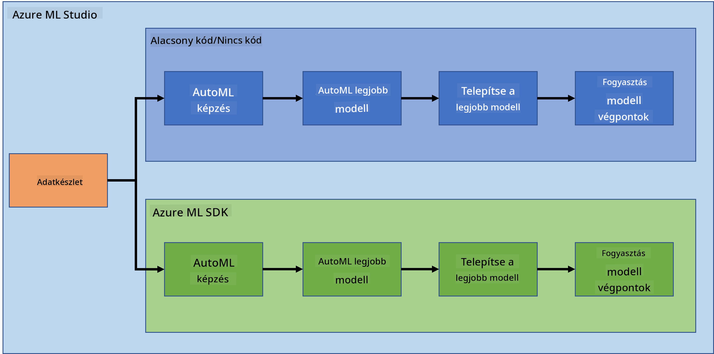
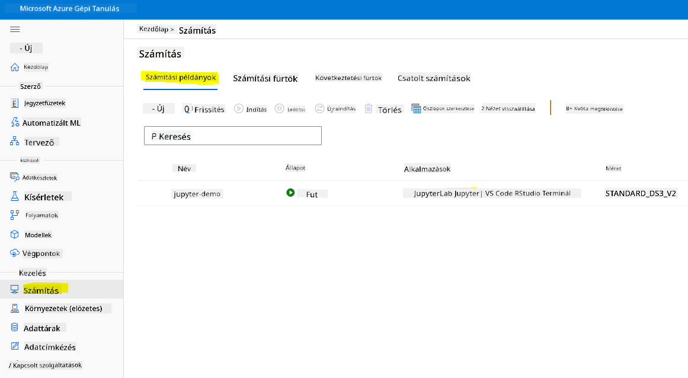

<!--
CO_OP_TRANSLATOR_METADATA:
{
  "original_hash": "73dead89dc2ddda4d6ec0232814a191e",
  "translation_date": "2025-08-26T16:11:26+00:00",
  "source_file": "5-Data-Science-In-Cloud/19-Azure/README.md",
  "language_code": "hu"
}
-->
# Adattudomány a felhőben: Az "Azure ML SDK" módszer

| ](../../sketchnotes/19-DataScience-Cloud.png)|
|:---:|
| Adattudomány a felhőben: Azure ML SDK - _Sketchnote készítette: [@nitya](https://twitter.com/nitya)_ |

Tartalomjegyzék:

- [Adattudomány a felhőben: Az "Azure ML SDK" módszer](../../../../5-Data-Science-In-Cloud/19-Azure)
  - [Előadás előtti kvíz](../../../../5-Data-Science-In-Cloud/19-Azure)
  - [1. Bevezetés](../../../../5-Data-Science-In-Cloud/19-Azure)
    - [1.1 Mi az az Azure ML SDK?](../../../../5-Data-Science-In-Cloud/19-Azure)
    - [1.2 Szívmegállás előrejelzési projekt és adathalmaz bemutatása](../../../../5-Data-Science-In-Cloud/19-Azure)
  - [2. Modell tanítása az Azure ML SDK-val](../../../../5-Data-Science-In-Cloud/19-Azure)
    - [2.1 Azure ML munkaterület létrehozása](../../../../5-Data-Science-In-Cloud/19-Azure)
    - [2.2 Számítási példány létrehozása](../../../../5-Data-Science-In-Cloud/19-Azure)
    - [2.3 Adathalmaz betöltése](../../../../5-Data-Science-In-Cloud/19-Azure)
    - [2.4 Jegyzetfüzetek létrehozása](../../../../5-Data-Science-In-Cloud/19-Azure)
    - [2.5 Modell tanítása](../../../../5-Data-Science-In-Cloud/19-Azure)
      - [2.5.1 Munkaterület, kísérlet, számítási fürt és adathalmaz beállítása](../../../../5-Data-Science-In-Cloud/19-Azure)
      - [2.5.2 AutoML konfiguráció és tanítás](../../../../5-Data-Science-In-Cloud/19-Azure)
  - [3. Modell telepítése és végpont fogyasztása az Azure ML SDK-val](../../../../5-Data-Science-In-Cloud/19-Azure)
    - [3.1 A legjobb modell mentése](../../../../5-Data-Science-In-Cloud/19-Azure)
    - [3.2 Modell telepítése](../../../../5-Data-Science-In-Cloud/19-Azure)
    - [3.3 Végpont fogyasztása](../../../../5-Data-Science-In-Cloud/19-Azure)
  - [🚀 Kihívás](../../../../5-Data-Science-In-Cloud/19-Azure)
  - [Előadás utáni kvíz](../../../../5-Data-Science-In-Cloud/19-Azure)
  - [Áttekintés és önálló tanulás](../../../../5-Data-Science-In-Cloud/19-Azure)
  - [Feladat](../../../../5-Data-Science-In-Cloud/19-Azure)

## [Előadás előtti kvíz](https://purple-hill-04aebfb03.1.azurestaticapps.net/quiz/36)

## 1. Bevezetés

### 1.1 Mi az az Azure ML SDK?

Az adattudósok és mesterséges intelligencia fejlesztők az Azure Machine Learning SDK-t használják gépi tanulási munkafolyamatok létrehozására és futtatására az Azure Machine Learning szolgáltatással. A szolgáltatással bármilyen Python környezetben dolgozhatunk, beleértve a Jupyter Notebookokat, a Visual Studio Code-ot vagy a kedvenc Python IDE-t.

Az SDK főbb területei:

- A gépi tanulási kísérletekhez használt adathalmazok felfedezése, előkészítése és életciklusának kezelése.
- Felhőalapú erőforrások kezelése a gépi tanulási kísérletek monitorozásához, naplózásához és szervezéséhez.
- Modellek tanítása helyben vagy felhőalapú erőforrásokkal, beleértve a GPU-gyorsított modell tanítást.
- Automatikus gépi tanulás használata, amely konfigurációs paramétereket és tanítási adatokat fogad. Automatikusan iterál az algoritmusok és hiperparaméterek beállításain, hogy megtalálja a legjobb modellt az előrejelzésekhez.
- Webszolgáltatások telepítése, amelyek a betanított modelleket RESTful szolgáltatásokká alakítják, amelyek bármilyen alkalmazásban felhasználhatók.

[További információ az Azure Machine Learning SDK-ról](https://docs.microsoft.com/python/api/overview/azure/ml?WT.mc_id=academic-77958-bethanycheum&ocid=AID3041109)

Az [előző leckében](../18-Low-Code/README.md) megnéztük, hogyan lehet modellt tanítani, telepíteni és használni alacsony kódú/nem kódolt módon. A Szívmegállás adathalmazt használtuk egy szívmegállás előrejelzési modell létrehozásához. Ebben a leckében ugyanezt fogjuk megtenni, de az Azure Machine Learning SDK használatával.



### 1.2 Szívmegállás előrejelzési projekt és adathalmaz bemutatása

A szívmegállás előrejelzési projekt és adathalmaz bemutatását [itt találod](../18-Low-Code/README.md).

## 2. Modell tanítása az Azure ML SDK-val
### 2.1 Azure ML munkaterület létrehozása

Egyszerűség kedvéért egy Jupyter notebookban fogunk dolgozni. Ez azt feltételezi, hogy már rendelkezel egy munkaterülettel és egy számítási példánnyal. Ha már van munkaterületed, közvetlenül ugorhatsz a **2.3 Jegyzetfüzet létrehozása** szakaszra.

Ha még nincs, kövesd az utasításokat az [előző lecke](../18-Low-Code/README.md) **2.1 Azure ML munkaterület létrehozása** szakaszában.

### 2.2 Számítási példány létrehozása

Az [Azure ML munkaterületen](https://ml.azure.com/), amelyet korábban létrehoztunk, menj a Compute menübe, ahol láthatod a különböző elérhető számítási erőforrásokat.


Hozzunk létre egy számítási példányt egy Jupyter notebook biztosításához. 
1. Kattints az + Új gombra. 
2. Adj nevet a számítási példánynak.
3. Válaszd ki az opciókat: CPU vagy GPU, VM méret és magok száma.
4. Kattints a Létrehozás gombra.

Gratulálok, most hoztál létre egy számítási példányt! Ezt a példányt fogjuk használni a jegyzetfüzet létrehozásához a [Jegyzetfüzetek létrehozása szakaszban](../../../../5-Data-Science-In-Cloud/19-Azure).

### 2.3 Adathalmaz betöltése
Ha még nem töltötted fel az adathalmazt, nézd meg az [előző lecke](../18-Low-Code/README.md) **2.3 Adathalmaz betöltése** szakaszát.

### 2.4 Jegyzetfüzetek létrehozása

> **_MEGJEGYZÉS:_** A következő lépéshez létrehozhatsz egy új jegyzetfüzetet a semmiből, vagy feltöltheted az [általunk létrehozott jegyzetfüzetet](notebook.ipynb) az Azure ML Stúdióba. A feltöltéshez egyszerűen kattints a "Notebook" menüre, és töltsd fel a jegyzetfüzetet.

A jegyzetfüzetek nagyon fontosak az adattudományi folyamatban. Használhatók feltáró adatelemzéshez (EDA), számítási fürtök hívásához modell tanítására, vagy következtetési fürtök hívásához végpont telepítésére.

Jegyzetfüzet létrehozásához szükségünk van egy számítási csomópontra, amely a Jupyter notebook példányt szolgáltatja. Lépj vissza az [Azure ML munkaterületre](https://ml.azure.com/), és kattints a Számítási példányokra. A számítási példányok listájában látnod kell a [korábban létrehozott példányt](../../../../5-Data-Science-In-Cloud/19-Azure).

1. Az Alkalmazások szakaszban kattints a Jupyter opcióra. 
2. Pipáld ki az "Igen, megértettem" négyzetet, majd kattints a Folytatás gombra.

3. Ez megnyit egy új böngészőfület a Jupyter notebook példányoddal. Kattints az "Új" gombra egy jegyzetfüzet létrehozásához.


Most, hogy van egy jegyzetfüzetünk, elkezdhetjük a modell tanítását az Azure ML SDK-val.

### 2.5 Modell tanítása

Először is, ha bármikor kétséged támad, nézd meg az [Azure ML SDK dokumentációját](https://docs.microsoft.com/python/api/overview/azure/ml?WT.mc_id=academic-77958-bethanycheum&ocid=AID3041109). Ez tartalmazza az összes szükséges információt azokról a modulokról, amelyeket ebben a leckében látni fogunk.

#### 2.5.1 Munkaterület, kísérlet, számítási fürt és adathalmaz beállítása

A `workspace` betöltéséhez a konfigurációs fájlból használd a következő kódot:

```python
from azureml.core import Workspace
ws = Workspace.from_config()
```

Ez egy `Workspace` típusú objektumot ad vissza, amely a munkaterületet képviseli. Ezután létre kell hoznod egy `experiment`-et a következő kóddal:

```python
from azureml.core import Experiment
experiment_name = 'aml-experiment'
experiment = Experiment(ws, experiment_name)
```
Egy kísérlet lekéréséhez vagy létrehozásához a munkaterületen belül a kísérlet nevét kell megadnod. A kísérlet neve 3-36 karakter hosszú lehet, betűvel vagy számmal kell kezdődnie, és csak betűket, számokat, aláhúzásokat és kötőjeleket tartalmazhat. Ha a kísérlet nem található a munkaterületen, egy új kísérlet jön létre.

Most hozz létre egy számítási fürtöt a tanításhoz a következő kóddal. Ez a lépés néhány percet igénybe vehet.

```python
from azureml.core.compute import AmlCompute

aml_name = "heart-f-cluster"
try:
    aml_compute = AmlCompute(ws, aml_name)
    print('Found existing AML compute context.')
except:
    print('Creating new AML compute context.')
    aml_config = AmlCompute.provisioning_configuration(vm_size = "Standard_D2_v2", min_nodes=1, max_nodes=3)
    aml_compute = AmlCompute.create(ws, name = aml_name, provisioning_configuration = aml_config)
    aml_compute.wait_for_completion(show_output = True)

cts = ws.compute_targets
compute_target = cts[aml_name]
```

Az adathalmazt a munkaterületről az adathalmaz nevének megadásával kérheted le az alábbi módon:

```python
dataset = ws.datasets['heart-failure-records']
df = dataset.to_pandas_dataframe()
df.describe()
```
#### 2.5.2 AutoML konfiguráció és tanítás

Az AutoML konfiguráció beállításához használd az [AutoMLConfig osztályt](https://docs.microsoft.com/python/api/azureml-train-automl-client/azureml.train.automl.automlconfig(class)?WT.mc_id=academic-77958-bethanycheum&ocid=AID3041109).

A dokumentáció szerint számos paraméterrel játszhatsz. Ehhez a projekthez a következő paramétereket fogjuk használni:

- `experiment_timeout_minutes`: Az az időtartam (percben), amely alatt a kísérlet futtatható, mielőtt automatikusan leáll és az eredmények elérhetővé válnak.
- `max_concurrent_iterations`: A kísérlethez engedélyezett egyidejű tanítási iterációk maximális száma.
- `primary_metric`: Az elsődleges metrika, amely alapján a kísérlet állapota meghatározásra kerül.
- `compute_target`: Az Azure Machine Learning számítási cél, amelyen az Automatikus Gépi Tanulási kísérlet fut.
- `task`: A futtatandó feladat típusa. Értékei lehetnek 'classification', 'regression' vagy 'forecasting', a megoldandó automatikus ML probléma típusától függően.
- `training_data`: A kísérletben használt tanítási adatok. Tartalmaznia kell a tanítási jellemzőket és egy címkeoszlopot (opcionálisan egy mintasúly oszlopot).
- `label_column_name`: A címkeoszlop neve.
- `path`: Az Azure Machine Learning projekt mappájának teljes elérési útja.
- `enable_early_stopping`: Korai leállítás engedélyezése, ha a pontszám rövid távon nem javul.
- `featurization`: Jelzi, hogy az automatikus jellemzőképzés engedélyezett-e, vagy egyedi jellemzőképzést kell használni.
- `debug_log`: A hibakeresési információk írására szolgáló naplófájl.

```python
from azureml.train.automl import AutoMLConfig

project_folder = './aml-project'

automl_settings = {
    "experiment_timeout_minutes": 20,
    "max_concurrent_iterations": 3,
    "primary_metric" : 'AUC_weighted'
}

automl_config = AutoMLConfig(compute_target=compute_target,
                             task = "classification",
                             training_data=dataset,
                             label_column_name="DEATH_EVENT",
                             path = project_folder,  
                             enable_early_stopping= True,
                             featurization= 'auto',
                             debug_log = "automl_errors.log",
                             **automl_settings
                            )
```
Most, hogy a konfiguráció be van állítva, a modellt a következő kóddal taníthatod. Ez a lépés akár egy órát is igénybe vehet a fürt méretétől függően.

```python
remote_run = experiment.submit(automl_config)
```
A RunDetails widget segítségével megjelenítheted a különböző kísérleteket.
```python
from azureml.widgets import RunDetails
RunDetails(remote_run).show()
```
## 3. Modell telepítése és végpont fogyasztása az Azure ML SDK-val

### 3.1 A legjobb modell mentése

A `remote_run` egy [AutoMLRun](https://docs.microsoft.com/python/api/azureml-train-automl-client/azureml.train.automl.run.automlrun?WT.mc_id=academic-77958-bethanycheum&ocid=AID3041109) típusú objektum. Ez az objektum tartalmazza a `get_output()` metódust, amely visszaadja a legjobb futást és a hozzá tartozó betanított modellt.

```python
best_run, fitted_model = remote_run.get_output()
```
A legjobb modellhez használt paramétereket egyszerűen kiírhatod a fitted_model nyomtatásával, és a legjobb modell tulajdonságait a [get_properties()](https://docs.microsoft.com/python/api/azureml-core/azureml.core.run(class)?view=azure-ml-py#azureml_core_Run_get_properties?WT.mc_id=academic-77958-bethanycheum&ocid=AID3041109) metódussal tekintheted meg.

```python
best_run.get_properties()
```

Most regisztráld a modellt a [register_model](https://docs.microsoft.com/python/api/azureml-train-automl-client/azureml.train.automl.run.automlrun?view=azure-ml-py#register-model-model-name-none--description-none--tags-none--iteration-none--metric-none-?WT.mc_id=academic-77958-bethanycheum&ocid=AID3041109) metódussal.
```python
model_name = best_run.properties['model_name']
script_file_name = 'inference/score.py'
best_run.download_file('outputs/scoring_file_v_1_0_0.py', 'inference/score.py')
description = "aml heart failure project sdk"
model = best_run.register_model(model_name = model_name,
                                model_path = './outputs/',
                                description = description,
                                tags = None)
```
### 3.2 Modell telepítése

Miután a legjobb modellt elmentetted, telepítheted az [InferenceConfig](https://docs.microsoft.com/python/api/azureml-core/azureml.core.model.inferenceconfig?view=azure-ml-py?ocid=AID3041109) osztállyal. Az InferenceConfig a telepítéshez használt egyedi környezet konfigurációs beállításait képviseli. Az [AciWebservice](https://docs.microsoft.com/python/api/azureml-core/azureml.core.webservice.aciwebservice?view=azure-ml-py) osztály egy gépi tanulási modellt képvisel, amelyet webszolgáltatásként telepítettek az Azure Container Instances-en. A telepített szolgáltatás egy terheléselosztott, HTTP végpont REST API-val. Adatokat küldhetsz ennek az API-nak, és megkapod a modell által visszaadott előrejelzést.

A modellt a [deploy](https://docs.microsoft.com/python/api/azureml-core/azureml.core.model(class)?view=azure-ml-py#deploy-workspace--name--models--inference-config-none--deployment-config-none--deployment-target-none--overwrite-false--show-output-false-?WT.mc_id=academic-77958-bethanycheum&ocid=AID3041109) metódussal telepítheted.

```python
from azureml.core.model import InferenceConfig, Model
from azureml.core.webservice import AciWebservice

inference_config = InferenceConfig(entry_script=script_file_name, environment=best_run.get_environment())

aciconfig = AciWebservice.deploy_configuration(cpu_cores = 1,
                                               memory_gb = 1,
                                               tags = {'type': "automl-heart-failure-prediction"},
                                               description = 'Sample service for AutoML Heart Failure Prediction')

aci_service_name = 'automl-hf-sdk'
aci_service = Model.deploy(ws, aci_service_name, [model], inference_config, aciconfig)
aci_service.wait_for_deployment(True)
print(aci_service.state)
```
Ez a lépés néhány percet igénybe vehet.

### 3.3 Végpont fogyasztása

A végpontodat egy minta bemenet létrehozásával használhatod:

```python
data = {
    "data":
    [
        {
            'age': "60",
            'anaemia': "false",
            'creatinine_phosphokinase': "500",
            'diabetes': "false",
            'ejection_fraction': "38",
            'high_blood_pressure': "false",
            'platelets': "260000",
            'serum_creatinine': "1.40",
            'serum_sodium': "137",
            'sex': "false",
            'smoking': "false",
            'time': "130",
        },
    ],
}

test_sample = str.encode(json.dumps(data))
```
Ezután elküldheted ezt a bemenetet a modellednek előrejelzés céljából:
```python
response = aci_service.run(input_data=test_sample)
response
```
Ennek az eredménye `'{"result": [false]}'` kell legyen. Ez azt jelenti, hogy a végponthoz küldött betegadatok alapján a predikció `false`, vagyis ez a személy valószínűleg nem fog szívrohamot kapni.

Gratulálunk! Sikeresen felhasználtad az Azure ML-en keresztül telepített és betanított modellt az Azure ML SDK segítségével!

> **_NOTE:_** Miután befejezted a projektet, ne felejtsd el törölni az összes erőforrást.

## 🚀 Kihívás

Az SDK-val még rengeteg más dolgot is meg lehet tenni, sajnos nem tudunk mindent áttekinteni ebben a leckében. De van egy jó hír: ha megtanulod, hogyan böngészd az SDK dokumentációját, azzal önállóan is sokat haladhatsz. Nézd meg az Azure ML SDK dokumentációját, és keresd meg a `Pipeline` osztályt, amely lehetővé teszi, hogy pipeline-okat hozz létre. A pipeline egy lépésekből álló gyűjtemény, amelyeket egy munkafolyamatként lehet végrehajtani.

**TIPP:** Látogass el az [SDK dokumentációba](https://docs.microsoft.com/python/api/overview/azure/ml/?view=azure-ml-py?WT.mc_id=academic-77958-bethanycheum&ocid=AID3041109), és írj be kulcsszavakat a keresősávba, például "Pipeline". A keresési eredmények között meg kell találnod az `azureml.pipeline.core.Pipeline` osztályt.

## [Utólagos kvíz](https://purple-hill-04aebfb03.1.azurestaticapps.net/quiz/37)

## Áttekintés és önálló tanulás

Ebben a leckében megtanultad, hogyan kell betanítani, telepíteni és felhasználni egy modellt a szívelégtelenség kockázatának előrejelzésére az Azure ML SDK-val a felhőben. Nézd meg ezt a [dokumentációt](https://docs.microsoft.com/python/api/overview/azure/ml/?view=azure-ml-py?WT.mc_id=academic-77958-bethanycheum&ocid=AID3041109) további információkért az Azure ML SDK-ról. Próbálj meg saját modellt létrehozni az Azure ML SDK-val.

## Feladat

[Adattudományi projekt az Azure ML SDK-val](assignment.md)

---

**Felelősség kizárása**:  
Ez a dokumentum az AI fordítási szolgáltatás [Co-op Translator](https://github.com/Azure/co-op-translator) segítségével lett lefordítva. Bár törekszünk a pontosságra, kérjük, vegye figyelembe, hogy az automatikus fordítások hibákat vagy pontatlanságokat tartalmazhatnak. Az eredeti dokumentum az eredeti nyelvén tekintendő hiteles forrásnak. Fontos információk esetén javasolt professzionális emberi fordítást igénybe venni. Nem vállalunk felelősséget semmilyen félreértésért vagy téves értelmezésért, amely a fordítás használatából eredhet.