<!--
CO_OP_TRANSLATOR_METADATA:
{
  "original_hash": "14b2a7f1c63202920bd98eeb913f5614",
  "translation_date": "2025-08-28T10:37:14+00:00",
  "source_file": "5-Data-Science-In-Cloud/18-Low-Code/README.md",
  "language_code": "it"
}
-->
# Data Science nel Cloud: Il metodo "Low code/No code"

| ](../../sketchnotes/18-DataScience-Cloud.png)|
|:---:|
| Data Science nel Cloud: Low Code - _Sketchnote di [@nitya](https://twitter.com/nitya)_ |

Indice:

- [Data Science nel Cloud: Il metodo "Low code/No code"](../../../../5-Data-Science-In-Cloud/18-Low-Code)
  - [Quiz pre-lezione](../../../../5-Data-Science-In-Cloud/18-Low-Code)
  - [1. Introduzione](../../../../5-Data-Science-In-Cloud/18-Low-Code)
    - [1.1 Cos'è Azure Machine Learning?](../../../../5-Data-Science-In-Cloud/18-Low-Code)
    - [1.2 Il progetto di previsione dell'insufficienza cardiaca:](../../../../5-Data-Science-In-Cloud/18-Low-Code)
    - [1.3 Il dataset sull'insufficienza cardiaca:](../../../../5-Data-Science-In-Cloud/18-Low-Code)
  - [2. Addestramento Low code/No code di un modello in Azure ML Studio](../../../../5-Data-Science-In-Cloud/18-Low-Code)
    - [2.1 Creare uno spazio di lavoro Azure ML](../../../../5-Data-Science-In-Cloud/18-Low-Code)
    - [2.2 Risorse di calcolo](../../../../5-Data-Science-In-Cloud/18-Low-Code)
      - [2.2.1 Scegliere le opzioni giuste per le risorse di calcolo](../../../../5-Data-Science-In-Cloud/18-Low-Code)
      - [2.2.2 Creare un cluster di calcolo](../../../../5-Data-Science-In-Cloud/18-Low-Code)
    - [2.3 Caricamento del dataset](../../../../5-Data-Science-In-Cloud/18-Low-Code)
    - [2.4 Addestramento Low code/No code con AutoML](../../../../5-Data-Science-In-Cloud/18-Low-Code)
  - [3. Deployment del modello Low code/No code e consumo dell'endpoint](../../../../5-Data-Science-In-Cloud/18-Low-Code)
    - [3.1 Deployment del modello](../../../../5-Data-Science-In-Cloud/18-Low-Code)
    - [3.2 Consumo dell'endpoint](../../../../5-Data-Science-In-Cloud/18-Low-Code)
  - [🚀 Sfida](../../../../5-Data-Science-In-Cloud/18-Low-Code)
  - [Quiz post-lezione](../../../../5-Data-Science-In-Cloud/18-Low-Code)
  - [Revisione e studio autonomo](../../../../5-Data-Science-In-Cloud/18-Low-Code)
  - [Compito](../../../../5-Data-Science-In-Cloud/18-Low-Code)
  
## [Quiz pre-lezione](https://purple-hill-04aebfb03.1.azurestaticapps.net/quiz/34)
## 1. Introduzione
### 1.1 Cos'è Azure Machine Learning?

La piattaforma cloud Azure offre più di 200 prodotti e servizi cloud progettati per aiutarti a dare vita a nuove soluzioni. I data scientist dedicano molto tempo all'esplorazione e alla pre-elaborazione dei dati, oltre a testare vari tipi di algoritmi di addestramento per produrre modelli accurati. Questi compiti sono dispendiosi in termini di tempo e spesso utilizzano in modo inefficiente hardware di calcolo costoso.

[Azure ML](https://docs.microsoft.com/azure/machine-learning/overview-what-is-azure-machine-learning?WT.mc_id=academic-77958-bethanycheum&ocid=AID3041109) è una piattaforma basata sul cloud per la creazione e l'operatività di soluzioni di machine learning in Azure. Include una vasta gamma di funzionalità che aiutano i data scientist a preparare i dati, addestrare modelli, pubblicare servizi predittivi e monitorarne l'utilizzo. Soprattutto, consente di aumentare l'efficienza automatizzando molti dei compiti dispendiosi in termini di tempo associati all'addestramento dei modelli e permette di utilizzare risorse di calcolo basate sul cloud che si scalano efficacemente per gestire grandi volumi di dati, sostenendo costi solo quando effettivamente utilizzate.

Azure ML fornisce tutti gli strumenti necessari per i flussi di lavoro di machine learning di sviluppatori e data scientist. Questi includono:

- **Azure Machine Learning Studio**: un portale web in Azure Machine Learning per opzioni low-code e no-code per l'addestramento, il deployment, l'automazione, il tracciamento e la gestione delle risorse. Lo studio si integra con l'SDK di Azure Machine Learning per un'esperienza senza interruzioni.
- **Jupyter Notebooks**: prototipazione rapida e test di modelli ML.
- **Azure Machine Learning Designer**: consente di trascinare e rilasciare moduli per costruire esperimenti e poi distribuire pipeline in un ambiente low-code.
- **Interfaccia AutoML per il machine learning automatizzato**: automatizza i compiti iterativi dello sviluppo di modelli di machine learning, permettendo di costruire modelli ML con alta scala, efficienza e produttività, mantenendo la qualità del modello.
- **Etichettatura dei dati**: uno strumento ML assistito per etichettare automaticamente i dati.
- **Estensione di machine learning per Visual Studio Code**: fornisce un ambiente di sviluppo completo per la creazione e la gestione di progetti ML.
- **CLI per il machine learning**: offre comandi per gestire le risorse di Azure ML dalla riga di comando.
- **Integrazione con framework open-source** come PyTorch, TensorFlow, Scikit-learn e molti altri per l'addestramento, il deployment e la gestione del processo end-to-end di machine learning.
- **MLflow**: una libreria open-source per gestire il ciclo di vita degli esperimenti di machine learning. **MLFlow Tracking** è un componente di MLflow che registra e traccia le metriche di addestramento e gli artefatti del modello, indipendentemente dall'ambiente dell'esperimento.

### 1.2 Il progetto di previsione dell'insufficienza cardiaca:

Non c'è dubbio che creare e sviluppare progetti sia il modo migliore per mettere alla prova le proprie competenze e conoscenze. In questa lezione, esploreremo due modi diversi per costruire un progetto di data science per la previsione di attacchi di insufficienza cardiaca in Azure ML Studio, attraverso il metodo Low code/No code e attraverso l'SDK di Azure ML, come mostrato nello schema seguente:


Ogni metodo ha i suoi pro e contro. Il metodo Low code/No code è più facile da iniziare poiché implica l'interazione con un'interfaccia grafica (GUI), senza necessità di conoscenze di programmazione. Questo metodo consente di testare rapidamente la fattibilità del progetto e di creare un POC (Proof Of Concept). Tuttavia, man mano che il progetto cresce e deve essere pronto per la produzione, non è fattibile creare risorse tramite GUI. È necessario automatizzare tutto programmaticamente, dalla creazione delle risorse al deployment di un modello. È qui che diventa cruciale sapere come utilizzare l'SDK di Azure ML.

|                   | Low code/No code | SDK di Azure ML           |
|-------------------|------------------|---------------------------|
| Competenza nel codice | Non richiesta   | Richiesta                 |
| Tempo di sviluppo   | Veloce e semplice | Dipende dalla competenza nel codice |
| Pronto per la produzione | No               | Sì                        |

### 1.3 Il dataset sull'insufficienza cardiaca: 

Le malattie cardiovascolari (CVD) sono la principale causa di morte a livello globale, rappresentando il 31% di tutti i decessi nel mondo. Fattori di rischio ambientali e comportamentali come l'uso di tabacco, una dieta non salutare e l'obesità, l'inattività fisica e l'uso dannoso di alcol potrebbero essere utilizzati come caratteristiche per modelli di stima. Essere in grado di stimare la probabilità di sviluppo di una CVD potrebbe essere di grande utilità per prevenire attacchi in persone ad alto rischio.

Kaggle ha reso disponibile pubblicamente un [dataset sull'insufficienza cardiaca](https://www.kaggle.com/andrewmvd/heart-failure-clinical-data), che utilizzeremo per questo progetto. Puoi scaricare il dataset ora. Si tratta di un dataset tabellare con 13 colonne (12 caratteristiche e 1 variabile target) e 299 righe. 

|    | Nome variabile            | Tipo            | Descrizione                                               | Esempio           |
|----|---------------------------|-----------------|-----------------------------------------------------------|-------------------|
| 1  | age                       | numerico        | Età del paziente                                          | 25                |
| 2  | anaemia                   | booleano        | Diminuzione dei globuli rossi o dell'emoglobina           | 0 o 1             |
| 3  | creatinine_phosphokinase  | numerico        | Livello dell'enzima CPK nel sangue                        | 542               |
| 4  | diabetes                  | booleano        | Se il paziente ha il diabete                              | 0 o 1             |
| 5  | ejection_fraction         | numerico        | Percentuale di sangue che lascia il cuore a ogni contrazione | 45                |
| 6  | high_blood_pressure       | booleano        | Se il paziente ha ipertensione                            | 0 o 1             |
| 7  | platelets                 | numerico        | Piastrine nel sangue                                      | 149000            |
| 8  | serum_creatinine          | numerico        | Livello di creatinina sierica nel sangue                  | 0.5               |
| 9  | serum_sodium              | numerico        | Livello di sodio sierico nel sangue                       | jun               |
| 10 | sex                       | booleano        | Donna o uomo                                              | 0 o 1             |
| 11 | smoking                   | booleano        | Se il paziente fuma                                       | 0 o 1             |
| 12 | time                      | numerico        | Periodo di follow-up (giorni)                             | 4                 |
|----|---------------------------|-----------------|-----------------------------------------------------------|-------------------|
| 21 | DEATH_EVENT [Target]      | booleano        | Se il paziente muore durante il periodo di follow-up      | 0 o 1             |

Una volta ottenuto il dataset, possiamo iniziare il progetto in Azure.

## 2. Addestramento Low code/No code di un modello in Azure ML Studio
### 2.1 Creare uno spazio di lavoro Azure ML
Per addestrare un modello in Azure ML, è necessario prima creare uno spazio di lavoro Azure ML. Lo spazio di lavoro è la risorsa di livello superiore per Azure Machine Learning, che fornisce un luogo centralizzato per lavorare con tutti gli artefatti creati durante l'utilizzo di Azure Machine Learning. Lo spazio di lavoro tiene traccia di tutte le esecuzioni di addestramento, inclusi log, metriche, output e uno snapshot degli script. Queste informazioni vengono utilizzate per determinare quale esecuzione di addestramento produce il miglior modello. [Scopri di più](https://docs.microsoft.com/azure/machine-learning/concept-workspace?WT.mc_id=academic-77958-bethanycheum&ocid=AID3041109)

Si consiglia di utilizzare il browser più aggiornato compatibile con il sistema operativo. I seguenti browser sono supportati:

- Microsoft Edge (Il nuovo Microsoft Edge, ultima versione. Non Microsoft Edge legacy)
- Safari (ultima versione, solo Mac)
- Chrome (ultima versione)
- Firefox (ultima versione)

Per utilizzare Azure Machine Learning, crea uno spazio di lavoro nel tuo abbonamento Azure. Puoi quindi utilizzare questo spazio di lavoro per gestire dati, risorse di calcolo, codice, modelli e altri artefatti relativi ai tuoi carichi di lavoro di machine learning.

> **_NOTA:_** Il tuo abbonamento Azure verrà addebitato per una piccola quantità di archiviazione dati finché lo spazio di lavoro Azure Machine Learning esiste nel tuo abbonamento, quindi ti consigliamo di eliminare lo spazio di lavoro Azure Machine Learning quando non lo utilizzi più.

1. Accedi al [portale Azure](https://ms.portal.azure.com/) utilizzando le credenziali Microsoft associate al tuo abbonamento Azure.
2. Seleziona **＋Crea una risorsa**
   
   

   Cerca Machine Learning e seleziona il riquadro Machine Learning

   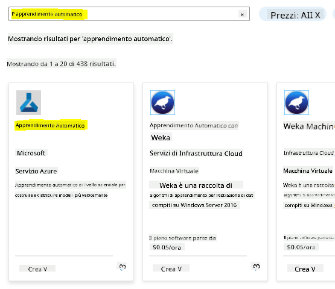

   Clicca sul pulsante crea

   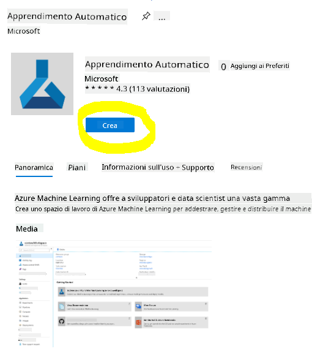

   Compila le impostazioni come segue:
   - Abbonamento: Il tuo abbonamento Azure
   - Gruppo di risorse: Crea o seleziona un gruppo di risorse
   - Nome dello spazio di lavoro: Inserisci un nome univoco per il tuo spazio di lavoro
   - Regione: Seleziona la regione geografica più vicina a te
   - Account di archiviazione: Nota il nuovo account di archiviazione predefinito che verrà creato per il tuo spazio di lavoro
   - Key vault: Nota il nuovo key vault predefinito che verrà creato per il tuo spazio di lavoro
   - Application insights: Nota la nuova risorsa application insights predefinita che verrà creata per il tuo spazio di lavoro
   - Container registry: Nessuno (uno verrà creato automaticamente la prima volta che distribuisci un modello in un container)

    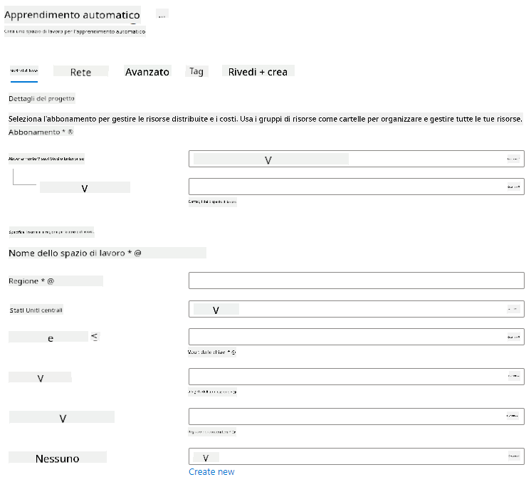

   - Clicca su crea + revisione e poi sul pulsante crea
3. Attendi che il tuo spazio di lavoro venga creato (questo può richiedere alcuni minuti). Poi vai al portale. Puoi trovarlo tramite il servizio Azure Machine Learning.
4. Nella pagina Panoramica del tuo spazio di lavoro, avvia Azure Machine Learning studio (o apri una nuova scheda del browser e naviga su https://ml.azure.com), e accedi ad Azure Machine Learning studio utilizzando il tuo account Microsoft. Se richiesto, seleziona la tua directory e abbonamento Azure, e il tuo spazio di lavoro Azure Machine Learning.
   
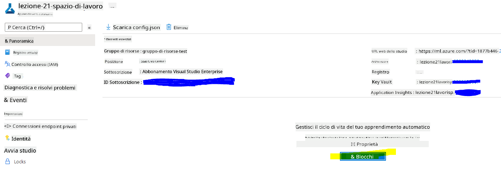

5. In Azure Machine Learning studio, attiva l'icona ☰ in alto a sinistra per visualizzare le varie pagine dell'interfaccia. Puoi utilizzare queste pagine per gestire le risorse nel tuo spazio di lavoro.

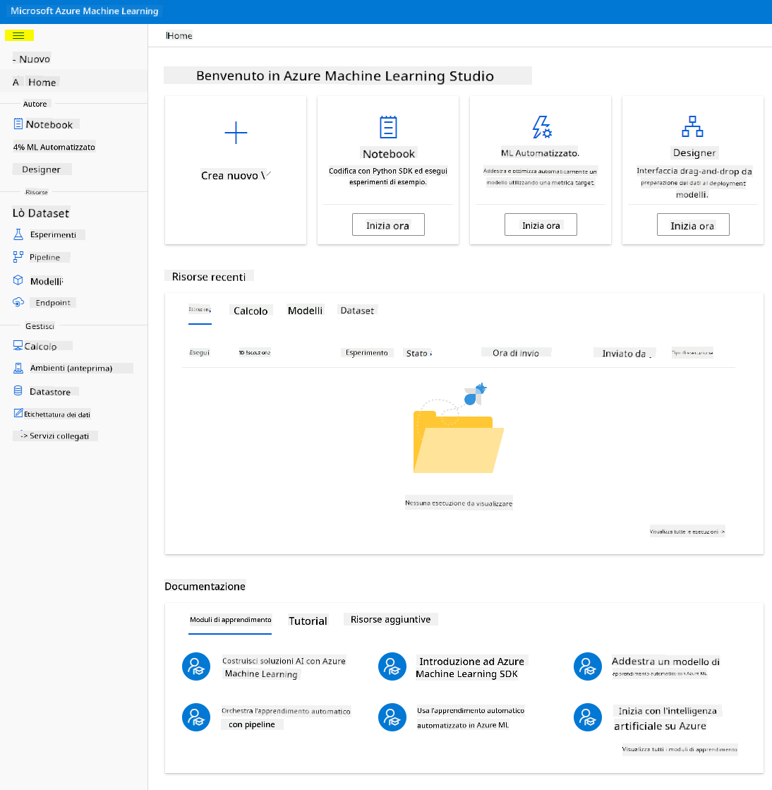

Puoi gestire il tuo spazio di lavoro utilizzando il portale Azure, ma per i data scientist e gli ingegneri delle operazioni di Machine Learning, Azure Machine Learning Studio offre un'interfaccia utente più mirata per la gestione delle risorse dello spazio di lavoro.

### 2.2 Risorse di calcolo

Le risorse di calcolo sono risorse basate sul cloud su cui è possibile eseguire processi di addestramento del modello e di esplorazione dei dati. Esistono quattro tipi di risorse di calcolo che puoi creare:

- **Compute Instances**: Workstation di sviluppo che i data scientist possono utilizzare per lavorare con dati e modelli. Questo comporta la creazione di una macchina virtuale (VM) e l'avvio di un'istanza notebook. Puoi quindi addestrare un modello chiamando un cluster di calcolo dal notebook.
- **Compute Clusters**: Cluster scalabili di VM per l'elaborazione on-demand del codice degli esperimenti. Sarà necessario quando si addestra un modello. I cluster di calcolo possono anche utilizzare risorse GPU o CPU specializzate.
- **Inference Clusters**: Target di distribuzione per servizi predittivi che utilizzano i tuoi modelli addestrati.
- **Compute collegato**: Collegamenti a risorse di calcolo Azure esistenti, come macchine virtuali o cluster Azure Databricks.

#### 2.2.1 Scegliere le opzioni giuste per le risorse di calcolo

Ci sono alcuni fattori chiave da considerare quando si crea una risorsa di calcolo, e queste scelte possono essere decisioni critiche da prendere.

**Hai bisogno di CPU o GPU?**

Una CPU (Central Processing Unit) è il circuito elettronico che esegue le istruzioni di un programma informatico. Una GPU (Graphics Processing Unit) è un circuito elettronico specializzato che può eseguire codice relativo alla grafica a una velocità molto elevata.

La principale differenza tra l'architettura di CPU e GPU è che una CPU è progettata per gestire una vasta gamma di attività rapidamente (misurata dalla velocità di clock della CPU), ma è limitata nella concorrenza delle attività che possono essere eseguite. Le GPU sono progettate per il calcolo parallelo e quindi sono molto più adatte ai compiti di deep learning.

| CPU                                     | GPU                         |
|-----------------------------------------|-----------------------------|
| Meno costosa                            | Più costosa                 |
| Livello di concorrenza inferiore        | Livello di concorrenza superiore |
| Più lenta nell'addestramento di modelli di deep learning | Ottimale per il deep learning |

**Dimensione del cluster**

Cluster più grandi sono più costosi ma garantiscono una migliore reattività. Pertanto, se hai tempo ma non abbastanza denaro, dovresti iniziare con un cluster piccolo. Al contrario, se hai denaro ma poco tempo, dovresti iniziare con un cluster più grande.

**Dimensione della VM**

A seconda dei tuoi vincoli di tempo e budget, puoi variare la dimensione della RAM, del disco, il numero di core e la velocità di clock. Aumentare tutti questi parametri sarà più costoso, ma garantirà prestazioni migliori.

**Istanza dedicata o a bassa priorità?**

Un'istanza a bassa priorità significa che è interrompibile: essenzialmente, Microsoft Azure può prendere quelle risorse e assegnarle a un altro compito, interrompendo così un lavoro. Un'istanza dedicata, o non interrompibile, significa che il lavoro non sarà mai terminato senza il tuo permesso. Questa è un'altra considerazione tra tempo e denaro, poiché le istanze interrompibili sono meno costose di quelle dedicate.

#### 2.2.2 Creare un cluster di calcolo

Nel [workspace Azure ML](https://ml.azure.com/) che abbiamo creato in precedenza, vai su "Compute" e potrai vedere le diverse risorse di calcolo appena discusse (ad esempio istanze di calcolo, cluster di calcolo, cluster di inferenza e compute collegato). Per questo progetto, avremo bisogno di un cluster di calcolo per l'addestramento del modello. Nello Studio, clicca sul menu "Compute", poi sulla scheda "Compute cluster" e clicca sul pulsante "+ Nuovo" per creare un cluster di calcolo.


1. Scegli le tue opzioni: Dedicato vs Bassa priorità, CPU o GPU, dimensione della VM e numero di core (puoi mantenere le impostazioni predefinite per questo progetto).
2. Clicca sul pulsante "Avanti".

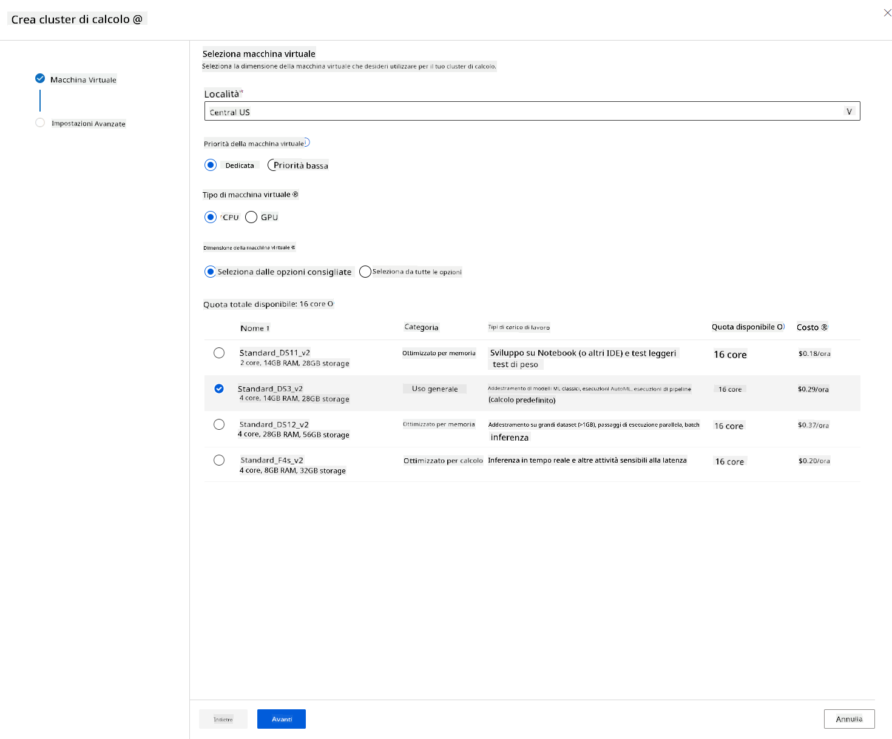

3. Dai un nome al cluster di calcolo.
4. Scegli le tue opzioni: Numero minimo/massimo di nodi, secondi di inattività prima della riduzione, accesso SSH. Nota che se il numero minimo di nodi è 0, risparmierai denaro quando il cluster è inattivo. Nota che maggiore è il numero di nodi massimi, più breve sarà l'addestramento. Il numero massimo di nodi consigliato è 3.  
5. Clicca sul pulsante "Crea". Questo passaggio potrebbe richiedere alcuni minuti.

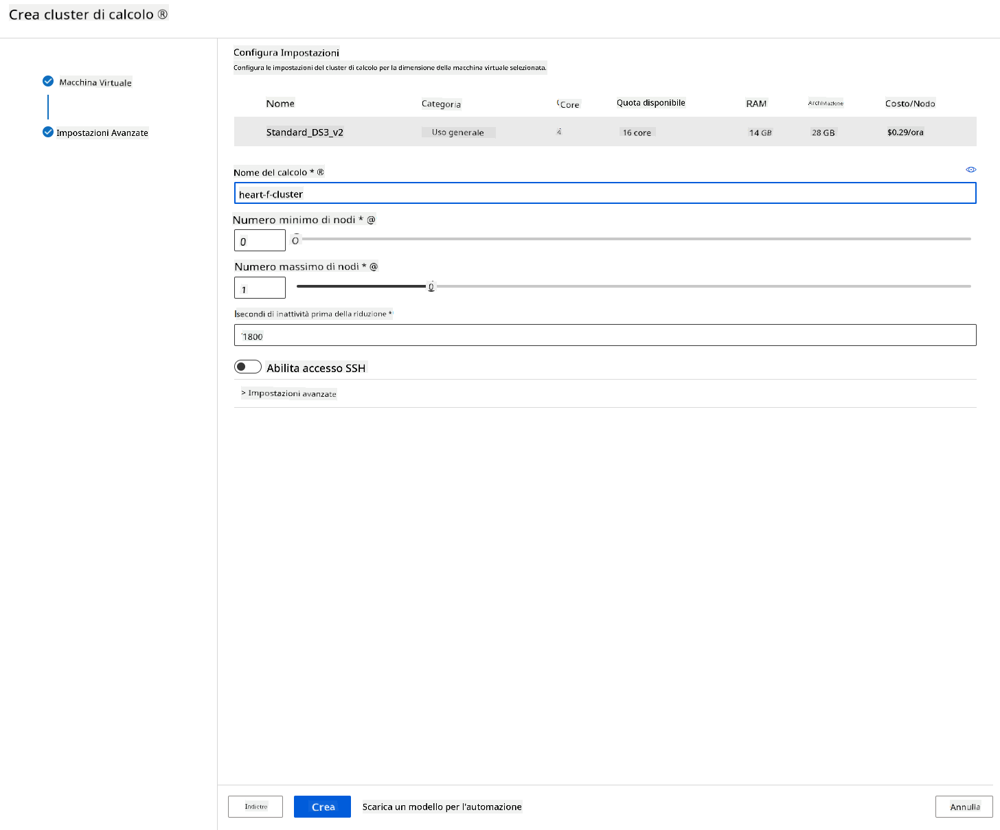

Fantastico! Ora che abbiamo un cluster di calcolo, dobbiamo caricare i dati su Azure ML Studio.

### 2.3 Caricare il dataset

1. Nel [workspace Azure ML](https://ml.azure.com/) che abbiamo creato in precedenza, clicca su "Datasets" nel menu a sinistra e clicca sul pulsante "+ Crea dataset" per creare un dataset. Scegli l'opzione "Da file locali" e seleziona il dataset di Kaggle che abbiamo scaricato in precedenza.
   
   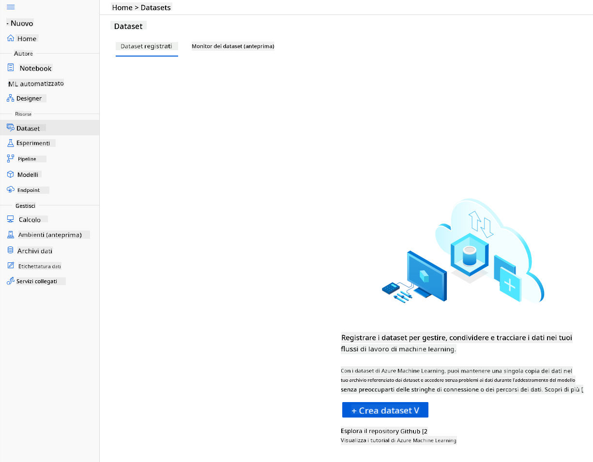

2. Dai un nome, un tipo e una descrizione al tuo dataset. Clicca su "Avanti". Carica i dati dai file. Clicca su "Avanti".
   
   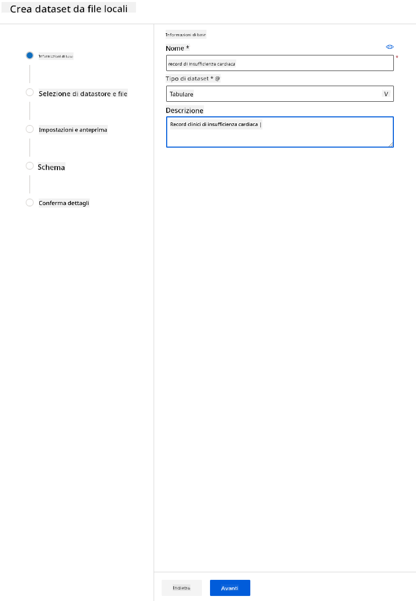

3. Nello schema, cambia il tipo di dati in Booleano per le seguenti caratteristiche: anemia, diabete, pressione alta, sesso, fumo e DEATH_EVENT. Clicca su "Avanti" e poi su "Crea".
   
   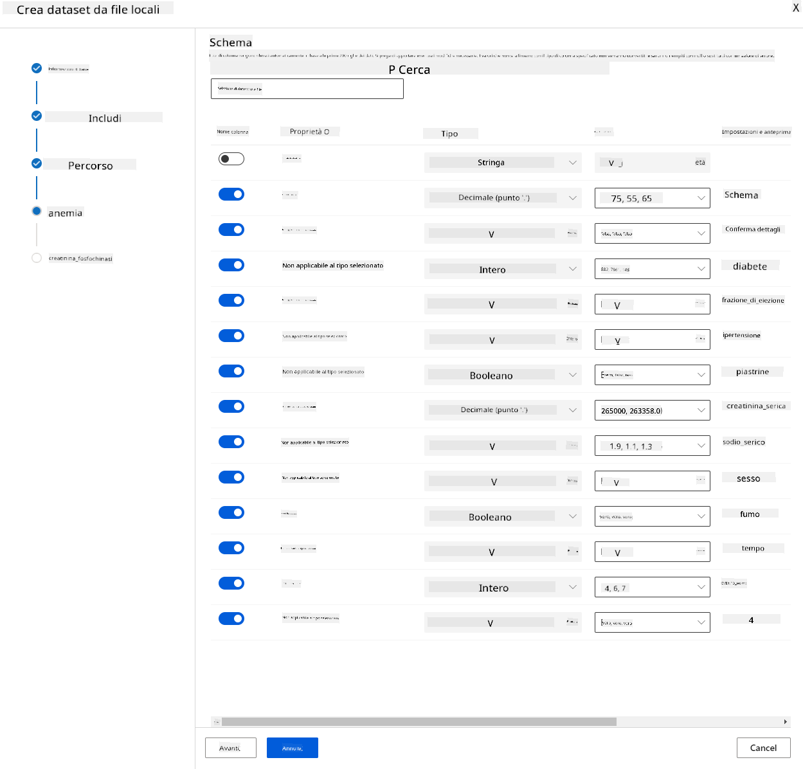

Ottimo! Ora che il dataset è pronto e il cluster di calcolo è stato creato, possiamo iniziare l'addestramento del modello!

### 2.4 Addestramento Low code/No code con AutoML 

Lo sviluppo tradizionale di modelli di machine learning è intensivo in termini di risorse, richiede una conoscenza significativa del dominio e tempo per produrre e confrontare decine di modelli. 
L'apprendimento automatico automatizzato (AutoML) è il processo di automazione delle attività iterative e dispendiose in termini di tempo dello sviluppo di modelli di machine learning. Consente a data scientist, analisti e sviluppatori di costruire modelli ML con alta scala, efficienza e produttività, mantenendo la qualità del modello. Riduce il tempo necessario per ottenere modelli ML pronti per la produzione, con grande facilità ed efficienza. [Scopri di più](https://docs.microsoft.com/azure/machine-learning/concept-automated-ml?WT.mc_id=academic-77958-bethanycheum&ocid=AID3041109)

1. Nel [workspace Azure ML](https://ml.azure.com/) che abbiamo creato in precedenza, clicca su "Automated ML" nel menu a sinistra e seleziona il dataset che hai appena caricato. Clicca su "Avanti".

   

2. Inserisci un nuovo nome per l'esperimento, la colonna target (DEATH_EVENT) e il cluster di calcolo che abbiamo creato. Clicca su "Avanti".
   
   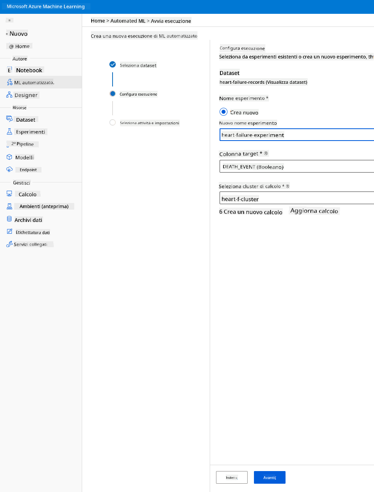

3. Scegli "Classificazione" e clicca su "Fine". Questo passaggio potrebbe richiedere tra 30 minuti e 1 ora, a seconda della dimensione del cluster di calcolo.
    
    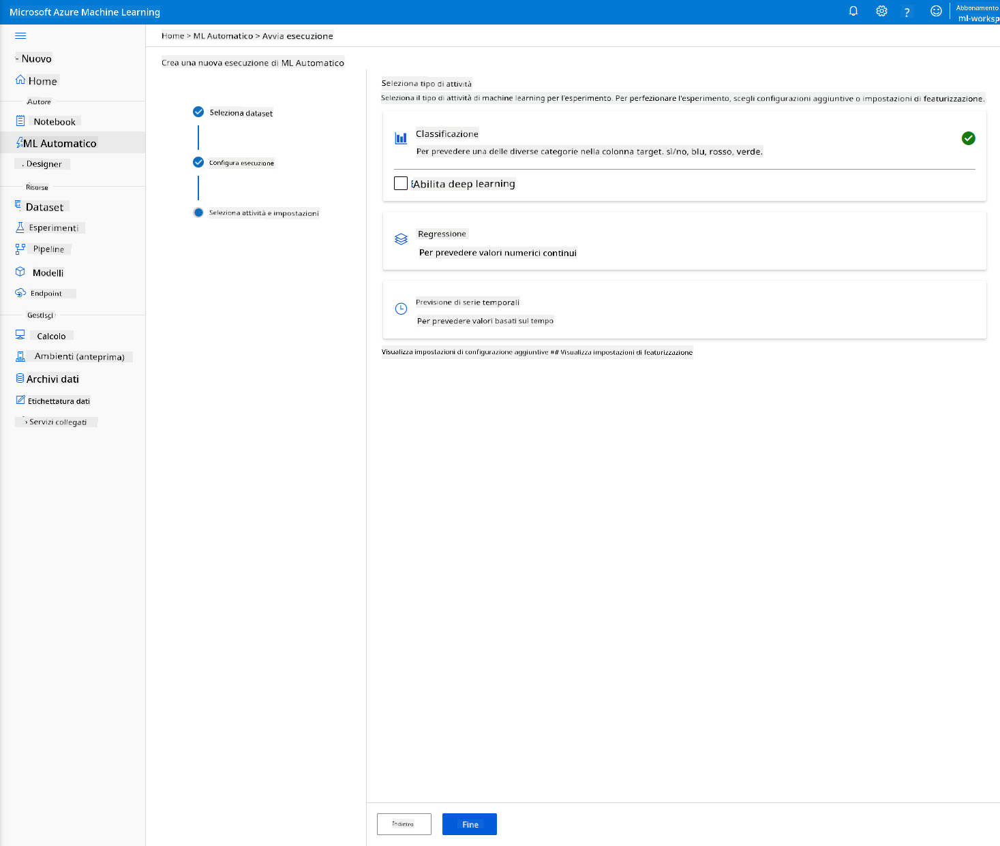

4. Una volta completata l'esecuzione, clicca sulla scheda "Automated ML", clicca sulla tua esecuzione e clicca sull'algoritmo nella scheda "Best model summary".
    
    

Qui puoi vedere una descrizione dettagliata del miglior modello generato da AutoML. Puoi anche esplorare altri modelli generati nella scheda "Models". Prenditi qualche minuto per esplorare i modelli nella scheda "Explanations (preview)". Una volta scelto il modello che vuoi utilizzare (qui sceglieremo il miglior modello selezionato da AutoML), vedremo come possiamo distribuirlo.

## 3. Distribuzione del modello Low code/No code e consumo dell'endpoint
### 3.1 Distribuzione del modello

L'interfaccia di apprendimento automatico automatizzato consente di distribuire il miglior modello come servizio web in pochi passaggi. La distribuzione è l'integrazione del modello in modo che possa fare previsioni basate su nuovi dati e identificare potenziali aree di opportunità. Per questo progetto, la distribuzione come servizio web significa che le applicazioni mediche potranno consumare il modello per fare previsioni in tempo reale sul rischio di infarto dei loro pazienti.

Nella descrizione del miglior modello, clicca sul pulsante "Deploy".
    
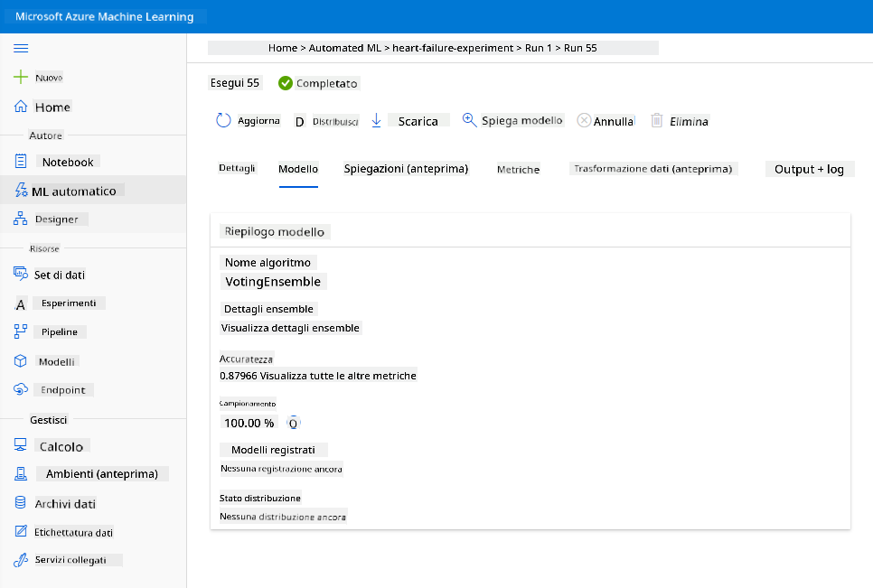

15. Dai un nome, una descrizione, il tipo di calcolo (Azure Container Instance), abilita l'autenticazione e clicca su "Deploy". Questo passaggio potrebbe richiedere circa 20 minuti per essere completato. Il processo di distribuzione comprende diversi passaggi, tra cui la registrazione del modello, la generazione delle risorse e la loro configurazione per il servizio web. Un messaggio di stato appare sotto "Deploy status". Seleziona "Refresh" periodicamente per controllare lo stato della distribuzione. È distribuito e funzionante quando lo stato è "Healthy".

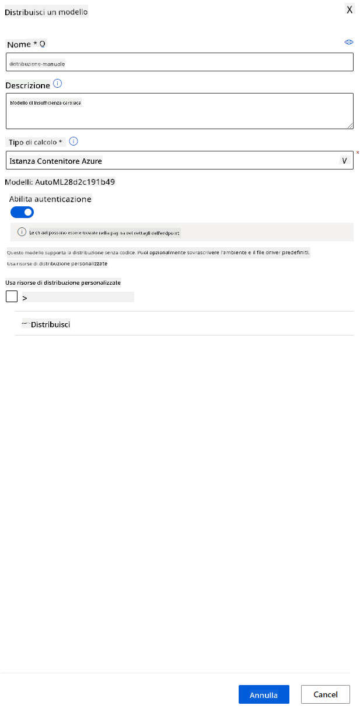

16. Una volta distribuito, clicca sulla scheda "Endpoint" e clicca sull'endpoint appena distribuito. Qui puoi trovare tutti i dettagli necessari sull'endpoint. 

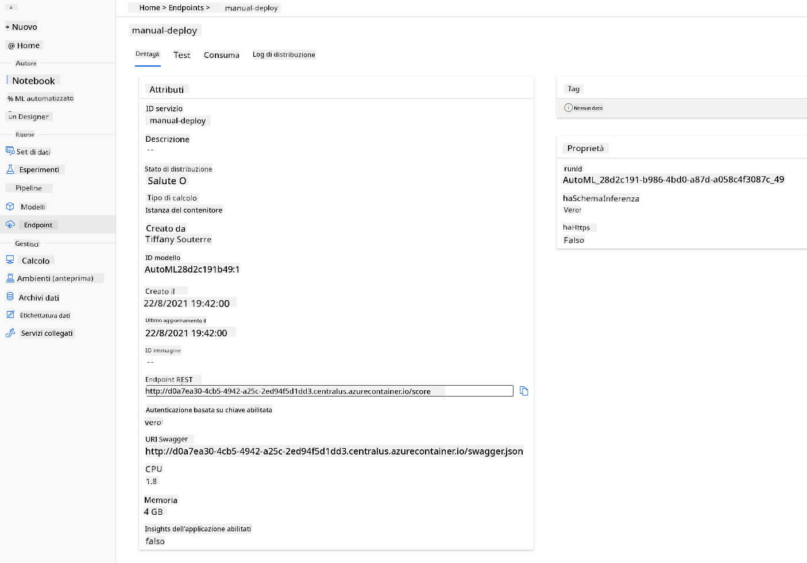

Fantastico! Ora che abbiamo un modello distribuito, possiamo iniziare il consumo dell'endpoint.

### 3.2 Consumo dell'endpoint

Clicca sulla scheda "Consume". Qui puoi trovare l'endpoint REST e uno script Python nell'opzione di consumo. Prenditi del tempo per leggere il codice Python.

Questo script può essere eseguito direttamente dalla tua macchina locale e consumerà il tuo endpoint.

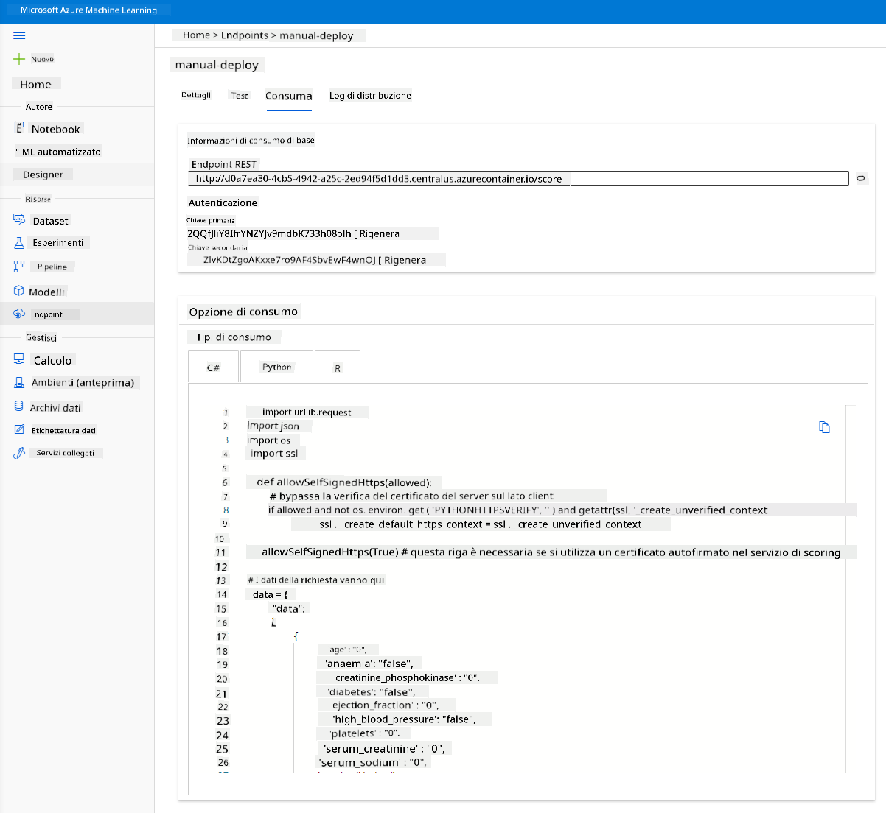

Prenditi un momento per controllare queste 2 righe di codice: 

```python
url = 'http://98e3715f-xxxx-xxxx-xxxx-9ec22d57b796.centralus.azurecontainer.io/score'
api_key = '' # Replace this with the API key for the web service
```
La variabile `url` è l'endpoint REST trovato nella scheda "Consume" e la variabile `api_key` è la chiave primaria trovata anch'essa nella scheda "Consume" (solo nel caso in cui tu abbia abilitato l'autenticazione). Questo è il modo in cui lo script può consumare l'endpoint.

18. Eseguendo lo script, dovresti vedere il seguente output:
    ```python
    b'"{\\"result\\": [true]}"'
    ```
Questo significa che la previsione di insufficienza cardiaca per i dati forniti è vera. Questo ha senso perché, se guardi più da vicino i dati generati automaticamente nello script, tutto è impostato su 0 e falso per impostazione predefinita. Puoi cambiare i dati con il seguente esempio di input:

```python
data = {
    "data":
    [
        {
            'age': "0",
            'anaemia': "false",
            'creatinine_phosphokinase': "0",
            'diabetes': "false",
            'ejection_fraction': "0",
            'high_blood_pressure': "false",
            'platelets': "0",
            'serum_creatinine': "0",
            'serum_sodium': "0",
            'sex': "false",
            'smoking': "false",
            'time': "0",
        },
        {
            'age': "60",
            'anaemia': "false",
            'creatinine_phosphokinase': "500",
            'diabetes': "false",
            'ejection_fraction': "38",
            'high_blood_pressure': "false",
            'platelets': "260000",
            'serum_creatinine': "1.40",
            'serum_sodium': "137",
            'sex': "false",
            'smoking': "false",
            'time': "130",
        },
    ],
}
```
Lo script dovrebbe restituire:
    ```python
    b'"{\\"result\\": [true, false]}"'
    ```

Congratulazioni! Hai appena consumato il modello distribuito e lo hai addestrato su Azure ML!

> **_NOTA:_** Una volta terminato il progetto, non dimenticare di eliminare tutte le risorse.
## 🚀 Sfida

Osserva attentamente le spiegazioni del modello e i dettagli che AutoML ha generato per i modelli migliori. Cerca di capire perché il miglior modello è migliore degli altri. Quali algoritmi sono stati confrontati? Quali sono le differenze tra loro? Perché il migliore sta performando meglio in questo caso?

## [Quiz post-lezione](https://purple-hill-04aebfb03.1.azurestaticapps.net/quiz/35)

## Revisione e studio autonomo

In questa lezione, hai imparato come addestrare, distribuire e consumare un modello per prevedere il rischio di insufficienza cardiaca in modalità Low code/No code nel cloud. Se non lo hai ancora fatto, approfondisci le spiegazioni del modello che AutoML ha generato per i modelli migliori e cerca di capire perché il miglior modello è migliore degli altri.

Puoi approfondire ulteriormente AutoML Low code/No code leggendo questa [documentazione](https://docs.microsoft.com/azure/machine-learning/tutorial-first-experiment-automated-ml?WT.mc_id=academic-77958-bethanycheum&ocid=AID3041109).

## Compito

[Progetto di Data Science Low code/No code su Azure ML](assignment.md)

---

**Disclaimer**:  
Questo documento è stato tradotto utilizzando il servizio di traduzione automatica [Co-op Translator](https://github.com/Azure/co-op-translator). Sebbene ci impegniamo per garantire l'accuratezza, si prega di notare che le traduzioni automatiche potrebbero contenere errori o imprecisioni. Il documento originale nella sua lingua nativa dovrebbe essere considerato la fonte autorevole. Per informazioni critiche, si consiglia una traduzione professionale eseguita da un traduttore umano. Non siamo responsabili per eventuali fraintendimenti o interpretazioni errate derivanti dall'uso di questa traduzione.