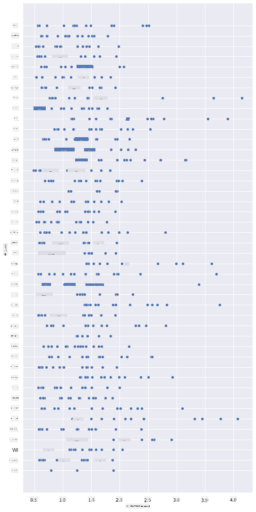
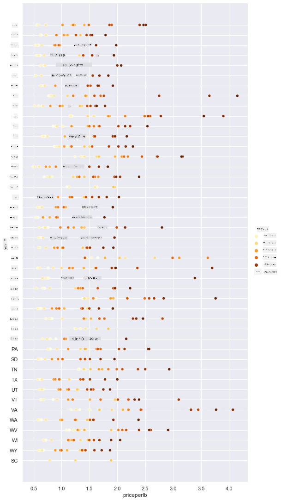
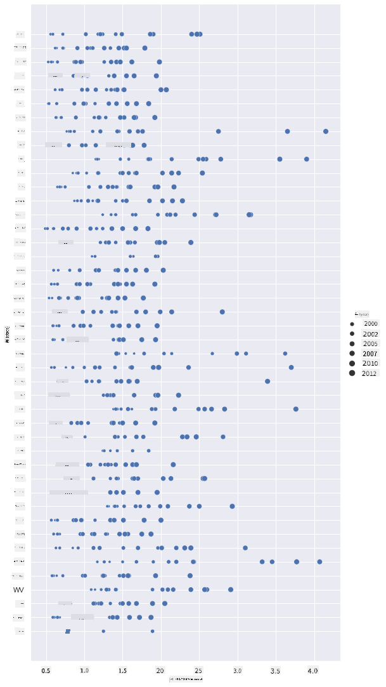
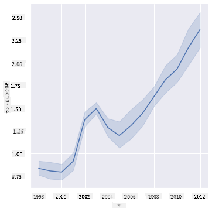
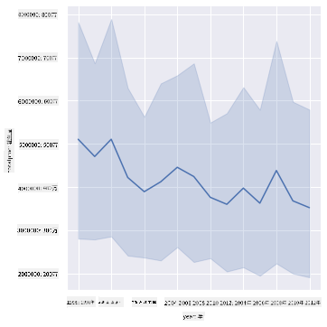
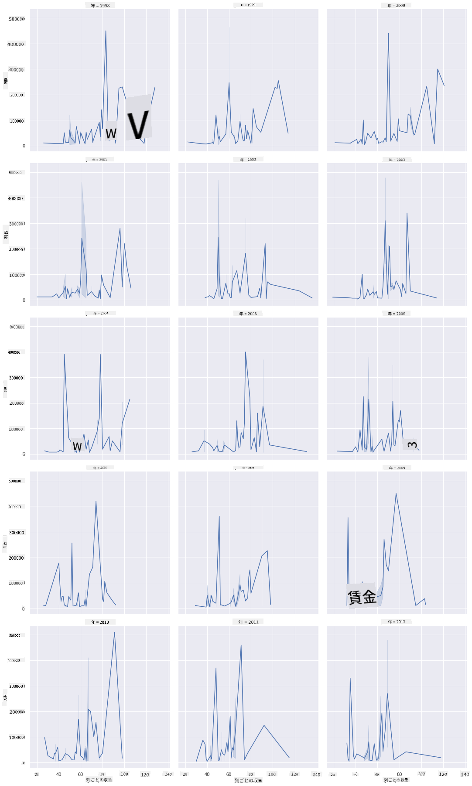
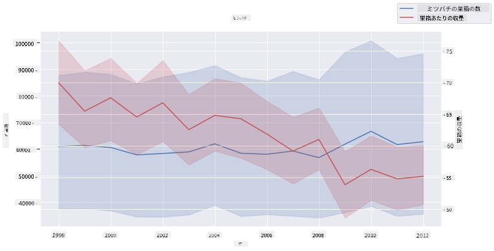

<!--
CO_OP_TRANSLATOR_METADATA:
{
  "original_hash": "cad419b574d5c35eaa417e9abfdcb0c8",
  "translation_date": "2025-08-25T18:10:48+00:00",
  "source_file": "3-Data-Visualization/12-visualization-relationships/README.md",
  "language_code": "ja"
}
-->
# 関係の可視化: ハチミツについて 🍯

| ](../../sketchnotes/12-Visualizing-Relationships.png)|
|:---:|
|関係の可視化 - _スケッチノート by [@nitya](https://twitter.com/nitya)_ |

私たちの研究の自然に焦点を当てたテーマを続けて、[アメリカ合衆国農務省](https://www.nass.usda.gov/About_NASS/index.php)から得られたデータセットに基づいて、さまざまな種類のハチミツの関係を示す興味深い可視化を探ってみましょう。

この約600項目のデータセットは、アメリカの多くの州におけるハチミツ生産を示しています。例えば、1998年から2012年までの各州の1年ごとのデータとして、コロニー数、コロニーあたりの収量、総生産量、在庫、1ポンドあたりの価格、そして生産されたハチミツの価値を確認することができます。

特定の州の年間生産量とその州のハチミツの価格との関係を可視化するのは興味深いでしょう。または、州ごとのコロニーあたりのハチミツ収量の関係を可視化することもできます。この期間には、2006年に初めて確認された「コロニー崩壊症候群（CCD）」(http://npic.orst.edu/envir/ccd.html) が含まれており、研究するには感慨深いデータセットです。🐝

## [講義前クイズ](https://purple-hill-04aebfb03.1.azurestaticapps.net/quiz/22)

このレッスンでは、以前使用したSeabornを使って、変数間の関係を可視化する方法を学びます。特に興味深いのは、Seabornの`relplot`関数を使用して、散布図や折れ線グラフを作成し、データサイエンティストが変数間の関係をよりよく理解できるようにする「[統計的関係](https://seaborn.pydata.org/tutorial/relational.html?highlight=relationships)」を迅速に可視化することです。

## 散布図

散布図を使用して、州ごとのハチミツの価格が年々どのように変化しているかを示しましょう。Seabornの`relplot`を使用すると、州ごとのデータをグループ化し、カテゴリカルデータと数値データの両方のデータポイントを表示できます。

まず、データとSeabornをインポートしましょう：

```python
import pandas as pd
import matplotlib.pyplot as plt
import seaborn as sns
honey = pd.read_csv('../../data/honey.csv')
honey.head()
```
ハチミツデータには、年や1ポンドあたりの価格など、いくつかの興味深い列が含まれていることに気づくでしょう。このデータをアメリカの州ごとにグループ化して調べてみましょう：

| state | numcol | yieldpercol | totalprod | stocks   | priceperlb | prodvalue | year |
| ----- | ------ | ----------- | --------- | -------- | ---------- | --------- | ---- |
| AL    | 16000  | 71          | 1136000   | 159000   | 0.72       | 818000    | 1998 |
| AZ    | 55000  | 60          | 3300000   | 1485000  | 0.64       | 2112000   | 1998 |
| AR    | 53000  | 65          | 3445000   | 1688000  | 0.59       | 2033000   | 1998 |
| CA    | 450000 | 83          | 37350000  | 12326000 | 0.62       | 23157000  | 1998 |
| CO    | 27000  | 72          | 1944000   | 1594000  | 0.7        | 1361000   | 1998 |

1ポンドあたりのハチミツの価格とその州の関係を示す基本的な散布図を作成しましょう。`y`軸を十分に高くして、すべての州を表示できるようにします：

```python
sns.relplot(x="priceperlb", y="state", data=honey, height=15, aspect=.5);
```


次に、ハチミツの色合いを使って、価格が年々どのように変化しているかを示しましょう。これを行うには、`hue`パラメータを追加して、年ごとの変化を表示します：

> ✅ [Seabornで使用できるカラーパレット](https://seaborn.pydata.org/tutorial/color_palettes.html)についてもっと学びましょう - 美しい虹色のカラースキームを試してみてください！

```python
sns.relplot(x="priceperlb", y="state", hue="year", palette="YlOrBr", data=honey, height=15, aspect=.5);
```


このカラースキームの変更により、1ポンドあたりのハチミツの価格が年々明らかに上昇していることがわかります。実際、データのサンプルセットを確認すると（例えばアリゾナ州を選んでみると）、例外はあるものの、価格が年々上昇しているパターンが見られます：

| state | numcol | yieldpercol | totalprod | stocks  | priceperlb | prodvalue | year |
| ----- | ------ | ----------- | --------- | ------- | ---------- | --------- | ---- |
| AZ    | 55000  | 60          | 3300000   | 1485000 | 0.64       | 2112000   | 1998 |
| AZ    | 52000  | 62          | 3224000   | 1548000 | 0.62       | 1999000   | 1999 |
| AZ    | 40000  | 59          | 2360000   | 1322000 | 0.73       | 1723000   | 2000 |
| AZ    | 43000  | 59          | 2537000   | 1142000 | 0.72       | 1827000   | 2001 |
| AZ    | 38000  | 63          | 2394000   | 1197000 | 1.08       | 2586000   | 2002 |
| AZ    | 35000  | 72          | 2520000   | 983000  | 1.34       | 3377000   | 2003 |
| AZ    | 32000  | 55          | 1760000   | 774000  | 1.11       | 1954000   | 2004 |
| AZ    | 36000  | 50          | 1800000   | 720000  | 1.04       | 1872000   | 2005 |
| AZ    | 30000  | 65          | 1950000   | 839000  | 0.91       | 1775000   | 2006 |
| AZ    | 30000  | 64          | 1920000   | 902000  | 1.26       | 2419000   | 2007 |
| AZ    | 25000  | 64          | 1600000   | 336000  | 1.26       | 2016000   | 2008 |
| AZ    | 20000  | 52          | 1040000   | 562000  | 1.45       | 1508000   | 2009 |
| AZ    | 24000  | 77          | 1848000   | 665000  | 1.52       | 2809000   | 2010 |
| AZ    | 23000  | 53          | 1219000   | 427000  | 1.55       | 1889000   | 2011 |
| AZ    | 22000  | 46          | 1012000   | 253000  | 1.79       | 1811000   | 2012 |

色ではなくサイズを使ってこの進行を可視化する別の方法もあります。色覚異常のユーザーにとっては、こちらの方が良い選択肢かもしれません。ドットの円周を増やすことで価格の上昇を示すように可視化を編集しましょう：

```python
sns.relplot(x="priceperlb", y="state", size="year", data=honey, height=15, aspect=.5);
```
ドットのサイズが徐々に大きくなっているのがわかります。



これは単純な需要と供給の問題でしょうか？気候変動やコロニー崩壊などの要因により、年々購入可能なハチミツが減少し、その結果価格が上昇しているのでしょうか？

このデータセット内のいくつかの変数間の相関を発見するために、折れ線グラフを探ってみましょう。

## 折れ線グラフ

質問：1ポンドあたりのハチミツの価格は年々明確に上昇しているのでしょうか？これを最も簡単に発見する方法は、1本の折れ線グラフを作成することです：

```python
sns.relplot(x="year", y="priceperlb", kind="line", data=honey);
```
答え：はい、2003年頃を除いて上昇しています：



✅ Seabornはデフォルトで「各x値での複数の測定値を平均値とその周りの95%信頼区間をプロットすることで表示」します。[出典](https://seaborn.pydata.org/tutorial/relational.html)。この時間のかかる動作は、`ci=None`を追加することで無効にできます。

質問：では、2003年にはハチミツの供給量の急増も見られるのでしょうか？年ごとの総生産量を見てみましょう：

```python
sns.relplot(x="year", y="totalprod", kind="line", data=honey);
```



答え：そうではありません。総生産量を見ると、実際にはその年に増加しているように見えますが、一般的にはこれらの年に生産量が減少していることがわかります。

質問：その場合、2003年頃のハチミツ価格の急上昇の原因は何だったのでしょうか？

これを発見するために、ファセットグリッドを探ってみましょう。

## ファセットグリッド

ファセットグリッドは、データセットの1つの側面（この場合、'year'を選ぶと、生成されるファセットが多すぎるのを避けられます）を取り、Seabornが選択したx座標とy座標のプロットを各ファセットごとに作成します。これにより、比較が容易になります。2003年はこのような比較で際立っているでしょうか？

Seabornの[ドキュメント](https://seaborn.pydata.org/generated/seaborn.FacetGrid.html?highlight=facetgrid#seaborn.FacetGrid)で推奨されているように、`relplot`を使い続けてファセットグリッドを作成しましょう。

```python
sns.relplot(
    data=honey, 
    x="yieldpercol", y="numcol",
    col="year", 
    col_wrap=3,
    kind="line"
```
この可視化では、コロニーあたりの収量とコロニー数を年ごとに比較し、列を3つに設定して並べて表示します：



このデータセットでは、州ごとのコロニー数や収量に関して、年ごとに特に目立つものはありません。これら2つの変数間の相関を見つける別の方法はあるでしょうか？

## デュアルラインプロット

Seabornの`despine`を使用して上部と右側のスパインを削除し、Matplotlibから派生した`ax.twinx`を使用して2つの折れ線グラフを重ねてみましょう。Twixはx軸を共有し、2つのy軸を表示することができます。これにより、コロニーあたりの収量とコロニー数を重ねて表示します：

```python
fig, ax = plt.subplots(figsize=(12,6))
lineplot = sns.lineplot(x=honey['year'], y=honey['numcol'], data=honey, 
                        label = 'Number of bee colonies', legend=False)
sns.despine()
plt.ylabel('# colonies')
plt.title('Honey Production Year over Year');

ax2 = ax.twinx()
lineplot2 = sns.lineplot(x=honey['year'], y=honey['yieldpercol'], ax=ax2, color="r", 
                         label ='Yield per colony', legend=False) 
sns.despine(right=False)
plt.ylabel('colony yield')
ax.figure.legend();
```


2003年頃に目立つものはありませんが、全体的にコロニー数が減少している一方で、コロニー数が安定していることがわかります。コロニーあたりの収量は減少しているものの、少し明るいニュースでこのレッスンを終えることができます。

がんばれ、ミツバチたち！

🐝❤️
## 🚀 チャレンジ

このレッスンでは、散布図やライングリッドの他の使い方、特にファセットグリッドについて少し学びました。これまでのレッスンで使用した別のデータセットを使ってファセットグリッドを作成してみましょう。それらを作成するのにどれくらい時間がかかるか、またこれらの技術を使用する際に描画するグリッドの数に注意する必要があるかを確認してください。
## [講義後クイズ](https://purple-hill-04aebfb03.1.azurestaticapps.net/quiz/23)

## 復習と自己学習

折れ線グラフはシンプルなものから非常に複雑なものまであります。[Seabornのドキュメント](https://seaborn.pydata.org/generated/seaborn.lineplot.html)を読んで、折れ線グラフを構築するさまざまな方法について学んでみましょう。このレッスンで作成した折れ線グラフを、ドキュメントに記載されている他の方法で強化してみてください。
## 課題

[ハチの巣に飛び込もう](assignment.md)

**免責事項**:  
この文書は、AI翻訳サービス [Co-op Translator](https://github.com/Azure/co-op-translator) を使用して翻訳されています。正確性を追求しておりますが、自動翻訳には誤りや不正確な部分が含まれる可能性があることをご承知ください。元の言語で記載された文書が正式な情報源とみなされるべきです。重要な情報については、専門の人間による翻訳を推奨します。この翻訳の使用に起因する誤解や誤解釈について、当社は責任を負いません。