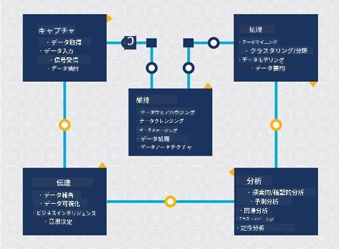
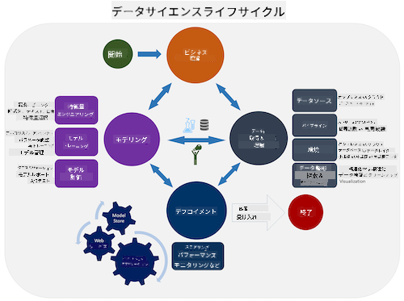
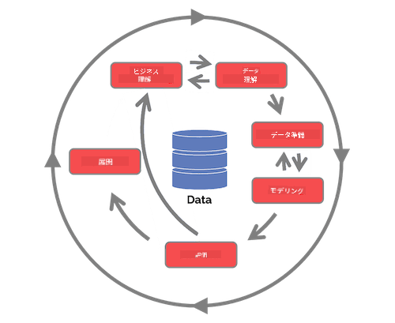

<!--
CO_OP_TRANSLATOR_METADATA:
{
  "original_hash": "c368f8f2506fe56bca0f7be05c4eb71d",
  "translation_date": "2025-08-25T17:43:32+00:00",
  "source_file": "4-Data-Science-Lifecycle/14-Introduction/README.md",
  "language_code": "ja"
}
-->
# データサイエンスライフサイクルの紹介

| ](../../sketchnotes/14-DataScience-Lifecycle.png)|
|:---:|
| データサイエンスライフサイクルの紹介 - _スケッチノート by [@nitya](https://twitter.com/nitya)_ |

## [講義前クイズ](https://red-water-0103e7a0f.azurestaticapps.net/quiz/26)

ここまでで、データサイエンスがプロセスであることに気づいたかもしれません。このプロセスは以下の5つの段階に分けることができます：

- データの収集
- 処理
- 分析
- コミュニケーション
- 保守

このレッスンでは、ライフサイクルの3つの部分、収集、処理、保守に焦点を当てます。

> 写真提供 [Berkeley School of Information](https://ischoolonline.berkeley.edu/data-science/what-is-data-science/)

## データの収集

ライフサイクルの最初の段階は非常に重要です。次の段階はこれに依存しているためです。この段階は、データの取得と目的や解決すべき問題の定義という2つのステージが組み合わさったものです。  
プロジェクトの目標を定義するには、問題や質問に対する深い理解が必要です。まず、問題を解決する必要がある人々を特定し、取得する必要があります。これらは、ビジネスの利害関係者やプロジェクトのスポンサーである可能性があり、プロジェクトが誰に、何に、なぜ役立つのかを特定する手助けをしてくれます。明確に定義された目標は、受け入れ可能な結果を定義するために測定可能で定量的であるべきです。

データサイエンティストが尋ねる可能性のある質問：
- この問題は以前に取り組まれたことがあるか？何が発見されたか？
- 関係者全員が目的と目標を理解しているか？
- 曖昧さはあるか？それをどう減らすか？
- 制約は何か？
- 最終的な結果はどのようなものになる可能性があるか？
- 利用可能なリソース（時間、人員、計算能力）はどれくらいか？

次に、目標を達成するために必要なデータを特定し、収集し、探索します。この取得の段階では、データサイエンティストはデータの量と質を評価する必要があります。これには、取得したデータが望ましい結果を達成するのに役立つかどうかを確認するためのデータ探索が含まれます。

データに関してデータサイエンティストが尋ねる可能性のある質問：
- すでに利用可能なデータは何か？
- このデータの所有者は誰か？
- プライバシーに関する懸念は何か？
- この問題を解決するのに十分なデータがあるか？
- この問題に対してデータの質は許容範囲か？
- このデータを通じて追加情報を発見した場合、目標を変更または再定義するべきか？

## 処理

ライフサイクルの処理段階では、データ内のパターンを発見し、モデリングを行います。この段階で使用されるいくつかの技術は、統計的手法を用いてパターンを明らかにします。通常、大規模なデータセットでは人間が手作業で行うには非常に手間がかかるため、コンピュータを使用してプロセスを迅速化します。この段階は、データサイエンスと機械学習が交差する部分でもあります。最初のレッスンで学んだように、機械学習はデータを理解するためのモデルを構築するプロセスです。モデルは、データ内の変数間の関係を表現し、結果を予測するのに役立ちます。

この段階で使用される一般的な技術は、ML for Beginnersカリキュラムで取り上げられています。以下のリンクから詳細を学ぶことができます：

- [分類](https://github.com/microsoft/ML-For-Beginners/tree/main/4-Classification): データをカテゴリに整理して効率的に利用する。
- [クラスタリング](https://github.com/microsoft/ML-For-Beginners/tree/main/5-Clustering): データを類似したグループに分ける。
- [回帰](https://github.com/microsoft/ML-For-Beginners/tree/main/2-Regression): 変数間の関係を特定し、値を予測または予測する。

## 保守

ライフサイクルの図では、保守が収集と処理の間に位置していることに気づいたかもしれません。保守は、プロジェクトの過程でデータを管理、保存、保護する継続的なプロセスであり、プロジェクト全体を通じて考慮されるべきです。

### データの保存
データがどのように、どこに保存されるかの考慮は、保存コストやデータのアクセス速度に影響を与える可能性があります。このような決定はデータサイエンティストだけで行われることは少ないですが、データの保存方法に基づいてデータを扱う方法を選択することになる場合があります。

現代のデータ保存システムのいくつかの側面：
**オンプレミス vs オフプレミス vs 公共またはプライベートクラウド**

オンプレミスは、自分の設備でデータを管理することを指します。例えば、サーバーを所有し、そのハードドライブにデータを保存することです。一方、オフプレミスは、自分が所有していない設備（例えばデータセンター）を利用することを指します。公共クラウドは、データがどこでどのように保存されているかを知らなくても利用できる人気の選択肢です。公共クラウドは、クラウドを利用するすべての人が共有する統一された基盤インフラを指します。一部の組織は厳格なセキュリティポリシーを持ち、データがホストされている設備に完全にアクセスできる必要があるため、独自のクラウドサービスを提供するプライベートクラウドを利用します。[後のレッスン](https://github.com/microsoft/Data-Science-For-Beginners/tree/main/5-Data-Science-In-Cloud)でクラウド内のデータについてさらに学びます。

**コールドデータ vs ホットデータ**

モデルをトレーニングする際には、より多くのトレーニングデータが必要になる場合があります。モデルに満足している場合でも、モデルが目的を果たすために新しいデータが到着します。いずれの場合でも、データを蓄積するにつれて保存とアクセスのコストが増加します。あまり使用されないデータ（コールドデータ）を頻繁にアクセスされるデータ（ホットデータ）から分離することで、ハードウェアやソフトウェアサービスを通じて安価なデータ保存オプションを利用できます。コールドデータをアクセスする必要がある場合、ホットデータに比べて取得に少し時間がかかることがあります。

### データの管理
データを扱う中で、一部のデータをクリーンアップする必要があることに気づくかもしれません。これは、[データ準備](https://github.com/microsoft/Data-Science-For-Beginners/tree/main/2-Working-With-Data/08-data-preparation)に焦点を当てたレッスンで取り上げた技術を使用して正確なモデルを構築するためです。新しいデータが到着した場合、品質の一貫性を維持するために同じ技術を適用する必要があります。一部のプロジェクトでは、データを最終的な場所に移動する前に、クレンジング、集約、圧縮を自動化するツールを使用することがあります。Azure Data Factoryはそのようなツールの一例です。

### データの保護
データを保護する主な目標の1つは、データを扱う人々が収集される内容とその使用される文脈を管理できるようにすることです。データを安全に保つには、必要な人だけがアクセスできるように制限し、地域の法律や規制を遵守し、[倫理のレッスン](https://github.com/microsoft/Data-Science-For-Beginners/tree/main/1-Introduction/02-ethics)で取り上げた倫理基準を維持することが含まれます。

チームがセキュリティを考慮して行う可能性のあること：
- すべてのデータが暗号化されていることを確認する
- 顧客にデータの使用方法について情報を提供する
- プロジェクトを離れた人からデータアクセスを削除する
- 特定のプロジェクトメンバーだけがデータを変更できるようにする

## 🚀 チャレンジ

データサイエンスライフサイクルには多くのバージョンがあり、それぞれのステップには異なる名前や段階数があるかもしれませんが、このレッスンで述べたプロセスは含まれています。

[Team Data Science Processライフサイクル](https://docs.microsoft.com/en-us/azure/architecture/data-science-process/lifecycle)と[データマイニングのための業界標準プロセス](https://www.datascience-pm.com/crisp-dm-2/)を調査し、3つの類似点と相違点を挙げてください。

|Team Data Science Process (TDSP)|データマイニングのための業界標準プロセス (CRISP-DM)|
|--|--|
| |  |
| 画像提供 [Microsoft](https://docs.microsoft.comazure/architecture/data-science-process/lifecycle) | 画像提供 [Data Science Process Alliance](https://www.datascience-pm.com/crisp-dm-2/) |

## [講義後クイズ](https://red-water-0103e7a0f.azurestaticapps.net/quiz/27)

## 復習と自己学習

データサイエンスライフサイクルを適用するには、複数の役割とタスクが関与し、それぞれの段階の特定の部分に焦点を当てる場合があります。Team Data Science Processは、プロジェクトで誰がどのような役割やタスクを持つかを説明するいくつかのリソースを提供しています。

* [Team Data Science Processの役割とタスク](https://docs.microsoft.com/en-us/azure/architecture/data-science-process/roles-tasks)
* [データサイエンスタスクの実行：探索、モデリング、展開](https://docs.microsoft.com/en-us/azure/architecture/data-science-process/execute-data-science-tasks)

## 課題

[データセットの評価](assignment.md)

**免責事項**:  
この文書は、AI翻訳サービス [Co-op Translator](https://github.com/Azure/co-op-translator) を使用して翻訳されています。正確性を追求しておりますが、自動翻訳には誤りや不正確な部分が含まれる可能性があることをご承知ください。元の言語で記載された文書が正式な情報源とみなされるべきです。重要な情報については、専門の人間による翻訳を推奨します。この翻訳の使用に起因する誤解や誤解釈について、当社は責任を負いません。