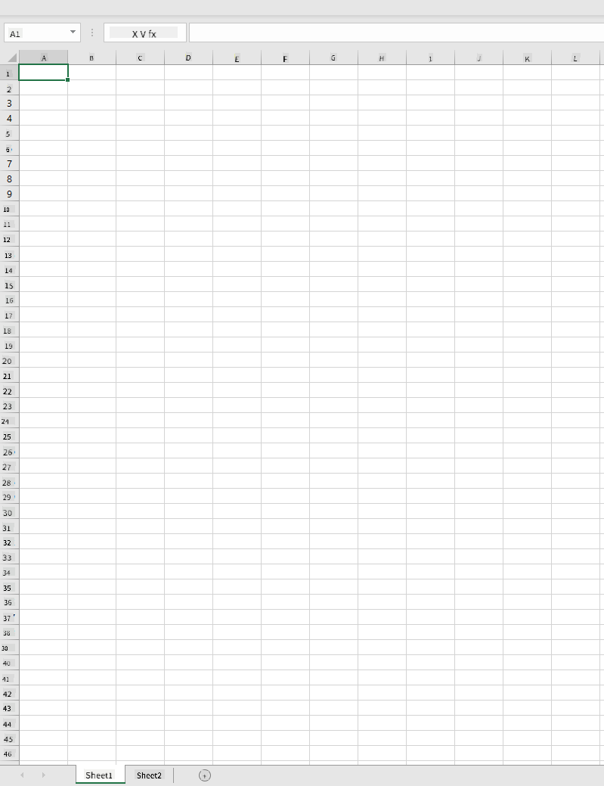
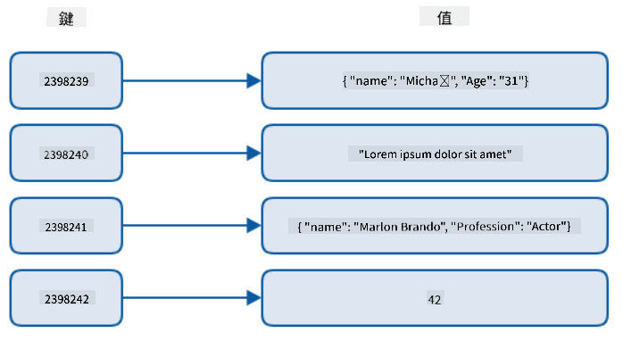
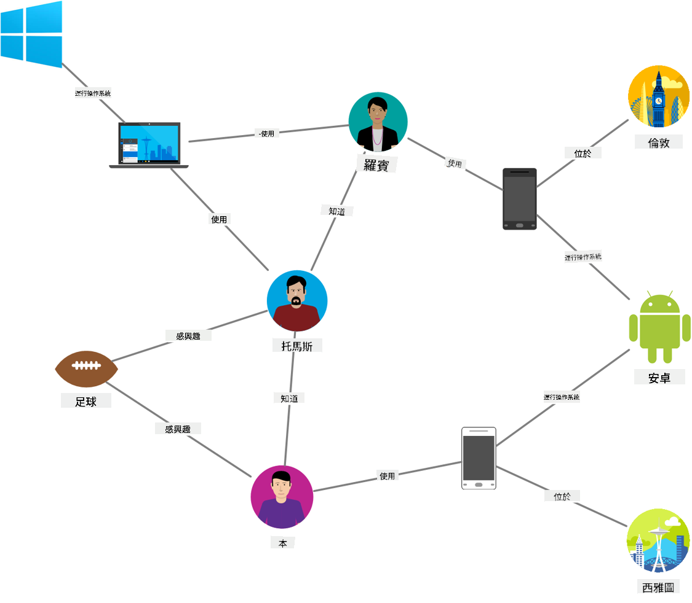
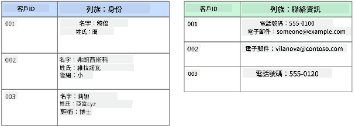
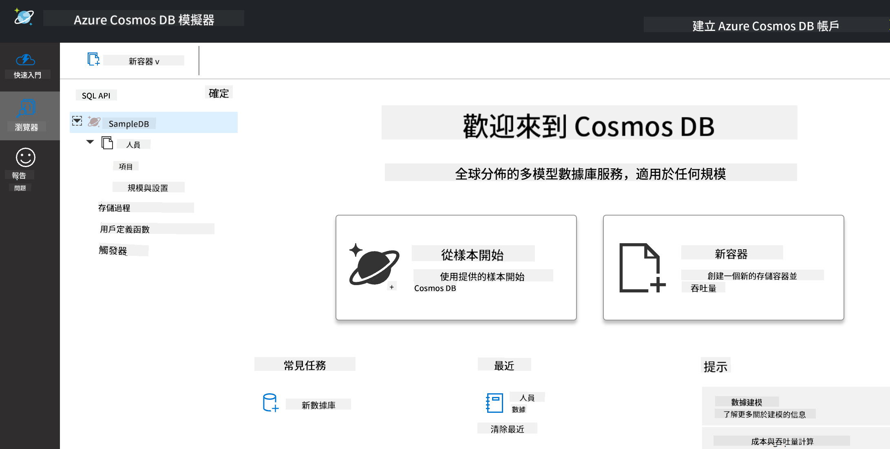
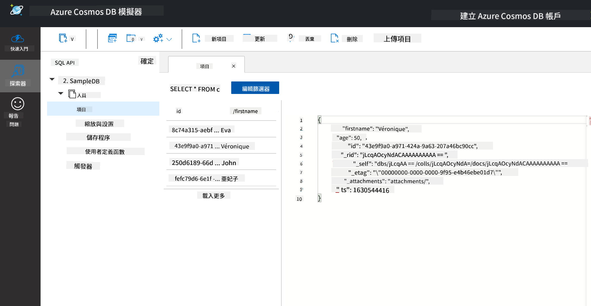
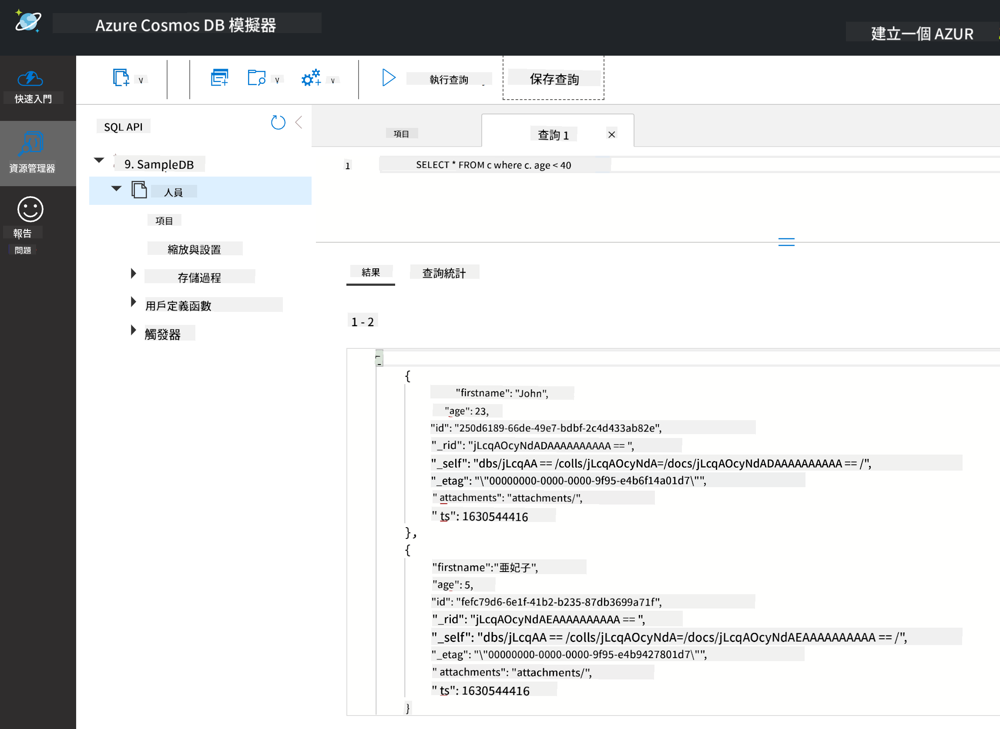

<!--
CO_OP_TRANSLATOR_METADATA:
{
  "original_hash": "32ddfef8121650f2ca2f3416fd283c37",
  "translation_date": "2025-08-27T08:39:49+00:00",
  "source_file": "2-Working-With-Data/06-non-relational/README.md",
  "language_code": "mo"
}
-->
# 使用數據：非關聯式數據

| 繪製的草圖筆記 ](../../sketchnotes/06-NoSQL.png)|
|:---:|
|使用 NoSQL 數據 - _草圖筆記由 [@nitya](https://twitter.com/nitya) 繪製_ |

## [課前測驗](https://purple-hill-04aebfb03.1.azurestaticapps.net/quiz/10)

數據並不限於關聯式數據庫。本課程專注於非關聯式數據，並將涵蓋試算表和 NoSQL 的基礎知識。

## 試算表

試算表是一種流行的數據存儲和探索方式，因為它的設置和使用起來相對簡單。在本課程中，您將學習試算表的基本組成部分，以及公式和函數。示例將以 Microsoft Excel 為例，但大多數部分和主題在其他試算表軟件中名稱和步驟相似。



試算表是一個文件，可以在計算機、設備或基於雲的文件系統中訪問。軟件本身可能是基於瀏覽器的，也可能是需要安裝在計算機上的應用程序，或者下載為應用程式。在 Excel 中，這些文件被定義為 **工作簿**，本課程將使用這一術語。

一個工作簿包含一個或多個 **工作表**，每個工作表通過標籤進行標記。在工作表中有稱為 **儲存格** 的矩形，這些儲存格包含實際數據。儲存格是行和列的交叉點，其中列用字母標記，行用數字標記。一些試算表會在前幾行中包含標題，用於描述儲存格中的數據。

了解了 Excel 工作簿的這些基本元素後，我們將使用來自 [Microsoft 模板](https://templates.office.com/) 的一個關於庫存的示例，來進一步了解試算表的其他部分。

### 管理庫存

名為 "InventoryExample" 的試算表文件是一個格式化的庫存項目試算表，包含三個工作表，標籤分別為 "Inventory List"、"Inventory Pick List" 和 "Bin Lookup"。在 Inventory List 工作表中，第 4 行是標題行，描述了標題列中每個儲存格的值。


有時，一個儲存格的值依賴於其他儲存格的值來生成。在 Inventory List 試算表中，我們記錄了庫存中每個項目的成本，但如果我們需要知道整個庫存的總價值該怎麼辦？[**公式**](https://support.microsoft.com/en-us/office/overview-of-formulas-34519a4e-1e8d-4f4b-84d4-d642c4f63263) 用於對儲存格數據執行操作，在此示例中用於計算庫存的成本。該試算表在 Inventory Value 列中使用了一個公式，通過將 QTY 標題下的數量與 COST 標題下的成本相乘來計算每個項目的價值。雙擊或高亮顯示一個儲存格即可查看公式。您會注意到，公式以等號開頭，後面是計算或操作。


我們還可以使用另一個公式將所有 Inventory Value 的值相加，從而獲得其總價值。雖然可以通過逐一相加每個儲存格來計算總和，但這樣做會非常繁瑣。Excel 提供了 [**函數**](https://support.microsoft.com/en-us/office/sum-function-043e1c7d-7726-4e80-8f32-07b23e057f89)，即預定義的公式，用於對儲存格值進行計算。函數需要參數，即執行這些計算所需的值。如果函數需要多個參數，則需要按特定順序列出，否則函數可能無法正確計算值。在此示例中，我們使用了 SUM 函數，並使用 Inventory Value 的值作為參數來生成總和，該總和列於第 3 行，第 B 列（也稱為 B3）。

## NoSQL

NoSQL 是一個總稱，涵蓋了存儲非關聯式數據的不同方式，可以解釋為 "非 SQL"、"非關聯式" 或 "不僅僅是 SQL"。這類數據庫系統可以分為四種類型。


> 來源：[Michał Białecki Blog](https://www.michalbialecki.com/2018/03/18/azure-cosmos-db-key-value-database-cloud/)

[鍵值](https://docs.microsoft.com/en-us/azure/architecture/data-guide/big-data/non-relational-data#keyvalue-data-stores) 數據庫將唯一鍵（作為唯一標識符）與值配對。這些配對使用 [哈希表](https://www.hackerearth.com/practice/data-structures/hash-tables/basics-of-hash-tables/tutorial/) 和適當的哈希函數進行存儲。


> 來源：[Microsoft](https://docs.microsoft.com/en-us/azure/cosmos-db/graph/graph-introduction#graph-database-by-example)

[圖形](https://docs.microsoft.com/en-us/azure/architecture/data-guide/big-data/non-relational-data#graph-data-stores) 數據庫描述數據中的關係，並以節點和邊的集合表示。節點代表實體，即現實世界中存在的事物，例如學生或銀行對賬單。邊則表示兩個實體之間的關係。每個節點和邊都有屬性，提供有關節點和邊的附加信息。



[列式](https://docs.microsoft.com/en-us/azure/architecture/data-guide/big-data/non-relational-data#columnar-data-stores) 數據存儲將數據組織為列和行，類似於關聯式數據結構，但每列被劃分為稱為列族的組，其中一列下的所有數據是相關的，可以作為一個單元檢索和更改。

### 使用 Azure Cosmos DB 的文檔數據存儲

[文檔](https://docs.microsoft.com/en-us/azure/architecture/data-guide/big-data/non-relational-data#document-data-stores) 數據存儲基於鍵值數據存儲的概念，由一系列字段和對象組成。本節將通過 Cosmos DB 模擬器探索文檔數據庫。

Cosmos DB 數據庫符合 "不僅僅是 SQL" 的定義，其中 Cosmos DB 的文檔數據庫依賴於 SQL 來查詢數據。[上一課](../05-relational-databases/README.md) 涵蓋了 SQL 的基礎知識，我們可以在這裡將一些相同的查詢應用於文檔數據庫。我們將使用 Cosmos DB 模擬器，該模擬器允許我們在計算機上本地創建和探索文檔數據庫。更多有關模擬器的信息請參閱[此處](https://docs.microsoft.com/en-us/azure/cosmos-db/local-emulator?tabs=ssl-netstd21)。

文檔是字段和對象值的集合，其中字段描述對象值的含義。以下是一個文檔示例。

```json
{
    "firstname": "Eva",
    "age": 44,
    "id": "8c74a315-aebf-4a16-bb38-2430a9896ce5",
    "_rid": "bHwDAPQz8s0BAAAAAAAAAA==",
    "_self": "dbs/bHwDAA==/colls/bHwDAPQz8s0=/docs/bHwDAPQz8s0BAAAAAAAAAA==/",
    "_etag": "\"00000000-0000-0000-9f95-010a691e01d7\"",
    "_attachments": "attachments/",
    "_ts": 1630544034
}
```

此文檔中的關鍵字段包括：`firstname`、`id` 和 `age`。其餘帶下劃線的字段是由 Cosmos DB 自動生成的。

#### 使用 Cosmos DB 模擬器探索數據

您可以[在此處下載並安裝 Windows 版模擬器](https://aka.ms/cosmosdb-emulator)。有關如何在 macOS 和 Linux 上運行模擬器的選項，請參閱[此文檔](https://docs.microsoft.com/en-us/azure/cosmos-db/local-emulator?tabs=ssl-netstd21#run-on-linux-macos)。

模擬器會啟動一個瀏覽器窗口，其中的 Explorer 視圖允許您探索文檔。



如果您正在跟隨操作，點擊 "Start with Sample" 以生成一個名為 SampleDB 的示例數據庫。如果您點擊 SampleDB 左側的箭頭展開，您會發現一個名為 `Persons` 的容器。容器包含一系列項目，即容器內的文檔。您可以探索 `Items` 下的四個單獨文檔。



#### 使用 Cosmos DB 模擬器查詢文檔數據

我們還可以通過點擊 "New SQL Query" 按鈕（左側第二個按鈕）來查詢示例數據。

`SELECT * FROM c` 將返回容器中的所有文檔。我們可以添加一個 where 子句，查找年齡小於 40 的人。

`SELECT * FROM c where c.age < 40`



查詢返回了兩個文檔，注意每個文檔的 age 值都小於 40。

#### JSON 與文檔

如果您熟悉 JavaScript Object Notation (JSON)，您會發現文檔看起來與 JSON 類似。本目錄中有一個 `PersonsData.json` 文件，您可以將其上傳到模擬器中的 Persons 容器，方法是使用 `Upload Item` 按鈕。

在大多數情況下，返回 JSON 數據的 API 可以直接將數據傳輸並存儲到文檔數據庫中。以下是另一個文檔示例，它表示從 Microsoft Twitter 帳戶檢索的推文，這些推文是通過 Twitter API 獲取後插入到 Cosmos DB 中的。

```json
{
    "created_at": "2021-08-31T19:03:01.000Z",
    "id": "1432780985872142341",
    "text": "Blank slate. Like this tweet if you’ve ever painted in Microsoft Paint before. https://t.co/cFeEs8eOPK",
    "_rid": "dhAmAIUsA4oHAAAAAAAAAA==",
    "_self": "dbs/dhAmAA==/colls/dhAmAIUsA4o=/docs/dhAmAIUsA4oHAAAAAAAAAA==/",
    "_etag": "\"00000000-0000-0000-9f84-a0958ad901d7\"",
    "_attachments": "attachments/",
    "_ts": 1630537000
```

此文檔中的關鍵字段包括：`created_at`、`id` 和 `text`。

## 🚀 挑戰

目錄中有一個 `TwitterData.json` 文件，您可以將其上傳到 SampleDB 數據庫。建議您將其添加到一個單獨的容器中。操作步驟如下：

1. 點擊右上角的 "New Container" 按鈕
1. 選擇現有數據庫（SampleDB），為容器創建一個容器 ID
1. 將分區鍵設置為 `/id`
1. 點擊 OK（可以忽略此視圖中的其他信息，因為這是一個小型數據集，運行在您的本地機器上）
1. 打開新容器，使用 `Upload Item` 按鈕上傳 Twitter Data 文件

嘗試運行一些 SELECT 查詢，查找 text 字段中包含 Microsoft 的文檔。提示：嘗試使用 [LIKE 關鍵字](https://docs.microsoft.com/en-us/azure/cosmos-db/sql/sql-query-keywords#using-like-with-the--wildcard-character)。

## [課後測驗](https://purple-hill-04aebfb03.1.azurestaticapps.net/quiz/11)

## 回顧與自學

- 該試算表中還添加了一些本課未涵蓋的格式和功能。如果您有興趣了解更多，Microsoft 提供了 [大量的 Excel 文檔和視頻](https://support.microsoft.com/excel)。

- 此架構文檔詳細介紹了不同類型非關聯式數據的特性：[非關聯式數據與 NoSQL](https://docs.microsoft.com/en-us/azure/architecture/data-guide/big-data/non-relational-data)。

- Cosmos DB 是一個基於雲的非關聯式數據庫，也可以存儲本課中提到的不同 NoSQL 類型。了解更多請參閱此 [Cosmos DB Microsoft Learn 模組](https://docs.microsoft.com/en-us/learn/paths/work-with-nosql-data-in-azure-cosmos-db/)。

## 作業

[Soda Profits](assignment.md)

---

**免責聲明**：  
本文檔已使用 AI 翻譯服務 [Co-op Translator](https://github.com/Azure/co-op-translator) 進行翻譯。我們致力於提供準確的翻譯，但請注意，自動翻譯可能包含錯誤或不準確之處。應以原始語言的文件作為權威來源。對於關鍵信息，建議尋求專業人工翻譯。我們對因使用此翻譯而引起的任何誤解或錯誤解讀概不負責。