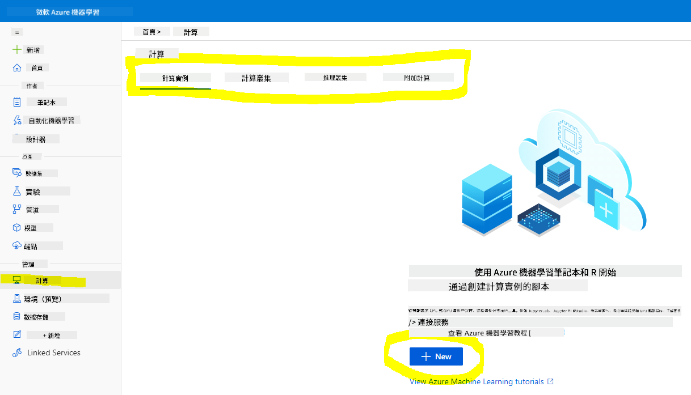

<!--
CO_OP_TRANSLATOR_METADATA:
{
  "original_hash": "73dead89dc2ddda4d6ec0232814a191e",
  "translation_date": "2025-08-27T09:43:43+00:00",
  "source_file": "5-Data-Science-In-Cloud/19-Azure/README.md",
  "language_code": "mo"
}
-->
# 雲端中的數據科學：Azure ML SDK 的方法

| 繪製的速寫筆記](../../sketchnotes/19-DataScience-Cloud.png)|
|:---:|
| 雲端中的數據科學：Azure ML SDK - _由 [@nitya](https://twitter.com/nitya) 繪製的速寫筆記_ |

目錄：

- [雲端中的數據科學：Azure ML SDK 的方法](../../../../5-Data-Science-In-Cloud/19-Azure)
  - [課前測驗](../../../../5-Data-Science-In-Cloud/19-Azure)
  - [1. 簡介](../../../../5-Data-Science-In-Cloud/19-Azure)
    - [1.1 什麼是 Azure ML SDK？](../../../../5-Data-Science-In-Cloud/19-Azure)
    - [1.2 心臟衰竭預測項目和數據集介紹](../../../../5-Data-Science-In-Cloud/19-Azure)
  - [2. 使用 Azure ML SDK 訓練模型](../../../../5-Data-Science-In-Cloud/19-Azure)
    - [2.1 建立 Azure ML 工作區](../../../../5-Data-Science-In-Cloud/19-Azure)
    - [2.2 建立計算實例](../../../../5-Data-Science-In-Cloud/19-Azure)
    - [2.3 加載數據集](../../../../5-Data-Science-In-Cloud/19-Azure)
    - [2.4 建立筆記本](../../../../5-Data-Science-In-Cloud/19-Azure)
    - [2.5 訓練模型](../../../../5-Data-Science-In-Cloud/19-Azure)
      - [2.5.1 設置工作區、實驗、計算集群和數據集](../../../../5-Data-Science-In-Cloud/19-Azure)
      - [2.5.2 AutoML 配置和訓練](../../../../5-Data-Science-In-Cloud/19-Azure)
  - [3. 使用 Azure ML SDK 部署模型和消費端點](../../../../5-Data-Science-In-Cloud/19-Azure)
    - [3.1 保存最佳模型](../../../../5-Data-Science-In-Cloud/19-Azure)
    - [3.2 模型部署](../../../../5-Data-Science-In-Cloud/19-Azure)
    - [3.3 消費端點](../../../../5-Data-Science-In-Cloud/19-Azure)
  - [🚀 挑戰](../../../../5-Data-Science-In-Cloud/19-Azure)
  - [課後測驗](../../../../5-Data-Science-In-Cloud/19-Azure)
  - [回顧與自學](../../../../5-Data-Science-In-Cloud/19-Azure)
  - [作業](../../../../5-Data-Science-In-Cloud/19-Azure)

## [課前測驗](https://purple-hill-04aebfb03.1.azurestaticapps.net/quiz/36)

## 1. 簡介

### 1.1 什麼是 Azure ML SDK？

數據科學家和 AI 開發者使用 Azure 機器學習 SDK 與 Azure 機器學習服務一起構建和運行機器學習工作流。您可以在任何 Python 環境中與該服務交互，包括 Jupyter Notebooks、Visual Studio Code 或您喜愛的 Python IDE。

SDK 的主要功能包括：

- 探索、準備和管理機器學習實驗中使用的數據集的生命周期。
- 管理雲端資源以監控、記錄和組織您的機器學習實驗。
- 使用本地或雲端資源（包括 GPU 加速的模型訓練）訓練模型。
- 使用自動化機器學習，該功能接受配置參數和訓練數據，並自動迭代算法和超參數設置以找到最佳模型進行預測。
- 部署 Web 服務，將訓練好的模型轉換為可在任何應用中使用的 RESTful 服務。

[了解更多關於 Azure 機器學習 SDK 的信息](https://docs.microsoft.com/python/api/overview/azure/ml?WT.mc_id=academic-77958-bethanycheum&ocid=AID3041109)

在[上一課](../18-Low-Code/README.md)中，我們學習了如何以低代碼/無代碼的方式訓練、部署和使用模型。我們使用了心臟衰竭數據集來生成心臟衰竭預測模型。在本課中，我們將使用 Azure 機器學習 SDK 完成相同的任務。


### 1.2 心臟衰竭預測項目和數據集介紹

查看[此處](../18-Low-Code/README.md)了解心臟衰竭預測項目和數據集的介紹。

## 2. 使用 Azure ML SDK 訓練模型
### 2.1 建立 Azure ML 工作區

為了簡化操作，我們將在 Jupyter Notebook 中工作。這意味著您已經擁有一個工作區和計算實例。如果您已經有工作區，可以直接跳到 2.3 筆記本創建部分。

如果沒有，請按照[上一課](../18-Low-Code/README.md)中 **2.1 建立 Azure ML 工作區** 的指示來建立工作區。

### 2.2 建立計算實例

在我們之前建立的 [Azure ML 工作區](https://ml.azure.com/) 中，進入計算菜單，您將看到不同的計算資源。



讓我們建立一個計算實例來提供 Jupyter Notebook。
1. 點擊 + New 按鈕。
2. 為您的計算實例命名。
3. 選擇您的選項：CPU 或 GPU、VM 大小和核心數量。
4. 點擊 Create 按鈕。

恭喜，您剛剛建立了一個計算實例！我們將在[建立筆記本部分](../../../../5-Data-Science-In-Cloud/19-Azure)中使用此計算實例。

### 2.3 加載數據集
如果您尚未上傳數據集，請參考[上一課](../18-Low-Code/README.md)中的 **2.3 加載數據集** 部分。

### 2.4 建立筆記本

> **_注意:_** 接下來的步驟，您可以選擇從頭建立一個新的筆記本，或者上傳我們之前建立的 [筆記本](notebook.ipynb) 到您的 Azure ML Studio。要上傳，只需點擊 "Notebook" 菜單並上傳筆記本。

筆記本是數據科學過程中非常重要的一部分。它們可以用於進行探索性數據分析（EDA）、調用計算集群訓練模型、調用推理集群部署端點。

要建立筆記本，我們需要一個提供 Jupyter Notebook 實例的計算節點。返回 [Azure ML 工作區](https://ml.azure.com/) 並點擊計算實例。在計算實例列表中，您應該看到[我們之前建立的計算實例](../../../../5-Data-Science-In-Cloud/19-Azure)。

1. 在 Applications 部分，點擊 Jupyter 選項。
2. 勾選 "Yes, I understand" 框並點擊 Continue 按鈕。

3. 這將在瀏覽器中打開一個新的標籤頁，顯示您的 Jupyter Notebook 實例。點擊 "New" 按鈕建立筆記本。


現在我們有了一個筆記本，可以開始使用 Azure ML SDK 訓練模型。

### 2.5 訓練模型

首先，如果您有任何疑問，請參考 [Azure ML SDK 文檔](https://docs.microsoft.com/python/api/overview/azure/ml?WT.mc_id=academic-77958-bethanycheum&ocid=AID3041109)。它包含了理解我們在本課中將看到的模塊所需的所有信息。

#### 2.5.1 設置工作區、實驗、計算集群和數據集

您需要使用以下代碼從配置文件加載 `workspace`：

```python
from azureml.core import Workspace
ws = Workspace.from_config()
```

這將返回一個表示工作區的 `Workspace` 類型的對象。接著，您需要使用以下代碼建立一個 `experiment`：

```python
from azureml.core import Experiment
experiment_name = 'aml-experiment'
experiment = Experiment(ws, experiment_name)
```
要從工作區獲取或建立實驗，您需要使用實驗名稱請求實驗。實驗名稱必須是 3-36 個字符，並以字母或數字開頭，只能包含字母、數字、下劃線和連字符。如果在工作區中找不到實驗，則會建立一個新的實驗。

現在，您需要使用以下代碼建立一個計算集群進行訓練。請注意，此步驟可能需要幾分鐘。

```python
from azureml.core.compute import AmlCompute

aml_name = "heart-f-cluster"
try:
    aml_compute = AmlCompute(ws, aml_name)
    print('Found existing AML compute context.')
except:
    print('Creating new AML compute context.')
    aml_config = AmlCompute.provisioning_configuration(vm_size = "Standard_D2_v2", min_nodes=1, max_nodes=3)
    aml_compute = AmlCompute.create(ws, name = aml_name, provisioning_configuration = aml_config)
    aml_compute.wait_for_completion(show_output = True)

cts = ws.compute_targets
compute_target = cts[aml_name]
```

您可以通過數據集名稱從工作區獲取數據集，如下所示：

```python
dataset = ws.datasets['heart-failure-records']
df = dataset.to_pandas_dataframe()
df.describe()
```
#### 2.5.2 AutoML 配置和訓練

要設置 AutoML 配置，請使用 [AutoMLConfig 類](https://docs.microsoft.com/python/api/azureml-train-automl-client/azureml.train.automl.automlconfig(class)?WT.mc_id=academic-77958-bethanycheum&ocid=AID3041109)。

如文檔所述，您可以使用許多參數進行配置。對於本項目，我們將使用以下參數：

- `experiment_timeout_minutes`：實驗允許運行的最大時間（以分鐘為單位），超過此時間後實驗將自動停止並生成結果。
- `max_concurrent_iterations`：實驗允許的最大並發訓練迭代次數。
- `primary_metric`：用於確定實驗狀態的主要指標。
- `compute_target`：運行自動化機器學習實驗的 Azure 機器學習計算目標。
- `task`：要運行的任務類型。值可以是 'classification'、'regression' 或 'forecasting'，取決於要解決的自動化機器學習問題類型。
- `training_data`：實驗中使用的訓練數據。它應包含訓練特徵和標籤列（可選的樣本權重列）。
- `label_column_name`：標籤列的名稱。
- `path`：Azure 機器學習項目文件夾的完整路徑。
- `enable_early_stopping`：是否啟用早期終止，如果短期內分數沒有改善則終止。
- `featurization`：指示是否應自動完成特徵化步驟，或者是否使用自定義特徵化。
- `debug_log`：用於寫入調試信息的日誌文件。

```python
from azureml.train.automl import AutoMLConfig

project_folder = './aml-project'

automl_settings = {
    "experiment_timeout_minutes": 20,
    "max_concurrent_iterations": 3,
    "primary_metric" : 'AUC_weighted'
}

automl_config = AutoMLConfig(compute_target=compute_target,
                             task = "classification",
                             training_data=dataset,
                             label_column_name="DEATH_EVENT",
                             path = project_folder,  
                             enable_early_stopping= True,
                             featurization= 'auto',
                             debug_log = "automl_errors.log",
                             **automl_settings
                            )
```
現在您已設置好配置，可以使用以下代碼訓練模型。此步驟可能需要一小時，具體取決於集群大小。

```python
remote_run = experiment.submit(automl_config)
```
您可以運行 RunDetails 小部件來顯示不同的實驗。
```python
from azureml.widgets import RunDetails
RunDetails(remote_run).show()
```
## 3. 使用 Azure ML SDK 部署模型和消費端點

### 3.1 保存最佳模型

`remote_run` 是 [AutoMLRun](https://docs.microsoft.com/python/api/azureml-train-automl-client/azureml.train.automl.run.automlrun?WT.mc_id=academic-77958-bethanycheum&ocid=AID3041109) 類型的對象。此對象包含 `get_output()` 方法，該方法返回最佳運行及其相應的擬合模型。

```python
best_run, fitted_model = remote_run.get_output()
```
您可以通過打印 fitted_model 查看最佳模型使用的參數，並使用 [get_properties()](https://docs.microsoft.com/python/api/azureml-core/azureml.core.run(class)?view=azure-ml-py#azureml_core_Run_get_properties?WT.mc_id=academic-77958-bethanycheum&ocid=AID3041109) 方法查看最佳模型的屬性。

```python
best_run.get_properties()
```

現在使用 [register_model](https://docs.microsoft.com/python/api/azureml-train-automl-client/azureml.train.automl.run.automlrun?view=azure-ml-py#register-model-model-name-none--description-none--tags-none--iteration-none--metric-none-?WT.mc_id=academic-77958-bethanycheum&ocid=AID3041109) 方法註冊模型。
```python
model_name = best_run.properties['model_name']
script_file_name = 'inference/score.py'
best_run.download_file('outputs/scoring_file_v_1_0_0.py', 'inference/score.py')
description = "aml heart failure project sdk"
model = best_run.register_model(model_name = model_name,
                                model_path = './outputs/',
                                description = description,
                                tags = None)
```
### 3.2 模型部署

保存最佳模型後，我們可以使用 [InferenceConfig](https://docs.microsoft.com/python/api/azureml-core/azureml.core.model.inferenceconfig?view=azure-ml-py?ocid=AID3041109) 類進行部署。InferenceConfig 表示用於部署的自定義環境的配置設置。[AciWebservice](https://docs.microsoft.com/python/api/azureml-core/azureml.core.webservice.aciwebservice?view=azure-ml-py) 類表示部署為 Azure 容器實例上的 Web 服務端點的機器學習模型。部署的服務由模型、腳本和相關文件創建。生成的 Web 服務是一個負載均衡的 HTTP 端點，具有 REST API。您可以向此 API 發送數據並接收模型返回的預測。

模型使用 [deploy](https://docs.microsoft.com/python/api/azureml-core/azureml.core.model(class)?view=azure-ml-py#deploy-workspace--name--models--inference-config-none--deployment-config-none--deployment-target-none--overwrite-false--show-output-false-?WT.mc_id=academic-77958-bethanycheum&ocid=AID3041109) 方法進行部署。

```python
from azureml.core.model import InferenceConfig, Model
from azureml.core.webservice import AciWebservice

inference_config = InferenceConfig(entry_script=script_file_name, environment=best_run.get_environment())

aciconfig = AciWebservice.deploy_configuration(cpu_cores = 1,
                                               memory_gb = 1,
                                               tags = {'type': "automl-heart-failure-prediction"},
                                               description = 'Sample service for AutoML Heart Failure Prediction')

aci_service_name = 'automl-hf-sdk'
aci_service = Model.deploy(ws, aci_service_name, [model], inference_config, aciconfig)
aci_service.wait_for_deployment(True)
print(aci_service.state)
```
此步驟可能需要幾分鐘。

### 3.3 消費端點

您可以通過建立一個樣本輸入來使用您的端點：

```python
data = {
    "data":
    [
        {
            'age': "60",
            'anaemia': "false",
            'creatinine_phosphokinase': "500",
            'diabetes': "false",
            'ejection_fraction': "38",
            'high_blood_pressure': "false",
            'platelets': "260000",
            'serum_creatinine': "1.40",
            'serum_sodium': "137",
            'sex': "false",
            'smoking': "false",
            'time': "130",
        },
    ],
}

test_sample = str.encode(json.dumps(data))
```
然後，您可以將此輸入發送到您的模型進行預測：
```python
response = aci_service.run(input_data=test_sample)
response
```
這應該輸出 `'{"result": [false]}'`。這表示我們傳送到端點的病患輸入生成了預測結果 `false`，也就是說這個人不太可能會心臟病發作。

恭喜！你剛剛使用 Azure ML SDK 成功消耗了在 Azure ML 上部署並訓練的模型！

> **_NOTE:_** 完成專案後，別忘了刪除所有資源。

## 🚀 挑戰

透過 SDK 還有許多其他功能可以實現，但很遺憾，我們無法在這堂課中全部介紹。不過好消息是，學會如何快速瀏覽 SDK 文件可以幫助你在學習路上走得更遠。查看 Azure ML SDK 文件，找到允許你建立管道的 `Pipeline` 類別。管道是一系列可以作為工作流程執行的步驟集合。

**提示：** 前往 [SDK 文件](https://docs.microsoft.com/python/api/overview/azure/ml/?view=azure-ml-py?WT.mc_id=academic-77958-bethanycheum&ocid=AID3041109)，在搜尋欄中輸入關鍵字如 "Pipeline"。你應該可以在搜尋結果中找到 `azureml.pipeline.core.Pipeline` 類別。

## [課後測驗](https://purple-hill-04aebfb03.1.azurestaticapps.net/quiz/37)

## 回顧與自學

在這堂課中，你學會了如何使用 Azure ML SDK 在雲端訓練、部署並消耗模型來預測心臟衰竭風險。查看這份 [文件](https://docs.microsoft.com/python/api/overview/azure/ml/?view=azure-ml-py?WT.mc_id=academic-77958-bethanycheum&ocid=AID3041109) 以獲取更多關於 Azure ML SDK 的資訊。試著使用 Azure ML SDK 建立你自己的模型。

## 作業

[使用 Azure ML SDK 的數據科學專案](assignment.md)

---

**免責聲明**：  
本文件使用 AI 翻譯服務 [Co-op Translator](https://github.com/Azure/co-op-translator) 進行翻譯。我們致力於提供準確的翻譯，但請注意，自動翻譯可能包含錯誤或不準確之處。應以原文文件作為權威來源。對於關鍵資訊，建議尋求專業人工翻譯。我們對因使用此翻譯而引起的任何誤解或誤讀概不負責。