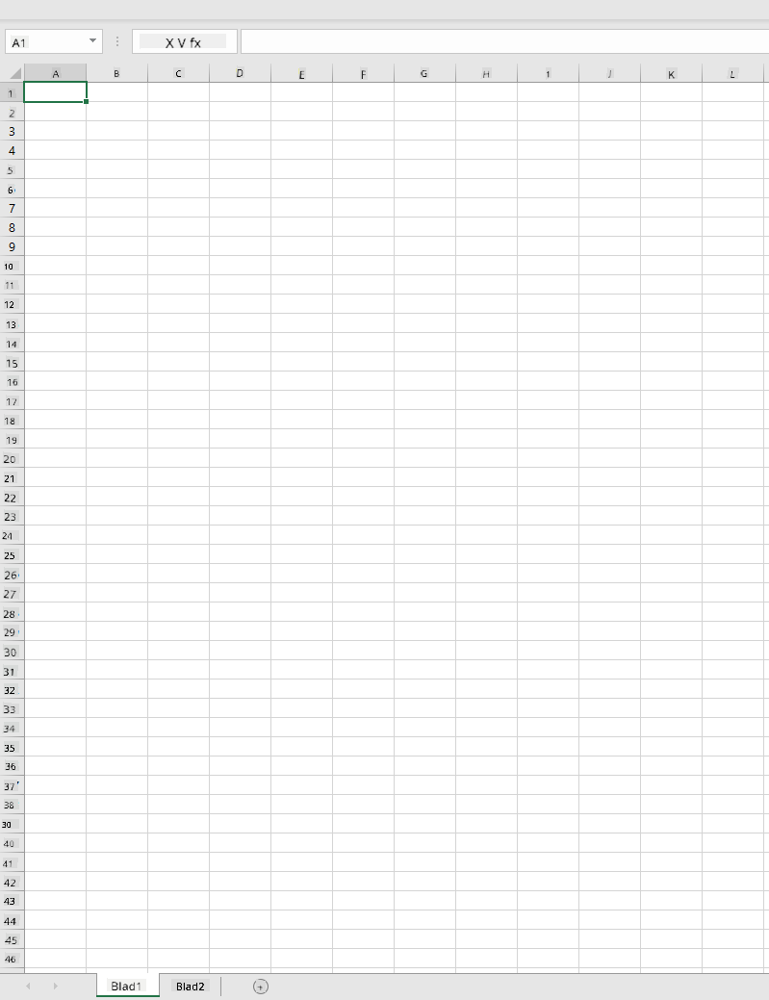
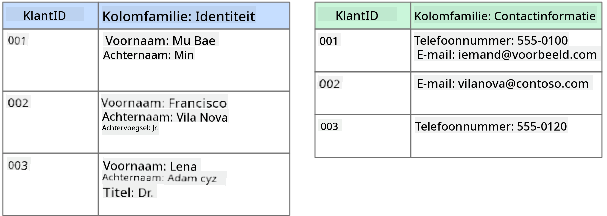
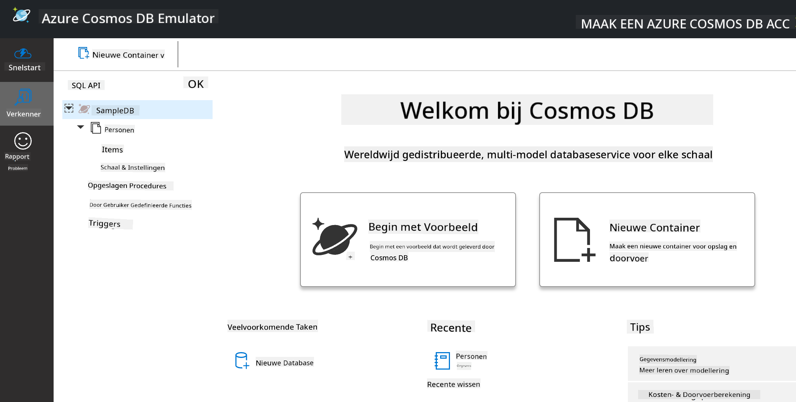
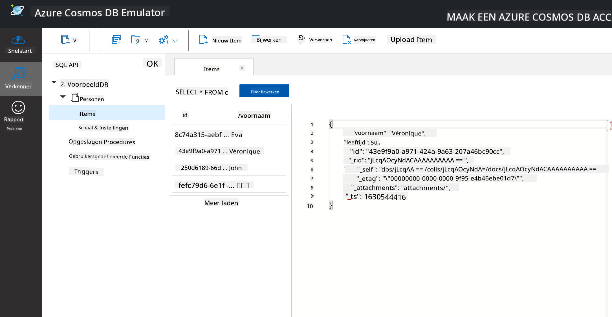
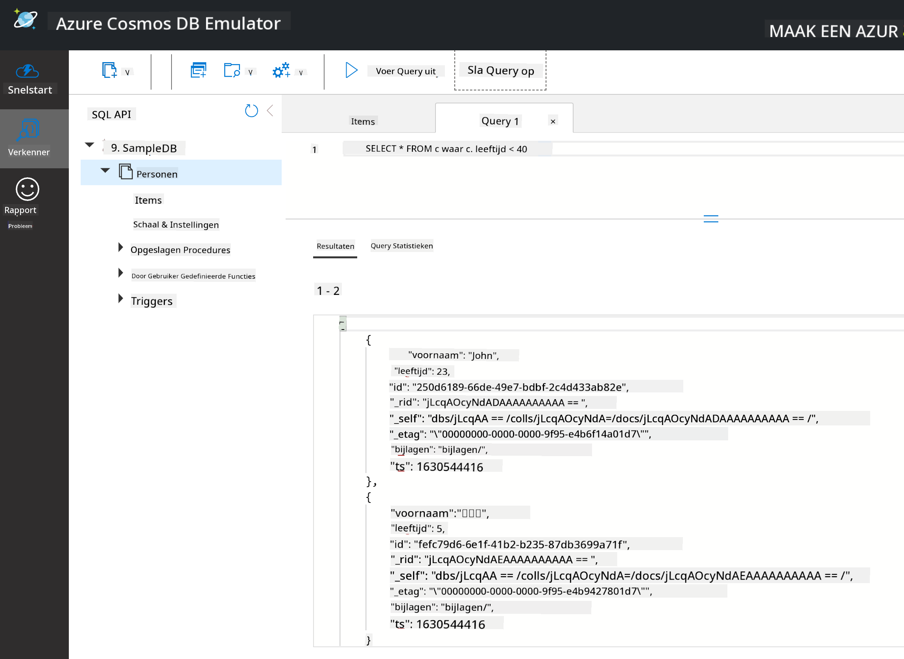

<!--
CO_OP_TRANSLATOR_METADATA:
{
  "original_hash": "32ddfef8121650f2ca2f3416fd283c37",
  "translation_date": "2025-08-28T15:12:43+00:00",
  "source_file": "2-Working-With-Data/06-non-relational/README.md",
  "language_code": "nl"
}
-->
# Werken met Gegevens: Niet-Relationele Gegevens

| ](../../sketchnotes/06-NoSQL.png)|
|:---:|
|Werken met NoSQL-gegevens - _Sketchnote door [@nitya](https://twitter.com/nitya)_ |

## [Quiz voor de Les](https://purple-hill-04aebfb03.1.azurestaticapps.net/quiz/10)

Gegevens zijn niet beperkt tot relationele databases. Deze les richt zich op niet-relationele gegevens en behandelt de basis van spreadsheets en NoSQL.

## Spreadsheets

Spreadsheets zijn een populaire manier om gegevens op te slaan en te verkennen, omdat het minder werk vereist om op te zetten en te beginnen. In deze les leer je de basisonderdelen van een spreadsheet, evenals formules en functies. De voorbeelden worden geïllustreerd met Microsoft Excel, maar de meeste onderdelen en onderwerpen hebben vergelijkbare namen en stappen in vergelijking met andere spreadsheetsoftware.



Een spreadsheet is een bestand en zal toegankelijk zijn in het bestandssysteem van een computer, apparaat of cloudgebaseerd bestandssysteem. De software zelf kan browsergebaseerd zijn of een applicatie die op een computer moet worden geïnstalleerd of als app moet worden gedownload. In Excel worden deze bestanden ook gedefinieerd als **werkboeken**, en deze terminologie zal in de rest van deze les worden gebruikt.

Een werkboek bevat een of meer **werkbladen**, waarbij elk werkblad wordt aangeduid met tabbladen. Binnen een werkblad bevinden zich rechthoeken genaamd **cellen**, die de daadwerkelijke gegevens bevatten. Een cel is het snijpunt van een rij en een kolom, waarbij de kolommen worden aangeduid met alfabetische tekens en de rijen numeriek worden aangeduid. Sommige spreadsheets bevatten kopteksten in de eerste paar rijen om de gegevens in een cel te beschrijven.

Met deze basiselementen van een Excel-werkboek gebruiken we een voorbeeld van [Microsoft Templates](https://templates.office.com/) gericht op een inventaris om enkele aanvullende onderdelen van een spreadsheet door te nemen.

### Beheren van een Inventaris

Het spreadsheetbestand genaamd "InventoryExample" is een geformatteerde spreadsheet van items binnen een inventaris die drie werkbladen bevat, waarbij de tabbladen zijn gelabeld als "Inventory List", "Inventory Pick List" en "Bin Lookup". Rij 4 van het werkblad Inventory List is de koptekst, die de waarde van elke cel in de koptekstkolom beschrijft.


Er zijn gevallen waarin een cel afhankelijk is van de waarden van andere cellen om zijn waarde te genereren. De spreadsheet Inventory List houdt de kosten van elk item in de inventaris bij, maar wat als we de waarde van alles in de inventaris willen weten? [**Formules**](https://support.microsoft.com/en-us/office/overview-of-formulas-34519a4e-1e8d-4f4b-84d4-d642c4f63263) voeren acties uit op celgegevens en worden in dit voorbeeld gebruikt om de kosten van de inventaris te berekenen. Deze spreadsheet gebruikte een formule in de kolom Inventory Value om de waarde van elk item te berekenen door de hoeveelheid onder de koptekst QTY te vermenigvuldigen met de kosten onder de koptekst COST. Door te dubbelklikken of een cel te markeren, wordt de formule weergegeven. Je zult merken dat formules beginnen met een gelijkteken, gevolgd door de berekening of bewerking.


We kunnen een andere formule gebruiken om alle waarden van Inventory Value bij elkaar op te tellen om de totale waarde te krijgen. Dit kan worden berekend door elke cel op te tellen, maar dat kan een tijdrovende taak zijn. Excel heeft [**functies**](https://support.microsoft.com/en-us/office/sum-function-043e1c7d-7726-4e80-8f32-07b23e057f89), of vooraf gedefinieerde formules om berekeningen uit te voeren op celwaarden. Functies vereisen argumenten, dit zijn de vereiste waarden die worden gebruikt om deze berekeningen uit te voeren. Wanneer functies meer dan één argument vereisen, moeten ze in een bepaalde volgorde worden vermeld, anders berekent de functie mogelijk niet de juiste waarde. Dit voorbeeld gebruikt de functie SOM, en gebruikt de waarden van Inventory Value als argument om het totaal te genereren dat wordt vermeld onder rij 3, kolom B (ook wel B3 genoemd).

## NoSQL

NoSQL is een overkoepelende term voor de verschillende manieren om niet-relationele gegevens op te slaan en kan worden geïnterpreteerd als "non-SQL", "niet-relationeel" of "niet alleen SQL". Deze soorten databasesystemen kunnen in vier typen worden gecategoriseerd.


> Bron van [Michał Białecki Blog](https://www.michalbialecki.com/2018/03/18/azure-cosmos-db-key-value-database-cloud/)

[Key-value](https://docs.microsoft.com/en-us/azure/architecture/data-guide/big-data/non-relational-data#keyvalue-data-stores) databases koppelen unieke sleutels, die een unieke identificatie zijn die is gekoppeld aan een waarde. Deze paren worden opgeslagen met behulp van een [hashtabel](https://www.hackerearth.com/practice/data-structures/hash-tables/basics-of-hash-tables/tutorial/) met een geschikte hashfunctie.


> Bron van [Microsoft](https://docs.microsoft.com/en-us/azure/cosmos-db/graph/graph-introduction#graph-database-by-example)

[Graph](https://docs.microsoft.com/en-us/azure/architecture/data-guide/big-data/non-relational-data#graph-data-stores) databases beschrijven relaties in gegevens en worden weergegeven als een verzameling knooppunten en randen. Een knooppunt vertegenwoordigt een entiteit, iets dat in de echte wereld bestaat, zoals een student of een bankafschrift. Randen vertegenwoordigen de relatie tussen twee entiteiten. Elk knooppunt en elke rand heeft eigenschappen die aanvullende informatie bieden over elk knooppunt en elke rand.



[Kolomgebaseerde](https://docs.microsoft.com/en-us/azure/architecture/data-guide/big-data/non-relational-data#columnar-data-stores) datastores organiseren gegevens in kolommen en rijen zoals een relationele datastructuur, maar elke kolom is verdeeld in groepen die kolomfamilies worden genoemd, waarbij alle gegevens onder één kolom gerelateerd zijn en in één keer kunnen worden opgehaald en gewijzigd.

### Documentdatastores met Azure Cosmos DB

[Document](https://docs.microsoft.com/en-us/azure/architecture/data-guide/big-data/non-relational-data#document-data-stores) datastores bouwen voort op het concept van een key-value datastore en bestaan uit een reeks velden en objecten. Dit gedeelte verkent documentdatabases met de Cosmos DB-emulator.

Een Cosmos DB-database past binnen de definitie van "Niet Alleen SQL", waarbij de documentdatabase van Cosmos DB afhankelijk is van SQL om de gegevens te bevragen. De [vorige les](../05-relational-databases/README.md) over SQL behandelt de basis van de taal, en we kunnen enkele van dezelfde queries toepassen op een documentdatabase hier. We gebruiken de Cosmos DB Emulator, waarmee we een documentdatabase lokaal op een computer kunnen maken en verkennen. Lees meer over de Emulator [hier](https://docs.microsoft.com/en-us/azure/cosmos-db/local-emulator?tabs=ssl-netstd21).

Een document is een verzameling velden en objectwaarden, waarbij de velden beschrijven wat de objectwaarde vertegenwoordigt. Hieronder staat een voorbeeld van een document.

```json
{
    "firstname": "Eva",
    "age": 44,
    "id": "8c74a315-aebf-4a16-bb38-2430a9896ce5",
    "_rid": "bHwDAPQz8s0BAAAAAAAAAA==",
    "_self": "dbs/bHwDAA==/colls/bHwDAPQz8s0=/docs/bHwDAPQz8s0BAAAAAAAAAA==/",
    "_etag": "\"00000000-0000-0000-9f95-010a691e01d7\"",
    "_attachments": "attachments/",
    "_ts": 1630544034
}
```

De velden van belang in dit document zijn: `firstname`, `id` en `age`. De rest van de velden met de underscores zijn gegenereerd door Cosmos DB.

#### Gegevens Verkennen met de Cosmos DB Emulator

Je kunt de emulator downloaden en installeren [voor Windows hier](https://aka.ms/cosmosdb-emulator). Raadpleeg deze [documentatie](https://docs.microsoft.com/en-us/azure/cosmos-db/local-emulator?tabs=ssl-netstd21#run-on-linux-macos) voor opties om de Emulator te draaien op macOS en Linux.

De Emulator opent een browservenster, waar de Explorer-weergave je in staat stelt documenten te verkennen.



Als je meedoet, klik dan op "Start with Sample" om een voorbeelddatabase genaamd SampleDB te genereren. Als je SampleDB uitvouwt door op de pijl te klikken, vind je een container genaamd `Persons`. Een container bevat een verzameling items, wat de documenten binnen de container zijn. Je kunt de vier individuele documenten onder `Items` verkennen.



#### Documentgegevens Bevragen met de Cosmos DB Emulator

We kunnen ook de voorbeeldgegevens bevragen door op de knop Nieuwe SQL-query te klikken (tweede knop van links).

`SELECT * FROM c` retourneert alle documenten in de container. Laten we een where-clausule toevoegen en iedereen jonger dan 40 vinden.

`SELECT * FROM c where c.age < 40`



De query retourneert twee documenten. Let op dat de leeftijdswaarde voor elk document kleiner is dan 40.

#### JSON en Documenten

Als je bekend bent met JavaScript Object Notation (JSON), zul je merken dat documenten lijken op JSON. Er is een `PersonsData.json`-bestand in deze map met meer gegevens die je kunt uploaden naar de container `Persons` in de Emulator via de knop `Upload Item`.

In de meeste gevallen kunnen API's die JSON-gegevens retourneren direct worden overgezet en opgeslagen in documentdatabases. Hieronder staat een ander document. Het vertegenwoordigt tweets van het Microsoft Twitter-account die zijn opgehaald met de Twitter API en vervolgens zijn ingevoerd in Cosmos DB.

```json
{
    "created_at": "2021-08-31T19:03:01.000Z",
    "id": "1432780985872142341",
    "text": "Blank slate. Like this tweet if you’ve ever painted in Microsoft Paint before. https://t.co/cFeEs8eOPK",
    "_rid": "dhAmAIUsA4oHAAAAAAAAAA==",
    "_self": "dbs/dhAmAA==/colls/dhAmAIUsA4o=/docs/dhAmAIUsA4oHAAAAAAAAAA==/",
    "_etag": "\"00000000-0000-0000-9f84-a0958ad901d7\"",
    "_attachments": "attachments/",
    "_ts": 1630537000
```

De velden van belang in dit document zijn: `created_at`, `id` en `text`.

## 🚀 Uitdaging

Er is een `TwitterData.json`-bestand dat je kunt uploaden naar de SampleDB-database. Het wordt aanbevolen om dit toe te voegen aan een aparte container. Dit kan worden gedaan door:

1. Op de knop Nieuwe container in de rechterbovenhoek te klikken
1. De bestaande database (SampleDB) te selecteren en een container-id voor de container te maken
1. De partitiesleutel in te stellen op `/id`
1. Op OK te klikken (je kunt de rest van de informatie in deze weergave negeren, aangezien dit een kleine dataset is die lokaal op je machine draait)
1. Je nieuwe container te openen en het TwitterData-bestand te uploaden met de knop `Upload Item`

Probeer een paar select-queries uit te voeren om de documenten te vinden die Microsoft in het tekstveld hebben. Tip: probeer het [LIKE-keyword](https://docs.microsoft.com/en-us/azure/cosmos-db/sql/sql-query-keywords#using-like-with-the--wildcard-character) te gebruiken.

## [Quiz na de Les](https://purple-hill-04aebfb03.1.azurestaticapps.net/quiz/11)

## Herhaling & Zelfstudie

- Er zijn enkele extra opmaakopties en functies toegevoegd aan deze spreadsheet die in deze les niet worden behandeld. Microsoft heeft een [grote bibliotheek met documentatie en video's](https://support.microsoft.com/excel) over Excel als je meer wilt leren.

- Deze architectuurdocumentatie beschrijft de kenmerken van de verschillende typen niet-relationele gegevens: [Niet-relationele Gegevens en NoSQL](https://docs.microsoft.com/en-us/azure/architecture/data-guide/big-data/non-relational-data)

- Cosmos DB is een cloudgebaseerde niet-relationele database die ook de verschillende NoSQL-typen kan opslaan die in deze les worden genoemd. Leer meer over deze typen in deze [Cosmos DB Microsoft Learn Module](https://docs.microsoft.com/en-us/learn/paths/work-with-nosql-data-in-azure-cosmos-db/)

## Opdracht

[Soda Profits](assignment.md)

---

**Disclaimer**:  
Dit document is vertaald met behulp van de AI-vertalingsservice [Co-op Translator](https://github.com/Azure/co-op-translator). Hoewel we streven naar nauwkeurigheid, willen we u erop wijzen dat geautomatiseerde vertalingen fouten of onnauwkeurigheden kunnen bevatten. Het originele document in de oorspronkelijke taal moet worden beschouwd als de gezaghebbende bron. Voor kritieke informatie wordt professionele menselijke vertaling aanbevolen. Wij zijn niet aansprakelijk voor misverstanden of verkeerde interpretaties die voortvloeien uit het gebruik van deze vertaling.