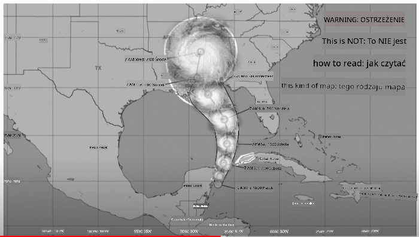
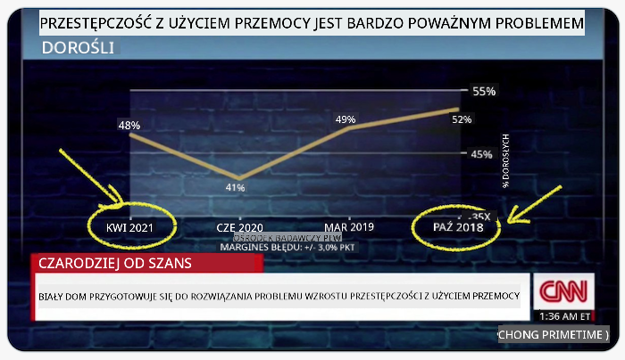
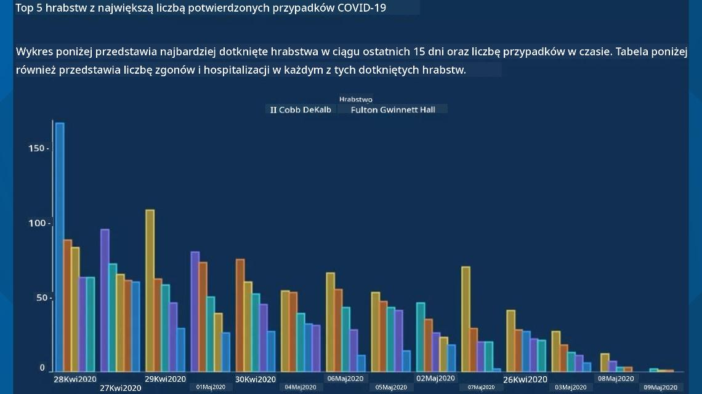
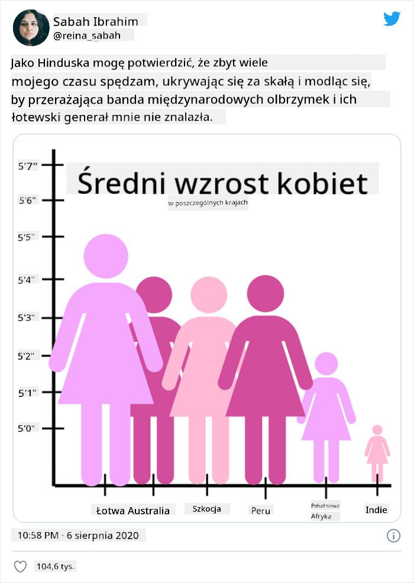
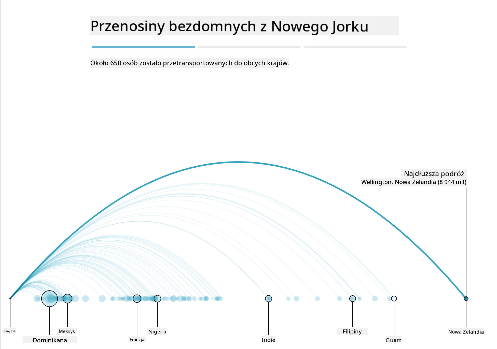
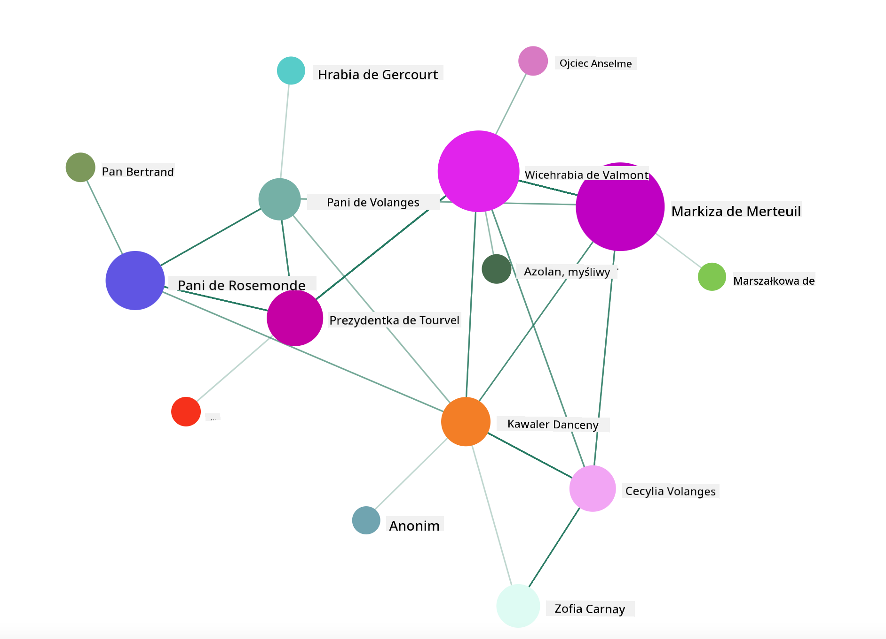

<!--
CO_OP_TRANSLATOR_METADATA:
{
  "original_hash": "4ec4747a9f4f7d194248ea29903ae165",
  "translation_date": "2025-08-24T22:32:13+00:00",
  "source_file": "3-Data-Visualization/13-meaningful-visualizations/README.md",
  "language_code": "pl"
}
-->
# Tworzenie Znaczących Wizualizacji

| ](../../sketchnotes/13-MeaningfulViz.png)|
|:---:|
| Znaczące Wizualizacje - _Sketchnote by [@nitya](https://twitter.com/nitya)_ |

> "Jeśli wystarczająco długo torturujesz dane, wyznają wszystko" -- [Ronald Coase](https://en.wikiquote.org/wiki/Ronald_Coase)

Jedną z podstawowych umiejętności data scientistów jest zdolność do tworzenia znaczących wizualizacji danych, które pomagają odpowiadać na pytania. Przed wizualizacją danych należy upewnić się, że zostały one oczyszczone i przygotowane, jak to robiliśmy w poprzednich lekcjach. Dopiero potem można zacząć decydować, jak najlepiej je zaprezentować.

W tej lekcji omówimy:

1. Jak wybrać odpowiedni typ wykresu
2. Jak unikać zwodniczych wykresów
3. Jak pracować z kolorem
4. Jak stylizować wykresy dla czytelności
5. Jak tworzyć animowane lub trójwymiarowe wykresy
6. Jak budować kreatywne wizualizacje

## [Quiz przed lekcją](https://purple-hill-04aebfb03.1.azurestaticapps.net/quiz/24)

## Wybór odpowiedniego typu wykresu

W poprzednich lekcjach eksperymentowaliśmy z tworzeniem różnych interesujących wizualizacji danych za pomocą Matplotlib i Seaborn. Ogólnie rzecz biorąc, można wybrać [odpowiedni typ wykresu](https://chartio.com/learn/charts/how-to-select-a-data-vizualization/) dla pytania, które zadajemy, korzystając z poniższej tabeli:

| Potrzebujesz:              | Powinieneś użyć:                |
| -------------------------- | ------------------------------- |
| Pokazać trendy danych w czasie | Liniowy                        |
| Porównać kategorie         | Słupkowy, Kołowy                |
| Porównać sumy              | Kołowy, Słupkowy warstwowy      |
| Pokazać relacje            | Punktowy, Liniowy, Facet, Podwójny liniowy |
| Pokazać rozkłady           | Punktowy, Histogram, Pudełkowy  |
| Pokazać proporcje          | Kołowy, Donut, Waffle           |

> ✅ W zależności od struktury danych, może być konieczne ich konwersja z tekstowych na numeryczne, aby dany typ wykresu mógł je obsłużyć.

## Unikanie zwodniczych wykresów

Nawet jeśli data scientist starannie wybierze odpowiedni wykres dla danych, istnieje wiele sposobów, w jakie dane mogą być przedstawione w sposób wspierający określony punkt widzenia, często kosztem ich wiarygodności. Istnieje wiele przykładów zwodniczych wykresów i infografik!

[](https://www.youtube.com/watch?v=oX74Nge8Wkw "Jak kłamią wykresy")

> 🎥 Kliknij obrazek powyżej, aby obejrzeć konferencyjną prezentację o zwodniczych wykresach

Ten wykres odwraca oś X, aby pokazać coś przeciwnego do prawdy, bazując na dacie:



[Ten wykres](https://media.firstcoastnews.com/assets/WTLV/images/170ae16f-4643-438f-b689-50d66ca6a8d8/170ae16f-4643-438f-b689-50d66ca6a8d8_1140x641.jpg) jest jeszcze bardziej zwodniczy, ponieważ wzrok kieruje się na prawo, aby wyciągnąć wniosek, że z czasem liczba przypadków COVID w różnych hrabstwach spadła. W rzeczywistości, jeśli przyjrzymy się datom, okazuje się, że zostały one przestawione, aby stworzyć fałszywy trend spadkowy.



Ten słynny przykład wykorzystuje kolor ORAZ odwróconą oś Y, aby wprowadzić w błąd: zamiast wnioskować, że liczba zgonów związanych z bronią wzrosła po uchwaleniu przyjaznych dla broni przepisów, wzrok zostaje oszukany, aby myśleć, że stało się odwrotnie:


Ten dziwny wykres pokazuje, jak proporcje mogą być manipulowane, co prowadzi do komicznego efektu:



Porównywanie rzeczy nieporównywalnych to kolejny nieuczciwy trik. Istnieje [świetna strona internetowa](https://tylervigen.com/spurious-correlations) poświęcona 'fałszywym korelacjom', pokazująca 'fakty' korelujące takie rzeczy jak wskaźnik rozwodów w Maine i spożycie margaryny. Grupa na Reddit również zbiera [brzydkie użycia](https://www.reddit.com/r/dataisugly/top/?t=all) danych.

Ważne jest, aby zrozumieć, jak łatwo wzrok może zostać oszukany przez zwodnicze wykresy. Nawet jeśli intencje data scientist są dobre, wybór złego typu wykresu, takiego jak wykres kołowy pokazujący zbyt wiele kategorii, może być zwodniczy.

## Kolor

Na przykładzie wykresu 'przemoc z użyciem broni na Florydzie' widzieliśmy, jak kolor może dodać dodatkową warstwę znaczenia do wykresów, szczególnie tych, które nie zostały zaprojektowane przy użyciu bibliotek takich jak Matplotlib i Seaborn, które oferują różne sprawdzone palety kolorów. Jeśli tworzysz wykres ręcznie, warto zapoznać się z [teorią kolorów](https://colormatters.com/color-and-design/basic-color-theory).

> ✅ Pamiętaj, projektując wykresy, że dostępność jest ważnym aspektem wizualizacji. Niektórzy użytkownicy mogą być daltonistami - czy Twój wykres jest czytelny dla osób z wadami wzroku?

Bądź ostrożny przy wyborze kolorów dla swojego wykresu, ponieważ kolor może przekazywać znaczenie, którego nie zamierzałeś. 'Różowe panie' na wykresie 'wzrostu' powyżej przekazują wyraźnie 'kobiece' przypisane znaczenie, które dodaje do dziwaczności samego wykresu.

Choć [znaczenie kolorów](https://colormatters.com/color-symbolism/the-meanings-of-colors) może różnić się w różnych częściach świata i zmieniać się w zależności od odcienia, ogólnie rzecz biorąc, znaczenia kolorów obejmują:

| Kolor  | Znaczenie           |
| ------ | ------------------- |
| czerwony | siła               |
| niebieski | zaufanie, lojalność |
| żółty   | szczęście, ostrożność |
| zielony | ekologia, szczęście, zazdrość |
| fioletowy | szczęście           |
| pomarańczowy | energia            |

Jeśli masz za zadanie stworzenie wykresu z niestandardowymi kolorami, upewnij się, że Twoje wykresy są zarówno dostępne, jak i że wybrany kolor odpowiada znaczeniu, które chcesz przekazać.

## Stylizacja wykresów dla czytelności

Wykresy nie są znaczące, jeśli nie są czytelne! Poświęć chwilę na dostosowanie szerokości i wysokości wykresu, aby dobrze skalował się z danymi. Jeśli jedna zmienna (np. wszystkie 50 stanów) musi być wyświetlona, pokaż je pionowo na osi Y, jeśli to możliwe, aby uniknąć wykresu przewijanego poziomo.

Oznacz swoje osie, dodaj legendę, jeśli to konieczne, i oferuj podpowiedzi dla lepszego zrozumienia danych.

Jeśli Twoje dane są tekstowe i rozbudowane na osi X, możesz ustawić tekst pod kątem dla lepszej czytelności. [Matplotlib](https://matplotlib.org/stable/tutorials/toolkits/mplot3d.html) oferuje wykresy 3D, jeśli dane na to pozwalają. Zaawansowane wizualizacje danych można tworzyć za pomocą `mpl_toolkits.mplot3d`.


## Animacja i wyświetlanie wykresów 3D

Niektóre z najlepszych wizualizacji danych dzisiaj są animowane. Shirley Wu stworzyła niesamowite wizualizacje za pomocą D3, takie jak '[film flowers](http://bl.ocks.org/sxywu/raw/d612c6c653fb8b4d7ff3d422be164a5d/)', gdzie każdy kwiat jest wizualizacją filmu. Innym przykładem dla Guardian jest 'bussed out', interaktywne doświadczenie łączące wizualizacje z Greensock i D3 oraz format artykułu typu scrollytelling, aby pokazać, jak NYC radzi sobie z problemem bezdomności, wysyłając ludzi poza miasto.



> "Bussed Out: Jak Ameryka przemieszcza swoich bezdomnych" od [the Guardian](https://www.theguardian.com/us-news/ng-interactive/2017/dec/20/bussed-out-america-moves-homeless-people-country-study). Wizualizacje autorstwa Nadieh Bremer & Shirley Wu

Choć ta lekcja nie wystarcza, aby szczegółowo nauczyć tych potężnych bibliotek wizualizacyjnych, spróbuj swoich sił w D3 w aplikacji Vue.js, używając biblioteki do wyświetlenia wizualizacji książki "Niebezpieczne związki" jako animowanej sieci społecznej.

> "Les Liaisons Dangereuses" to powieść epistolarna, czyli powieść przedstawiona jako seria listów. Napisana w 1782 roku przez Choderlos de Laclos, opowiada historię okrutnych, moralnie zbankrutowanych społecznych manewrów dwóch rywalizujących protagonistów francuskiej arystokracji z końca XVIII wieku, Wicehrabiego de Valmont i Markizy de Merteuil. Oboje spotykają swój koniec, ale nie bez wyrządzenia dużych szkód społecznych. Powieść rozwija się jako seria listów pisanych do różnych osób w ich kręgach, planując zemstę lub po prostu sprawiając kłopoty. Stwórz wizualizację tych listów, aby odkryć głównych bohaterów narracji, wizualnie.

Ukończysz aplikację internetową, która wyświetli animowany widok tej sieci społecznej. Wykorzystuje ona bibliotekę stworzoną do [wizualizacji sieci](https://github.com/emiliorizzo/vue-d3-network) za pomocą Vue.js i D3. Po uruchomieniu aplikacji możesz przeciągać węzły na ekranie, aby przemieszczać dane.



## Projekt: Stwórz wykres pokazujący sieć za pomocą D3.js

> W folderze tej lekcji znajduje się folder `solution`, w którym znajdziesz ukończony projekt jako odniesienie.

1. Postępuj zgodnie z instrukcjami w pliku README.md w folderze głównym startera. Upewnij się, że masz zainstalowane NPM i Node.js na swoim komputerze przed instalacją zależności projektu.

2. Otwórz folder `starter/src`. Znajdziesz tam folder `assets`, w którym znajduje się plik .json z wszystkimi listami z powieści, ponumerowanymi, z adnotacjami 'do' i 'od'.

3. Uzupełnij kod w `components/Nodes.vue`, aby umożliwić wizualizację. Znajdź metodę o nazwie `createLinks()` i dodaj następującą pętlę zagnieżdżoną.

Przejdź przez obiekt .json, aby uchwycić dane 'do' i 'od' dla listów i zbudować obiekt `links`, aby biblioteka wizualizacyjna mogła go wykorzystać:

```javascript
//loop through letters
      let f = 0;
      let t = 0;
      for (var i = 0; i < letters.length; i++) {
          for (var j = 0; j < characters.length; j++) {
              
            if (characters[j] == letters[i].from) {
              f = j;
            }
            if (characters[j] == letters[i].to) {
              t = j;
            }
        }
        this.links.push({ sid: f, tid: t });
      }
  ```

Uruchom swoją aplikację z terminala (npm run serve) i ciesz się wizualizacją!

## 🚀 Wyzwanie

Przejrzyj internet w poszukiwaniu zwodniczych wizualizacji. Jak autor oszukuje użytkownika i czy jest to zamierzone? Spróbuj poprawić wizualizacje, aby pokazać, jak powinny wyglądać.

## [Quiz po lekcji](https://purple-hill-04aebfb03.1.azurestaticapps.net/quiz/25)

## Przegląd i samodzielna nauka

Oto kilka artykułów do przeczytania o zwodniczych wizualizacjach danych:

https://gizmodo.com/how-to-lie-with-data-visualization-1563576606

http://ixd.prattsi.org/2017/12/visual-lies-usability-in-deceptive-data-visualizations/

Zapoznaj się z tymi interesującymi wizualizacjami historycznych zasobów i artefaktów:

https://handbook.pubpub.org/

Przejrzyj ten artykuł o tym, jak animacja może poprawić wizualizacje:

https://medium.com/@EvanSinar/use-animation-to-supercharge-data-visualization-cd905a882ad4

## Zadanie

[Stwórz własną niestandardową wizualizację](assignment.md)

**Zastrzeżenie**:  
Ten dokument został przetłumaczony za pomocą usługi tłumaczenia AI [Co-op Translator](https://github.com/Azure/co-op-translator). Chociaż dokładamy wszelkich starań, aby tłumaczenie było precyzyjne, prosimy pamiętać, że automatyczne tłumaczenia mogą zawierać błędy lub nieścisłości. Oryginalny dokument w jego rodzimym języku powinien być uznawany za autorytatywne źródło. W przypadku informacji o kluczowym znaczeniu zaleca się skorzystanie z profesjonalnego tłumaczenia przez człowieka. Nie ponosimy odpowiedzialności za jakiekolwiek nieporozumienia lub błędne interpretacje wynikające z użycia tego tłumaczenia.