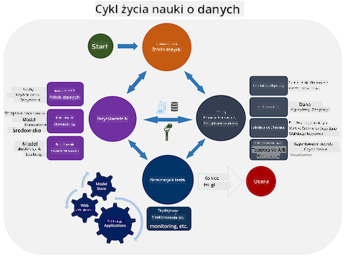
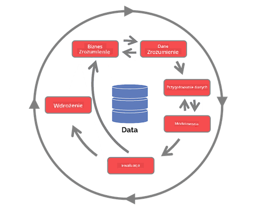

<!--
CO_OP_TRANSLATOR_METADATA:
{
  "original_hash": "c368f8f2506fe56bca0f7be05c4eb71d",
  "translation_date": "2025-08-24T22:16:03+00:00",
  "source_file": "4-Data-Science-Lifecycle/14-Introduction/README.md",
  "language_code": "pl"
}
-->
# Wprowadzenie do cyklu życia Data Science

| ](../../sketchnotes/14-DataScience-Lifecycle.png)|
|:---:|
| Wprowadzenie do cyklu życia Data Science - _Sketchnote autorstwa [@nitya](https://twitter.com/nitya)_ |

## [Quiz przed wykładem](https://red-water-0103e7a0f.azurestaticapps.net/quiz/26)

Na tym etapie prawdopodobnie zdajesz sobie sprawę, że data science to proces. Ten proces można podzielić na 5 etapów:

- Zbieranie
- Przetwarzanie
- Analiza
- Komunikacja
- Utrzymanie

Ta lekcja koncentruje się na 3 częściach cyklu życia: zbieraniu, przetwarzaniu i utrzymaniu.

  
> Zdjęcie autorstwa [Berkeley School of Information](https://ischoolonline.berkeley.edu/data-science/what-is-data-science/)

## Zbieranie

Pierwszy etap cyklu życia jest bardzo ważny, ponieważ kolejne etapy są od niego zależne. W praktyce składa się z dwóch połączonych etapów: pozyskiwania danych oraz definiowania celu i problemów, które należy rozwiązać.  
Definiowanie celów projektu wymaga głębszego zrozumienia problemu lub pytania. Najpierw musimy zidentyfikować i pozyskać osoby, które potrzebują rozwiązania swojego problemu. Mogą to być interesariusze w firmie lub sponsorzy projektu, którzy pomogą określić, kto lub co skorzysta na tym projekcie, a także co i dlaczego jest potrzebne. Dobrze zdefiniowany cel powinien być mierzalny i ilościowy, aby określić akceptowalny wynik.

Pytania, które może zadać data scientist:
- Czy ten problem był już wcześniej rozwiązywany? Co zostało odkryte?
- Czy cel i zamierzenia są zrozumiałe dla wszystkich zaangażowanych?
- Czy istnieje niejasność i jak ją zredukować?
- Jakie są ograniczenia?
- Jak może wyglądać końcowy wynik?
- Jakie zasoby (czas, ludzie, obliczenia) są dostępne?

Następnie należy zidentyfikować, zebrać, a na końcu zbadać dane potrzebne do osiągnięcia zdefiniowanych celów. Na tym etapie pozyskiwania data scientist musi również ocenić ilość i jakość danych. Wymaga to pewnej eksploracji danych, aby potwierdzić, że pozyskane dane wspierają osiągnięcie pożądanego wyniku.

Pytania, które może zadać data scientist dotyczące danych:
- Jakie dane są już dostępne?
- Kto jest właścicielem tych danych?
- Jakie są kwestie związane z prywatnością?
- Czy mam wystarczająco dużo danych, aby rozwiązać ten problem?
- Czy dane są wystarczającej jakości dla tego problemu?
- Jeśli odkryję dodatkowe informacje dzięki tym danym, czy powinniśmy rozważyć zmianę lub redefinicję celów?

## Przetwarzanie

Etap przetwarzania w cyklu życia koncentruje się na odkrywaniu wzorców w danych oraz modelowaniu. Niektóre techniki stosowane na tym etapie wymagają metod statystycznych do odkrywania wzorców. Zazwyczaj byłoby to żmudne zadanie dla człowieka przy dużym zbiorze danych, dlatego polega się na komputerach, które przyspieszają ten proces. Na tym etapie data science i uczenie maszynowe się przecinają. Jak nauczyłeś się w pierwszej lekcji, uczenie maszynowe to proces budowania modeli do zrozumienia danych. Modele są reprezentacją relacji między zmiennymi w danych, które pomagają przewidywać wyniki.

Popularne techniki stosowane na tym etapie są omówione w programie ML dla początkujących. Kliknij linki, aby dowiedzieć się więcej:

- [Klasyfikacja](https://github.com/microsoft/ML-For-Beginners/tree/main/4-Classification): Organizowanie danych w kategorie dla bardziej efektywnego wykorzystania.
- [Klasteryzacja](https://github.com/microsoft/ML-For-Beginners/tree/main/5-Clustering): Grupowanie danych w podobne grupy.
- [Regresja](https://github.com/microsoft/ML-For-Beginners/tree/main/2-Regression): Określanie relacji między zmiennymi w celu przewidywania lub prognozowania wartości.

## Utrzymanie

Na diagramie cyklu życia możesz zauważyć, że utrzymanie znajduje się pomiędzy zbieraniem a przetwarzaniem. Utrzymanie to ciągły proces zarządzania, przechowywania i zabezpieczania danych w trakcie realizacji projektu i powinno być brane pod uwagę przez cały czas trwania projektu.

### Przechowywanie danych

Rozważania dotyczące sposobu i miejsca przechowywania danych mogą wpływać na koszt ich przechowywania, a także na wydajność dostępu do danych. Decyzje te prawdopodobnie nie będą podejmowane wyłącznie przez data scientist, ale mogą oni podejmować wybory dotyczące pracy z danymi w zależności od sposobu ich przechowywania.

Oto kilka aspektów nowoczesnych systemów przechowywania danych, które mogą wpływać na te wybory:

**Na miejscu vs poza miejscem vs chmura publiczna lub prywatna**

Na miejscu odnosi się do hostowania i zarządzania danymi na własnym sprzęcie, na przykład posiadania serwera z dyskami twardymi przechowującymi dane, podczas gdy poza miejscem polega na sprzęcie, którego nie posiadasz, takim jak centrum danych. Chmura publiczna to popularny wybór do przechowywania danych, który nie wymaga wiedzy o tym, jak i gdzie dokładnie dane są przechowywane, gdzie publiczna odnosi się do zunifikowanej infrastruktury współdzielonej przez wszystkich użytkowników chmury. Niektóre organizacje mają rygorystyczne polityki bezpieczeństwa, które wymagają pełnego dostępu do sprzętu, na którym dane są hostowane, i polegają na prywatnej chmurze oferującej własne usługi chmurowe. Więcej o danych w chmurze dowiesz się w [późniejszych lekcjach](https://github.com/microsoft/Data-Science-For-Beginners/tree/main/5-Data-Science-In-Cloud).

**Zimne vs gorące dane**

Podczas trenowania modeli możesz potrzebować więcej danych treningowych. Jeśli jesteś zadowolony z modelu, więcej danych będzie napływać, aby model mógł spełniać swoje zadanie. W każdym przypadku koszt przechowywania i dostępu do danych wzrośnie wraz z ich akumulacją. Oddzielenie rzadko używanych danych, znanych jako zimne dane, od często używanych gorących danych może być tańszą opcją przechowywania danych za pomocą sprzętu lub usług programowych. Jeśli zimne dane muszą zostać uzyskane, może to zająć trochę więcej czasu w porównaniu do gorących danych.

### Zarządzanie danymi

Podczas pracy z danymi możesz odkryć, że niektóre z nich wymagają oczyszczenia za pomocą technik omówionych w lekcji dotyczącej [przygotowania danych](https://github.com/microsoft/Data-Science-For-Beginners/tree/main/2-Working-With-Data/08-data-preparation), aby zbudować dokładne modele. Gdy pojawią się nowe dane, będą wymagały podobnych działań, aby utrzymać spójność jakości. Niektóre projekty będą obejmować użycie zautomatyzowanego narzędzia do oczyszczania, agregacji i kompresji przed przeniesieniem danych do ich ostatecznej lokalizacji. Przykładem takiego narzędzia jest Azure Data Factory.

### Zabezpieczanie danych

Jednym z głównych celów zabezpieczania danych jest zapewnienie, że osoby pracujące z nimi kontrolują, co jest zbierane i w jakim kontekście jest używane. Utrzymanie bezpieczeństwa danych obejmuje ograniczenie dostępu tylko do osób, które go potrzebują, przestrzeganie lokalnych przepisów i regulacji, a także utrzymanie standardów etycznych, jak omówiono w [lekcji o etyce](https://github.com/microsoft/Data-Science-For-Beginners/tree/main/1-Introduction/02-ethics).

Oto kilka działań, które zespół może podjąć, mając na uwadze bezpieczeństwo:
- Upewnienie się, że wszystkie dane są zaszyfrowane
- Informowanie klientów o tym, jak ich dane są wykorzystywane
- Usuwanie dostępu do danych dla osób, które opuściły projekt
- Pozwalanie tylko wybranym członkom projektu na modyfikowanie danych

## 🚀 Wyzwanie

Istnieje wiele wersji cyklu życia Data Science, gdzie każdy etap może mieć różne nazwy i liczbę etapów, ale zawiera te same procesy omówione w tej lekcji.

Zapoznaj się z [cyklem życia procesu Team Data Science](https://docs.microsoft.com/en-us/azure/architecture/data-science-process/lifecycle) oraz [standardowym procesem dla eksploracji danych w różnych branżach](https://www.datascience-pm.com/crisp-dm-2/). Wymień 3 podobieństwa i różnice między nimi.

|Proces Team Data Science (TDSP)|Standardowy proces dla eksploracji danych w różnych branżach (CRISP-DM)|
|--|--|
| |  |
| Obraz autorstwa [Microsoft](https://docs.microsoft.comazure/architecture/data-science-process/lifecycle) | Obraz autorstwa [Data Science Process Alliance](https://www.datascience-pm.com/crisp-dm-2/) |

## [Quiz po wykładzie](https://red-water-0103e7a0f.azurestaticapps.net/quiz/27)

## Przegląd i samodzielna nauka

Zastosowanie cyklu życia Data Science obejmuje wiele ról i zadań, gdzie niektóre mogą koncentrować się na określonych częściach każdego etapu. Proces Team Data Science dostarcza kilka zasobów, które wyjaśniają rodzaje ról i zadań, jakie ktoś może mieć w projekcie.

* [Role i zadania w procesie Team Data Science](https://docs.microsoft.com/en-us/azure/architecture/data-science-process/roles-tasks)  
* [Wykonywanie zadań związanych z data science: eksploracja, modelowanie i wdrażanie](https://docs.microsoft.com/en-us/azure/architecture/data-science-process/execute-data-science-tasks)

## Zadanie

[Ocena zbioru danych](assignment.md)

**Zastrzeżenie**:  
Ten dokument został przetłumaczony za pomocą usługi tłumaczenia AI [Co-op Translator](https://github.com/Azure/co-op-translator). Chociaż dokładamy wszelkich starań, aby tłumaczenie było precyzyjne, prosimy pamiętać, że automatyczne tłumaczenia mogą zawierać błędy lub nieścisłości. Oryginalny dokument w jego rodzimym języku powinien być uznawany za wiarygodne źródło. W przypadku informacji o kluczowym znaczeniu zaleca się skorzystanie z profesjonalnego tłumaczenia przez człowieka. Nie ponosimy odpowiedzialności za jakiekolwiek nieporozumienia lub błędne interpretacje wynikające z użycia tego tłumaczenia.