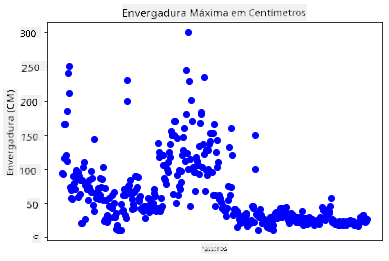
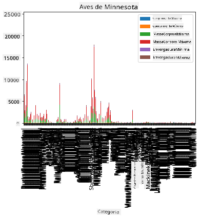
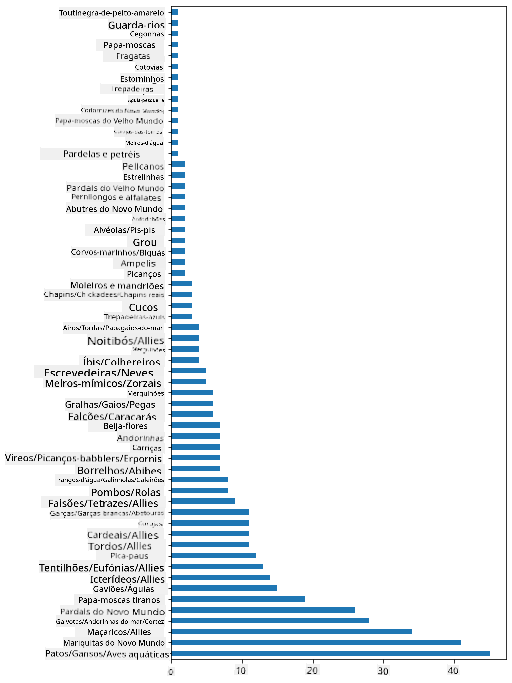
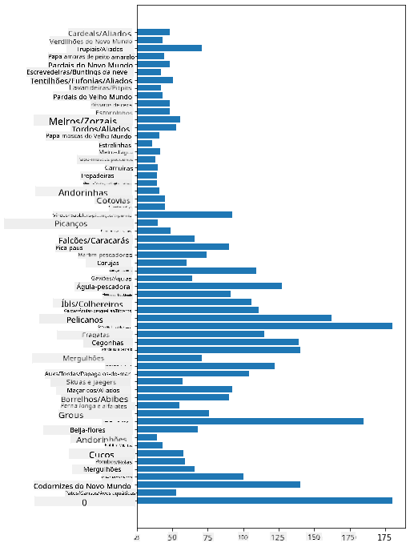
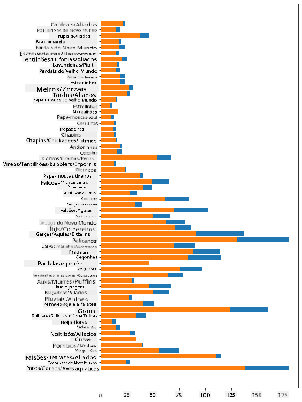

<!--
CO_OP_TRANSLATOR_METADATA:
{
  "original_hash": "43c402d9d90ae6da55d004519ada5033",
  "translation_date": "2025-08-24T22:59:55+00:00",
  "source_file": "3-Data-Visualization/09-visualization-quantities/README.md",
  "language_code": "pt"
}
-->
# Visualizar Quantidades

| ](../../sketchnotes/09-Visualizing-Quantities.png)|
|:---:|
| Visualizar Quantidades - _Sketchnote por [@nitya](https://twitter.com/nitya)_ |

Nesta lição, vais explorar como usar uma das muitas bibliotecas disponíveis em Python para aprender a criar visualizações interessantes em torno do conceito de quantidade. Usando um conjunto de dados limpo sobre os pássaros do Minnesota, podes aprender muitos factos interessantes sobre a vida selvagem local.  
## [Questionário pré-aula](https://purple-hill-04aebfb03.1.azurestaticapps.net/quiz/16)

## Observar a envergadura com Matplotlib

Uma excelente biblioteca para criar gráficos e diagramas, simples ou sofisticados, de vários tipos é [Matplotlib](https://matplotlib.org/stable/index.html). Em termos gerais, o processo de criar gráficos usando estas bibliotecas inclui identificar as partes do teu dataframe que queres analisar, realizar as transformações necessárias nos dados, atribuir valores aos eixos x e y, decidir o tipo de gráfico a mostrar e, finalmente, exibir o gráfico. O Matplotlib oferece uma grande variedade de visualizações, mas para esta lição, vamos focar-nos nas mais adequadas para visualizar quantidades: gráficos de linha, scatterplots e gráficos de barras.

> ✅ Usa o melhor gráfico para se adequar à estrutura dos teus dados e à história que queres contar.  
> - Para analisar tendências ao longo do tempo: linha  
> - Para comparar valores: barra, coluna, pizza, scatterplot  
> - Para mostrar como as partes se relacionam com o todo: pizza  
> - Para mostrar a distribuição dos dados: scatterplot, barra  
> - Para mostrar tendências: linha, coluna  
> - Para mostrar relações entre valores: linha, scatterplot, bolha  

Se tens um conjunto de dados e precisas de descobrir a quantidade de um determinado item, uma das primeiras tarefas será inspecionar os seus valores.  

✅ Existem excelentes 'cheat sheets' disponíveis para Matplotlib [aqui](https://matplotlib.org/cheatsheets/cheatsheets.pdf).

## Criar um gráfico de linha sobre os valores de envergadura das asas dos pássaros

Abre o ficheiro `notebook.ipynb` na raiz da pasta desta lição e adiciona uma célula.

> Nota: os dados estão armazenados na raiz deste repositório na pasta `/data`.

```python
import pandas as pd
import matplotlib.pyplot as plt
birds = pd.read_csv('../../data/birds.csv')
birds.head()
```  
Estes dados são uma mistura de texto e números:

|      | Nome                         | NomeCientífico         | Categoria              | Ordem        | Família   | Género       | EstadoConservação | MinComprimento | MaxComprimento | MinPesoCorporal | MaxPesoCorporal | MinEnvergadura | MaxEnvergadura |
| ---: | :--------------------------- | :--------------------- | :-------------------- | :----------- | :------- | :---------- | :----------------- | --------: | --------: | ----------: | ----------: | ----------: | ----------: |
|    0 | Pato-silvo-de-barriga-preta  | Dendrocygna autumnalis | Patos/Gansos/AvesAquáticas | Anseriformes | Anatidae | Dendrocygna | LC                 |        47 |        56 |         652 |        1020 |          76 |          94 |
|    1 | Pato-silvo-fulvo             | Dendrocygna bicolor    | Patos/Gansos/AvesAquáticas | Anseriformes | Anatidae | Dendrocygna | LC                 |        45 |        53 |         712 |        1050 |          85 |          93 |
|    2 | Ganso-da-neve                | Anser caerulescens     | Patos/Gansos/AvesAquáticas | Anseriformes | Anatidae | Anser       | LC                 |        64 |        79 |        2050 |        4050 |         135 |         165 |
|    3 | Ganso-de-Ross                | Anser rossii           | Patos/Gansos/AvesAquáticas | Anseriformes | Anatidae | Anser       | LC                 |      57.3 |        64 |        1066 |        1567 |         113 |         116 |
|    4 | Ganso-de-fronte-branca-maior | Anser albifrons        | Patos/Gansos/AvesAquáticas | Anseriformes | Anatidae | Anser       | LC                 |        64 |        81 |        1930 |        3310 |         130 |         165 |

Vamos começar por criar um gráfico básico de linha com alguns dos dados numéricos. Suponhamos que queres visualizar a envergadura máxima destas aves interessantes.

```python
wingspan = birds['MaxWingspan'] 
wingspan.plot()
```  


O que notas imediatamente? Parece haver pelo menos um valor fora do normal - que envergadura impressionante! Uma envergadura de 2300 centímetros equivale a 23 metros - será que há Pterodáctilos a voar pelo Minnesota? Vamos investigar.

Embora possas fazer uma ordenação rápida no Excel para encontrar esses valores fora do normal, que provavelmente são erros de digitação, continua o processo de visualização trabalhando diretamente no gráfico.

Adiciona etiquetas ao eixo x para mostrar que tipo de pássaros estão em questão:

```
plt.title('Max Wingspan in Centimeters')
plt.ylabel('Wingspan (CM)')
plt.xlabel('Birds')
plt.xticks(rotation=45)
x = birds['Name'] 
y = birds['MaxWingspan']

plt.plot(x, y)

plt.show()
```  


Mesmo com a rotação das etiquetas ajustada para 45 graus, há demasiadas para serem lidas. Vamos tentar uma estratégia diferente: etiquetar apenas os valores fora do normal e posicionar as etiquetas dentro do gráfico. Podes usar um scatterplot para criar mais espaço para as etiquetas:

```python
plt.title('Max Wingspan in Centimeters')
plt.ylabel('Wingspan (CM)')
plt.tick_params(axis='both',which='both',labelbottom=False,bottom=False)

for i in range(len(birds)):
    x = birds['Name'][i]
    y = birds['MaxWingspan'][i]
    plt.plot(x, y, 'bo')
    if birds['MaxWingspan'][i] > 500:
        plt.text(x, y * (1 - 0.05), birds['Name'][i], fontsize=12)
    
plt.show()
```  
O que está a acontecer aqui? Usaste `tick_params` para esconder as etiquetas na parte inferior e depois criaste um loop sobre o conjunto de dados dos pássaros. Ao criar o gráfico com pequenos pontos azuis redondos usando `bo`, verificaste se algum pássaro tinha uma envergadura máxima superior a 500 e exibiste a etiqueta ao lado do ponto, caso fosse o caso. Ajustaste ligeiramente as etiquetas no eixo y (`y * (1 - 0.05)`) e usaste o nome do pássaro como etiqueta.

O que descobriste?

  
## Filtrar os teus dados

Tanto a Águia-careca como o Falcão-das-pradarias, embora provavelmente sejam aves muito grandes, parecem estar mal etiquetados, com um `0` extra adicionado à sua envergadura máxima. É pouco provável que encontres uma Águia-careca com uma envergadura de 25 metros, mas, se isso acontecer, avisa-nos! Vamos criar um novo dataframe sem esses dois valores fora do normal:

```python
plt.title('Max Wingspan in Centimeters')
plt.ylabel('Wingspan (CM)')
plt.xlabel('Birds')
plt.tick_params(axis='both',which='both',labelbottom=False,bottom=False)
for i in range(len(birds)):
    x = birds['Name'][i]
    y = birds['MaxWingspan'][i]
    if birds['Name'][i] not in ['Bald eagle', 'Prairie falcon']:
        plt.plot(x, y, 'bo')
plt.show()
```  

Ao filtrar os valores fora do normal, os teus dados tornam-se mais coesos e compreensíveis.



Agora que temos um conjunto de dados mais limpo, pelo menos em termos de envergadura, vamos descobrir mais sobre estas aves.

Embora gráficos de linha e scatterplots possam exibir informações sobre valores de dados e suas distribuições, queremos pensar nos valores inerentes a este conjunto de dados. Podes criar visualizações para responder às seguintes perguntas sobre quantidade:

> Quantas categorias de pássaros existem e quais são os seus números?  
> Quantos pássaros estão extintos, em perigo, raros ou comuns?  
> Quantos existem dos vários géneros e ordens na terminologia de Linnaeus?  
## Explorar gráficos de barras

Os gráficos de barras são práticos quando precisas de mostrar agrupamentos de dados. Vamos explorar as categorias de pássaros que existem neste conjunto de dados para ver qual é a mais comum em número.

No ficheiro notebook, cria um gráfico de barras básico.

✅ Nota, podes filtrar os dois pássaros fora do normal que identificámos na secção anterior, corrigir o erro na sua envergadura ou deixá-los para estes exercícios que não dependem dos valores de envergadura.

Se quiseres criar um gráfico de barras, podes selecionar os dados que queres focar. Os gráficos de barras podem ser criados a partir de dados brutos:

```python
birds.plot(x='Category',
        kind='bar',
        stacked=True,
        title='Birds of Minnesota')

```  


Este gráfico de barras, no entanto, é ilegível porque há demasiados dados não agrupados. Precisas de selecionar apenas os dados que queres representar, então vamos olhar para o comprimento dos pássaros com base na sua categoria.

Filtra os teus dados para incluir apenas a categoria dos pássaros.

✅ Nota que usas Pandas para gerir os dados e depois deixas o Matplotlib fazer o gráfico.

Como há muitas categorias, podes exibir este gráfico verticalmente e ajustar a sua altura para acomodar todos os dados:

```python
category_count = birds.value_counts(birds['Category'].values, sort=True)
plt.rcParams['figure.figsize'] = [6, 12]
category_count.plot.barh()
```  


Este gráfico de barras mostra uma boa visão do número de pássaros em cada categoria. Num piscar de olhos, vês que o maior número de pássaros nesta região está na categoria de Patos/Gansos/AvesAquáticas. Minnesota é a 'terra dos 10.000 lagos', por isso não é surpreendente!

✅ Experimenta algumas outras contagens neste conjunto de dados. Há algo que te surpreenda?

## Comparar dados

Podes tentar diferentes comparações de dados agrupados criando novos eixos. Experimenta uma comparação do MaxComprimento de um pássaro, com base na sua categoria:

```python
maxlength = birds['MaxLength']
plt.barh(y=birds['Category'], width=maxlength)
plt.rcParams['figure.figsize'] = [6, 12]
plt.show()
```  


Nada é surpreendente aqui: os beija-flores têm o menor MaxComprimento em comparação com Pelicanos ou Gansos. É bom quando os dados fazem sentido lógico!

Podes criar visualizações mais interessantes de gráficos de barras ao sobrepor dados. Vamos sobrepor Comprimento Mínimo e Máximo numa determinada categoria de pássaros:

```python
minLength = birds['MinLength']
maxLength = birds['MaxLength']
category = birds['Category']

plt.barh(category, maxLength)
plt.barh(category, minLength)

plt.show()
```  
Neste gráfico, podes ver o intervalo por categoria de pássaros do Comprimento Mínimo e Máximo. Podes dizer com segurança que, dados estes dados, quanto maior o pássaro, maior o intervalo de comprimento. Fascinante!



## 🚀 Desafio

Este conjunto de dados sobre pássaros oferece uma riqueza de informações sobre diferentes tipos de pássaros dentro de um ecossistema específico. Procura na internet e vê se consegues encontrar outros conjuntos de dados relacionados com pássaros. Pratica a criação de gráficos e diagramas sobre estes pássaros para descobrir factos que não conhecias.  
## [Questionário pós-aula](https://purple-hill-04aebfb03.1.azurestaticapps.net/quiz/17)

## Revisão & Autoestudo

Esta primeira lição deu-te algumas informações sobre como usar Matplotlib para visualizar quantidades. Faz alguma pesquisa sobre outras formas de trabalhar com conjuntos de dados para visualização. [Plotly](https://github.com/plotly/plotly.py) é uma que não vamos abordar nestas lições, por isso dá uma olhada no que pode oferecer.  
## Tarefa

[Linhas, Scatterplots e Barras](assignment.md)  

**Aviso Legal**:  
Este documento foi traduzido utilizando o serviço de tradução por IA [Co-op Translator](https://github.com/Azure/co-op-translator). Embora nos esforcemos para garantir a precisão, é importante notar que traduções automáticas podem conter erros ou imprecisões. O documento original na sua língua nativa deve ser considerado a fonte autoritária. Para informações críticas, recomenda-se a tradução profissional realizada por humanos. Não nos responsabilizamos por quaisquer mal-entendidos ou interpretações incorretas decorrentes da utilização desta tradução.