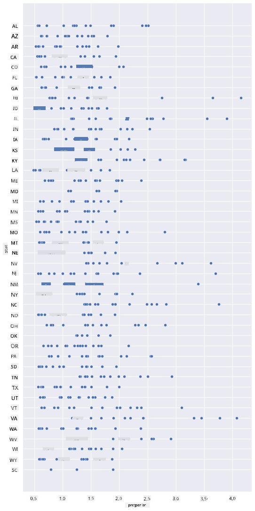
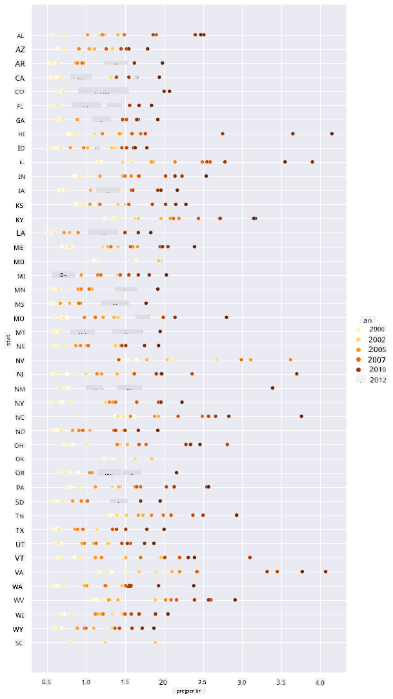
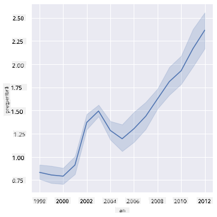
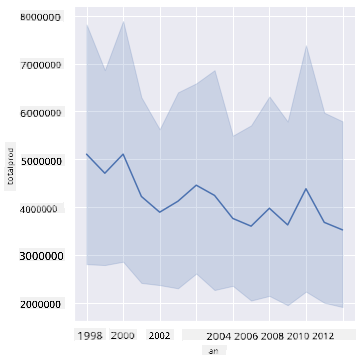
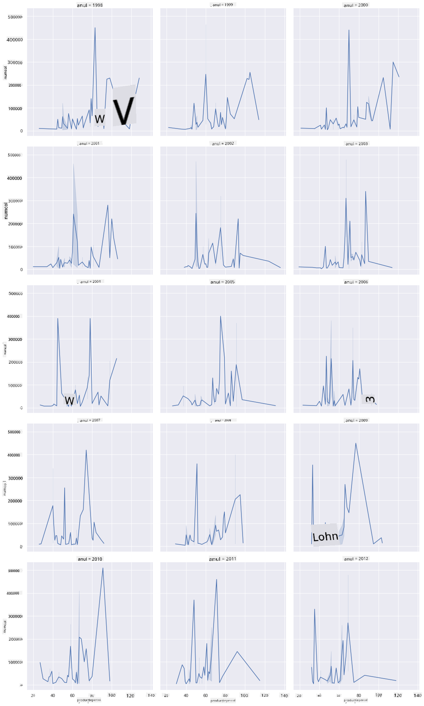
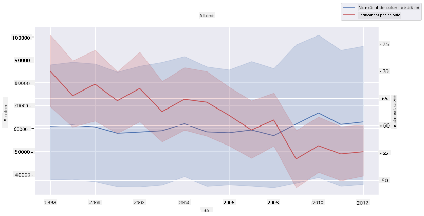

<!--
CO_OP_TRANSLATOR_METADATA:
{
  "original_hash": "cad419b574d5c35eaa417e9abfdcb0c8",
  "translation_date": "2025-08-26T16:55:54+00:00",
  "source_file": "3-Data-Visualization/12-visualization-relationships/README.md",
  "language_code": "ro"
}
-->
# Vizualizarea Relațiilor: Totul despre Miere 🍯

| ](../../sketchnotes/12-Visualizing-Relationships.png)|
|:---:|
|Vizualizarea Relațiilor - _Sketchnote de [@nitya](https://twitter.com/nitya)_ |

Continuând cu accentul pe natură al cercetării noastre, să descoperim vizualizări interesante pentru a arăta relațiile dintre diferitele tipuri de miere, conform unui set de date derivat de la [Departamentul de Agricultură al Statelor Unite](https://www.nass.usda.gov/About_NASS/index.php). 

Acest set de date, care conține aproximativ 600 de elemente, prezintă producția de miere în multe state din SUA. De exemplu, poți analiza numărul de colonii, randamentul per colonie, producția totală, stocurile, prețul pe kilogram și valoarea mierii produse într-un anumit stat între 1998-2012, cu un rând pentru fiecare an și stat. 

Va fi interesant să vizualizăm relația dintre producția anuală a unui stat și, de exemplu, prețul mierii în acel stat. Alternativ, ai putea vizualiza relația dintre randamentul mierii per colonie în diferite state. Această perioadă acoperă devastatorul fenomen 'CCD' sau 'Colony Collapse Disorder', observat pentru prima dată în 2006 (http://npic.orst.edu/envir/ccd.html), așa că este un set de date emoționant de studiat. 🐝

## [Chestionar înainte de lecție](https://purple-hill-04aebfb03.1.azurestaticapps.net/quiz/22)

În această lecție, poți folosi Seaborn, pe care l-ai mai utilizat, ca o bibliotecă excelentă pentru a vizualiza relațiile dintre variabile. Este deosebit de interesantă funcția `relplot` din Seaborn, care permite crearea rapidă de diagrame scatter și diagrame liniare pentru a vizualiza '[relațiile statistice](https://seaborn.pydata.org/tutorial/relational.html?highlight=relationships)', ajutând astfel oamenii de știință în date să înțeleagă mai bine cum se raportează variabilele între ele.

## Diagrame Scatter

Folosește o diagramă scatter pentru a arăta cum a evoluat prețul mierii, an de an, în fiecare stat. Seaborn, utilizând `relplot`, grupează convenabil datele pe state și afișează puncte de date atât pentru date categorice, cât și numerice. 

Să începem prin a importa datele și Seaborn:

```python
import pandas as pd
import matplotlib.pyplot as plt
import seaborn as sns
honey = pd.read_csv('../../data/honey.csv')
honey.head()
```
Observi că datele despre miere conțin mai multe coloane interesante, inclusiv anul și prețul pe kilogram. Să explorăm aceste date, grupate pe state din SUA:

| state | numcol | yieldpercol | totalprod | stocks   | priceperlb | prodvalue | year |
| ----- | ------ | ----------- | --------- | -------- | ---------- | --------- | ---- |
| AL    | 16000  | 71          | 1136000   | 159000   | 0.72       | 818000    | 1998 |
| AZ    | 55000  | 60          | 3300000   | 1485000  | 0.64       | 2112000   | 1998 |
| AR    | 53000  | 65          | 3445000   | 1688000  | 0.59       | 2033000   | 1998 |
| CA    | 450000 | 83          | 37350000  | 12326000 | 0.62       | 23157000  | 1998 |
| CO    | 27000  | 72          | 1944000   | 1594000  | 0.7        | 1361000   | 1998 |

Creează o diagramă scatter de bază pentru a arăta relația dintre prețul pe kilogram al mierii și statul de origine din SUA. Fă axa `y` suficient de înaltă pentru a afișa toate statele:

```python
sns.relplot(x="priceperlb", y="state", data=honey, height=15, aspect=.5);
```


Acum, afișează aceleași date cu o schemă de culori inspirată de miere pentru a arăta cum evoluează prețul de-a lungul anilor. Poți face acest lucru adăugând un parametru 'hue' pentru a arăta schimbarea, an de an:

> ✅ Află mai multe despre [paletele de culori pe care le poți folosi în Seaborn](https://seaborn.pydata.org/tutorial/color_palettes.html) - încearcă o schemă de culori curcubeu frumoasă!

```python
sns.relplot(x="priceperlb", y="state", hue="year", palette="YlOrBr", data=honey, height=15, aspect=.5);
```


Cu această schimbare de schemă de culori, poți observa clar o progresie puternică de-a lungul anilor în ceea ce privește prețul mierii pe kilogram. De fapt, dacă verifici un set de date eșantion (alege un stat, de exemplu Arizona), poți observa un model de creștere a prețului an de an, cu câteva excepții:

| state | numcol | yieldpercol | totalprod | stocks  | priceperlb | prodvalue | year |
| ----- | ------ | ----------- | --------- | ------- | ---------- | --------- | ---- |
| AZ    | 55000  | 60          | 3300000   | 1485000 | 0.64       | 2112000   | 1998 |
| AZ    | 52000  | 62          | 3224000   | 1548000 | 0.62       | 1999000   | 1999 |
| AZ    | 40000  | 59          | 2360000   | 1322000 | 0.73       | 1723000   | 2000 |
| AZ    | 43000  | 59          | 2537000   | 1142000 | 0.72       | 1827000   | 2001 |
| AZ    | 38000  | 63          | 2394000   | 1197000 | 1.08       | 2586000   | 2002 |
| AZ    | 35000  | 72          | 2520000   | 983000  | 1.34       | 3377000   | 2003 |
| AZ    | 32000  | 55          | 1760000   | 774000  | 1.11       | 1954000   | 2004 |
| AZ    | 36000  | 50          | 1800000   | 720000  | 1.04       | 1872000   | 2005 |
| AZ    | 30000  | 65          | 1950000   | 839000  | 0.91       | 1775000   | 2006 |
| AZ    | 30000  | 64          | 1920000   | 902000  | 1.26       | 2419000   | 2007 |
| AZ    | 25000  | 64          | 1600000   | 336000  | 1.26       | 2016000   | 2008 |
| AZ    | 20000  | 52          | 1040000   | 562000  | 1.45       | 1508000   | 2009 |
| AZ    | 24000  | 77          | 1848000   | 665000  | 1.52       | 2809000   | 2010 |
| AZ    | 23000  | 53          | 1219000   | 427000  | 1.55       | 1889000   | 2011 |
| AZ    | 22000  | 46          | 1012000   | 253000  | 1.79       | 1811000   | 2012 |

O altă modalitate de a vizualiza această progresie este să folosești dimensiunea, în loc de culoare. Pentru utilizatorii daltoniști, aceasta ar putea fi o opțiune mai bună. Editează vizualizarea pentru a arăta o creștere a prețului printr-o creștere a circumferinței punctelor:

```python
sns.relplot(x="priceperlb", y="state", size="year", data=honey, height=15, aspect=.5);
```
Poți observa cum dimensiunea punctelor crește treptat.


Este acesta un caz simplu de cerere și ofertă? Din cauza unor factori precum schimbările climatice și colapsul coloniilor, există mai puțină miere disponibilă pentru cumpărare an de an, iar astfel prețul crește?

Pentru a descoperi o corelație între unele dintre variabilele din acest set de date, să explorăm câteva diagrame liniare.

## Diagrame liniare

Întrebare: Există o creștere clară a prețului mierii pe kilogram, an de an? Poți descoperi acest lucru cel mai ușor creând o singură diagramă liniară:

```python
sns.relplot(x="year", y="priceperlb", kind="line", data=honey);
```
Răspuns: Da, cu câteva excepții în jurul anului 2003:



✅ Deoarece Seaborn agregă datele într-o singură linie, afișează "măsurătorile multiple pentru fiecare valoare x prin trasarea mediei și a intervalului de încredere de 95% în jurul mediei". [Sursă](https://seaborn.pydata.org/tutorial/relational.html). Acest comportament consumator de timp poate fi dezactivat adăugând `ci=None`.

Întrebare: Ei bine, în 2003 putem observa și o creștere a ofertei de miere? Ce se întâmplă dacă analizezi producția totală an de an?

```python
sns.relplot(x="year", y="totalprod", kind="line", data=honey);
```



Răspuns: Nu chiar. Dacă te uiți la producția totală, aceasta pare să fi crescut în acel an, deși, în general, cantitatea de miere produsă este în scădere în acești ani.

Întrebare: În acest caz, ce ar fi putut cauza acea creștere a prețului mierii în jurul anului 2003? 

Pentru a descoperi acest lucru, poți explora o grilă de fațete.

## Grile de fațete

Grilele de fațete iau un aspect al setului tău de date (în cazul nostru, poți alege 'anul' pentru a evita crearea prea multor fațete). Seaborn poate apoi să creeze un grafic pentru fiecare dintre aceste fațete ale coordonatelor x și y alese, pentru o comparație vizuală mai ușoară. Se remarcă anul 2003 în acest tip de comparație?

Creează o grilă de fațete continuând să folosești `relplot`, așa cum este recomandat de [documentația Seaborn](https://seaborn.pydata.org/generated/seaborn.FacetGrid.html?highlight=facetgrid#seaborn.FacetGrid). 

```python
sns.relplot(
    data=honey, 
    x="yieldpercol", y="numcol",
    col="year", 
    col_wrap=3,
    kind="line"
```
În această vizualizare, poți compara randamentul per colonie și numărul de colonii an de an, alăturat, cu o împărțire pe 3 coloane:



Pentru acest set de date, nimic nu iese în evidență în mod special în ceea ce privește numărul de colonii și randamentul lor, an de an și stat de stat. Există o altă modalitate de a găsi o corelație între aceste două variabile?

## Diagrame cu linii duble

Încearcă o diagramă cu linii multiple, suprapunând două diagrame liniare una peste alta, folosind funcția 'despine' din Seaborn pentru a elimina marginile de sus și din dreapta și utilizând `ax.twinx` [derivat din Matplotlib](https://matplotlib.org/stable/api/_as_gen/matplotlib.axes.Axes.twinx.html). Twinx permite unui grafic să împartă axa x și să afișeze două axe y. Așadar, afișează randamentul per colonie și numărul de colonii, suprapuse:

```python
fig, ax = plt.subplots(figsize=(12,6))
lineplot = sns.lineplot(x=honey['year'], y=honey['numcol'], data=honey, 
                        label = 'Number of bee colonies', legend=False)
sns.despine()
plt.ylabel('# colonies')
plt.title('Honey Production Year over Year');

ax2 = ax.twinx()
lineplot2 = sns.lineplot(x=honey['year'], y=honey['yieldpercol'], ax=ax2, color="r", 
                         label ='Yield per colony', legend=False) 
sns.despine(right=False)
plt.ylabel('colony yield')
ax.figure.legend();
```


Deși nimic nu sare în evidență în jurul anului 2003, acest lucru ne permite să încheiem lecția pe o notă mai optimistă: deși numărul de colonii este în scădere, acesta pare să se stabilizeze, chiar dacă randamentul per colonie scade.

Hai, albine, hai!

🐝❤️
## 🚀 Provocare

În această lecție, ai învățat mai multe despre utilizările scatterplot-urilor și grilelor de fațete, inclusiv grilele de fațete. Provocă-te să creezi o grilă de fațete folosind un alt set de date, poate unul pe care l-ai folosit anterior în aceste lecții. Observă cât timp durează să le creezi și cât de atent trebuie să fii cu privire la numărul de grile pe care trebuie să le desenezi folosind aceste tehnici.
## [Chestionar după lecție](https://purple-hill-04aebfb03.1.azurestaticapps.net/quiz/23)

## Recapitulare & Studiu individual

Diagramele liniare pot fi simple sau destul de complexe. Citește puțin în [documentația Seaborn](https://seaborn.pydata.org/generated/seaborn.lineplot.html) despre diferitele moduri în care le poți construi. Încearcă să îmbunătățești diagramele liniare pe care le-ai construit în această lecție cu alte metode listate în documentație.
## Temă

[Explorează stupul](assignment.md)

---

**Declinare de responsabilitate**:  
Acest document a fost tradus folosind serviciul de traducere AI [Co-op Translator](https://github.com/Azure/co-op-translator). Deși ne străduim să asigurăm acuratețea, vă rugăm să rețineți că traducerile automate pot conține erori sau inexactități. Documentul original în limba sa natală ar trebui considerat sursa autoritară. Pentru informații critice, se recomandă traducerea profesională realizată de un specialist uman. Nu ne asumăm responsabilitatea pentru eventualele neînțelegeri sau interpretări greșite care pot apărea din utilizarea acestei traduceri.