<!--
CO_OP_TRANSLATOR_METADATA:
{
  "original_hash": "14b2a7f1c63202920bd98eeb913f5614",
  "translation_date": "2025-08-26T16:01:01+00:00",
  "source_file": "5-Data-Science-In-Cloud/18-Low-Code/README.md",
  "language_code": "ro"
}
-->
# Data Science în Cloud: Metoda "Low code/No code"

| ](../../sketchnotes/18-DataScience-Cloud.png)|
|:---:|
| Data Science în Cloud: Low Code - _Sketchnote de [@nitya](https://twitter.com/nitya)_ |

Cuprins:

- [Data Science în Cloud: Metoda "Low code/No code"](../../../../5-Data-Science-In-Cloud/18-Low-Code)
  - [Chestionar înainte de curs](../../../../5-Data-Science-In-Cloud/18-Low-Code)
  - [1. Introducere](../../../../5-Data-Science-In-Cloud/18-Low-Code)
    - [1.1 Ce este Azure Machine Learning?](../../../../5-Data-Science-In-Cloud/18-Low-Code)
    - [1.2 Proiectul de Predicție a Insuficienței Cardiace:](../../../../5-Data-Science-In-Cloud/18-Low-Code)
    - [1.3 Setul de Date pentru Insuficiență Cardiacă:](../../../../5-Data-Science-In-Cloud/18-Low-Code)
  - [2. Antrenarea unui model în Azure ML Studio folosind Low code/No code](../../../../5-Data-Science-In-Cloud/18-Low-Code)
    - [2.1 Crearea unui workspace Azure ML](../../../../5-Data-Science-In-Cloud/18-Low-Code)
    - [2.2 Resurse de calcul](../../../../5-Data-Science-In-Cloud/18-Low-Code)
      - [2.2.1 Alegerea opțiunilor potrivite pentru resursele de calcul](../../../../5-Data-Science-In-Cloud/18-Low-Code)
      - [2.2.2 Crearea unui cluster de calcul](../../../../5-Data-Science-In-Cloud/18-Low-Code)
    - [2.3 Încărcarea setului de date](../../../../5-Data-Science-In-Cloud/18-Low-Code)
    - [2.4 Antrenare Low code/No code cu AutoML](../../../../5-Data-Science-In-Cloud/18-Low-Code)
  - [3. Implementarea modelului și consumul endpoint-ului folosind Low code/No code](../../../../5-Data-Science-In-Cloud/18-Low-Code)
    - [3.1 Implementarea modelului](../../../../5-Data-Science-In-Cloud/18-Low-Code)
    - [3.2 Consumul endpoint-ului](../../../../5-Data-Science-In-Cloud/18-Low-Code)
  - [🚀 Provocare](../../../../5-Data-Science-In-Cloud/18-Low-Code)
  - [Chestionar după curs](../../../../5-Data-Science-In-Cloud/18-Low-Code)
  - [Recapitulare și studiu individual](../../../../5-Data-Science-In-Cloud/18-Low-Code)
  - [Temă](../../../../5-Data-Science-In-Cloud/18-Low-Code)

## [Chestionar înainte de curs](https://purple-hill-04aebfb03.1.azurestaticapps.net/quiz/34)

## 1. Introducere

### 1.1 Ce este Azure Machine Learning?

Platforma cloud Azure include peste 200 de produse și servicii cloud concepute pentru a te ajuta să aduci la viață soluții noi. Data scientist-ii depun mult efort pentru a explora și preprocesa datele, încercând diverse tipuri de algoritmi de antrenare a modelelor pentru a produce modele precise. Aceste sarcini consumă mult timp și deseori utilizează ineficient hardware-ul de calcul costisitor.

[Azure ML](https://docs.microsoft.com/azure/machine-learning/overview-what-is-azure-machine-learning?WT.mc_id=academic-77958-bethanycheum&ocid=AID3041109) este o platformă bazată pe cloud pentru construirea și operarea soluțiilor de machine learning în Azure. Aceasta include o gamă largă de funcționalități care ajută data scientist-ii să pregătească datele, să antreneze modele, să publice servicii predictive și să monitorizeze utilizarea acestora. Cel mai important, ajută la creșterea eficienței prin automatizarea multor sarcini consumatoare de timp asociate cu antrenarea modelelor și permite utilizarea resurselor de calcul bazate pe cloud care se scalează eficient pentru a gestiona volume mari de date, suportând costuri doar atunci când sunt utilizate efectiv.

Azure ML oferă toate instrumentele necesare dezvoltatorilor și data scientist-ilor pentru fluxurile lor de lucru de machine learning. Acestea includ:

- **Azure Machine Learning Studio**: un portal web în Azure Machine Learning pentru opțiuni low-code și no-code pentru antrenarea modelelor, implementare, automatizare, urmărire și gestionarea resurselor. Studio-ul se integrează cu SDK-ul Azure Machine Learning pentru o experiență fără întreruperi.
- **Jupyter Notebooks**: pentru prototiparea rapidă și testarea modelelor ML.
- **Azure Machine Learning Designer**: permite construirea experimentelor prin drag-and-drop și implementarea pipeline-urilor într-un mediu low-code.
- **Interfața AutoML**: automatizează sarcinile iterative de dezvoltare a modelelor ML, permițând construirea de modele ML la scară mare, cu eficiență și productivitate, menținând în același timp calitatea modelului.
- **Etichetarea datelor**: un instrument ML asistat pentru etichetarea automată a datelor.
- **Extensia de machine learning pentru Visual Studio Code**: oferă un mediu complet de dezvoltare pentru construirea și gestionarea proiectelor ML.
- **CLI pentru machine learning**: oferă comenzi pentru gestionarea resurselor Azure ML din linia de comandă.
- **Integrare cu framework-uri open-source** precum PyTorch, TensorFlow, Scikit-learn și multe altele pentru antrenarea, implementarea și gestionarea procesului complet de machine learning.
- **MLflow**: o bibliotecă open-source pentru gestionarea ciclului de viață al experimentelor de machine learning. **MLFlow Tracking** este un component al MLflow care înregistrează și urmărește metricele de rulare și artefactele modelului, indiferent de mediul experimentului.

### 1.2 Proiectul de Predicție a Insuficienței Cardiace:

Nu există nicio îndoială că realizarea și construirea de proiecte este cea mai bună modalitate de a-ți testa abilitățile și cunoștințele. În această lecție, vom explora două moduri diferite de a construi un proiect de data science pentru predicția atacurilor de insuficiență cardiacă în Azure ML Studio, prin metodele Low code/No code și prin SDK-ul Azure ML, așa cum este ilustrat în schema următoare:

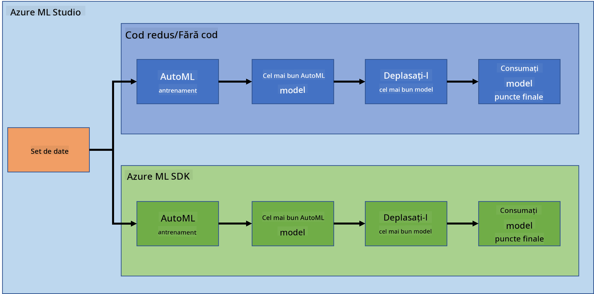

Fiecare metodă are propriile avantaje și dezavantaje. Metoda Low code/No code este mai ușor de început, deoarece implică interacțiunea cu o interfață grafică (GUI), fără a fi necesare cunoștințe anterioare de programare. Această metodă permite testarea rapidă a viabilității proiectului și crearea unui POC (Proof Of Concept). Totuși, pe măsură ce proiectul crește și trebuie să fie pregătit pentru producție, nu este fezabil să creezi resurse prin GUI. Este necesar să automatizezi programatic totul, de la crearea resurselor până la implementarea unui model. Aici devine esențial să știi cum să folosești SDK-ul Azure ML.

|                   | Low code/No code | SDK Azure ML              |
|-------------------|------------------|---------------------------|
| Expertiză în cod  | Nu este necesară | Este necesară             |
| Timp de dezvoltare| Rapid și ușor    | Depinde de expertiza în cod |
| Pregătit pentru producție | Nu               | Da                       |

### 1.3 Setul de Date pentru Insuficiență Cardiacă:

Bolile cardiovasculare (CVD) sunt cauza principală a deceselor la nivel global, reprezentând 31% din toate decesele la nivel mondial. Factori de risc de mediu și comportamentali, precum utilizarea tutunului, dieta nesănătoasă și obezitatea, inactivitatea fizică și consumul nociv de alcool, pot fi utilizați ca trăsături pentru modelele de estimare. Posibilitatea de a estima probabilitatea dezvoltării unei CVD ar putea fi de mare ajutor pentru prevenirea atacurilor la persoanele cu risc ridicat.

Kaggle a pus la dispoziție un [set de date pentru insuficiență cardiacă](https://www.kaggle.com/andrewmvd/heart-failure-clinical-data), pe care îl vom folosi pentru acest proiect. Poți descărca setul de date acum. Acesta este un set de date tabular cu 13 coloane (12 trăsături și 1 variabilă țintă) și 299 de rânduri.

|    | Nume variabilă            | Tip             | Descriere                                                | Exemplu           |
|----|---------------------------|-----------------|---------------------------------------------------------|-------------------|
| 1  | age                       | numeric         | vârsta pacientului                                      | 25                |
| 2  | anaemia                   | boolean         | Scăderea globulelor roșii sau a hemoglobinei            | 0 sau 1           |
| 3  | creatinine_phosphokinase  | numeric         | Nivelul enzimei CPK în sânge                            | 542               |
| 4  | diabetes                  | boolean         | Dacă pacientul are diabet                               | 0 sau 1           |
| 5  | ejection_fraction         | numeric         | Procentul de sânge care părăsește inima la fiecare contracție | 45                |
| 6  | high_blood_pressure       | boolean         | Dacă pacientul are hipertensiune                        | 0 sau 1           |
| 7  | platelets                 | numeric         | Trombocite în sânge                                     | 149000            |
| 8  | serum_creatinine          | numeric         | Nivelul creatininei serice în sânge                     | 0.5               |
| 9  | serum_sodium              | numeric         | Nivelul sodiului seric în sânge                         | jun               |
| 10 | sex                       | boolean         | femeie sau bărbat                                       | 0 sau 1           |
| 11 | smoking                   | boolean         | Dacă pacientul fumează                                  | 0 sau 1           |
| 12 | time                      | numeric         | perioada de urmărire (zile)                             | 4                 |
|----|---------------------------|-----------------|---------------------------------------------------------|-------------------|
| 21 | DEATH_EVENT [Țintă]       | boolean         | dacă pacientul moare în perioada de urmărire            | 0 sau 1           |

După ce ai setul de date, putem începe proiectul în Azure.

## 2. Antrenarea unui model în Azure ML Studio folosind Low code/No code

### 2.1 Crearea unui workspace Azure ML

Pentru a antrena un model în Azure ML, trebuie mai întâi să creezi un workspace Azure ML. Workspace-ul este resursa de nivel superior pentru Azure Machine Learning, oferind un loc centralizat pentru a lucra cu toate artefactele create atunci când folosești Azure Machine Learning. Workspace-ul păstrează un istoric al tuturor rulărilor de antrenare, inclusiv jurnale, metrici, rezultate și o captură a scripturilor tale. Folosești aceste informații pentru a determina care rulare de antrenare produce cel mai bun model. [Află mai multe](https://docs.microsoft.com/azure/machine-learning/concept-workspace?WT.mc_id=academic-77958-bethanycheum&ocid=AID3041109)

Se recomandă utilizarea celui mai actualizat browser compatibil cu sistemul tău de operare. Browserele suportate includ:

- Microsoft Edge (Noua versiune Microsoft Edge, cea mai recentă. Nu Microsoft Edge legacy)
- Safari (cea mai recentă versiune, doar pentru Mac)
- Chrome (cea mai recentă versiune)
- Firefox (cea mai recentă versiune)

Pentru a folosi Azure Machine Learning, creează un workspace în abonamentul tău Azure. Poți folosi acest workspace pentru a gestiona date, resurse de calcul, cod, modele și alte artefacte legate de fluxurile tale de lucru de machine learning.

> **_NOTĂ:_** Abonamentul tău Azure va fi taxat cu o sumă mică pentru stocarea datelor atât timp cât workspace-ul Azure Machine Learning există în abonamentul tău, așa că îți recomandăm să ștergi workspace-ul Azure Machine Learning atunci când nu îl mai folosești.

1. Conectează-te la [portalul Azure](https://ms.portal.azure.com/) folosind acreditivele Microsoft asociate abonamentului tău Azure.
2. Selectează **＋Create a resource**
   
   

   Caută "Machine Learning" și selectează opțiunea Machine Learning.

   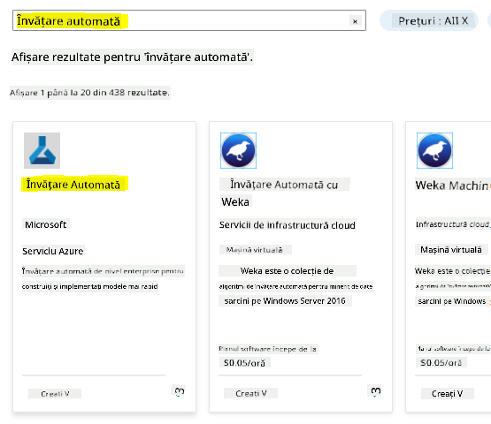

   Apasă butonul "Create".

   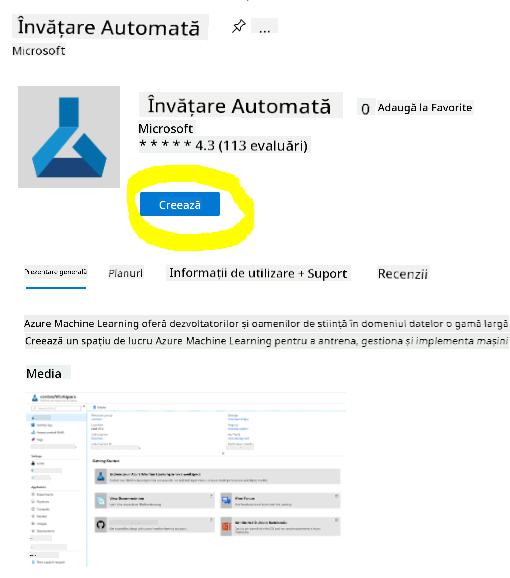

   Completează setările astfel:
   - Subscription: Abonamentul tău Azure
   - Resource group: Creează sau selectează un grup de resurse
   - Workspace name: Introdu un nume unic pentru workspace-ul tău
   - Region: Selectează regiunea geografică cea mai apropiată de tine
   - Storage account: Notează contul de stocare implicit care va fi creat pentru workspace-ul tău
   - Key vault: Notează key vault-ul implicit care va fi creat pentru workspace-ul tău
   - Application insights: Notează resursa implicită Application Insights care va fi creată pentru workspace-ul tău
   - Container registry: Niciunul (unul va fi creat automat prima dată când implementezi un model într-un container)

    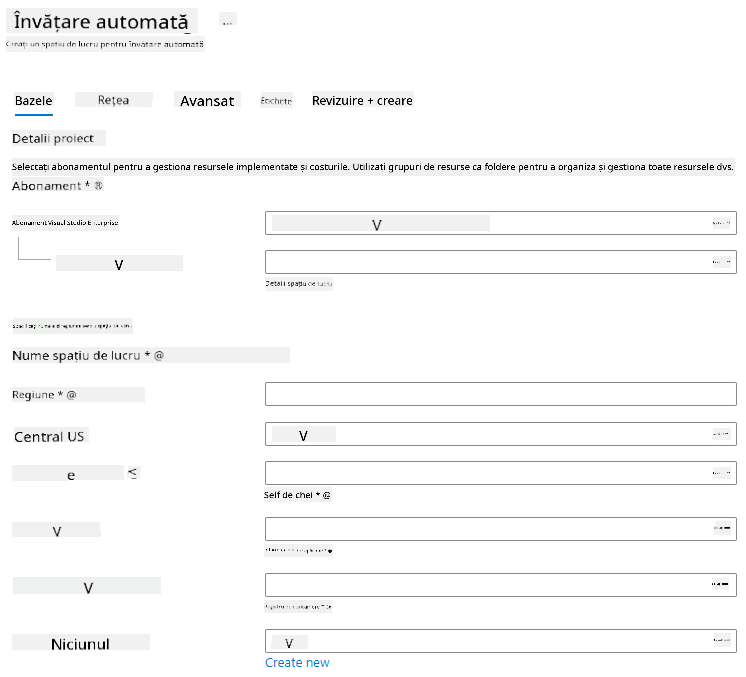

   - Apasă pe "Create + review" și apoi pe butonul "Create".
3. Așteaptă ca workspace-ul tău să fie creat (acest proces poate dura câteva minute). Apoi accesează-l în portal. Îl poți găsi prin serviciul Azure Machine Learning.
4. Pe pagina de prezentare generală a workspace-ului tău, lansează Azure Machine Learning Studio (sau deschide un nou tab în browser și navighează la https://ml.azure.com), și conectează-te la Azure Machine Learning Studio folosind contul tău Microsoft. Dacă ți se cere, selectează directorul și abonamentul Azure, precum și workspace-ul Azure Machine Learning.
   
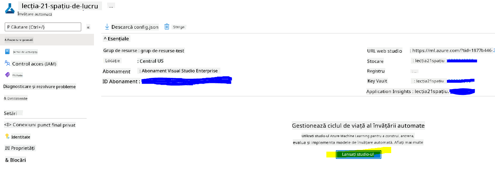

5. În Azure Machine Learning Studio, comută pictograma ☰ din colțul stânga sus pentru a vizualiza diferitele pagini din interfață. Poți folosi aceste pagini pentru a gestiona resursele din workspace-ul tău.

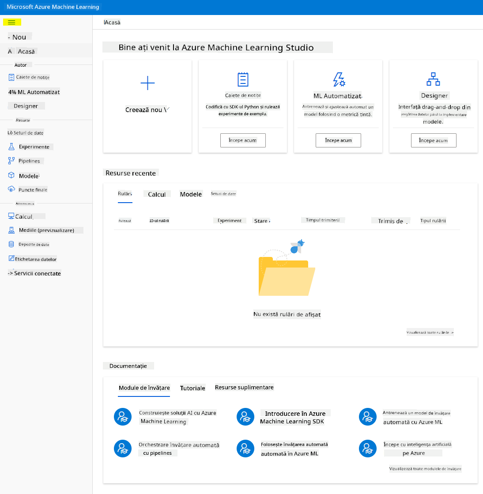

Poți gestiona workspace-ul tău folosind portalul Azure, dar pentru data scientist-i și inginerii de operațiuni ML, Azure Machine Learning Studio oferă o interfață mai concentrată pentru gestionarea resurselor workspace-ului.

### 2.2 Resurse de calcul

Resursele de calcul sunt resurse bazate pe cloud pe care poți rula procese de antrenare a modelelor și explorare a datelor. Există patru tipuri de resurse de calcul pe care le poți crea:

- **Compute Instances**: Stații de lucru pentru dezvoltare pe care data scientist-ii le pot folosi pentru a lucra cu date și modele. Aceasta implică crearea unei mașini virtuale (VM) și lansarea unei instanțe de notebook. Poți apoi antrena un model apelând un cluster de calcul din notebook.
- **Compute Clusters**: Clustere scalabile de mașini virtuale pentru procesarea la cerere a codului experimentului. Vei avea nevoie de acestea pentru antrenarea unui model. Clusterele de calcul pot folosi și resurse specializate GPU sau CPU.
- **Inference Clusters**: Ținte de implementare pentru serviciile predictive care utilizează modelele tale antrenate.
- **Attached Compute**: Leagă resursele de calcul existente din Azure, cum ar fi mașinile virtuale sau clusterele Azure Databricks.

#### 2.2.1 Alegerea opțiunilor potrivite pentru resursele de calcul

Câțiva factori cheie trebuie luați în considerare atunci când creați o resursă de calcul, iar aceste alegeri pot fi decizii critice.

**Aveți nevoie de CPU sau GPU?**

Un CPU (Unitate Centrală de Procesare) este circuitul electronic care execută instrucțiunile unui program de calculator. Un GPU (Unitate de Procesare Grafică) este un circuit electronic specializat care poate executa cod legat de grafică la o rată foarte mare.

Principala diferență între arhitectura CPU și GPU este că un CPU este proiectat să gestioneze rapid o gamă largă de sarcini (măsurată prin viteza ceasului CPU), dar este limitat în ceea ce privește concurența sarcinilor care pot fi rulate. GPU-urile sunt proiectate pentru calcul paralel și, prin urmare, sunt mult mai bune pentru sarcinile de învățare profundă.

| CPU                                     | GPU                         |
|-----------------------------------------|-----------------------------|
| Mai puțin costisitor                    | Mai costisitor              |
| Nivel mai scăzut de concurență          | Nivel mai ridicat de concurență |
| Mai lent în antrenarea modelelor de învățare profundă | Optim pentru învățare profundă   |

**Dimensiunea clusterului**

Clusterele mai mari sunt mai costisitoare, dar vor oferi o mai bună receptivitate. Prin urmare, dacă aveți timp, dar nu suficienți bani, ar trebui să începeți cu un cluster mic. În schimb, dacă aveți bani, dar nu prea mult timp, ar trebui să începeți cu un cluster mai mare.

**Dimensiunea VM**

În funcție de constrângerile de timp și buget, puteți varia dimensiunea RAM-ului, discului, numărul de nuclee și viteza ceasului. Creșterea tuturor acestor parametri va fi mai costisitoare, dar va duce la o performanță mai bună.

**Instanțe dedicate sau cu prioritate scăzută?**

O instanță cu prioritate scăzută înseamnă că este întreruptibilă: practic, Microsoft Azure poate prelua acele resurse și le poate atribui unei alte sarcini, întrerupând astfel un job. O instanță dedicată, sau neîntreruptibilă, înseamnă că jobul nu va fi niciodată terminat fără permisiunea dumneavoastră. Aceasta este o altă considerație între timp și bani, deoarece instanțele întreruptibile sunt mai puțin costisitoare decât cele dedicate.

#### 2.2.2 Crearea unui cluster de calcul

În [spațiul de lucru Azure ML](https://ml.azure.com/) pe care l-am creat anterior, accesați secțiunea de calcul și veți putea vedea diferitele resurse de calcul discutate anterior (de exemplu, instanțe de calcul, clustere de calcul, clustere de inferență și calcul atașat). Pentru acest proiect, vom avea nevoie de un cluster de calcul pentru antrenarea modelului. În Studio, faceți clic pe meniul "Compute", apoi pe fila "Compute cluster" și faceți clic pe butonul "+ New" pentru a crea un cluster de calcul.


1. Alegeți opțiunile: Dedicated vs Low priority, CPU sau GPU, dimensiunea VM și numărul de nuclee (puteți păstra setările implicite pentru acest proiect).
2. Faceți clic pe butonul Next.

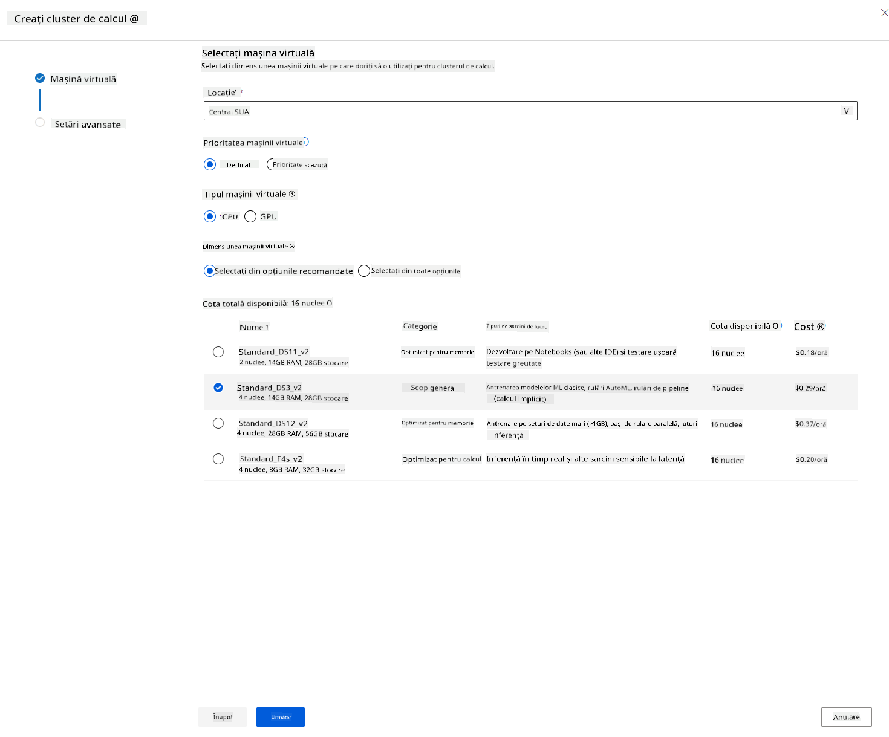

3. Dați clusterului un nume de calcul.
4. Alegeți opțiunile: Numărul minim/maxim de noduri, secunde de inactivitate înainte de reducerea dimensiunii, acces SSH. Rețineți că, dacă numărul minim de noduri este 0, veți economisi bani atunci când clusterul este inactiv. Rețineți că, cu cât numărul maxim de noduri este mai mare, cu atât antrenarea va fi mai scurtă. Numărul maxim de noduri recomandat este 3.
5. Faceți clic pe butonul "Create". Acest pas poate dura câteva minute.

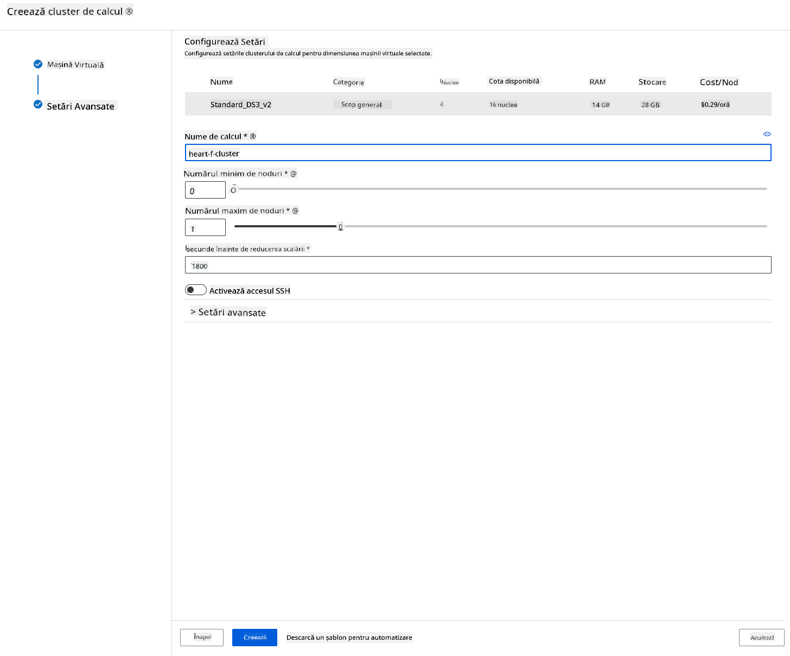

Minunat! Acum că avem un cluster de calcul, trebuie să încărcăm datele în Azure ML Studio.

### 2.3 Încărcarea setului de date

1. În [spațiul de lucru Azure ML](https://ml.azure.com/) pe care l-am creat anterior, faceți clic pe "Datasets" în meniul din stânga și faceți clic pe butonul "+ Create dataset" pentru a crea un set de date. Alegeți opțiunea "From local files" și selectați setul de date Kaggle pe care l-am descărcat anterior.

   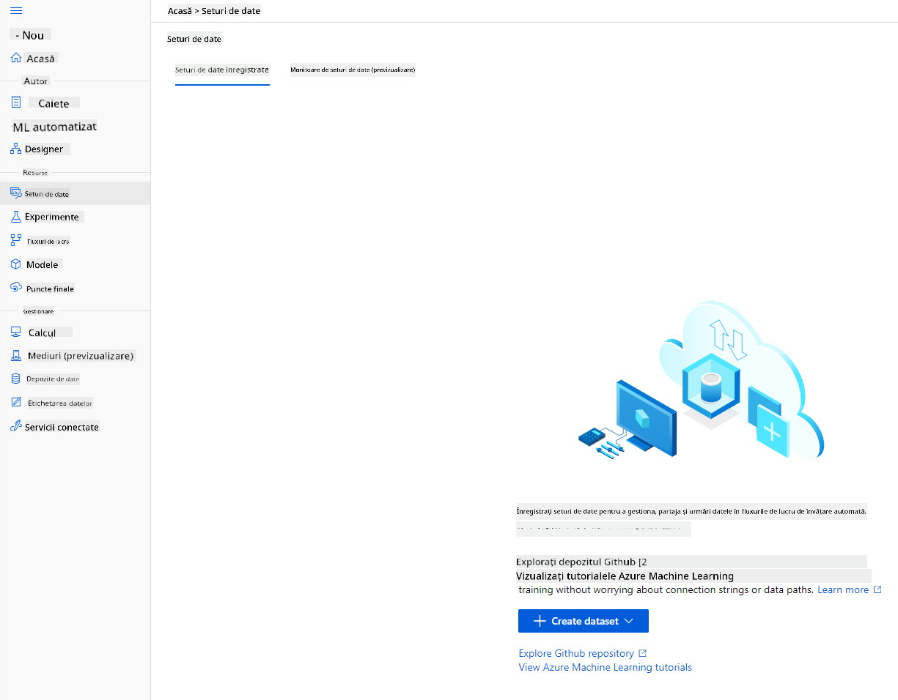

2. Dați setului de date un nume, un tip și o descriere. Faceți clic pe Next. Încărcați datele din fișiere. Faceți clic pe Next.

   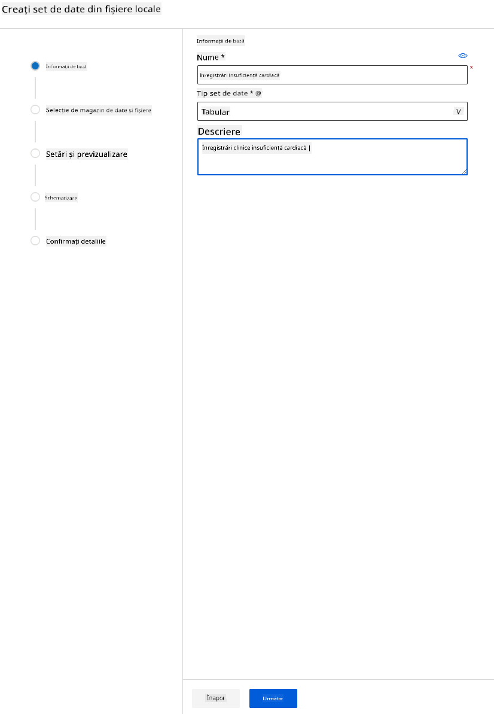

3. În Schema, schimbați tipul de date în Boolean pentru următoarele caracteristici: anaemia, diabetes, high blood pressure, sex, smoking și DEATH_EVENT. Faceți clic pe Next și apoi pe Create.

   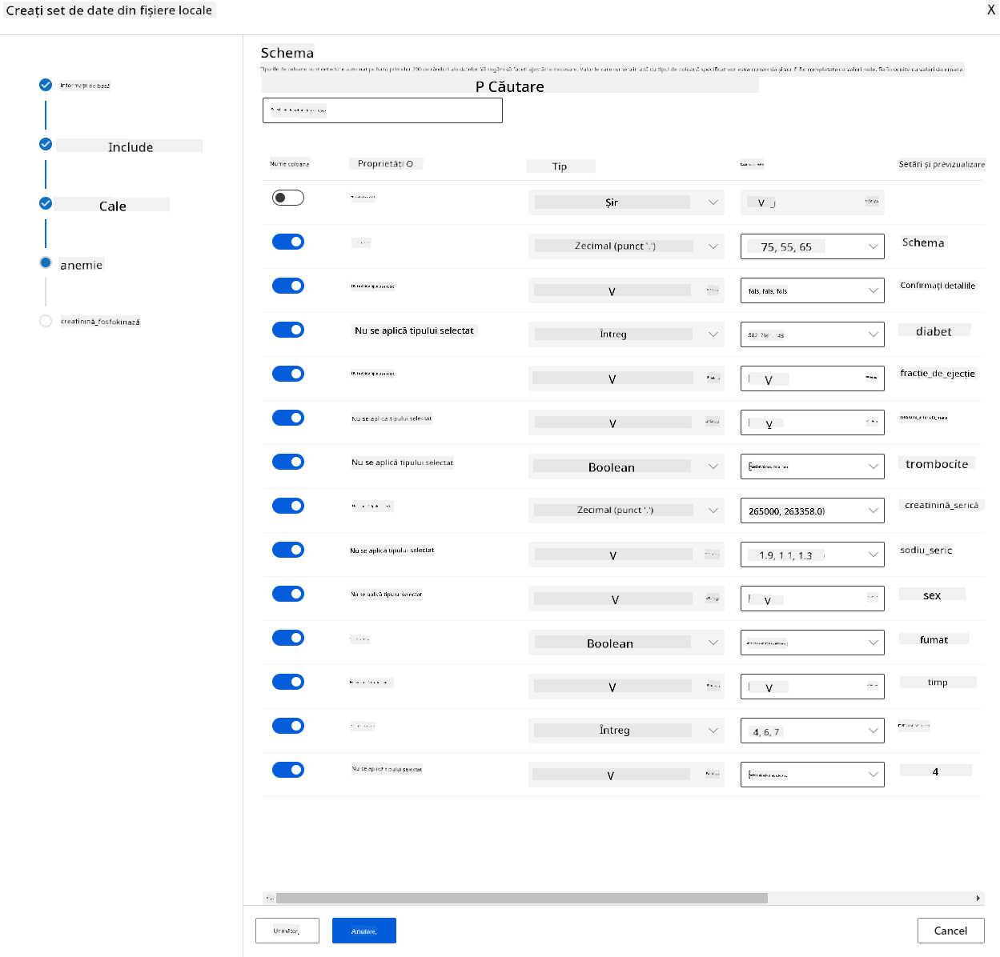

Grozaav! Acum că setul de date este pregătit și clusterul de calcul este creat, putem începe antrenarea modelului!

### 2.4 Antrenare Low code/No code cu AutoML

Dezvoltarea tradițională a modelelor de învățare automată este consumatoare de resurse, necesită cunoștințe semnificative de domeniu și timp pentru a produce și compara zeci de modele. Învățarea automată automată (AutoML) este procesul de automatizare a sarcinilor iterative și consumatoare de timp din dezvoltarea modelelor de învățare automată. Aceasta permite oamenilor de știință în date, analiștilor și dezvoltatorilor să construiască modele ML la scară mare, cu eficiență și productivitate ridicată, menținând în același timp calitatea modelului. Reduce timpul necesar pentru a obține modele ML gata de producție, cu ușurință și eficiență. [Aflați mai multe](https://docs.microsoft.com/azure/machine-learning/concept-automated-ml?WT.mc_id=academic-77958-bethanycheum&ocid=AID3041109)

1. În [spațiul de lucru Azure ML](https://ml.azure.com/) pe care l-am creat anterior, faceți clic pe "Automated ML" în meniul din stânga și selectați setul de date pe care tocmai l-ați încărcat. Faceți clic pe Next.

   

2. Introduceți un nume nou pentru experiment, coloana țintă (DEATH_EVENT) și clusterul de calcul pe care l-am creat. Faceți clic pe Next.

   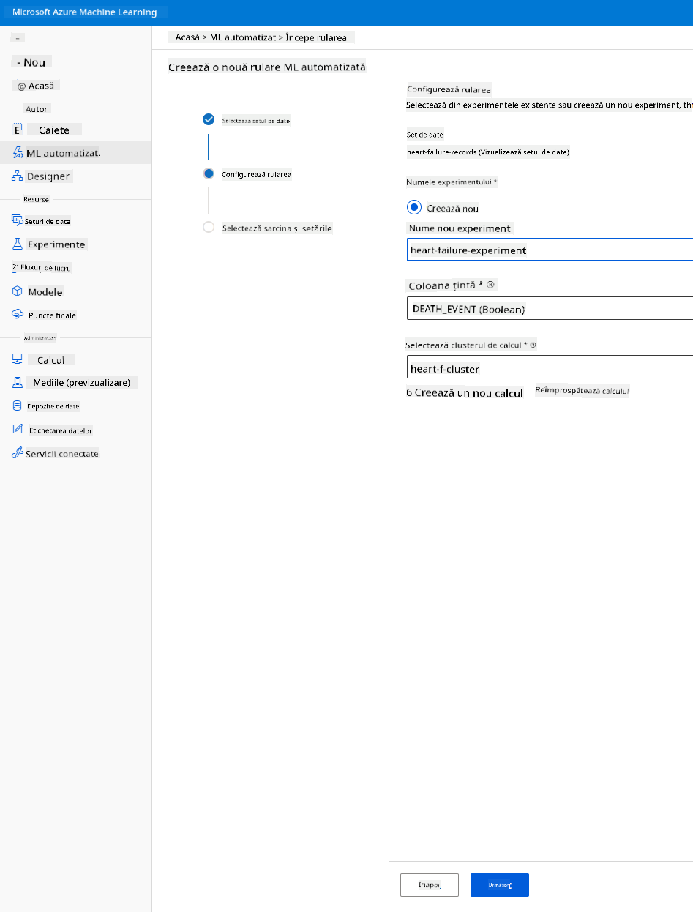

3. Alegeți "Classification" și faceți clic pe Finish. Acest pas poate dura între 30 de minute și 1 oră, în funcție de dimensiunea clusterului de calcul.

   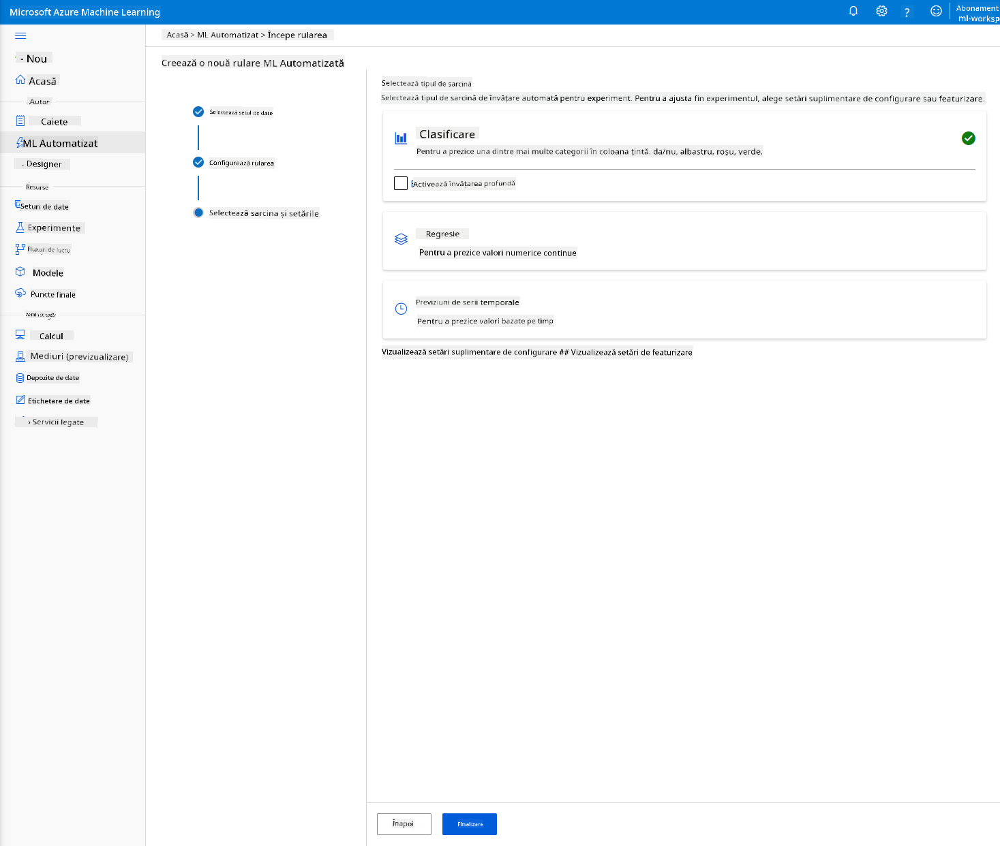

4. Odată ce rularea este completă, faceți clic pe fila "Automated ML", faceți clic pe rularea dvs. și apoi pe algoritmul din cardul "Best model summary".

   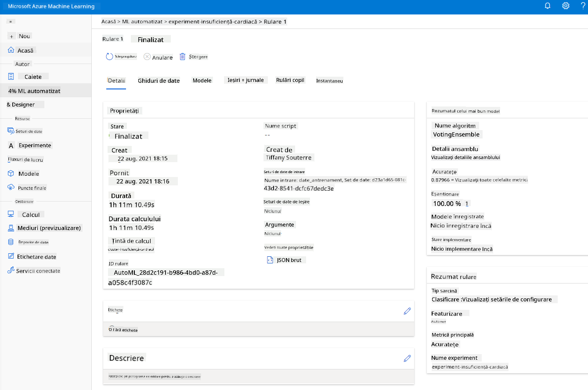

Aici puteți vedea o descriere detaliată a celui mai bun model generat de AutoML. De asemenea, puteți explora alte modele generate în fila Models. Luați câteva minute pentru a explora modelele din butonul Explanations (preview). Odată ce ați ales modelul pe care doriți să-l utilizați (aici vom alege cel mai bun model selectat de AutoML), vom vedea cum îl putem implementa.

## 3. Implementare Low code/No code a modelului și consumul endpoint-ului
### 3.1 Implementarea modelului

Interfața de învățare automată automată vă permite să implementați cel mai bun model ca serviciu web în câțiva pași. Implementarea reprezintă integrarea modelului astfel încât să poată face predicții pe baza unor date noi și să identifice potențiale oportunități. Pentru acest proiect, implementarea ca serviciu web înseamnă că aplicațiile medicale vor putea consuma modelul pentru a face predicții în timp real despre riscul pacienților de a suferi un atac de cord.

În descrierea celui mai bun model, faceți clic pe butonul "Deploy".

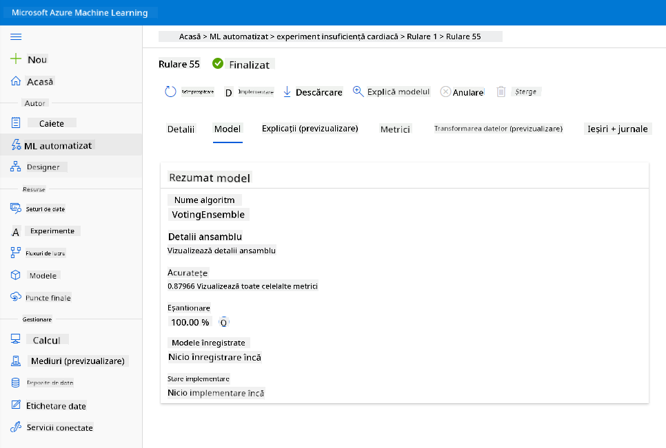

15. Dați-i un nume, o descriere, tipul de calcul (Azure Container Instance), activați autentificarea și faceți clic pe Deploy. Acest pas poate dura aproximativ 20 de minute pentru a fi finalizat. Procesul de implementare implică mai mulți pași, inclusiv înregistrarea modelului, generarea resurselor și configurarea acestora pentru serviciul web. Un mesaj de stare apare sub Deploy status. Selectați Refresh periodic pentru a verifica starea implementării. Este implementat și funcțional atunci când starea este "Healthy".

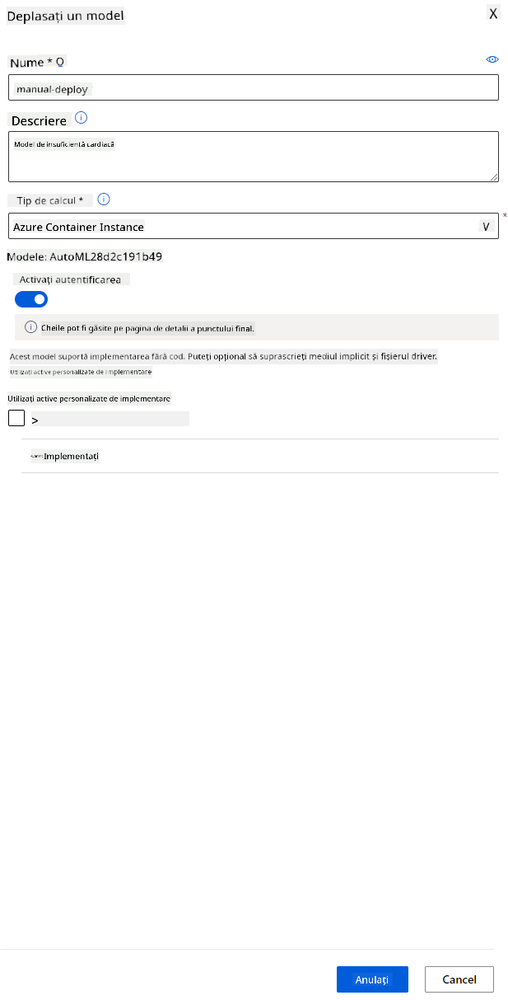

16. Odată ce a fost implementat, faceți clic pe fila Endpoint și apoi pe endpoint-ul pe care tocmai l-ați implementat. Aici puteți găsi toate detaliile despre endpoint.

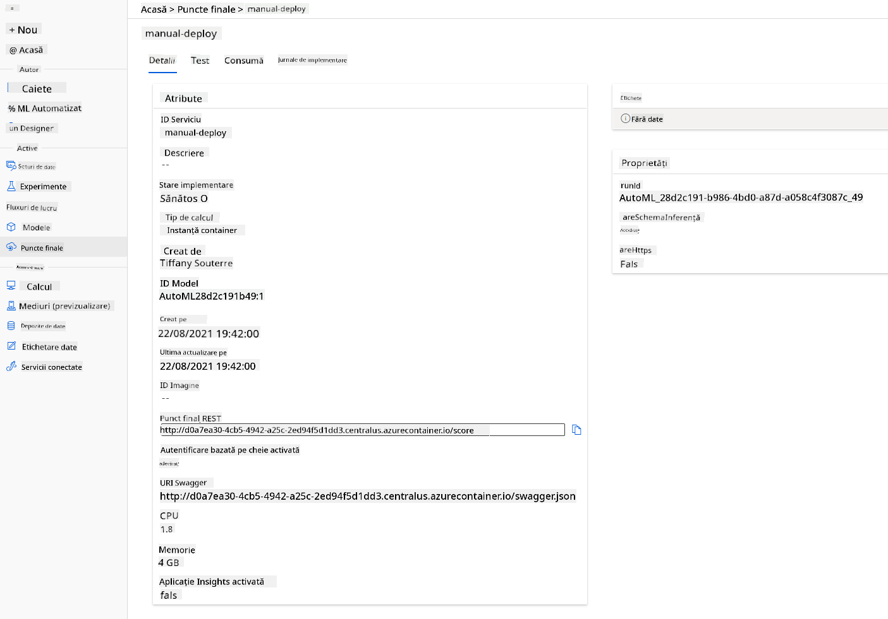

Uimitor! Acum că avem un model implementat, putem începe consumul endpoint-ului.

### 3.2 Consumarea endpoint-ului

Faceți clic pe fila "Consume". Aici puteți găsi endpoint-ul REST și un script Python în opțiunea de consum. Luați-vă timp pentru a citi codul Python.

Acest script poate fi rulat direct de pe mașina dvs. locală și va consuma endpoint-ul.

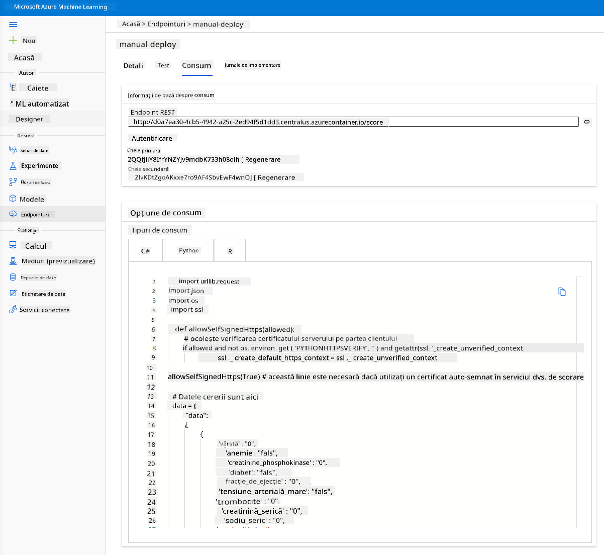

Luați un moment pentru a verifica aceste 2 linii de cod:

```python
url = 'http://98e3715f-xxxx-xxxx-xxxx-9ec22d57b796.centralus.azurecontainer.io/score'
api_key = '' # Replace this with the API key for the web service
```
Variabila `url` este endpoint-ul REST găsit în fila consume, iar variabila `api_key` este cheia primară găsită tot în fila consume (doar în cazul în care ați activat autentificarea). Așa poate scriptul să consume endpoint-ul.

18. Rulând scriptul, ar trebui să vedeți următorul rezultat:
    ```python
    b'"{\\"result\\": [true]}"'
    ```
Aceasta înseamnă că predicția insuficienței cardiace pentru datele date este adevărată. Acest lucru are sens, deoarece, dacă analizați mai atent datele generate automat în script, totul este setat la 0 și fals în mod implicit. Puteți schimba datele cu următorul eșantion de intrare:

```python
data = {
    "data":
    [
        {
            'age': "0",
            'anaemia': "false",
            'creatinine_phosphokinase': "0",
            'diabetes': "false",
            'ejection_fraction': "0",
            'high_blood_pressure': "false",
            'platelets': "0",
            'serum_creatinine': "0",
            'serum_sodium': "0",
            'sex': "false",
            'smoking': "false",
            'time': "0",
        },
        {
            'age': "60",
            'anaemia': "false",
            'creatinine_phosphokinase': "500",
            'diabetes': "false",
            'ejection_fraction': "38",
            'high_blood_pressure': "false",
            'platelets': "260000",
            'serum_creatinine': "1.40",
            'serum_sodium': "137",
            'sex': "false",
            'smoking': "false",
            'time': "130",
        },
    ],
}
```
Scriptul ar trebui să returneze:
    ```python
    b'"{\\"result\\": [true, false]}"'
    ```

Felicitări! Tocmai ați consumat modelul implementat și l-ați antrenat pe Azure ML!

> **_NOTE:_** După ce ați terminat proiectul, nu uitați să ștergeți toate resursele.
## 🚀 Provocare

Analizați cu atenție explicațiile și detaliile modelului pe care AutoML le-a generat pentru modelele de top. Încercați să înțelegeți de ce cel mai bun model este mai bun decât celelalte. Ce algoritmi au fost comparați? Care sunt diferențele dintre ele? De ce cel mai bun model are performanțe mai bune în acest caz?

## [Post-Lecture Quiz](https://purple-hill-04aebfb03.1.azurestaticapps.net/quiz/35)

## Recapitulare și studiu individual

În această lecție, ați învățat cum să antrenați, să implementați și să consumați un model pentru a prezice riscul de insuficiență cardiacă într-un mod Low code/No code în cloud. Dacă nu ați făcut-o încă, aprofundați explicațiile modelului pe care AutoML le-a generat pentru modelele de top și încercați să înțelegeți de ce cel mai bun model este mai bun decât celelalte.

Puteți merge mai departe cu AutoML Low code/No code citind această [documentație](https://docs.microsoft.com/azure/machine-learning/tutorial-first-experiment-automated-ml?WT.mc_id=academic-77958-bethanycheum&ocid=AID3041109).

## Temă

[Proiect de știința datelor Low code/No code pe Azure ML](assignment.md)

---

**Declinarea responsabilității**:  
Acest document a fost tradus folosind serviciul de traducere AI [Co-op Translator](https://github.com/Azure/co-op-translator). Deși depunem eforturi pentru a asigura acuratețea, vă rugăm să aveți în vedere că traducerile automate pot conține erori sau inexactități. Documentul original în limba sa nativă ar trebui considerat sursa autoritară. Pentru informații critice, se recomandă traducerea profesională realizată de un specialist uman. Nu ne asumăm răspunderea pentru eventualele neînțelegeri sau interpretări greșite care pot apărea din utilizarea acestei traduceri.