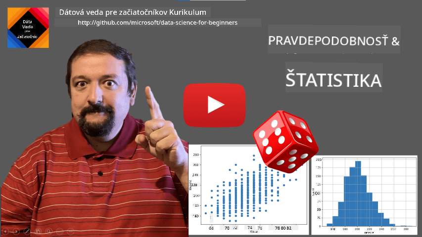
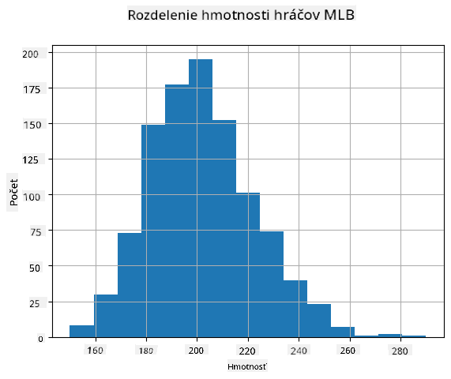
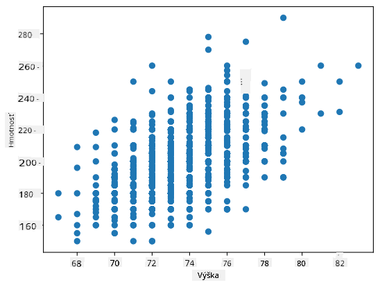

<!--
CO_OP_TRANSLATOR_METADATA:
{
  "original_hash": "b706a07cfa87ba091cbb91e0aa775600",
  "translation_date": "2025-08-26T15:37:18+00:00",
  "source_file": "1-Introduction/04-stats-and-probability/README.md",
  "language_code": "sk"
}
-->
# Stručný úvod do štatistiky a pravdepodobnosti

| ](../../sketchnotes/04-Statistics-Probability.png)|
|:---:|
| Štatistika a pravdepodobnosť - _Sketchnote od [@nitya](https://twitter.com/nitya)_ |

Teória štatistiky a pravdepodobnosti sú dve úzko súvisiace oblasti matematiky, ktoré majú veľký význam pre dátovú vedu. Dáta je možné spracovávať aj bez hlbokých znalostí matematiky, ale je lepšie poznať aspoň základné koncepty. Tu vám predstavíme krátky úvod, ktorý vám pomôže začať.

[](https://youtu.be/Z5Zy85g4Yjw)

## [Kvíz pred prednáškou](https://purple-hill-04aebfb03.1.azurestaticapps.net/quiz/6)

## Pravdepodobnosť a náhodné premenné

**Pravdepodobnosť** je číslo medzi 0 a 1, ktoré vyjadruje, aká pravdepodobná je určitá **udalosť**. Definuje sa ako počet pozitívnych výsledkov (ktoré vedú k udalosti) delený celkovým počtom výsledkov, za predpokladu, že všetky výsledky sú rovnako pravdepodobné. Napríklad, keď hodíme kockou, pravdepodobnosť, že padne párne číslo, je 3/6 = 0,5.

Keď hovoríme o udalostiach, používame **náhodné premenné**. Napríklad náhodná premenná, ktorá reprezentuje číslo získané pri hode kockou, by nadobúdala hodnoty od 1 do 6. Súbor čísel od 1 do 6 sa nazýva **priestor vzorky**. Môžeme hovoriť o pravdepodobnosti, že náhodná premenná nadobudne určitú hodnotu, napríklad P(X=3)=1/6.

Náhodná premenná v predchádzajúcom príklade sa nazýva **diskrétna**, pretože má spočítateľný priestor vzorky, t. j. existujú samostatné hodnoty, ktoré je možné vymenovať. Existujú prípady, keď priestor vzorky je rozsah reálnych čísel alebo celá množina reálnych čísel. Takéto premenné sa nazývajú **spojité**. Dobrým príkladom je čas príchodu autobusu.

## Pravdepodobnostné rozdelenie

V prípade diskrétnych náhodných premenných je jednoduché opísať pravdepodobnosť každej udalosti pomocou funkcie P(X). Pre každú hodnotu *s* z priestoru vzorky *S* poskytne číslo od 0 do 1, pričom súčet všetkých hodnôt P(X=s) pre všetky udalosti bude 1.

Najznámejším diskrétnym rozdelením je **rovnomerné rozdelenie**, v ktorom existuje priestor vzorky s N prvkami, s rovnakou pravdepodobnosťou 1/N pre každý z nich.

Je ťažšie opísať pravdepodobnostné rozdelenie spojitej premennej, s hodnotami z nejakého intervalu [a,b] alebo celej množiny reálnych čísel ℝ. Zvážte prípad času príchodu autobusu. V skutočnosti je pravdepodobnosť, že autobus príde presne v určitom čase *t*, rovná 0!

> Teraz viete, že udalosti s pravdepodobnosťou 0 sa stávajú, a to veľmi často! Aspoň vždy, keď autobus príde!

Môžeme hovoriť iba o pravdepodobnosti, že premenná spadne do daného intervalu hodnôt, napr. P(t<sub>1</sub>≤X<t<sub>2</sub>). V tomto prípade je pravdepodobnostné rozdelenie opísané pomocou **funkcie hustoty pravdepodobnosti** p(x), tak, že


Spojitý analóg rovnomerného rozdelenia sa nazýva **spojité rovnomerné**, ktoré je definované na konečnom intervale. Pravdepodobnosť, že hodnota X spadne do intervalu dĺžky l, je úmerná l a stúpa až na 1.

Ďalším dôležitým rozdelením je **normálne rozdelenie**, o ktorom budeme hovoriť podrobnejšie nižšie.

## Priemer, rozptyl a štandardná odchýlka

Predpokladajme, že vyberieme sekvenciu n vzoriek náhodnej premennej X: x<sub>1</sub>, x<sub>2</sub>, ..., x<sub>n</sub>. Môžeme definovať **priemernú** (alebo **aritmetickú priemernú**) hodnotu sekvencie tradičným spôsobom ako (x<sub>1</sub>+x<sub>2</sub>+x<sub>n</sub>)/n. Ako zväčšujeme veľkosť vzorky (t. j. berieme limit s n→∞), získame priemer (nazývaný tiež **očakávanie**) rozdelenia. Očakávanie označíme ako **E**(x).

> Dá sa ukázať, že pre akékoľvek diskrétne rozdelenie s hodnotami {x<sub>1</sub>, x<sub>2</sub>, ..., x<sub>N</sub>} a zodpovedajúcimi pravdepodobnosťami p<sub>1</sub>, p<sub>2</sub>, ..., p<sub>N</sub>, očakávanie bude rovné E(X)=x<sub>1</sub>p<sub>1</sub>+x<sub>2</sub>p<sub>2</sub>+...+x<sub>N</sub>p<sub>N</sub>.

Na určenie, ako ďaleko sú hodnoty rozptýlené, môžeme vypočítať rozptyl σ<sup>2</sup> = ∑(x<sub>i</sub> - μ)<sup>2</sup>/n, kde μ je priemer sekvencie. Hodnota σ sa nazýva **štandardná odchýlka** a σ<sup>2</sup> sa nazýva **rozptyl**.

## Modus, medián a kvartily

Niekedy priemer nepredstavuje dostatočne "typickú" hodnotu pre dáta. Napríklad, keď existuje niekoľko extrémnych hodnôt, ktoré sú úplne mimo rozsahu, môžu ovplyvniť priemer. Ďalším dobrým ukazovateľom je **medián**, hodnota, taká že polovica dátových bodov je nižšia ako ona a druhá polovica vyššia.

Na lepšie pochopenie rozdelenia dát je užitočné hovoriť o **kvartiloch**:

* Prvý kvartil, alebo Q1, je hodnota, taká že 25% dát je pod ňou
* Tretí kvartil, alebo Q3, je hodnota, taká že 75% dát je pod ňou

Graficky môžeme vzťah medzi mediánom a kvartilmi znázorniť v diagrame nazývanom **box plot**:


Tu tiež vypočítame **medzikvartilový rozsah** IQR=Q3-Q1 a tzv. **odľahlé hodnoty** - hodnoty, ktoré ležia mimo hraníc [Q1-1.5*IQR,Q3+1.5*IQR].

Pre konečné rozdelenie, ktoré obsahuje malý počet možných hodnôt, je dobrá "typická" hodnota tá, ktorá sa objavuje najčastejšie, nazývaná **modus**. Často sa používa pri kategorizovaných dátach, ako sú farby. Zvážte situáciu, keď máme dve skupiny ľudí - niektorí silne preferujú červenú a iní modrú. Ak kódujeme farby číslami, priemerná hodnota pre obľúbenú farbu by bola niekde v oranžovo-zelenej škále, čo nevyjadruje skutočnú preferenciu ani jednej skupiny. Modus by však bol buď jedna z farieb, alebo obe farby, ak je počet ľudí hlasujúcich za ne rovnaký (v tomto prípade nazývame vzorku **multimodálnou**).

## Dáta z reálneho sveta

Keď analyzujeme dáta z reálneho života, často nie sú náhodnými premennými v tom zmysle, že nevykonávame experimenty s neznámym výsledkom. Napríklad, zvážte tím baseballových hráčov a ich telesné údaje, ako výška, váha a vek. Tieto čísla nie sú presne náhodné, ale stále môžeme aplikovať rovnaké matematické koncepty. Napríklad, sekvencia váh ľudí môže byť považovaná za sekvenciu hodnôt získaných z nejakej náhodnej premennej. Nižšie je sekvencia váh skutočných baseballových hráčov z [Major League Baseball](http://mlb.mlb.com/index.jsp), prevzatá z [tohto datasetu](http://wiki.stat.ucla.edu/socr/index.php/SOCR_Data_MLB_HeightsWeights) (pre vaše pohodlie je zobrazených iba prvých 20 hodnôt):

```
[180.0, 215.0, 210.0, 210.0, 188.0, 176.0, 209.0, 200.0, 231.0, 180.0, 188.0, 180.0, 185.0, 160.0, 180.0, 185.0, 197.0, 189.0, 185.0, 219.0]
```

> **Poznámka**: Ak chcete vidieť príklad práce s týmto datasetom, pozrite si [príslušný notebook](notebook.ipynb). V priebehu tejto lekcie je tiež množstvo výziev, ktoré môžete splniť pridaním kódu do tohto notebooku. Ak si nie ste istí, ako pracovať s dátami, nebojte sa - k práci s dátami pomocou Pythonu sa vrátime neskôr. Ak neviete, ako spustiť kód v Jupyter Notebooku, pozrite si [tento článok](https://soshnikov.com/education/how-to-execute-notebooks-from-github/).

Tu je box plot zobrazujúci priemer, medián a kvartily pre naše dáta:


Keďže naše dáta obsahujú informácie o rôznych hráčskych **rolách**, môžeme tiež vytvoriť box plot podľa rolí - umožní nám to získať predstavu o tom, ako sa hodnoty parametrov líšia medzi rolami. Tentoraz zvážime výšku:


Tento diagram naznačuje, že priemerná výška hráčov na prvej základni je vyššia ako výška hráčov na druhej základni. Neskôr v tejto lekcii sa naučíme, ako môžeme túto hypotézu formálnejšie testovať a ako demonštrovať, že naše dáta sú štatisticky významné na jej potvrdenie.

> Pri práci s dátami z reálneho sveta predpokladáme, že všetky dátové body sú vzorky získané z nejakého pravdepodobnostného rozdelenia. Tento predpoklad nám umožňuje aplikovať techniky strojového učenia a vytvárať funkčné prediktívne modely.

Aby sme videli, aké je rozdelenie našich dát, môžeme nakresliť graf nazývaný **histogram**. X-os bude obsahovať počet rôznych intervalov váhy (tzv. **bins**) a vertikálna os bude ukazovať počet prípadov, keď naša vzorka náhodnej premennej spadla do daného intervalu.



Z tohto histogramu vidíte, že všetky hodnoty sú sústredené okolo určitého priemeru váhy a čím ďalej ideme od tejto váhy, tým menej váh tejto hodnoty sa vyskytuje. T. j., je veľmi nepravdepodobné, že váha baseballového hráča bude veľmi odlišná od priemernej váhy. Rozptyl váh ukazuje rozsah, v akom sa váhy pravdepodobne líšia od priemeru.

> Ak vezmeme váhy iných ľudí, nie z baseballovej ligy, rozdelenie bude pravdepodobne odlišné. Avšak tvar rozdelenia bude rovnaký, ale priemer a rozptyl sa zmenia. Takže, ak trénujeme náš model na baseballových hráčoch, je pravdepodobné, že poskytne nesprávne výsledky, keď sa aplikuje na študentov univerzity, pretože základné rozdelenie je odlišné.

## Normálne rozdelenie

Rozdelenie váh, ktoré sme videli vyššie, je veľmi typické a mnoho meraní z reálneho sveta nasleduje rovnaký typ rozdelenia, ale s rôznym priemerom a rozptylom. Toto rozdelenie sa nazýva **normálne rozdelenie** a zohráva veľmi dôležitú úlohu v štatistike.

Použitie normálneho rozdelenia je správny spôsob generovania náhodných váh potenciálnych baseballových hráčov. Akonáhle poznáme priemernú váhu `mean` a štandardnú odchýlku `std`, môžeme vygenerovať 1000 vzoriek váhy nasledujúcim spôsobom:
```python
samples = np.random.normal(mean,std,1000)
``` 

Ak nakreslíme histogram vygenerovaných vzoriek, uvidíme obraz veľmi podobný tomu, ktorý je uvedený vyššie. A ak zvýšime počet vzoriek a počet bins, môžeme vygenerovať obraz normálneho rozdelenia, ktorý je bližší ideálu:


*Normálne rozdelenie s mean=0 a std.dev=1*

## Intervaly spoľahlivosti

Keď hovoríme o váhach baseballových hráčov, predpokladáme, že existuje určitá **náhodná premenná W**, ktorá zodpovedá ideálnemu pravdepodobnostnému rozdeleniu váh všetkých baseballových hráčov (tzv. **populácia**). Naša sekvencia váh zodpovedá podmnožine všetkých baseballových hráčov, ktorú nazývame **vzorka**. Zaujímavou otázkou je, či môžeme poznať parametre rozdelenia W, t. j. priemer a rozptyl populácie?

Najjednoduchšou odpoveďou by bolo vypočítať priemer a rozptyl našej vzorky. Avšak môže sa stať, že naša náhodná vzorka nepresne reprezentuje celú populáciu. Preto má zmysel hovoriť o **intervale spoľahlivosti**.
> **Interval spoľahlivosti** je odhad skutočného priemeru populácie na základe našej vzorky, ktorý je presný s určitou pravdepodobnosťou (alebo **úrovňou spoľahlivosti**).
Predpokladajme, že máme vzorku X<sub>1</sub>, ..., X<sub>n</sub> z našej distribúcie. Pri každom odobratí vzorky z našej distribúcie by sme získali inú hodnotu priemeru μ. Preto môže byť μ považované za náhodnú premennú. **Interval spoľahlivosti** s pravdepodobnosťou p je dvojica hodnôt (L<sub>p</sub>,R<sub>p</sub>), taká, že **P**(L<sub>p</sub>≤μ≤R<sub>p</sub>) = p, t.j. pravdepodobnosť, že nameraná hodnota priemeru spadne do intervalu, sa rovná p.

Podrobný výpočet týchto intervalov spoľahlivosti presahuje rámec nášho krátkeho úvodu. Viac podrobností nájdete [na Wikipédii](https://en.wikipedia.org/wiki/Confidence_interval). Stručne povedané, definujeme distribúciu vypočítaného priemeru vzorky vzhľadom na skutočný priemer populácie, čo sa nazýva **študentova distribúcia**.

> **Zaujímavý fakt**: Študentova distribúcia je pomenovaná po matematikovi Williamovi Sealy Gossetovi, ktorý publikoval svoj článok pod pseudonymom "Študent". Pracoval v pivovare Guinness a podľa jednej z verzií jeho zamestnávateľ nechcel, aby verejnosť vedela, že používajú štatistické testy na určenie kvality surovín.

Ak chceme odhadnúť priemer μ našej populácie s pravdepodobnosťou p, musíme vziať *(1-p)/2-tý percentil* zo študentovej distribúcie A, ktorý môže byť buď získaný z tabuliek, alebo vypočítaný pomocou zabudovaných funkcií štatistického softvéru (napr. Python, R, atď.). Potom by interval pre μ bol daný X±A*D/√n, kde X je získaný priemer vzorky, D je štandardná odchýlka.

> **Poznámka**: Vynechávame aj diskusiu o dôležitom koncepte [stupňov voľnosti](https://en.wikipedia.org/wiki/Degrees_of_freedom_(statistics)), ktorý je dôležitý v súvislosti so študentovou distribúciou. Pre hlbšie pochopenie tohto konceptu môžete odkázať na komplexnejšie knihy o štatistike.

Príklad výpočtu intervalu spoľahlivosti pre hmotnosti a výšky je uvedený v [sprievodných poznámkových blokoch](notebook.ipynb).

| p | Priemer hmotnosti |
|-----|------------------|
| 0.85 | 201.73±0.94     |
| 0.90 | 201.73±1.08     |
| 0.95 | 201.73±1.28     |

Všimnite si, že čím vyššia je pravdepodobnosť spoľahlivosti, tým širší je interval spoľahlivosti.

## Testovanie hypotéz

V našej databáze hráčov baseballu existujú rôzne hráčske role, ktoré môžeme zhrnúť nasledovne (pozrite si [sprievodný poznámkový blok](notebook.ipynb), aby ste videli, ako sa táto tabuľka dá vypočítať):

| Rola | Výška | Hmotnosť | Počet |
|------|-------|----------|-------|
| Catcher | 72.723684 | 204.328947 | 76 |
| Designated_Hitter | 74.222222 | 220.888889 | 18 |
| First_Baseman | 74.000000 | 213.109091 | 55 |
| Outfielder | 73.010309 | 199.113402 | 194 |
| Relief_Pitcher | 74.374603 | 203.517460 | 315 |
| Second_Baseman | 71.362069 | 184.344828 | 58 |
| Shortstop | 71.903846 | 182.923077 | 52 |
| Starting_Pitcher | 74.719457 | 205.163636 | 221 |
| Third_Baseman | 73.044444 | 200.955556 | 45 |

Môžeme si všimnúť, že priemerná výška hráčov na prvej méte je vyššia ako hráčov na druhej méte. Preto môžeme byť v pokušení dospieť k záveru, že **hráči na prvej méte sú vyšší ako hráči na druhej méte**.

> Toto tvrdenie sa nazýva **hypotéza**, pretože nevieme, či je tento fakt skutočne pravdivý alebo nie.

Avšak nie je vždy zrejmé, či môžeme urobiť tento záver. Z vyššie uvedenej diskusie vieme, že každý priemer má pridružený interval spoľahlivosti, a preto tento rozdiel môže byť len štatistická chyba. Potrebujeme formálnejší spôsob na testovanie našej hypotézy.

Poďme vypočítať intervaly spoľahlivosti samostatne pre výšky hráčov na prvej a druhej méte:

| Spoľahlivosť | Prvá méta | Druhá méta |
|--------------|-----------|------------|
| 0.85 | 73.62..74.38 | 71.04..71.69 |
| 0.90 | 73.56..74.44 | 70.99..71.73 |
| 0.95 | 73.47..74.53 | 70.92..71.81 |

Vidíme, že pri žiadnej spoľahlivosti sa intervaly neprekrývajú. To dokazuje našu hypotézu, že hráči na prvej méte sú vyšší ako hráči na druhej méte.

Formálnejšie, problém, ktorý riešime, je zistiť, či **dve pravdepodobnostné distribúcie sú rovnaké**, alebo aspoň majú rovnaké parametre. V závislosti od distribúcie musíme na to použiť rôzne testy. Ak vieme, že naše distribúcie sú normálne, môžeme použiť **[študentov t-test](https://en.wikipedia.org/wiki/Student%27s_t-test)**.

V študentovom t-teste vypočítame tzv. **t-hodnotu**, ktorá indikuje rozdiel medzi priemermi, pričom berie do úvahy rozptyl. Je dokázané, že t-hodnota nasleduje **študentovu distribúciu**, čo nám umožňuje získať prahovú hodnotu pre danú úroveň spoľahlivosti **p** (táto hodnota môže byť vypočítaná alebo vyhľadaná v numerických tabuľkách). Potom porovnáme t-hodnotu s touto prahovou hodnotou, aby sme hypotézu schválili alebo zamietli.

V Pythone môžeme použiť balík **SciPy**, ktorý obsahuje funkciu `ttest_ind` (okrem mnohých ďalších užitočných štatistických funkcií!). Táto funkcia vypočíta t-hodnotu za nás a tiež vykoná spätné vyhľadanie p-hodnoty spoľahlivosti, takže môžeme jednoducho pozrieť na spoľahlivosť a urobiť záver.

Napríklad naše porovnanie výšok hráčov na prvej a druhej méte nám dáva nasledujúce výsledky: 
```python
from scipy.stats import ttest_ind

tval, pval = ttest_ind(df.loc[df['Role']=='First_Baseman',['Height']], df.loc[df['Role']=='Designated_Hitter',['Height']],equal_var=False)
print(f"T-value = {tval[0]:.2f}\nP-value: {pval[0]}")
```
```
T-value = 7.65
P-value: 9.137321189738925e-12
```
V našom prípade je p-hodnota veľmi nízka, čo znamená, že existuje silný dôkaz podporujúci, že hráči na prvej méte sú vyšší.

Existujú aj rôzne iné typy hypotéz, ktoré by sme mohli chcieť testovať, napríklad:
* Dokázať, že daná vzorka nasleduje určitú distribúciu. V našom prípade sme predpokladali, že výšky sú normálne rozdelené, ale to si vyžaduje formálne štatistické overenie.
* Dokázať, že priemerná hodnota vzorky zodpovedá nejakej preddefinovanej hodnote.
* Porovnať priemery viacerých vzoriek (napr. aký je rozdiel v úrovniach šťastia medzi rôznymi vekovými skupinami).

## Zákon veľkých čísel a centrálna limitná veta

Jedným z dôvodov, prečo je normálne rozdelenie také dôležité, je tzv. **centrálna limitná veta**. Predpokladajme, že máme veľkú vzorku nezávislých N hodnôt X<sub>1</sub>, ..., X<sub>N</sub>, odobratých z akejkoľvek distribúcie s priemerom μ a rozptylom σ<sup>2</sup>. Potom, pre dostatočne veľké N (inými slovami, keď N→∞), priemer Σ<sub>i</sub>X<sub>i</sub> bude normálne rozdelený, s priemerom μ a rozptylom σ<sup>2</sup>/N.

> Ďalší spôsob interpretácie centrálnej limitnej vety je povedať, že bez ohľadu na distribúciu, keď vypočítate priemer súčtu akýchkoľvek hodnôt náhodných premenných, skončíte s normálnym rozdelením.

Z centrálnej limitnej vety tiež vyplýva, že keď N→∞, pravdepodobnosť, že priemer vzorky sa rovná μ, sa stáva 1. Toto je známe ako **zákon veľkých čísel**.

## Kovariancia a korelácia

Jednou z vecí, ktoré Data Science robí, je hľadanie vzťahov medzi dátami. Hovoríme, že dve sekvencie **korelujú**, keď vykazujú podobné správanie v rovnakom čase, t.j. buď stúpajú/klesajú súčasne, alebo jedna sekvencia stúpa, keď druhá klesá a naopak. Inými slovami, zdá sa, že medzi dvoma sekvenciami existuje nejaký vzťah.

> Korelácia nemusí nevyhnutne indikovať kauzálny vzťah medzi dvoma sekvenciami; niekedy obe premenné môžu závisieť od nejakej vonkajšej príčiny, alebo to môže byť čisto náhodou, že dve sekvencie korelujú. Avšak silná matematická korelácia je dobrým indikátorom, že dve premenné sú nejako prepojené.

Matematicky, hlavný koncept, ktorý ukazuje vzťah medzi dvoma náhodnými premennými, je **kovariancia**, ktorá sa počíta takto: Cov(X,Y) = **E**\[(X-**E**(X))(Y-**E**(Y))\]. Počítame odchýlku oboch premenných od ich priemerných hodnôt a potom súčin týchto odchýlok. Ak obe premenné odchýlia spolu, súčin bude vždy kladná hodnota, ktorá sa sčíta na kladnú kovarianciu. Ak obe premenné odchýlia nesúhlasne (t.j. jedna klesne pod priemer, keď druhá stúpa nad priemer), vždy dostaneme záporné čísla, ktoré sa sčítajú na zápornú kovarianciu. Ak odchýlky nie sú závislé, sčítajú sa približne na nulu.

Absolútna hodnota kovariancie nám veľa nehovorí o tom, aká veľká je korelácia, pretože závisí od veľkosti skutočných hodnôt. Na jej normalizáciu môžeme kovarianciu vydeliť štandardnou odchýlkou oboch premenných, aby sme získali **koreláciu**. Dobré na tom je, že korelácia je vždy v rozsahu [-1,1], kde 1 indikuje silnú pozitívnu koreláciu medzi hodnotami, -1 - silnú negatívnu koreláciu a 0 - žiadnu koreláciu (premenné sú nezávislé).

**Príklad**: Môžeme vypočítať koreláciu medzi hmotnosťami a výškami hráčov baseballu z vyššie uvedenej databázy:
```python
print(np.corrcoef(weights,heights))
```
Výsledkom je **korelačná matica** ako táto:
```
array([[1.        , 0.52959196],
       [0.52959196, 1.        ]])
```

> Korelačná matica C môže byť vypočítaná pre akýkoľvek počet vstupných sekvencií S<sub>1</sub>, ..., S<sub>n</sub>. Hodnota C<sub>ij</sub> je korelácia medzi S<sub>i</sub> a S<sub>j</sub>, a diagonálne prvky sú vždy 1 (čo je tiež samokorelácia S<sub>i</sub>).

V našom prípade hodnota 0.53 indikuje, že existuje určitá korelácia medzi hmotnosťou a výškou osoby. Môžeme tiež vytvoriť scatter plot jednej hodnoty proti druhej, aby sme videli vzťah vizuálne:



> Viac príkladov korelácie a kovariancie nájdete v [sprievodnom poznámkovom bloku](notebook.ipynb).

## Záver

V tejto sekcii sme sa naučili:

* základné štatistické vlastnosti dát, ako priemer, rozptyl, mód a kvartily
* rôzne distribúcie náhodných premenných, vrátane normálneho rozdelenia
* ako nájsť koreláciu medzi rôznymi vlastnosťami
* ako použiť matematický a štatistický aparát na dokázanie hypotéz
* ako vypočítať intervaly spoľahlivosti pre náhodnú premennú na základe vzorky dát

Aj keď toto určite nie je vyčerpávajúci zoznam tém, ktoré existujú v rámci pravdepodobnosti a štatistiky, malo by to byť dostatočné na to, aby vám poskytlo dobrý začiatok do tohto kurzu.

## 🚀 Výzva

Použite ukážkový kód v poznámkovom bloku na testovanie iných hypotéz:
1. Hráči na prvej méte sú starší ako hráči na druhej méte.
2. Hráči na prvej méte sú vyšší ako hráči na tretej méte.
3. Shortstops sú vyšší ako hráči na druhej méte.

## [Kvíz po prednáške](https://purple-hill-04aebfb03.1.azurestaticapps.net/quiz/7)

## Prehľad a samostatné štúdium

Pravdepodobnosť a štatistika je tak široká téma, že si zaslúži vlastný kurz. Ak máte záujem ísť hlbšie do teórie, môžete pokračovať v čítaní niektorých z nasledujúcich kníh:

1. [Carlos Fernandez-Granda](https://cims.nyu.edu/~cfgranda/) z New York University má skvelé poznámky z prednášok [Pravdepodobnosť a štatistika pre Data Science](https://cims.nyu.edu/~cfgranda/pages/stuff/probability_stats_for_DS.pdf) (dostupné online).
1. [Peter a Andrew Bruce. Praktická štatistika pre Data Scientists.](https://www.oreilly.com/library/view/practical-statistics-for/9781491952955/) [[ukážkový kód v R](https://github.com/andrewgbruce/statistics-for-data-scientists)].
1. [James D. Miller. Štatistika pre Data Science](https://www.packtpub.com/product/statistics-for-data-science/9781788290678) [[ukážkový kód v R](https://github.com/PacktPublishing/Statistics-for-Data-Science)].

## Zadanie

[Malá štúdia o diabete](assignment.md)

## Kredity

Táto lekcia bola vytvorená s ♥️ od [Dmitry Soshnikov](http://soshnikov.com).

---

**Upozornenie**:  
Tento dokument bol preložený pomocou služby AI prekladu [Co-op Translator](https://github.com/Azure/co-op-translator). Hoci sa snažíme o presnosť, prosím, berte na vedomie, že automatizované preklady môžu obsahovať chyby alebo nepresnosti. Pôvodný dokument v jeho pôvodnom jazyku by mal byť považovaný za autoritatívny zdroj. Pre kritické informácie sa odporúča profesionálny ľudský preklad. Nenesieme zodpovednosť za akékoľvek nedorozumenia alebo nesprávne interpretácie vyplývajúce z použitia tohto prekladu.