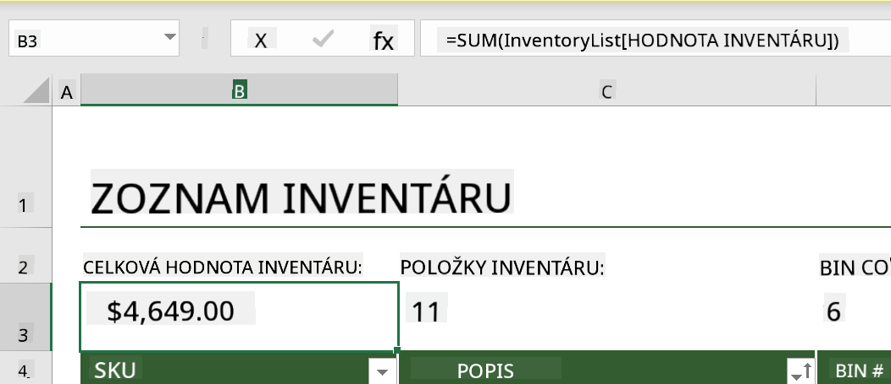
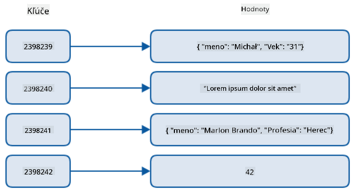
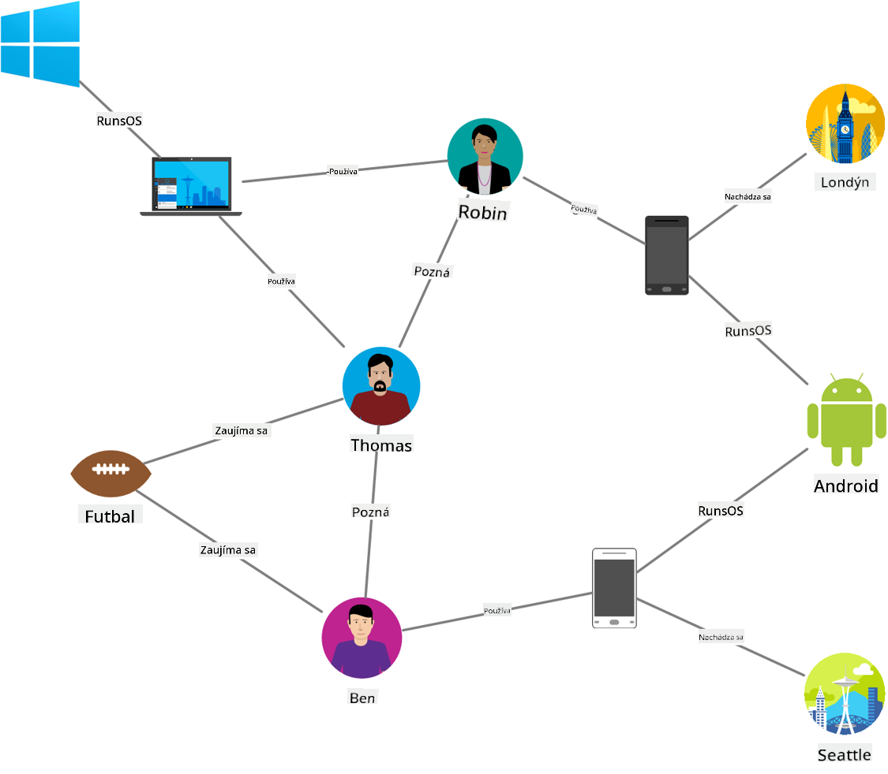
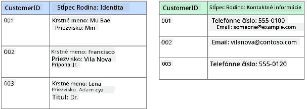
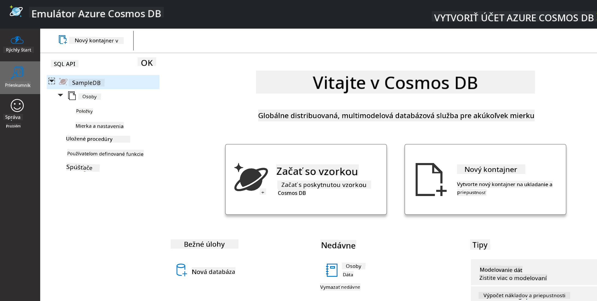
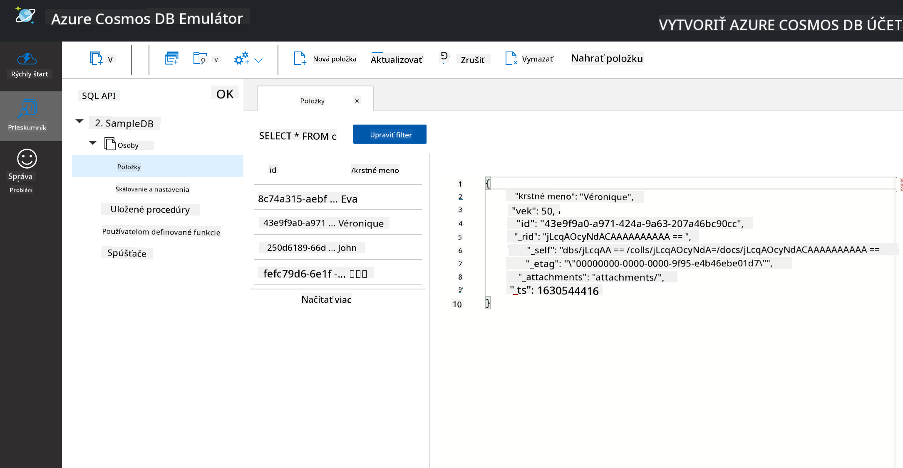
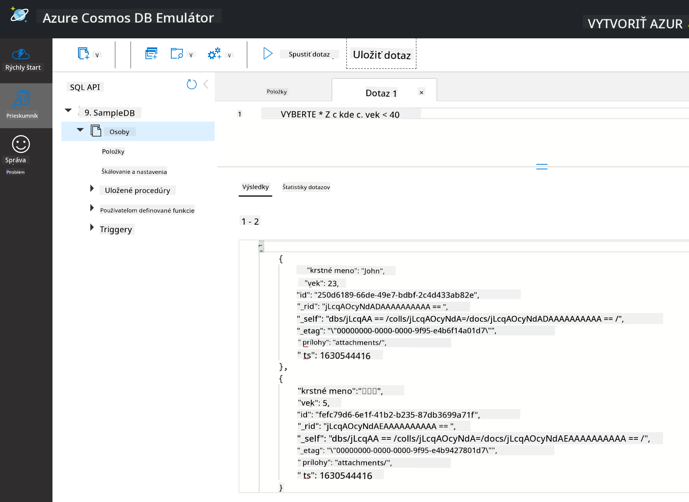

<!--
CO_OP_TRANSLATOR_METADATA:
{
  "original_hash": "32ddfef8121650f2ca2f3416fd283c37",
  "translation_date": "2025-08-26T14:54:43+00:00",
  "source_file": "2-Working-With-Data/06-non-relational/README.md",
  "language_code": "sk"
}
-->
# Práca s dátami: Nerelačné dáta

| ](../../sketchnotes/06-NoSQL.png)|
|:---:|
|Práca s NoSQL dátami - _Sketchnote od [@nitya](https://twitter.com/nitya)_ |

## [Kvíz pred prednáškou](https://purple-hill-04aebfb03.1.azurestaticapps.net/quiz/10)

Dáta nie sú obmedzené len na relačné databázy. Táto lekcia sa zameriava na nerelačné dáta a pokryje základy tabuľkových procesorov a NoSQL.

## Tabuľkové procesory

Tabuľkové procesory sú populárnym spôsobom ukladania a skúmania dát, pretože ich nastavenie a používanie vyžaduje menej práce. V tejto lekcii sa naučíte základné komponenty tabuľkového procesora, ako aj vzorce a funkcie. Príklady budú ilustrované pomocou Microsoft Excel, ale väčšina častí a tém bude mať podobné názvy a kroky v porovnaní s iným softvérom na tabuľkové procesory.


Tabuľkový procesor je súbor, ktorý bude prístupný v súborovom systéme počítača, zariadenia alebo cloudového úložiska. Samotný softvér môže byť založený na prehliadači alebo aplikácia, ktorú je potrebné nainštalovať na počítač alebo stiahnuť ako aplikáciu. V Exceli sú tieto súbory definované ako **zošity** a táto terminológia bude použitá v zvyšku tejto lekcie.

Zošit obsahuje jeden alebo viac **pracovných listov**, pričom každý pracovný list je označený kartami. V rámci pracovného listu sú obdĺžniky nazývané **bunky**, ktoré obsahujú skutočné dáta. Bunky sú priesečníkom riadkov a stĺpcov, pričom stĺpce sú označené abecednými znakmi a riadky číselne. Niektoré tabuľky obsahujú hlavičky v prvých niekoľkých riadkoch na popis dát v bunke.

S týmito základnými prvkami zošita Excel použijeme príklad z [Microsoft Templates](https://templates.office.com/) zameraný na inventár, aby sme prešli niektoré ďalšie časti tabuľkového procesora.

### Správa inventára

Súbor tabuľkového procesora s názvom "InventoryExample" je formátovaná tabuľka položiek v inventári, ktorá obsahuje tri pracovné listy, pričom karty sú označené ako "Inventory List", "Inventory Pick List" a "Bin Lookup". Riadok 4 pracovného listu Inventory List je hlavička, ktorá popisuje hodnotu každej bunky v stĺpci hlavičky.


Existujú prípady, keď je hodnota bunky závislá od hodnôt iných buniek na jej výpočet. Tabuľka Inventory List sleduje náklady na každú položku v inventári, ale čo ak potrebujeme vedieť hodnotu všetkého v inventári? [**Vzorce**](https://support.microsoft.com/en-us/office/overview-of-formulas-34519a4e-1e8d-4f4b-84d4-d642c4f63263) vykonávajú operácie na dátach v bunkách a v tomto príklade sa používajú na výpočet hodnoty inventára. Táto tabuľka použila vzorec v stĺpci Inventory Value na výpočet hodnoty každej položky vynásobením množstva pod hlavičkou QTY a nákladov pod hlavičkou COST. Dvojité kliknutie alebo zvýraznenie bunky zobrazí vzorec. Všimnete si, že vzorce začínajú znamienkom rovnosti, za ktorým nasleduje výpočet alebo operácia.



Môžeme použiť ďalší vzorec na sčítanie všetkých hodnôt stĺpca Inventory Value, aby sme získali jeho celkovú hodnotu. To by sa dalo vypočítať pridaním každej bunky, ale to môže byť zdĺhavá úloha. Excel má [**funkcie**](https://support.microsoft.com/en-us/office/sum-function-043e1c7d-7726-4e80-8f32-07b23e057f89), alebo preddefinované vzorce na vykonávanie výpočtov na hodnotách buniek. Funkcie vyžadujú argumenty, čo sú potrebné hodnoty na vykonanie týchto výpočtov. Keď funkcie vyžadujú viac ako jeden argument, musia byť uvedené v konkrétnom poradí, inak funkcia nemusí vypočítať správnu hodnotu. Tento príklad používa funkciu SUM a používa hodnoty stĺpca Inventory Value ako argument na sčítanie, čím generuje celkovú hodnotu uvedenú v riadku 3, stĺpci B (tiež označovanom ako B3).

## NoSQL

NoSQL je zastrešujúci termín pre rôzne spôsoby ukladania nerelačných dát a môže byť interpretovaný ako "non-SQL", "nerelačné" alebo "nielen SQL". Tieto typy databázových systémov môžeme rozdeliť do 4 kategórií.


> Zdroj: [Michał Białecki Blog](https://www.michalbialecki.com/2018/03/18/azure-cosmos-db-key-value-database-cloud/)

[Key-value](https://docs.microsoft.com/en-us/azure/architecture/data-guide/big-data/non-relational-data#keyvalue-data-stores) databázy spájajú unikátne kľúče, ktoré sú jedinečnými identifikátormi spojenými s hodnotou. Tieto páry sú uložené pomocou [hash tabuľky](https://www.hackerearth.com/practice/data-structures/hash-tables/basics-of-hash-tables/tutorial/) s vhodnou hashovacou funkciou.


> Zdroj: [Microsoft](https://docs.microsoft.com/en-us/azure/cosmos-db/graph/graph-introduction#graph-database-by-example)

[Grafové](https://docs.microsoft.com/en-us/azure/architecture/data-guide/big-data/non-relational-data#graph-data-stores) databázy popisujú vzťahy v dátach a sú reprezentované ako kolekcia uzlov a hrán. Uzol predstavuje entitu, niečo, čo existuje v reálnom svete, ako napríklad študent alebo bankový výpis. Hrany predstavujú vzťah medzi dvoma entitami. Každý uzol a hrana majú vlastnosti, ktoré poskytujú dodatočné informácie o každom uzle a hrane.



[Stĺpcové](https://docs.microsoft.com/en-us/azure/architecture/data-guide/big-data/non-relational-data#columnar-data-stores) databázy organizujú dáta do stĺpcov a riadkov podobne ako relačné štruktúry, ale každý stĺpec je rozdelený do skupín nazývaných rodiny stĺpcov, kde všetky dáta pod jedným stĺpcom súvisia a môžu byť načítané a zmenené ako jedna jednotka.

### Dokumentové databázy s Azure Cosmos DB

[Dokumentové](https://docs.microsoft.com/en-us/azure/architecture/data-guide/big-data/non-relational-data#document-data-stores) databázy stavajú na koncepte key-value databáz a pozostávajú zo série polí a objektov. Táto sekcia preskúma dokumentové databázy pomocou emulátora Cosmos DB.

Databáza Cosmos DB spĺňa definíciu "nielen SQL", kde dokumentová databáza Cosmos DB využíva SQL na dotazovanie dát. [Predchádzajúca lekcia](../05-relational-databases/README.md) o SQL pokrýva základy jazyka a niektoré z týchto dotazov budeme môcť použiť aj na dokumentovú databázu. Použijeme emulátor Cosmos DB, ktorý nám umožní vytvárať a skúmať dokumentovú databázu lokálne na počítači. Viac o emulátore si môžete prečítať [tu](https://docs.microsoft.com/en-us/azure/cosmos-db/local-emulator?tabs=ssl-netstd21).

Dokument je kolekcia polí a hodnôt objektov, kde polia popisujú, čo hodnota objektu predstavuje. Nižšie je príklad dokumentu.

```json
{
    "firstname": "Eva",
    "age": 44,
    "id": "8c74a315-aebf-4a16-bb38-2430a9896ce5",
    "_rid": "bHwDAPQz8s0BAAAAAAAAAA==",
    "_self": "dbs/bHwDAA==/colls/bHwDAPQz8s0=/docs/bHwDAPQz8s0BAAAAAAAAAA==/",
    "_etag": "\"00000000-0000-0000-9f95-010a691e01d7\"",
    "_attachments": "attachments/",
    "_ts": 1630544034
}
```

Polia, ktoré nás v tomto dokumente zaujímajú, sú: `firstname`, `id` a `age`. Ostatné polia s podčiarkovníkmi boli vygenerované Cosmos DB.

#### Preskúmanie dát pomocou emulátora Cosmos DB

Môžete si stiahnuť a nainštalovať emulátor [pre Windows tu](https://aka.ms/cosmosdb-emulator). Pozrite si túto [dokumentáciu](https://docs.microsoft.com/en-us/azure/cosmos-db/local-emulator?tabs=ssl-netstd21#run-on-linux-macos) pre možnosti, ako spustiť emulátor na macOS a Linuxe.

Emulátor spustí okno prehliadača, kde pohľad Explorer umožňuje preskúmať dokumenty.



Ak postupujete podľa pokynov, kliknite na "Start with Sample", aby ste vygenerovali vzorovú databázu s názvom SampleDB. Ak rozbalíte SampleDB kliknutím na šípku, nájdete kontajner s názvom `Persons`. Kontajner obsahuje kolekciu položiek, ktoré sú dokumentmi v rámci kontajnera. Môžete preskúmať štyri jednotlivé dokumenty pod `Items`.



#### Dotazovanie na dokumentové dáta pomocou emulátora Cosmos DB

Môžeme tiež dotazovať na vzorové dáta kliknutím na tlačidlo New SQL Query (druhé tlačidlo zľava).

`SELECT * FROM c` vráti všetky dokumenty v kontajneri. Pridajme klauzulu where a nájdime všetkých mladších ako 40 rokov.

`SELECT * FROM c where c.age < 40`



Dotaz vráti dva dokumenty, pričom hodnota age pre každý dokument je menšia ako 40.

#### JSON a dokumenty

Ak ste oboznámení s JavaScript Object Notation (JSON), všimnete si, že dokumenty vyzerajú podobne ako JSON. V tomto adresári sa nachádza súbor `PersonsData.json` s ďalšími dátami, ktoré môžete nahrať do kontajnera Persons v emulátore pomocou tlačidla `Upload Item`.

Vo väčšine prípadov môžu byť API, ktoré vracajú JSON dáta, priamo prenesené a uložené v dokumentových databázach. Nižšie je ďalší dokument, ktorý predstavuje tweety z účtu Microsoft na Twitteri, získané pomocou Twitter API a následne vložené do Cosmos DB.

```json
{
    "created_at": "2021-08-31T19:03:01.000Z",
    "id": "1432780985872142341",
    "text": "Blank slate. Like this tweet if you’ve ever painted in Microsoft Paint before. https://t.co/cFeEs8eOPK",
    "_rid": "dhAmAIUsA4oHAAAAAAAAAA==",
    "_self": "dbs/dhAmAA==/colls/dhAmAIUsA4o=/docs/dhAmAIUsA4oHAAAAAAAAAA==/",
    "_etag": "\"00000000-0000-0000-9f84-a0958ad901d7\"",
    "_attachments": "attachments/",
    "_ts": 1630537000
```

Polia, ktoré nás v tomto dokumente zaujímajú, sú: `created_at`, `id` a `text`.

## 🚀 Výzva

V adresári sa nachádza súbor `TwitterData.json`, ktorý môžete nahrať do databázy SampleDB. Odporúča sa, aby ste ho pridali do samostatného kontajnera. To môžete urobiť nasledovne:

1. Kliknite na tlačidlo New Container v pravom hornom rohu.
2. Vyberte existujúcu databázu (SampleDB) a vytvorte ID kontajnera pre nový kontajner.
3. Nastavte partition key na `/id`.
4. Kliknite na OK (ostatné informácie v tomto zobrazení môžete ignorovať, pretože ide o malú dátovú sadu spustenú lokálne na vašom počítači).
5. Otvorte nový kontajner a nahrajte súbor Twitter Data pomocou tlačidla `Upload Item`.

Skúste spustiť niekoľko dotazov SELECT na nájdenie dokumentov, ktoré obsahujú slovo Microsoft v poli text. Tip: skúste použiť [kľúčové slovo LIKE](https://docs.microsoft.com/en-us/azure/cosmos-db/sql/sql-query-keywords#using-like-with-the--wildcard-character).

## [Kvíz po prednáške](https://purple-hill-04aebfb03.1.azurestaticapps.net/quiz/11)

## Prehľad a samoštúdium

- Existujú ďalšie formátovania a funkcie pridané do tejto tabuľky, ktoré táto lekcia nepokrýva. Microsoft má [veľkú knižnicu dokumentácie a videí](https://support.microsoft.com/excel) o Exceli, ak máte záujem dozvedieť sa viac.

- Táto architektonická dokumentácia podrobne popisuje charakteristiky rôznych typov nerelačných dát: [Nerelačné dáta a NoSQL](https://docs.microsoft.com/en-us/azure/architecture/data-guide/big-data/non-relational-data).

- Cosmos DB je cloudová nerelačná databáza, ktorá môže tiež ukladať rôzne typy NoSQL spomenuté v tejto lekcii. Viac o týchto typoch sa dozviete v tomto [Microsoft Learn module o Cosmos DB](https://docs.microsoft.com/en-us/learn/paths/work-with-nosql-data-in-azure-cosmos-db/).

## Zadanie

[Soda Profits](assignment.md)

---

**Upozornenie**:  
Tento dokument bol preložený pomocou služby AI prekladu [Co-op Translator](https://github.com/Azure/co-op-translator). Aj keď sa snažíme o presnosť, prosím, berte na vedomie, že automatizované preklady môžu obsahovať chyby alebo nepresnosti. Pôvodný dokument v jeho rodnom jazyku by mal byť považovaný za autoritatívny zdroj. Pre kritické informácie sa odporúča profesionálny ľudský preklad. Nenesieme zodpovednosť za akékoľvek nedorozumenia alebo nesprávne interpretácie vyplývajúce z použitia tohto prekladu.