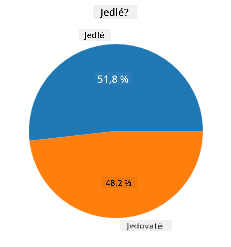
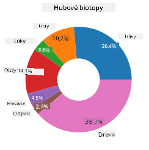
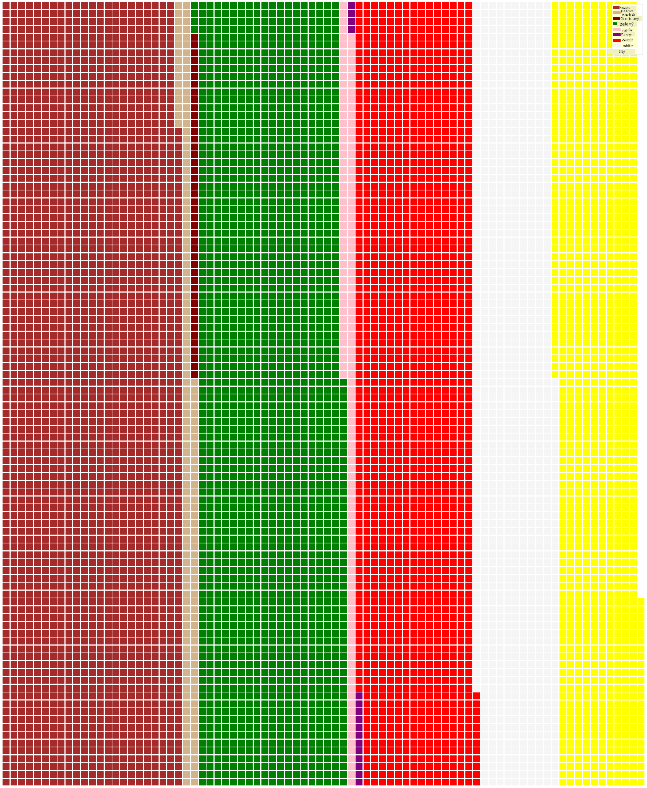

<!--
CO_OP_TRANSLATOR_METADATA:
{
  "original_hash": "af6a12015c6e250e500b570a9fa42593",
  "translation_date": "2025-08-26T17:29:03+00:00",
  "source_file": "3-Data-Visualization/11-visualization-proportions/README.md",
  "language_code": "sk"
}
-->
# Vizualizácia proporcií

| ](../../sketchnotes/11-Visualizing-Proportions.png)|
|:---:|
|Vizualizácia proporcií - _Sketchnote od [@nitya](https://twitter.com/nitya)_ |

V tejto lekcii použijete dataset zameraný na prírodu na vizualizáciu proporcií, napríklad koľko rôznych druhov húb sa nachádza v danom datasete o hubách. Poďme preskúmať tieto fascinujúce huby pomocou datasetu od Audubon, ktorý obsahuje podrobnosti o 23 druhoch lupenatých húb z rodov Agaricus a Lepiota. Budete experimentovať s chutnými vizualizáciami, ako sú:

- Koláčové grafy 🥧  
- Donutové grafy 🍩  
- Waflové grafy 🧇  

> 💡 Veľmi zaujímavý projekt s názvom [Charticulator](https://charticulator.com) od Microsoft Research ponúka bezplatné rozhranie na vizualizáciu dát pomocou drag and drop. V jednom z ich tutoriálov tiež používajú tento dataset o hubách! Takže môžete preskúmať dáta a zároveň sa naučiť používať túto knižnicu: [Charticulator tutorial](https://charticulator.com/tutorials/tutorial4.html).

## [Kvíz pred prednáškou](https://purple-hill-04aebfb03.1.azurestaticapps.net/quiz/20)

## Spoznajte svoje huby 🍄

Huby sú veľmi zaujímavé. Naimportujme dataset, aby sme ich mohli študovať:

```python
import pandas as pd
import matplotlib.pyplot as plt
mushrooms = pd.read_csv('../../data/mushrooms.csv')
mushrooms.head()
```  
Tabuľka obsahuje skvelé dáta na analýzu:

| class     | cap-shape | cap-surface | cap-color | bruises | odor    | gill-attachment | gill-spacing | gill-size | gill-color | stalk-shape | stalk-root | stalk-surface-above-ring | stalk-surface-below-ring | stalk-color-above-ring | stalk-color-below-ring | veil-type | veil-color | ring-number | ring-type | spore-print-color | population | habitat |
| --------- | --------- | ----------- | --------- | ------- | ------- | --------------- | ------------ | --------- | ---------- | ----------- | ---------- | ------------------------ | ------------------------ | ---------------------- | ---------------------- | --------- | ---------- | ----------- | --------- | ----------------- | ---------- | ------- |
| Poisonous | Convex    | Smooth      | Brown     | Bruises | Pungent | Free            | Close        | Narrow    | Black      | Enlarging   | Equal      | Smooth                   | Smooth                   | White                  | White                  | Partial   | White      | One         | Pendant   | Black             | Scattered  | Urban   |
| Edible    | Convex    | Smooth      | Yellow    | Bruises | Almond  | Free            | Close        | Broad     | Black      | Enlarging   | Club       | Smooth                   | Smooth                   | White                  | White                  | Partial   | White      | One         | Pendant   | Brown             | Numerous   | Grasses |
| Edible    | Bell      | Smooth      | White     | Bruises | Anise   | Free            | Close        | Broad     | Brown      | Enlarging   | Club       | Smooth                   | Smooth                   | White                  | White                  | Partial   | White      | One         | Pendant   | Brown             | Numerous   | Meadows |
| Poisonous | Convex    | Scaly       | White     | Bruises | Pungent | Free            | Close        | Narrow    | Brown      | Enlarging   | Equal      | Smooth                   | Smooth                   | White                  | White                  | Partial   | White      | One         | Pendant   | Black             | Scattered  | Urban   |

Hneď si všimnete, že všetky dáta sú textové. Budete ich musieť konvertovať, aby ste ich mohli použiť v grafe. Väčšina dát je v skutočnosti reprezentovaná ako objekt:

```python
print(mushrooms.select_dtypes(["object"]).columns)
```  

Výstup je:

```output
Index(['class', 'cap-shape', 'cap-surface', 'cap-color', 'bruises', 'odor',
       'gill-attachment', 'gill-spacing', 'gill-size', 'gill-color',
       'stalk-shape', 'stalk-root', 'stalk-surface-above-ring',
       'stalk-surface-below-ring', 'stalk-color-above-ring',
       'stalk-color-below-ring', 'veil-type', 'veil-color', 'ring-number',
       'ring-type', 'spore-print-color', 'population', 'habitat'],
      dtype='object')
```  
Vezmite tieto dáta a konvertujte stĺpec 'class' na kategóriu:

```python
cols = mushrooms.select_dtypes(["object"]).columns
mushrooms[cols] = mushrooms[cols].astype('category')
```  

```python
edibleclass=mushrooms.groupby(['class']).count()
edibleclass
```  

Teraz, ak vytlačíte dáta o hubách, uvidíte, že boli rozdelené do kategórií podľa triedy jedovaté/jedlé:

|           | cap-shape | cap-surface | cap-color | bruises | odor | gill-attachment | gill-spacing | gill-size | gill-color | stalk-shape | ... | stalk-surface-below-ring | stalk-color-above-ring | stalk-color-below-ring | veil-type | veil-color | ring-number | ring-type | spore-print-color | population | habitat |
| --------- | --------- | ----------- | --------- | ------- | ---- | --------------- | ------------ | --------- | ---------- | ----------- | --- | ------------------------ | ---------------------- | ---------------------- | --------- | ---------- | ----------- | --------- | ----------------- | ---------- | ------- |
| class     |           |             |           |         |      |                 |              |           |            |             |     |                          |                        |                        |           |            |             |           |                   |            |         |
| Edible    | 4208      | 4208        | 4208      | 4208    | 4208 | 4208            | 4208         | 4208      | 4208       | 4208        | ... | 4208                     | 4208                   | 4208                   | 4208      | 4208       | 4208        | 4208      | 4208              | 4208       | 4208    |
| Poisonous | 3916      | 3916        | 3916      | 3916    | 3916 | 3916            | 3916         | 3916      | 3916       | 3916        | ... | 3916                     | 3916                   | 3916                   | 3916      | 3916       | 3916        | 3916      | 3916              | 3916       | 3916    |

Ak budete postupovať podľa poradia uvedeného v tejto tabuľke na vytvorenie kategórií tried, môžete vytvoriť koláčový graf:

## Koláč!

```python
labels=['Edible','Poisonous']
plt.pie(edibleclass['population'],labels=labels,autopct='%.1f %%')
plt.title('Edible?')
plt.show()
```  
Voila, koláčový graf zobrazujúci proporcie týchto dát podľa dvoch tried húb. Je veľmi dôležité správne zoradiť poradie štítkov, najmä tu, preto si overte poradie, v akom je pole štítkov vytvorené!



## Donuty!

O niečo vizuálne zaujímavejší koláčový graf je donutový graf, čo je koláčový graf s dierou v strede. Pozrime sa na naše dáta touto metódou.

Pozrite sa na rôzne biotopy, kde huby rastú:

```python
habitat=mushrooms.groupby(['habitat']).count()
habitat
```  
Tu zoskupujete svoje dáta podľa biotopu. Je ich uvedených 7, takže ich použite ako štítky pre váš donutový graf:

```python
labels=['Grasses','Leaves','Meadows','Paths','Urban','Waste','Wood']

plt.pie(habitat['class'], labels=labels,
        autopct='%1.1f%%', pctdistance=0.85)
  
center_circle = plt.Circle((0, 0), 0.40, fc='white')
fig = plt.gcf()

fig.gca().add_artist(center_circle)
  
plt.title('Mushroom Habitats')
  
plt.show()
```  



Tento kód nakreslí graf a stredový kruh, potom pridá tento kruh do grafu. Upraviť šírku stredového kruhu môžete zmenou hodnoty `0.40` na inú hodnotu.

Donutové grafy je možné upraviť rôznymi spôsobmi, aby sa zmenili štítky. Štítky môžu byť zvýraznené pre lepšiu čitateľnosť. Viac sa dozviete v [dokumentácii](https://matplotlib.org/stable/gallery/pie_and_polar_charts/pie_and_donut_labels.html?highlight=donut).

Teraz, keď viete, ako zoskupiť svoje dáta a zobraziť ich ako koláč alebo donut, môžete preskúmať iné typy grafov. Skúste waflový graf, ktorý je len iným spôsobom skúmania množstva.

## Wafle!

Waflový graf je iný spôsob vizualizácie množstiev ako 2D pole štvorcov. Skúste vizualizovať rôzne množstvá farieb klobúkov húb v tomto datasete. Na to potrebujete nainštalovať pomocnú knižnicu [PyWaffle](https://pypi.org/project/pywaffle/) a použiť Matplotlib:

```python
pip install pywaffle
```  

Vyberte segment svojich dát na zoskupenie:

```python
capcolor=mushrooms.groupby(['cap-color']).count()
capcolor
```  

Vytvorte waflový graf vytvorením štítkov a následným zoskupením svojich dát:

```python
import pandas as pd
import matplotlib.pyplot as plt
from pywaffle import Waffle
  
data ={'color': ['brown', 'buff', 'cinnamon', 'green', 'pink', 'purple', 'red', 'white', 'yellow'],
    'amount': capcolor['class']
     }
  
df = pd.DataFrame(data)
  
fig = plt.figure(
    FigureClass = Waffle,
    rows = 100,
    values = df.amount,
    labels = list(df.color),
    figsize = (30,30),
    colors=["brown", "tan", "maroon", "green", "pink", "purple", "red", "whitesmoke", "yellow"],
)
```  

Pomocou waflového grafu môžete jasne vidieť proporcie farieb klobúkov v tomto datasete húb. Zaujímavé je, že existuje veľa húb so zelenými klobúkmi!



✅ PyWaffle podporuje ikony v grafoch, ktoré používajú akúkoľvek ikonu dostupnú vo [Font Awesome](https://fontawesome.com/). Urobte experimenty a vytvorte ešte zaujímavejší waflový graf pomocou ikon namiesto štvorcov.

V tejto lekcii ste sa naučili tri spôsoby vizualizácie proporcií. Najprv musíte zoskupiť svoje dáta do kategórií a potom sa rozhodnúť, ktorý spôsob zobrazenia dát je najlepší - koláč, donut alebo wafle. Všetky sú chutné a poskytujú používateľovi okamžitý prehľad o datasete.

## 🚀 Výzva

Skúste znovu vytvoriť tieto chutné grafy v [Charticulator](https://charticulator.com).  
## [Kvíz po prednáške](https://purple-hill-04aebfb03.1.azurestaticapps.net/quiz/21)

## Prehľad a samoštúdium

Niekedy nie je zrejmé, kedy použiť koláčový, donutový alebo waflový graf. Tu je niekoľko článkov na túto tému:

https://www.beautiful.ai/blog/battle-of-the-charts-pie-chart-vs-donut-chart  

https://medium.com/@hypsypops/pie-chart-vs-donut-chart-showdown-in-the-ring-5d24fd86a9ce  

https://www.mit.edu/~mbarker/formula1/f1help/11-ch-c6.htm  

https://medium.datadriveninvestor.com/data-visualization-done-the-right-way-with-tableau-waffle-chart-fdf2a19be402  

Urobte si výskum a nájdite viac informácií o tomto zložitom rozhodovaní.  
## Zadanie

[Skúste to v Exceli](assignment.md)  

---

**Upozornenie**:  
Tento dokument bol preložený pomocou služby AI prekladu [Co-op Translator](https://github.com/Azure/co-op-translator). Hoci sa snažíme o presnosť, prosím, berte na vedomie, že automatizované preklady môžu obsahovať chyby alebo nepresnosti. Pôvodný dokument v jeho pôvodnom jazyku by mal byť považovaný za autoritatívny zdroj. Pre kritické informácie sa odporúča profesionálny ľudský preklad. Nenesieme zodpovednosť za akékoľvek nedorozumenia alebo nesprávne interpretácie vyplývajúce z použitia tohto prekladu.