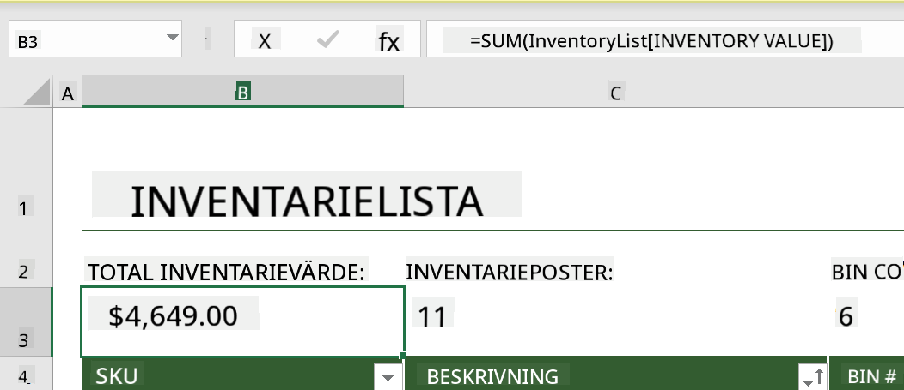
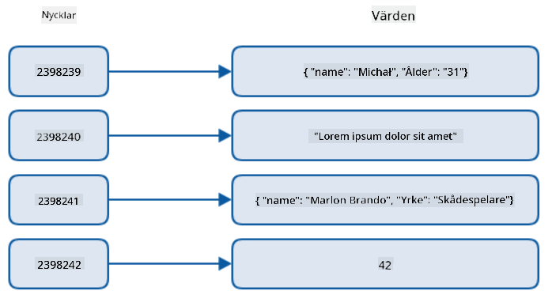
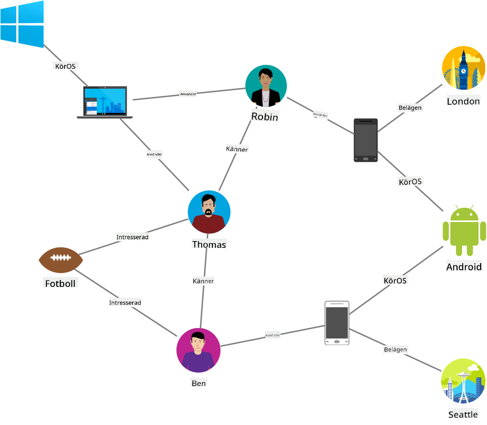
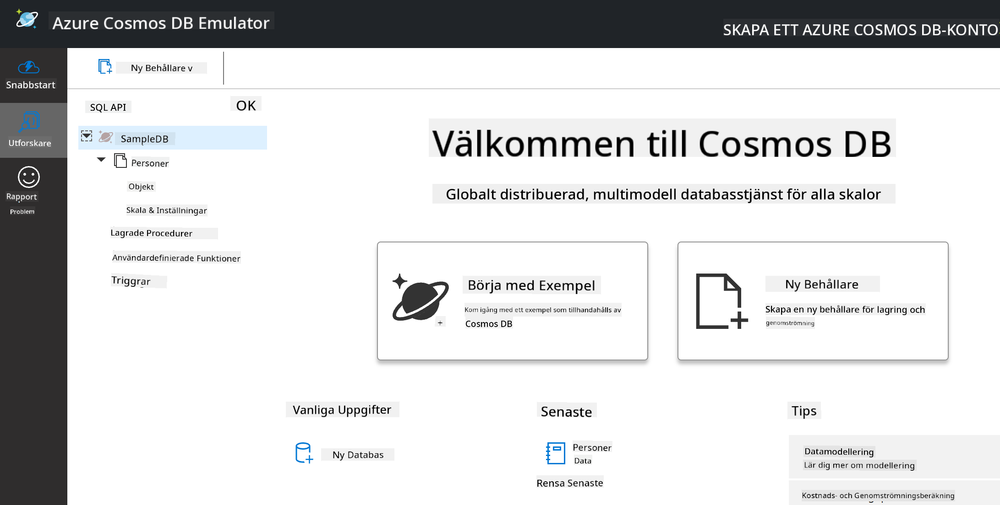
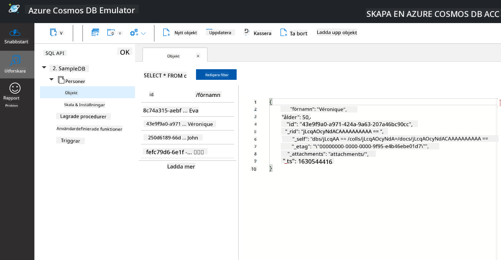

<!--
CO_OP_TRANSLATOR_METADATA:
{
  "original_hash": "32ddfef8121650f2ca2f3416fd283c37",
  "translation_date": "2025-08-26T21:09:23+00:00",
  "source_file": "2-Working-With-Data/06-non-relational/README.md",
  "language_code": "sv"
}
-->
# Arbeta med data: Icke-relationell data

| ](../../sketchnotes/06-NoSQL.png)|
|:---:|
|Arbeta med NoSQL-data - _Sketchnote av [@nitya](https://twitter.com/nitya)_ |

## [Förtest](https://purple-hill-04aebfb03.1.azurestaticapps.net/quiz/10)

Data är inte begränsat till relationsdatabaser. Den här lektionen fokuserar på icke-relationell data och kommer att täcka grunderna i kalkylblad och NoSQL.

## Kalkylblad

Kalkylblad är ett populärt sätt att lagra och utforska data eftersom det kräver mindre arbete att sätta upp och komma igång. I den här lektionen kommer du att lära dig de grundläggande komponenterna i ett kalkylblad, samt formler och funktioner. Exemplen kommer att illustreras med Microsoft Excel, men de flesta delar och ämnen kommer att ha liknande namn och steg jämfört med andra kalkylbladsprogram.


Ett kalkylblad är en fil och kommer att vara tillgänglig i filsystemet på en dator, enhet eller molnbaserat filsystem. Själva programvaran kan vara webbläsarbaserad eller en applikation som måste installeras på en dator eller laddas ner som en app. I Excel definieras dessa filer också som **arbetsböcker**, och denna terminologi kommer att användas resten av lektionen.

En arbetsbok innehåller ett eller flera **kalkylblad**, där varje kalkylblad är märkt med flikar. Inom ett kalkylblad finns rektanglar som kallas **celler**, vilka innehåller själva datan. En cell är skärningspunkten mellan en rad och en kolumn, där kolumnerna är märkta med alfabetiska tecken och rader märkta numeriskt. Vissa kalkylblad innehåller rubriker i de första raderna för att beskriva datan i en cell.

Med dessa grundläggande element i en Excel-arbetsbok kommer vi att använda ett exempel från [Microsoft Templates](https://templates.office.com/) som fokuserar på ett lager för att gå igenom några ytterligare delar av ett kalkylblad.

### Hantera ett lager

Kalkylbladsfilen som heter "InventoryExample" är ett formaterat kalkylblad över objekt i ett lager som innehåller tre kalkylblad, där flikarna är märkta "Inventory List", "Inventory Pick List" och "Bin Lookup". Rad 4 i kalkylbladet Inventory List är rubriken, som beskriver värdet av varje cell i rubrikkolumnen.


Det finns tillfällen då en cell är beroende av värdena i andra celler för att generera sitt värde. Kalkylbladet Inventory List håller reda på kostnaden för varje objekt i sitt lager, men vad händer om vi behöver veta värdet av allt i lagret? [**Formler**](https://support.microsoft.com/en-us/office/overview-of-formulas-34519a4e-1e8d-4f4b-84d4-d642c4f63263) utför åtgärder på celldata och används för att beräkna lagrets värde i detta exempel. Detta kalkylblad använde en formel i kolumnen Inventory Value för att beräkna värdet av varje objekt genom att multiplicera kvantiteten under rubriken QTY och dess kostnader under rubriken COST. Genom att dubbelklicka eller markera en cell visas formeln. Du kommer att märka att formler börjar med ett likhetstecken, följt av beräkningen eller operationen.



Vi kan använda en annan formel för att lägga till alla värden i Inventory Value för att få dess totala värde. Detta kan beräknas genom att lägga till varje cell för att generera summan, men det kan vara en tidskrävande uppgift. Excel har [**funktioner**](https://support.microsoft.com/en-us/office/sum-function-043e1c7d-7726-4e80-8f32-07b23e057f89), eller fördefinierade formler för att utföra beräkningar på celldata. Funktioner kräver argument, vilket är de värden som behövs för att utföra dessa beräkningar. När funktioner kräver mer än ett argument måste de listas i en viss ordning, annars kanske funktionen inte beräknar rätt värde. Detta exempel använder funktionen SUM och använder värdena i Inventory Value som argument för att generera summan som listas under rad 3, kolumn B (även kallad B3).

## NoSQL

NoSQL är ett paraplybegrepp för de olika sätten att lagra icke-relationell data och kan tolkas som "icke-SQL", "icke-relationell" eller "inte bara SQL". Dessa typer av databassystem kan kategoriseras i fyra typer.


> Källa från [Michał Białecki Blog](https://www.michalbialecki.com/2018/03/18/azure-cosmos-db-key-value-database-cloud/)

[Nyckel-värde](https://docs.microsoft.com/en-us/azure/architecture/data-guide/big-data/non-relational-data#keyvalue-data-stores)-databaser parar unika nycklar, som är en unik identifierare, med ett värde. Dessa par lagras med hjälp av en [hashtabell](https://www.hackerearth.com/practice/data-structures/hash-tables/basics-of-hash-tables/tutorial/) med en lämplig hashfunktion.


> Källa från [Microsoft](https://docs.microsoft.com/en-us/azure/cosmos-db/graph/graph-introduction#graph-database-by-example)

[Graf](https://docs.microsoft.com/en-us/azure/architecture/data-guide/big-data/non-relational-data#graph-data-stores)-databaser beskriver relationer i data och representeras som en samling noder och kanter. En nod representerar en entitet, något som existerar i verkligheten, såsom en student eller ett bankutdrag. Kanter representerar relationen mellan två entiteter. Varje nod och kant har egenskaper som ger ytterligare information om varje nod och kant.


[Kolumnär](https://docs.microsoft.com/en-us/azure/architecture/data-guide/big-data/non-relational-data#columnar-data-stores)-databaser organiserar data i kolumner och rader som en relationell datastruktur, men varje kolumn är uppdelad i grupper som kallas kolumnfamiljer, där all data under en kolumn är relaterad och kan hämtas och ändras som en enhet.

### Dokumentdatabaser med Azure Cosmos DB

[Dokument](https://docs.microsoft.com/en-us/azure/architecture/data-guide/big-data/non-relational-data#document-data-stores)-databaser bygger på konceptet med en nyckel-värde-databas och består av en serie fält och objekt. Den här sektionen kommer att utforska dokumentdatabaser med Cosmos DB-emulatorn.

En Cosmos DB-databas passar definitionen av "Inte bara SQL", där Cosmos DB:s dokumentdatabas förlitar sig på SQL för att fråga data. [Föregående lektion](../05-relational-databases/README.md) om SQL täcker grunderna i språket, och vi kommer att kunna tillämpa några av samma frågor på en dokumentdatabas här. Vi kommer att använda Cosmos DB Emulator, som låter oss skapa och utforska en dokumentdatabas lokalt på en dator. Läs mer om Emulatorn [här](https://docs.microsoft.com/en-us/azure/cosmos-db/local-emulator?tabs=ssl-netstd21).

Ett dokument är en samling av fält och objektvärden, där fälten beskriver vad objektvärdet representerar. Nedan är ett exempel på ett dokument.

```json
{
    "firstname": "Eva",
    "age": 44,
    "id": "8c74a315-aebf-4a16-bb38-2430a9896ce5",
    "_rid": "bHwDAPQz8s0BAAAAAAAAAA==",
    "_self": "dbs/bHwDAA==/colls/bHwDAPQz8s0=/docs/bHwDAPQz8s0BAAAAAAAAAA==/",
    "_etag": "\"00000000-0000-0000-9f95-010a691e01d7\"",
    "_attachments": "attachments/",
    "_ts": 1630544034
}
```

De intressanta fälten i detta dokument är: `firstname`, `id` och `age`. Resten av fälten med understreck genererades av Cosmos DB.

#### Utforska data med Cosmos DB Emulator

Du kan ladda ner och installera emulatorn [för Windows här](https://aka.ms/cosmosdb-emulator). Se denna [dokumentation](https://docs.microsoft.com/en-us/azure/cosmos-db/local-emulator?tabs=ssl-netstd21#run-on-linux-macos) för alternativ om hur du kör Emulatorn för macOS och Linux.

Emulatorn öppnar ett webbläsarfönster, där Explorer-vyn låter dig utforska dokument.



Om du följer med, klicka på "Start with Sample" för att generera en exempel-databas som heter SampleDB. Om du expanderar SampleDB genom att klicka på pilen hittar du en container som heter `Persons`. En container håller en samling objekt, vilka är dokumenten i containern. Du kan utforska de fyra individuella dokumenten under `Items`.



#### Fråga dokumentdata med Cosmos DB Emulator

Vi kan också fråga exempeldata genom att klicka på knappen för ny SQL-fråga (andra knappen från vänster).

`SELECT * FROM c` returnerar alla dokument i containern. Låt oss lägga till en where-sats och hitta alla som är yngre än 40.

`SELECT * FROM c where c.age < 40`


Frågan returnerar två dokument, notera att age-värdet för varje dokument är mindre än 40.

#### JSON och dokument

Om du är bekant med JavaScript Object Notation (JSON) kommer du att märka att dokument liknar JSON. Det finns en `PersonsData.json`-fil i denna katalog med mer data som du kan ladda upp till Persons-containern i Emulatorn via knappen `Upload Item`.

I de flesta fall kan API:er som returnerar JSON-data direkt överföras och lagras i dokumentdatabaser. Nedan är ett annat dokument, det representerar tweets från Microsofts Twitter-konto som hämtades med Twitter API och sedan infogades i Cosmos DB.

```json
{
    "created_at": "2021-08-31T19:03:01.000Z",
    "id": "1432780985872142341",
    "text": "Blank slate. Like this tweet if you’ve ever painted in Microsoft Paint before. https://t.co/cFeEs8eOPK",
    "_rid": "dhAmAIUsA4oHAAAAAAAAAA==",
    "_self": "dbs/dhAmAA==/colls/dhAmAIUsA4o=/docs/dhAmAIUsA4oHAAAAAAAAAA==/",
    "_etag": "\"00000000-0000-0000-9f84-a0958ad901d7\"",
    "_attachments": "attachments/",
    "_ts": 1630537000
```

De intressanta fälten i detta dokument är: `created_at`, `id` och `text`.

## 🚀 Utmaning

Det finns en `TwitterData.json`-fil som du kan ladda upp till SampleDB-databasen. Det rekommenderas att du lägger till den i en separat container. Detta kan göras genom att:

1. Klicka på knappen för ny container uppe till höger
1. Välja den befintliga databasen (SampleDB) och skapa ett container-id för containern
1. Ställa in partitionsnyckeln till `/id`
1. Klicka på OK (du kan ignorera resten av informationen i denna vy eftersom detta är en liten dataset som körs lokalt på din dator)
1. Öppna din nya container och ladda upp TwitterData-filen med knappen `Upload Item`

Försök att köra några SELECT-frågor för att hitta dokument som har Microsoft i textfältet. Tips: försök använda [LIKE-nyckelordet](https://docs.microsoft.com/en-us/azure/cosmos-db/sql/sql-query-keywords#using-like-with-the--wildcard-character).

## [Eftertest](https://purple-hill-04aebfb03.1.azurestaticapps.net/quiz/11)

## Granskning och självstudier

- Det finns ytterligare formateringar och funktioner i detta kalkylblad som inte täcks i denna lektion. Microsoft har ett [stort bibliotek med dokumentation och videor](https://support.microsoft.com/excel) om Excel om du är intresserad av att lära dig mer.

- Denna arkitekturdokumentation beskriver egenskaperna hos de olika typerna av icke-relationell data: [Icke-relationell data och NoSQL](https://docs.microsoft.com/en-us/azure/architecture/data-guide/big-data/non-relational-data)

- Cosmos DB är en molnbaserad icke-relationell databas som också kan lagra de olika NoSQL-typer som nämns i denna lektion. Läs mer om dessa typer i denna [Cosmos DB Microsoft Learn-modul](https://docs.microsoft.com/en-us/learn/paths/work-with-nosql-data-in-azure-cosmos-db/)

## Uppgift

[Soda Profits](assignment.md)

---

**Ansvarsfriskrivning**:  
Detta dokument har översatts med hjälp av AI-översättningstjänsten [Co-op Translator](https://github.com/Azure/co-op-translator). Även om vi strävar efter noggrannhet, bör det noteras att automatiserade översättningar kan innehålla fel eller felaktigheter. Det ursprungliga dokumentet på dess originalspråk bör betraktas som den auktoritativa källan. För kritisk information rekommenderas professionell mänsklig översättning. Vi ansvarar inte för eventuella missförstånd eller feltolkningar som uppstår vid användning av denna översättning.