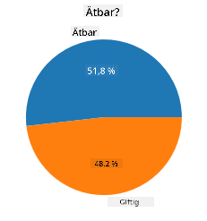
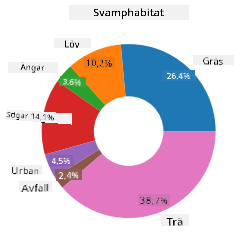
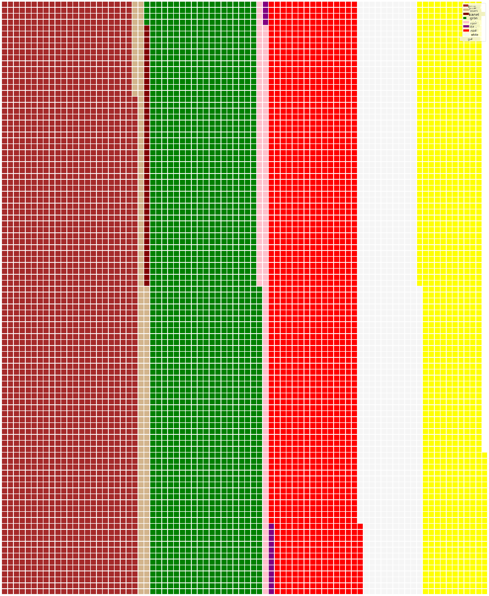

<!--
CO_OP_TRANSLATOR_METADATA:
{
  "original_hash": "af6a12015c6e250e500b570a9fa42593",
  "translation_date": "2025-08-26T23:21:49+00:00",
  "source_file": "3-Data-Visualization/11-visualization-proportions/README.md",
  "language_code": "sv"
}
-->
# Visualisera proportioner

| ](../../sketchnotes/11-Visualizing-Proportions.png)|
|:---:|
|Visualisera proportioner - _Sketchnote av [@nitya](https://twitter.com/nitya)_ |

I den här lektionen kommer du att använda en dataset med naturfokus för att visualisera proportioner, som hur många olika typer av svampar som finns i en dataset om champinjoner. Låt oss utforska dessa fascinerande svampar med hjälp av en dataset från Audubon som listar detaljer om 23 arter av skivlingar i Agaricus- och Lepiota-familjerna. Du kommer att experimentera med smakfulla visualiseringar som:

- Cirkeldiagram 🥧
- Donutdiagram 🍩
- Våffeldiagram 🧇

> 💡 Ett mycket intressant projekt som heter [Charticulator](https://charticulator.com) från Microsoft Research erbjuder ett gratis dra-och-släpp-gränssnitt för datavisualiseringar. I en av deras tutorials använder de också denna svampdataset! Så du kan utforska datan och lära dig biblioteket samtidigt: [Charticulator tutorial](https://charticulator.com/tutorials/tutorial4.html).

## [Quiz före föreläsningen](https://purple-hill-04aebfb03.1.azurestaticapps.net/quiz/20)

## Lär känna dina svampar 🍄

Svampar är väldigt intressanta. Låt oss importera en dataset för att studera dem:

```python
import pandas as pd
import matplotlib.pyplot as plt
mushrooms = pd.read_csv('../../data/mushrooms.csv')
mushrooms.head()
```
En tabell skrivs ut med fantastisk data för analys:


| klass      | hattform   | hattyta     | hattfärg   | blåmärken | lukt     | skivfäste       | skivavstånd   | skivstorlek | skivfärg     | fotform      | fotrot      | fotyta ovanför ring     | fotyta under ring       | fotfärg ovanför ring   | fotfärg under ring     | slöjtyp    | slöjfärg    | antal ringar | ringtyp    | sportrycksfärg     | population | habitat |
| ---------- | ---------- | ----------- | ---------- | --------- | -------- | --------------- | ------------- | ----------- | ------------ | ------------ | ----------- | ----------------------- | ----------------------- | ---------------------- | ---------------------- | ---------- | ----------- | ------------ | ---------- | ------------------ | ---------- | ------- |
| Giftig     | Konvex     | Slät        | Brun       | Blåmärken | Stickande | Fri             | Tät           | Smal        | Svart        | Förstorande  | Jämn        | Slät                    | Slät                    | Vit                    | Vit                    | Partiell   | Vit         | En           | Hängande   | Svart              | Spridd     | Urban   |
| Ätlig      | Konvex     | Slät        | Gul        | Blåmärken | Mandel   | Fri             | Tät           | Bred        | Svart        | Förstorande  | Klubba      | Slät                    | Slät                    | Vit                    | Vit                    | Partiell   | Vit         | En           | Hängande   | Brun               | Talrik     | Gräs    |
| Ätlig      | Klockformad| Slät        | Vit        | Blåmärken | Anis     | Fri             | Tät           | Bred        | Brun         | Förstorande  | Klubba      | Slät                    | Slät                    | Vit                    | Vit                    | Partiell   | Vit         | En           | Hängande   | Brun               | Talrik     | Ängar   |
| Giftig     | Konvex     | Fjällig     | Vit        | Blåmärken | Stickande | Fri             | Tät           | Smal        | Brun         | Förstorande  | Jämn        | Slät                    | Slät                    | Vit                    | Vit                    | Partiell   | Vit         | En           | Hängande   | Svart              | Spridd     | Urban   |

Direkt märker du att all data är textbaserad. Du måste konvertera denna data för att kunna använda den i ett diagram. Faktum är att det mesta av datan representeras som ett objekt:

```python
print(mushrooms.select_dtypes(["object"]).columns)
```

Utdata är:

```output
Index(['class', 'cap-shape', 'cap-surface', 'cap-color', 'bruises', 'odor',
       'gill-attachment', 'gill-spacing', 'gill-size', 'gill-color',
       'stalk-shape', 'stalk-root', 'stalk-surface-above-ring',
       'stalk-surface-below-ring', 'stalk-color-above-ring',
       'stalk-color-below-ring', 'veil-type', 'veil-color', 'ring-number',
       'ring-type', 'spore-print-color', 'population', 'habitat'],
      dtype='object')
```
Ta denna data och konvertera kolumnen 'klass' till en kategori:

```python
cols = mushrooms.select_dtypes(["object"]).columns
mushrooms[cols] = mushrooms[cols].astype('category')
```

```python
edibleclass=mushrooms.groupby(['class']).count()
edibleclass
```

Nu, om du skriver ut svampdatan, kan du se att den har grupperats i kategorier enligt klassen giftig/ätlig:


|           | hattform   | hattyta     | hattfärg   | blåmärken | lukt | skivfäste       | skivavstånd   | skivstorlek | skivfärg     | fotform      | ... | fotyta under ring       | fotfärg ovanför ring   | fotfärg under ring     | slöjtyp    | slöjfärg    | antal ringar | ringtyp    | sportrycksfärg     | population | habitat |
| ----------| ---------- | ----------- | ---------- | --------- | ---- | --------------- | ------------- | ----------- | ------------ | ------------ | --- | ----------------------- | ---------------------- | ---------------------- | ---------- | ----------- | ------------ | ---------- | ------------------ | ---------- | ------- |
| klass     |            |             |            |           |      |                 |               |             |              |              |     |                         |                        |                        |            |             |              |            |                   |            |         |
| Ätlig     | 4208       | 4208        | 4208       | 4208      | 4208 | 4208            | 4208          | 4208        | 4208         | 4208         | ... | 4208                     | 4208                   | 4208                   | 4208       | 4208        | 4208         | 4208       | 4208              | 4208       | 4208    |
| Giftig    | 3916       | 3916        | 3916       | 3916      | 3916 | 3916            | 3916          | 3916        | 3916         | 3916         | ... | 3916                     | 3916                   | 3916                   | 3916       | 3916        | 3916         | 3916       | 3916              | 3916       | 3916    |

Om du följer ordningen som presenteras i denna tabell för att skapa dina klasskategorietiketter, kan du bygga ett cirkeldiagram:

## Cirkeldiagram!

```python
labels=['Edible','Poisonous']
plt.pie(edibleclass['population'],labels=labels,autopct='%.1f %%')
plt.title('Edible?')
plt.show()
```
Voila, ett cirkeldiagram som visar proportionerna av denna data enligt dessa två svampklasser. Det är ganska viktigt att få ordningen på etiketterna korrekt, särskilt här, så se till att verifiera ordningen med vilken etikettarrayen byggs!



## Donutdiagram!

Ett något mer visuellt intressant cirkeldiagram är ett donutdiagram, som är ett cirkeldiagram med ett hål i mitten. Låt oss titta på vår data med denna metod.

Titta på de olika habitat där svampar växer:

```python
habitat=mushrooms.groupby(['habitat']).count()
habitat
```
Här grupperar du din data efter habitat. Det finns 7 listade, så använd dessa som etiketter för ditt donutdiagram:

```python
labels=['Grasses','Leaves','Meadows','Paths','Urban','Waste','Wood']

plt.pie(habitat['class'], labels=labels,
        autopct='%1.1f%%', pctdistance=0.85)
  
center_circle = plt.Circle((0, 0), 0.40, fc='white')
fig = plt.gcf()

fig.gca().add_artist(center_circle)
  
plt.title('Mushroom Habitats')
  
plt.show()
```



Denna kod ritar ett diagram och en cirkel i mitten, och lägger sedan till den cirkeln i diagrammet. Ändra bredden på cirkeln i mitten genom att ändra `0.40` till ett annat värde.

Donutdiagram kan justeras på flera sätt för att ändra etiketterna. Etiketterna kan särskilt framhävas för läsbarhet. Läs mer i [dokumentationen](https://matplotlib.org/stable/gallery/pie_and_polar_charts/pie_and_donut_labels.html?highlight=donut).

Nu när du vet hur du grupperar din data och sedan visar den som ett cirkel- eller donutdiagram, kan du utforska andra typer av diagram. Prova ett våffeldiagram, som är ett annat sätt att utforska kvantitet.

## Våffeldiagram!

Ett 'våffel'-typ diagram är ett annat sätt att visualisera kvantiteter som en 2D-array av fyrkanter. Prova att visualisera de olika kvantiteterna av svamphattfärger i denna dataset. För att göra detta behöver du installera ett hjälpbibliotek som heter [PyWaffle](https://pypi.org/project/pywaffle/) och använda Matplotlib:

```python
pip install pywaffle
```

Välj ett segment av din data att gruppera:

```python
capcolor=mushrooms.groupby(['cap-color']).count()
capcolor
```

Skapa ett våffeldiagram genom att skapa etiketter och sedan gruppera din data:

```python
import pandas as pd
import matplotlib.pyplot as plt
from pywaffle import Waffle
  
data ={'color': ['brown', 'buff', 'cinnamon', 'green', 'pink', 'purple', 'red', 'white', 'yellow'],
    'amount': capcolor['class']
     }
  
df = pd.DataFrame(data)
  
fig = plt.figure(
    FigureClass = Waffle,
    rows = 100,
    values = df.amount,
    labels = list(df.color),
    figsize = (30,30),
    colors=["brown", "tan", "maroon", "green", "pink", "purple", "red", "whitesmoke", "yellow"],
)
```

Med ett våffeldiagram kan du tydligt se proportionerna av hattfärger i denna svampdataset. Intressant nog finns det många svampar med gröna hattar!



✅ PyWaffle stöder ikoner inom diagram som använder alla ikoner som finns tillgängliga i [Font Awesome](https://fontawesome.com/). Gör några experiment för att skapa ett ännu mer intressant våffeldiagram med ikoner istället för fyrkanter.

I denna lektion lärde du dig tre sätt att visualisera proportioner. Först behöver du gruppera din data i kategorier och sedan bestämma vilket som är det bästa sättet att visa datan - cirkel, donut eller våffel. Alla är läckra och ger användaren en omedelbar överblick av en dataset.

## 🚀 Utmaning

Försök att återskapa dessa smakfulla diagram i [Charticulator](https://charticulator.com).
## [Quiz efter föreläsningen](https://purple-hill-04aebfb03.1.azurestaticapps.net/quiz/21)

## Granskning & Självstudier

Ibland är det inte uppenbart när man ska använda ett cirkel-, donut- eller våffeldiagram. Här är några artiklar att läsa om detta ämne:

https://www.beautiful.ai/blog/battle-of-the-charts-pie-chart-vs-donut-chart

https://medium.com/@hypsypops/pie-chart-vs-donut-chart-showdown-in-the-ring-5d24fd86a9ce

https://www.mit.edu/~mbarker/formula1/f1help/11-ch-c6.htm

https://medium.datadriveninvestor.com/data-visualization-done-the-right-way-with-tableau-waffle-chart-fdf2a19be402

Gör lite forskning för att hitta mer information om detta kluriga beslut.

## Uppgift

[Prova det i Excel](assignment.md)

---

**Ansvarsfriskrivning**:  
Detta dokument har översatts med hjälp av AI-översättningstjänsten [Co-op Translator](https://github.com/Azure/co-op-translator). Även om vi strävar efter noggrannhet, bör det noteras att automatiska översättningar kan innehålla fel eller felaktigheter. Det ursprungliga dokumentet på dess originalspråk bör betraktas som den auktoritativa källan. För kritisk information rekommenderas professionell mänsklig översättning. Vi ansvarar inte för eventuella missförstånd eller feltolkningar som uppstår vid användning av denna översättning.