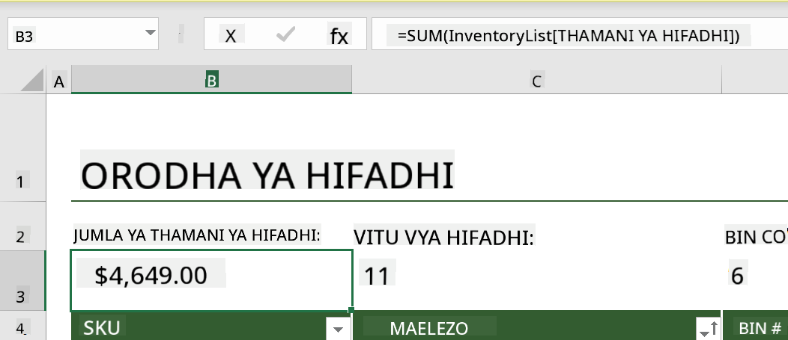
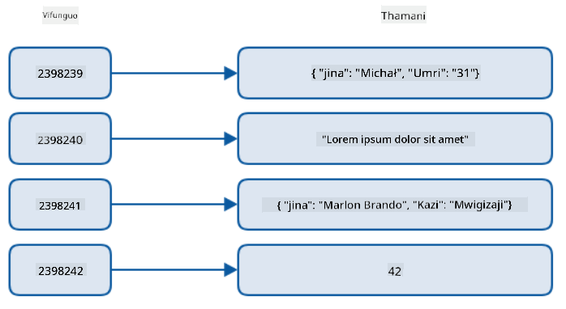
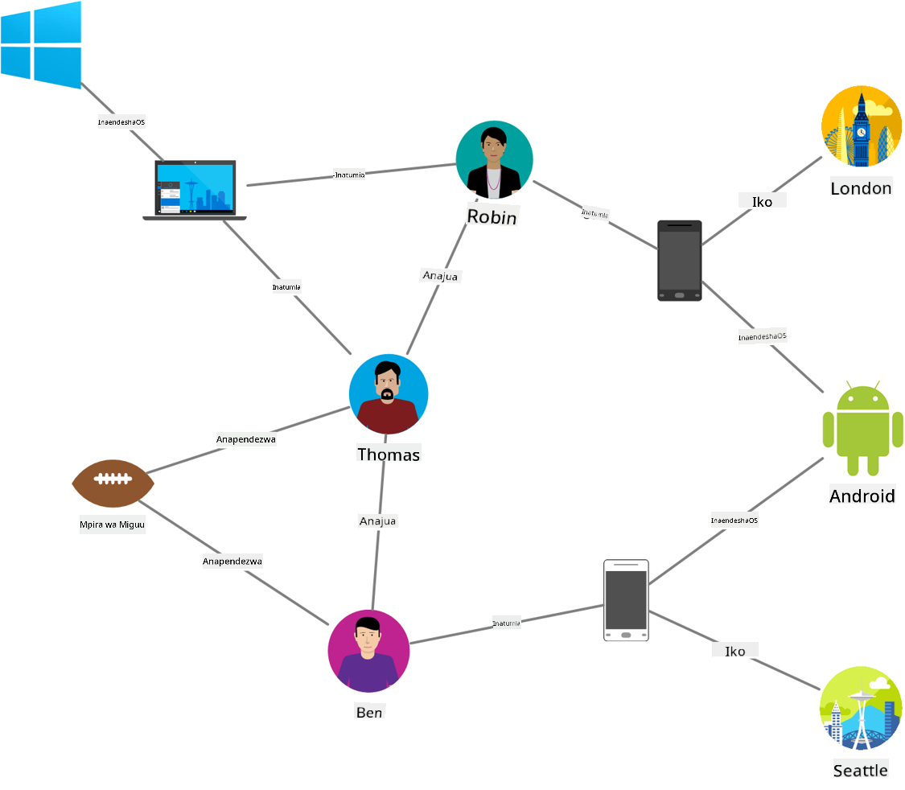
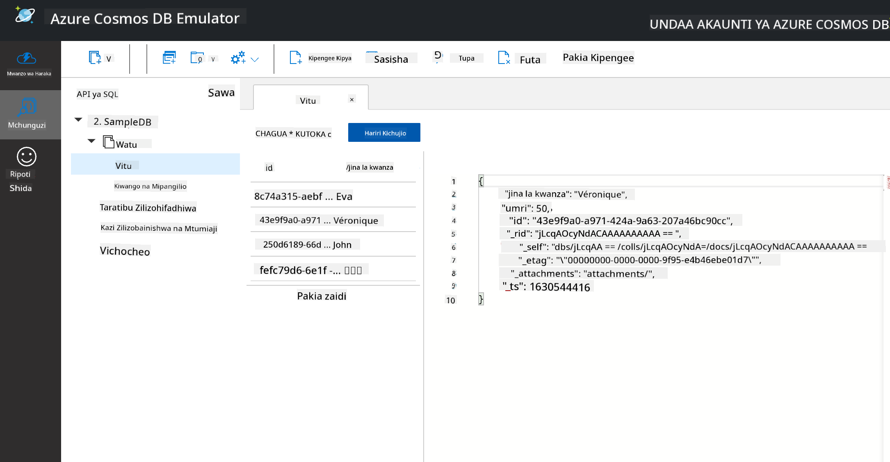
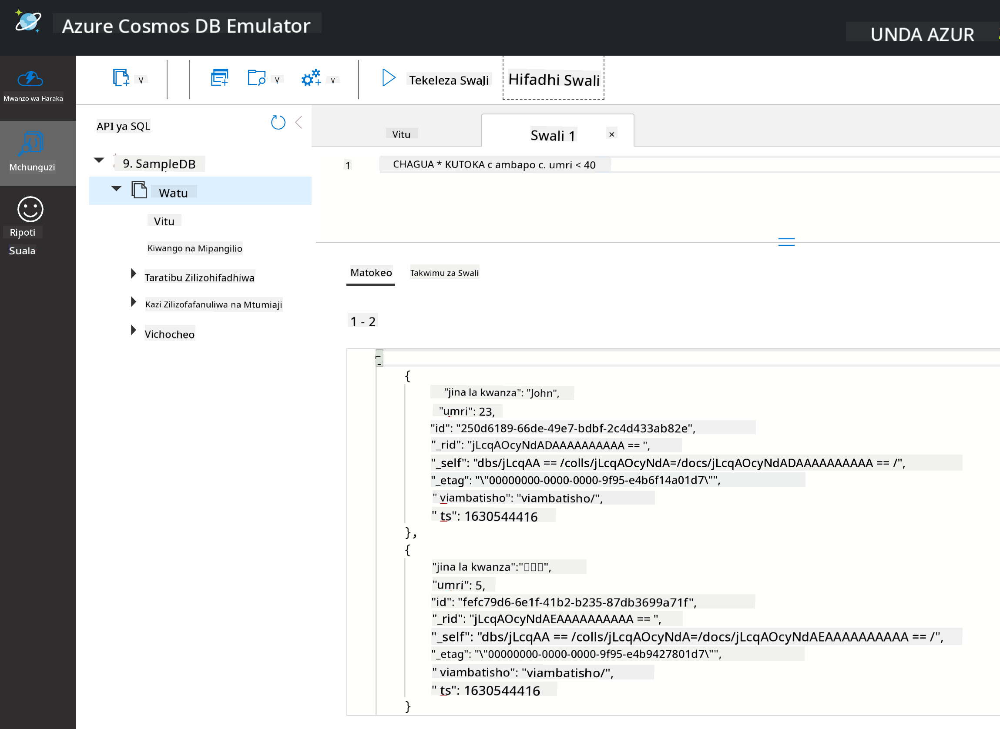

<!--
CO_OP_TRANSLATOR_METADATA:
{
  "original_hash": "32ddfef8121650f2ca2f3416fd283c37",
  "translation_date": "2025-08-26T14:52:21+00:00",
  "source_file": "2-Working-With-Data/06-non-relational/README.md",
  "language_code": "sw"
}
-->
# Kufanya Kazi na Data: Data Isiyo ya Kihusiano

| ](../../sketchnotes/06-NoSQL.png)|
|:---:|
|Kufanya Kazi na Data ya NoSQL - _Sketchnote na [@nitya](https://twitter.com/nitya)_ |

## [Maswali ya Awali ya Somo](https://purple-hill-04aebfb03.1.azurestaticapps.net/quiz/10)

Data haijazuiliwa kwa hifadhidata za kihusiano pekee. Somo hili linazingatia data isiyo ya kihusiano na litashughulikia misingi ya lahajedwali na NoSQL.

## Lahajedwali

Lahajedwali ni njia maarufu ya kuhifadhi na kuchunguza data kwa sababu inahitaji kazi kidogo kuanzisha na kuanza. Katika somo hili utajifunza vipengele vya msingi vya lahajedwali, pamoja na fomula na kazi. Mifano itatolewa kwa kutumia Microsoft Excel, lakini sehemu nyingi na mada zitakuwa na majina na hatua zinazofanana ukilinganisha na programu nyingine za lahajedwali.


Lahajedwali ni faili na litapatikana katika mfumo wa faili wa kompyuta, kifaa, au mfumo wa faili wa wingu. Programu yenyewe inaweza kuwa ya kivinjari au programu inayohitaji kusakinishwa kwenye kompyuta au kupakuliwa kama programu. Katika Excel faili hizi pia hufafanuliwa kama **vitabu vya kazi** na istilahi hii itatumika katika somo hili.

Kitabu cha kazi kina lahajedwali moja au zaidi, ambapo kila lahajedwali limewekwa alama kwa tabo. Ndani ya lahajedwali kuna mstatili unaoitwa **seli**, ambazo zitakuwa na data halisi. Seli ni makutano ya safu na safuwima, ambapo safuwima zimewekwa alama kwa herufi za alfabeti na safu zimewekwa alama kwa nambari. Baadhi ya lahajedwali zitakuwa na vichwa katika safu chache za mwanzo kuelezea data katika seli.

Kwa kutumia vipengele hivi vya msingi vya kitabu cha kazi cha Excel, tutatumia mfano kutoka [Microsoft Templates](https://templates.office.com/) unaozingatia hesabu ili kupitia sehemu nyingine za lahajedwali.

### Kusimamia Hesabu

Faili ya lahajedwali inayoitwa "InventoryExample" ni lahajedwali lililopangwa la vitu vilivyomo kwenye hesabu ambalo lina lahajedwali tatu, ambapo tabo zimewekwa alama "Inventory List", "Inventory Pick List" na "Bin Lookup". Safu ya 4 ya lahajedwali la Inventory List ni kichwa, ambacho kinaelezea thamani ya kila seli katika safuwima ya kichwa.


Kuna matukio ambapo seli inategemea thamani za seli nyingine ili kuzalisha thamani yake. Lahajedwali la Inventory List linafuatilia gharama ya kila kitu kilichomo kwenye hesabu yake, lakini vipi kama tunahitaji kujua thamani ya kila kitu kilichomo kwenye hesabu? [**Fomula**](https://support.microsoft.com/en-us/office/overview-of-formulas-34519a4e-1e8d-4f4b-84d4-d642c4f63263) hufanya vitendo kwenye data ya seli na hutumika kuhesabu gharama ya hesabu katika mfano huu. Lahajedwali hili limetumia fomula katika safuwima ya Inventory Value kuhesabu thamani ya kila kitu kwa kuzidisha idadi chini ya kichwa cha QTY na gharama zake chini ya kichwa cha COST. Kubofya mara mbili au kuonyesha seli kutakuonyesha fomula. Utagundua kwamba fomula huanza na alama ya sawa, ikifuatiwa na hesabu au operesheni.



Tunaweza kutumia fomula nyingine kuongeza thamani zote za Inventory Value ili kupata thamani yake ya jumla. Hii inaweza kuhesabiwa kwa kuongeza kila seli ili kuzalisha jumla, lakini hiyo inaweza kuwa kazi ya kuchosha. Excel ina [**kazi**](https://support.microsoft.com/en-us/office/sum-function-043e1c7d-7726-4e80-8f32-07b23e057f89), au fomula zilizotangulia kufanywa ili kufanya hesabu kwenye thamani za seli. Kazi zinahitaji hoja, ambazo ni thamani zinazohitajika kutekeleza hesabu hizi. Wakati kazi zinahitaji zaidi ya hoja moja, zitahitaji kuorodheshwa kwa mpangilio fulani au kazi inaweza isihesabu thamani sahihi. Mfano huu unatumia kazi ya SUM, na hutumia thamani za Inventory Value kama hoja ili kuzalisha jumla iliyoorodheshwa chini ya safu ya 3, safuwima B (pia inajulikana kama B3).

## NoSQL

NoSQL ni neno la jumla kwa njia tofauti za kuhifadhi data isiyo ya kihusiano na linaweza kufasiriwa kama "si-SQL", "si-kihusiano" au "si SQL pekee". Aina hizi za mifumo ya hifadhidata zinaweza kugawanywa katika aina 4.


> Chanzo kutoka [Blogu ya Michał Białecki](https://www.michalbialecki.com/2018/03/18/azure-cosmos-db-key-value-database-cloud/)

[Key-value](https://docs.microsoft.com/en-us/azure/architecture/data-guide/big-data/non-relational-data#keyvalue-data-stores) hifadhidata huunganisha funguo za kipekee, ambazo ni kitambulisho cha kipekee kinachohusiana na thamani. Jozi hizi huhifadhiwa kwa kutumia [hash table](https://www.hackerearth.com/practice/data-structures/hash-tables/basics-of-hash-tables/tutorial/) na kazi ya hashing inayofaa.


> Chanzo kutoka [Microsoft](https://docs.microsoft.com/en-us/azure/cosmos-db/graph/graph-introduction#graph-database-by-example)

[Graph](https://docs.microsoft.com/en-us/azure/architecture/data-guide/big-data/non-relational-data#graph-data-stores) hifadhidata zinaelezea uhusiano katika data na zinawakilishwa kama mkusanyiko wa nodes na edges. Node inawakilisha chombo, kitu ambacho kipo katika ulimwengu halisi kama mwanafunzi au taarifa ya benki. Edges zinawakilisha uhusiano kati ya vyombo viwili. Kila node na edge zina mali zinazotoa maelezo ya ziada kuhusu kila node na edge.


[Columnar](https://docs.microsoft.com/en-us/azure/architecture/data-guide/big-data/non-relational-data#columnar-data-stores) hifadhidata huandaa data katika safuwima na safu kama muundo wa data ya kihusiano lakini kila safuwima imegawanywa katika vikundi vinavyoitwa familia ya safuwima, ambapo data yote chini ya safuwima moja inahusiana na inaweza kupatikana na kubadilishwa kama kitengo kimoja.

### Hifadhidata za Nyaraka na Azure Cosmos DB

[Document](https://docs.microsoft.com/en-us/azure/architecture/data-guide/big-data/non-relational-data#document-data-stores) hifadhidata hujengwa juu ya dhana ya hifadhidata ya key-value na inaundwa na mfululizo wa mashamba na vitu. Sehemu hii itachunguza hifadhidata za nyaraka kwa kutumia emulator ya Cosmos DB.

Hifadhidata ya Cosmos DB inafaa katika ufafanuzi wa "Si SQL Pekee", ambapo hifadhidata ya nyaraka ya Cosmos DB inategemea SQL kuhoji data. [Somo la awali](../05-relational-databases/README.md) kuhusu SQL linashughulikia misingi ya lugha hiyo, na tutaweza kutumia baadhi ya maswali sawa kwenye hifadhidata ya nyaraka hapa. Tutatumia Emulator ya Cosmos DB, ambayo inatuwezesha kuunda na kuchunguza hifadhidata ya nyaraka kwa ndani kwenye kompyuta. Soma zaidi kuhusu Emulator [hapa](https://docs.microsoft.com/en-us/azure/cosmos-db/local-emulator?tabs=ssl-netstd21).

Nyaraka ni mkusanyiko wa mashamba na thamani za vitu, ambapo mashamba yanaelezea kile thamani ya kitu inawakilisha. Hapa chini kuna mfano wa nyaraka.

```json
{
    "firstname": "Eva",
    "age": 44,
    "id": "8c74a315-aebf-4a16-bb38-2430a9896ce5",
    "_rid": "bHwDAPQz8s0BAAAAAAAAAA==",
    "_self": "dbs/bHwDAA==/colls/bHwDAPQz8s0=/docs/bHwDAPQz8s0BAAAAAAAAAA==/",
    "_etag": "\"00000000-0000-0000-9f95-010a691e01d7\"",
    "_attachments": "attachments/",
    "_ts": 1630544034
}
```

Mashamba ya kuvutia katika nyaraka hii ni: `firstname`, `id`, na `age`. Mashamba mengine yenye mistari ya chini yalizalishwa na Cosmos DB.

#### Kuchunguza Data kwa Emulator ya Cosmos DB

Unaweza kupakua na kusakinisha emulator [kwa Windows hapa](https://aka.ms/cosmosdb-emulator). Rejelea [hati hii](https://docs.microsoft.com/en-us/azure/cosmos-db/local-emulator?tabs=ssl-netstd21#run-on-linux-macos) kwa chaguo za jinsi ya kuendesha Emulator kwa macOS na Linux.

Emulator inazindua dirisha la kivinjari, ambapo mwonekano wa Explorer unakuwezesha kuchunguza nyaraka.


Ikiwa unafuata, bofya "Start with Sample" ili kuzalisha hifadhidata ya mfano inayoitwa SampleDB. Ukipanua SampleDB kwa kubofya mshale utapata kontena linaloitwa `Persons`, kontena linashikilia mkusanyiko wa vitu, ambavyo ni nyaraka ndani ya kontena. Unaweza kuchunguza nyaraka nne za kibinafsi chini ya `Items`.



#### Kuhoji Data ya Nyaraka kwa Emulator ya Cosmos DB

Tunaweza pia kuhoji data ya mfano kwa kubofya kitufe cha new SQL Query (kitufe cha pili kutoka kushoto).

`SELECT * FROM c` inarudisha nyaraka zote katika kontena. Hebu tuongeze kipengele cha where na tupate kila mtu aliye na umri chini ya miaka 40.

`SELECT * FROM c where c.age < 40`



Swali linarejesha nyaraka mbili, angalia thamani ya umri kwa kila nyaraka ni chini ya 40.

#### JSON na Nyaraka

Ikiwa unafahamu JavaScript Object Notation (JSON) utagundua kwamba nyaraka zinafanana na JSON. Kuna faili `PersonsData.json` katika saraka hii yenye data zaidi ambayo unaweza kupakia kwenye kontena la Persons katika Emulator kupitia kitufe cha `Upload Item`.

Katika hali nyingi, API zinazorejesha data ya JSON zinaweza kuhamishwa moja kwa moja na kuhifadhiwa katika hifadhidata za nyaraka. Hapa chini kuna nyaraka nyingine, inawakilisha tweets kutoka akaunti ya Twitter ya Microsoft ambayo ilipatikana kwa kutumia Twitter API, kisha ikaingizwa kwenye Cosmos DB.

```json
{
    "created_at": "2021-08-31T19:03:01.000Z",
    "id": "1432780985872142341",
    "text": "Blank slate. Like this tweet if you’ve ever painted in Microsoft Paint before. https://t.co/cFeEs8eOPK",
    "_rid": "dhAmAIUsA4oHAAAAAAAAAA==",
    "_self": "dbs/dhAmAA==/colls/dhAmAIUsA4o=/docs/dhAmAIUsA4oHAAAAAAAAAA==/",
    "_etag": "\"00000000-0000-0000-9f84-a0958ad901d7\"",
    "_attachments": "attachments/",
    "_ts": 1630537000
```

Mashamba ya kuvutia katika nyaraka hii ni: `created_at`, `id`, na `text`.

## 🚀 Changamoto

Kuna faili `TwitterData.json` ambayo unaweza kupakia kwenye hifadhidata ya SampleDB. Inapendekezwa kwamba uiongeze kwenye kontena tofauti. Hii inaweza kufanywa kwa:

1. Kubofya kitufe cha kontena kipya kwenye kona ya juu kulia
1. Kuchagua hifadhidata iliyopo (SampleDB) na kuunda kitambulisho cha kontena
1. Kuweka funguo ya kugawanya kuwa `/id`
1. Kubofya OK (unaweza kupuuza maelezo mengine katika mwonekano huu kwa kuwa ni seti ndogo ya data inayotumika kwa ndani kwenye kompyuta yako)
1. Fungua kontena lako jipya na pakia faili ya Twitter Data kwa kitufe cha `Upload Item`

Jaribu kuendesha maswali machache ya SELECT ili kupata nyaraka zenye Microsoft katika shamba la text. Kidokezo: jaribu kutumia [neno kuu la LIKE](https://docs.microsoft.com/en-us/azure/cosmos-db/sql/sql-query-keywords#using-like-with-the--wildcard-character)

## [Maswali ya Baada ya Somo](https://purple-hill-04aebfb03.1.azurestaticapps.net/quiz/11)

## Mapitio na Kujisomea

- Kuna baadhi ya muundo wa ziada na vipengele vilivyoongezwa kwenye lahajedwali hili ambavyo somo hili halishughulikii. Microsoft ina [maktaba kubwa ya nyaraka na video](https://support.microsoft.com/excel) kuhusu Excel ikiwa una nia ya kujifunza zaidi.

- Hati hii ya usanifu inaelezea sifa za aina tofauti za data isiyo ya kihusiano: [Data Isiyo ya Kihusiano na NoSQL](https://docs.microsoft.com/en-us/azure/architecture/data-guide/big-data/non-relational-data)

- Cosmos DB ni hifadhidata ya wingu isiyo ya kihusiano ambayo pia inaweza kuhifadhi aina tofauti za NoSQL zilizotajwa katika somo hili. Jifunze zaidi kuhusu aina hizi katika [Moduli ya Kujifunza ya Microsoft ya Cosmos DB](https://docs.microsoft.com/en-us/learn/paths/work-with-nosql-data-in-azure-cosmos-db/)

## Kazi

[Faida za Soda](assignment.md)

---

**Kanusho**:  
Hati hii imetafsiriwa kwa kutumia huduma ya kutafsiri ya AI [Co-op Translator](https://github.com/Azure/co-op-translator). Ingawa tunajitahidi kuhakikisha usahihi, tafadhali fahamu kuwa tafsiri za kiotomatiki zinaweza kuwa na makosa au kutokuwa sahihi. Hati ya asili katika lugha yake ya awali inapaswa kuzingatiwa kama chanzo cha mamlaka. Kwa taarifa muhimu, tafsiri ya kitaalamu ya binadamu inapendekezwa. Hatutawajibika kwa kutoelewana au tafsiri zisizo sahihi zinazotokana na matumizi ya tafsiri hii.