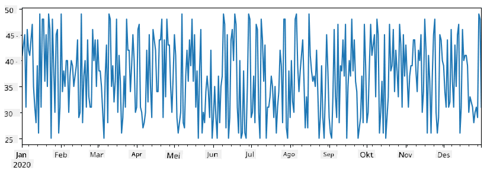
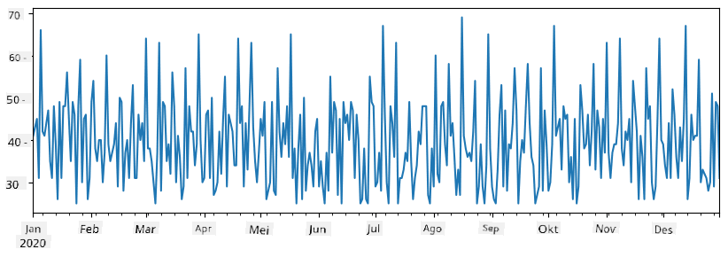
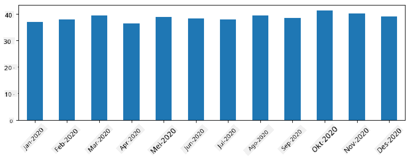
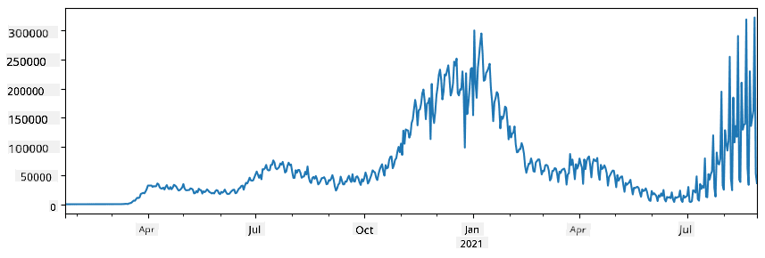
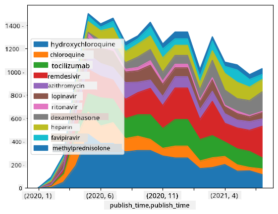

<!--
CO_OP_TRANSLATOR_METADATA:
{
  "original_hash": "116c5d361fbe812e59a73f37ce721d36",
  "translation_date": "2025-08-26T14:42:16+00:00",
  "source_file": "2-Working-With-Data/07-python/README.md",
  "language_code": "sw"
}
-->
# Kufanya Kazi na Data: Python na Maktaba ya Pandas

|  ](../../sketchnotes/07-WorkWithPython.png) |
| :-------------------------------------------------------------------------------------------------------: |
|                 Kufanya Kazi na Python - _Sketchnote na [@nitya](https://twitter.com/nitya)_              |

[](https://youtu.be/dZjWOGbsN4Y)

Ingawa hifadhidata hutoa njia bora sana za kuhifadhi data na kuzichakata kwa kutumia lugha za maswali, njia inayonyumbulika zaidi ya kuchakata data ni kuandika programu yako mwenyewe ya kuendesha data. Katika hali nyingi, kutumia maswali ya hifadhidata ni njia bora zaidi. Hata hivyo, katika baadhi ya hali ambapo uchakataji wa data changamano zaidi unahitajika, haiwezi kufanyika kwa urahisi kwa kutumia SQL. 
Uchakataji wa data unaweza kufanywa kwa kutumia lugha yoyote ya programu, lakini kuna lugha fulani ambazo ni za kiwango cha juu zaidi linapokuja suala la kufanya kazi na data. Wanasayansi wa data mara nyingi hupendelea mojawapo ya lugha zifuatazo:

* **[Python](https://www.python.org/)**, lugha ya programu ya matumizi ya jumla, ambayo mara nyingi huchukuliwa kuwa chaguo bora kwa wanaoanza kutokana na urahisi wake. Python ina maktaba nyingi za ziada zinazoweza kukusaidia kutatua matatizo mengi ya vitendo, kama vile kutoa data yako kutoka kwenye jalada la ZIP, au kubadilisha picha kuwa rangi ya kijivu. Mbali na sayansi ya data, Python pia hutumika mara nyingi kwa maendeleo ya wavuti. 
* **[R](https://www.r-project.org/)** ni zana ya jadi iliyotengenezwa kwa lengo la uchakataji wa takwimu. Pia ina hifadhi kubwa ya maktaba (CRAN), na kuifanya kuwa chaguo zuri kwa uchakataji wa data. Hata hivyo, R si lugha ya programu ya matumizi ya jumla, na mara chache hutumika nje ya uwanja wa sayansi ya data.
* **[Julia](https://julialang.org/)** ni lugha nyingine iliyotengenezwa mahsusi kwa sayansi ya data. Imeundwa ili kutoa utendaji bora zaidi kuliko Python, na kuifanya kuwa zana nzuri kwa majaribio ya kisayansi.

Katika somo hili, tutazingatia kutumia Python kwa uchakataji rahisi wa data. Tutadhania una ufahamu wa msingi wa lugha hii. Ikiwa unataka kujifunza Python kwa kina zaidi, unaweza kurejelea mojawapo ya rasilimali zifuatazo:

* [Jifunze Python kwa Njia ya Kufurahisha na Michoro ya Turtle na Fractals](https://github.com/shwars/pycourse) - Kozi ya haraka ya utangulizi ya Python kwenye GitHub
* [Chukua Hatua Zako za Kwanza na Python](https://docs.microsoft.com/en-us/learn/paths/python-first-steps/?WT.mc_id=academic-77958-bethanycheum) Njia ya Kujifunza kwenye [Microsoft Learn](http://learn.microsoft.com/?WT.mc_id=academic-77958-bethanycheum)

Data inaweza kuja katika aina nyingi. Katika somo hili, tutazingatia aina tatu za data - **data ya jedwali**, **maandishi**, na **picha**.

Tutazingatia mifano michache ya uchakataji wa data, badala ya kukupa muhtasari kamili wa maktaba zote zinazohusiana. Hii itakuruhusu kupata wazo kuu la kinachowezekana, na kukuachia uelewa wa wapi pa kupata suluhisho la matatizo yako unapohitaji.

> **Ushauri muhimu zaidi**. Unapohitaji kufanya operesheni fulani kwenye data ambayo hujui jinsi ya kufanya, jaribu kuitafuta kwenye mtandao. [Stackoverflow](https://stackoverflow.com/) mara nyingi ina sampuli nyingi za msimbo wa Python kwa kazi nyingi za kawaida.

## [Jaribio la Kabla ya Somo](https://purple-hill-04aebfb03.1.azurestaticapps.net/quiz/12)

## Data ya Jedwali na Dataframes

Tayari umekutana na data ya jedwali tulipozungumzia hifadhidata za uhusiano. Unapokuwa na data nyingi, na imehifadhiwa katika meza nyingi zilizounganishwa, inafaa kutumia SQL kufanya kazi nayo. Hata hivyo, kuna hali nyingi ambapo tuna jedwali la data, na tunahitaji kupata **ufahamu** au **maarifa** kuhusu data hii, kama vile usambazaji, uhusiano kati ya thamani, n.k. Katika sayansi ya data, kuna hali nyingi ambapo tunahitaji kufanya mabadiliko ya data ya awali, ikifuatiwa na uwasilishaji wa picha. Hatua zote mbili zinaweza kufanywa kwa urahisi kwa kutumia Python.

Kuna maktaba mbili muhimu zaidi katika Python zinazoweza kukusaidia kushughulikia data ya jedwali:
* **[Pandas](https://pandas.pydata.org/)** inakuwezesha kuendesha kinachoitwa **Dataframes**, ambazo ni sawa na meza za uhusiano. Unaweza kuwa na safu zilizopewa majina, na kufanya operesheni tofauti kwenye safu, safu wima, na dataframes kwa ujumla. 
* **[Numpy](https://numpy.org/)** ni maktaba ya kufanya kazi na **tensors**, yaani **arrays** za vipimo vingi. Array ina thamani za aina moja ya msingi, na ni rahisi zaidi kuliko dataframe, lakini inatoa operesheni zaidi za kihisabati, na inazalisha mzigo mdogo.

Pia kuna maktaba nyingine chache unazopaswa kujua:
* **[Matplotlib](https://matplotlib.org/)** ni maktaba inayotumika kwa uwasilishaji wa data na kuchora grafu
* **[SciPy](https://www.scipy.org/)** ni maktaba yenye baadhi ya kazi za kisayansi za ziada. Tayari tumekutana na maktaba hii tulipozungumzia uwezekano na takwimu

Hapa kuna kipande cha msimbo ambacho ungeweza kutumia kuingiza maktaba hizi mwanzoni mwa programu yako ya Python:
```python
import numpy as np
import pandas as pd
import matplotlib.pyplot as plt
from scipy import ... # you need to specify exact sub-packages that you need
``` 

Pandas inazingatia dhana chache za msingi.

### Series 

**Series** ni mlolongo wa thamani, sawa na orodha au numpy array. Tofauti kuu ni kwamba series pia ina **index**, na tunapofanya operesheni kwenye series (mfano, kuziongeza), index inazingatiwa. Index inaweza kuwa rahisi kama namba ya mstari wa integer (ndiyo index inayotumika kwa chaguo-msingi wakati wa kuunda series kutoka kwenye orodha au array), au inaweza kuwa na muundo changamano, kama vile muda wa tarehe.

> **Kumbuka**: Kuna msimbo wa utangulizi wa Pandas katika daftari linaloambatana [`notebook.ipynb`](notebook.ipynb). Tunatoa mifano michache hapa, na unakaribishwa kabisa kuangalia daftari kamili.

Fikiria mfano: tunataka kuchambua mauzo ya duka letu la ice-cream. Hebu tuunde mfululizo wa namba za mauzo (idadi ya bidhaa zilizouzwa kila siku) kwa kipindi fulani cha muda:

```python
start_date = "Jan 1, 2020"
end_date = "Mar 31, 2020"
idx = pd.date_range(start_date,end_date)
print(f"Length of index is {len(idx)}")
items_sold = pd.Series(np.random.randint(25,50,size=len(idx)),index=idx)
items_sold.plot()
```


Sasa tuseme kila wiki tunaandaa sherehe kwa marafiki, na tunachukua pakiti 10 za ziada za ice-cream kwa ajili ya sherehe. Tunaweza kuunda mfululizo mwingine, ulio na index ya wiki, kuonyesha hilo:
```python
additional_items = pd.Series(10,index=pd.date_range(start_date,end_date,freq="W"))
```
Tunapoongeza mfululizo miwili pamoja, tunapata jumla ya idadi:
```python
total_items = items_sold.add(additional_items,fill_value=0)
total_items.plot()
```


> **Kumbuka** kwamba hatutumii sintaksia rahisi `total_items+additional_items`. Tukifanya hivyo, tungepata thamani nyingi za `NaN` (*Not a Number*) katika mfululizo wa matokeo. Hii ni kwa sababu kuna thamani zinazokosekana kwa baadhi ya pointi za index katika mfululizo wa `additional_items`, na kuongeza `NaN` kwa kitu chochote husababisha `NaN`. Kwa hivyo tunahitaji kutaja kipengele cha `fill_value` wakati wa kuongeza.

Kwa mfululizo wa muda, tunaweza pia **kurekebisha upya** mfululizo kwa vipindi tofauti vya muda. Kwa mfano, tuseme tunataka kuhesabu wastani wa mauzo kila mwezi. Tunaweza kutumia msimbo huu:
```python
monthly = total_items.resample("1M").mean()
ax = monthly.plot(kind='bar')
```


### DataFrame

DataFrame kimsingi ni mkusanyiko wa mfululizo wenye index sawa. Tunaweza kuchanganya mfululizo kadhaa pamoja kuwa DataFrame:
```python
a = pd.Series(range(1,10))
b = pd.Series(["I","like","to","play","games","and","will","not","change"],index=range(0,9))
df = pd.DataFrame([a,b])
```
Hii itaunda jedwali la mlalo kama hili:
|     | 0   | 1    | 2   | 3   | 4      | 5   | 6      | 7    | 8    |
| --- | --- | ---- | --- | --- | ------ | --- | ------ | ---- | ---- |
| 0   | 1   | 2    | 3   | 4   | 5      | 6   | 7      | 8    | 9    |
| 1   | I   | like | to  | use | Python | and | Pandas | very | much |

Tunaweza pia kutumia Series kama safu wima, na kutaja majina ya safu wima kwa kutumia kamusi:
```python
df = pd.DataFrame({ 'A' : a, 'B' : b })
```
Hii itatupa jedwali kama hili:

|     | A   | B      |
| --- | --- | ------ |
| 0   | 1   | I      |
| 1   | 2   | like   |
| 2   | 3   | to     |
| 3   | 4   | use    |
| 4   | 5   | Python |
| 5   | 6   | and    |
| 6   | 7   | Pandas |
| 7   | 8   | very   |
| 8   | 9   | much   |

**Kumbuka** kwamba tunaweza pia kupata mpangilio huu wa jedwali kwa kubadilisha jedwali la awali, kwa mfano kwa kuandika 
```python
df = pd.DataFrame([a,b]).T..rename(columns={ 0 : 'A', 1 : 'B' })
```
Hapa `.T` inamaanisha operesheni ya kubadilisha DataFrame, yaani kubadilisha safu na safu wima, na operesheni ya `rename` inaruhusu sisi kubadilisha majina ya safu wima ili yafanane na mfano wa awali.

Hapa kuna baadhi ya operesheni muhimu zaidi tunazoweza kufanya kwenye DataFrames:

**Uchaguzi wa safu wima**. Tunaweza kuchagua safu wima moja kwa kuandika `df['A']` - operesheni hii inarudisha Series. Tunaweza pia kuchagua sehemu ndogo ya safu wima kuwa DataFrame nyingine kwa kuandika `df[['B','A']]` - hii inarudisha DataFrame nyingine.

**Kuchuja** safu fulani kwa vigezo. Kwa mfano, ili kuacha tu safu zenye safu wima `A` kubwa kuliko 5, tunaweza kuandika `df[df['A']>5]`.

> **Kumbuka**: Njia ambayo kuchuja hufanya kazi ni kama ifuatavyo. Usemi `df['A']<5` unarudisha mfululizo wa boolean, unaoonyesha kama usemi ni `True` au `False` kwa kila kipengele cha mfululizo wa awali `df['A']`. Wakati mfululizo wa boolean unatumika kama index, unarudisha sehemu ndogo ya safu katika DataFrame. Kwa hivyo haiwezekani kutumia usemi wa boolean wa Python wa kawaida, kwa mfano, kuandika `df[df['A']>5 and df['A']<7]` itakuwa makosa. Badala yake, unapaswa kutumia operesheni maalum ya `&` kwenye mfululizo wa boolean, kwa kuandika `df[(df['A']>5) & (df['A']<7)]` (*mabano ni muhimu hapa*).

**Kuunda safu wima mpya za kuhesabu**. Tunaweza kwa urahisi kuunda safu wima mpya za kuhesabu kwa DataFrame yetu kwa kutumia usemi wa angavu kama huu:
```python
df['DivA'] = df['A']-df['A'].mean() 
``` 
Mfano huu unahesabu tofauti ya A kutoka thamani yake ya wastani. Kinachotokea hapa ni kwamba tunahesabu mfululizo, kisha tunauweka kwenye upande wa kushoto, na kuunda safu wima nyingine. Kwa hivyo, hatuwezi kutumia operesheni zozote ambazo hazilingani na mfululizo, kwa mfano, msimbo hapa chini ni makosa:
```python
# Wrong code -> df['ADescr'] = "Low" if df['A'] < 5 else "Hi"
df['LenB'] = len(df['B']) # <- Wrong result
``` 
Mfano wa mwisho, ingawa ni sahihi kisintaksia, unatupa matokeo mabaya, kwa sababu unaweka urefu wa mfululizo `B` kwa thamani zote kwenye safu wima, na si urefu wa vipengele vya mtu binafsi kama tulivyokusudia.

Ikiwa tunahitaji kuhesabu usemi changamano kama huu, tunaweza kutumia kazi ya `apply`. Mfano wa mwisho unaweza kuandikwa kama ifuatavyo:
```python
df['LenB'] = df['B'].apply(lambda x : len(x))
# or 
df['LenB'] = df['B'].apply(len)
```

Baada ya operesheni hapo juu, tutakuwa na DataFrame ifuatayo:

|     | A   | B      | DivA | LenB |
| --- | --- | ------ | ---- | ---- |
| 0   | 1   | I      | -4.0 | 1    |
| 1   | 2   | like   | -3.0 | 4    |
| 2   | 3   | to     | -2.0 | 2    |
| 3   | 4   | use    | -1.0 | 3    |
| 4   | 5   | Python | 0.0  | 6    |
| 5   | 6   | and    | 1.0  | 3    |
| 6   | 7   | Pandas | 2.0  | 6    |
| 7   | 8   | very   | 3.0  | 4    |
| 8   | 9   | much   | 4.0  | 4    |

**Kuchagua safu kwa namba** kunaweza kufanywa kwa kutumia muundo wa `iloc`. Kwa mfano, kuchagua safu 5 za kwanza kutoka kwenye DataFrame:
```python
df.iloc[:5]
```

**Kugawanya** mara nyingi hutumika kupata matokeo yanayofanana na *pivot tables* katika Excel. Tuseme tunataka kuhesabu wastani wa thamani ya safu wima `A` kwa kila idadi fulani ya `LenB`. Kisha tunaweza kugawanya DataFrame yetu kwa `LenB`, na kuita `mean`:
```python
df.groupby(by='LenB').mean()
```
Ikiwa tunahitaji kuhesabu wastani na idadi ya vipengele katika kikundi, basi tunaweza kutumia kazi changamano zaidi ya `aggregate`:
```python
df.groupby(by='LenB') \
 .aggregate({ 'DivA' : len, 'A' : lambda x: x.mean() }) \
 .rename(columns={ 'DivA' : 'Count', 'A' : 'Mean'})
```
Hii inatupa jedwali lifuatalo:

| LenB | Count | Mean     |
| ---- | ----- | -------- |
| 1    | 1     | 1.000000 |
| 2    | 1     | 3.000000 |
| 3    | 2     | 5.000000 |
| 4    | 3     | 6.333333 |
| 6    | 2     | 6.000000 |

### Kupata Data
Tumeona jinsi ilivyo rahisi kuunda Series na DataFrames kutoka kwa vitu vya Python. Hata hivyo, data mara nyingi huja katika mfumo wa faili ya maandishi, au jedwali la Excel. Kwa bahati nzuri, Pandas inatupa njia rahisi ya kupakia data kutoka diski. Kwa mfano, kusoma faili ya CSV ni rahisi kama hivi:  
```python
df = pd.read_csv('file.csv')
```  
Tutaona mifano zaidi ya kupakia data, ikiwa ni pamoja na kuipata kutoka tovuti za nje, katika sehemu ya "Changamoto".  

### Kuchapisha na Kuchora  

Mwanasayansi wa Data mara nyingi anahitaji kuchunguza data, hivyo ni muhimu kuwa na uwezo wa kuiona kwa picha. Wakati DataFrame ni kubwa, mara nyingi tunataka tu kuhakikisha tunafanya kila kitu kwa usahihi kwa kuchapisha mistari michache ya kwanza. Hii inaweza kufanyika kwa kupiga `df.head()`. Ikiwa unaiendesha kutoka Jupyter Notebook, itachapisha DataFrame katika mfumo mzuri wa tabular.  

Tumeona pia matumizi ya kazi ya `plot` kuonyesha baadhi ya safu. Ingawa `plot` ni muhimu sana kwa kazi nyingi, na inasaidia aina nyingi za grafu kupitia parameter ya `kind=`, unaweza daima kutumia maktaba ya msingi ya `matplotlib` kuchora kitu kigumu zaidi. Tutashughulikia uonyeshaji wa data kwa undani katika masomo tofauti ya kozi.  

Muhtasari huu unashughulikia dhana muhimu zaidi za Pandas, hata hivyo, maktaba hii ni tajiri sana, na hakuna kikomo cha kile unachoweza kufanya nayo! Sasa hebu tutumie maarifa haya kutatua tatizo maalum.  

## 🚀 Changamoto ya 1: Kuchambua Kuenea kwa COVID  

Tatizo la kwanza ambalo tutalenga ni uundaji wa kuenea kwa janga la COVID-19. Ili kufanya hivyo, tutatumia data ya idadi ya watu walioambukizwa katika nchi tofauti, iliyotolewa na [Center for Systems Science and Engineering](https://systems.jhu.edu/) (CSSE) katika [Chuo Kikuu cha Johns Hopkins](https://jhu.edu/). Dataset inapatikana katika [Hifadhi hii ya GitHub](https://github.com/CSSEGISandData/COVID-19).  

Kwa kuwa tunataka kuonyesha jinsi ya kushughulikia data, tunakualika kufungua [`notebook-covidspread.ipynb`](notebook-covidspread.ipynb) na kuisoma kutoka juu hadi chini. Unaweza pia kutekeleza seli, na kufanya changamoto ambazo tumekuachia mwishoni.  

  

> Ikiwa hujui jinsi ya kuendesha msimbo katika Jupyter Notebook, angalia [makala hii](https://soshnikov.com/education/how-to-execute-notebooks-from-github/).  

## Kufanya Kazi na Data Isiyo na Muundo  

Ingawa data mara nyingi huja katika mfumo wa tabular, katika baadhi ya matukio tunahitaji kushughulikia data isiyo na muundo, kwa mfano, maandishi au picha. Katika hali hii, ili kutumia mbinu za usindikaji wa data tulizoona hapo juu, tunahitaji kwa namna fulani **kuchota** data yenye muundo. Hapa kuna mifano michache:  

* Kuchota maneno muhimu kutoka kwa maandishi, na kuona mara ngapi maneno hayo yanatokea  
* Kutumia mitandao ya neva kuchota taarifa kuhusu vitu vilivyopo kwenye picha  
* Kupata taarifa kuhusu hisia za watu kwenye video ya kamera  

## 🚀 Changamoto ya 2: Kuchambua Makala za COVID  

Katika changamoto hii, tutaendelea na mada ya janga la COVID, na kuzingatia usindikaji wa makala za kisayansi kuhusu mada hiyo. Kuna [Dataset ya CORD-19](https://www.kaggle.com/allen-institute-for-ai/CORD-19-research-challenge) yenye zaidi ya makala 7000 (wakati wa kuandika) kuhusu COVID, inapatikana na metadata na muhtasari (na kwa karibu nusu ya makala kuna maandishi kamili pia).  

Mfano kamili wa kuchambua dataset hii kwa kutumia huduma ya kiakili ya [Text Analytics for Health](https://docs.microsoft.com/azure/cognitive-services/text-analytics/how-tos/text-analytics-for-health/?WT.mc_id=academic-77958-bethanycheum) umeelezwa [katika blogu hii](https://soshnikov.com/science/analyzing-medical-papers-with-azure-and-text-analytics-for-health/). Tutajadili toleo rahisi la uchambuzi huu.  

> **NOTE**: Hatutoi nakala ya dataset kama sehemu ya hifadhi hii. Huenda ukahitaji kwanza kupakua faili ya [`metadata.csv`](https://www.kaggle.com/allen-institute-for-ai/CORD-19-research-challenge?select=metadata.csv) kutoka [dataset hii kwenye Kaggle](https://www.kaggle.com/allen-institute-for-ai/CORD-19-research-challenge). Usajili na Kaggle unaweza kuhitajika. Unaweza pia kupakua dataset bila usajili [kutoka hapa](https://ai2-semanticscholar-cord-19.s3-us-west-2.amazonaws.com/historical_releases.html), lakini itajumuisha maandishi kamili yote pamoja na faili ya metadata.  

Fungua [`notebook-papers.ipynb`](notebook-papers.ipynb) na isome kutoka juu hadi chini. Unaweza pia kutekeleza seli, na kufanya changamoto ambazo tumekuachia mwishoni.  

  

## Usindikaji wa Data ya Picha  

Hivi karibuni, mifano yenye nguvu sana ya AI imeendelezwa ambayo inaruhusu kuelewa picha. Kuna kazi nyingi ambazo zinaweza kutatuliwa kwa kutumia mitandao ya neva iliyofunzwa awali, au huduma za wingu. Mifano kadhaa ni pamoja na:  

* **Uainishaji wa Picha**, ambao unaweza kukusaidia kuainisha picha katika mojawapo ya madarasa yaliyotangulia. Unaweza kwa urahisi kufundisha uainishaji wako wa picha kwa kutumia huduma kama [Custom Vision](https://azure.microsoft.com/services/cognitive-services/custom-vision-service/?WT.mc_id=academic-77958-bethanycheum)  
* **Utambuzi wa Vitu** ili kutambua vitu tofauti kwenye picha. Huduma kama [computer vision](https://azure.microsoft.com/services/cognitive-services/computer-vision/?WT.mc_id=academic-77958-bethanycheum) zinaweza kutambua idadi ya vitu vya kawaida, na unaweza kufundisha [Custom Vision](https://azure.microsoft.com/services/cognitive-services/custom-vision-service/?WT.mc_id=academic-77958-bethanycheum) kutambua vitu maalum vya maslahi.  
* **Utambuzi wa Uso**, ikiwa ni pamoja na Umri, Jinsia na Utambuzi wa Hisia. Hii inaweza kufanyika kupitia [Face API](https://azure.microsoft.com/services/cognitive-services/face/?WT.mc_id=academic-77958-bethanycheum).  

Huduma zote za wingu zinaweza kuitwa kwa kutumia [Python SDKs](https://docs.microsoft.com/samples/azure-samples/cognitive-services-python-sdk-samples/cognitive-services-python-sdk-samples/?WT.mc_id=academic-77958-bethanycheum), na hivyo zinaweza kuingizwa kwa urahisi katika mtiririko wako wa uchunguzi wa data.  

Hapa kuna mifano ya kuchunguza data kutoka vyanzo vya data ya Picha:  
* Katika blogu ya [Jinsi ya Kujifunza Sayansi ya Data bila Coding](https://soshnikov.com/azure/how-to-learn-data-science-without-coding/) tunachunguza picha za Instagram, tukijaribu kuelewa ni nini kinachofanya watu kutoa likes zaidi kwa picha. Kwanza tunachota taarifa nyingi kutoka kwa picha kwa kutumia [computer vision](https://azure.microsoft.com/services/cognitive-services/computer-vision/?WT.mc_id=academic-77958-bethanycheum), kisha tunatumia [Azure Machine Learning AutoML](https://docs.microsoft.com/azure/machine-learning/concept-automated-ml/?WT.mc_id=academic-77958-bethanycheum) kujenga mfano unaoweza kufasiriwa.  
* Katika [Warsha ya Utafiti wa Uso](https://github.com/CloudAdvocacy/FaceStudies) tunatumia [Face API](https://azure.microsoft.com/services/cognitive-services/face/?WT.mc_id=academic-77958-bethanycheum) kuchota hisia za watu kwenye picha kutoka matukio, ili kujaribu kuelewa ni nini kinachofanya watu kuwa na furaha.  

## Hitimisho  

Ikiwa tayari una data yenye muundo au isiyo na muundo, kwa kutumia Python unaweza kufanya hatua zote zinazohusiana na usindikaji wa data na uelewa. Hii pengine ndiyo njia rahisi zaidi ya usindikaji wa data, na ndiyo sababu wataalamu wengi wa data hutumia Python kama chombo chao kikuu. Kujifunza Python kwa kina ni wazo zuri ikiwa unachukua safari yako ya sayansi ya data kwa uzito!  

## [Jaribio la baada ya somo](https://purple-hill-04aebfb03.1.azurestaticapps.net/quiz/13)  

## Mapitio na Kujifunza Mwenyewe  

**Vitabu**  
* [Wes McKinney. Python for Data Analysis: Data Wrangling with Pandas, NumPy, and IPython](https://www.amazon.com/gp/product/1491957662)  

**Rasilimali za Mtandaoni**  
* Mafunzo rasmi ya [Dakika 10 za Pandas](https://pandas.pydata.org/pandas-docs/stable/user_guide/10min.html)  
* [Nyaraka za Uonyeshaji wa Pandas](https://pandas.pydata.org/pandas-docs/stable/user_guide/visualization.html)  

**Kujifunza Python**  
* [Jifunze Python kwa Njia ya Kufurahisha na Michoro ya Turtle na Fractals](https://github.com/shwars/pycourse)  
* [Chukua Hatua Zako za Kwanza na Python](https://docs.microsoft.com/learn/paths/python-first-steps/?WT.mc_id=academic-77958-bethanycheum) Njia ya Kujifunza kwenye [Microsoft Learn](http://learn.microsoft.com/?WT.mc_id=academic-77958-bethanycheum)  

## Kazi  

[Fanya uchambuzi wa kina wa data kwa changamoto zilizo hapo juu](assignment.md)  

## Credits  

Somu hili limeandikwa kwa ♥️ na [Dmitry Soshnikov](http://soshnikov.com)  

---

**Kanusho**:  
Hati hii imetafsiriwa kwa kutumia huduma ya kutafsiri ya AI [Co-op Translator](https://github.com/Azure/co-op-translator). Ingawa tunajitahidi kuhakikisha usahihi, tafadhali fahamu kuwa tafsiri za kiotomatiki zinaweza kuwa na makosa au kutokuwa sahihi. Hati ya asili katika lugha yake ya awali inapaswa kuzingatiwa kama chanzo cha mamlaka. Kwa taarifa muhimu, tafsiri ya kitaalamu ya binadamu inapendekezwa. Hatutawajibika kwa kutoelewana au tafsiri zisizo sahihi zinazotokana na matumizi ya tafsiri hii.