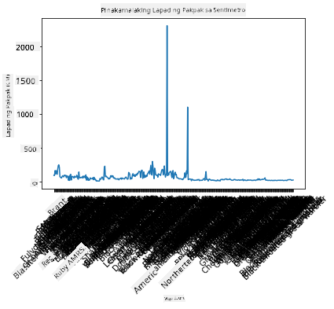
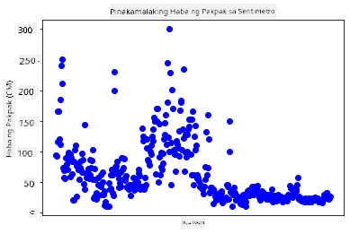
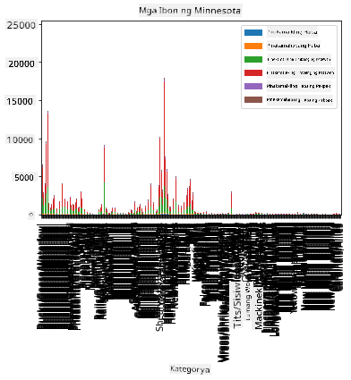
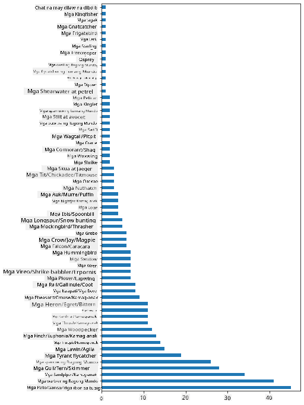
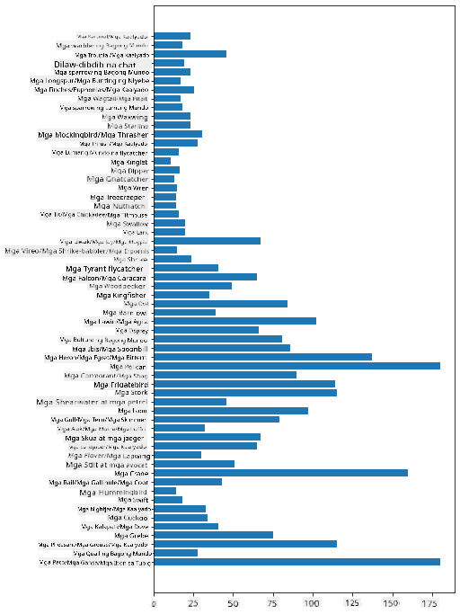
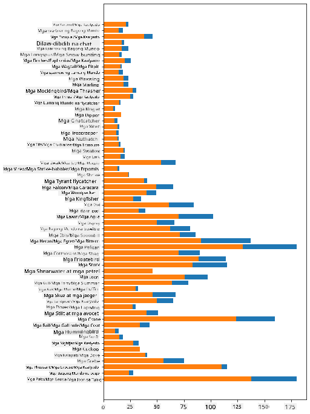

<!--
CO_OP_TRANSLATOR_METADATA:
{
  "original_hash": "43c402d9d90ae6da55d004519ada5033",
  "translation_date": "2025-08-28T02:39:36+00:00",
  "source_file": "3-Data-Visualization/09-visualization-quantities/README.md",
  "language_code": "tl"
}
-->
# Pagpapakita ng Dami

| ](../../sketchnotes/09-Visualizing-Quantities.png)|
|:---:|
| Pagpapakita ng Dami - _Sketchnote ni [@nitya](https://twitter.com/nitya)_ |

Sa araling ito, matutuklasan mo kung paano gamitin ang isa sa maraming Python libraries upang matutunan kung paano lumikha ng mga kawili-wiling visualisasyon na may kaugnayan sa konsepto ng dami. Gamit ang isang nalinis na dataset tungkol sa mga ibon ng Minnesota, maaari kang matuto ng maraming kawili-wiling impormasyon tungkol sa lokal na wildlife.

## [Pre-lecture quiz](https://purple-hill-04aebfb03.1.azurestaticapps.net/quiz/16)

## Obserbahan ang wingspan gamit ang Matplotlib

Ang [Matplotlib](https://matplotlib.org/stable/index.html) ay isang mahusay na library para sa paggawa ng parehong simple at sopistikadong mga plot at chart ng iba't ibang uri. Sa pangkalahatan, ang proseso ng pag-plot ng data gamit ang mga library na ito ay kinabibilangan ng pagtukoy sa mga bahagi ng iyong dataframe na nais mong i-target, pagsasagawa ng anumang transformasyon sa data na kinakailangan, pagtatalaga ng mga x at y axis values, pagpapasya kung anong uri ng plot ang ipapakita, at pagkatapos ay ipakita ang plot. Nag-aalok ang Matplotlib ng malawak na uri ng visualisasyon, ngunit para sa araling ito, mag-focus tayo sa mga pinakaangkop para sa pagpapakita ng dami: line charts, scatterplots, at bar plots.

> ✅ Gumamit ng pinakamahusay na chart na angkop sa istruktura ng iyong data at sa kwentong nais mong ipakita.  
> - Para sa pagsusuri ng mga trend sa paglipas ng panahon: line  
> - Para sa paghahambing ng mga halaga: bar, column, pie, scatterplot  
> - Para ipakita kung paano nauugnay ang mga bahagi sa kabuuan: pie  
> - Para ipakita ang distribusyon ng data: scatterplot, bar  
> - Para ipakita ang mga trend: line, column  
> - Para ipakita ang relasyon sa pagitan ng mga halaga: line, scatterplot, bubble  

Kung mayroon kang dataset at kailangang tuklasin kung gaano karami ang isang partikular na item, isa sa mga unang hakbang na gagawin mo ay ang inspeksyon ng mga halaga nito.

✅ Mayroong magagandang 'cheat sheets' para sa Matplotlib [dito](https://matplotlib.org/cheatsheets/cheatsheets.pdf).

## Gumawa ng line plot tungkol sa mga halaga ng wingspan ng ibon

Buksan ang `notebook.ipynb` file sa root ng folder ng araling ito at magdagdag ng cell.

> Tandaan: ang data ay nakaimbak sa root ng repo na ito sa folder na `/data`.

```python
import pandas as pd
import matplotlib.pyplot as plt
birds = pd.read_csv('../../data/birds.csv')
birds.head()
```  
Ang data na ito ay halo ng teksto at mga numero:

|      | Pangalan                     | ScientificName         | Kategorya             | Order        | Pamilya  | Genus       | ConservationStatus | MinLength | MaxLength | MinBodyMass | MaxBodyMass | MinWingspan | MaxWingspan |
| ---: | :--------------------------- | :--------------------- | :-------------------- | :----------- | :------- | :---------- | :----------------- | --------: | --------: | ----------: | ----------: | ----------: | ----------: |
|    0 | Black-bellied whistling-duck | Dendrocygna autumnalis | Ducks/Geese/Waterfowl | Anseriformes | Anatidae | Dendrocygna | LC                 |        47 |        56 |         652 |        1020 |          76 |          94 |
|    1 | Fulvous whistling-duck       | Dendrocygna bicolor    | Ducks/Geese/Waterfowl | Anseriformes | Anatidae | Dendrocygna | LC                 |        45 |        53 |         712 |        1050 |          85 |          93 |
|    2 | Snow goose                   | Anser caerulescens     | Ducks/Geese/Waterfowl | Anseriformes | Anatidae | Anser       | LC                 |        64 |        79 |        2050 |        4050 |         135 |         165 |
|    3 | Ross's goose                 | Anser rossii           | Ducks/Geese/Waterfowl | Anseriformes | Anatidae | Anser       | LC                 |      57.3 |        64 |        1066 |        1567 |         113 |         116 |
|    4 | Greater white-fronted goose  | Anser albifrons        | Ducks/Geese/Waterfowl | Anseriformes | Anatidae | Anser       | LC                 |        64 |        81 |        1930 |        3310 |         130 |         165 |

Simulan natin sa pag-plot ng ilan sa mga numerong data gamit ang isang basic line plot. Halimbawa, gusto mong makita ang maximum wingspan ng mga kawili-wiling ibon na ito.

```python
wingspan = birds['MaxWingspan'] 
wingspan.plot()
```  


Ano ang napansin mo agad? Mukhang mayroong hindi bababa sa isang outlier - napakalaki ng wingspan! Ang 2300 sentimetro na wingspan ay katumbas ng 23 metro - may mga Pterodactyl ba sa Minnesota? Suriin natin.

Bagama't maaari kang gumawa ng mabilis na sort sa Excel upang mahanap ang mga outlier, na malamang ay mga typo, ipagpatuloy ang proseso ng visualisasyon sa pamamagitan ng pagtatrabaho mula sa loob ng plot.

Magdagdag ng mga label sa x-axis upang ipakita kung anong uri ng mga ibon ang pinag-uusapan:

```
plt.title('Max Wingspan in Centimeters')
plt.ylabel('Wingspan (CM)')
plt.xlabel('Birds')
plt.xticks(rotation=45)
x = birds['Name'] 
y = birds['MaxWingspan']

plt.plot(x, y)

plt.show()
```  


Kahit na ang mga label ay naka-rotate sa 45 degrees, masyado pa rin silang maraming basahin. Subukan natin ang ibang estratehiya: lagyan ng label ang mga outlier lamang at ilagay ang mga label sa loob ng chart. Maaari kang gumamit ng scatter chart upang magkaroon ng mas maraming espasyo para sa paglalagay ng label:

```python
plt.title('Max Wingspan in Centimeters')
plt.ylabel('Wingspan (CM)')
plt.tick_params(axis='both',which='both',labelbottom=False,bottom=False)

for i in range(len(birds)):
    x = birds['Name'][i]
    y = birds['MaxWingspan'][i]
    plt.plot(x, y, 'bo')
    if birds['MaxWingspan'][i] > 500:
        plt.text(x, y * (1 - 0.05), birds['Name'][i], fontsize=12)
    
plt.show()
```  
Ano ang nangyayari dito? Ginamit mo ang `tick_params` upang itago ang mga label sa ibaba at pagkatapos ay gumawa ng loop sa iyong dataset ng mga ibon. Sa pag-plot ng chart gamit ang maliliit na bilog na asul na tuldok gamit ang `bo`, sinuri mo ang anumang ibon na may maximum wingspan na higit sa 500 at ipinakita ang kanilang label sa tabi ng tuldok kung mayroon. In-offset mo ang mga label nang kaunti sa y axis (`y * (1 - 0.05)`) at ginamit ang pangalan ng ibon bilang label.

Ano ang natuklasan mo?


## I-filter ang iyong data

Ang Bald Eagle at Prairie Falcon, bagama't malamang na napakalaking ibon, ay mukhang maling na-label, na may dagdag na `0` sa kanilang maximum wingspan. Hindi malamang na makakita ka ng Bald Eagle na may 25 metrong wingspan, ngunit kung sakali, ipaalam mo sa amin! Gumawa tayo ng bagong dataframe na walang dalawang outlier na ito:

```python
plt.title('Max Wingspan in Centimeters')
plt.ylabel('Wingspan (CM)')
plt.xlabel('Birds')
plt.tick_params(axis='both',which='both',labelbottom=False,bottom=False)
for i in range(len(birds)):
    x = birds['Name'][i]
    y = birds['MaxWingspan'][i]
    if birds['Name'][i] not in ['Bald eagle', 'Prairie falcon']:
        plt.plot(x, y, 'bo')
plt.show()
```  

Sa pag-filter ng mga outlier, ang iyong data ay mas cohesive at mas madaling maunawaan.



Ngayon na mayroon tayong mas malinis na dataset, hindi bababa sa mga tuntunin ng wingspan, tuklasin natin ang higit pa tungkol sa mga ibon na ito.

Bagama't ang line at scatter plots ay maaaring magpakita ng impormasyon tungkol sa mga halaga ng data at kanilang distribusyon, nais nating pag-isipan ang mga halaga na likas sa dataset na ito. Maaari kang lumikha ng mga visualisasyon upang sagutin ang mga sumusunod na tanong tungkol sa dami:

> Ilan ang mga kategorya ng ibon, at ano ang kanilang bilang?  
> Ilan ang mga ibon na extinct, endangered, rare, o common?  
> Ilan ang iba't ibang genus at orders sa terminolohiya ni Linnaeus?  

## Tuklasin ang bar charts

Ang bar charts ay praktikal kapag kailangan mong ipakita ang mga pangkat ng data. Tuklasin natin ang mga kategorya ng ibon na umiiral sa dataset na ito upang makita kung alin ang pinakakaraniwan batay sa bilang.

Sa notebook file, gumawa ng basic bar chart.

✅ Tandaan, maaari mong i-filter ang dalawang outlier na ibon na natukoy natin sa nakaraang seksyon, i-edit ang typo sa kanilang wingspan, o iwanan sila para sa mga ehersisyo na ito na hindi nakadepende sa mga halaga ng wingspan.

Kung nais mong gumawa ng bar chart, maaari mong piliin ang data na nais mong i-focus. Ang bar charts ay maaaring gawin mula sa raw data:

```python
birds.plot(x='Category',
        kind='bar',
        stacked=True,
        title='Birds of Minnesota')

```  


Gayunpaman, ang bar chart na ito ay hindi mababasa dahil masyadong maraming hindi naka-group na data. Kailangan mong piliin lamang ang data na nais mong i-plot, kaya't tingnan natin ang haba ng mga ibon batay sa kanilang kategorya.

I-filter ang iyong data upang isama lamang ang kategorya ng ibon.

✅ Pansinin na ginagamit mo ang Pandas upang pamahalaan ang data, at pagkatapos ay hayaan ang Matplotlib na gawin ang charting.

Dahil maraming kategorya, maaari mong ipakita ang chart na ito nang patayo at i-tweak ang taas nito upang ma-accommodate ang lahat ng data:

```python
category_count = birds.value_counts(birds['Category'].values, sort=True)
plt.rcParams['figure.figsize'] = [6, 12]
category_count.plot.barh()
```  


Ang bar chart na ito ay nagpapakita ng magandang view ng bilang ng mga ibon sa bawat kategorya. Sa isang sulyap, makikita mo na ang pinakamalaking bilang ng mga ibon sa rehiyong ito ay nasa kategoryang Ducks/Geese/Waterfowl. Ang Minnesota ay ang 'land of 10,000 lakes' kaya't hindi ito nakakagulat!

✅ Subukan ang iba pang mga bilang sa dataset na ito. Mayroon bang anumang nakakagulat sa iyo?

## Paghahambing ng data

Maaari kang mag-eksperimento sa iba't ibang paghahambing ng grouped data sa pamamagitan ng paggawa ng bagong axes. Subukan ang paghahambing ng MaxLength ng isang ibon, batay sa kanyang kategorya:

```python
maxlength = birds['MaxLength']
plt.barh(y=birds['Category'], width=maxlength)
plt.rcParams['figure.figsize'] = [6, 12]
plt.show()
```  


Walang nakakagulat dito: ang mga hummingbird ay may pinakamaliit na MaxLength kumpara sa Pelicans o Geese. Maganda kapag ang data ay may lohikal na kahulugan!

Maaari kang lumikha ng mas kawili-wiling visualisasyon ng bar charts sa pamamagitan ng pag-superimpose ng data. I-superimpose natin ang Minimum at Maximum Length sa isang partikular na kategorya ng ibon:

```python
minLength = birds['MinLength']
maxLength = birds['MaxLength']
category = birds['Category']

plt.barh(category, maxLength)
plt.barh(category, minLength)

plt.show()
```  
Sa plot na ito, makikita mo ang range per bird category ng Minimum Length at Maximum Length. Maaari mong ligtas na sabihin na, batay sa data na ito, mas malaki ang ibon, mas malawak ang range ng haba nito. Nakakatuwa!



## 🚀 Hamon

Ang dataset ng ibon na ito ay nag-aalok ng maraming impormasyon tungkol sa iba't ibang uri ng ibon sa loob ng isang partikular na ecosystem. Maghanap sa internet at tingnan kung makakahanap ka ng iba pang mga dataset na may kaugnayan sa ibon. Magpraktis sa paggawa ng mga chart at graph tungkol sa mga ibon upang matuklasan ang mga bagay na hindi mo inaasahan.

## [Post-lecture quiz](https://purple-hill-04aebfb03.1.azurestaticapps.net/quiz/17)

## Review at Pag-aaral sa Sarili

Ang unang araling ito ay nagbigay sa iyo ng ilang impormasyon tungkol sa kung paano gamitin ang Matplotlib upang mag-visualize ng dami. Mag-research tungkol sa iba pang paraan upang magtrabaho sa mga dataset para sa visualisasyon. Ang [Plotly](https://github.com/plotly/plotly.py) ay isa sa mga hindi natin tatalakayin sa mga araling ito, kaya't tingnan kung ano ang maiaalok nito.

## Takdang Aralin

[Lines, Scatters, and Bars](assignment.md)

---

**Paunawa**:  
Ang dokumentong ito ay isinalin gamit ang AI translation service na [Co-op Translator](https://github.com/Azure/co-op-translator). Bagama't sinisikap naming maging tumpak, tandaan na ang mga awtomatikong pagsasalin ay maaaring maglaman ng mga pagkakamali o hindi pagkakatugma. Ang orihinal na dokumento sa kanyang katutubong wika ang dapat ituring na opisyal na sanggunian. Para sa mahalagang impormasyon, inirerekomenda ang propesyonal na pagsasalin ng tao. Hindi kami mananagot sa anumang hindi pagkakaunawaan o maling interpretasyon na dulot ng paggamit ng pagsasaling ito.