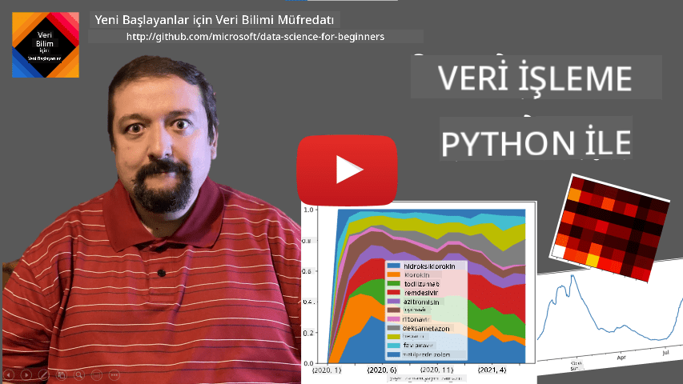
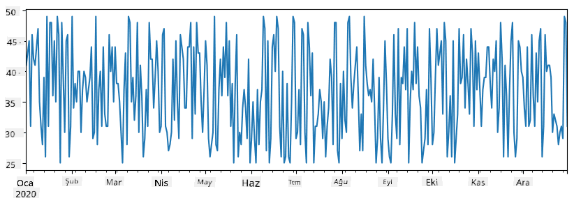
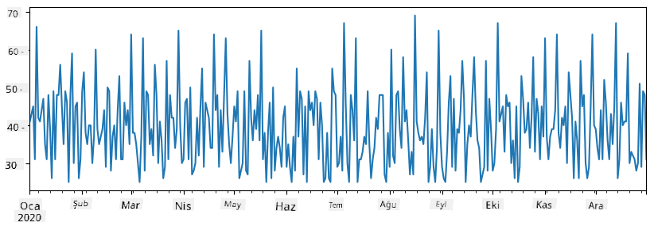
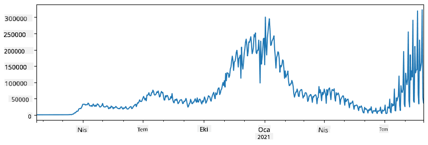
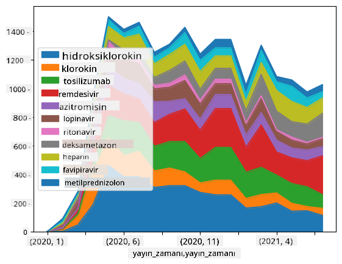

<!--
CO_OP_TRANSLATOR_METADATA:
{
  "original_hash": "116c5d361fbe812e59a73f37ce721d36",
  "translation_date": "2025-08-28T10:49:29+00:00",
  "source_file": "2-Working-With-Data/07-python/README.md",
  "language_code": "tr"
}
-->
# Veriyle Çalışmak: Python ve Pandas Kütüphanesi

|  ](../../sketchnotes/07-WorkWithPython.png) |
| :-------------------------------------------------------------------------------------------------------: |
|                 Python ile Çalışmak - _Sketchnote by [@nitya](https://twitter.com/nitya)_                 |

[](https://youtu.be/dZjWOGbsN4Y)

Veritabanları, verileri depolamak ve sorgulamak için oldukça verimli yollar sunarken, veri işleme konusunda en esnek yöntem, kendi programınızı yazarak veriyi manipüle etmektir. Çoğu durumda, bir veritabanı sorgusu yapmak daha etkili bir yol olabilir. Ancak, daha karmaşık veri işleme gerektiğinde, SQL kullanarak bunu kolayca yapmak mümkün olmayabilir. 
Veri işleme herhangi bir programlama diliyle yapılabilir, ancak bazı diller veriyle çalışmak açısından daha üst seviyedir. Veri bilimciler genellikle aşağıdaki dillerden birini tercih eder:

* **[Python](https://www.python.org/)**, genel amaçlı bir programlama dili olup, basitliği nedeniyle genellikle yeni başlayanlar için en iyi seçeneklerden biri olarak kabul edilir. Python, ZIP arşivinden veri çıkarmak veya bir resmi gri tonlamaya dönüştürmek gibi birçok pratik problemi çözmenize yardımcı olabilecek ek kütüphanelere sahiptir. Python, veri biliminin yanı sıra web geliştirme için de sıkça kullanılır.
* **[R](https://www.r-project.org/)**, istatistiksel veri işleme amacıyla geliştirilmiş geleneksel bir araçtır. Büyük bir kütüphane deposu (CRAN) içerir ve veri işleme için iyi bir seçimdir. Ancak, R genel amaçlı bir programlama dili değildir ve veri bilimi alanı dışında nadiren kullanılır.
* **[Julia](https://julialang.org/)**, özellikle veri bilimi için geliştirilmiş bir başka dildir. Python'dan daha iyi performans sunmayı amaçlar ve bilimsel deneyler için harika bir araçtır.

Bu derste, basit veri işleme için Python kullanmaya odaklanacağız. Dil hakkında temel bir aşinalık varsayacağız. Python hakkında daha derinlemesine bilgi almak isterseniz, aşağıdaki kaynaklara göz atabilirsiniz:

* [Learn Python in a Fun Way with Turtle Graphics and Fractals](https://github.com/shwars/pycourse) - Python Programlama için GitHub tabanlı hızlı giriş kursu
* [Take your First Steps with Python](https://docs.microsoft.com/en-us/learn/paths/python-first-steps/?WT.mc_id=academic-77958-bethanycheum) [Microsoft Learn](http://learn.microsoft.com/?WT.mc_id=academic-77958-bethanycheum) üzerinde öğrenme yolu

Veriler birçok farklı biçimde olabilir. Bu derste, üç veri biçimini ele alacağız - **tablo verisi**, **metin** ve **görseller**.

Tüm ilgili kütüphanelerin tam bir genel görünümünü vermek yerine, birkaç veri işleme örneğine odaklanacağız. Bu, size mümkün olanın ana fikrini verecek ve ihtiyaç duyduğunuzda problemlerinize çözüm bulabileceğiniz yerleri anlamanızı sağlayacaktır.

> **En faydalı tavsiye**. Bilmediğiniz bir veri işlemi gerçekleştirmek istediğinizde, internetten arama yapmayı deneyin. [Stackoverflow](https://stackoverflow.com/) genellikle birçok tipik görev için Python'da faydalı kod örnekleri içerir.

## [Ders Öncesi Test](https://purple-hill-04aebfb03.1.azurestaticapps.net/quiz/12)

## Tablo Verisi ve DataFrame'ler

Tablo verisiyle daha önce ilişkisel veritabanları hakkında konuşurken tanıştınız. Çok fazla veri olduğunda ve bu veriler birçok farklı bağlantılı tabloda yer aldığında, SQL kullanmak kesinlikle mantıklıdır. Ancak, elimizde bir veri tablosu olduğunda ve bu veri hakkında **anlayış** veya **içgörüler** elde etmek istediğimizde, örneğin dağılım, değerler arasındaki korelasyon gibi, SQL kullanmak her zaman yeterli olmayabilir. Veri biliminde, orijinal verinin bazı dönüşümlerini gerçekleştirmek ve ardından görselleştirme yapmak gerektiği birçok durum vardır. Bu adımların her ikisi de Python kullanılarak kolayca yapılabilir.

Python'da tablo verisiyle çalışmanıza yardımcı olabilecek en kullanışlı iki kütüphane şunlardır:
* **[Pandas](https://pandas.pydata.org/)**, **DataFrame** adı verilen yapıları manipüle etmenize olanak tanır. DataFrame'ler ilişkisel tablolara benzer. Adlandırılmış sütunlara sahip olabilir ve satır, sütun ve genel olarak DataFrame'ler üzerinde çeşitli işlemler gerçekleştirebilirsiniz.
* **[Numpy](https://numpy.org/)**, **tensor** yani çok boyutlu **array**'lerle çalışmak için bir kütüphanedir. Array'ler aynı temel türde değerlere sahiptir ve DataFrame'lerden daha basittir, ancak daha fazla matematiksel işlem sunar ve daha az yük oluşturur.

Bilmeniz gereken birkaç başka kütüphane de vardır:
* **[Matplotlib](https://matplotlib.org/)**, veri görselleştirme ve grafik çizimi için kullanılan bir kütüphanedir
* **[SciPy](https://www.scipy.org/)**, bazı ek bilimsel fonksiyonlar içeren bir kütüphanedir. Olasılık ve istatistik hakkında konuşurken bu kütüphaneyle zaten karşılaşmıştık.

Python programınızın başında bu kütüphaneleri içe aktarmak için genellikle şu kod parçasını kullanırsınız:
```python
import numpy as np
import pandas as pd
import matplotlib.pyplot as plt
from scipy import ... # you need to specify exact sub-packages that you need
``` 

Pandas birkaç temel kavram etrafında şekillenmiştir.

### Series 

**Series**, bir liste veya numpy array'e benzer bir değerler dizisidir. Ana fark, serilerin ayrıca bir **index**'e sahip olmasıdır ve seriler üzerinde işlem yaparken (örneğin, toplama), indeks dikkate alınır. İndeks, bir liste veya array'den bir seri oluştururken varsayılan olarak kullanılan basit bir tamsayı satır numarası kadar basit olabilir veya tarih aralığı gibi karmaşık bir yapıya sahip olabilir.

> **Not**: Eşlik eden notebook'ta [`notebook.ipynb`](notebook.ipynb) bazı giriş niteliğinde Pandas kodu bulunmaktadır. Burada yalnızca bazı örnekleri özetliyoruz ve tam notebook'u incelemeniz kesinlikle önerilir.

Bir örneği ele alalım: dondurma satışlarımızı analiz etmek istiyoruz. Belirli bir zaman dilimi için satış rakamlarının (her gün satılan ürün sayısı) bir serisini oluşturalım:

```python
start_date = "Jan 1, 2020"
end_date = "Mar 31, 2020"
idx = pd.date_range(start_date,end_date)
print(f"Length of index is {len(idx)}")
items_sold = pd.Series(np.random.randint(25,50,size=len(idx)),index=idx)
items_sold.plot()
```


Şimdi, her hafta arkadaşlarımız için bir parti düzenlediğimizi ve parti için fazladan 10 paket dondurma aldığımızı varsayalım. Bunu göstermek için haftalık olarak indekslenmiş başka bir seri oluşturabiliriz:
```python
additional_items = pd.Series(10,index=pd.date_range(start_date,end_date,freq="W"))
```
İki seriyi topladığımızda toplam sayıyı elde ederiz:
```python
total_items = items_sold.add(additional_items,fill_value=0)
total_items.plot()
```


> **Not**: Basit `total_items+additional_items` sözdizimini kullanmıyoruz. Eğer kullansaydık, sonuçta birçok `NaN` (*Not a Number*) değeri alırdık. Bunun nedeni, `additional_items` serisindeki bazı indeks noktaları için eksik değerler olmasıdır ve `NaN` ile herhangi bir şeyi toplamak `NaN` sonucunu verir. Bu nedenle toplama sırasında `fill_value` parametresini belirtmemiz gerekir.

Zaman serileriyle, farklı zaman aralıklarıyla seriyi yeniden örnekleyebiliriz. Örneğin, aylık ortalama satış hacmini hesaplamak istediğimizi varsayalım. Aşağıdaki kodu kullanabiliriz:
```python
monthly = total_items.resample("1M").mean()
ax = monthly.plot(kind='bar')
```


### DataFrame

Bir DataFrame, aynı indekse sahip bir dizi serinin koleksiyonudur. Birkaç seriyi bir araya getirerek bir DataFrame oluşturabiliriz:
```python
a = pd.Series(range(1,10))
b = pd.Series(["I","like","to","play","games","and","will","not","change"],index=range(0,9))
df = pd.DataFrame([a,b])
```
Bu, aşağıdaki gibi yatay bir tablo oluşturacaktır:
|     | 0   | 1    | 2   | 3   | 4      | 5   | 6      | 7    | 8    |
| --- | --- | ---- | --- | --- | ------ | --- | ------ | ---- | ---- |
| 0   | 1   | 2    | 3   | 4   | 5      | 6   | 7      | 8    | 9    |
| 1   | I   | like | to  | use | Python | and | Pandas | very | much |

Serileri sütun olarak kullanabilir ve sütun adlarını sözlük kullanarak belirtebiliriz:
```python
df = pd.DataFrame({ 'A' : a, 'B' : b })
```
Bu bize aşağıdaki gibi bir tablo verecektir:

|     | A   | B      |
| --- | --- | ------ |
| 0   | 1   | I      |
| 1   | 2   | like   |
| 2   | 3   | to     |
| 3   | 4   | use    |
| 4   | 5   | Python |
| 5   | 6   | and    |
| 6   | 7   | Pandas |
| 7   | 8   | very   |
| 8   | 9   | much   |

**Not**: Önceki tabloyu transpoze ederek de bu tablo düzenini elde edebiliriz, örneğin 
```python
df = pd.DataFrame([a,b]).T..rename(columns={ 0 : 'A', 1 : 'B' })
```
Burada `.T`, DataFrame'i transpoze etme işlemini, yani satırları ve sütunları değiştirme işlemini ifade eder ve `rename` işlemi, sütun adlarını önceki örneğe uyacak şekilde yeniden adlandırmamıza olanak tanır.

DataFrame'ler üzerinde gerçekleştirebileceğimiz en önemli işlemlerden bazıları şunlardır:

**Sütun seçimi**. Bireysel sütunları `df['A']` yazarak seçebiliriz - bu işlem bir Seri döndürür. Ayrıca, başka bir DataFrame'e alt bir sütun kümesi seçmek için `df[['B','A']]` yazabiliriz - bu başka bir DataFrame döndürür.

**Belirli satırları filtreleme**. Örneğin, yalnızca `A` sütunu 5'ten büyük olan satırları bırakmak için `df[df['A']>5]` yazabiliriz.

> **Not**: Filtreleme şu şekilde çalışır. `df['A']<5` ifadesi, orijinal serinin her bir öğesi için ifadenin `True` veya `False` olduğunu belirten bir boolean serisi döndürür. Boolean serisi indeks olarak kullanıldığında, DataFrame'deki satırların bir alt kümesini döndürür. Bu nedenle, rastgele Python boolean ifadelerini kullanmak mümkün değildir, örneğin `df[df['A']>5 and df['A']<7]` yazmak yanlış olur. Bunun yerine, boolean seriler üzerinde özel `&` işlemini kullanarak `df[(df['A']>5) & (df['A']<7)]` yazmalısınız (*parantezler burada önemlidir*).

**Yeni hesaplanabilir sütunlar oluşturma**. DataFrame'imiz için yeni hesaplanabilir sütunlar oluşturmak, aşağıdaki gibi sezgisel ifadeler kullanarak kolaydır:
```python
df['DivA'] = df['A']-df['A'].mean() 
``` 
Bu örnek, A'nın ortalama değerinden sapmasını hesaplar. Burada aslında bir seri hesaplıyoruz ve ardından bu seriyi sol taraftaki sütuna atayarak yeni bir sütun oluşturuyoruz. Bu nedenle, serilerle uyumlu olmayan işlemleri kullanamayız, örneğin aşağıdaki kod yanlıştır:
```python
# Wrong code -> df['ADescr'] = "Low" if df['A'] < 5 else "Hi"
df['LenB'] = len(df['B']) # <- Wrong result
``` 
Son örnek, sözdizimsel olarak doğru olsa da, yanlış bir sonuç verir çünkü serinin `B` uzunluğunu sütundaki tüm değerlere atar, bireysel öğelerin uzunluğunu değil.

Bu tür karmaşık ifadeleri hesaplamamız gerektiğinde, `apply` fonksiyonunu kullanabiliriz. Son örnek şu şekilde yazılabilir:
```python
df['LenB'] = df['B'].apply(lambda x : len(x))
# or 
df['LenB'] = df['B'].apply(len)
```

Yukarıdaki işlemlerden sonra, aşağıdaki DataFrame'e sahip olacağız:

|     | A   | B      | DivA | LenB |
| --- | --- | ------ | ---- | ---- |
| 0   | 1   | I      | -4.0 | 1    |
| 1   | 2   | like   | -3.0 | 4    |
| 2   | 3   | to     | -2.0 | 2    |
| 3   | 4   | use    | -1.0 | 3    |
| 4   | 5   | Python | 0.0  | 6    |
| 5   | 6   | and    | 1.0  | 3    |
| 6   | 7   | Pandas | 2.0  | 6    |
| 7   | 8   | very   | 3.0  | 4    |
| 8   | 9   | much   | 4.0  | 4    |

**Satırları numaralara göre seçmek** `iloc` yapısını kullanarak yapılabilir. Örneğin, DataFrame'den ilk 5 satırı seçmek için:
```python
df.iloc[:5]
```

**Gruplama**, genellikle Excel'deki *pivot tablolar* benzeri bir sonuç elde etmek için kullanılır. Örneğin, `LenB`'nin her bir değeri için `A` sütununun ortalama değerini hesaplamak istediğimizi varsayalım. DataFrame'i `LenB`'ye göre gruplandırabilir ve `mean` çağırabiliriz:
```python
df.groupby(by='LenB').mean()
```
Eğer gruptaki öğelerin ortalamasını ve sayısını hesaplamamız gerekiyorsa, daha karmaşık bir `aggregate` fonksiyonu kullanabiliriz:
```python
df.groupby(by='LenB') \
 .aggregate({ 'DivA' : len, 'A' : lambda x: x.mean() }) \
 .rename(columns={ 'DivA' : 'Count', 'A' : 'Mean'})
```
Bu bize aşağıdaki tabloyu verir:

| LenB | Count | Mean     |
| ---- | ----- | -------- |
| 1    | 1     | 1.000000 |
| 2    | 1     | 3.000000 |
| 3    | 2     | 5.000000 |
| 4    | 3     | 6.333333 |
| 6    | 2     | 6.000000 |

### Veri Alma
Python nesnelerinden Series ve DataFrame oluşturmanın ne kadar kolay olduğunu gördük. Ancak, veriler genellikle bir metin dosyası veya bir Excel tablosu şeklinde gelir. Neyse ki, Pandas bize diskten veri yüklemek için basit bir yol sunar. Örneğin, bir CSV dosyasını okumak şu kadar basittir:
```python
df = pd.read_csv('file.csv')
```
"Challenge" bölümünde, dış web sitelerinden veri çekmek de dahil olmak üzere, veri yükleme ile ilgili daha fazla örnek göreceğiz.

### Yazdırma ve Görselleştirme

Bir Veri Bilimcisi genellikle veriyi keşfetmek zorundadır, bu yüzden veriyi görselleştirebilmek önemlidir. DataFrame büyük olduğunda, çoğu zaman her şeyin doğru yapıldığından emin olmak için sadece ilk birkaç satırı yazdırmak isteriz. Bu, `df.head()` çağrılarak yapılabilir. Eğer bunu Jupyter Notebook'ta çalıştırıyorsanız, DataFrame'i güzel bir tablo formunda yazdıracaktır.

Ayrıca bazı sütunları görselleştirmek için `plot` fonksiyonunun kullanımını da gördük. `plot` birçok görev için çok kullanışlıdır ve `kind=` parametresi aracılığıyla birçok farklı grafik türünü destekler. Ancak, daha karmaşık bir şey çizmek için her zaman ham `matplotlib` kütüphanesini kullanabilirsiniz. Veri görselleştirmeyi ayrı derslerde detaylı olarak ele alacağız.

Bu genel bakış, Pandas'ın en önemli kavramlarını kapsar, ancak kütüphane oldukça zengindir ve onunla yapabileceklerinizin sınırı yoktur! Şimdi bu bilgiyi belirli bir problemi çözmek için uygulayalım.

## 🚀 Challenge 1: COVID Yayılımını Analiz Etmek

Odaklanacağımız ilk problem, COVID-19'un salgın yayılımını modellemek olacak. Bunu yapmak için, [Johns Hopkins Üniversitesi](https://jhu.edu/) [Sistem Bilimi ve Mühendisliği Merkezi](https://systems.jhu.edu/) (CSSE) tarafından sağlanan, farklı ülkelerdeki enfekte bireylerin sayısına ilişkin verileri kullanacağız. Veri seti [bu GitHub deposunda](https://github.com/CSSEGISandData/COVID-19) mevcuttur.

Verilerle nasıl başa çıkılacağını göstermek istediğimiz için, [`notebook-covidspread.ipynb`](notebook-covidspread.ipynb) dosyasını açmanızı ve baştan sona okumanızı öneririz. Ayrıca hücreleri çalıştırabilir ve sonunda sizin için bıraktığımız bazı zorlukları deneyebilirsiniz.



> Jupyter Notebook'ta kod çalıştırmayı bilmiyorsanız, [bu makaleye](https://soshnikov.com/education/how-to-execute-notebooks-from-github/) göz atabilirsiniz.

## Yapılandırılmamış Verilerle Çalışmak

Veriler genellikle tablo formunda gelse de, bazı durumlarda daha az yapılandırılmış verilerle, örneğin metin veya görüntülerle çalışmamız gerekebilir. Bu durumda, yukarıda gördüğümüz veri işleme tekniklerini uygulamak için bir şekilde yapılandırılmış veriler **çıkarmamız** gerekir. İşte birkaç örnek:

* Metinden anahtar kelimeleri çıkarmak ve bu anahtar kelimelerin ne sıklıkta göründüğünü görmek
* Görüntüdeki nesneler hakkında bilgi çıkarmak için sinir ağlarını kullanmak
* Video kamera akışındaki insanların duyguları hakkında bilgi almak

## 🚀 Challenge 2: COVID Makalelerini Analiz Etmek

Bu zorlukta, COVID pandemisi konusuna devam edeceğiz ve konuyla ilgili bilimsel makaleleri işlemeye odaklanacağız. [CORD-19 Veri Seti](https://www.kaggle.com/allen-institute-for-ai/CORD-19-research-challenge), meta veriler ve özetlerle birlikte (ve yaklaşık yarısı için tam metin de sağlanmış) 7000'den fazla (yazım sırasında) COVID makalesi içermektedir.

Bu veri setini kullanarak [Text Analytics for Health](https://docs.microsoft.com/azure/cognitive-services/text-analytics/how-tos/text-analytics-for-health/?WT.mc_id=academic-77958-bethanycheum) bilişsel hizmetini kullanarak bir analiz yapmanın tam bir örneği [bu blog yazısında](https://soshnikov.com/science/analyzing-medical-papers-with-azure-and-text-analytics-for-health/) açıklanmıştır. Bu analizin basitleştirilmiş bir versiyonunu tartışacağız.

> **NOT**: Bu depo kapsamında veri setinin bir kopyasını sağlamıyoruz. Öncelikle [Kaggle'daki bu veri setinden](https://www.kaggle.com/allen-institute-for-ai/CORD-19-research-challenge?select=metadata.csv) [`metadata.csv`](https://www.kaggle.com/allen-institute-for-ai/CORD-19-research-challenge?select=metadata.csv) dosyasını indirmeniz gerekebilir. Kaggle'a kayıt olmanız gerekebilir. Ayrıca, veri setini [buradan](https://ai2-semanticscholar-cord-19.s3-us-west-2.amazonaws.com/historical_releases.html) kayıt olmadan indirebilirsiniz, ancak bu, meta veri dosyasına ek olarak tüm tam metinleri içerecektir.

[`notebook-papers.ipynb`](notebook-papers.ipynb) dosyasını açın ve baştan sona okuyun. Ayrıca hücreleri çalıştırabilir ve sonunda sizin için bıraktığımız bazı zorlukları deneyebilirsiniz.



## Görüntü Verilerini İşlemek

Son zamanlarda, görüntüleri anlamamızı sağlayan çok güçlü yapay zeka modelleri geliştirilmiştir. Önceden eğitilmiş sinir ağları veya bulut hizmetleri kullanılarak çözülebilecek birçok görev vardır. Bazı örnekler şunlardır:

* **Görüntü Sınıflandırma**, görüntüyü önceden tanımlanmış sınıflardan birine kategorize etmenize yardımcı olabilir. [Custom Vision](https://azure.microsoft.com/services/cognitive-services/custom-vision-service/?WT.mc_id=academic-77958-bethanycheum) gibi hizmetleri kullanarak kendi görüntü sınıflandırıcılarınızı kolayca eğitebilirsiniz.
* **Nesne Tespiti**, görüntüdeki farklı nesneleri tespit etmek için kullanılabilir. [Computer Vision](https://azure.microsoft.com/services/cognitive-services/computer-vision/?WT.mc_id=academic-77958-bethanycheum) gibi hizmetler birçok yaygın nesneyi tespit edebilir ve [Custom Vision](https://azure.microsoft.com/services/cognitive-services/custom-vision-service/?WT.mc_id=academic-77958-bethanycheum) modeli, ilgi çekici bazı özel nesneleri tespit etmek için eğitilebilir.
* **Yüz Tespiti**, yaş, cinsiyet ve duygu tespiti dahil. Bu, [Face API](https://azure.microsoft.com/services/cognitive-services/face/?WT.mc_id=academic-77958-bethanycheum) aracılığıyla yapılabilir.

Tüm bu bulut hizmetleri [Python SDK'ları](https://docs.microsoft.com/samples/azure-samples/cognitive-services-python-sdk-samples/cognitive-services-python-sdk-samples/?WT.mc_id=academic-77958-bethanycheum) kullanılarak çağrılabilir ve bu nedenle veri keşif iş akışınıza kolayca entegre edilebilir.

İşte Görüntü veri kaynaklarından veri keşfetmeye dair bazı örnekler:
* [Kodlama Yapmadan Veri Bilimi Nasıl Öğrenilir](https://soshnikov.com/azure/how-to-learn-data-science-without-coding/) blog yazısında, Instagram fotoğraflarını keşfederek, bir fotoğrafın daha fazla beğeni almasını sağlayan unsurları anlamaya çalışıyoruz. Önce [computer vision](https://azure.microsoft.com/services/cognitive-services/computer-vision/?WT.mc_id=academic-77958-bethanycheum) kullanarak fotoğraflardan mümkün olduğunca fazla bilgi çıkarıyoruz ve ardından [Azure Machine Learning AutoML](https://docs.microsoft.com/azure/machine-learning/concept-automated-ml/?WT.mc_id=academic-77958-bethanycheum) kullanarak yorumlanabilir bir model oluşturuyoruz.
* [Facial Studies Workshop](https://github.com/CloudAdvocacy/FaceStudies) çalışmasında, etkinliklerden alınan fotoğraflardaki insanların duygularını çıkarmak için [Face API](https://azure.microsoft.com/services/cognitive-services/face/?WT.mc_id=academic-77958-bethanycheum) kullanıyoruz ve insanları neyin mutlu ettiğini anlamaya çalışıyoruz.

## Sonuç

Yapılandırılmış veya yapılandırılmamış verileriniz olsun, Python kullanarak veri işleme ve anlama ile ilgili tüm adımları gerçekleştirebilirsiniz. Muhtemelen veri işleme için en esnek yöntemdir ve bu nedenle veri bilimcilerinin çoğu Python'u birincil araçları olarak kullanır. Veri bilimi yolculuğunuzda ciddiyseniz, Python'u derinlemesine öğrenmek muhtemelen iyi bir fikirdir!

## [Ders sonrası sınav](https://purple-hill-04aebfb03.1.azurestaticapps.net/quiz/13)

## Gözden Geçirme ve Kendi Kendine Çalışma

**Kitaplar**
* [Wes McKinney. Python for Data Analysis: Data Wrangling with Pandas, NumPy, and IPython](https://www.amazon.com/gp/product/1491957662)

**Çevrimiçi Kaynaklar**
* Resmi [10 dakikada Pandas](https://pandas.pydata.org/pandas-docs/stable/user_guide/10min.html) eğitimi
* [Pandas Görselleştirme Belgeleri](https://pandas.pydata.org/pandas-docs/stable/user_guide/visualization.html)

**Python Öğrenmek**
* [Turtle Graphics ve Fraktallar ile Eğlenceli Bir Şekilde Python Öğrenin](https://github.com/shwars/pycourse)
* [Python ile İlk Adımlarınızı Atın](https://docs.microsoft.com/learn/paths/python-first-steps/?WT.mc_id=academic-77958-bethanycheum) [Microsoft Learn](http://learn.microsoft.com/?WT.mc_id=academic-77958-bethanycheum) üzerinde Öğrenme Yolu

## Ödev

[Yukarıdaki zorluklar için daha ayrıntılı bir veri çalışması yapın](assignment.md)

## Katkılar

Bu ders [Dmitry Soshnikov](http://soshnikov.com) tarafından ♥️ ile yazılmıştır.

---

**Feragatname**:  
Bu belge, [Co-op Translator](https://github.com/Azure/co-op-translator) adlı yapay zeka çeviri hizmeti kullanılarak çevrilmiştir. Doğruluk için çaba göstersek de, otomatik çevirilerin hata veya yanlışlıklar içerebileceğini lütfen unutmayın. Belgenin orijinal dili, yetkili kaynak olarak kabul edilmelidir. Kritik bilgiler için profesyonel insan çevirisi önerilir. Bu çevirinin kullanımından kaynaklanan yanlış anlamalar veya yanlış yorumlamalar için sorumluluk kabul etmiyoruz.