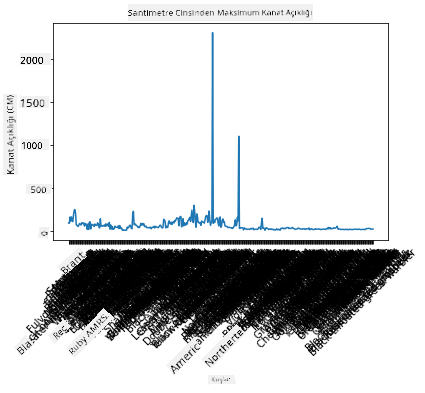
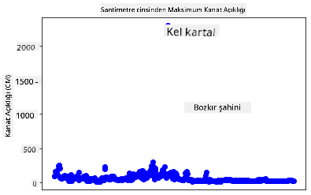
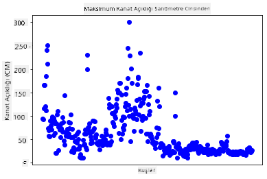
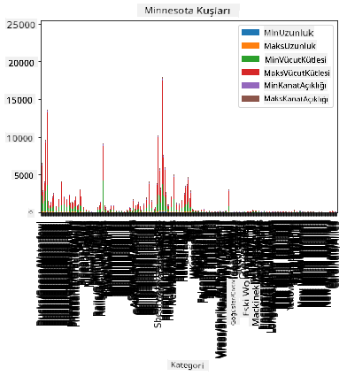
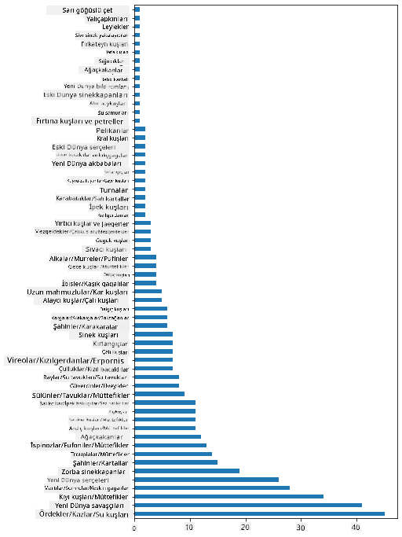
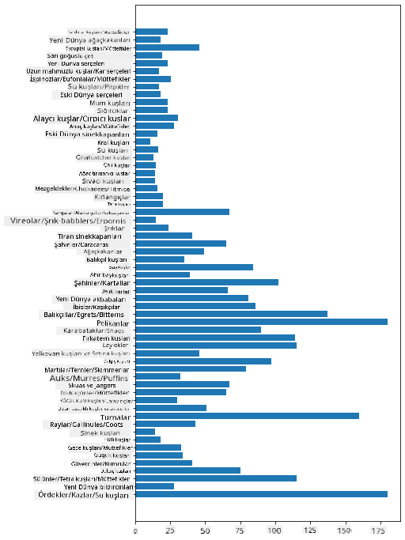
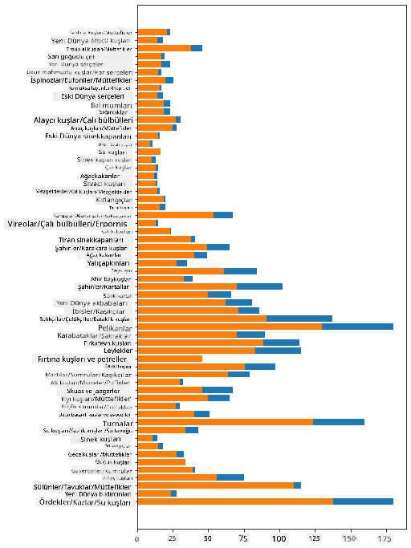

<!--
CO_OP_TRANSLATOR_METADATA:
{
  "original_hash": "43c402d9d90ae6da55d004519ada5033",
  "translation_date": "2025-08-28T11:12:27+00:00",
  "source_file": "3-Data-Visualization/09-visualization-quantities/README.md",
  "language_code": "tr"
}
-->
# Miktarları Görselleştirme

| ](../../sketchnotes/09-Visualizing-Quantities.png)|
|:---:|
| Miktarları Görselleştirme - _Sketchnote by [@nitya](https://twitter.com/nitya)_ |

Bu derste, miktar kavramı etrafında ilginç görselleştirmeler oluşturmayı öğrenmek için mevcut birçok Python kütüphanesinden birini nasıl kullanacağınızı keşfedeceksiniz. Minnesota kuşları hakkında temizlenmiş bir veri seti kullanarak, yerel vahşi yaşam hakkında birçok ilginç bilgi edinebilirsiniz.  
## [Ders Öncesi Test](https://purple-hill-04aebfb03.1.azurestaticapps.net/quiz/16)

## Matplotlib ile kanat açıklığını gözlemleyin

Hem basit hem de karmaşık grafikler ve çeşitli türlerde çizimler oluşturmak için mükemmel bir kütüphane olan [Matplotlib](https://matplotlib.org/stable/index.html) ile tanışın. Genel olarak, bu kütüphaneleri kullanarak veri görselleştirme süreci, hedeflemek istediğiniz veri çerçevesi bölümlerini belirlemeyi, gerekli dönüşümleri yapmayı, x ve y ekseni değerlerini atamayı, hangi tür grafiği göstereceğinize karar vermeyi ve ardından grafiği göstermeyi içerir. Matplotlib çok çeşitli görselleştirmeler sunar, ancak bu derste miktarları görselleştirmek için en uygun olanlara odaklanacağız: çizgi grafikleri, dağılım grafikleri ve çubuk grafikleri.

> ✅ Verinizin yapısına ve anlatmak istediğiniz hikayeye en uygun grafiği kullanın.  
> - Zaman içindeki eğilimleri analiz etmek için: çizgi  
> - Değerleri karşılaştırmak için: çubuk, sütun, pasta, dağılım grafiği  
> - Parçaların bütüne nasıl bağlandığını göstermek için: pasta  
> - Verinin dağılımını göstermek için: dağılım grafiği, çubuk  
> - Eğilimleri göstermek için: çizgi, sütun  
> - Değerler arasındaki ilişkileri göstermek için: çizgi, dağılım grafiği, baloncuk  

Bir veri setiniz varsa ve belirli bir öğeden ne kadar bulunduğunu keşfetmeniz gerekiyorsa, ilk yapmanız gerekenlerden biri değerlerini incelemektir.

✅ Matplotlib için çok iyi 'kopya kağıtları' [burada](https://matplotlib.org/cheatsheets/cheatsheets.pdf) mevcuttur.

## Kuşların kanat açıklığı değerleriyle bir çizgi grafiği oluşturun

Bu ders klasörünün kökündeki `notebook.ipynb` dosyasını açın ve bir hücre ekleyin.

> Not: Veriler bu depo kökünde `/data` klasöründe saklanmaktadır.

```python
import pandas as pd
import matplotlib.pyplot as plt
birds = pd.read_csv('../../data/birds.csv')
birds.head()
```  
Bu veri, metin ve sayılardan oluşan bir karışımdır:

|      | İsim                          | BilimselAd             | Kategori              | Takım         | Aile      | Cins        | KorumaDurumu         | MinUzunluk | MaxUzunluk | MinVücutKütlesi | MaxVücutKütlesi | MinKanatAçıklığı | MaxKanatAçıklığı |
| ---: | :---------------------------- | :--------------------- | :-------------------- | :------------ | :-------- | :---------- | :------------------- | ----------: | ----------: | --------------: | --------------: | ---------------: | ---------------: |
|    0 | Kara karınlı ıslık ördeği     | Dendrocygna autumnalis | Ördekler/Kazlar/Su Kuşları | Anseriformes | Anatidae | Dendrocygna | LC                   |        47   |        56   |           652   |          1020   |              76  |              94  |
|    1 | Sarımsı ıslık ördeği          | Dendrocygna bicolor    | Ördekler/Kazlar/Su Kuşları | Anseriformes | Anatidae | Dendrocygna | LC                   |        45   |        53   |           712   |          1050   |              85  |              93  |
|    2 | Kar kazı                      | Anser caerulescens     | Ördekler/Kazlar/Su Kuşları | Anseriformes | Anatidae | Anser       | LC                   |        64   |        79   |          2050   |          4050   |             135  |             165  |
|    3 | Ross'un kazı                  | Anser rossii           | Ördekler/Kazlar/Su Kuşları | Anseriformes | Anatidae | Anser       | LC                   |      57.3   |        64   |          1066   |          1567   |             113  |             116  |
|    4 | Büyük beyaz alınlı kaz        | Anser albifrons        | Ördekler/Kazlar/Su Kuşları | Anseriformes | Anatidae | Anser       | LC                   |        64   |        81   |          1930   |          3310   |             130  |             165  |

Bu ilginç kuşlar için maksimum kanat açıklığını görmek istediğinizi varsayalım. Bazı sayısal verileri temel bir çizgi grafiği kullanarak çizelim.

```python
wingspan = birds['MaxWingspan'] 
wingspan.plot()
```  


Hemen ne fark ediyorsunuz? En az bir aykırı değer var gibi görünüyor - bu oldukça büyük bir kanat açıklığı! 2300 santimetrelik bir kanat açıklığı 23 metreye eşittir - Minnesota'da Pterodaktiller mi dolaşıyor? Hadi bunu araştıralım.

Bu aykırı değerleri bulmak için Excel'de hızlı bir sıralama yapabilirsiniz, ancak görselleştirme sürecine grafikten çalışarak devam edin.

X eksenine hangi tür kuşların olduğunu göstermek için etiketler ekleyin:

```
plt.title('Max Wingspan in Centimeters')
plt.ylabel('Wingspan (CM)')
plt.xlabel('Birds')
plt.xticks(rotation=45)
x = birds['Name'] 
y = birds['MaxWingspan']

plt.plot(x, y)

plt.show()
```  


Etiketlerin 45 derece döndürülmesine rağmen, okunamayacak kadar çok var. Farklı bir strateji deneyelim: yalnızca bu aykırı değerleri etiketleyin ve etiketleri grafiğin içine yerleştirin. Daha fazla etiketleme alanı yaratmak için bir dağılım grafiği kullanabilirsiniz:

```python
plt.title('Max Wingspan in Centimeters')
plt.ylabel('Wingspan (CM)')
plt.tick_params(axis='both',which='both',labelbottom=False,bottom=False)

for i in range(len(birds)):
    x = birds['Name'][i]
    y = birds['MaxWingspan'][i]
    plt.plot(x, y, 'bo')
    if birds['MaxWingspan'][i] > 500:
        plt.text(x, y * (1 - 0.05), birds['Name'][i], fontsize=12)
    
plt.show()
```  
Burada ne oluyor? `tick_params` kullanarak alt etiketleri gizlediniz ve ardından kuş veri setiniz üzerinde bir döngü oluşturdunuz. Küçük yuvarlak mavi noktalarla (`bo`) grafiği çizerken, maksimum kanat açıklığı 500'ün üzerinde olan herhangi bir kuşu kontrol ettiniz ve öyleyse, noktanın yanına etiket olarak kuşun adını eklediniz. Etiketleri y ekseninde biraz kaydırdınız (`y * (1 - 0.05)`) ve kuş adını etiket olarak kullandınız.

Ne keşfettiniz?

  
## Verilerinizi filtreleyin

Hem Kel Kartal hem de Bozkır Şahini, muhtemelen çok büyük kuşlar olsalar da, maksimum kanat açıklıklarına fazladan bir `0` eklenmiş gibi görünüyor. 25 metrelik bir kanat açıklığına sahip bir Kel Kartal ile karşılaşırsanız, lütfen bize bildirin! Hadi bu iki aykırı değeri içermeyen yeni bir veri çerçevesi oluşturalım:

```python
plt.title('Max Wingspan in Centimeters')
plt.ylabel('Wingspan (CM)')
plt.xlabel('Birds')
plt.tick_params(axis='both',which='both',labelbottom=False,bottom=False)
for i in range(len(birds)):
    x = birds['Name'][i]
    y = birds['MaxWingspan'][i]
    if birds['Name'][i] not in ['Bald eagle', 'Prairie falcon']:
        plt.plot(x, y, 'bo')
plt.show()
```  

Aykırı değerleri filtreleyerek, verileriniz artık daha tutarlı ve anlaşılır hale geldi.



Artık en azından kanat açıklığı açısından daha temiz bir veri setine sahibiz, hadi bu kuşlar hakkında daha fazla şey keşfedelim.

Çizgi ve dağılım grafikleri, veri değerleri ve dağılımları hakkında bilgi gösterebilir, ancak bu veri setinde yer alan değerler hakkında düşünmek istiyoruz. Miktarlarla ilgili şu soruları yanıtlamak için görselleştirmeler oluşturabilirsiniz:

> Kaç kuş kategorisi var ve bunların sayıları nedir?  
> Kaç kuş nesli tükenmiş, tehlikede, nadir veya yaygın?  
> Linnaeus'un terminolojisine göre çeşitli cins ve takımlardan kaç tane var?  
## Çubuk grafiklerini keşfedin

Çubuk grafikleri, verilerin gruplandırmalarını göstermeniz gerektiğinde pratiktir. Bu veri setinde hangi kuş kategorilerinin en yaygın olduğunu görmek için bir inceleme yapalım.

Notebook dosyasında temel bir çubuk grafiği oluşturun.

✅ Not, önceki bölümde belirlediğimiz iki aykırı kuşu filtreleyebilir, kanat açıklığındaki yazım hatasını düzeltebilir veya bu egzersizler kanat açıklığı değerlerine bağlı olmadığından onları bırakabilirsiniz.

Bir çubuk grafiği oluşturmak istiyorsanız, odaklanmak istediğiniz verileri seçebilirsiniz. Çubuk grafikleri ham verilerden oluşturulabilir:

```python
birds.plot(x='Category',
        kind='bar',
        stacked=True,
        title='Birds of Minnesota')

```  


Ancak bu çubuk grafiği okunamaz çünkü çok fazla gruplandırılmamış veri var. Çizmek istediğiniz verileri seçmeniz gerekiyor, bu yüzden kuşların kategorilerine göre uzunluklarına bakalım.

Verilerinizi yalnızca kuşların kategorisini içerecek şekilde filtreleyin.

✅ Pandas'ı verileri yönetmek için kullanırken, Matplotlib'in grafikleri oluşturmasına izin verdiğinizi unutmayın.

Birçok kategori olduğu için bu grafiği dikey olarak görüntüleyebilir ve tüm verileri hesaba katmak için yüksekliğini ayarlayabilirsiniz:

```python
category_count = birds.value_counts(birds['Category'].values, sort=True)
plt.rcParams['figure.figsize'] = [6, 12]
category_count.plot.barh()
```  


Bu çubuk grafiği, her kategorideki kuş sayısının iyi bir görünümünü sunar. Bir bakışta, bu bölgedeki en büyük kuş sayısının Ördekler/Kazlar/Su Kuşları kategorisinde olduğunu görebilirsiniz. Minnesota '10.000 gölün ülkesi' olduğundan bu şaşırtıcı değil!

✅ Bu veri setinde başka sayımlar deneyin. Sizi şaşırtan bir şey var mı?

## Verileri karşılaştırma

Yeni eksenler oluşturarak gruplandırılmış verilerin farklı karşılaştırmalarını deneyebilirsiniz. Bir kuşun kategorisine göre Maksimum Uzunluğunu karşılaştırmayı deneyin:

```python
maxlength = birds['MaxLength']
plt.barh(y=birds['Category'], width=maxlength)
plt.rcParams['figure.figsize'] = [6, 12]
plt.show()
```  


Burada şaşırtıcı bir şey yok: sinek kuşları, Pelikanlar veya Kazlarla karşılaştırıldığında en az Maksimum Uzunluğa sahiptir. Verilerin mantıklı olması güzel bir şey!

Çubuk grafiklerini daha ilginç hale getirmek için verileri üst üste bindirebilirsiniz. Bir kuş kategorisindeki Minimum ve Maksimum Uzunluğu üst üste bindirelim:

```python
minLength = birds['MinLength']
maxLength = birds['MaxLength']
category = birds['Category']

plt.barh(category, maxLength)
plt.barh(category, minLength)

plt.show()
```  
Bu grafikte, Minimum Uzunluk ve Maksimum Uzunluk aralığını kuş kategorisine göre görebilirsiniz. Bu verilere dayanarak, kuş ne kadar büyükse, uzunluk aralığının o kadar geniş olduğunu güvenle söyleyebilirsiniz. Büyüleyici!



## 🚀 Meydan Okuma

Bu kuş veri seti, belirli bir ekosistemdeki farklı kuş türleri hakkında zengin bilgiler sunar. İnternette araştırma yapın ve başka kuş odaklı veri setleri bulabilir misiniz bir bakın. Bu kuşlar etrafında grafikler ve çizimler oluşturarak farkında olmadığınız gerçekleri keşfetmek için pratik yapın.  
## [Ders Sonrası Test](https://purple-hill-04aebfb03.1.azurestaticapps.net/quiz/17)

## Gözden Geçirme ve Kendi Kendine Çalışma

Bu ilk ders, Matplotlib kullanarak miktarları nasıl görselleştireceğiniz hakkında size bazı bilgiler verdi. Veri görselleştirme için veri setleriyle çalışmanın diğer yolları hakkında araştırma yapın. [Plotly](https://github.com/plotly/plotly.py) bu derslerde ele almayacağımız bir araçtır, bu yüzden neler sunabileceğine bir göz atın.  
## Ödev

[Çizgiler, Dağılımlar ve Çubuklar](assignment.md)

---

**Feragatname**:  
Bu belge, [Co-op Translator](https://github.com/Azure/co-op-translator) adlı yapay zeka çeviri hizmeti kullanılarak çevrilmiştir. Doğruluk için çaba göstersek de, otomatik çevirilerin hata veya yanlışlıklar içerebileceğini lütfen unutmayın. Belgenin orijinal dili, yetkili kaynak olarak kabul edilmelidir. Kritik bilgiler için profesyonel insan çevirisi önerilir. Bu çevirinin kullanımından kaynaklanan herhangi bir yanlış anlama veya yanlış yorumlama durumunda sorumluluk kabul edilmez.