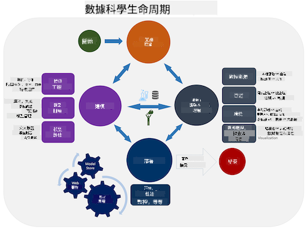

<!--
CO_OP_TRANSLATOR_METADATA:
{
  "original_hash": "c368f8f2506fe56bca0f7be05c4eb71d",
  "translation_date": "2025-08-25T17:41:52+00:00",
  "source_file": "4-Data-Science-Lifecycle/14-Introduction/README.md",
  "language_code": "tw"
}
-->
# 資料科學生命週期簡介

| 繪製的手繪筆記 ](../../sketchnotes/14-DataScience-Lifecycle.png)|
|:---:|
| 資料科學生命週期簡介 - _手繪筆記由 [@nitya](https://twitter.com/nitya) 繪製_ |

## [課前測驗](https://red-water-0103e7a0f.azurestaticapps.net/quiz/26)

到目前為止，你可能已經意識到資料科學是一個過程。這個過程可以分為五個階段：

- 資料收集
- 資料處理
- 資料分析
- 資料溝通
- 資料維護

本課程將重點介紹生命週期中的三個部分：資料收集、資料處理和資料維護。

  
> 圖片來源：[Berkeley School of Information](https://ischoolonline.berkeley.edu/data-science/what-is-data-science/)

## 資料收集

生命週期的第一階段非常重要，因為接下來的階段都依賴於此。這實際上是兩個階段的結合：獲取資料以及定義需要解決的目標和問題。  
定義專案的目標需要對問題或問題有更深入的背景了解。首先，我們需要識別並獲取需要解決問題的對象。這些可能是企業的利益相關者或專案的贊助者，他們可以幫助確定誰或什麼將從這個專案中受益，以及他們需要什麼和為什麼需要它。一個明確定義的目標應該是可衡量且可量化的，以便定義可接受的結果。

資料科學家可能會問的問題：
- 這個問題以前是否被解決過？發現了什麼？
- 所有相關人員是否都理解目標和目的？
- 是否存在模糊性？如何減少模糊性？
- 有哪些限制條件？
- 最終結果可能會是什麼樣子？
- 有多少資源（時間、人員、計算能力）可用？

接下來是識別、收集，最後探索為實現這些目標所需的資料。在這個獲取階段，資料科學家還必須評估資料的數量和質量。這需要一些資料探索，以確認所獲取的資料是否能支持達成預期結果。

資料科學家可能會問的資料相關問題：
- 我已經擁有哪些資料？
- 誰擁有這些資料？
- 有哪些隱私問題？
- 我是否有足夠的資料來解決這個問題？
- 這些資料的質量是否適合解決這個問題？
- 如果通過這些資料發現了額外的信息，我們是否應該考慮更改或重新定義目標？

## 資料處理

生命週期的資料處理階段專注於發現資料中的模式以及建模。在資料處理階段使用的一些技術需要統計方法來揭示模式。對於人類來說，處理大型資料集通常是一項繁瑣的任務，因此需要依賴計算機來加速這一過程。這個階段也是資料科學與機器學習交叉的地方。正如你在第一課中學到的，機器學習是構建模型以理解資料的過程。模型是資料中變數之間關係的表示，有助於預測結果。

本階段常用的技術在《機器學習初學者》課程中有介紹。點擊以下連結了解更多：

- [分類](https://github.com/microsoft/ML-For-Beginners/tree/main/4-Classification)：將資料組織成類別以提高使用效率。
- [分群](https://github.com/microsoft/ML-For-Beginners/tree/main/5-Clustering)：將資料分組為相似的群組。
- [回歸](https://github.com/microsoft/ML-For-Beginners/tree/main/2-Regression)：確定變數之間的關係以預測或預估值。

## 資料維護

在生命週期的圖示中，你可能注意到資料維護位於資料收集和資料處理之間。資料維護是專案過程中持續進行的資料管理、存儲和安全保障過程，應在整個專案中加以考慮。

### 資料存儲

資料存儲的方式和位置會影響存儲成本以及資料訪問的速度。這些決策通常不僅由資料科學家決定，但他們可能需要根據資料的存儲方式來選擇如何處理資料。

以下是現代資料存儲系統的一些影響因素：

**內部存儲 vs 外部存儲 vs 公有雲或私有雲**

內部存儲指的是在自己的設備上管理資料，例如擁有一台伺服器來存儲資料；而外部存儲則依賴於你不擁有的設備，例如資料中心。公有雲是存儲資料的一種流行選擇，無需了解資料的具體存儲方式或位置；公有雲指的是所有使用者共享的統一基礎設施。一些組織有嚴格的安全政策，要求完全訪問存儲資料的設備，因此會依賴於提供專屬雲服務的私有雲。你將在[後續課程](https://github.com/microsoft/Data-Science-For-Beginners/tree/main/5-Data-Science-In-Cloud)中學到更多關於雲端資料的內容。

**冷資料 vs 熱資料**

在訓練模型時，你可能需要更多的訓練資料。如果你對模型感到滿意，仍然會有更多資料到來以支持模型的運行。無論如何，隨著資料的累積，存儲和訪問資料的成本將會增加。將很少使用的資料（稱為冷資料）與經常訪問的資料（稱為熱資料）分開存儲，可能是一種更便宜的存儲選擇，無論是通過硬體還是軟體服務。如果需要訪問冷資料，可能會比熱資料花費更長的時間。

### 資料管理

在處理資料時，你可能會發現需要使用[資料準備](https://github.com/microsoft/Data-Science-For-Beginners/tree/main/2-Working-With-Data/08-data-preparation)課程中介紹的一些技術來清理資料，以構建準確的模型。當新資料到來時，也需要應用相同的技術來保持資料質量的一致性。一些專案會使用自動化工具來進行清理、聚合和壓縮，然後將資料移動到最終位置。Azure Data Factory 就是一個這樣的工具。

### 資料安全

確保資料安全的主要目標之一是確保資料的收集和使用處於控制之中。保持資料安全包括限制只有需要的人才能訪問資料，遵守當地法律和法規，以及維持道德標準，這些內容在[倫理課程](https://github.com/microsoft/Data-Science-For-Beginners/tree/main/1-Introduction/02-ethics)中有介紹。

以下是團隊可能採取的一些安全措施：
- 確保所有資料都已加密
- 向客戶提供有關其資料使用方式的信息
- 移除已離開專案成員的資料訪問權限
- 僅允許特定專案成員更改資料

## 🚀 挑戰

資料科學生命週期有許多不同的版本，每個步驟可能有不同的名稱和階段數量，但都包含本課程中提到的相同過程。

探索 [團隊資料科學過程生命週期](https://docs.microsoft.com/en-us/azure/architecture/data-science-process/lifecycle) 和 [跨行業標準資料挖掘過程](https://www.datascience-pm.com/crisp-dm-2/)。列出兩者的三個相似點和不同點。

|團隊資料科學過程 (TDSP)|跨行業標準資料挖掘過程 (CRISP-DM)|
|--|--|
| |  |
| 圖片來源：[Microsoft](https://docs.microsoft.comazure/architecture/data-science-process/lifecycle) | 圖片來源：[Data Science Process Alliance](https://www.datascience-pm.com/crisp-dm-2/) |

## [課後測驗](https://red-water-0103e7a0f.azurestaticapps.net/quiz/27)

## 回顧與自學

應用資料科學生命週期涉及多種角色和任務，其中一些可能專注於每個階段的特定部分。團隊資料科學過程提供了一些資源，解釋了專案中可能涉及的角色和任務類型。

* [團隊資料科學過程的角色與任務](https://docs.microsoft.com/en-us/azure/architecture/data-science-process/roles-tasks)
* [執行資料科學任務：探索、建模和部署](https://docs.microsoft.com/en-us/azure/architecture/data-science-process/execute-data-science-tasks)

## 作業

[評估一個資料集](assignment.md)

**免責聲明**：  
本文件使用 AI 翻譯服務 [Co-op Translator](https://github.com/Azure/co-op-translator) 進行翻譯。儘管我們努力確保翻譯的準確性，但請注意，自動翻譯可能包含錯誤或不準確之處。原始文件的母語版本應被視為權威來源。對於關鍵信息，建議使用專業人工翻譯。我們對因使用此翻譯而引起的任何誤解或錯誤解釋不承擔責任。