<!--
CO_OP_TRANSLATOR_METADATA:
{
  "original_hash": "14b2a7f1c63202920bd98eeb913f5614",
  "translation_date": "2025-08-27T09:28:43+00:00",
  "source_file": "5-Data-Science-In-Cloud/18-Low-Code/README.md",
  "language_code": "ur"
}
-->
# کلاؤڈ میں ڈیٹا سائنس: "کم کوڈ/بغیر کوڈ" طریقہ

| کی اسکیچ نوٹ ](../../sketchnotes/18-DataScience-Cloud.png)|
|:---:|
| کلاؤڈ میں ڈیٹا سائنس: کم کوڈ - _[@nitya](https://twitter.com/nitya) کی اسکیچ نوٹ_ |

فہرستِ مواد:

- [کلاؤڈ میں ڈیٹا سائنس: "کم کوڈ/بغیر کوڈ" طریقہ](../../../../5-Data-Science-In-Cloud/18-Low-Code)
  - [لیکچر سے پہلے کا کوئز](../../../../5-Data-Science-In-Cloud/18-Low-Code)
  - [1. تعارف](../../../../5-Data-Science-In-Cloud/18-Low-Code)
    - [1.1 Azure Machine Learning کیا ہے؟](../../../../5-Data-Science-In-Cloud/18-Low-Code)
    - [1.2 دل کی ناکامی کی پیشن گوئی کا منصوبہ:](../../../../5-Data-Science-In-Cloud/18-Low-Code)
    - [1.3 دل کی ناکامی کا ڈیٹا سیٹ:](../../../../5-Data-Science-In-Cloud/18-Low-Code)
  - [2. Azure ML Studio میں ماڈل کی کم کوڈ/بغیر کوڈ تربیت](../../../../5-Data-Science-In-Cloud/18-Low-Code)
    - [2.1 Azure ML ورک اسپیس بنائیں](../../../../5-Data-Science-In-Cloud/18-Low-Code)
    - [2.2 کمپیوٹ وسائل](../../../../5-Data-Science-In-Cloud/18-Low-Code)
      - [2.2.1 کمپیوٹ وسائل کے لیے صحیح اختیارات کا انتخاب](../../../../5-Data-Science-In-Cloud/18-Low-Code)
      - [2.2.2 کمپیوٹ کلسٹر بنانا](../../../../5-Data-Science-In-Cloud/18-Low-Code)
    - [2.3 ڈیٹا سیٹ لوڈ کرنا](../../../../5-Data-Science-In-Cloud/18-Low-Code)
    - [2.4 AutoML کے ساتھ کم کوڈ/بغیر کوڈ تربیت](../../../../5-Data-Science-In-Cloud/18-Low-Code)
  - [3. کم کوڈ/بغیر کوڈ ماڈل کی تعیناتی اور اینڈ پوائنٹ کا استعمال](../../../../5-Data-Science-In-Cloud/18-Low-Code)
    - [3.1 ماڈل کی تعیناتی](../../../../5-Data-Science-In-Cloud/18-Low-Code)
    - [3.2 اینڈ پوائنٹ کا استعمال](../../../../5-Data-Science-In-Cloud/18-Low-Code)
  - [🚀 چیلنج](../../../../5-Data-Science-In-Cloud/18-Low-Code)
  - [لیکچر کے بعد کا کوئز](../../../../5-Data-Science-In-Cloud/18-Low-Code)
  - [جائزہ اور خود مطالعہ](../../../../5-Data-Science-In-Cloud/18-Low-Code)
  - [اسائنمنٹ](../../../../5-Data-Science-In-Cloud/18-Low-Code)
  
## [لیکچر سے پہلے کا کوئز](https://purple-hill-04aebfb03.1.azurestaticapps.net/quiz/34)
## 1. تعارف
### 1.1 Azure Machine Learning کیا ہے؟

Azure کلاؤڈ پلیٹ فارم 200 سے زیادہ پروڈکٹس اور کلاؤڈ سروسز پر مشتمل ہے جو آپ کو نئی حل تخلیق کرنے میں مدد فراہم کرتی ہیں۔
ڈیٹا سائنسدان ڈیٹا کو دریافت کرنے، اس کی پروسیسنگ کرنے، اور مختلف قسم کے ماڈل ٹریننگ الگورتھمز آزمانے میں بہت محنت کرتے ہیں تاکہ درست ماڈلز تیار کیے جا سکیں۔ یہ کام وقت طلب ہوتے ہیں اور اکثر مہنگے کمپیوٹ ہارڈویئر کا غیر مؤثر استعمال کرتے ہیں۔

[Azure ML](https://docs.microsoft.com/azure/machine-learning/overview-what-is-azure-machine-learning?WT.mc_id=academic-77958-bethanycheum&ocid=AID3041109) ایک کلاؤڈ پر مبنی پلیٹ فارم ہے جو Azure میں مشین لرننگ کے حل بنانے اور چلانے کے لیے استعمال ہوتا ہے۔ یہ ڈیٹا کی تیاری، ماڈلز کی تربیت، پیش گوئی کی خدمات کی اشاعت، اور ان کے استعمال کی نگرانی کے لیے وسیع خصوصیات اور صلاحیتیں فراہم کرتا ہے۔ سب سے اہم بات یہ ہے کہ یہ ماڈلز کی تربیت سے متعلق وقت طلب کاموں کو خودکار بنا کر ڈیٹا سائنسدانوں کی کارکردگی کو بڑھاتا ہے؛ اور یہ کلاؤڈ پر مبنی کمپیوٹ وسائل کو مؤثر طریقے سے اسکیل کرنے کے قابل بناتا ہے تاکہ بڑے ڈیٹا کے حجم کو سنبھالا جا سکے، اور صرف استعمال کے وقت ہی اخراجات ہوں۔

Azure ML ڈیولپرز اور ڈیٹا سائنسدانوں کو ان کے مشین لرننگ ورک فلو کے لیے تمام ضروری ٹولز فراہم کرتا ہے، جن میں شامل ہیں:

- **Azure Machine Learning Studio**: یہ Azure Machine Learning میں ایک ویب پورٹل ہے جو ماڈل کی تربیت، تعیناتی، خودکاری، ٹریکنگ، اور اثاثہ جات کے انتظام کے لیے کم کوڈ اور بغیر کوڈ کے اختیارات فراہم کرتا ہے۔ اسٹوڈیو Azure Machine Learning SDK کے ساتھ مربوط ہے تاکہ ایک ہموار تجربہ فراہم کیا جا سکے۔
- **Jupyter Notebooks**: مشین لرننگ ماڈلز کو جلدی پروٹوٹائپ اور ٹیسٹ کرنے کے لیے۔
- **Azure Machine Learning Designer**: ماڈیولز کو ڈریگ اینڈ ڈراپ کرنے کی اجازت دیتا ہے تاکہ تجربات بنائے جا سکیں اور پھر کم کوڈ ماحول میں پائپ لائنز تعینات کی جا سکیں۔
- **Automated machine learning UI (AutoML)**: مشین لرننگ ماڈل کی ترقی کے تکراری کاموں کو خودکار بناتا ہے، جس سے بڑے پیمانے پر، مؤثر، اور پیداواری ماڈلز بنائے جا سکتے ہیں، اور ماڈل کے معیار کو برقرار رکھا جا سکتا ہے۔
- **Data Labelling**: ڈیٹا کو خودکار طور پر لیبل کرنے کے لیے ایک معاون مشین لرننگ ٹول۔
- **Machine learning extension for Visual Studio Code**: مشین لرننگ پروجیکٹس بنانے اور ان کا انتظام کرنے کے لیے مکمل خصوصیات والا ترقیاتی ماحول فراہم کرتا ہے۔
- **Machine learning CLI**: کمانڈ لائن سے Azure ML وسائل کا انتظام کرنے کے لیے کمانڈز فراہم کرتا ہے۔
- **اوپن سورس فریم ورک کے ساتھ انضمام** جیسے PyTorch، TensorFlow، Scikit-learn اور دیگر، مشین لرننگ کے عمل کو تربیت دینے، تعینات کرنے، اور انتظام کرنے کے لیے۔
- **MLflow**: یہ مشین لرننگ تجربات کے زندگی کے دورانیے کو منظم کرنے کے لیے ایک اوپن سورس لائبریری ہے۔ **MLFlow Tracking** MLflow کا ایک جزو ہے جو آپ کے تربیتی رن میٹرکس اور ماڈل آرٹفیکٹس کو لاگ اور ٹریک کرتا ہے، چاہے آپ کے تجربے کا ماحول کچھ بھی ہو۔

### 1.2 دل کی ناکامی کی پیشن گوئی کا منصوبہ:

بلا شبہ، منصوبے بنانا اور ان پر کام کرنا اپنی مہارت اور علم کو آزمانے کا بہترین طریقہ ہے۔ اس سبق میں، ہم دل کی ناکامی کے حملوں کی پیشن گوئی کے لیے ایک ڈیٹا سائنس پروجیکٹ بنانے کے دو مختلف طریقے دریافت کریں گے، Azure ML Studio میں کم کوڈ/بغیر کوڈ طریقے سے اور Azure ML SDK کے ذریعے، جیسا کہ درج ذیل اسکیمہ میں دکھایا گیا ہے:


ہر طریقے کے اپنے فوائد اور نقصانات ہیں۔ کم کوڈ/بغیر کوڈ طریقہ شروع کرنے کے لیے آسان ہے کیونکہ اس میں GUI (گرافیکل یوزر انٹرفیس) کے ساتھ تعامل شامل ہے، اور کوڈ کا پیشگی علم ضروری نہیں ہے۔ یہ طریقہ پروجیکٹ کی عملیت کو جلدی جانچنے اور POC (پروف آف کانسیپٹ) بنانے کی اجازت دیتا ہے۔ تاہم، جیسے جیسے پروجیکٹ بڑھتا ہے اور چیزوں کو پروڈکشن کے لیے تیار کرنے کی ضرورت ہوتی ہے، GUI کے ذریعے وسائل بنانا ممکن نہیں ہوتا۔ ہمیں پروگرام کے ذریعے ہر چیز کو خودکار بنانا پڑتا ہے، وسائل کی تخلیق سے لے کر ماڈل کی تعیناتی تک۔ یہی وہ جگہ ہے جہاں Azure ML SDK کا استعمال جاننا ضروری ہو جاتا ہے۔

|                   | کم کوڈ/بغیر کوڈ | Azure ML SDK              |
|-------------------|------------------|---------------------------|
| کوڈ کی مہارت      | ضروری نہیں       | ضروری                    |
| ترقی کا وقت       | تیز اور آسان     | کوڈ کی مہارت پر منحصر     |
| پروڈکشن کے لیے تیار | نہیں             | ہاں                      |

### 1.3 دل کی ناکامی کا ڈیٹا سیٹ: 

دل کی بیماریوں (CVDs) دنیا بھر میں موت کی سب سے بڑی وجہ ہیں، جو عالمی سطح پر تمام اموات کا 31% حصہ بنتی ہیں۔ ماحولیاتی اور رویے کے خطرے کے عوامل جیسے تمباکو کا استعمال، غیر صحت مند غذا اور موٹاپا، جسمانی غیر فعالیت، اور شراب کا نقصان دہ استعمال تخمینی ماڈلز کے لیے خصوصیات کے طور پر استعمال کیے جا سکتے ہیں۔ CVD کے ترقی کے امکان کا اندازہ لگانا خطرے والے افراد میں حملوں کو روکنے کے لیے بہت مفید ہو سکتا ہے۔

Kaggle نے ایک [دل کی ناکامی کا ڈیٹا سیٹ](https://www.kaggle.com/andrewmvd/heart-failure-clinical-data) عوامی طور پر دستیاب کیا ہے، جسے ہم اس پروجیکٹ کے لیے استعمال کریں گے۔ آپ ابھی ڈیٹا سیٹ ڈاؤن لوڈ کر سکتے ہیں۔ یہ ایک ٹیبلر ڈیٹا سیٹ ہے جس میں 13 کالم (12 خصوصیات اور 1 ہدف متغیر) اور 299 قطاریں ہیں۔

|    | متغیر کا نام              | قسم             | وضاحت                                                  | مثال              |
|----|---------------------------|-----------------|-------------------------------------------------------|-------------------|
| 1  | عمر                      | عددی            | مریض کی عمر                                           | 25                |
| 2  | خون کی کمی               | بولین           | خون کے سرخ خلیوں یا ہیموگلوبن کی کمی                 | 0 یا 1            |
| 3  | کریٹینین فاسفوکائنیز     | عددی            | خون میں CPK انزائم کی سطح                             | 542               |
| 4  | ذیابیطس                  | بولین           | اگر مریض کو ذیابیطس ہے                                | 0 یا 1            |
| 5  | ایجیکشن فریکشن          | عددی            | دل کے ہر سکڑاؤ پر خون کے نکلنے کا فیصد               | 45                |
| 6  | ہائی بلڈ پریشر           | بولین           | اگر مریض کو ہائی بلڈ پریشر ہے                         | 0 یا 1            |
| 7  | پلیٹلیٹس                 | عددی            | خون میں پلیٹلیٹس                                     | 149000            |
| 8  | سیرم کریٹینین           | عددی            | خون میں سیرم کریٹینین کی سطح                         | 0.5               |
| 9  | سیرم سوڈیم              | عددی            | خون میں سیرم سوڈیم کی سطح                             | jun               |
| 10 | جنس                     | بولین           | عورت یا مرد                                           | 0 یا 1            |
| 11 | سگریٹ نوشی               | بولین           | اگر مریض سگریٹ نوشی کرتا ہے                          | 0 یا 1            |
| 12 | وقت                     | عددی            | فالو اپ مدت (دن)                                      | 4                 |
|----|---------------------------|-----------------|-------------------------------------------------------|-------------------|
| 21 | DEATH_EVENT [ہدف]        | بولین           | اگر مریض فالو اپ مدت کے دوران فوت ہو جائے             | 0 یا 1            |

ڈیٹا سیٹ حاصل کرنے کے بعد، ہم Azure میں پروجیکٹ شروع کر سکتے ہیں۔

## 2. Azure ML Studio میں ماڈل کی کم کوڈ/بغیر کوڈ تربیت
### 2.1 Azure ML ورک اسپیس بنائیں
Azure ML میں ماڈل کی تربیت کے لیے آپ کو پہلے Azure ML ورک اسپیس بنانا ہوگا۔ ورک اسپیس Azure Machine Learning کے لیے اعلیٰ سطحی وسائل ہے، جو آپ کے بنائے گئے تمام آرٹفیکٹس کے ساتھ کام کرنے کے لیے ایک مرکزی جگہ فراہم کرتا ہے۔ ورک اسپیس تربیتی رنز کی تاریخ رکھتا ہے، جس میں لاگز، میٹرکس، آؤٹ پٹ، اور آپ کی اسکرپٹس کا اسنیپ شاٹ شامل ہوتا ہے۔ آپ اس معلومات کا استعمال یہ تعین کرنے کے لیے کرتے ہیں کہ کون سا تربیتی رن بہترین ماڈل تیار کرتا ہے۔ [مزید جانیں](https://docs.microsoft.com/azure/machine-learning/concept-workspace?WT.mc_id=academic-77958-bethanycheum&ocid=AID3041109)

یہ تجویز کیا جاتا ہے کہ آپ اپنے آپریٹنگ سسٹم کے ساتھ مطابقت رکھنے والے سب سے زیادہ اپ ڈیٹ شدہ براؤزر کا استعمال کریں۔ درج ذیل براؤزرز معاون ہیں:

- Microsoft Edge (نیا Microsoft Edge، تازہ ترین ورژن۔ Microsoft Edge لیگیسی نہیں)
- Safari (تازہ ترین ورژن، صرف Mac)
- Chrome (تازہ ترین ورژن)
- Firefox (تازہ ترین ورژن)

Azure Machine Learning استعمال کرنے کے لیے، اپنے Azure سبسکرپشن میں ایک ورک اسپیس بنائیں۔ آپ پھر اس ورک اسپیس کو ڈیٹا، کمپیوٹ وسائل، کوڈ، ماڈلز، اور مشین لرننگ ورک لوڈز سے متعلق دیگر آرٹفیکٹس کا انتظام کرنے کے لیے استعمال کر سکتے ہیں۔

> **_نوٹ:_** آپ کے Azure سبسکرپشن میں Azure Machine Learning ورک اسپیس کے موجود رہنے تک ڈیٹا اسٹوریج کے لیے تھوڑی سی رقم چارج کی جائے گی، لہذا ہم تجویز کرتے ہیں کہ جب آپ اسے مزید استعمال نہ کریں تو Azure Machine Learning ورک اسپیس کو حذف کر دیں۔

1. [Azure پورٹل](https://ms.portal.azure.com/) میں Microsoft کی اسناد کے ساتھ سائن ان کریں جو آپ کے Azure سبسکرپشن سے منسلک ہیں۔
2. **＋Create a resource** منتخب کریں
   
   

   Machine Learning تلاش کریں اور Machine Learning ٹائل منتخب کریں

   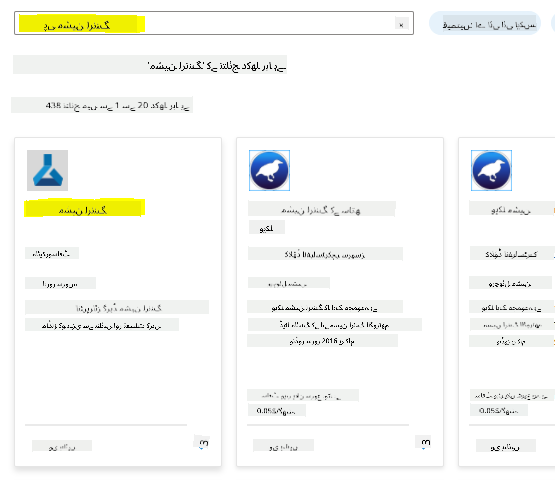

   Create بٹن پر کلک کریں

   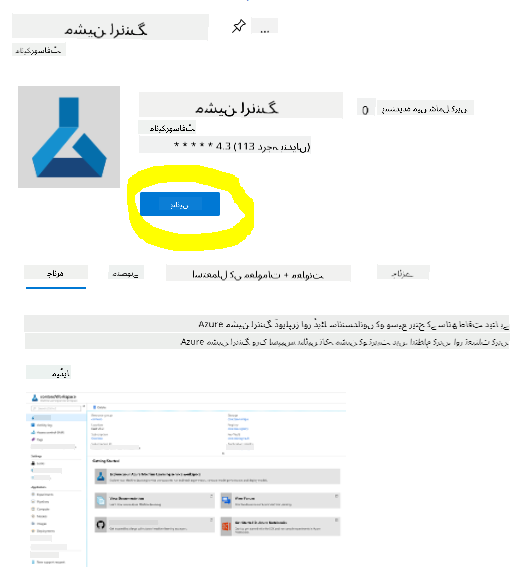

   ترتیبات کو درج ذیل کے مطابق پُر کریں:
   - سبسکرپشن: آپ کا Azure سبسکرپشن
   - ریسورس گروپ: ایک ریسورس گروپ بنائیں یا منتخب کریں
   - ورک اسپیس کا نام: اپنے ورک اسپیس کے لیے ایک منفرد نام درج کریں
   - علاقہ: اپنے قریب ترین جغرافیائی علاقہ منتخب کریں
   - اسٹوریج اکاؤنٹ: ورک اسپیس کے لیے بنائے جانے والے نئے اسٹوریج اکاؤنٹ کو نوٹ کریں
   - Key vault: ورک اسپیس کے لیے بنائے جانے والے نئے Key vault کو نوٹ کریں
   - Application insights: ورک اسپیس کے لیے بنائے جانے والے نئے Application insights وسائل کو نوٹ کریں
   - Container registry: کوئی نہیں (پہلی بار جب آپ ماڈل کو کنٹینر میں تعینات کریں گے تو ایک خود بخود بنایا جائے گا)

    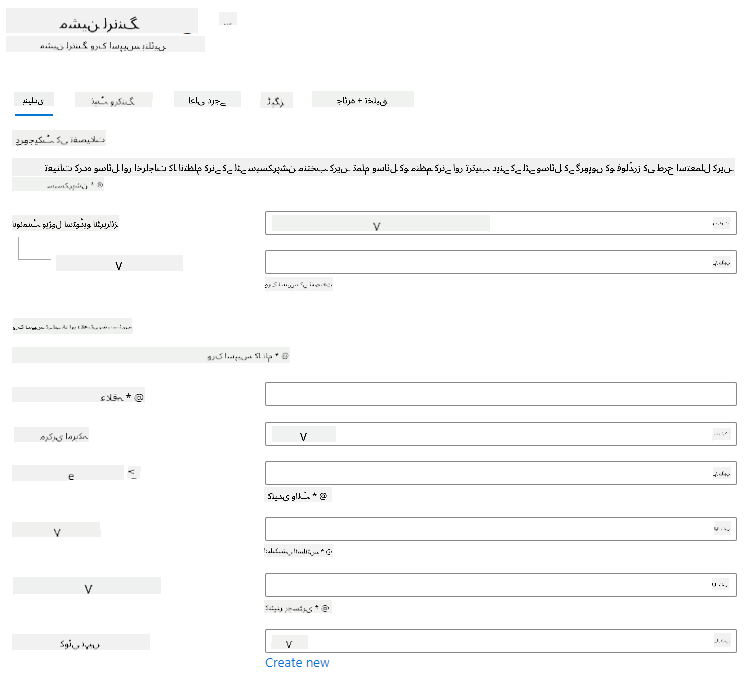

   - Create + review پر کلک کریں اور پھر Create بٹن پر کلک کریں
3. اپنے ورک اسپیس کے بننے کا انتظار کریں (یہ چند منٹ لے سکتا ہے)۔ پھر اسے پورٹل میں جائیں۔ آپ اسے Machine Learning Azure سروس کے ذریعے تلاش کر سکتے ہیں۔
4. اپنے ورک اسپیس کے Overview صفحے پر، Azure Machine Learning studio لانچ کریں (یا ایک نیا براؤزر ٹیب کھولیں اور https://ml.azure.com پر جائیں)، اور Azure Machine Learning studio میں اپنے Microsoft اکاؤنٹ کے ساتھ سائن ان کریں۔ اگر کہا جائے تو اپنا Azure ڈائریکٹری اور سبسکرپشن منتخب کریں، اور اپنا Azure Machine Learning ورک اسپیس منتخب کریں۔
   
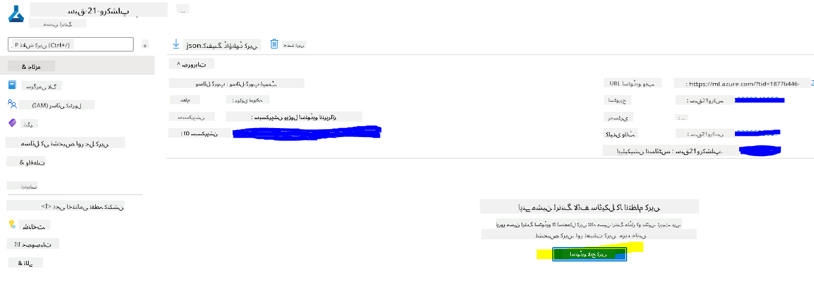

5. Azure Machine Learning studio میں، اوپر بائیں جانب ☰ آئیکن کو ٹوگل کریں تاکہ انٹرفیس میں مختلف صفحات دیکھے جا سکیں۔ آپ ان صفحات کو اپنے ورک اسپیس کے وسائل کا انتظام کرنے کے لیے استعمال کر سکتے ہیں۔

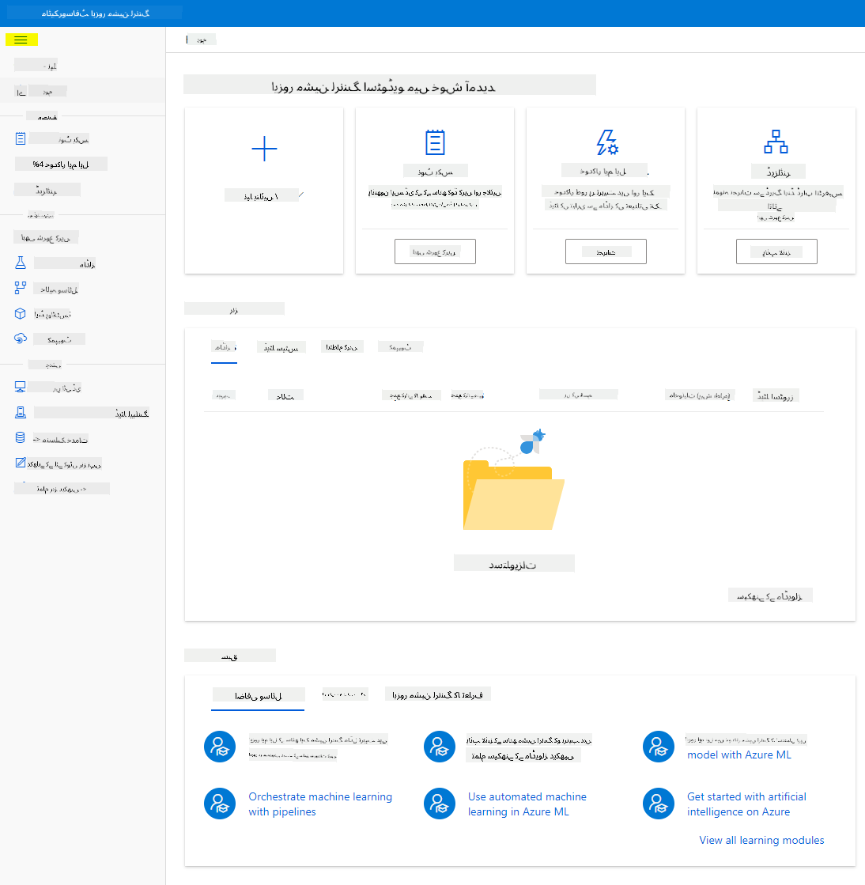

آپ اپنے ورک اسپیس کا انتظام Azure پورٹل کے ذریعے کر سکتے ہیں، لیکن ڈیٹا سائنسدانوں اور مشین لرننگ آپریشنز انجینئرز کے لیے، Azure Machine Learning Studio ورک اسپیس کے وسائل کا انتظام کرنے کے لیے زیادہ مرکوز یوزر انٹرفیس فراہم کرتا ہے۔

### 2.2 کمپیوٹ وسائل

کمپیوٹ وسائل کلاؤڈ پر مبنی وسائل ہیں جن پر آپ ماڈل کی تربیت اور ڈیٹا کی دریافت کے عمل چلا سکتے ہیں۔ آپ چار قسم کے کمپیوٹ وسائل بنا سکتے ہیں:

- **Compute Instances**: ترقیاتی ورک اسٹیشنز جنہیں ڈیٹا سائنسدان ڈیٹا اور ماڈلز کے ساتھ کام کرنے کے لیے استعمال کر سکتے ہیں۔ اس میں ایک ورچوئل مشین (VM) بنانا اور نوٹ بک انسٹینس لانچ کرنا شامل ہے۔ آپ پھر نوٹ بک سے کمپیوٹ کلسٹر کو کال کر کے ماڈل کی تربیت کر سکتے ہیں۔
- **Compute Clusters**: تجرباتی کوڈ کے آن ڈیمانڈ پروسیسنگ کے لیے قابل توسیع VM کلسٹرز۔ آپ کو ماڈل کی تربیت کے وقت اس کی ضرورت ہوگی۔ کمپیوٹ کلسٹرز خصوصی GPU یا CPU وسائل بھی استعمال کر سکتے ہیں۔
- **Inference Clusters**: پیش گوئی کی خدمات کے تعیناتی کے اہداف جو آپ کے تربیت یافتہ ماڈلز استعمال کرتے ہیں۔
- **منسلک کمپیوٹ**: Azure کے موجودہ کمپیوٹ وسائل سے لنک کرتا ہے، جیسے کہ ورچوئل مشینز یا Azure Databricks کلسٹرز۔

#### 2.2.1 اپنے کمپیوٹ وسائل کے لیے درست اختیارات کا انتخاب کرنا

کمپیوٹ وسائل بناتے وقت کچھ اہم عوامل پر غور کرنا ضروری ہے، اور یہ انتخاب اہم فیصلے ہو سکتے ہیں۔

**کیا آپ کو CPU یا GPU کی ضرورت ہے؟**

CPU (Central Processing Unit) ایک الیکٹرانک سرکٹ ہے جو کمپیوٹر پروگرام کے احکامات کو چلاتا ہے۔ GPU (Graphics Processing Unit) ایک خاص الیکٹرانک سرکٹ ہے جو گرافکس سے متعلق کوڈ کو بہت تیز رفتاری سے چلا سکتا ہے۔

CPU اور GPU کی ساخت میں بنیادی فرق یہ ہے کہ CPU کو مختلف قسم کے کاموں کو تیزی سے انجام دینے کے لیے ڈیزائن کیا گیا ہے (جسے CPU کلاک اسپیڈ سے ماپا جاتا ہے)، لیکن یہ ایک وقت میں چلنے والے کاموں کی تعداد میں محدود ہوتا ہے۔ GPUs کو متوازی کمپیوٹنگ کے لیے ڈیزائن کیا گیا ہے اور اس لیے یہ گہرے سیکھنے کے کاموں کے لیے زیادہ بہتر ہیں۔

| CPU                                     | GPU                         |
|-----------------------------------------|-----------------------------|
| کم مہنگا                                | زیادہ مہنگا                 |
| کم سطح کی ہم وقتی                      | زیادہ سطح کی ہم وقتی        |
| گہرے سیکھنے کے ماڈلز کی تربیت میں سست   | گہرے سیکھنے کے لیے بہترین  |

**کلسٹر کا سائز**

بڑے کلسٹر زیادہ مہنگے ہوتے ہیں لیکن بہتر ردعمل فراہم کرتے ہیں۔ لہٰذا، اگر آپ کے پاس وقت ہے لیکن پیسے کم ہیں، تو آپ کو چھوٹے کلسٹر سے شروع کرنا چاہیے۔ اس کے برعکس، اگر آپ کے پاس پیسے ہیں لیکن وقت کم ہے، تو آپ کو بڑے کلسٹر سے شروع کرنا چاہیے۔

**VM کا سائز**

آپ کے وقت اور بجٹ کی حدود کے مطابق، آپ اپنی RAM، ڈسک، کورز کی تعداد اور کلاک اسپیڈ کے سائز کو مختلف کر سکتے ہیں۔ ان تمام پیرامیٹرز کو بڑھانے سے لاگت زیادہ ہوگی، لیکن کارکردگی بہتر ہوگی۔

**Dedicated یا Low-Priority Instances؟**

Low-priority instance کا مطلب ہے کہ یہ قابل مداخلت ہے: بنیادی طور پر، Microsoft Azure ان وسائل کو لے کر کسی اور کام کو تفویض کر سکتا ہے، اس طرح ایک کام میں خلل ڈال سکتا ہے۔ Dedicated instance، یا غیر مداخلت پذیر، کا مطلب ہے کہ کام آپ کی اجازت کے بغیر کبھی ختم نہیں ہوگا۔  
یہ وقت بمقابلہ پیسے کا ایک اور پہلو ہے، کیونکہ قابل مداخلت انسٹینسز Dedicated انسٹینسز سے کم مہنگے ہوتے ہیں۔

#### 2.2.2 کمپیوٹ کلسٹر بنانا

[Azure ML ورک اسپیس](https://ml.azure.com/) میں جو ہم نے پہلے بنایا تھا، کمپیوٹ پر جائیں اور آپ ان مختلف کمپیوٹ وسائل کو دیکھ سکیں گے جن پر ہم نے ابھی بات کی (یعنی کمپیوٹ انسٹینسز، کمپیوٹ کلسٹرز، انفرنس کلسٹرز اور منسلک کمپیوٹ)۔ اس پروجیکٹ کے لیے، ہمیں ماڈل کی تربیت کے لیے کمپیوٹ کلسٹر کی ضرورت ہوگی۔ اسٹوڈیو میں، "Compute" مینو پر کلک کریں، پھر "Compute cluster" ٹیب پر کلک کریں اور کمپیوٹ کلسٹر بنانے کے لیے "+ New" بٹن پر کلک کریں۔

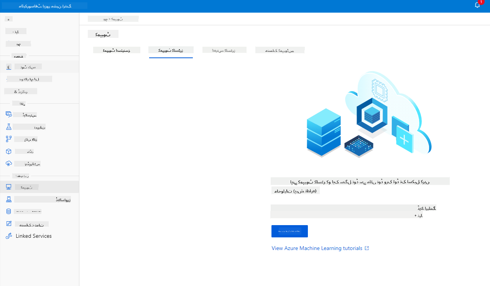

1. اپنے اختیارات منتخب کریں: Dedicated بمقابلہ Low priority، CPU یا GPU، VM کا سائز اور کورز کی تعداد (آپ اس پروجیکٹ کے لیے ڈیفالٹ سیٹنگز رکھ سکتے ہیں)۔
2. Next بٹن پر کلک کریں۔

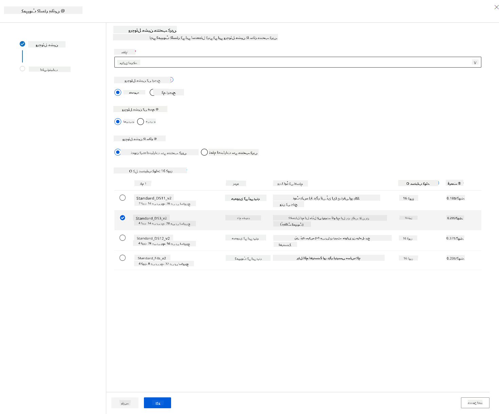

3. کلسٹر کو ایک کمپیوٹ نام دیں۔
4. اپنے اختیارات منتخب کریں: کم از کم/زیادہ سے زیادہ نوڈز کی تعداد، اسکیل ڈاؤن سے پہلے Idle سیکنڈز، SSH رسائی۔ نوٹ کریں کہ اگر کم از کم نوڈز کی تعداد 0 ہے، تو آپ کلسٹر کے Idle ہونے پر پیسے بچا سکتے ہیں۔ نوٹ کریں کہ زیادہ سے زیادہ نوڈز کی تعداد جتنی زیادہ ہوگی، تربیت اتنی ہی کم وقت میں مکمل ہوگی۔ زیادہ سے زیادہ نوڈز کی تجویز کردہ تعداد 3 ہے۔
5. "Create" بٹن پر کلک کریں۔ یہ مرحلہ چند منٹ لے سکتا ہے۔

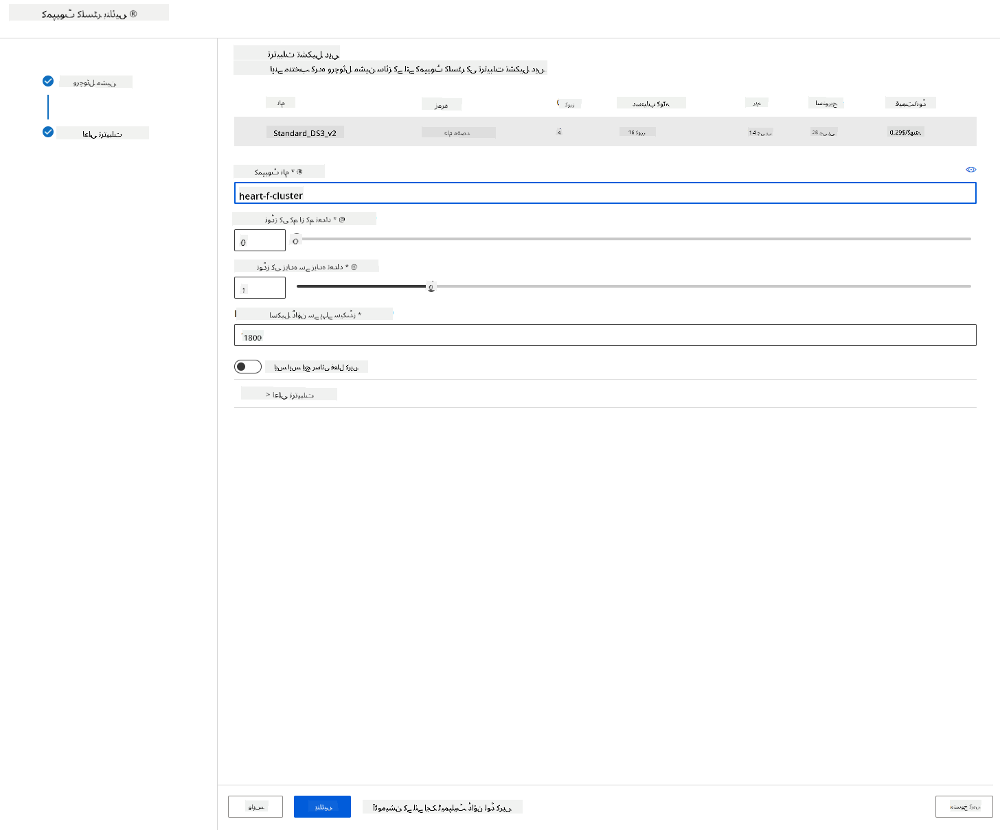

زبردست! اب جب کہ ہمارے پاس ایک کمپیوٹ کلسٹر ہے، ہمیں ڈیٹا کو Azure ML اسٹوڈیو میں لوڈ کرنے کی ضرورت ہے۔

### 2.3 ڈیٹاسیٹ لوڈ کرنا

1. [Azure ML ورک اسپیس](https://ml.azure.com/) میں جو ہم نے پہلے بنایا تھا، بائیں مینو میں "Datasets" پر کلک کریں اور ڈیٹاسیٹ بنانے کے لیے "+ Create dataset" بٹن پر کلک کریں۔ "From local files" آپشن منتخب کریں اور وہ Kaggle ڈیٹاسیٹ منتخب کریں جو ہم نے پہلے ڈاؤن لوڈ کیا تھا۔

   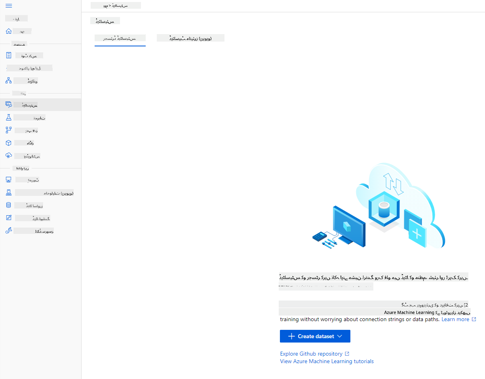

2. اپنے ڈیٹاسیٹ کو ایک نام، ایک قسم اور ایک وضاحت دیں۔ Next پر کلک کریں۔ فائلوں سے ڈیٹا اپ لوڈ کریں۔ Next پر کلک کریں۔

   

3. Schema میں، درج ذیل خصوصیات کے لیے ڈیٹا کی قسم کو Boolean میں تبدیل کریں: anaemia، diabetes، high blood pressure، sex، smoking، اور DEATH_EVENT۔ Next پر کلک کریں اور Create پر کلک کریں۔

   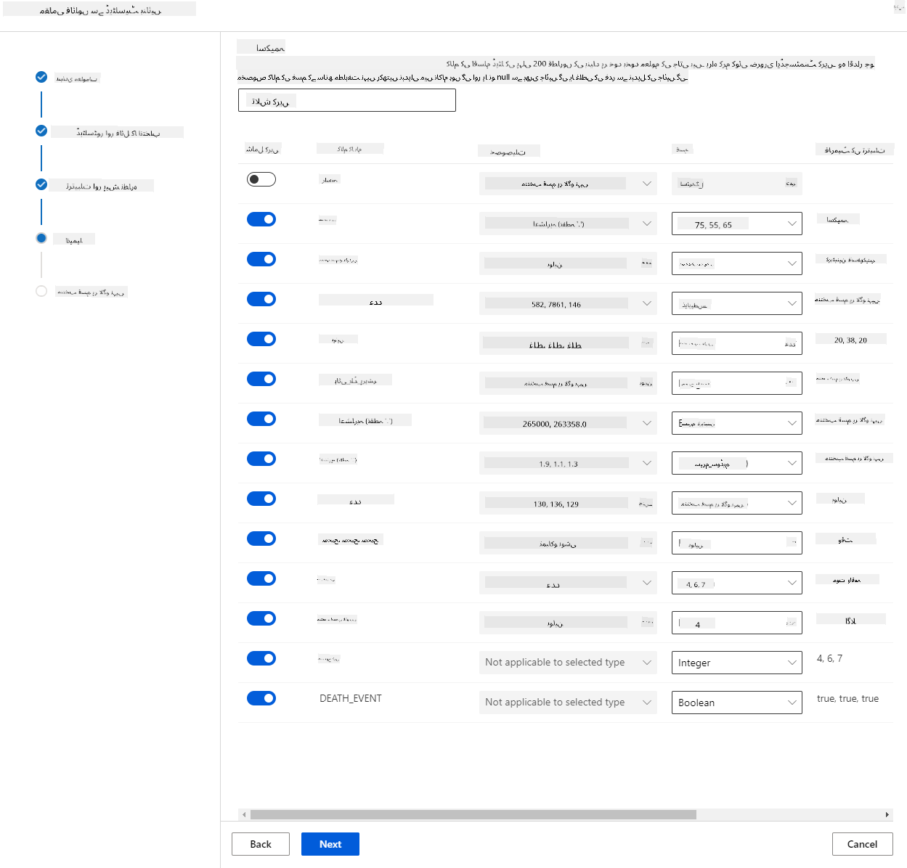

زبردست! اب جب کہ ڈیٹاسیٹ موجود ہے اور کمپیوٹ کلسٹر بنایا گیا ہے، ہم ماڈل کی تربیت شروع کر سکتے ہیں!

### 2.4 کم کوڈ/بغیر کوڈ کے ساتھ AutoML تربیت

روایتی مشین لرننگ ماڈل کی ترقی وسائل کی ضرورت ہوتی ہے، نمایاں ڈومین علم اور وقت کی ضرورت ہوتی ہے تاکہ درجنوں ماڈلز تیار اور موازنہ کیے جا سکیں۔  
خودکار مشین لرننگ (AutoML) مشین لرننگ ماڈل کی ترقی کے وقت طلب، تکراری کاموں کو خودکار کرنے کا عمل ہے۔ یہ ڈیٹا سائنسدانوں، تجزیہ کاروں، اور ڈویلپرز کو اعلیٰ پیمانے، کارکردگی، اور پیداواری صلاحیت کے ساتھ ML ماڈلز بنانے کی اجازت دیتا ہے، جبکہ ماڈل کے معیار کو برقرار رکھتا ہے۔ یہ پروڈکشن کے لیے تیار ML ماڈلز حاصل کرنے کے وقت کو کم کرتا ہے، بڑی آسانی اور کارکردگی کے ساتھ۔ [مزید جانیں](https://docs.microsoft.com/azure/machine-learning/concept-automated-ml?WT.mc_id=academic-77958-bethanycheum&ocid=AID3041109)

1. [Azure ML ورک اسپیس](https://ml.azure.com/) میں جو ہم نے پہلے بنایا تھا، بائیں مینو میں "Automated ML" پر کلک کریں اور وہ ڈیٹاسیٹ منتخب کریں جو آپ نے ابھی اپ لوڈ کیا تھا۔ Next پر کلک کریں۔

   

2. ایک نیا تجربہ نام، ہدف کالم (DEATH_EVENT) اور وہ کمپیوٹ کلسٹر درج کریں جو ہم نے بنایا تھا۔ Next پر کلک کریں۔

   

3. "Classification" منتخب کریں اور Finish پر کلک کریں۔ یہ مرحلہ کمپیوٹ کلسٹر کے سائز پر منحصر ہے، 30 منٹ سے 1 گھنٹے تک لے سکتا ہے۔

   

4. جب رن مکمل ہو جائے، "Automated ML" ٹیب پر کلک کریں، اپنے رن پر کلک کریں، اور "Best model summary" کارڈ میں الگورتھم پر کلک کریں۔

   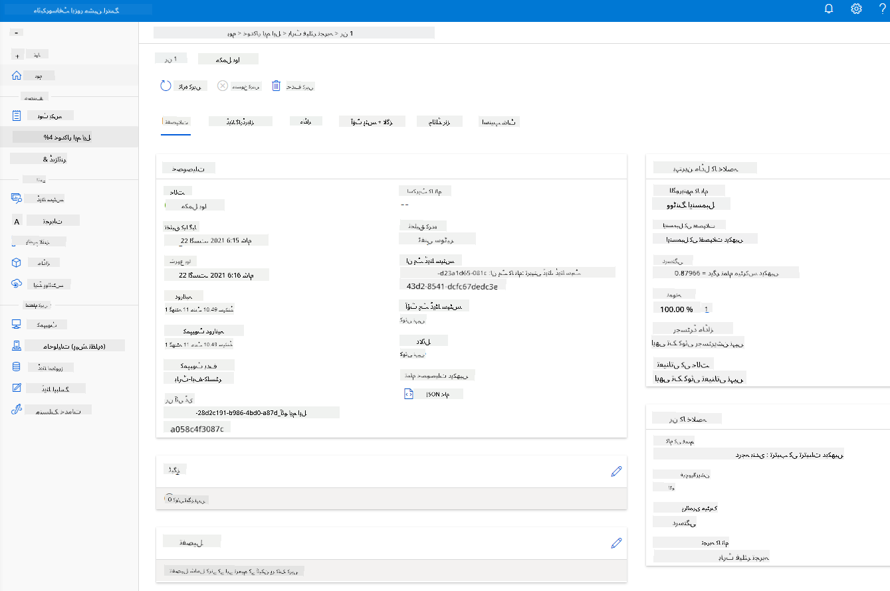

یہاں آپ AutoML کے ذریعے تیار کردہ بہترین ماڈل کی تفصیلی وضاحت دیکھ سکتے ہیں۔ آپ ماڈلز ٹیب میں دیگر ماڈلز کو بھی دریافت کر سکتے ہیں۔ چند منٹ نکال کر ماڈلز کو Explanations (preview) بٹن میں دیکھیں۔ جب آپ اس ماڈل کا انتخاب کر لیں جسے آپ استعمال کرنا چاہتے ہیں (یہاں ہم AutoML کے منتخب کردہ بہترین ماڈل کو منتخب کریں گے)، ہم دیکھیں گے کہ اسے کیسے تعینات کیا جا سکتا ہے۔

## 3. کم کوڈ/بغیر کوڈ ماڈل کی تعیناتی اور اینڈ پوائنٹ کا استعمال
### 3.1 ماڈل کی تعیناتی

خودکار مشین لرننگ انٹرفیس آپ کو بہترین ماڈل کو ویب سروس کے طور پر چند مراحل میں تعینات کرنے کی اجازت دیتا ہے۔ تعیناتی ماڈل کے انضمام کا عمل ہے تاکہ یہ نئے ڈیٹا کی بنیاد پر پیش گوئیاں کر سکے اور ممکنہ مواقع کے علاقوں کی نشاندہی کر سکے۔ اس پروجیکٹ کے لیے، ویب سروس پر تعیناتی کا مطلب یہ ہے کہ طبی ایپلیکیشنز ماڈل کو استعمال کر سکیں گی تاکہ اپنے مریضوں کے دل کے دورے کے خطرے کی لائیو پیش گوئیاں کر سکیں۔

بہترین ماڈل کی وضاحت میں، "Deploy" بٹن پر کلک کریں۔


15. اسے ایک نام، وضاحت، کمپیوٹ کی قسم (Azure Container Instance) دیں، تصدیق کو فعال کریں اور Deploy پر کلک کریں۔ یہ مرحلہ مکمل ہونے میں تقریباً 20 منٹ لگ سکتے ہیں۔ تعیناتی کے عمل میں کئی مراحل شامل ہیں، بشمول ماڈل کو رجسٹر کرنا، وسائل تیار کرنا، اور انہیں ویب سروس کے لیے ترتیب دینا۔ Deploy status کے تحت ایک اسٹیٹس پیغام ظاہر ہوتا ہے۔ تعیناتی کی حیثیت کو چیک کرنے کے لیے وقتاً فوقتاً Refresh منتخب کریں۔ جب حیثیت "Healthy" ہو تو یہ تعینات اور چل رہا ہے۔

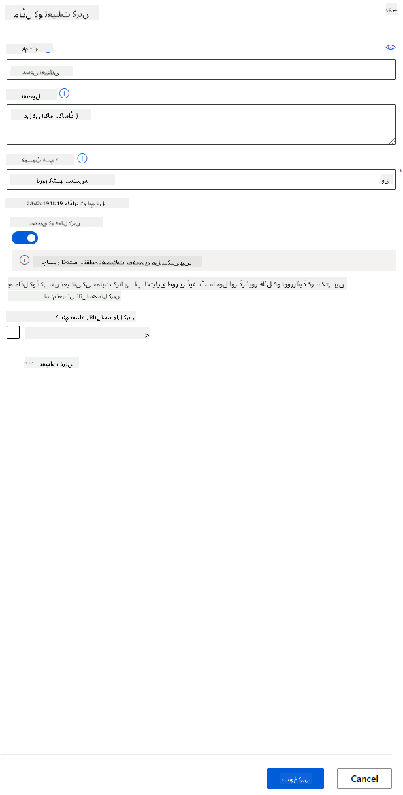

16. ایک بار تعینات ہونے کے بعد، Endpoint ٹیب پر کلک کریں اور اس اینڈ پوائنٹ پر کلک کریں جو آپ نے ابھی تعینات کیا ہے۔ یہاں آپ اینڈ پوائنٹ کے بارے میں تمام تفصیلات حاصل کر سکتے ہیں۔

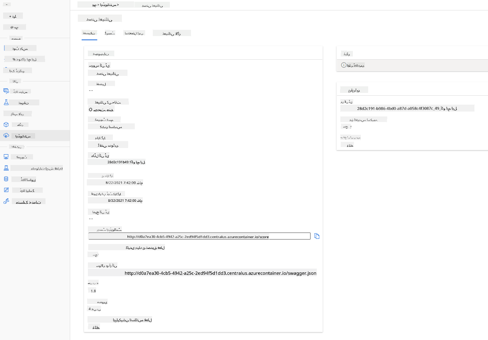

زبردست! اب جب کہ ہمارے پاس ایک ماڈل تعینات ہے، ہم اینڈ پوائنٹ کا استعمال شروع کر سکتے ہیں۔

### 3.2 اینڈ پوائنٹ کا استعمال

"Consume" ٹیب پر کلک کریں۔ یہاں آپ کو REST اینڈ پوائنٹ اور کھپت کے آپشن میں ایک Python اسکرپٹ ملے گا۔ Python کوڈ کو پڑھنے کے لیے کچھ وقت نکالیں۔

یہ اسکرپٹ آپ کے مقامی مشین سے براہ راست چلایا جا سکتا ہے اور آپ کے اینڈ پوائنٹ کو استعمال کرے گا۔

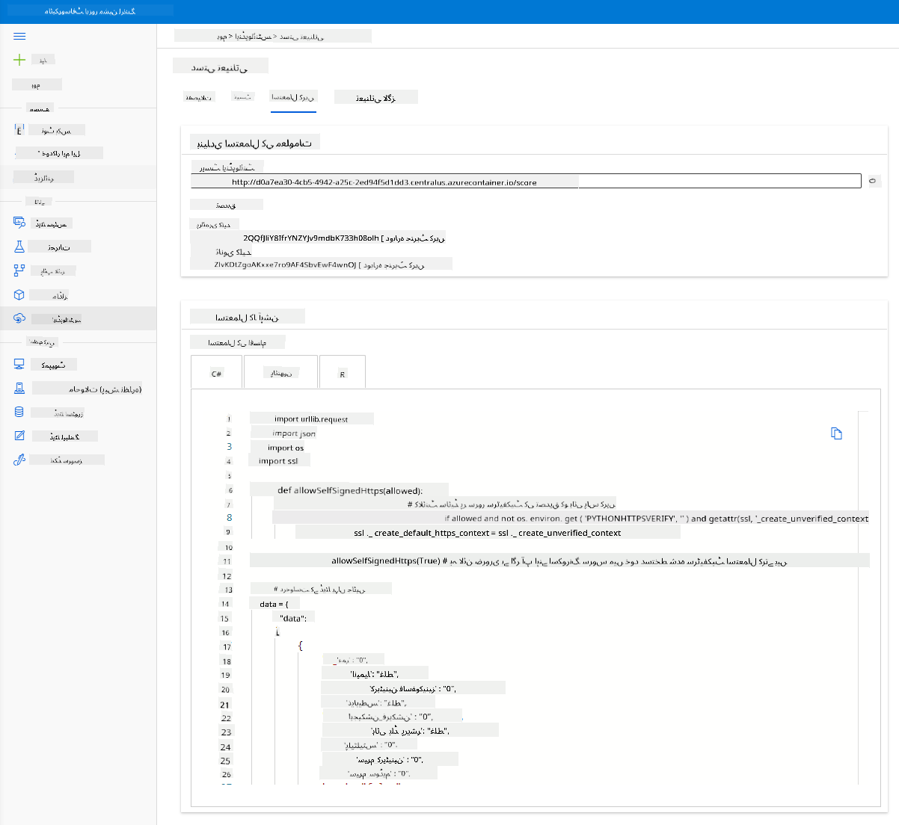

ان دو لائنوں کو چیک کرنے کے لیے ایک لمحہ نکالیں:

```python
url = 'http://98e3715f-xxxx-xxxx-xxxx-9ec22d57b796.centralus.azurecontainer.io/score'
api_key = '' # Replace this with the API key for the web service
```  
`url` متغیر Consume ٹیب میں پایا جانے والا REST اینڈ پوائنٹ ہے اور `api_key` متغیر پرائمری کلید ہے جو Consume ٹیب میں بھی پائی جاتی ہے (صرف اس صورت میں جب آپ نے تصدیق کو فعال کیا ہو)۔ یہ اسکرپٹ اینڈ پوائنٹ کو استعمال کرنے کا طریقہ ہے۔

18. اسکرپٹ کو چلانے پر، آپ کو درج ذیل آؤٹ پٹ نظر آنا چاہیے:  
    ```python
    b'"{\\"result\\": [true]}"'
    ```  
اس کا مطلب ہے کہ دیے گئے ڈیٹا کے لیے دل کی ناکامی کی پیش گوئی درست ہے۔ یہ منطقی ہے کیونکہ اگر آپ اسکرپٹ میں خودکار طور پر تیار کردہ ڈیٹا کو قریب سے دیکھیں، تو سب کچھ ڈیفالٹ کے طور پر 0 اور false پر ہے۔ آپ درج ذیل ان پٹ نمونے کے ساتھ ڈیٹا کو تبدیل کر سکتے ہیں:

```python
data = {
    "data":
    [
        {
            'age': "0",
            'anaemia': "false",
            'creatinine_phosphokinase': "0",
            'diabetes': "false",
            'ejection_fraction': "0",
            'high_blood_pressure': "false",
            'platelets': "0",
            'serum_creatinine': "0",
            'serum_sodium': "0",
            'sex': "false",
            'smoking': "false",
            'time': "0",
        },
        {
            'age': "60",
            'anaemia': "false",
            'creatinine_phosphokinase': "500",
            'diabetes': "false",
            'ejection_fraction': "38",
            'high_blood_pressure': "false",
            'platelets': "260000",
            'serum_creatinine': "1.40",
            'serum_sodium': "137",
            'sex': "false",
            'smoking': "false",
            'time': "130",
        },
    ],
}
```  
اسکرپٹ کو درج ذیل آؤٹ پٹ دینا چاہیے:  
    ```python
    b'"{\\"result\\": [true, false]}"'
    ```  

مبارک ہو! آپ نے ماڈل کو تعینات کیا، اسے استعمال کیا اور Azure ML پر تربیت دی!

> **_نوٹ:_** جب آپ پروجیکٹ مکمل کر لیں، تو تمام وسائل کو حذف کرنا نہ بھولیں۔

## 🚀 چیلنج

AutoML کے ذریعے تیار کردہ ٹاپ ماڈلز کی وضاحتوں اور تفصیلات کو غور سے دیکھیں۔ یہ سمجھنے کی کوشش کریں کہ بہترین ماڈل دوسرے ماڈلز سے کیوں بہتر ہے۔ کون سے الگورتھمز کا موازنہ کیا گیا؟ ان میں کیا فرق ہے؟ اس کیس میں بہترین ماڈل کیوں بہتر کارکردگی کا مظاہرہ کر رہا ہے؟

## [لیکچر کے بعد کا کوئز](https://purple-hill-04aebfb03.1.azurestaticapps.net/quiz/35)

## جائزہ اور خود مطالعہ

اس سبق میں، آپ نے کلاؤڈ میں کم کوڈ/بغیر کوڈ کے انداز میں دل کی ناکامی کے خطرے کی پیش گوئی کے لیے ماڈل کو تربیت دینے، تعینات کرنے اور استعمال کرنے کا طریقہ سیکھا۔ اگر آپ نے ابھی تک ایسا نہیں کیا ہے، تو AutoML کے ذریعے تیار کردہ ٹاپ ماڈلز کی وضاحتوں میں مزید گہرائی میں جائیں اور یہ سمجھنے کی کوشش کریں کہ بہترین ماڈل دوسروں سے کیوں بہتر ہے۔

آپ Low code/No code AutoML کے بارے میں مزید جاننے کے لیے یہ [دستاویزات](https://docs.microsoft.com/azure/machine-learning/tutorial-first-experiment-automated-ml?WT.mc_id=academic-77958-bethanycheum&ocid=AID3041109) پڑھ سکتے ہیں۔

## اسائنمنٹ

[Azure ML پر Low code/No code ڈیٹا سائنس پروجیکٹ](assignment.md)

---

**ڈس کلیمر**:  
یہ دستاویز AI ترجمہ سروس [Co-op Translator](https://github.com/Azure/co-op-translator) کا استعمال کرتے ہوئے ترجمہ کی گئی ہے۔ ہم درستگی کے لیے کوشش کرتے ہیں، لیکن براہ کرم آگاہ رہیں کہ خودکار ترجمے میں غلطیاں یا عدم درستگی ہو سکتی ہیں۔ اصل دستاویز، جو اس کی اصل زبان میں ہے، کو مستند ذریعہ سمجھا جانا چاہیے۔ اہم معلومات کے لیے، پیشہ ور انسانی ترجمہ کی سفارش کی جاتی ہے۔ اس ترجمے کے استعمال سے پیدا ہونے والی کسی بھی غلط فہمی یا غلط تشریح کے لیے ہم ذمہ دار نہیں ہیں۔