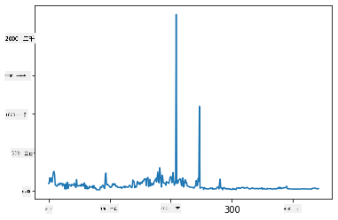
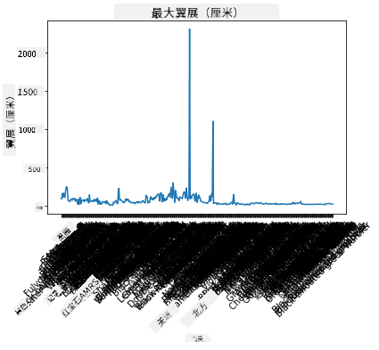
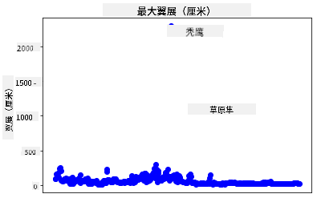
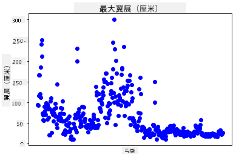
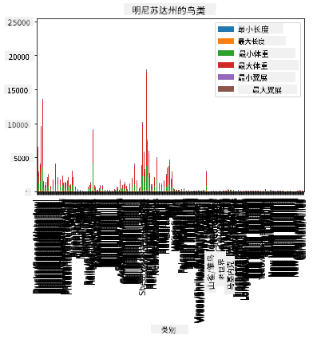
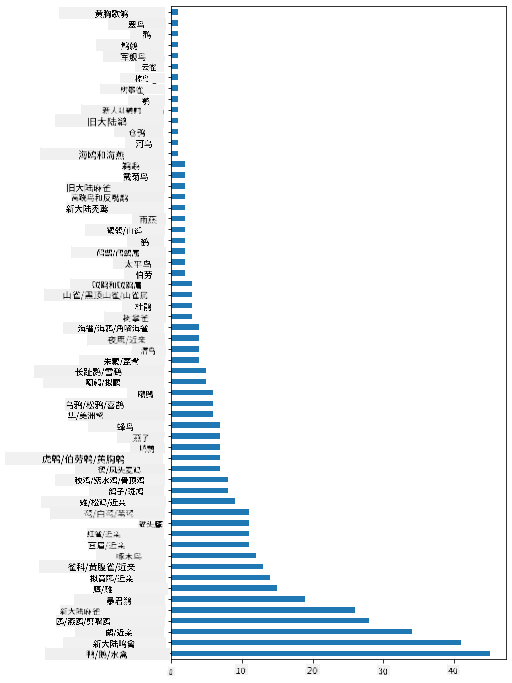

<!--
CO_OP_TRANSLATOR_METADATA:
{
  "original_hash": "43c402d9d90ae6da55d004519ada5033",
  "translation_date": "2025-08-25T18:33:53+00:00",
  "source_file": "3-Data-Visualization/09-visualization-quantities/README.md",
  "language_code": "zh"
}
-->
# 可视化数量

| ](../../sketchnotes/09-Visualizing-Quantities.png)|
|:---:|
| 可视化数量 - _Sketchnote by [@nitya](https://twitter.com/nitya)_ |

在本课中，您将学习如何使用众多可用的 Python 库之一，围绕数量的概念创建有趣的可视化。通过一个关于明尼苏达州鸟类的清理数据集，您可以了解许多关于当地野生动物的有趣事实。

## [课前测验](https://purple-hill-04aebfb03.1.azurestaticapps.net/quiz/16)

## 使用 Matplotlib 观察翼展

一个非常优秀的库可以创建各种简单和复杂的图表和图形，它就是 [Matplotlib](https://matplotlib.org/stable/index.html)。一般来说，使用这些库绘制数据的过程包括：确定数据框中您想要处理的部分，对数据进行必要的转换，分配 x 和 y 轴的值，决定显示哪种图表，然后显示图表。Matplotlib 提供了多种可视化方式，但在本课中，我们将重点关注最适合可视化数量的图表类型：折线图、散点图和柱状图。

> ✅ 根据数据结构和您想讲述的故事选择最佳图表。
> - 分析时间趋势：折线图
> - 比较数值：柱状图、条形图、饼图、散点图
> - 展示部分与整体的关系：饼图
> - 展示数据分布：散点图、柱状图
> - 展示趋势：折线图、条形图
> - 展示数值之间的关系：折线图、散点图、气泡图

如果您有一个数据集并需要了解某个项目的数量，第一步通常是检查其数值。

✅ Matplotlib 有非常好的“速查表”，可以在 [这里](https://matplotlib.org/cheatsheets/cheatsheets.pdf) 找到。

## 绘制鸟类翼展值的折线图

打开本课文件夹根目录中的 `notebook.ipynb` 文件并添加一个单元格。

> 注意：数据存储在本仓库根目录的 `/data` 文件夹中。

```python
import pandas as pd
import matplotlib.pyplot as plt
birds = pd.read_csv('../../data/birds.csv')
birds.head()
```
这些数据是文本和数字的混合：

|      | 名称                         | 学名                   | 类别                  | 目           | 科       | 属         | 保护状态             | 最小长度 | 最大长度 | 最小体重   | 最大体重   | 最小翼展   | 最大翼展   |
| ---: | :--------------------------- | :--------------------- | :-------------------- | :----------- | :------- | :---------- | :----------------- | --------: | --------: | ----------: | ----------: | ----------: | ----------: |
|    0 | 黑腹哨鸭                     | Dendrocygna autumnalis | 鸭/鹅/水禽            | 雁形目       | 鸭科     | 哨鸭属     | LC                 |        47 |        56 |         652 |        1020 |          76 |          94 |
|    1 | 棕哨鸭                       | Dendrocygna bicolor    | 鸭/鹅/水禽            | 雁形目       | 鸭科     | 哨鸭属     | LC                 |        45 |        53 |         712 |        1050 |          85 |          93 |
|    2 | 雪鹅                         | Anser caerulescens     | 鸭/鹅/水禽            | 雁形目       | 鸭科     | 雁属       | LC                 |        64 |        79 |        2050 |        4050 |         135 |         165 |
|    3 | 罗氏鹅                       | Anser rossii           | 鸭/鹅/水禽            | 雁形目       | 鸭科     | 雁属       | LC                 |      57.3 |        64 |        1066 |        1567 |         113 |         116 |
|    4 | 大白额雁                     | Anser albifrons        | 鸭/鹅/水禽            | 雁形目       | 鸭科     | 雁属       | LC                 |        64 |        81 |        1930 |        3310 |         130 |         165 |

让我们从使用基本折线图绘制一些数值数据开始。假设您想查看这些有趣鸟类的最大翼展。

```python
wingspan = birds['MaxWingspan'] 
wingspan.plot()
```


您立即注意到什么？似乎至少有一个异常值——这翼展也太大了吧！2300 厘米的翼展相当于 23 米——难道明尼苏达州有翼龙在飞？让我们调查一下。

虽然您可以在 Excel 中快速排序以找到这些异常值（可能是输入错误），但继续从图表中进行可视化处理。

为 x 轴添加标签以显示涉及的鸟类种类：

```
plt.title('Max Wingspan in Centimeters')
plt.ylabel('Wingspan (CM)')
plt.xlabel('Birds')
plt.xticks(rotation=45)
x = birds['Name'] 
y = birds['MaxWingspan']

plt.plot(x, y)

plt.show()
```


即使标签旋转到 45 度，仍然太多了，无法阅读。让我们尝试另一种策略：仅标记那些异常值，并在图表内设置标签。您可以使用散点图为标签腾出更多空间：

```python
plt.title('Max Wingspan in Centimeters')
plt.ylabel('Wingspan (CM)')
plt.tick_params(axis='both',which='both',labelbottom=False,bottom=False)

for i in range(len(birds)):
    x = birds['Name'][i]
    y = birds['MaxWingspan'][i]
    plt.plot(x, y, 'bo')
    if birds['MaxWingspan'][i] > 500:
        plt.text(x, y * (1 - 0.05), birds['Name'][i], fontsize=12)
    
plt.show()
```
这里发生了什么？您使用 `tick_params` 隐藏了底部标签，然后对鸟类数据集进行了循环。通过使用 `bo` 绘制带有小圆蓝点的图表，您检查了是否有鸟类的最大翼展超过 500，并在点旁边显示其标签。您在 y 轴上稍微偏移标签 (`y * (1 - 0.05)`) 并使用鸟类名称作为标签。

您发现了什么？



## 筛选数据

秃鹰和草原隼虽然可能是非常大的鸟类，但它们的最大翼展似乎被错误标记了，多加了一个 `0`。遇到翼展 25 米的秃鹰的可能性不大，但如果真的遇到，请告诉我们！让我们创建一个新的数据框，去掉这两个异常值：

```python
plt.title('Max Wingspan in Centimeters')
plt.ylabel('Wingspan (CM)')
plt.xlabel('Birds')
plt.tick_params(axis='both',which='both',labelbottom=False,bottom=False)
for i in range(len(birds)):
    x = birds['Name'][i]
    y = birds['MaxWingspan'][i]
    if birds['Name'][i] not in ['Bald eagle', 'Prairie falcon']:
        plt.plot(x, y, 'bo')
plt.show()
```

通过筛选异常值，您的数据现在更加连贯和易于理解。



现在我们至少在翼展方面有一个更干净的数据集，让我们进一步了解这些鸟类。

虽然折线图和散点图可以显示数据值及其分布的信息，但我们想要思考这个数据集中固有的数值。您可以创建可视化来回答以下关于数量的问题：

> 有多少种鸟类类别？它们的数量是多少？
> 有多少鸟类是灭绝、濒危、稀有或常见的？
> 在林奈分类法中，各种属和目有多少？

## 探索柱状图

当您需要展示数据分组时，柱状图非常实用。让我们探索这个数据集中存在的鸟类类别，看看哪种类别的数量最多。

在 notebook 文件中创建一个基本柱状图。

✅ 注意，您可以筛选掉我们在上一节中识别的两个异常鸟类，编辑它们翼展中的错误，或者将它们保留在这些不依赖翼展值的练习中。

如果您想创建柱状图，可以选择您想要关注的数据。柱状图可以从原始数据创建：

```python
birds.plot(x='Category',
        kind='bar',
        stacked=True,
        title='Birds of Minnesota')

```


然而，这个柱状图难以阅读，因为数据没有分组。您需要选择您想要绘制的数据，所以让我们看看基于鸟类类别的鸟类长度。

筛选数据以仅包含鸟类类别。

✅ 注意，您使用 Pandas 管理数据，然后让 Matplotlib 进行图表绘制。

由于类别较多，您可以垂直显示此图表，并调整其高度以适应所有数据：

```python
category_count = birds.value_counts(birds['Category'].values, sort=True)
plt.rcParams['figure.figsize'] = [6, 12]
category_count.plot.barh()
```


这个柱状图很好地展示了每个类别中鸟类的数量。一眼就能看出，这个地区数量最多的鸟类是鸭/鹅/水禽类别。明尼苏达州是“万湖之地”，所以这并不令人惊讶！

✅ 尝试对这个数据集进行其他计数。有发现让您感到惊讶吗？

## 数据比较

您可以通过创建新轴尝试不同的分组数据比较。尝试比较基于鸟类类别的最大长度：

```python
maxlength = birds['MaxLength']
plt.barh(y=birds['Category'], width=maxlength)
plt.rcParams['figure.figsize'] = [6, 12]
plt.show()
```


这里没有什么令人惊讶的：与鹈鹕或鹅相比，蜂鸟的最大长度最小。当数据符合逻辑时，这是件好事！

您可以通过叠加数据创建更有趣的柱状图。让我们叠加最小长度和最大长度在给定鸟类类别上的数据：

```python
minLength = birds['MinLength']
maxLength = birds['MaxLength']
category = birds['Category']

plt.barh(category, maxLength)
plt.barh(category, minLength)

plt.show()
```
在这个图表中，您可以看到每个鸟类类别的最小长度和最大长度范围。可以肯定地说，根据这些数据，鸟越大，其长度范围越大。真是有趣！


## 🚀 挑战

这个鸟类数据集提供了关于特定生态系统中不同类型鸟类的大量信息。在网上搜索，看看是否能找到其他与鸟类相关的数据集。练习围绕这些鸟类构建图表和图形，发现您之前未曾意识到的事实。

## [课后测验](https://purple-hill-04aebfb03.1.azurestaticapps.net/quiz/17)

## 复习与自学

本课首次介绍了如何使用 Matplotlib 可视化数量。研究其他处理数据集进行可视化的方法。[Plotly](https://github.com/plotly/plotly.py) 是我们不会在这些课程中涉及的一个库，可以看看它能提供什么。

## 作业

[折线图、散点图和柱状图](assignment.md)

**免责声明**：  
本文档使用AI翻译服务[Co-op Translator](https://github.com/Azure/co-op-translator)进行翻译。虽然我们努力确保翻译的准确性，但请注意，自动翻译可能包含错误或不准确之处。原始语言的文档应被视为权威来源。对于重要信息，建议使用专业人工翻译。我们不对因使用此翻译而产生的任何误解或误读承担责任。