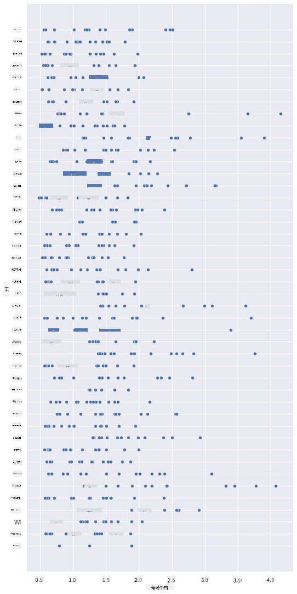
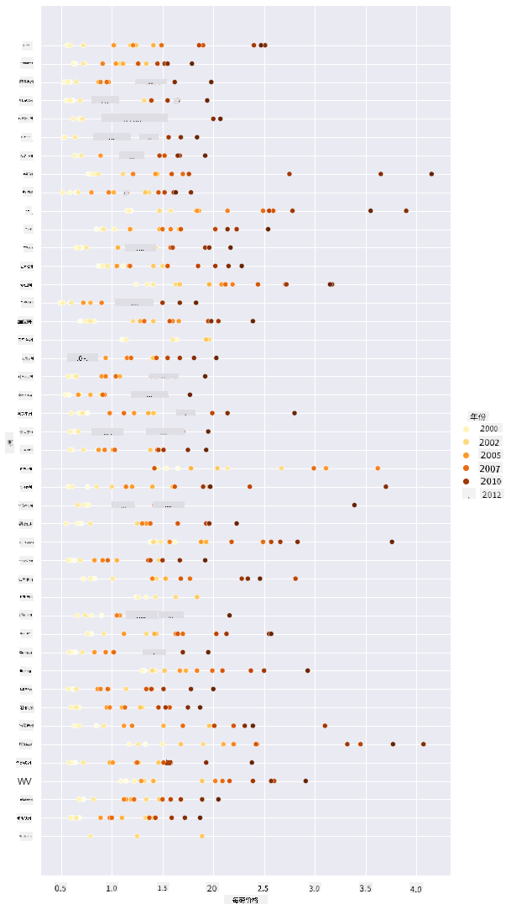
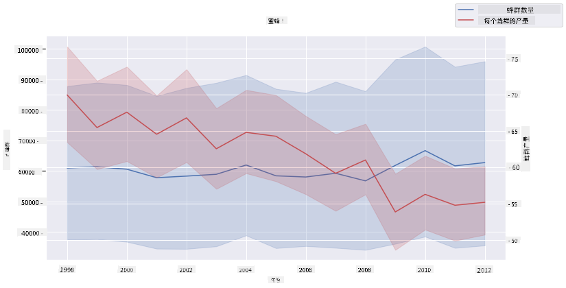

<!--
CO_OP_TRANSLATOR_METADATA:
{
  "original_hash": "cad419b574d5c35eaa417e9abfdcb0c8",
  "translation_date": "2025-08-25T18:08:30+00:00",
  "source_file": "3-Data-Visualization/12-visualization-relationships/README.md",
  "language_code": "zh"
}
-->
# 可视化关系：关于蜂蜜的一切 🍯

| 绘制的速写笔记 ](../../sketchnotes/12-Visualizing-Relationships.png)|
|:---:|
|可视化关系 - _速写笔记由 [@nitya](https://twitter.com/nitya) 绘制_ |

继续我们以自然为主题的研究，让我们探索一些有趣的可视化方法，展示不同类型蜂蜜之间的关系。这些数据来自[美国农业部](https://www.nass.usda.gov/About_NASS/index.php)。

这个包含约600项数据的数据集展示了美国多个州的蜂蜜生产情况。例如，你可以查看1998年至2012年间某个州每年的蜂群数量、每群产量、总产量、库存、每磅价格以及蜂蜜的总价值，每个州每年一行数据。

将某个州每年的生产情况与该州蜂蜜价格之间的关系可视化会很有趣。或者，你也可以可视化各州每群蜂蜜产量之间的关系。这段时间涵盖了2006年首次出现的毁灭性“蜂群崩溃症”（CCD，http://npic.orst.edu/envir/ccd.html），因此这是一个值得研究的引人深思的数据集。🐝

## [课前测验](https://purple-hill-04aebfb03.1.azurestaticapps.net/quiz/22)

在本课中，你可以使用之前用过的 Seaborn，这是一个很好的库，用于可视化变量之间的关系。特别有趣的是 Seaborn 的 `relplot` 函数，它可以快速生成散点图和折线图，用于可视化“[统计关系](https://seaborn.pydata.org/tutorial/relational.html?highlight=relationships)”，帮助数据科学家更好地理解变量之间的关系。

## 散点图

使用散点图展示蜂蜜价格如何逐年在各州演变。Seaborn 的 `relplot` 函数可以方便地对州数据进行分组，并显示分类数据和数值数据的点。

让我们从导入数据和 Seaborn 开始：

```python
import pandas as pd
import matplotlib.pyplot as plt
import seaborn as sns
honey = pd.read_csv('../../data/honey.csv')
honey.head()
```
你会注意到蜂蜜数据中有几个有趣的列，包括年份和每磅价格。让我们按美国各州分组来探索这些数据：

| state | numcol | yieldpercol | totalprod | stocks   | priceperlb | prodvalue | year |
| ----- | ------ | ----------- | --------- | -------- | ---------- | --------- | ---- |
| AL    | 16000  | 71          | 1136000   | 159000   | 0.72       | 818000    | 1998 |
| AZ    | 55000  | 60          | 3300000   | 1485000  | 0.64       | 2112000   | 1998 |
| AR    | 53000  | 65          | 3445000   | 1688000  | 0.59       | 2033000   | 1998 |
| CA    | 450000 | 83          | 37350000  | 12326000 | 0.62       | 23157000  | 1998 |
| CO    | 27000  | 72          | 1944000   | 1594000  | 0.7        | 1361000   | 1998 |

创建一个基础散点图，展示蜂蜜每磅价格与其产地州之间的关系。将 `y` 轴设置得足够高以显示所有州：

```python
sns.relplot(x="priceperlb", y="state", data=honey, height=15, aspect=.5);
```


现在，使用蜂蜜色调展示同样的数据，显示价格如何逐年变化。你可以通过添加一个 'hue' 参数来显示逐年的变化：

> ✅ 了解更多关于 [Seaborn 中可用的颜色调色板](https://seaborn.pydata.org/tutorial/color_palettes.html) - 尝试一个美丽的彩虹配色方案！

```python
sns.relplot(x="priceperlb", y="state", hue="year", palette="YlOrBr", data=honey, height=15, aspect=.5);
```


通过这种颜色方案的变化，你可以明显看到蜂蜜每磅价格在逐年上涨。事实上，如果你查看数据中的一个样本集（例如选择亚利桑那州），你会发现价格逐年上涨的模式，只有少数例外：

| state | numcol | yieldpercol | totalprod | stocks  | priceperlb | prodvalue | year |
| ----- | ------ | ----------- | --------- | ------- | ---------- | --------- | ---- |
| AZ    | 55000  | 60          | 3300000   | 1485000 | 0.64       | 2112000   | 1998 |
| AZ    | 52000  | 62          | 3224000   | 1548000 | 0.62       | 1999000   | 1999 |
| AZ    | 40000  | 59          | 2360000   | 1322000 | 0.73       | 1723000   | 2000 |
| AZ    | 43000  | 59          | 2537000   | 1142000 | 0.72       | 1827000   | 2001 |
| AZ    | 38000  | 63          | 2394000   | 1197000 | 1.08       | 2586000   | 2002 |
| AZ    | 35000  | 72          | 2520000   | 983000  | 1.34       | 3377000   | 2003 |
| AZ    | 32000  | 55          | 1760000   | 774000  | 1.11       | 1954000   | 2004 |
| AZ    | 36000  | 50          | 1800000   | 720000  | 1.04       | 1872000   | 2005 |
| AZ    | 30000  | 65          | 1950000   | 839000  | 0.91       | 1775000   | 2006 |
| AZ    | 30000  | 64          | 1920000   | 902000  | 1.26       | 2419000   | 2007 |
| AZ    | 25000  | 64          | 1600000   | 336000  | 1.26       | 2016000   | 2008 |
| AZ    | 20000  | 52          | 1040000   | 562000  | 1.45       | 1508000   | 2009 |
| AZ    | 24000  | 77          | 1848000   | 665000  | 1.52       | 2809000   | 2010 |
| AZ    | 23000  | 53          | 1219000   | 427000  | 1.55       | 1889000   | 2011 |
| AZ    | 22000  | 46          | 1012000   | 253000  | 1.79       | 1811000   | 2012 |

另一种可视化这种变化的方法是使用点的大小，而不是颜色。对于色盲用户，这可能是一个更好的选择。编辑你的可视化，通过点的直径增加来显示价格的上涨：

```python
sns.relplot(x="priceperlb", y="state", size="year", data=honey, height=15, aspect=.5);
```
你可以看到点的大小逐渐增大。


这是否是一个简单的供需问题？由于气候变化和蜂群崩溃等因素，是否每年可供购买的蜂蜜减少，从而导致价格上涨？

为了发现数据集中某些变量之间的相关性，让我们探索一些折线图。

## 折线图

问题：蜂蜜每磅价格是否逐年明显上涨？你可以通过创建一张单一折线图最容易发现这一点：

```python
sns.relplot(x="year", y="priceperlb", kind="line", data=honey);
```
答案：是的，但在2003年左右有一些例外：


✅ 由于 Seaborn 会围绕一条线聚合数据，它通过绘制均值和均值周围95%的置信区间来显示“每个 x 值的多次测量”。[来源](https://seaborn.pydata.org/tutorial/relational.html)。这种耗时的行为可以通过添加 `ci=None` 来禁用。

问题：那么，在2003年我们是否也能看到蜂蜜供应的激增？如果你查看逐年的总产量呢？

```python
sns.relplot(x="year", y="totalprod", kind="line", data=honey);
```


答案：并没有。如果你查看总产量，实际上在那一年似乎有所增加，尽管总体而言蜂蜜的产量在这些年间呈下降趋势。

问题：在这种情况下，2003年蜂蜜价格的激增可能是什么原因造成的？

为了发现这一点，你可以探索一个分面网格。

## 分面网格

分面网格将数据集的一个方面（在我们的例子中，你可以选择“年份”以避免生成过多的分面）分开。然后 Seaborn 可以为你选择的 x 和 y 坐标生成每个分面的图表，以便更容易进行视觉比较。在这种比较中，2003年是否显得特别突出？

通过继续使用 `relplot` 创建一个分面网格，正如 [Seaborn 文档](https://seaborn.pydata.org/generated/seaborn.FacetGrid.html?highlight=facetgrid#seaborn.FacetGrid) 所推荐的那样。

```python
sns.relplot(
    data=honey, 
    x="yieldpercol", y="numcol",
    col="year", 
    col_wrap=3,
    kind="line"
```
在这个可视化中，你可以比较逐年每群产量和蜂群数量，并将列的换行设置为3：


对于这个数据集，逐年和各州之间，蜂群数量和产量并没有特别突出的地方。是否有其他方法可以找到这两个变量之间的相关性？

## 双折线图

尝试通过将两条折线图叠加在一起创建一个多折线图，使用 Seaborn 的 'despine' 去除顶部和右侧的轴线，并使用 `ax.twinx` [来源于 Matplotlib](https://matplotlib.org/stable/api/_as_gen/matplotlib.axes.Axes.twinx.html)。Twix 允许图表共享 x 轴并显示两个 y 轴。因此，叠加显示每群产量和蜂群数量：

```python
fig, ax = plt.subplots(figsize=(12,6))
lineplot = sns.lineplot(x=honey['year'], y=honey['numcol'], data=honey, 
                        label = 'Number of bee colonies', legend=False)
sns.despine()
plt.ylabel('# colonies')
plt.title('Honey Production Year over Year');

ax2 = ax.twinx()
lineplot2 = sns.lineplot(x=honey['year'], y=honey['yieldpercol'], ax=ax2, color="r", 
                         label ='Yield per colony', legend=False) 
sns.despine(right=False)
plt.ylabel('colony yield')
ax.figure.legend();
```


虽然在2003年没有明显的异常，但这让我们以一个稍微乐观的笔记结束本课：尽管蜂群数量总体上在下降，但蜂群数量正在趋于稳定，即使每群的产量在减少。

加油，蜜蜂们！

🐝❤️
## 🚀 挑战

在本课中，你学到了更多关于散点图和线网格（包括分面网格）的其他用途。挑战自己使用一个不同的数据集（也许是你在之前课程中使用过的）创建一个分面网格。注意它们的创建时间以及在使用这些技术时需要小心绘制的网格数量。

## [课后测验](https://purple-hill-04aebfb03.1.azurestaticapps.net/quiz/23)

## 复习与自学

折线图可以很简单，也可以很复杂。在 [Seaborn 文档](https://seaborn.pydata.org/generated/seaborn.lineplot.html) 中阅读更多关于构建折线图的方法。尝试用文档中列出的其他方法增强你在本课中构建的折线图。

## 作业

[深入蜂巢](assignment.md)

**免责声明**：  
本文档使用AI翻译服务 [Co-op Translator](https://github.com/Azure/co-op-translator) 进行翻译。尽管我们努力确保翻译的准确性，但请注意，自动翻译可能包含错误或不准确之处。应以原始语言的文档作为权威来源。对于重要信息，建议使用专业人工翻译。我们对因使用此翻译而产生的任何误解或误读不承担责任。