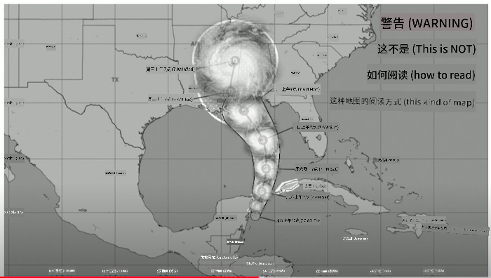
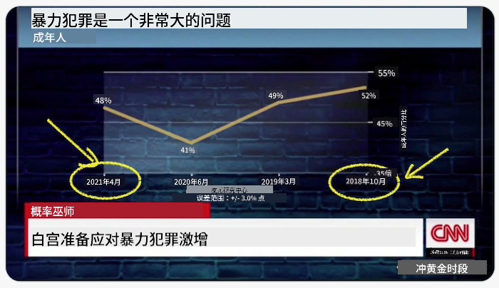
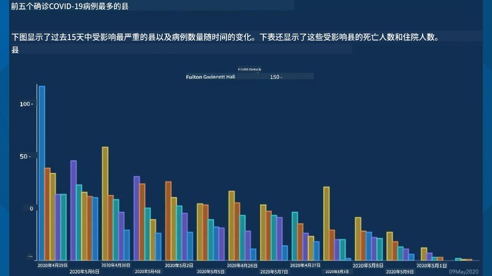
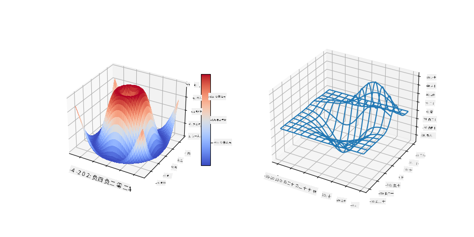
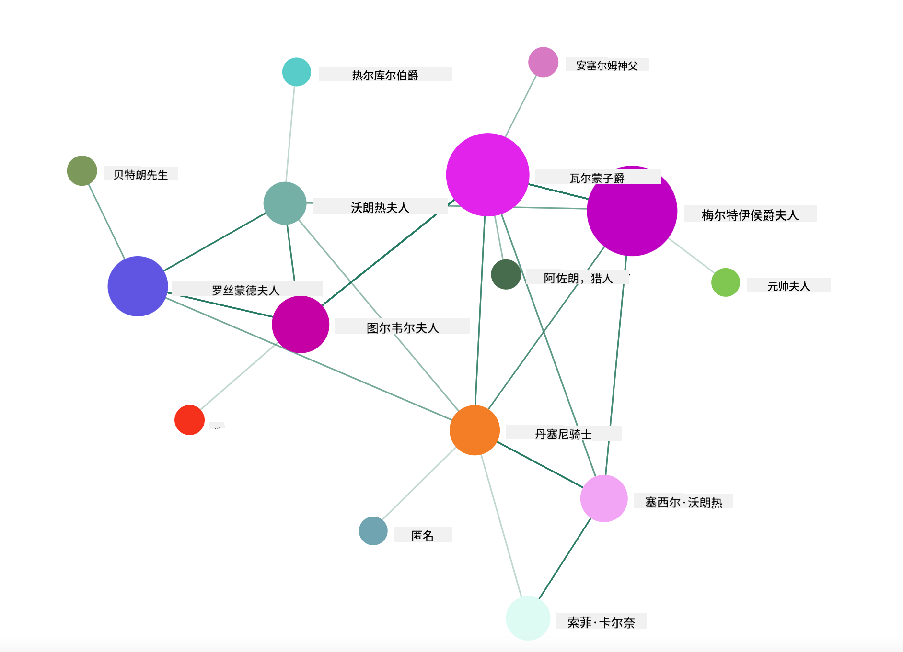

<!--
CO_OP_TRANSLATOR_METADATA:
{
  "original_hash": "4ec4747a9f4f7d194248ea29903ae165",
  "translation_date": "2025-08-25T17:58:46+00:00",
  "source_file": "3-Data-Visualization/13-meaningful-visualizations/README.md",
  "language_code": "zh"
}
-->
# 创建有意义的数据可视化

| ](../../sketchnotes/13-MeaningfulViz.png)|
|:---:|
| 有意义的数据可视化 - _Sketchnote by [@nitya](https://twitter.com/nitya)_ |

> “如果你对数据施加足够的压力，它会承认任何事情” -- [Ronald Coase](https://en.wikiquote.org/wiki/Ronald_Coase)

数据科学家的基本技能之一是能够创建有意义的数据可视化，以帮助回答你可能提出的问题。在可视化数据之前，你需要确保数据已经像之前课程中那样被清理和准备好。之后，你就可以开始决定如何最好地呈现数据。

在本课中，你将学习：

1. 如何选择正确的图表类型
2. 如何避免误导性图表
3. 如何使用颜色
4. 如何为图表设计样式以提高可读性
5. 如何构建动画或3D图表解决方案
6. 如何构建创意可视化

## [课前测验](https://purple-hill-04aebfb03.1.azurestaticapps.net/quiz/24)

## 选择正确的图表类型

在之前的课程中，你已经尝试使用 Matplotlib 和 Seaborn 构建各种有趣的数据可视化。通常，你可以使用以下表格选择适合问题的[正确图表类型](https://chartio.com/learn/charts/how-to-select-a-data-vizualization/)：

| 你的需求是：             | 你应该使用：                 |
| ----------------------- | --------------------------- |
| 展示随时间变化的数据趋势 | 折线图                       |
| 比较类别               | 柱状图、饼图                 |
| 比较总量               | 饼图、堆叠柱状图             |
| 展示关系               | 散点图、折线图、分面图、双折线图 |
| 展示分布               | 散点图、直方图、箱线图       |
| 展示比例               | 饼图、圆环图、华夫图         |

> ✅ 根据数据的组成，你可能需要将其从文本转换为数值，以支持某些图表类型。

## 避免误导

即使数据科学家谨慎选择了适合数据的正确图表，也有很多方法可以通过展示数据来证明某种观点，往往以牺牲数据本身为代价。有许多误导性图表和信息图的例子！

[](https://www.youtube.com/watch?v=oX74Nge8Wkw "How charts lie")

> 🎥 点击上方图片观看关于误导性图表的会议演讲

这个图表颠倒了 X 轴，以日期为基础展示了与事实相反的内容：



[这个图表](https://media.firstcoastnews.com/assets/WTLV/images/170ae16f-4643-438f-b689-50d66ca6a8d8/170ae16f-4643-438f-b689-50d66ca6a8d8_1140x641.jpg) 更具误导性，因为视觉上吸引人们得出结论认为随着时间推移，各县的 COVID 病例有所下降。实际上，如果仔细查看日期，你会发现日期被重新排列以制造这种误导性的下降趋势。



这个臭名昭著的例子使用颜色和颠倒的 Y 轴来误导：与得出枪击事件在通过支持枪支的立法后激增的结论相反，视觉上却让人误以为情况正好相反：


这个奇怪的图表展示了比例如何被操纵，效果令人捧腹：


比较不可比的事物是另一种不正当的手段。有一个[精彩的网站](https://tylervigen.com/spurious-correlations)专门展示“虚假的相关性”，例如缅因州的离婚率与人造黄油的消费量之间的“事实”相关性。一个 Reddit 群组也收集了[数据的丑陋用法](https://www.reddit.com/r/dataisugly/top/?t=all)。

理解视觉如何容易被误导性图表欺骗是很重要的。即使数据科学家的意图是好的，选择错误的图表类型，例如显示过多类别的饼图，也可能具有误导性。

## 颜色

你在上面“佛罗里达枪支暴力”图表中看到，颜色可以为图表提供额外的意义层次，尤其是那些没有使用 Matplotlib 和 Seaborn 等库设计的图表，这些库自带各种经过验证的颜色库和调色板。如果你手动制作图表，可以稍微研究一下[颜色理论](https://colormatters.com/color-and-design/basic-color-theory)。

> ✅ 在设计图表时，请注意可访问性是可视化的重要方面。你的部分用户可能是色盲——你的图表是否对视觉障碍用户友好？

选择图表颜色时要小心，因为颜色可能传递你未曾预料的含义。上面“身高”图表中的“粉色女士”传递了一种明显的“女性化”含义，进一步增加了图表本身的怪异感。

虽然[颜色含义](https://colormatters.com/color-symbolism/the-meanings-of-colors)可能因地区而异，并且根据色调的不同而改变，但一般来说，颜色含义包括：

| 颜色   | 含义                 |
| ------ | ------------------- |
| 红色   | 力量                 |
| 蓝色   | 信任、忠诚           |
| 黄色   | 快乐、警告           |
| 绿色   | 生态、幸运、嫉妒     |
| 紫色   | 快乐                 |
| 橙色   | 活力                 |

如果你需要为图表选择自定义颜色，请确保你的图表既可访问又符合你想要传递的含义。

## 为图表设计样式以提高可读性

如果图表不可读，它就没有意义！花点时间考虑调整图表的宽度和高度，使其与数据比例良好。如果需要显示一个变量（例如所有50个州），尽量在 Y 轴上垂直显示，以避免水平滚动的图表。

标注你的轴线，必要时提供图例，并提供工具提示以更好地理解数据。

如果你的数据在 X 轴上是文本且冗长，可以将文本倾斜以提高可读性。[Matplotlib](https://matplotlib.org/stable/tutorials/toolkits/mplot3d.html) 提供了 3D 绘图功能，如果你的数据支持它。可以使用 `mpl_toolkits.mplot3d` 生成复杂的数据可视化。



## 动画和3D图表显示

如今一些最佳的数据可视化是动画化的。Shirley Wu 使用 D3 制作了令人惊叹的作品，例如“[电影之花](http://bl.ocks.org/sxywu/raw/d612c6c653fb8b4d7ff3d422be164a5d/)”，每朵花都是一部电影的可视化。另一个为《卫报》制作的例子是“Bussed Out”，一个结合 Greensock 和 D3 的交互式体验，外加滚动叙事文章格式，展示纽约市如何通过将无家可归者送出城市来处理其无家可归问题。


> “Bussed Out: How America Moves its Homeless” 来自 [卫报](https://www.theguardian.com/us-news/ng-interactive/2017/dec/20/bussed-out-america-moves-homeless-people-country-study)。可视化由 Nadieh Bremer 和 Shirley Wu 制作

虽然本课不足以深入教授这些强大的可视化库，但可以尝试在 Vue.js 应用中使用 D3，利用一个库展示《危险关系》这本书的动画化社交网络可视化。

> 《危险关系》是一部书信体小说，即以一系列信件形式呈现的小说。由 Choderlos de Laclos 于1782年创作，讲述了18世纪末法国贵族中两位主角——瓦尔蒙子爵和梅尔特伊侯爵夫人——恶毒且道德败坏的社交操纵故事。两人最终都走向毁灭，但在此之前造成了巨大的社会破坏。小说通过写给圈内各种人的信件展开，信件内容包括复仇计划或单纯制造麻烦。创建一个这些信件的可视化，发现叙事中的主要关键人物。

你将完成一个网络应用程序，显示这个社交网络的动画化视图。它使用一个库来创建一个[网络可视化](https://github.com/emiliorizzo/vue-d3-network)，基于 Vue.js 和 D3。当应用程序运行时，你可以在屏幕上拖动节点以重新排列数据。



## 项目：使用 D3.js 构建一个网络图表

> 本课文件夹包含一个 `solution` 文件夹，你可以在其中找到完整的项目供参考。

1. 按照起始文件夹根目录中的 README.md 文件中的说明操作。确保你的机器上运行了 NPM 和 Node.js，然后安装项目依赖项。

2. 打开 `starter/src` 文件夹。你会发现一个 `assets` 文件夹，其中有一个 .json 文件，包含小说中的所有信件，编号，并带有“to”和“from”注释。

3. 完成 `components/Nodes.vue` 中的代码以启用可视化。找到名为 `createLinks()` 的方法，并添加以下嵌套循环。

循环遍历 .json 对象以捕获信件的“to”和“from”数据，并构建 `links` 对象，以便可视化库可以使用它：

```javascript
//loop through letters
      let f = 0;
      let t = 0;
      for (var i = 0; i < letters.length; i++) {
          for (var j = 0; j < characters.length; j++) {
              
            if (characters[j] == letters[i].from) {
              f = j;
            }
            if (characters[j] == letters[i].to) {
              t = j;
            }
        }
        this.links.push({ sid: f, tid: t });
      }
  ```

从终端运行你的应用程序（npm run serve），享受可视化效果！

## 🚀 挑战

浏览互联网，发现误导性可视化。作者是如何欺骗用户的，这是否是故意的？尝试修正这些可视化，展示它们应该如何呈现。

## [课后测验](https://purple-hill-04aebfb03.1.azurestaticapps.net/quiz/25)

## 复习与自学

以下是一些关于误导性数据可视化的文章：

https://gizmodo.com/how-to-lie-with-data-visualization-1563576606

http://ixd.prattsi.org/2017/12/visual-lies-usability-in-deceptive-data-visualizations/

看看这些关于历史资产和文物的有趣可视化：

https://handbook.pubpub.org/

阅读这篇关于动画如何增强可视化的文章：

https://medium.com/@EvanSinar/use-animation-to-supercharge-data-visualization-cd905a882ad4

## 作业

[创建你自己的自定义可视化](assignment.md)

**免责声明**：  
本文档使用AI翻译服务 [Co-op Translator](https://github.com/Azure/co-op-translator) 进行翻译。尽管我们努力确保翻译的准确性，但请注意，自动翻译可能包含错误或不准确之处。原始语言的文档应被视为权威来源。对于关键信息，建议使用专业人工翻译。我们不对因使用此翻译而产生的任何误解或误读承担责任。